# FastAPI应用架构

<cite>
**本文引用的文件**   
- [main.py](file://backend/app/main.py)
- [config.py](file://backend/app/config.py)
- [db.py](file://backend/app/db.py)
- [game_errors.py](file://backend/app/game_errors.py)
- [auth_service.py](file://backend/app/auth_service.py)
- [db_models.py](file://backend/app/db_models.py)
- [models.py](file://backend/app/models.py)
- [game.py](file://backend/app/api/game.py)
- [auth.py](file://backend/app/api/auth.py)
- [admin.py](file://backend/app/api/admin.py)
</cite>

## 目录
1. [简介](#简介)
2. [项目结构](#项目结构)
3. [核心组件](#核心组件)
4. [架构总览](#架构总览)
5. [详细组件分析](#详细组件分析)
6. [依赖关系分析](#依赖关系分析)
7. [性能考量](#性能考量)
8. [故障排查指南](#故障排查指南)
9. [结论](#结论)
10. [附录](#附录)

## 简介
本文件系统化梳理 Macau Mystery 后端 FastAPI 应用的架构与实现，覆盖应用启动流程、生命周期管理（lifespan）、中间件机制、CORS 配置、异常处理策略与错误响应格式、路由组织与 API 版本管理、健康检查端点、依赖注入模式、配置与环境变量管理、数据库连接管理以及演示数据引导机制。文档面向不同技术背景的读者，提供从高层概览到代码级细节的渐进式说明，并辅以可视化图示帮助理解。

## 项目结构
后端采用模块化分层组织：
- 应用入口与生命周期：main.py
- 配置与环境变量：config.py
- 数据库引擎与会话：db.py
- 领域模型与持久化模型：models.py、db_models.py
- 业务服务层：game_service.py（游戏推进）
- 认证与用户服务：auth_service.py
- API 路由分组：api/game.py、api/auth.py、api/admin.py 等
- 统一错误类型：game_errors.py

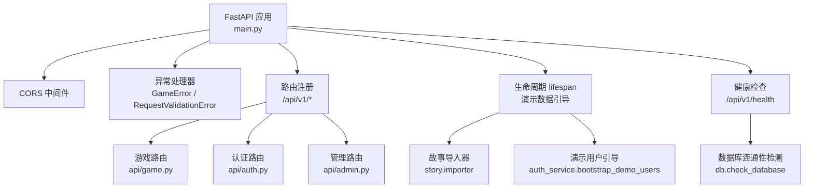

**图表来源** 
- [main.py:17-107](file://backend/app/main.py#L17-L107)
- [db.py:35-42](file://backend/app/db.py#L35-L42)

**章节来源**
- [main.py:17-107](file://backend/app/main.py#L17-L107)
- [config.py:38-77](file://backend/app/config.py#L38-L77)
- [db.py:12-27](file://backend/app/db.py#L12-L27)

## 核心组件
- 应用工厂与生命周期：create_app 构建 FastAPI 实例，定义 lifespan 钩子用于启动时执行演示数据引导；注册全局异常处理器与 CORS 中间件；挂载各模块路由与健康检查。
- 配置系统：Settings dataclass 通过环境变量加载配置，支持布尔解析、CORS 源列表、正整数校验与默认值；提供 is_production 判断。
- 数据库层：异步引擎创建、SQLite 外键与忙超时设置、会话工厂、会话依赖 get_db_session 与健康检查 check_database。
- 领域模型：Pydantic 模型定义游戏契约（请求/响应），SQLAlchemy 模型定义持久化表结构与约束。
- 业务服务：GameService 封装事务性游戏推进逻辑，包括开始游戏、选择推进、状态快照生成、幂等重放、线索发放与结局判定。
- 认证服务：用户注册/登录、Bearer Token 鉴权、管理员权限校验、演示用户引导。

**章节来源**
- [main.py:17-107](file://backend/app/main.py#L17-L107)
- [config.py:38-77](file://backend/app/config.py#L38-L77)
- [db.py:12-42](file://backend/app/db.py#L12-L42)
- [models.py:8-92](file://backend/app/models.py#L8-L92)
- [db_models.py:24-160](file://backend/app/db_models.py#L24-L160)
- [game_service.py:31-386](file://backend/app/game_service.py#L31-L386)
- [auth_service.py:59-153](file://backend/app/auth_service.py#L59-L153)

## 架构总览
FastAPI 应用以 create_app 为入口，通过 lifespan 在进程启动阶段完成演示数据初始化；中间件层统一处理跨域；异常处理器统一返回结构化错误；路由按功能划分并以 /api/v1 前缀进行版本化管理；健康检查端点对外暴露服务可用性。

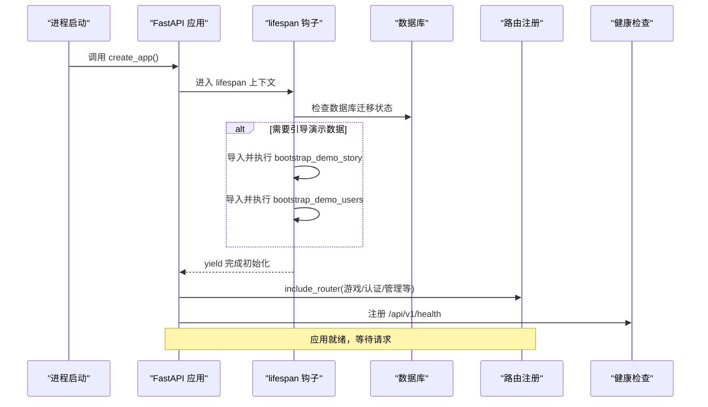

**图表来源** 
- [main.py:20-36](file://backend/app/main.py#L20-L36)
- [main.py:98-106](file://backend/app/main.py#L98-L106)
- [db.py:35-42](file://backend/app/db.py#L35-L42)

**章节来源**
- [main.py:20-36](file://backend/app/main.py#L20-L36)
- [main.py:98-106](file://backend/app/main.py#L98-L106)

## 详细组件分析

### 应用启动与生命周期管理
- 应用工厂 create_app：读取 Settings，定义 lifespan，注册异常处理器与中间件，挂载路由与健康检查。
- lifespan 钩子：根据配置决定是否执行演示故事与演示用户的引导；若数据库未迁移则抛出明确错误提示。
- 健康检查：/api/v1/health 调用 check_database 返回 ok 或 degraded 状态，包含版本号。

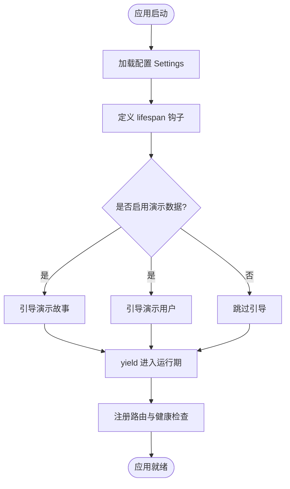

**图表来源** 
- [main.py:17-36](file://backend/app/main.py#L17-L36)
- [main.py:98-106](file://backend/app/main.py#L98-L106)

**章节来源**
- [main.py:17-36](file://backend/app/main.py#L17-L36)
- [main.py:98-106](file://backend/app/main.py#L98-L106)

### 中间件与CORS配置
- 使用 CORSMiddleware 允许指定来源、携带凭证、所有方法与头。
- 来源列表由配置项 cors_origins 控制，默认开发环境允许本地前端地址。

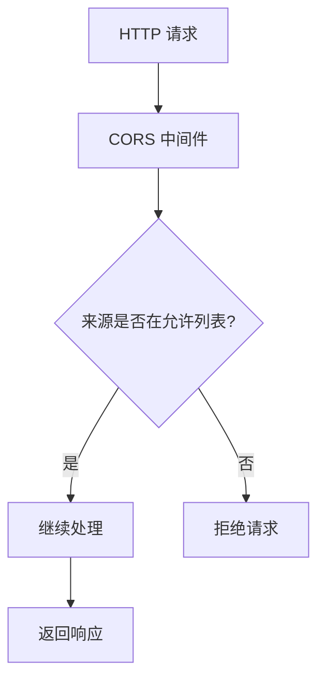

**图表来源** 
- [main.py:76-82](file://backend/app/main.py#L76-L82)
- [config.py:19-23](file://backend/app/config.py#L19-L23)

**章节来源**
- [main.py:76-82](file://backend/app/main.py#L76-L82)
- [config.py:19-23](file://backend/app/config.py#L19-L23)

### 异常处理策略与错误响应格式
- GameError：自定义业务异常，包含 status_code、code、message、details，统一由异常处理器转换为 JSONResponse。
- RequestValidationError：针对 /api/v1/game 路径的请求验证错误，返回标准化 VALIDATION_ERROR 结构；其他路径使用默认处理器。
- 错误响应体统一包含 error.code、error.message、error.details。

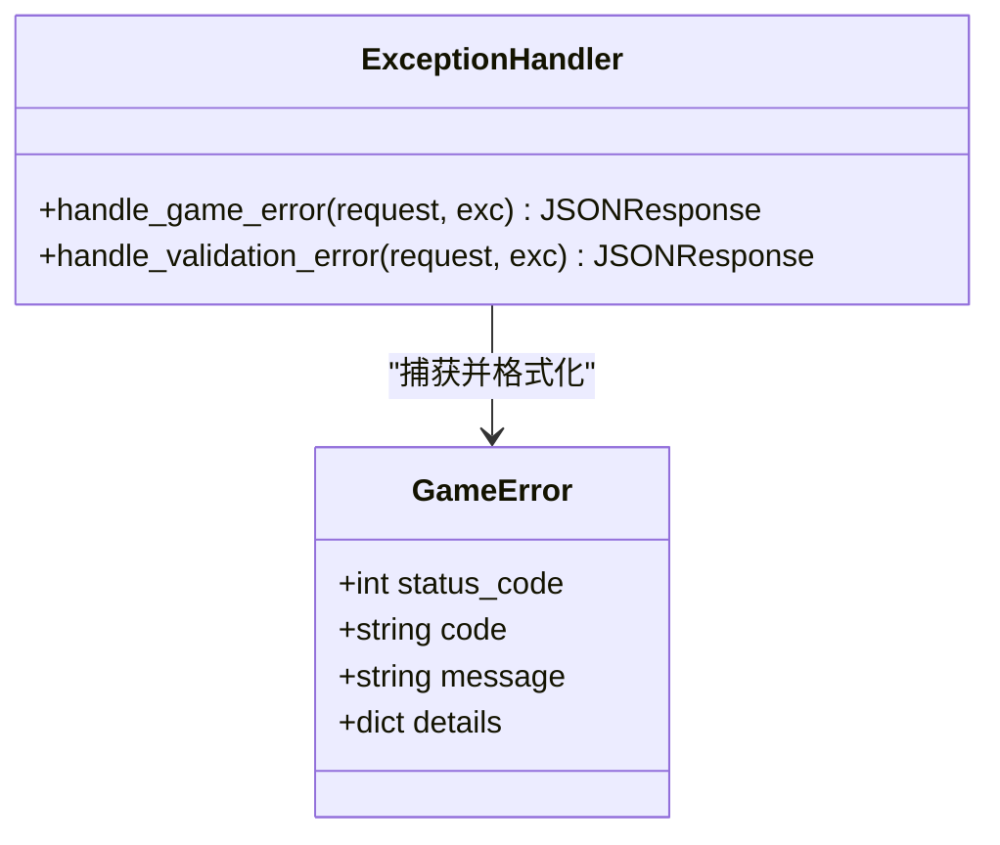

**图表来源** 
- [game_errors.py:7-20](file://backend/app/game_errors.py#L7-L20)
- [main.py:38-74](file://backend/app/main.py#L38-L74)

**章节来源**
- [game_errors.py:7-20](file://backend/app/game_errors.py#L7-L20)
- [main.py:38-74](file://backend/app/main.py#L38-L74)

### 路由组织与API版本管理
- 路由按功能划分为 game、ai、create、admin、auth、ugc，均以前缀 /api/v1 进行版本化管理。
- 每个路由模块内使用 APIRouter 定义具体端点，并通过 Depends 注入数据库会话。

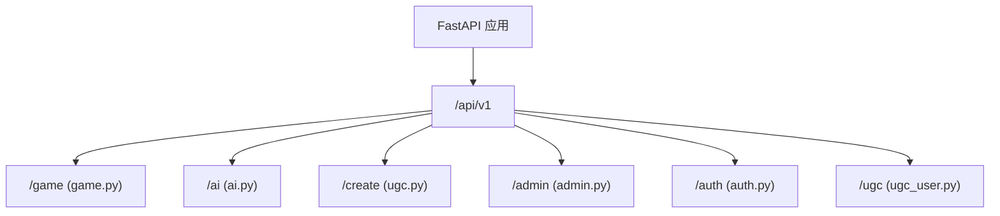

**图表来源** 
- [main.py:84-96](file://backend/app/main.py#L84-L96)
- [game.py:12-37](file://backend/app/api/game.py#L12-L37)
- [auth.py:24-97](file://backend/app/api/auth.py#L24-L97)
- [admin.py:12-218](file://backend/app/api/admin.py#L12-L218)

**章节来源**
- [main.py:84-96](file://backend/app/main.py#L84-L96)
- [game.py:12-37](file://backend/app/api/game.py#L12-L37)
- [auth.py:24-97](file://backend/app/api/auth.py#L24-L97)
- [admin.py:12-218](file://backend/app/api/admin.py#L12-L218)

### 健康检查端点实现
- GET /api/v1/health：调用 check_database 检测数据库连通性，返回 ok 或 degraded 状态，附带版本号。

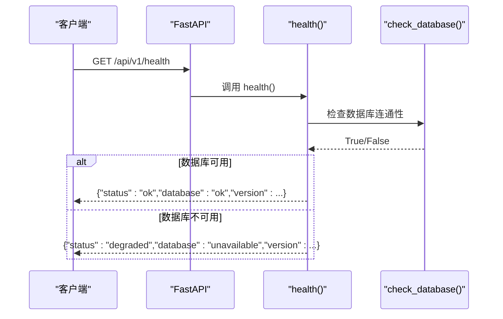

**图表来源** 
- [main.py:98-106](file://backend/app/main.py#L98-L106)
- [db.py:35-42](file://backend/app/db.py#L35-L42)

**章节来源**
- [main.py:98-106](file://backend/app/main.py#L98-L106)
- [db.py:35-42](file://backend/app/db.py#L35-L42)

### 依赖注入模式的使用
- 数据库会话：get_db_session 作为 FastAPI 依赖，自动创建与释放 AsyncSession。
- 认证鉴权：authenticate_bearer 与 require_admin 在路由中通过 Header 获取 Authorization 并校验。
- 业务服务：GameService(session) 在路由中通过 Depends(get_db_session) 注入会话。

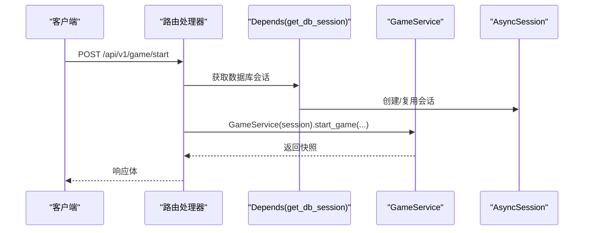

**图表来源** 
- [game.py:15-21](file://backend/app/api/game.py#L15-L21)
- [db.py:30-33](file://backend/app/db.py#L30-L33)
- [auth_service.py:100-131](file://backend/app/auth_service.py#L100-L131)

**章节来源**
- [game.py:15-21](file://backend/app/api/game.py#L15-L21)
- [db.py:30-33](file://backend/app/db.py#L30-L33)
- [auth_service.py:100-131](file://backend/app/auth_service.py#L100-L131)

### 配置管理系统与环境变量处理
- Settings dataclass 字段：database_url、cors_origins、app_env、bootstrap_*、auth_token_ttl_hours、demo_* 账户等。
- 环境变量：APP_ENV、DATABASE_URL、CORS_ORIGINS、BOOTSTRAP_DEMO_STORY、BOOTSTRAP_DEMO_USERS、AUTH_TOKEN_TTL_HOURS、DEMO_*。
- 辅助函数：_as_bool、_cors_origins、_positive_int 负责类型转换与校验。

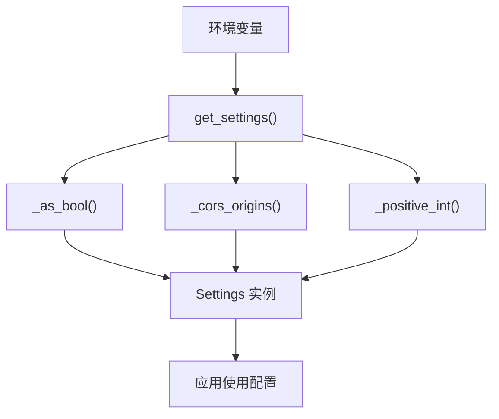

**图表来源** 
- [config.py:13-36](file://backend/app/config.py#L13-L36)
- [config.py:56-77](file://backend/app/config.py#L56-L77)

**章节来源**
- [config.py:13-36](file://backend/app/config.py#L13-L36)
- [config.py:56-77](file://backend/app/config.py#L56-L77)

### 数据库连接管理与演示数据引导
- 引擎创建：create_async_engine 配合 pool_pre_ping，SQLite 下开启外键与忙超时。
- 会话工厂：async_sessionmaker 创建 AsyncSession，expire_on_commit=False。
- 演示数据：lifespan 中根据配置执行 bootstrap_demo_story 与 bootstrap_demo_users；后者创建管理员与访客账户（如不存在）。

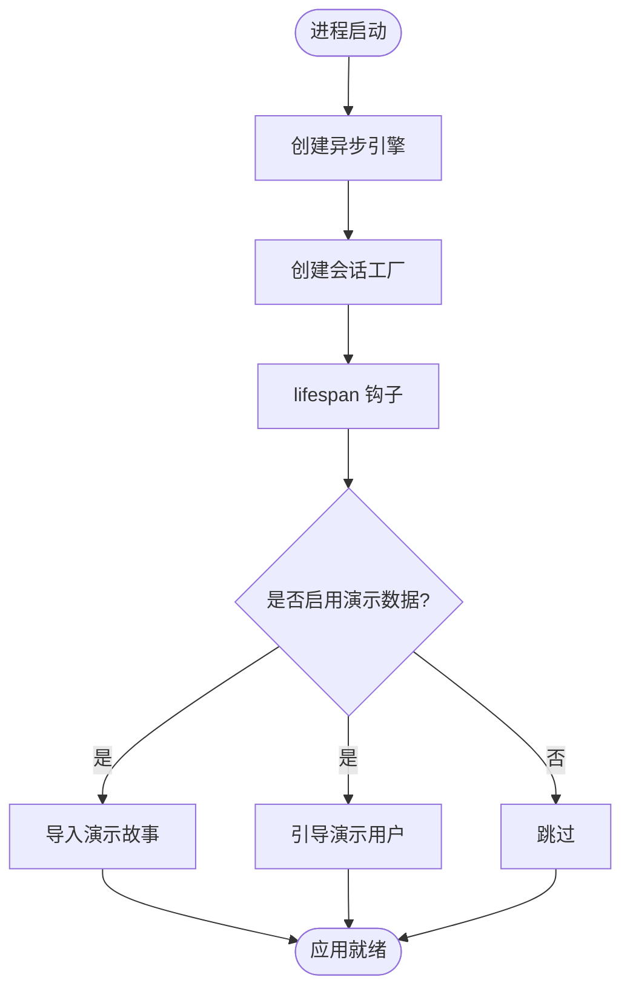

**图表来源** 
- [db.py:12-27](file://backend/app/db.py#L12-L27)
- [main.py:20-34](file://backend/app/main.py#L20-L34)
- [auth_service.py:133-153](file://backend/app/auth_service.py#L133-L153)

**章节来源**
- [db.py:12-27](file://backend/app/db.py#L12-L27)
- [main.py:20-34](file://backend/app/main.py#L20-L34)
- [auth_service.py:133-153](file://backend/app/auth_service.py#L133-L153)

### 游戏服务与事务性推进逻辑
- start_game：校验已发布故事与活跃版本，创建会话与初始事件，返回快照。
- make_choice：幂等处理（基于 request_id 重放）、并发锁（with_for_update）、状态机推进、线索发放、结局判定。
- _snapshot：组装当前场景、章节进度、线索列表与可选奖励线索。

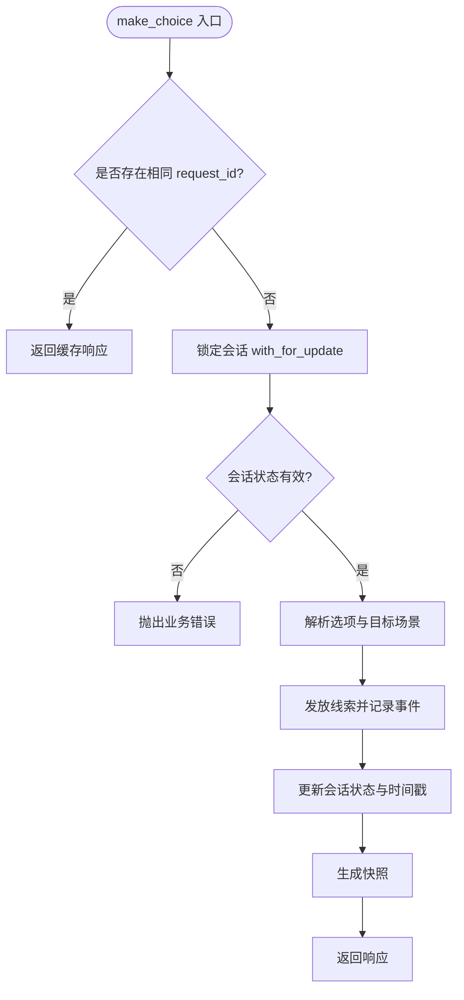

**图表来源** 
- [game_service.py:70-193](file://backend/app/game_service.py#L70-L193)

**章节来源**
- [game_service.py:70-193](file://backend/app/game_service.py#L70-L193)

### 认证与授权流程
- 登录：校验用户名与密码，创建认证会话并返回 token 与用户信息。
- 注册：校验用户名与昵称，唯一性约束，创建用户与认证会话。
- 鉴权：authenticate_bearer 解析 Authorization 头，校验令牌有效期与用户状态；require_admin 进一步校验角色。

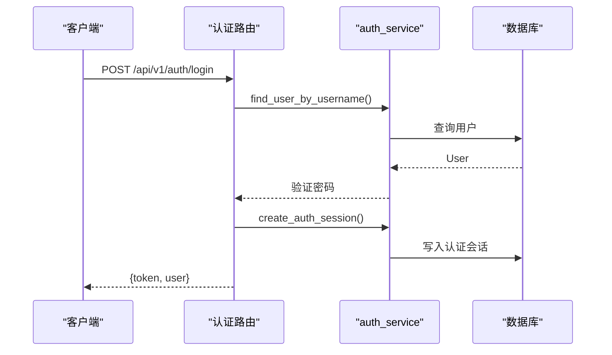

**图表来源** 
- [auth.py:64-72](file://backend/app/api/auth.py#L64-L72)
- [auth_service.py:59-98](file://backend/app/auth_service.py#L59-L98)

**章节来源**
- [auth.py:64-72](file://backend/app/api/auth.py#L64-L72)
- [auth_service.py:59-98](file://backend/app/auth_service.py#L59-L98)

## 依赖关系分析
- main.py 依赖 config、db、game_errors，并引入各路由模块。
- api/game.py 依赖 db、game_service、models。
- api/auth.py 依赖 auth_service、db、db_models。
- game_service.py 依赖 db_models、models、story.*、config、game_errors。
- auth_service.py 依赖 config、db、db_models。

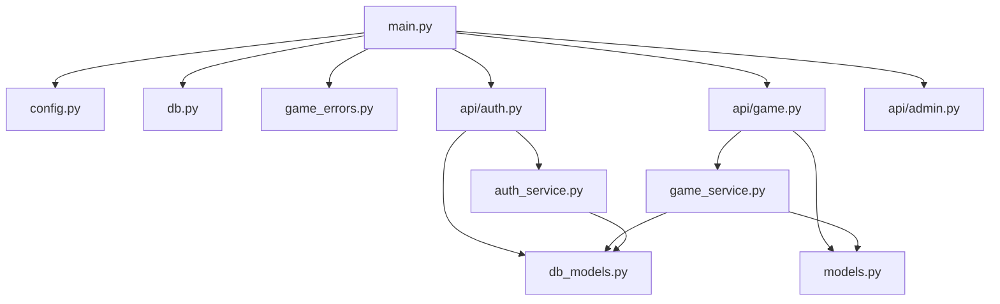

**图表来源** 
- [main.py:84-96](file://backend/app/main.py#L84-L96)
- [game.py:1-37](file://backend/app/api/game.py#L1-37)
- [auth.py:1-97](file://backend/app/api/auth.py#L1-97)
- [game_service.py:1-30](file://backend/app/game_service.py#L1-L30)
- [auth_service.py:1-25](file://backend/app/auth_service.py#L1-L25)

**章节来源**
- [main.py:84-96](file://backend/app/main.py#L84-L96)
- [game.py:1-37](file://backend/app/api/game.py#L1-37)
- [auth.py:1-97](file://backend/app/api/auth.py#L1-97)
- [game_service.py:1-30](file://backend/app/game_service.py#L1-L30)
- [auth_service.py:1-25](file://backend/app/auth_service.py#L1-L25)

## 性能考量
- 数据库连接池：pool_pre_ping 确保连接有效性；SQLite 下启用外键与忙超时提升稳定性。
- 会话复用：async_sessionmaker 减少会话创建开销；expire_on_commit=False 避免提交后失效。
- 并发控制：make_choice 使用 with_for_update 防止竞态条件；SQLite 特殊处理 BEGIN IMMEDIATE。
- 幂等性：request_id 去重与响应缓存降低重复请求成本。
- 生产环境媒体就绪检查：避免运行时缺失资源导致失败。

[本节为通用指导，不直接分析具体文件]

## 故障排查指南
- 数据库未迁移：lifespan 中捕获 SQLAlchemyError 并抛出 RuntimeError 提示执行 alembic upgrade head。
- 健康检查降级：/api/v1/health 返回 degraded 表示数据库不可用，需检查连接与迁移状态。
- 请求验证失败：/api/v1/game 路径返回 VALIDATION_ERROR 结构，检查字段类型与格式。
- 会话状态冲突：SESSION_COMPLETED、SESSION_NOT_ACTIVE、STALE_SCENE 等错误码指示会话状态异常。
- 幂等冲突：IDEMPOTENCY_CONFLICT 表示 request_id 被用于不同请求，需调整客户端重试策略。

**章节来源**
- [main.py:32-34](file://backend/app/main.py#L32-L34)
- [main.py:98-106](file://backend/app/main.py#L98-L106)
- [main.py:51-74](file://backend/app/main.py#L51-L74)
- [game_service.py:100-113](file://backend/app/game_service.py#L100-L113)
- [game_service.py:353-368](file://backend/app/game_service.py#L353-L368)

## 结论
该 FastAPI 应用通过清晰的模块化设计与统一的异常与错误响应格式，提供了健壮的游戏推进与认证能力。生命周期管理确保演示数据可配置引导，CORS 与中间件机制保障跨域与安全性。数据库层与业务服务层解耦良好，依赖注入简化了资源管理。整体架构具备良好的可扩展性与可维护性，适合持续迭代与规模化部署。

[本节为总结性内容，不直接分析具体文件]

## 附录
- API 版本管理：所有路由以 /api/v1 前缀组织，便于后续演进与兼容。
- 健康检查：/api/v1/health 提供快速可用性探测。
- 配置项清单：详见 Settings 字段与环境变量映射。

[本节为补充信息，不直接分析具体文件]