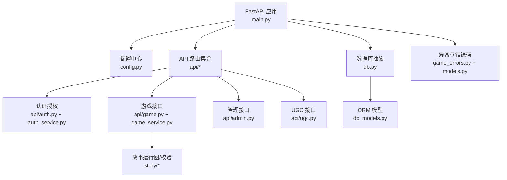
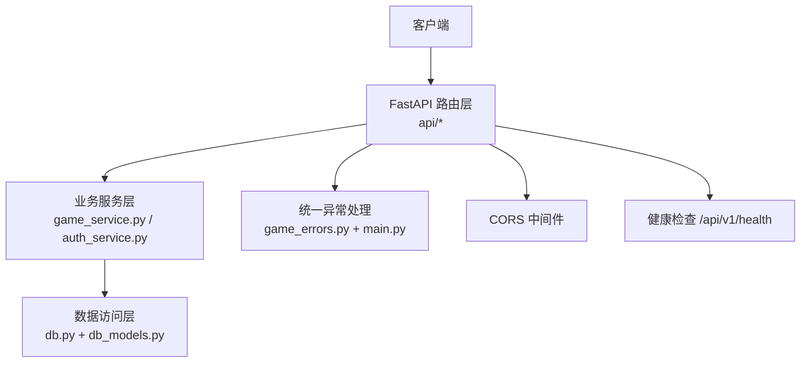
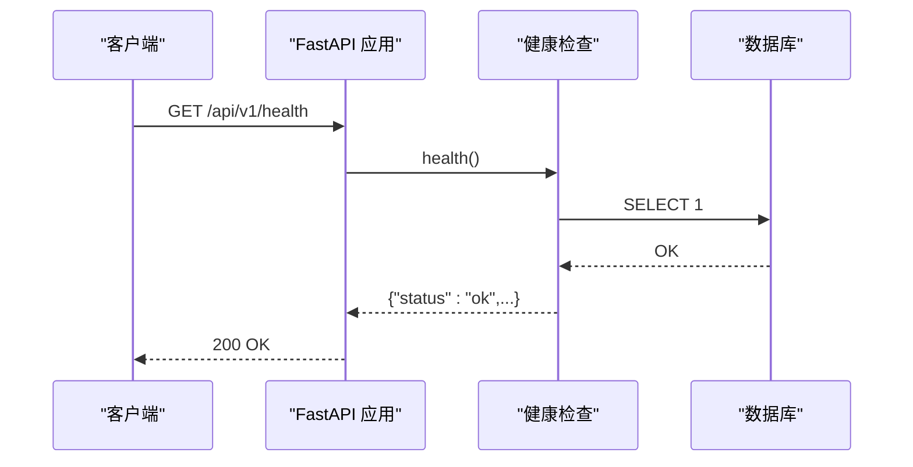
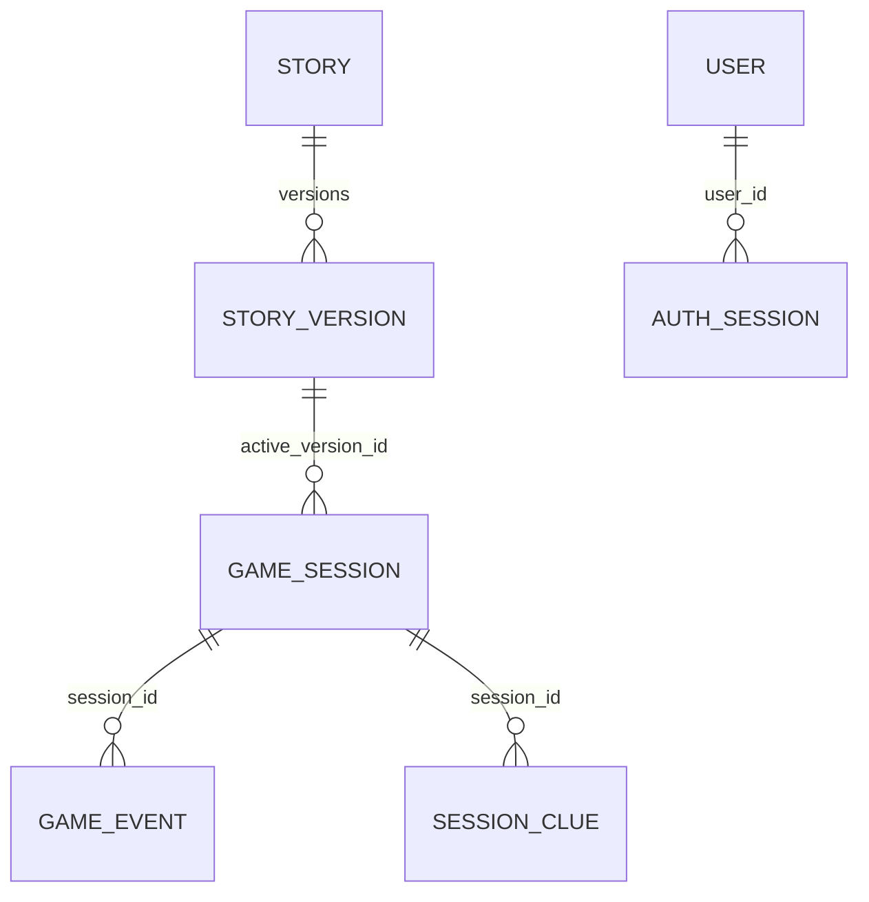
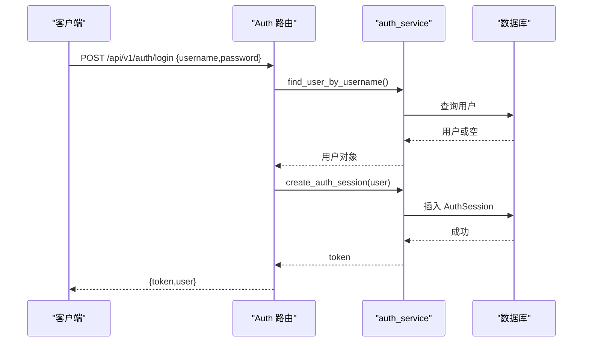
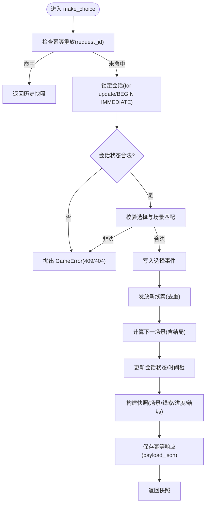
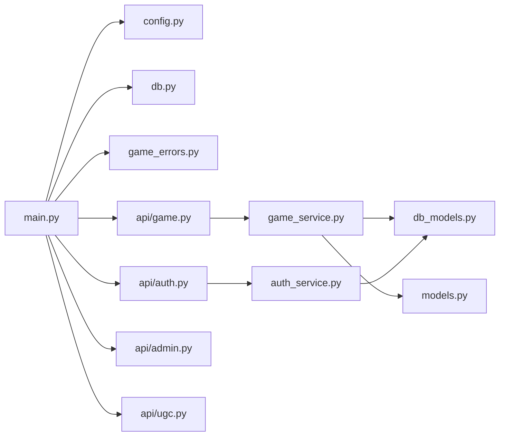

# 后端架构

<cite>
**本文引用的文件**   
- [backend/app/main.py](file://backend/app/main.py)
- [backend/app/config.py](file://backend/app/config.py)
- [backend/app/db.py](file://backend/app/db.py)
- [backend/app/db_models.py](file://backend/app/db_models.py)
- [backend/app/auth_service.py](file://backend/app/auth_service.py)
- [backend/app/models.py](file://backend/app/models.py)
- [backend/app/game_errors.py](file://backend/app/game_errors.py)
- [backend/app/api/auth.py](file://backend/app/api/auth.py)
- [backend/app/api/game.py](file://backend/app/api/game.py)
- [backend/app/api/admin.py](file://backend/app/api/admin.py)
- [backend/app/api/ugc.py](file://backend/app/api/ugc.py)
- [backend/app/game_service.py](file://backend/app/game_service.py)
- [backend/app/story/engine.py](file://backend/app/story/engine.py)
- [backend/Dockerfile](file://backend/Dockerfile)
- [backend/requirements.txt](file://backend/requirements.txt)
</cite>

## 目录
1. [简介](#简介)
2. [项目结构](#项目结构)
3. [核心组件](#核心组件)
4. [架构总览](#架构总览)
5. [详细组件分析](#详细组件分析)
6. [依赖关系分析](#依赖关系分析)
7. [性能考量](#性能考量)
8. [故障排查指南](#故障排查指南)
9. [结论](#结论)
10. [附录](#附录)

## 简介
本文件为澳秘 Macau Mystery 后端架构的全面文档，聚焦 FastAPI 应用的设计与实现。内容涵盖模块化组织、依赖注入模式、中间件机制、RESTful API 设计规范、请求处理流程、异常处理策略；数据库抽象层设计、ORM 模型定义与事务管理；认证授权系统（基于持久化令牌）、JWT 替代方案与权限控制；API 版本管理、错误码规范与日志记录策略；以及面向后端的最佳实践建议。

## 项目结构
后端采用按功能域划分的模块组织方式：
- 入口与生命周期：FastAPI 应用创建、全局异常处理器、CORS 中间件、路由挂载、健康检查
- 配置与环境：Settings 数据类、环境变量解析、默认值与校验
- 数据库层：异步引擎、会话工厂、健康检查、SQLAlchemy ORM 模型
- 业务服务：游戏状态机与事务编排、AI/NPC/TTS 能力、UGC 生成
- API 路由：auth、game、admin、ugc 等子路由
- 运行时故事引擎：剧本加载、状态机、选择处理（内存版）
- 部署与依赖：Dockerfile、requirements.txt

**图表来源** 
- [backend/app/main.py:17-107](file://backend/app/main.py#L17-L107)
- [backend/app/config.py:38-77](file://backend/app/config.py#L38-L77)
- [backend/app/db.py:12-42](file://backend/app/db.py#L12-L42)
- [backend/app/db_models.py:24-160](file://backend/app/db_models.py#L24-L160)
- [backend/app/api/auth.py:24-97](file://backend/app/api/auth.py#L24-L97)
- [backend/app/api/game.py:12-37](file://backend/app/api/game.py#L12-L37)
- [backend/app/api/admin.py:12-218](file://backend/app/api/admin.py#L12-L218)
- [backend/app/api/ugc.py:1-35](file://backend/app/api/ugc.py#L1-L35)
- [backend/app/game_service.py:31-386](file://backend/app/game_service.py#L31-L386)
- [backend/app/story/engine.py:9-37](file://backend/app/story/engine.py#L9-L37)
- [backend/app/game_errors.py:7-20](file://backend/app/game_errors.py#L7-L20)
- [backend/app/models.py:8-146](file://backend/app/models.py#L8-L146)

**章节来源**
- [backend/app/main.py:17-107](file://backend/app/main.py#L17-L107)
- [backend/app/config.py:38-77](file://backend/app/config.py#L38-L77)
- [backend/app/db.py:12-42](file://backend/app/db.py#L12-L42)
- [backend/app/db_models.py:24-160](file://backend/app/db_models.py#L24-L160)

## 核心组件
- 应用装配器 create_app：注册异常处理器、CORS 中间件、挂载各子路由、暴露健康检查端点
- 配置 Settings：集中读取环境变量，提供布尔/整型/CORS 源等类型安全配置
- 数据库抽象：异步引擎与 SessionLocal，SQLite 外键与忙超时设置，健康检查 SQL
- 认证授权：用户名密码登录/注册、Bearer 令牌鉴权、管理员权限校验、演示账号初始化
- 游戏服务：事务化的开始游戏、选择推进、状态查询、幂等重放、线索发放与结局判定
- 模型与契约：Pydantic 请求/响应模型，严格字段校验与额外字段禁止
- 错误体系：统一 GameError 异常与 FastAPI 验证异常的统一返回格式

**章节来源**
- [backend/app/main.py:17-107](file://backend/app/main.py#L17-L107)
- [backend/app/config.py:38-77](file://backend/app/config.py#L38-L77)
- [backend/app/db.py:12-42](file://backend/app/db.py#L12-L42)
- [backend/app/auth_service.py:59-153](file://backend/app/auth_service.py#L59-L153)
- [backend/app/game_service.py:31-386](file://backend/app/game_service.py#L31-L386)
- [backend/app/models.py:8-146](file://backend/app/models.py#L8-L146)
- [backend/app/game_errors.py:7-20](file://backend/app/game_errors.py#L7-L20)

## 架构总览
整体采用“路由层 -> 服务层 -> 数据层”的分层架构，配合 FastAPI 的依赖注入与中间件机制，形成清晰的职责边界与可扩展性。

**图表来源** 
- [backend/app/main.py:76-107](file://backend/app/main.py#L76-L107)
- [backend/app/api/game.py:12-37](file://backend/app/api/game.py#L12-L37)
- [backend/app/api/auth.py:24-97](file://backend/app/api/auth.py#L24-L97)
- [backend/app/game_service.py:31-386](file://backend/app/game_service.py#L31-L386)
- [backend/app/auth_service.py:59-153](file://backend/app/auth_service.py#L59-L153)
- [backend/app/db.py:12-42](file://backend/app/db.py#L12-L42)
- [backend/app/db_models.py:24-160](file://backend/app/db_models.py#L24-L160)

## 详细组件分析

### 应用装配与中间件
- 应用启动生命周期：根据配置可选地执行演示数据初始化（故事与用户），失败时提示迁移未执行
- 全局异常处理器：GameError 统一返回 error.code/message/details；请求校验异常在 /api/v1/game 路径下返回标准化格式
- 中间件：CORS 允许跨域，凭据开启，方法与头放行
- 路由挂载：/api/v1/{game,ai,create,admin,auth,ugc}
- 健康检查：/api/v1/health 通过数据库连通性判断服务状态

**图表来源** 
- [backend/app/main.py:17-107](file://backend/app/main.py#L17-L107)
- [backend/app/db.py:35-42](file://backend/app/db.py#L35-L42)

**章节来源**
- [backend/app/main.py:17-107](file://backend/app/main.py#L17-L107)

### 配置与环境
- Settings 数据类：包含数据库 URL、CORS 源、环境标识、演示开关、令牌 TTL、演示账号等
- 类型转换与校验：布尔、正整数、逗号分隔的 CORS 源，缺失时使用默认值
- 生产环境标志：is_production 用于媒体就绪检查等分支逻辑

**章节来源**
- [backend/app/config.py:38-77](file://backend/app/config.py#L38-L77)

### 数据库抽象与 ORM
- 引擎与会话：create_async_engine + async_sessionmaker，expire_on_commit=False 避免提交后失效
- SQLite 优化：连接事件启用外键约束与 busy_timeout
- 健康检查：SELECT 1 快速探测
- ORM 模型：
  - Story/StoryVersion：故事与版本化管理，JSON 存储内容，唯一性与状态约束
  - GameSession/GameEvent/SessionClue：会话、事件流水、线索获取
  - User/AuthSession：用户与认证会话（令牌摘要、过期时间）

**图表来源** 
- [backend/app/db_models.py:24-160](file://backend/app/db_models.py#L24-L160)

**章节来源**
- [backend/app/db.py:12-42](file://backend/app/db.py#L12-L42)
- [backend/app/db_models.py:24-160](file://backend/app/db_models.py#L24-L160)

### 认证与授权
- 登录/注册：用户名/密码校验、昵称规范化、密码哈希存储、创建认证会话并返回令牌
- 鉴权：Bearer 令牌校验，查找有效且未过期的 AuthSession，更新 last_used_at
- 权限控制：require_admin 校验角色为 admin
- 演示账号：启动时按需初始化 admin/guest 账户

**图表来源** 
- [backend/app/api/auth.py:64-87](file://backend/app/api/auth.py#L64-L87)
- [backend/app/auth_service.py:59-98](file://backend/app/auth_service.py#L59-L98)
- [backend/app/db_models.py:128-160](file://backend/app/db_models.py#L128-L160)

**章节来源**
- [backend/app/api/auth.py:24-97](file://backend/app/api/auth.py#L24-L97)
- [backend/app/auth_service.py:59-153](file://backend/app/auth_service.py#L59-L153)

### 游戏 API 与服务
- 路由：/start、/choice、/state/{session_id}
- 服务：
  - start_game：校验已发布故事与媒体就绪，创建会话与初始事件，返回快照
  - make_choice：并发安全（for update）、幂等重放、选择合法性校验、线索发放、状态推进与结局判定
  - get_state：按 session_id 返回当前场景、线索、进度与结局信息
- 幂等性：通过 request_id 去重，重复请求直接返回历史响应
- 并发控制：PostgreSQL 使用 for update，SQLite 使用 BEGIN IMMEDIATE 包裹事务

**图表来源** 
- [backend/app/game_service.py:70-193](file://backend/app/game_service.py#L70-L193)
- [backend/app/game_service.py:353-376](file://backend/app/game_service.py#L353-L376)

**章节来源**
- [backend/app/api/game.py:12-37](file://backend/app/api/game.py#L12-L37)
- [backend/app/game_service.py:31-386](file://backend/app/game_service.py#L31-L386)

### 管理接口与 UGC
- 管理接口：脚本 CRUD、发布/下架、统计、提交审核、路线配置（内存存储，便于演示）
- UGC 接口：一句话生成短剧（Mock），后续可接入 LLM

**章节来源**
- [backend/app/api/admin.py:12-218](file://backend/app/api/admin.py#L12-L218)
- [backend/app/api/ugc.py:1-35](file://backend/app/api/ugc.py#L1-L35)

### 故事引擎（内存版）
- 提供基于 JSON 剧本的内存状态机，支持加载、开始、选择与状态查询
- 与持久化版本的故事运行图/校验解耦，便于本地调试与演示

**章节来源**
- [backend/app/story/engine.py:9-37](file://backend/app/story/engine.py#L9-L37)

## 依赖关系分析
- 外部依赖：FastAPI、Uvicorn、SQLAlchemy、异步驱动（aiosqlite/asyncpg）、Alembic、OpenAI、ChromaDB、edge-tts、Pydantic、pwdlib、httpx、测试框架
- 内部依赖：
  - main.py 依赖 config、db、game_errors，挂载 api/* 路由
  - api/* 依赖 db、auth_service、models、game_service
  - game_service 依赖 db_models、models、config、story.* 校验与运行图
  - auth_service 依赖 db_models、config、pwdlib

**图表来源** 
- [backend/app/main.py:84-96](file://backend/app/main.py#L84-L96)
- [backend/app/api/game.py:12-37](file://backend/app/api/game.py#L12-L37)
- [backend/app/api/auth.py:24-97](file://backend/app/api/auth.py#L24-L97)
- [backend/app/game_service.py:31-386](file://backend/app/game_service.py#L31-L386)
- [backend/app/auth_service.py:59-153](file://backend/app/auth_service.py#L59-L153)
- [backend/app/models.py:8-146](file://backend/app/models.py#L8-L146)
- [backend/app/db_models.py:24-160](file://backend/app/db_models.py#L24-L160)

**章节来源**
- [backend/requirements.txt:1-17](file://backend/requirements.txt#L1-L17)

## 性能考量
- 异步 IO：FastAPI + SQLAlchemy 异步引擎，提升并发处理能力
- 数据库连接池：pool_pre_ping 确保连接有效性；SQLite 启用外键与忙超时
- 事务与锁：PostgreSQL 行级锁（with_for_update），SQLite 使用 BEGIN IMMEDIATE 保证一致性
- 幂等重放：减少重复计算与写放大，提高吞吐
- 模型序列化：response_model_exclude_none 减少响应体积
- 生产环境媒体就绪检查：提前拦截未就绪资源，避免运行时失败

[本节为通用指导，不直接分析具体文件]

## 故障排查指南
- 健康检查失败：检查数据库连接与迁移是否完成（alembic upgrade head）
- 认证失败：确认 Authorization: Bearer <token> 是否正确传递，令牌是否过期，用户是否激活
- 选择冲突：检查 scene_id 是否为当前场景、choice_id 是否属于该场景、会话是否已完成
- 幂等冲突：request_id 重复但请求体不一致将触发冲突错误
- 故事数据异常：校验 story 版本内容与运行图一致性，检查媒体状态

**章节来源**
- [backend/app/main.py:38-74](file://backend/app/main.py#L38-L74)
- [backend/app/game_service.py:70-193](file://backend/app/game_service.py#L70-L193)
- [backend/app/auth_service.py:100-131](file://backend/app/auth_service.py#L100-L131)

## 结论
本后端以 FastAPI 为核心，结合 SQLAlchemy 异步 ORM 与 Pydantic 模型，构建了清晰的分层架构与统一的异常/错误码体系。认证授权采用持久化令牌方案，满足无状态前端的安全需求。游戏服务通过事务与幂等机制保障一致性与高可用。建议在后续迭代中补充结构化日志、指标采集与更完善的限流与审计能力。

[本节为总结性内容，不直接分析具体文件]

## 附录

### API 版本管理与路由
- 版本前缀：/api/v1/{game,ai,create,admin,auth,ugc}
- 健康检查：/api/v1/health

**章节来源**
- [backend/app/main.py:91-105](file://backend/app/main.py#L91-L105)

### 错误码规范
- GameError：统一 code/message/details 结构，HTTP 状态码由异常携带
- 请求校验：VALIDATION_ERROR，path/msg/type 明细

**章节来源**
- [backend/app/game_errors.py:7-20](file://backend/app/game_errors.py#L7-L20)
- [backend/app/main.py:51-74](file://backend/app/main.py#L51-L74)

### 日志记录策略（建议）
- 应用启动与生命周期事件：记录初始化、演示数据导入结果
- 请求/响应日志：仅记录必要元数据（方法、路径、耗时、状态码），避免敏感信息
- 错误日志：捕获 GameError 与数据库异常，附带上下文（session_id、version_id）
- 审计日志：认证、权限变更、关键操作（发布/删除）

[本节为通用指导，不直接分析具体文件]

### 部署与运行
- Docker 镜像：基于 python:3.11-slim，安装依赖，暴露 8000 端口
- 启动命令：uvicorn app.main:app --host 0.0.0.0 --port 8000

**章节来源**
- [backend/Dockerfile:1-13](file://backend/Dockerfile#L1-L13)