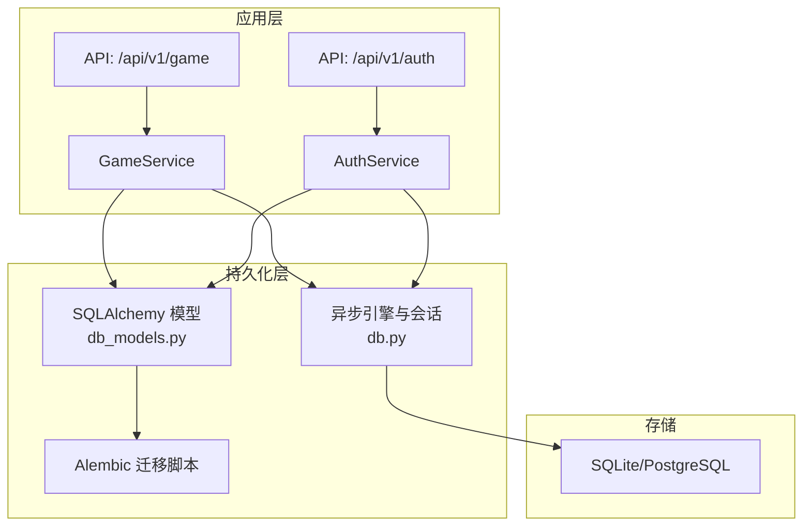
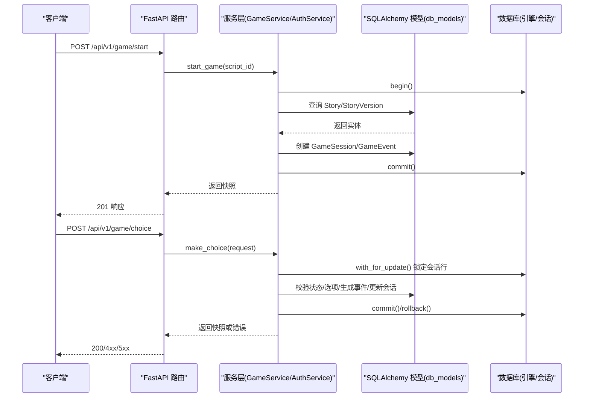
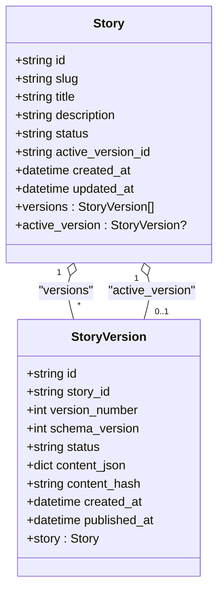
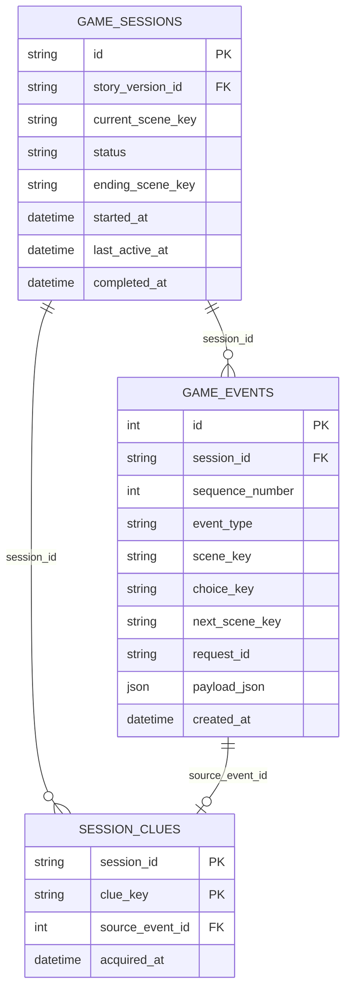
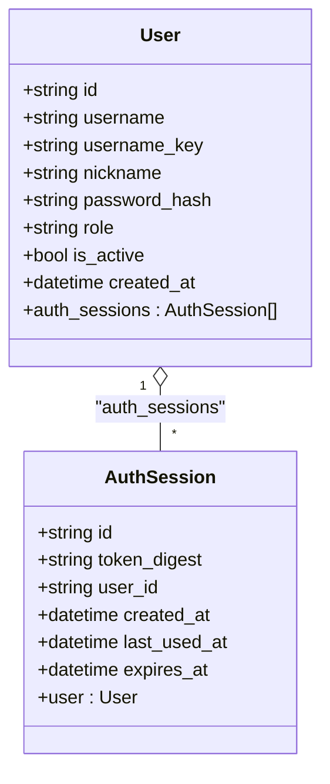
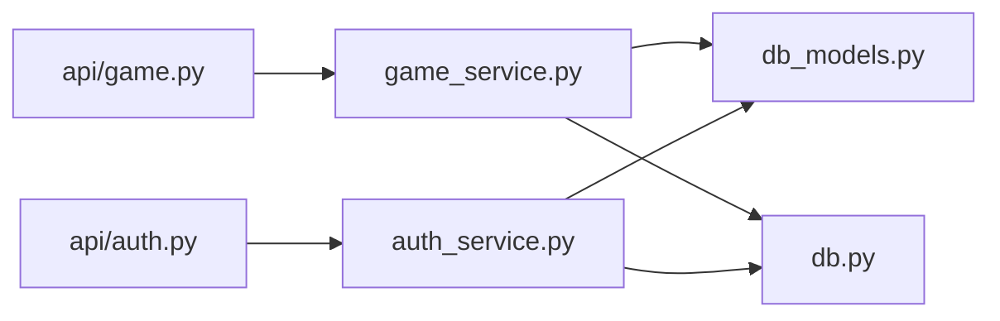

# ORM模型设计

<cite>
**本文引用的文件**   
- [db_models.py](file://backend/app/db_models.py)
- [db.py](file://backend/app/db.py)
- [game_service.py](file://backend/app/game_service.py)
- [auth_service.py](file://backend/app/auth_service.py)
- [api/game.py](file://backend/app/api/game.py)
- [api/auth.py](file://backend/app/api/auth.py)
- [20260803_0001_game_persistence.py](file://backend/alembic/versions/20260803_0001_game_persistence.py)
- [20260804_0002_auth_persistence.py](file://backend/alembic/versions/20260804_0002_auth_persistence.py)
- [test_game_api.py](file://backend/tests/test_game_api.py)
- [test_auth_api.py](file://backend/tests/test_auth_api.py)
</cite>

## 目录
1. [简介](#简介)
2. [项目结构](#项目结构)
3. [核心组件](#核心组件)
4. [架构总览](#架构总览)
5. [详细组件分析](#详细组件分析)
6. [依赖关系分析](#依赖关系分析)
7. [性能考量](#性能考量)
8. [故障排查指南](#故障排查指南)
9. [结论](#结论)
10. [附录：使用示例与最佳实践](#附录使用示例与最佳实践)

## 简介
本文件围绕 SQLAlchemy ORM 模型设计与实现，系统性阐述 Base 类、字段映射、关系定义、约束条件（检查约束、唯一性约束、外键级联），并深入解释 Story、StoryVersion、GameSession、GameEvent、SessionClue、User、AuthSession 等核心模型的设计思路与字段含义。文档同时给出表间关系映射（一对一、一对多、多对一）、数据验证规则、事务与并发控制要点，以及模型在 API 与服务层中的使用方式与最佳实践。

## 项目结构
后端采用 FastAPI + SQLAlchemy 异步引擎 + Alembic 迁移的架构。ORM 模型集中在 db_models.py；数据库连接与会话管理在 db.py；业务逻辑通过 game_service.py 和 auth_service.py 组织；API 路由分别位于 api/game.py 与 api/auth.py；数据库迁移脚本位于 alembic/versions。测试覆盖端到端流程与认证流程。

图表来源
- [db_models.py:1-160](file://backend/app/db_models.py#L1-L160)
- [db.py:1-42](file://backend/app/db.py#L1-L42)
- [api/game.py:1-37](file://backend/app/api/game.py#L1-L37)
- [api/auth.py:1-97](file://backend/app/api/auth.py#L1-L97)

章节来源
- [db_models.py:1-160](file://backend/app/db_models.py#L1-L160)
- [db.py:1-42](file://backend/app/db.py#L1-L42)
- [api/game.py:1-37](file://backend/app/api/game.py#L1-L37)
- [api/auth.py:1-97](file://backend/app/api/auth.py#L1-L97)

## 核心组件
- Base：DeclarativeBase 基类，所有模型继承自它，用于声明式表映射。
- 故事与版本：Story、StoryVersion，支持版本化内容管理与活跃版本引用。
- 游戏会话与事件：GameSession、GameEvent、SessionClue，记录玩家进度、选择事件与线索获取。
- 用户与认证：User、AuthSession，用户名密码登录与令牌会话持久化。

章节来源
- [db_models.py:20-160](file://backend/app/db_models.py#L20-L160)

## 架构总览
下图展示从 API 到 ORM 模型的调用链与数据流，体现事务边界、幂等性与并发控制。

图表来源
- [api/game.py:15-36](file://backend/app/api/game.py#L15-L36)
- [game_service.py:35-193](file://backend/app/game_service.py#L35-L193)
- [db.py:30-33](file://backend/app/db.py#L30-L33)

## 详细组件分析

### Base 与通用工具
- Base：DeclarativeBase 子类，作为所有 ORM 模型的基类。
- utc_now/new_uuid：提供 UTC 时间戳与 UUID 默认值生成器，确保时间与时空标识一致性。

章节来源
- [db_models.py:12-22](file://backend/app/db_models.py#L12-L22)

### Story 与 StoryVersion（版本化剧本）
- Story
  - 主键 id（UUID），slug 唯一索引，title/description/status 等元信息。
  - active_version_id 指向当前活跃版本，允许 SET NULL 删除保护。
  - 关系：
    - versions：一对多关联 StoryVersion（反向 back_populates）。
    - active_version：一对一延迟加载（post_update=True 避免插入顺序问题）。
  - 约束：CheckConstraint 限制 status 枚举值。
- StoryVersion
  - 主键 id，story_id 外键 RESTRICT 防止误删。
  - version_number/schema_version/status/content_json/content_hash 等版本元数据。
  - 唯一约束：(story_id, version_number)、(story_id, content_hash)。
  - 关系：story 反向关联 Story。

图表来源
- [db_models.py:24-71](file://backend/app/db_models.py#L24-L71)

章节来源
- [db_models.py:24-71](file://backend/app/db_models.py#L24-L71)
- [20260803_0001_game_persistence.py:17-68](file://backend/alembic/versions/20260803_0001_game_persistence.py#L17-L68)

### GameSession、GameEvent、SessionClue（游戏进程与事件）
- GameSession
  - 主键 id，story_version_id 外键 RESTRICT，current_scene_key/status/ending_scene_key 等状态字段。
  - 时间戳 started_at/last_active_at/completed_at。
  - 约束：status 枚举 CheckConstraint。
- GameEvent
  - 自增主键 id，session_id 外键 CASCADE，sequence_number/event_type/scene_key/choice_key/next_scene_key/request_id/payload_json 等事件详情。
  - 唯一约束：(session_id, sequence_number)、(session_id, request_id) 保证序列与幂等。
- SessionClue
  - 复合主键 (session_id, clue_key)，source_event_id 外键 SET NULL，acquired_at 获取时间。

图表来源
- [db_models.py:74-127](file://backend/app/db_models.py#L74-L127)
- [20260803_0001_game_persistence.py:70-112](file://backend/alembic/versions/20260803_0001_game_persistence.py#L70-L112)

章节来源
- [db_models.py:74-127](file://backend/app/db_models.py#L74-L127)
- [20260803_0001_game_persistence.py:70-112](file://backend/alembic/versions/20260803_0001_game_persistence.py#L70-L112)

### User 与 AuthSession（用户与认证会话）
- User
  - 主键 id，username/username_key/nickname/password_hash/role/is_active 等。
  - 约束：role 枚举 CheckConstraint；username_key 唯一索引。
  - 关系：auth_sessions 一对多关联 AuthSession。
- AuthSession
  - 主键 id，token_digest 唯一索引，user_id 外键 CASCADE，created_at/last_used_at/expires_at 等。
  - 关系：user 反向关联 User。

图表来源
- [db_models.py:128-160](file://backend/app/db_models.py#L128-L160)
- [20260804_0002_auth_persistence.py:17-46](file://backend/alembic/versions/20260804_0002_auth_persistence.py#L17-L46)

章节来源
- [db_models.py:128-160](file://backend/app/db_models.py#L128-L160)
- [20260804_0002_auth_persistence.py:17-46](file://backend/alembic/versions/20260804_0002_auth_persistence.py#L17-L46)

### 关系与约束总结
- 一对多：
  - Story -> StoryVersion（versions）
  - User -> AuthSession（auth_sessions）
  - GameSession -> GameEvent（通过 session_id）
  - GameSession -> SessionClue（通过 session_id）
- 多对一：
  - StoryVersion -> Story（story）
  - AuthSession -> User（user）
  - SessionClue -> GameEvent（source_event_id，SET NULL）
- 一对一：
  - Story.active_version -> StoryVersion（延迟加载 post_update）
- 外键级联：
  - GameEvent.session_id CASCADE（会话删除时级联清理事件）
  - SessionClue.session_id CASCADE
  - AuthSession.user_id CASCADE
  - Story.active_version_id SET NULL（版本删除时清空活跃版本）
  - SessionClue.source_event_id SET NULL（事件删除时保留线索但清空来源）
- 检查约束：
  - stories.status IN ('draft','published','retired')
  - story_versions.status IN ('draft','published','retired')
  - game_sessions.status IN ('active','completed','abandoned')
  - users.role IN ('admin','user')
- 唯一约束：
  - stories.slug
  - story_versions(story_id, version_number)
  - story_versions(story_id, content_hash)
  - game_events(session_id, sequence_number)
  - game_events(session_id, request_id)
  - users.username_key
  - auth_sessions.token_digest

章节来源
- [db_models.py:24-160](file://backend/app/db_models.py#L24-L160)
- [20260803_0001_game_persistence.py:17-112](file://backend/alembic/versions/20260803_0001_game_persistence.py#L17-L112)
- [20260804_0002_auth_persistence.py:17-46](file://backend/alembic/versions/20260804_0002_auth_persistence.py#L17-L46)

## 依赖关系分析
- API 路由依赖服务层：
  - api/game.py 调用 GameService.start_game/make_choice/get_state。
  - api/auth.py 调用 AuthService.create_user/create_auth_session/find_user_by_username/authenticate_bearer。
- 服务层依赖 ORM 模型：
  - GameService 直接操作 GameSession/GameEvent/SessionClue/Story/StoryVersion。
  - AuthService 直接操作 User/AuthSession。
- 数据库配置：
  - db.py 提供异步引擎与会话工厂，并在 SQLite 下启用外键与忙超时。

图表来源
- [api/game.py:1-37](file://backend/app/api/game.py#L1-L37)
- [api/auth.py:1-97](file://backend/app/api/auth.py#L1-L97)
- [game_service.py:1-386](file://backend/app/game_service.py#L1-L386)
- [auth_service.py:1-153](file://backend/app/auth_service.py#L1-L153)
- [db.py:1-42](file://backend/app/db.py#L1-L42)

章节来源
- [api/game.py:1-37](file://backend/app/api/game.py#L1-L37)
- [api/auth.py:1-97](file://backend/app/api/auth.py#L1-L97)
- [game_service.py:1-386](file://backend/app/game_service.py#L1-L386)
- [auth_service.py:1-153](file://backend/app/auth_service.py#L1-L153)
- [db.py:1-42](file://backend/app/db.py#L1-L42)

## 性能考量
- 异步会话与连接池：
  - create_async_engine 配合 pool_pre_ping 提升连接健康检查能力。
  - SQLite 下启用 PRAGMA foreign_keys=ON 与 busy_timeout=5000，增强并发与锁等待行为。
- 事务与锁：
  - 选择分支使用 with_for_update() 锁定会话行，避免并发竞态。
  - SQLite 特殊处理 BEGIN IMMEDIATE，确保串行写入。
- 幂等与重放：
  - 通过 (session_id, request_id) 唯一约束与幂等记录，避免重复提交导致的状态不一致。
- 查询优化：
  - 常用字段建立索引（如 game_sessions.story_version_id、game_events.session_id、users.username_key、auth_sessions.token_digest/user_id）。
  - 批量 flush 减少往返开销。

章节来源
- [db.py:12-23](file://backend/app/db.py#L12-L23)
- [game_service.py:70-103](file://backend/app/game_service.py#L70-L103)
- [20260803_0001_game_persistence.py:84-102](file://backend/alembic/versions/20260803_0001_game_persistence.py#L84-L102)
- [20260804_0002_auth_persistence.py:32-46](file://backend/alembic/versions/20260804_0002_auth_persistence.py#L32-L46)

## 故障排查指南
- 常见错误码与场景：
  - STORY_NOT_FOUND：未找到已发布的剧本。
  - STORY_NOT_PUBLISHED/STORY_NOT_READY：剧本未发布或缺少可用版本。
  - SESSION_NOT_FOUND：会话不存在。
  - SESSION_COMPLETED/SESSION_NOT_ACTIVE：会话状态不允许继续。
  - STALE_SCENE：提交的场景不是当前场景。
  - CHOICE_NOT_AVAILABLE：选择的选项不属于当前场景。
  - IDEMPOTENCY_CONFLICT：request_id 冲突或幂等记录异常。
- 定位步骤：
  - 检查会话状态与当前场景是否匹配。
  - 核对 request_id 的唯一性与幂等记录是否存在。
  - 查看事件序列号与选择事件是否正确写入。
  - 确认外键约束与唯一约束是否触发异常。
- 日志与调试：
  - 利用 payload_json 记录请求与响应快照，便于回溯。
  - 使用 get_state 接口恢复会话状态进行对比。

章节来源
- [game_service.py:100-193](file://backend/app/game_service.py#L100-L193)
- [game_service.py:353-386](file://backend/app/game_service.py#L353-L386)
- [test_game_api.py:90-210](file://backend/tests/test_game_api.py#L90-L210)

## 结论
该 ORM 设计以版本化故事为核心，结合会话与事件驱动的游戏推进机制，辅以用户与认证会话的持久化，形成完整且可扩展的数据模型体系。通过严格的约束与事务控制，保证了数据一致性与并发安全。服务层将业务逻辑与数据访问解耦，API 层提供清晰的契约与错误封装，整体架构清晰、可维护性强。

## 附录：使用示例与最佳实践

### 模型使用示例（路径指引）
- 启动游戏会话与选择分支：
  - API：POST /api/v1/game/start、POST /api/v1/game/choice、GET /api/v1/game/state/{session_id}
  - 参考：[api/game.py:15-36](file://backend/app/api/game.py#L15-L36)
- 用户注册与登录：
  - API：POST /api/v1/auth/register、POST /api/v1/auth/login、GET /api/v1/auth/me
  - 参考：[api/auth.py:64-97](file://backend/app/api/auth.py#L64-L97)
- 服务层调用：
  - GameService.start_game/make_choice/get_state
  - AuthService.create_user/create_auth_session/find_user_by_username/authenticate_bearer
  - 参考：[game_service.py:35-193](file://backend/app/game_service.py#L35-L193)、[auth_service.py:63-124](file://backend/app/auth_service.py#L63-L124)

### 最佳实践
- 使用 with_for_update() 锁定关键行，避免并发写冲突。
- 通过唯一约束与幂等记录保障重复提交的安全性。
- 使用 CheckConstraint 与 UniqueConstraint 在数据库层强制业务规则。
- 合理设置外键级联策略（CASCADE/RESTRICT/SET NULL）以维护数据完整性。
- 使用 UTC 时间与 UUID 保证跨时区与分布式环境的一致性。
- 在 SQLite 环境下显式启用外键与忙超时，提升稳定性。

章节来源
- [game_service.py:70-103](file://backend/app/game_service.py#L70-L103)
- [db_models.py:24-160](file://backend/app/db_models.py#L24-L160)
- [db.py:12-23](file://backend/app/db.py#L12-L23)
- [test_game_api.py:90-210](file://backend/tests/test_game_api.py#L90-L210)
- [test_auth_api.py:66-127](file://backend/tests/test_auth_api.py#L66-L127)