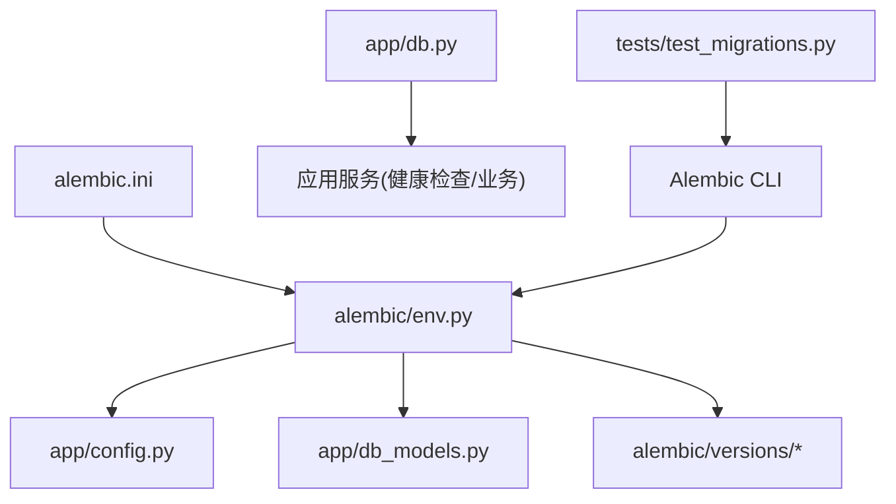
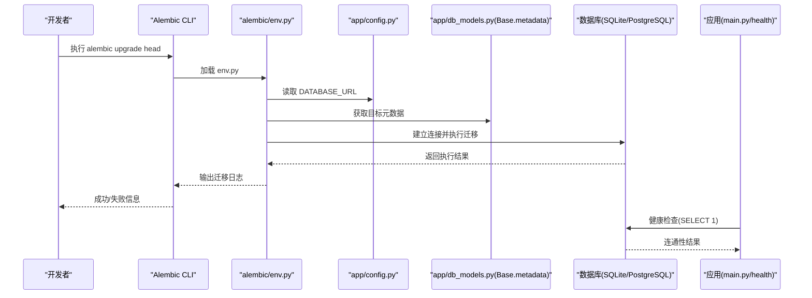
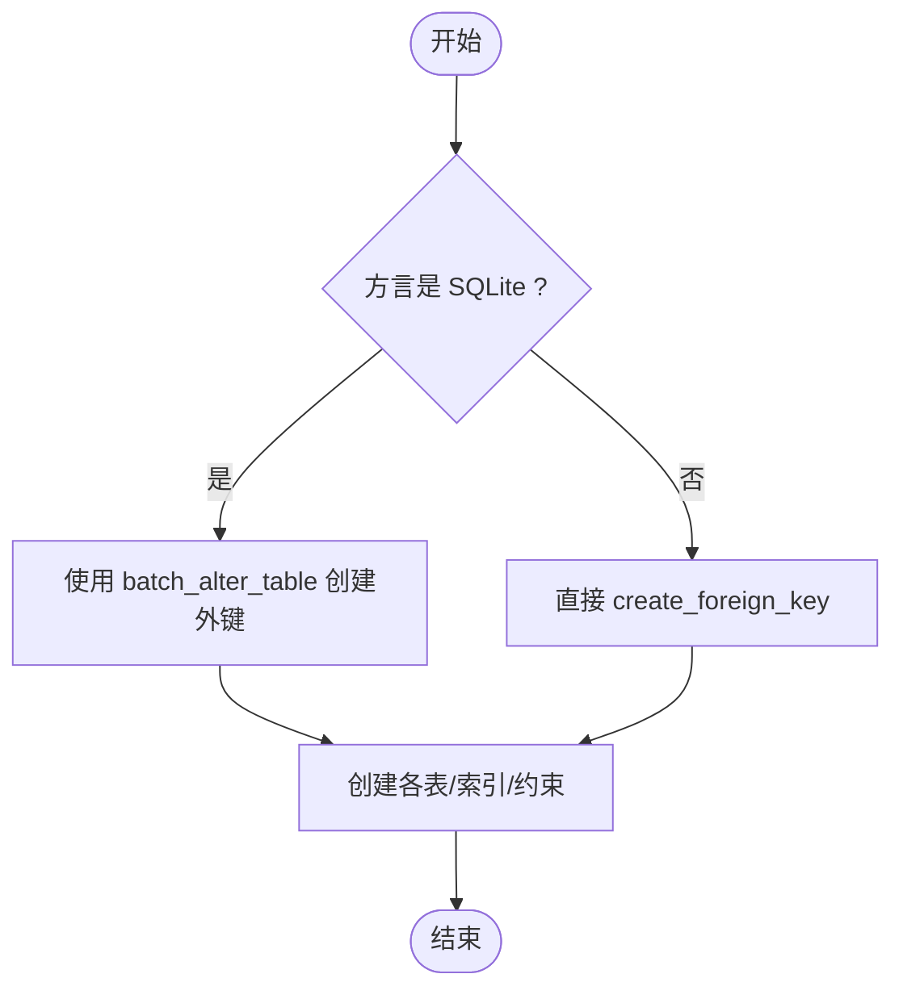
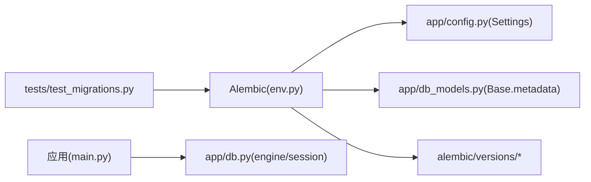

# 数据库迁移管理

<cite>
**本文引用的文件**   
- [backend/alembic.ini](file://backend/alembic.ini)
- [backend/alembic/env.py](file://backend/alembic/env.py)
- [backend/alembic/script.py.mako](file://backend/alembic/script.py.mako)
- [backend/alembic/versions/20260803_0001_game_persistence.py](file://backend/alembic/versions/20260803_0001_game_persistence.py)
- [backend/alembic/versions/20260804_0002_auth_persistence.py](file://backend/alembic/versions/20260804_0002_auth_persistence.py)
- [backend/app/config.py](file://backend/app/config.py)
- [backend/app/db.py](file://backend/app/db.py)
- [backend/app/db_models.py](file://backend/app/db_models.py)
- [backend/app/main.py](file://backend/app/main.py)
- [backend/tests/test_migrations.py](file://backend/tests/test_migrations.py)
- [backend/requirements.txt](file://backend/requirements.txt)
</cite>

## 目录
1. [简介](#简介)
2. [项目结构](#项目结构)
3. [核心组件](#核心组件)
4. [架构总览](#架构总览)
5. [详细组件分析](#详细组件分析)
6. [依赖关系分析](#依赖关系分析)
7. [性能与并发特性](#性能与并发特性)
8. [故障排查指南](#故障排查指南)
9. [结论](#结论)
10. [附录：常用命令与最佳实践](#附录：常用命令与最佳实践)

## 简介
本文件面向后端开发与运维人员，系统化说明本项目基于 Alembic 的数据库迁移体系。内容涵盖：
- Alembic 配置与环境初始化
- 迁移脚本生成、版本管理与依赖链
- 迁移执行流程（在线/离线）、异步引擎集成
- up/down 函数编写规范与跨方言差异处理
- 迁移测试策略、回滚机制与生产部署注意事项
- 常见问题与排错建议

## 项目结构
与迁移相关的核心目录与文件如下：
- alembic 配置与模板
  - alembic.ini：Alembic 运行时配置（含数据库 URL、日志等）
  - alembic/env.py：环境入口，负责连接引擎、目标元数据与迁移执行
  - alembic/script.py.mako：迁移脚本模板
  - alembic/versions/*：具体迁移脚本
- 应用层模型与配置
  - app/config.py：运行时配置（DATABASE_URL 等环境变量）
  - app/db.py：异步引擎创建与会话工厂
  - app/db_models.py：SQLAlchemy ORM 模型定义（Base.metadata 用于自动对比）
  - app/main.py：启动时健康检查与未迁移提示
- 测试
  - tests/test_migrations.py：通过子进程调用 Alembic 并校验表结构与约束

图表来源
- [backend/alembic.ini:1-37](file://backend/alembic.ini#L1-L37)
- [backend/alembic/env.py:1-51](file://backend/alembic/env.py#L1-L51)
- [backend/app/config.py:1-77](file://backend/app/config.py#L1-L77)
- [backend/app/db_models.py:1-160](file://backend/app/db_models.py#L1-L160)
- [backend/alembic/versions/20260803_0001_game_persistence.py:1-129](file://backend/alembic/versions/20260803_0001_game_persistence.py#L1-L129)
- [backend/alembic/versions/20260804_0002_auth_persistence.py:1-55](file://backend/alembic/versions/20260804_0002_auth_persistence.py#L1-L55)
- [backend/app/db.py:1-42](file://backend/app/db.py#L1-L42)
- [backend/tests/test_migrations.py:1-61](file://backend/tests/test_migrations.py#L1-L61)

章节来源
- [backend/alembic.ini:1-37](file://backend/alembic.ini#L1-L37)
- [backend/alembic/env.py:1-51](file://backend/alembic/env.py#L1-L51)
- [backend/app/config.py:1-77](file://backend/app/config.py#L1-L77)
- [backend/app/db_models.py:1-160](file://backend/app/db_models.py#L1-L160)
- [backend/app/db.py:1-42](file://backend/app/db.py#L1-L42)
- [backend/tests/test_migrations.py:1-61](file://backend/tests/test_migrations.py#L1-L61)

## 核心组件
- Alembic 配置与运行入口
  - alembic.ini：指定脚本位置、数据库 URL、日志级别等
  - env.py：读取配置、设置目标元数据、提供离线/在线迁移执行路径
- 模型与元数据
  - db_models.py：定义 Base 与所有 ORM 模型，env.py 使用 Base.metadata 进行 schema 对比
  - db.py：创建异步引擎、会话工厂，并为 SQLite 开启外键与超时等 PRAGMA
- 迁移脚本
  - versions/*：每个文件代表一次变更，包含 revision、down_revision、upgrade()、downgrade()
- 测试
  - test_migrations.py：通过命令行调用 Alembic 升级至 head，并用 SQLAlchemy Inspector 验证表与约束

章节来源
- [backend/alembic.ini:1-37](file://backend/alembic.ini#L1-L37)
- [backend/alembic/env.py:1-51](file://backend/alembic/env.py#L1-L51)
- [backend/app/db_models.py:1-160](file://backend/app/db_models.py#L1-L160)
- [backend/app/db.py:1-42](file://backend/app/db.py#L1-L42)
- [backend/alembic/versions/20260803_0001_game_persistence.py:1-129](file://backend/alembic/versions/20260803_0001_game_persistence.py#L1-L129)
- [backend/alembic/versions/20260804_0002_auth_persistence.py:1-55](file://backend/alembic/versions/20260804_0002_auth_persistence.py#L1-L55)
- [backend/tests/test_migrations.py:1-61](file://backend/tests/test_migrations.py#L1-L61)

## 架构总览
下图展示了从 Alembic 到应用层的迁移执行链路，以及配置与模型的依赖关系。

图表来源
- [backend/alembic/env.py:1-51](file://backend/alembic/env.py#L1-L51)
- [backend/app/config.py:1-77](file://backend/app/config.py#L1-L77)
- [backend/app/db_models.py:1-160](file://backend/app/db_models.py#L1-L160)
- [backend/app/main.py:30-34](file://backend/app/main.py#L30-L34)

## 详细组件分析

### Alembic 配置与环境
- alembic.ini
  - script_location：指向 alembic 目录
  - sqlalchemy.url：默认 SQLite 路径；实际运行时由 env.py 覆盖为环境变量中的 DATABASE_URL
  - 日志：根/alembic/sqlalchemy 日志级别与处理器
- alembic/env.py
  - 读取配置项并覆盖 sqlalchemy.url
  - target_metadata 绑定 Base.metadata，使 Alembic 能自动检测模型变更
  - 提供 run_migrations_offline() 与 run_migrations_online() 两种模式
  - 在线模式使用 async_engine_from_config + NullPool，避免连接池竞争，适合一次性迁移任务
  - 根据 context.is_offline_mode() 选择执行路径

章节来源
- [backend/alembic.ini:1-37](file://backend/alembic.ini#L1-L37)
- [backend/alembic/env.py:1-51](file://backend/alembic/env.py#L1-L51)

### 迁移脚本模板与规范
- script.py.mako
  - 自动生成 revision、down_revision、branch_labels、depends_on
  - 生成空的 upgrade() 与 downgrade() 占位函数
- 编写规范
  - 命名：时间戳_序号_描述（如 20260803_0001_game_persistence.py）
  - 字段类型需与 ORM 模型一致，确保 Alembic 可正确对比
  - 必须实现 down() 以支持回滚
  - 对 SQLite 的特殊语法（如批量 alter）需用 batch_alter_table 包裹
  - 使用 op.get_bind().dialect.name 做方言分支处理

章节来源
- [backend/alembic/script.py.mako:1-23](file://backend/alembic/script.py.mako#L1-L23)

### 现有迁移脚本解析
- 20260803_0001_game_persistence.py
  - 创建 stories、story_versions、game_sessions、game_events、session_clues 表
  - 添加索引与唯一约束、检查约束
  - 针对 SQLite 使用 batch_alter_table 创建外键
- 20260804_0002_auth_persistence.py
  - 创建 users、auth_sessions 表
  - 设置唯一约束与索引
  - down_revision 指向上一版，形成线性版本链

图表来源
- [backend/alembic/versions/20260803_0001_game_persistence.py:17-68](file://backend/alembic/versions/20260803_0001_game_persistence.py#L17-L68)

章节来源
- [backend/alembic/versions/20260803_0001_game_persistence.py:1-129](file://backend/alembic/versions/20260803_0001_game_persistence.py#L1-L129)
- [backend/alembic/versions/20260804_0002_auth_persistence.py:1-55](file://backend/alembic/versions/20260804_0002_auth_persistence.py#L1-L55)

### 模型与元数据
- app/db_models.py
  - Base 继承 DeclarativeBase，作为 Alembic 的目标元数据源
  - 定义了 Story、StoryVersion、GameSession、GameEvent、SessionClue、User、AuthSession 等模型
  - 包含主键、外键、唯一约束、检查约束与时间戳字段
- app/db.py
  - 创建异步引擎，SQLite 下启用外键与 busy_timeout
  - 提供 get_db_session 与 check_database 工具

章节来源
- [backend/app/db_models.py:1-160](file://backend/app/db_models.py#L1-L160)
- [backend/app/db.py:1-42](file://backend/app/db.py#L1-L42)

### 配置与环境变量
- app/config.py
  - Settings.dataclass 封装配置项，database_url 默认 sqlite+aiosqlite:///./macau_mystery.db
  - get_settings() 从环境变量读取 DATABASE_URL、CORS_ORIGINS、APP_ENV 等
- alembic.ini
  - 默认 sqlalchemy.url 指向本地 SQLite；env.py 会覆盖为环境变量值

章节来源
- [backend/app/config.py:1-77](file://backend/app/config.py#L1-L77)
- [backend/alembic.ini:1-37](file://backend/alembic.ini#L1-L37)

### 迁移执行流程与依赖管理
- 版本链
  - 20260803_0001 -> 20260804_0002（线性依赖）
- 执行顺序
  - alembic upgrade head 按 down_revision 链依次执行 upgrade()
  - alembic downgrade <rev> 回滚到指定版本
  - alembic history 查看版本历史
- 冲突解决
  - 若出现分支或循环依赖，需调整 down_revision 或引入 branch_labels/depends_on
  - 对于不可逆变更，需在 downgrade() 中谨慎处理或记录警告

章节来源
- [backend/alembic/versions/20260803_0001_game_persistence.py:1-129](file://backend/alembic/versions/20260803_0001_game_persistence.py#L1-L129)
- [backend/alembic/versions/20260804_0002_auth_persistence.py:1-55](file://backend/alembic/versions/20260804_0002_auth_persistence.py#L1-L55)

### 迁移测试与回滚机制
- 测试策略
  - tests/test_migrations.py 通过子进程调用 alembic upgrade head，并使用 SQLAlchemy Inspector 校验表名、外键与唯一约束
  - 使用临时数据库路径隔离测试环境
- 回滚机制
  - 每个迁移必须实现 downgrade()，保证可逆
  - 建议在 CI 中同时执行 upgrade head 与 downgrade 0，确保双向可逆

章节来源
- [backend/tests/test_migrations.py:1-61](file://backend/tests/test_migrations.py#L1-L61)

### 应用启动时的迁移检查
- main.py 在启动过程中捕获 SQLAlchemyError，若数据库未迁移则抛出明确错误，提示先执行 alembic upgrade head
- health 端点通过 check_database() 返回数据库可用性状态

章节来源
- [backend/app/main.py:30-34](file://backend/app/main.py#L30-L34)
- [backend/app/db.py:35-42](file://backend/app/db.py#L35-L42)

## 依赖关系分析
- 外部依赖
  - alembic==1.13.3：迁移框架
  - sqlalchemy==2.0.35：ORM 与引擎
  - aiosqlite==0.20.0：异步 SQLite 驱动
  - asyncpg==0.29.0：异步 PostgreSQL 驱动（切换数据库时使用）
- 内部依赖
  - alembic.env.py 依赖 app.config.Settings 与 app.db_models.Base.metadata
  - 迁移脚本依赖 alembic.op 与 sqlalchemy.types
  - 应用层依赖 app.db.SessionLocal 与 engine

图表来源
- [backend/alembic/env.py:1-51](file://backend/alembic/env.py#L1-L51)
- [backend/app/config.py:1-77](file://backend/app/config.py#L1-L77)
- [backend/app/db_models.py:1-160](file://backend/app/db_models.py#L1-L160)
- [backend/app/db.py:1-42](file://backend/app/db.py#L1-L42)
- [backend/tests/test_migrations.py:1-61](file://backend/tests/test_migrations.py#L1-L61)

章节来源
- [backend/requirements.txt:1-17](file://backend/requirements.txt#L1-L17)

## 性能与并发特性
- 迁移阶段
  - env.py 使用 NullPool，避免连接池开销，适合一次性迁移任务
  - 比较类型 compare_type=True，提高 schema 对比精度
- 运行期
  - SQLite 下启用 PRAGMA foreign_keys=ON 与 busy_timeout=5000，提升并发写入稳定性
  - 异步引擎与 AsyncSession 减少阻塞，提高吞吐

章节来源
- [backend/alembic/env.py:38-44](file://backend/alembic/env.py#L38-L44)
- [backend/app/db.py:12-23](file://backend/app/db.py#L12-L23)

## 故障排查指南
- 常见错误
  - “数据库尚未迁移”：启动时捕获 SQLAlchemyError，需先执行 alembic upgrade head
  - SQLite 外键创建失败：确认使用 batch_alter_table 包裹
  - 方言差异：根据 dialect.name 分支处理不同 SQL 语法
- 诊断步骤
  - 检查 alembic.ini 与 DATABASE_URL 是否正确
  - 使用 alembic history 查看版本链是否完整
  - 使用 alembic current 查看当前版本
  - 在测试中复用 test_migrations.py 的思路，用临时库验证迁移效果
- 回滚与恢复
  - 优先执行 alembic downgrade 到上一个稳定版本
  - 若数据已破坏，从备份恢复后重新执行 upgrade head

章节来源
- [backend/app/main.py:30-34](file://backend/app/main.py#L30-L34)
- [backend/alembic/versions/20260803_0001_game_persistence.py:51-68](file://backend/alembic/versions/20260803_0001_game_persistence.py#L51-L68)
- [backend/tests/test_migrations.py:15-29](file://backend/tests/test_migrations.py#L15-L29)

## 结论
本项目采用 Alembic + SQLAlchemy 的成熟方案，结合异步引擎与 ORM 模型，实现了安全、可追溯且可回滚的数据库迁移体系。通过 env.py 的环境适配、模板化的迁移脚本与完善的测试用例，保证了迁移质量与可维护性。在生产环境中，应严格遵循“先迁移后发布”的流程，配合健康检查与监控，确保数据库一致性。

## 附录：常用命令与最佳实践
- 常用命令
  - 生成迁移：alembic revision --autogenerate -m "描述"
  - 执行迁移：alembic upgrade head
  - 回滚迁移：alembic downgrade -1 或 alembic downgrade <rev>
  - 查看历史：alembic history
  - 查看当前版本：alembic current
- 最佳实践
  - 每次变更只写一个迁移，保持原子性与可读性
  - 始终实现 downgrade()，确保可逆
  - 对 SQLite 特殊语法使用 batch_alter_table
  - 使用 alembic autogenerate 前，确保模型与迁移脚本一致
  - 在 CI 中执行 upgrade head 与 downgrade 0 的双向测试
  - 生产环境禁止使用 autogenerate，仅允许人工审查后的迁移脚本
  - 大表变更分步进行，避免长时间锁表
  - 记录数据迁移逻辑（如填充默认值），并在 downgrade 中反向处理

[本节为通用指导，不直接分析具体文件]