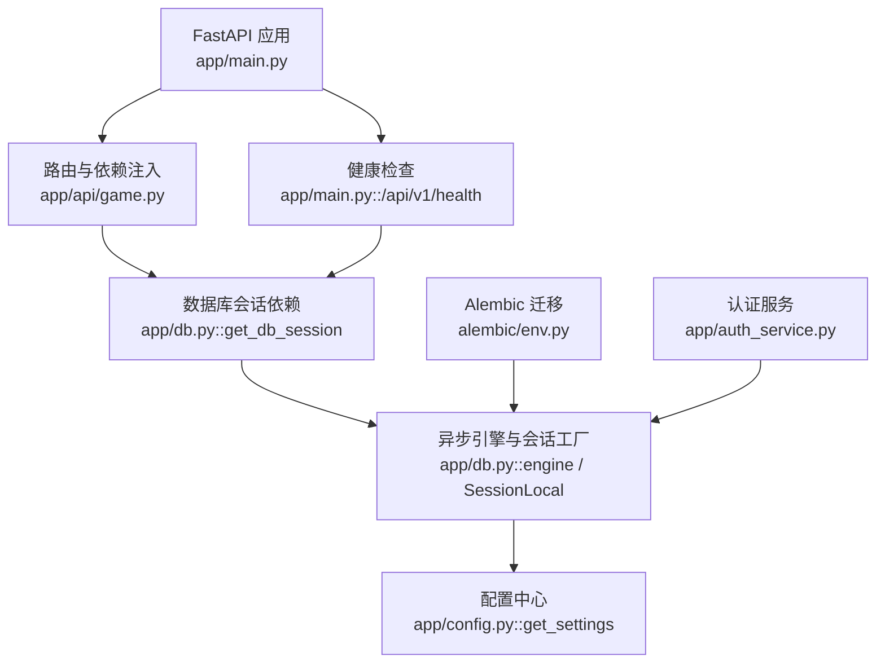
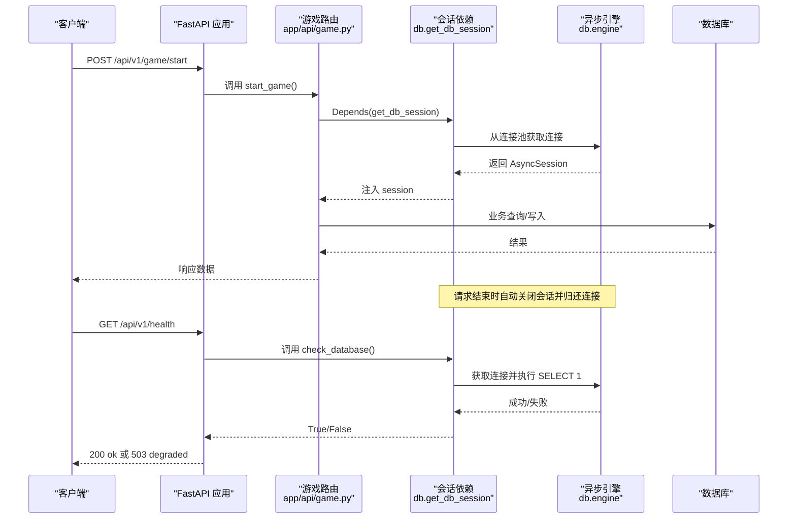
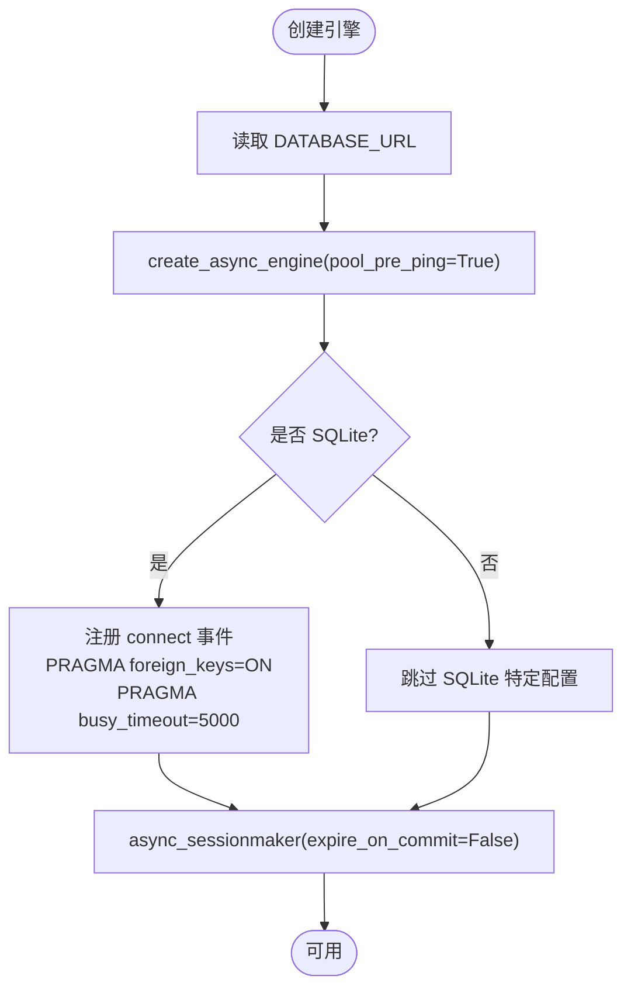
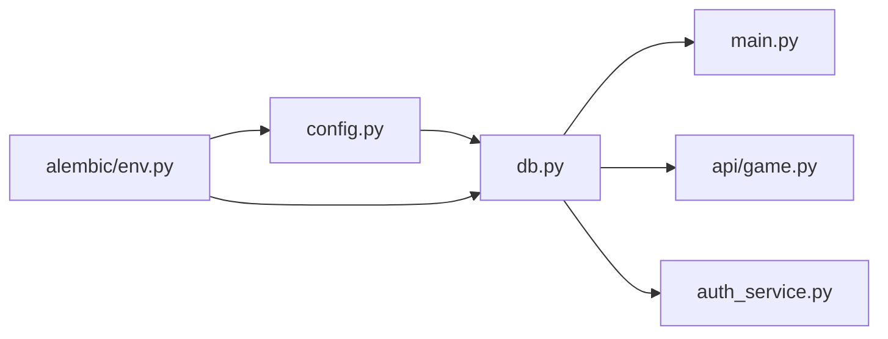

# 数据库连接管理

<cite>
**本文引用的文件**   
- [backend/app/db.py](file://backend/app/db.py)
- [backend/app/config.py](file://backend/app/config.py)
- [backend/app/main.py](file://backend/app/main.py)
- [backend/app/api/game.py](file://backend/app/api/game.py)
- [backend/app/auth_service.py](file://backend/app/auth_service.py)
- [backend/alembic/env.py](file://backend/alembic/env.py)
- [backend/alembic.ini](file://backend/alembic.ini)
- [backend/tests/test_health.py](file://backend/tests/test_health.py)
</cite>

## 目录
1. [简介](#简介)
2. [项目结构](#项目结构)
3. [核心组件](#核心组件)
4. [架构总览](#架构总览)
5. [详细组件分析](#详细组件分析)
6. [依赖关系分析](#依赖关系分析)
7. [性能考量](#性能考量)
8. [故障排查指南](#故障排查指南)
9. [结论](#结论)
10. [附录：配置示例与最佳实践](#附录配置示例与最佳实践)

## 简介
本文件围绕后端异步数据库连接管理进行系统化说明，涵盖连接池与引擎初始化、会话生命周期、事务处理、健康检查、错误处理、重试机制与监控指标等。同时给出面向生产环境的最佳实践、性能优化建议与常见问题的解决方案，帮助读者快速掌握并安全使用项目的数据库子系统。

## 项目结构
后端采用 FastAPI + SQLAlchemy 异步驱动（aiosqlite/postgresql）的架构。数据库相关代码集中在以下位置：
- 引擎与会话工厂：backend/app/db.py
- 运行时配置：backend/app/config.py
- 应用启动与健康检查：backend/app/main.py
- API 层对会话的使用：backend/app/api/game.py
- 认证服务中的事务用法：backend/app/auth_service.py
- Alembic 迁移环境：backend/alembic/env.py 与 backend/alembic.ini
- 健康端点测试：backend/tests/test_health.py

图表来源 
- [backend/app/main.py:17-107](file://backend/app/main.py#L17-L107)
- [backend/app/api/game.py:1-37](file://backend/app/api/game.py#L1-L37)
- [backend/app/db.py:12-32](file://backend/app/db.py#L12-L32)
- [backend/app/config.py:56-77](file://backend/app/config.py#L56-L77)
- [backend/alembic/env.py:38-51](file://backend/alembic/env.py#L38-L51)
- [backend/app/auth_service.py:133-153](file://backend/app/auth_service.py#L133-L153)

章节来源
- [backend/app/main.py:17-107](file://backend/app/main.py#L17-L107)
- [backend/app/api/game.py:1-37](file://backend/app/api/game.py#L1-L37)
- [backend/app/db.py:12-32](file://backend/app/db.py#L12-L32)
- [backend/app/config.py:56-77](file://backend/app/config.py#L56-L77)
- [backend/alembic/env.py:38-51](file://backend/alembic/env.py#L38-L51)
- [backend/app/auth_service.py:133-153](file://backend/app/auth_service.py#L133-L153)

## 核心组件
- 异步引擎与会话工厂
  - 通过 create_async_engine 创建引擎，启用 pool_pre_ping 以在获取连接前探测连接有效性。
  - 针对 SQLite 场景，注册 connect 事件开启外键约束与设置 busy_timeout。
  - 使用 async_sessionmaker 生成会话工厂，关闭 expire_on_commit 避免提交后对象失效。
- 会话依赖注入
  - get_db_session 提供异步上下文管理器，确保请求级会话的生命周期自动管理与释放。
- 健康检查
  - check_database 尝试执行 SELECT 1 验证连接可用性；main 中暴露 /api/v1/health 返回状态。
- 配置系统
  - Settings 从环境变量读取 DATABASE_URL 等参数，默认使用 aiosqlite 本地文件。
- Alembic 迁移
  - env.py 根据 settings 动态设置 sqlalchemy.url，支持离线与在线模式，迁移完成后释放连接。

章节来源
- [backend/app/db.py:12-32](file://backend/app/db.py#L12-L32)
- [backend/app/db.py:35-42](file://backend/app/db.py#L35-L42)
- [backend/app/config.py:56-77](file://backend/app/config.py#L56-L77)
- [backend/alembic/env.py:38-51](file://backend/alembic/env.py#L38-L51)

## 架构总览
下图展示了从 HTTP 请求到数据库访问的关键路径，以及健康检查流程。

图表来源 
- [backend/app/api/game.py:15-21](file://backend/app/api/game.py#L15-L21)
- [backend/app/db.py:30-32](file://backend/app/db.py#L30-L32)
- [backend/app/db.py:35-42](file://backend/app/db.py#L35-L42)
- [backend/app/main.py:98-106](file://backend/app/main.py#L98-L106)

## 详细组件分析

### 引擎与会话工厂（db.py）
- 引擎创建
  - 使用 create_async_engine 并启用 pool_pre_ping，减少“僵尸连接”问题。
  - SQLite 专用：connect 事件中开启 PRAGMA foreign_keys=ON 与 busy_timeout=5000，提升并发写时的稳定性。
- 会话工厂
  - async_sessionmaker 配置 expire_on_commit=False，避免提交后 ORM 对象被延迟加载导致意外查询。
- 会话依赖
  - get_db_session 作为异步迭代器，配合 FastAPI 的 Depends 实现请求级会话生命周期管理。
- 健康检查
  - check_database 捕获异常并返回布尔值，供健康端点判断数据库可用性。

图表来源 
- [backend/app/db.py:12-27](file://backend/app/db.py#L12-L27)

章节来源
- [backend/app/db.py:12-32](file://backend/app/db.py#L12-L32)
- [backend/app/db.py:35-42](file://backend/app/db.py#L35-L42)

### 配置系统（config.py）
- Settings 数据类集中管理运行时配置，包括 database_url、CORS、环境标识、演示数据开关、令牌 TTL 等。
- get_settings 使用 lru_cache 缓存实例，避免重复解析环境变量。
- 默认数据库 URL 指向 aiosqlite 本地文件，便于开发与测试。

章节来源
- [backend/app/config.py:38-77](file://backend/app/config.py#L38-L77)

### 应用启动与健康检查（main.py）
- lifespan 钩子在应用启动时可选地执行演示数据引导，若数据库未迁移则抛出明确错误提示。
- 全局异常处理器统一 GameError 与请求校验错误的响应格式。
- /api/v1/health 调用 check_database 返回 200 或 503，体现数据库可用性。

章节来源
- [backend/app/main.py:17-36](file://backend/app/main.py#L17-L36)
- [backend/app/main.py:98-106](file://backend/app/main.py#L98-L106)

### API 层会话使用（game.py）
- 所有接口通过 Depends(get_db_session) 注入 AsyncSession，无需手动管理连接生命周期。
- 典型流程：接收请求 -> 注入会话 -> 调用服务层 -> 返回响应 -> 自动清理会话。

章节来源
- [backend/app/api/game.py:15-36](file://backend/app/api/game.py#L15-L36)

### 认证服务中的事务（auth_service.py）
- bootstrap_demo_users 使用 SessionLocal.begin() 显式开启事务，批量创建演示用户，保证原子性。
- 其他函数通过传入的 AsyncSession 完成单条记录操作。

章节来源
- [backend/app/auth_service.py:133-153](file://backend/app/auth_service.py#L133-L153)

### Alembic 迁移（alembic/env.py 与 alembic.ini）
- env.py 将 Settings.database_url 注入到 sqlalchemy.url，支持离线与在线两种迁移模式。
- 在线模式下使用 async_engine_from_config 创建临时引擎，迁移完成后 dispose 释放资源。
- alembic.ini 定义脚本位置与日志级别，默认 SQL 连接为 aiosqlite。

章节来源
- [backend/alembic/env.py:15-51](file://backend/alembic/env.py#L15-L51)
- [backend/alembic.ini:1-37](file://backend/alembic.ini#L1-L37)

## 依赖关系分析
- 模块耦合
  - db.py 依赖 config.py 获取数据库 URL。
  - main.py 依赖 db.py 的健康检查与生命周期。
  - api/game.py 依赖 db.py 的会话依赖注入。
  - auth_service.py 直接复用 SessionLocal 进行事务操作。
  - alembic/env.py 依赖 config.py 和 db_models.py 元数据。
- 外部依赖
  - SQLAlchemy 异步驱动（aiosqlite/postgresql）。
  - Alembic 用于数据库版本管理。

图表来源 
- [backend/app/config.py:56-77](file://backend/app/config.py#L56-L77)
- [backend/app/db.py:26-27](file://backend/app/db.py#L26-L27)
- [backend/app/main.py:17-36](file://backend/app/main.py#L17-L36)
- [backend/app/api/game.py:1-37](file://backend/app/api/game.py#L1-L37)
- [backend/app/auth_service.py:133-153](file://backend/app/auth_service.py#L133-L153)
- [backend/alembic/env.py:15-51](file://backend/alembic/env.py#L15-L51)

章节来源
- [backend/app/config.py:56-77](file://backend/app/config.py#L56-L77)
- [backend/app/db.py:26-27](file://backend/app/db.py#L26-L27)
- [backend/app/main.py:17-36](file://backend/app/main.py#L17-L36)
- [backend/app/api/game.py:1-37](file://backend/app/api/game.py#L1-L37)
- [backend/app/auth_service.py:133-153](file://backend/app/auth_service.py#L133-L153)
- [backend/alembic/env.py:15-51](file://backend/alembic/env.py#L15-L51)

## 性能考量
- 连接池
  - 当前使用默认连接池参数，未显式设置 max_overflow、pool_size、pool_recycle、pool_timeout。建议在 PostgreSQL 环境下根据 QPS 与连接限制调优。
  - pool_pre_ping 已启用，有助于降低“死连接”导致的超时与异常。
- SQLite 特性
  - busy_timeout=5000 缓解并发写冲突；在高并发写入场景下仍可能遇到锁竞争，建议评估切换至 PostgreSQL。
- 会话过期策略
  - expire_on_commit=False 可减少不必要的延迟加载查询，但需注意对象状态一致性。
- 迁移资源释放
  - alembic/env.py 在迁移完成后调用 dispose，避免连接泄漏。

[本节为通用指导，不直接分析具体文件]

## 故障排查指南
- 健康检查失败
  - 现象：/api/v1/health 返回 503，database 字段为 unavailable。
  - 原因：check_database 捕获异常，通常为连接失败或数据库不可用。
  - 排查：确认 DATABASE_URL 正确、网络可达、权限充足；查看数据库日志。
- 迁移失败
  - 现象：启动时报错提示需先执行 alembic upgrade head。
  - 原因：数据库尚未创建表或版本不一致。
  - 排查：运行 alembic upgrade head，确保 alembic.ini 与 Settings 的数据库 URL 一致。
- SQLite 并发写阻塞
  - 现象：高并发写入出现超时或锁等待。
  - 原因：SQLite 的 WAL/锁机制限制。
  - 排查：增大 busy_timeout、降低并发写、或迁移至 PostgreSQL。
- 连接泄漏
  - 现象：连接数持续增长。
  - 原因：未在请求结束释放会话或未正确关闭引擎。
  - 排查：确保使用 Depends(get_db_session) 或 with SessionLocal()/begin() 包裹操作。

章节来源
- [backend/app/main.py:98-106](file://backend/app/main.py#L98-L106)
- [backend/app/db.py:35-42](file://backend/app/db.py#L35-L42)
- [backend/alembic/env.py:38-51](file://backend/alembic/env.py#L38-L51)

## 结论
本项目基于 SQLAlchemy 异步生态实现了简洁可靠的数据库连接与会话管理。通过 pool_pre_ping、SQLite 特定 PRAGMA 配置、请求级会话注入与健康检查，提供了良好的可观测性与稳定性基础。生产环境中建议进一步细化连接池参数、引入重试与熔断策略，并考虑向 PostgreSQL 迁移以获得更强的并发能力与运维工具链。

[本节为总结性内容，不直接分析具体文件]

## 附录：配置示例与最佳实践

- 连接与池化
  - 推荐在生产环境显式设置连接池参数：pool_size、max_overflow、pool_recycle、pool_timeout，依据数据库最大连接数与业务峰值估算。
  - 保持 pool_pre_ping=True，减少“僵尸连接”影响。
- 超时与重试
  - 当前未实现连接级重试；可在上层服务封装重试逻辑（指数退避），并结合健康检查与熔断。
  - 对于长事务或批处理，合理设置语句级超时与事务超时。
- 健康检查与监控
  - 利用 /api/v1/health 暴露数据库可用性；结合外部监控系统采集状态码与响应时间。
  - 记录连接池使用率、活跃连接数、等待队列长度等指标。
- 事务与资源清理
  - 优先使用 Depends(get_db_session) 自动管理会话；需要多步操作的场景使用 SessionLocal.begin() 显式事务。
  - 确保异常路径也能正确回滚与释放资源。
- 迁移与版本控制
  - 每次模型变更生成 Alembic 迁移，并在 CI 中执行升级与校验。
  - 确保 alembic.ini 与 Settings 的数据库 URL 一致，避免环境差异。
- 常见问题速查
  - 健康检查 503：检查 DATABASE_URL、网络连通性与数据库权限。
  - 迁移报错：执行 alembic upgrade head，核对迁移脚本与环境变量。
  - SQLite 锁冲突：增大 busy_timeout 或切换到 PostgreSQL。
  - 连接泄漏：检查是否存在未关闭的会话或引擎。

章节来源
- [backend/app/config.py:56-77](file://backend/app/config.py#L56-L77)
- [backend/app/db.py:12-32](file://backend/app/db.py#L12-L32)
- [backend/app/main.py:98-106](file://backend/app/main.py#L98-L106)
- [backend/alembic/env.py:38-51](file://backend/alembic/env.py#L38-L51)
- [backend/tests/test_health.py:9-22](file://backend/tests/test_health.py#L9-L22)