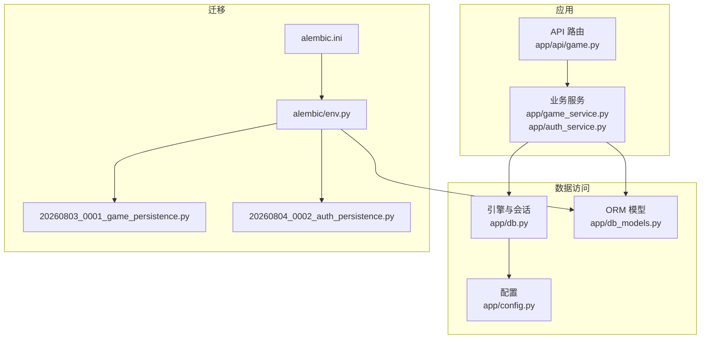
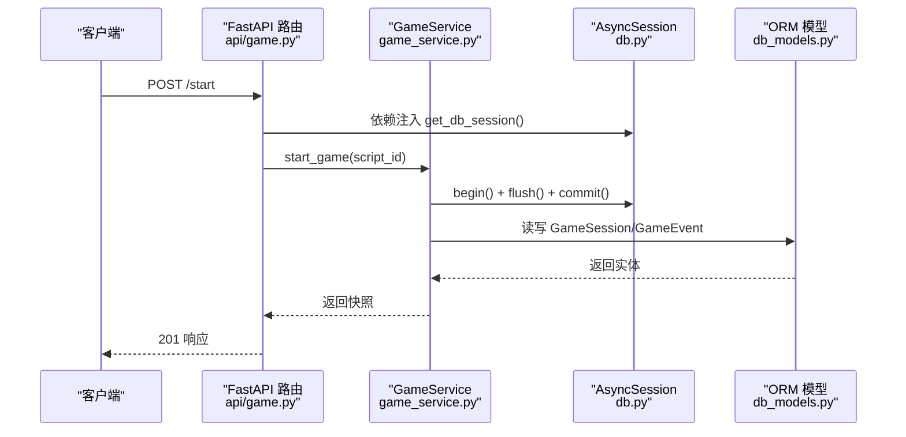
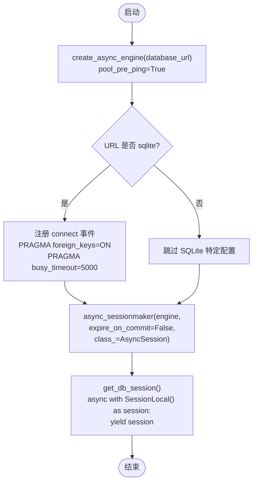
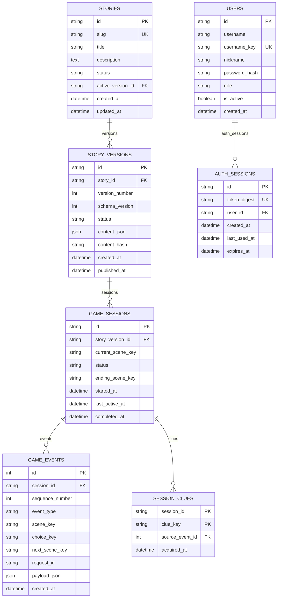
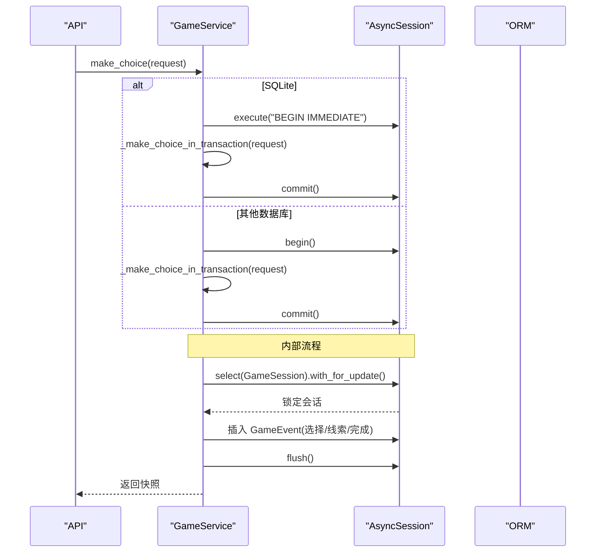
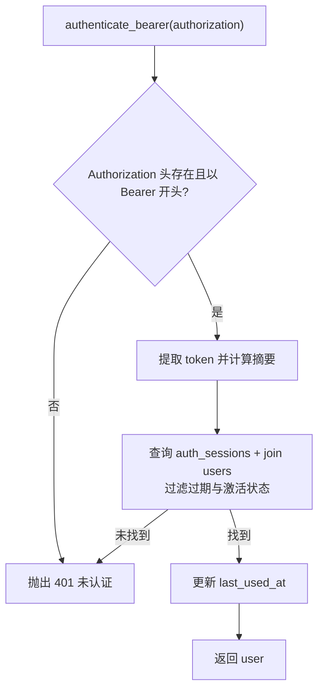
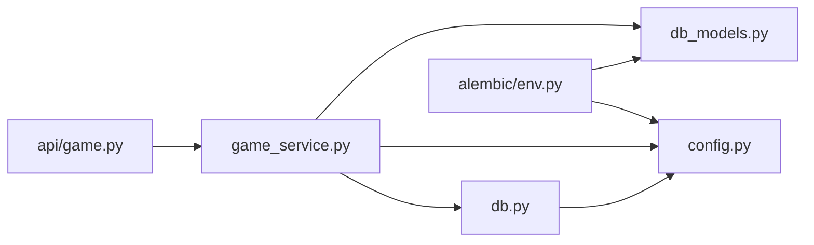

# 数据访问层

<cite>
**本文引用的文件**   
- [db.py](file://backend/app/db.py)
- [db_models.py](file://backend/app/db_models.py)
- [config.py](file://backend/app/config.py)
- [alembic.ini](file://backend/alembic.ini)
- [env.py](file://backend/alembic/env.py)
- [20260803_0001_game_persistence.py](file://backend/alembic/versions/20260803_0001_game_persistence.py)
- [20260804_0002_auth_persistence.py](file://backend/alembic/versions/20260804_0002_auth_persistence.py)
- [game_service.py](file://backend/app/game_service.py)
- [auth_service.py](file://backend/app/auth_service.py)
- [game.py](file://backend/app/api/game.py)
</cite>

## 目录
1. [简介](#简介)
2. [项目结构](#项目结构)
3. [核心组件](#核心组件)
4. [架构总览](#架构总览)
5. [详细组件分析](#详细组件分析)
6. [依赖关系分析](#依赖关系分析)
7. [性能考量](#性能考量)
8. [故障排查指南](#故障排查指南)
9. [结论](#结论)
10. [附录](#附录)

## 简介
本文件系统化梳理后端数据访问层，围绕 SQLAlchemy ORM 模型定义、关系映射与查询优化策略展开，并覆盖数据库连接池管理、事务处理、异步支持、数据验证与约束、索引设计、迁移管理、备份恢复策略与性能监控。同时给出最佳实践、常见陷阱与调试技巧，帮助读者快速掌握该项目的数据持久化方案。

## 项目结构
数据访问相关代码主要分布在以下位置：
- 引擎与会话：backend/app/db.py
- ORM 模型：backend/app/db_models.py
- 配置与环境变量：backend/app/config.py
- Alembic 迁移配置与脚本：backend/alembic.ini、backend/alembic/env.py、backend/alembic/versions/*
- 业务服务（含事务与并发控制）：backend/app/game_service.py、backend/app/auth_service.py
- API 路由（注入会话）：backend/app/api/game.py

**图表来源** 
- [db.py:1-42](file://backend/app/db.py#L1-L42)
- [db_models.py:1-160](file://backend/app/db_models.py#L1-L160)
- [config.py:1-77](file://backend/app/config.py#L1-L77)
- [alembic.ini:1-37](file://backend/alembic.ini#L1-L37)
- [env.py:1-51](file://backend/alembic/env.py#L1-L51)
- [20260803_0001_game_persistence.py:1-129](file://backend/alembic/versions/20260803_0001_game_persistence.py#L1-L129)
- [20260804_0002_auth_persistence.py:1-55](file://backend/alembic/versions/20260804_0002_auth_persistence.py#L1-L55)
- [game_service.py:1-386](file://backend/app/game_service.py#L1-L386)
- [auth_service.py:1-153](file://backend/app/auth_service.py#L1-L153)
- [game.py:1-37](file://backend/app/api/game.py#L1-L37)

**章节来源**
- [db.py:1-42](file://backend/app/db.py#L1-L42)
- [db_models.py:1-160](file://backend/app/db_models.py#L1-L160)
- [config.py:1-77](file://backend/app/config.py#L1-L77)
- [alembic.ini:1-37](file://backend/alembic.ini#L1-L37)
- [env.py:1-51](file://backend/alembic/env.py#L1-L51)
- [20260803_0001_game_persistence.py:1-129](file://backend/alembic/versions/20260803_0001_game_persistence.py#L1-L129)
- [20260804_0002_auth_persistence.py:1-55](file://backend/alembic/versions/20260804_0002_auth_persistence.py#L1-L55)
- [game_service.py:1-386](file://backend/app/game_service.py#L1-L386)
- [auth_service.py:1-153](file://backend/app/auth_service.py#L1-L153)
- [game.py:1-37](file://backend/app/api/game.py#L1-L37)

## 核心组件
- 异步引擎与会话工厂：创建异步引擎、设置连接参数与 SQLite 特定 PRAGMA，提供 AsyncSession 生成器与连接健康检查。
- ORM 模型：基于 DeclarativeBase 的模型定义，包含主键、外键、唯一约束、检查约束、时间戳与 JSON 字段，以及双向关系映射。
- 配置系统：集中读取环境变量，提供数据库 URL、CORS、环境标志、演示数据开关、令牌 TTL 等。
- 迁移系统：Alembic 环境配置与版本脚本，支持离线与在线模式，适配 SQLite 与 PostgreSQL 差异。
- 业务服务：封装事务边界、并发锁、幂等性与状态机逻辑，统一错误码与异常转换。
- API 路由：通过 FastAPI Depends 注入 AsyncSession，调用服务方法完成请求处理。

**章节来源**
- [db.py:1-42](file://backend/app/db.py#L1-L42)
- [db_models.py:1-160](file://backend/app/db_models.py#L1-L160)
- [config.py:1-77](file://backend/app/config.py#L1-L77)
- [env.py:1-51](file://backend/alembic/env.py#L1-L51)
- [game_service.py:1-386](file://backend/app/game_service.py#L1-L386)
- [auth_service.py:1-153](file://backend/app/auth_service.py#L1-L153)
- [game.py:1-37](file://backend/app/api/game.py#L1-L37)

## 架构总览
数据访问层采用“API → 服务 → ORM”的分层结构，结合异步会话与事务边界，确保高并发下的数据一致性与幂等性。迁移系统独立于运行时，通过 Alembic 管理 schema 演进。

**图表来源** 
- [game.py:15-21](file://backend/app/api/game.py#L15-L21)
- [db.py:30-33](file://backend/app/db.py#L30-L33)
- [game_service.py:35-61](file://backend/app/game_service.py#L35-L61)
- [db_models.py:74-91](file://backend/app/db_models.py#L74-L91)

## 详细组件分析

### 数据库引擎与会话管理（db.py）
- 引擎创建：使用 create_async_engine，启用 pool_pre_ping 以检测连接有效性；针对 SQLite 在连接建立时开启外键约束与忙超时。
- 会话工厂：async_sessionmaker 绑定引擎，expire_on_commit=False 避免提交后自动刷新导致额外查询。
- 依赖注入：get_db_session 作为异步上下文管理器，自动管理会话生命周期。
- 健康检查：check_database 执行 SELECT 1 验证连通性。

**图表来源** 
- [db.py:12-27](file://backend/app/db.py#L12-L27)
- [db.py:30-33](file://backend/app/db.py#L30-L33)

**章节来源**
- [db.py:12-27](file://backend/app/db.py#L12-L27)
- [db.py:30-42](file://backend/app/db.py#L30-L42)

### ORM 模型与关系映射（db_models.py）
- Base：DeclarativeBase 基类。
- Story 与 StoryVersion：一对多关系，active_version_id 指向当前活跃版本，使用 post_update 解决循环写入问题；包含状态检查约束。
- GameSession：记录游戏会话状态、当前场景、开始/最后活跃/完成时间；对 story_version_id 建索引。
- GameEvent：会话事件流，序列号保证顺序，request_id 用于幂等；对 session_id 建索引。
- SessionClue：会话线索集合，复合主键 (session_id, clue_key)，关联 source_event_id。
- User 与 AuthSession：用户与认证会话，token_digest 唯一且索引，user_id 外键级联删除。

**图表来源** 
- [db_models.py:24-49](file://backend/app/db_models.py#L24-L49)
- [db_models.py:52-71](file://backend/app/db_models.py#L52-L71)
- [db_models.py:74-91](file://backend/app/db_models.py#L74-L91)
- [db_models.py:93-113](file://backend/app/db_models.py#L93-L113)
- [db_models.py:115-126](file://backend/app/db_models.py#L115-L126)
- [db_models.py:128-144](file://backend/app/db_models.py#L128-L144)
- [db_models.py:147-160](file://backend/app/db_models.py#L147-L160)

**章节来源**
- [db_models.py:24-49](file://backend/app/db_models.py#L24-L49)
- [db_models.py:52-71](file://backend/app/db_models.py#L52-L71)
- [db_models.py:74-91](file://backend/app/db_models.py#L74-L91)
- [db_models.py:93-113](file://backend/app/db_models.py#L93-L113)
- [db_models.py:115-126](file://backend/app/db_models.py#L115-L126)
- [db_models.py:128-144](file://backend/app/db_models.py#L128-L144)
- [db_models.py:147-160](file://backend/app/db_models.py#L147-L160)

### 查询与事务策略（game_service.py）
- 事务边界：start_game 使用 session.begin() 包裹写操作；make_choice 根据数据库方言选择事务方式（SQLite 显式 BEGIN IMMEDIATE）。
- 并发控制：对 GameSession 使用 with_for_update() 行级锁，避免竞态条件；二次查找实现去重幂等。
- 幂等性：通过 GameEvent.request_id 与 payload 校验，防止重复提交。
- 状态机：根据目标场景类型更新会话状态（active/completed），并追加对应事件。
- 快照构建：聚合场景、线索、进度与结局信息，构造统一响应。

**图表来源** 
- [game_service.py:70-83](file://backend/app/game_service.py#L70-L83)
- [game_service.py:84-193](file://backend/app/game_service.py#L84-L193)

**章节来源**
- [game_service.py:35-61](file://backend/app/game_service.py#L35-L61)
- [game_service.py:70-83](file://backend/app/game_service.py#L70-L83)
- [game_service.py:84-193](file://backend/app/game_service.py#L84-L193)
- [game_service.py:339-351](file://backend/app/game_service.py#L339-L351)

### 认证与会话（auth_service.py）
- 用户名/密码校验：正则与长度限制，规范化用户名大小写。
- 用户创建：哈希密码，写入 users 表。
- 认证会话：生成随机 token，计算摘要存储，设置过期时间。
- Bearer 鉴权：按 token_digest 与过期时间查询，joinedload 预加载用户，更新 last_used_at。
- 管理员权限：角色为 admin 才允许。

**图表来源** 
- [auth_service.py:100-123](file://backend/app/auth_service.py#L100-L123)

**章节来源**
- [auth_service.py:27-48](file://backend/app/auth_service.py#L27-L48)
- [auth_service.py:63-80](file://backend/app/auth_service.py#L63-L80)
- [auth_service.py:83-97](file://backend/app/auth_service.py#L83-L97)
- [auth_service.py:100-123](file://backend/app/auth_service.py#L100-L123)
- [auth_service.py:126-130](file://backend/app/auth_service.py#L126-L130)

### API 路由与依赖注入（game.py）
- 路由定义：/start、/choice、/state/{session_id}。
- 依赖注入：Depends(get_db_session) 获取 AsyncSession。
- 调用服务：直接委托给 GameService 方法。

**章节来源**
- [game.py:15-37](file://backend/app/api/game.py#L15-L37)

### 配置与环境（config.py）
- 环境变量：DATABASE_URL、APP_ENV、CORS_ORIGINS、BOOTSTRAP_DEMO_*、AUTH_TOKEN_TTL_HOURS、DEMO_*。
- Settings：不可变数据类，is_production 判断生产环境。
- 默认值：sqlite+aiosqlite 本地文件路径。

**章节来源**
- [config.py:9-10](file://backend/app/config.py#L9-L10)
- [config.py:38-53](file://backend/app/config.py#L38-L53)
- [config.py:56-77](file://backend/app/config.py#L56-L77)

### 迁移管理（Alembic）
- alembic.ini：脚本位置、SQLAlchemy URL、日志级别。
- env.py：设置 SQLALCHEMY_URL、target_metadata 为 Base.metadata；离线模式直接运行，在线模式使用 async_engine_from_config 与 NullPool。
- 版本脚本：
  - 20260803_0001_game_persistence.py：创建 stories、story_versions、game_sessions、game_events、session_clues，处理 SQLite 外键差异。
  - 20260804_0002_auth_persistence.py：创建 users、auth_sessions，添加索引与唯一约束。

**章节来源**
- [alembic.ini:1-37](file://backend/alembic.ini#L1-L37)
- [env.py:15-51](file://backend/alembic/env.py#L15-L51)
- [20260803_0001_game_persistence.py:17-129](file://backend/alembic/versions/20260803_0001_game_persistence.py#L17-L129)
- [20260804_0002_auth_persistence.py:17-55](file://backend/alembic/versions/20260804_0002_auth_persistence.py#L17-L55)

## 依赖关系分析
- API 层依赖 db.get_db_session 注入会话，调用 service 层。
- service 层依赖 db_models 进行 CRUD 与复杂查询，依赖 config 获取运行时配置。
- db.py 依赖 config 获取 database_url，创建引擎与会话工厂。
- Alembic 依赖 db_models.Base.metadata 与 alembic.ini 配置。

**图表来源** 
- [game.py:1-37](file://backend/app/api/game.py#L1-L37)
- [game_service.py:1-386](file://backend/app/game_service.py#L1-L386)
- [db_models.py:1-160](file://backend/app/db_models.py#L1-L160)
- [config.py:1-77](file://backend/app/config.py#L1-L77)
- [db.py:1-42](file://backend/app/db.py#L1-L42)
- [env.py:1-51](file://backend/alembic/env.py#L1-L51)

**章节来源**
- [game.py:1-37](file://backend/app/api/game.py#L1-L37)
- [game_service.py:1-386](file://backend/app/game_service.py#L1-L386)
- [db_models.py:1-160](file://backend/app/db_models.py#L1-L160)
- [config.py:1-77](file://backend/app/config.py#L1-L77)
- [db.py:1-42](file://backend/app/db.py#L1-L42)
- [env.py:1-51](file://backend/alembic/env.py#L1-L51)

## 性能考量
- 连接池与健康检查：engine 启用 pool_pre_ping，减少死连接影响；SQLite 设置 busy_timeout 降低锁冲突。
- 会话刷新策略：expire_on_commit=False 避免提交后自动刷新导致的 N+1 查询。
- 查询优化：
  - 使用 scalars/select 精确取数，避免全量加载。
  - joinedload 预加载关联对象，减少多次往返。
  - 对高频查询字段建立索引（如 story_version_id、session_id、username_key、token_digest）。
- 并发与锁：with_for_update() 行级锁保障一致性；SQLite 使用 BEGIN IMMEDIATE 提升并发写稳定性。
- 幂等与回放：通过 request_id 与 payload 校验避免重复处理，降低重试风暴。
- JSON 字段：content_json/payload_json 灵活存储但需注意序列化开销与查询效率，必要时拆分或引入全文检索。

[本节为通用指导，不直接分析具体文件]

## 故障排查指南
- 连接失败：检查 DATABASE_URL 是否正确，网络可达性与权限；使用 check_database 验证连通性。
- SQLite 外键失效：确认连接事件已注册 PRAGMA foreign_keys=ON；若仍失败，检查驱动版本与连接复用。
- 事务冲突：SQLite 并发写需显式 BEGIN IMMEDIATE；PostgreSQL 使用 with_for_update() 避免脏读。
- 幂等冲突：当 request_id 被不同请求复用时，会触发 ID 幂等冲突；前端应确保唯一性。
- 数据损坏：故事版本内容校验失败将抛出数据损坏错误；检查 content_json 结构与 schema_version。
- 认证失败：Bearer 头缺失或 token 过期；检查 token 摘要与 expires_at；确认用户处于激活状态。

**章节来源**
- [db.py:35-42](file://backend/app/db.py#L35-L42)
- [game_service.py:70-83](file://backend/app/game_service.py#L70-L83)
- [game_service.py:353-368](file://backend/app/game_service.py#L353-L368)
- [auth_service.py:100-123](file://backend/app/auth_service.py#L100-L123)

## 结论
本项目数据访问层以异步 SQLAlchemy 为核心，结合 Alembic 迁移与严谨的事务/并发控制，实现了稳定、可扩展且可观测的持久化方案。通过明确的模型约束、索引设计与幂等机制，有效保障了高并发场景下的数据一致性与性能。建议在生产环境中持续监控连接池、慢查询与锁等待，并结合业务指标优化查询与索引。

[本节为总结，不直接分析具体文件]

## 附录

### 数据验证规则与约束
- 状态枚举：stories.status、story_versions.status、game_sessions.status、users.role 均通过 CheckConstraint 限定取值。
- 唯一性：stories.slug、story_versions(story_id, version_number)、story_versions(story_id, content_hash)、users.username_key、auth_sessions.token_digest。
- 外键与级联：story_versions.story_id RESTRICT；game_events.session_id CASCADE；session_clues.session_id CASCADE；auth_sessions.user_id CASCADE。
- 时间戳：所有实体使用带时区的 DateTime，默认 utc_now。

**章节来源**
- [db_models.py:47-49](file://backend/app/db_models.py#L47-L49)
- [db_models.py:67-71](file://backend/app/db_models.py#L67-L71)
- [db_models.py:88-90](file://backend/app/db_models.py#L88-L90)
- [db_models.py:109-112](file://backend/app/db_models.py#L109-L112)
- [db_models.py:142-144](file://backend/app/db_models.py#L142-L144)

### 索引设计
- stories.slug：加速按 slug 查找故事。
- game_sessions.story_version_id：加速按版本查询会话。
- game_events.session_id：加速会话事件检索。
- users.username_key：加速用户名查找。
- auth_sessions.token_digest、user_id：加速认证与会话查询。

**章节来源**
- [20260803_0001_game_persistence.py:32](file://backend/alembic/versions/20260803_0001_game_persistence.py#L32)
- [20260803_0001_game_persistence.py:84](file://backend/alembic/versions/20260803_0001_game_persistence.py#L84)
- [20260803_0001_game_persistence.py:102](file://backend/alembic/versions/20260803_0001_game_persistence.py#L102)
- [20260804_0002_auth_persistence.py:32](file://backend/alembic/versions/20260804_0002_auth_persistence.py#L32)
- [20260804_0002_auth_persistence.py:45-46](file://backend/alembic/versions/20260804_0002_auth_persistence.py#L45-L46)

### 数据库迁移管理
- 离线模式：直接生成 SQL 并执行，适用于无连接环境。
- 在线模式：使用 async_engine_from_config 与 NullPool，避免阻塞。
- SQLite 兼容性：通过 batch_alter_table 处理外键与索引变更。

**章节来源**
- [env.py:20-36](file://backend/alembic/env.py#L20-L36)
- [env.py:38-51](file://backend/alembic/env.py#L38-L51)
- [20260803_0001_game_persistence.py:51-68](file://backend/alembic/versions/20260803_0001_game_persistence.py#L51-L68)

### 备份与恢复策略
- 文件级备份：SQLite 可直接复制 .db 文件（建议在空闲期或导出后进行）。
- 逻辑备份：使用数据库工具导出 SQL（pg_dump/sqlite3 .dump），便于跨平台迁移。
- 恢复流程：停止写入 → 恢复数据 → 校验完整性 → 重启服务。
- 增量与归档：结合对象存储与定时任务，保留历史版本以便回滚。

[本节为通用指导，不直接分析具体文件]

### 性能监控建议
- 连接池指标：活跃连接数、等待队列、空闲超时。
- 慢查询日志：开启 SQLAlchemy echo 或数据库侧慢查询日志。
- 锁等待：观察 SQLite busy_timeout 与 PostgreSQL lock waits。
- 缓存与预热：热点数据（如活跃版本文档）考虑应用层缓存。

[本节为通用指导，不直接分析具体文件]

### 最佳实践与常见陷阱
- 最佳实践：
  - 始终使用 with_for_update() 保护关键行更新。
  - 使用 scalars/select 精确查询，避免 lazy loading 带来的 N+1。
  - 通过 Alembic 维护 schema 变更，保持模型与迁移同步。
  - 幂等设计：为写操作提供 request_id 与幂等校验。
- 常见陷阱：
  - SQLite 并发写未显式 BEGIN IMMEDIATE 导致锁冲突。
  - 忘记设置 expire_on_commit=False 导致提交后额外查询。
  - JSON 字段过大影响性能，必要时拆分或引入专用列。
  - 外键约束在 SQLite 中需手动开启 PRAGMA foreign_keys=ON。

**章节来源**
- [game_service.py:70-83](file://backend/app/game_service.py#L70-L83)
- [db.py:27](file://backend/app/db.py#L27)
- [db.py:16-21](file://backend/app/db.py#L16-L21)