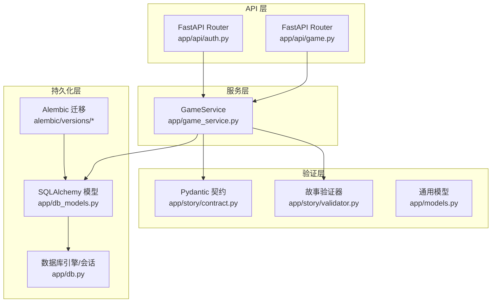
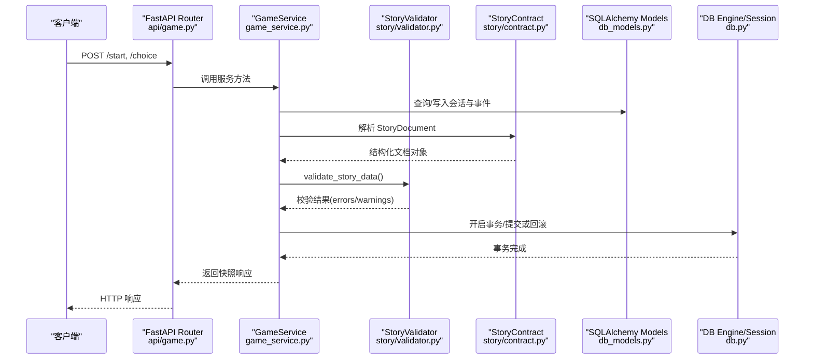
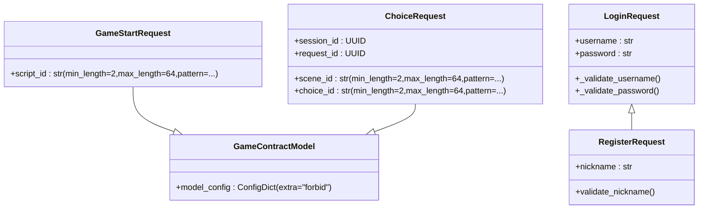
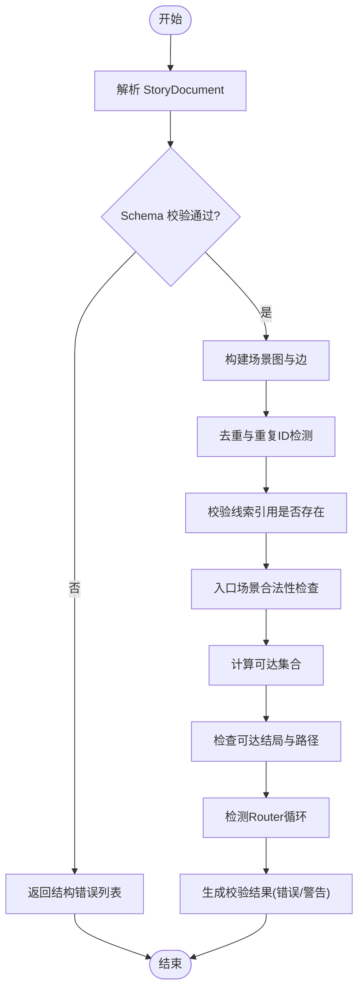
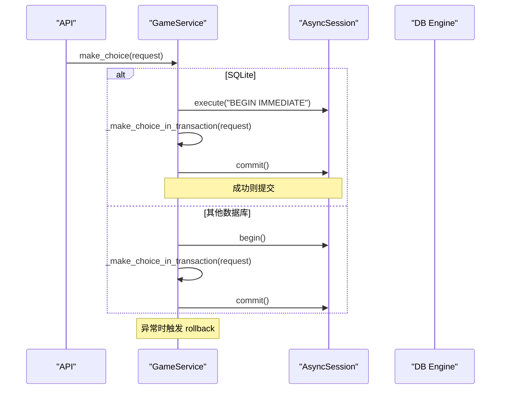
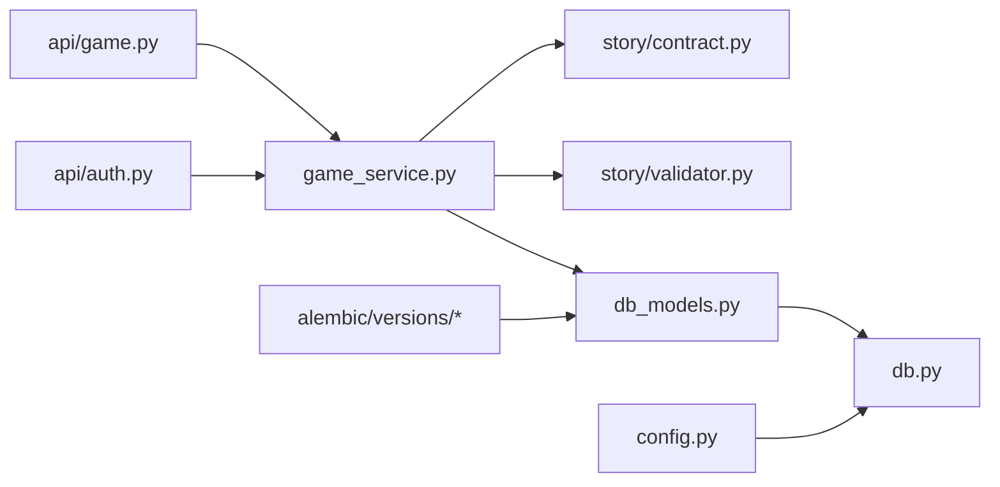

# 数据验证与约束

<cite>
**本文引用的文件**   
- [backend/app/models.py](file://backend/app/models.py)
- [backend/app/db_models.py](file://backend/app/db_models.py)
- [backend/app/config.py](file://backend/app/config.py)
- [backend/app/game_errors.py](file://backend/app/game_errors.py)
- [backend/app/story/validator.py](file://backend/app/story/validator.py)
- [backend/app/story/contract.py](file://backend/app/story/contract.py)
- [backend/app/api/game.py](file://backend/app/api/game.py)
- [backend/app/api/auth.py](file://backend/app/api/auth.py)
- [backend/app/game_service.py](file://backend/app/game_service.py)
- [backend/app/db.py](file://backend/app/db.py)
- [backend/alembic/versions/20260803_0001_game_persistence.py](file://backend/alembic/versions/20260803_0001_game_persistence.py)
- [backend/alembic/versions/20260804_0002_auth_persistence.py](file://backend/alembic/versions/20260804_0002_auth_persistence.py)
</cite>

## 目录
1. [简介](#简介)
2. [项目结构](#项目结构)
3. [核心组件](#核心组件)
4. [架构总览](#架构总览)
5. [详细组件分析](#详细组件分析)
6. [依赖关系分析](#依赖关系分析)
7. [性能考量](#性能考量)
8. [故障排查指南](#故障排查指南)
9. [结论](#结论)
10. [附录](#附录)

## 简介
本文件系统化梳理本项目中的数据验证与约束实现，覆盖以下方面：
- Pydantic 模型的数据验证规则（字段类型检查、格式校验、业务逻辑校验）
- 数据库级约束（CheckConstraint、UniqueConstraint、ForeignKey）
- 数据完整性保障机制（事务处理与回滚策略）
- 自定义验证器、错误消息定制与验证性能优化
- 验证规则示例与调试技巧

## 项目结构
后端采用 FastAPI + SQLAlchemy ORM + Alembic 迁移的架构。数据验证分为三层：
- API 层请求体使用 Pydantic BaseModel 进行强类型与格式校验
- 故事文档（JSON）通过 Pydantic 严格契约与自定义验证器进行结构与语义校验
- 持久化层通过 SQLAlchemy 模型与 Alembic 迁移定义数据库级约束，确保一致性



图表来源
- [backend/app/api/game.py:1-37](file://backend/app/api/game.py#L1-L37)
- [backend/app/api/auth.py:1-97](file://backend/app/api/auth.py#L1-L97)
- [backend/app/game_service.py:1-386](file://backend/app/game_service.py#L1-L386)
- [backend/app/story/contract.py:1-128](file://backend/app/story/contract.py#L1-L128)
- [backend/app/story/validator.py:1-251](file://backend/app/story/validator.py#L1-L251)
- [backend/app/models.py:1-146](file://backend/app/models.py#L1-L146)
- [backend/app/db_models.py:1-160](file://backend/app/db_models.py#L1-L160)
- [backend/app/db.py:1-42](file://backend/app/db.py#L1-L42)
- [backend/alembic/versions/20260803_0001_game_persistence.py:1-129](file://backend/alembic/versions/20260803_0001_game_persistence.py#L1-L129)
- [backend/alembic/versions/20260804_0002_auth_persistence.py:1-55](file://backend/alembic/versions/20260804_0002_auth_persistence.py#L1-L55)

章节来源
- [backend/app/api/game.py:1-37](file://backend/app/api/game.py#L1-L37)
- [backend/app/api/auth.py:1-97](file://backend/app/api/auth.py#L1-L97)
- [backend/app/game_service.py:1-386](file://backend/app/game_service.py#L1-L386)
- [backend/app/story/contract.py:1-128](file://backend/app/story/contract.py#L1-L128)
- [backend/app/story/validator.py:1-251](file://backend/app/story/validator.py#L1-L251)
- [backend/app/models.py:1-146](file://backend/app/models.py#L1-L146)
- [backend/app/db_models.py:1-160](file://backend/app/db_models.py#L1-L160)
- [backend/app/db.py:1-42](file://backend/app/db.py#L1-L42)
- [backend/alembic/versions/20260803_0001_game_persistence.py:1-129](file://backend/alembic/versions/20260803_0001_game_persistence.py#L1-L129)
- [backend/alembic/versions/20260804_0002_auth_persistence.py:1-55](file://backend/alembic/versions/20260804_0002_auth_persistence.py#L1-L55)

## 核心组件
- Pydantic 契约与模型
  - 通用响应/请求模型用于 API 输入输出校验与序列化
  - 故事文档契约对 JSON 结构进行严格校验，包含字段范围、URL 格式、枚举值等
  - 自定义 field_validator 与 model_validator 实现复杂业务规则
- 故事验证器
  - 在 Pydantic 基础校验之上，进行图结构、可达性、循环、默认路由等语义校验
  - 返回结构化结果，包含错误与警告
- 数据库模型与约束
  - 使用 CheckConstraint 限制状态枚举
  - UniqueConstraint 保证唯一性（如版本号、哈希、用户名键、事件序列号）
  - ForeignKey 维护引用完整性（故事-版本、会话-事件、用户-会话等）
- 事务与回滚
  - 选择分支操作使用显式事务，SQLite 特殊处理以支持立即锁定与回滚
  - 幂等性通过 request_id 去重，避免重复提交导致的状态不一致

章节来源
- [backend/app/models.py:1-146](file://backend/app/models.py#L1-L146)
- [backend/app/story/contract.py:1-128](file://backend/app/story/contract.py#L1-L128)
- [backend/app/story/validator.py:1-251](file://backend/app/story/validator.py#L1-L251)
- [backend/app/db_models.py:1-160](file://backend/app/db_models.py#L1-L160)
- [backend/app/game_service.py:1-386](file://backend/app/game_service.py#L1-L386)
- [backend/alembic/versions/20260803_0001_game_persistence.py:1-129](file://backend/alembic/versions/20260803_0001_game_persistence.py#L1-L129)
- [backend/alembic/versions/20260804_0002_auth_persistence.py:1-55](file://backend/alembic/versions/20260804_0002_auth_persistence.py#L1-L55)

## 架构总览
下图展示从 API 到数据库的完整数据流与验证点：



图表来源
- [backend/app/api/game.py:1-37](file://backend/app/api/game.py#L1-L37)
- [backend/app/game_service.py:1-386](file://backend/app/game_service.py#L1-L386)
- [backend/app/story/validator.py:1-251](file://backend/app/story/validator.py#L1-L251)
- [backend/app/story/contract.py:1-128](file://backend/app/story/contract.py#L1-L128)
- [backend/app/db_models.py:1-160](file://backend/app/db_models.py#L1-L160)
- [backend/app/db.py:1-42](file://backend/app/db.py#L1-L42)

## 详细组件分析

### Pydantic 模型与 API 层验证
- 通用模型
  - GameContractModel 启用 extra="forbid"，拒绝未知字段
  - 请求/响应模型定义字段长度、模式、枚举等约束
- 认证相关模型
  - LoginRequest/RegisterRequest 使用 field_validator 对用户名、密码、昵称进行校验
  - 注册流程中捕获 IntegrityError 并转换为 HTTP 409



图表来源
- [backend/app/models.py:1-146](file://backend/app/models.py#L1-L146)
- [backend/app/api/auth.py:1-97](file://backend/app/api/auth.py#L1-L97)

章节来源
- [backend/app/models.py:1-146](file://backend/app/models.py#L1-L146)
- [backend/app/api/auth.py:1-97](file://backend/app/api/auth.py#L1-L97)

### 故事文档契约与自定义验证器
- 契约（contract.py）
  - Identifier 统一标识符约束（长度、正则）
  - Media 要求 HTTP(S) URL、非空、时长大于 0
  - RouteCondition 使用 model_validator 校验条件形状与去重
  - EndingScene 禁止 choices
- 验证器（validator.py）
  - 先进行 Pydantic 结构校验，再执行语义校验
  - 检测重复 ID、未定义线索引用、缺失跳转目标、入口场景合法性
  - 计算可达性与终点可达性，检测不可达场景与无结局路径
  - 检测 router 循环与默认路由优先级规则



图表来源
- [backend/app/story/contract.py:1-128](file://backend/app/story/contract.py#L1-L128)
- [backend/app/story/validator.py:1-251](file://backend/app/story/validator.py#L1-L251)

章节来源
- [backend/app/story/contract.py:1-128](file://backend/app/story/contract.py#L1-L128)
- [backend/app/story/validator.py:1-251](file://backend/app/story/validator.py#L1-L251)

### 数据库级约束与完整性
- CheckConstraint
  - stories.status、story_versions.status、game_sessions.status、users.role 限定为枚举值
- UniqueConstraint
  - story_versions.story_id+version_number、story_versions.story_id+content_hash
  - game_events.session_id+sequence_number、game_events.session_id+request_id
  - users.username_key、auth_sessions.token_digest
- ForeignKey
  - story_versions.story_id -> stories.id (RESTRICT)
  - stories.active_version_id -> story_versions.id (SET NULL)
  - game_sessions.story_version_id -> story_versions.id (RESTRICT)
  - game_events.session_id -> game_sessions.id (CASCADE)
  - session_clues.session_id -> game_sessions.id (CASCADE)
  - session_clues.source_event_id -> game_events.id (SET NULL)
  - auth_sessions.user_id -> users.id (CASCADE)

```mermaid
erDiagram
STORIES ||--o{ STORY_VERSIONS : "active_version_id"
STORY_VERSIONS ||--o{ GAME_SESSIONS : "story_version_id"
GAME_SESSIONS ||--o{ GAME_EVENTS : "session_id"
GAME_SESSIONS ||--o{ SESSION_CLUES : "session_id"
GAME_EVENTS ||--o{ SESSION_CLUES : "source_event_id"
USERS ||--o{ AUTH_SESSIONS : "user_id"
STORIES {
string id PK
string slug UK
string title
text description
string status CK
string active_version_id FK
datetime created_at
datetime updated_at
}
STORY_VERSIONS {
string id PK
string story_id FK
int version_number
int schema_version
string status CK
json content_json
string content_hash
datetime created_at
datetime published_at
}
GAME_SESSIONS {
string id PK
string story_version_id FK
string current_scene_key
string status CK
string ending_scene_key
datetime started_at
datetime last_active_at
datetime completed_at
}
GAME_EVENTS {
int id PK
string session_id FK
int sequence_number
string event_type
string scene_key
string choice_key
string next_scene_key
string request_id
json payload_json
datetime created_at
}
SESSION_CLUES {
string session_id PK
string clue_key PK
int source_event_id FK
datetime acquired_at
}
USERS {
string id PK
string username
string username_key UK
string nickname
string password_hash
string role CK
boolean is_active
datetime created_at
}
AUTH_SESSIONS {
string id PK
string token_digest UK
string user_id FK
datetime created_at
datetime last_used_at
datetime expires_at
}
```

图表来源
- [backend/app/db_models.py:1-160](file://backend/app/db_models.py#L1-L160)
- [backend/alembic/versions/20260803_0001_game_persistence.py:1-129](file://backend/alembic/versions/20260803_0001_game_persistence.py#L1-L129)
- [backend/alembic/versions/20260804_0002_auth_persistence.py:1-55](file://backend/alembic/versions/20260804_0002_auth_persistence.py#L1-L55)

章节来源
- [backend/app/db_models.py:1-160](file://backend/app/db_models.py#L1-L160)
- [backend/alembic/versions/20260803_0001_game_persistence.py:1-129](file://backend/alembic/versions/20260803_0001_game_persistence.py#L1-L129)
- [backend/alembic/versions/20260804_0002_auth_persistence.py:1-55](file://backend/alembic/versions/20260804_0002_auth_persistence.py#L1-L55)

### 事务处理与回滚策略
- SQLite 特殊处理
  - 在 make_choice 前执行 BEGIN IMMEDIATE，随后 try/except 捕获异常并 rollback
  - 其他数据库使用 with self.session.begin() 自动管理事务
- 幂等性
  - 通过 request_id 查找已处理事件，若存在则直接返回缓存的响应
  - 若发现冲突（相同 request_id 对应不同请求），抛出幂等冲突错误
- 一致性
  - 选择分支、线索授予、场景推进在同一事务内完成
  - 失败时回滚，保证会话与事件的一致性



图表来源
- [backend/app/game_service.py:1-386](file://backend/app/game_service.py#L1-L386)
- [backend/app/db.py:1-42](file://backend/app/db.py#L1-L42)

章节来源
- [backend/app/game_service.py:1-386](file://backend/app/game_service.py#L1-L386)
- [backend/app/db.py:1-42](file://backend/app/db.py#L1-L42)

### 错误处理与消息定制
- 应用层错误
  - GameError 提供统一的错误码、HTTP 状态码、消息与详情
- API 层错误
  - 认证接口将 IntegrityError 映射为 409 重复用户名
  - 游戏服务抛出业务错误（会话不存在、已结束、场景不匹配、选项不可用等）
- 验证错误
  - 故事验证器返回结构化错误列表，便于前端提示与调试

章节来源
- [backend/app/game_errors.py:1-20](file://backend/app/game_errors.py#L1-L20)
- [backend/app/api/auth.py:1-97](file://backend/app/api/auth.py#L1-L97)
- [backend/app/game_service.py:1-386](file://backend/app/game_service.py#L1-L386)
- [backend/app/story/validator.py:1-251](file://backend/app/story/validator.py#L1-L251)

## 依赖关系分析
- API 路由依赖服务层，服务层依赖验证器与数据库模型
- 验证器依赖契约模型，契约模型使用 Pydantic 高级特性
- 数据库模型通过 Alembic 迁移创建表与约束
- 配置模块提供运行时设置（数据库 URL、CORS、环境标志等）



图表来源
- [backend/app/api/game.py:1-37](file://backend/app/api/game.py#L1-L37)
- [backend/app/api/auth.py:1-97](file://backend/app/api/auth.py#L1-L97)
- [backend/app/game_service.py:1-386](file://backend/app/game_service.py#L1-L386)
- [backend/app/story/contract.py:1-128](file://backend/app/story/contract.py#L1-L128)
- [backend/app/story/validator.py:1-251](file://backend/app/story/validator.py#L1-L251)
- [backend/app/db_models.py:1-160](file://backend/app/db_models.py#L1-L160)
- [backend/app/db.py:1-42](file://backend/app/db.py#L1-L42)
- [backend/alembic/versions/20260803_0001_game_persistence.py:1-129](file://backend/alembic/versions/20260803_0001_game_persistence.py#L1-L129)
- [backend/alembic/versions/20260804_0002_auth_persistence.py:1-55](file://backend/alembic/versions/20260804_0002_auth_persistence.py#L1-L55)
- [backend/app/config.py:1-77](file://backend/app/config.py#L1-L77)

章节来源
- [backend/app/config.py:1-77](file://backend/app/config.py#L1-L77)

## 性能考量
- Pydantic 验证性能
  - 使用 Literal、Field 约束减少运行时分支判断
  - 对大型 JSON 文档，优先进行 schema 校验，再进行昂贵的语义校验
- 数据库性能
  - 索引：stories.slug、game_sessions.story_version_id、game_events.session_id、users.username_key、auth_sessions.token_digest/user_id
  - 唯一约束避免重复插入导致的额外查询
- 事务与锁
  - SQLite 使用 BEGIN IMMEDIATE 降低写竞争
  - PostgreSQL 使用 with_for_update 行级锁防止并发修改
- 幂等性
  - 通过 request_id 去重，避免重复计算与写入

[本节为通用指导，无需特定文件来源]

## 故障排查指南
- 常见验证错误
  - 字段类型/格式错误：检查 Pydantic 字段约束（长度、正则、枚举）
  - 故事结构错误：查看 validator 返回的错误列表，定位 path 与 message
  - 数据库约束冲突：检查 UniqueConstraint 与 CheckConstraint，确认输入值合法
- 调试技巧
  - 打印 ValidationError.errors() 获取详细位置与消息
  - 使用 check_database() 快速验证数据库连通性
  - 在开发环境允许 placeholder media，生产环境强制 ready
- 事务问题
  - SQLite 下确保 BEGIN IMMEDIATE 与 rollback 正确执行
  - 检查并发场景下的幂等记录是否被破坏

章节来源
- [backend/app/story/validator.py:1-251](file://backend/app/story/validator.py#L1-L251)
- [backend/app/db.py:1-42](file://backend/app/db.py#L1-L42)
- [backend/app/game_service.py:1-386](file://backend/app/game_service.py#L1-L386)

## 结论
本项目通过多层验证与约束体系确保数据质量与一致性：
- API 层使用 Pydantic 进行强类型与格式校验
- 故事文档通过契约与自定义验证器进行结构与语义校验
- 数据库层通过 CheckConstraint、UniqueConstraint、ForeignKey 保障完整性
- 事务与幂等性设计提升并发安全与可恢复性
建议在生产环境中持续监控验证错误日志，定期审查约束规则与性能指标。

[本节为总结，无需特定文件来源]

## 附录
- 验证规则示例
  - Identifier：长度 2-64，仅小写字母、数字与下划线
  - Media：video_url/poster_url 必须为绝对 HTTP(S) URL，duration_ms > 0
  - RouteCondition：default 必须为 true 且无其他条件；非 default 必须包含至少一个有效条件且 clues 去重
  - EndingScene：choices 必须为空
- 数据库约束示例
  - status 枚举限制（draft/published/retired、active/completed/abandoned、admin/user）
  - 唯一性约束（版本号、内容哈希、用户名键、事件序列号、token 摘要）
  - 外键约束（故事-版本、会话-事件、用户-会话等）

[本节为补充说明，无需特定文件来源]