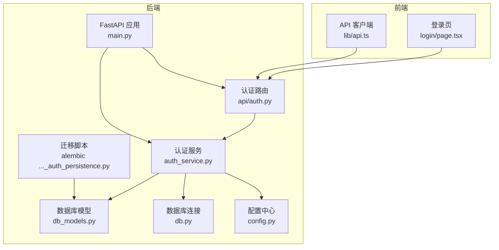
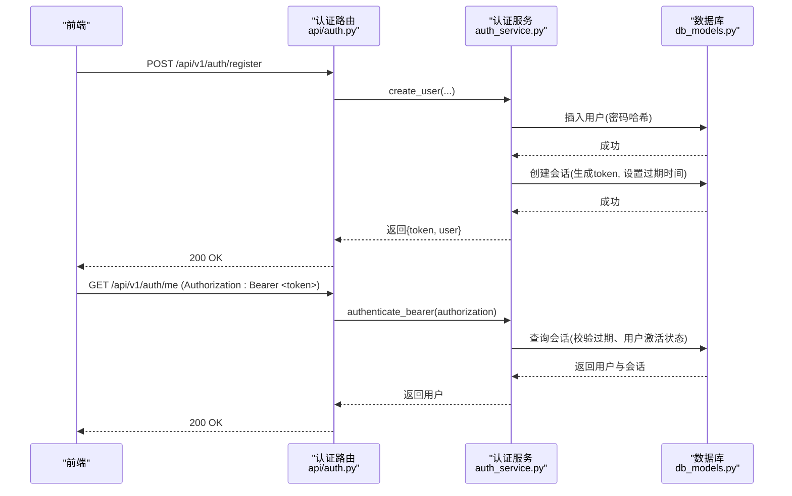
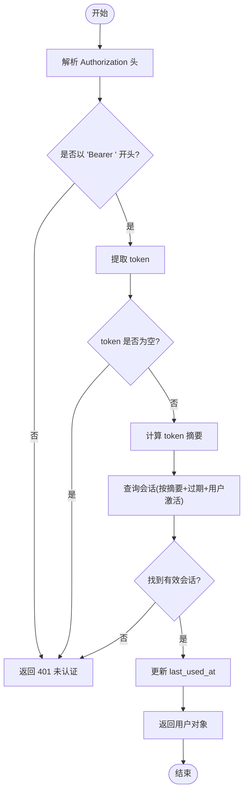
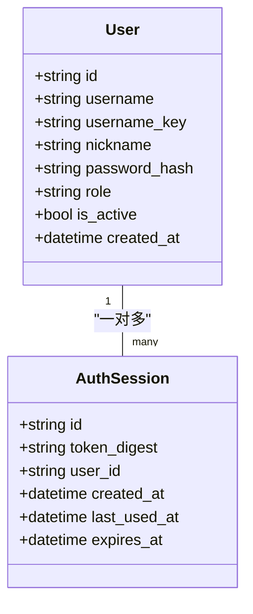
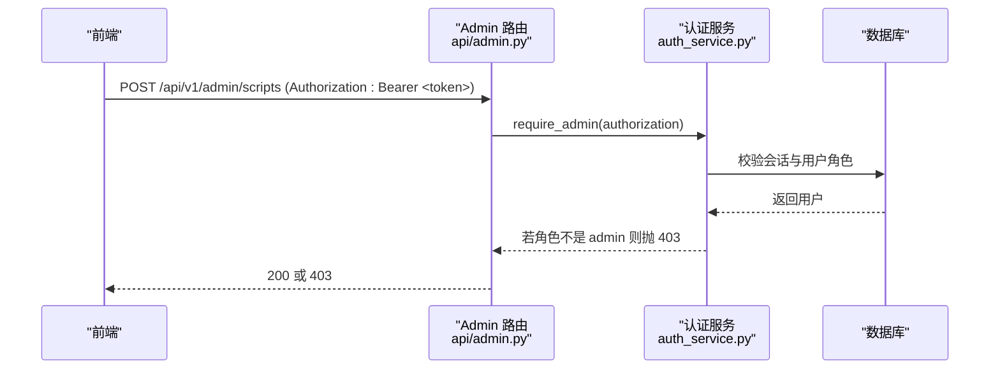
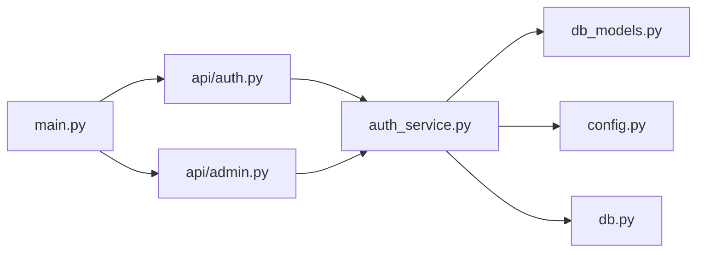

# 认证授权系统

<cite>
**本文引用的文件**   
- [backend/app/auth_service.py](file://backend/app/auth_service.py)
- [backend/app/api/auth.py](file://backend/app/api/auth.py)
- [backend/app/admin/auth.py](file://backend/app/admin/auth.py)
- [backend/app/db_models.py](file://backend/app/db_models.py)
- [backend/app/config.py](file://backend/app/config.py)
- [backend/app/main.py](file://backend/app/main.py)
- [backend/app/db.py](file://backend/app/db.py)
- [backend/alembic/versions/20260804_0002_auth_persistence.py](file://backend/alembic/versions/20260804_0002_auth_persistence.py)
- [backend/tests/test_auth_api.py](file://backend/tests/test_auth_api.py)
- [frontend/src/app/login/page.tsx](file://frontend/src/app/login/page.tsx)
- [frontend/src/lib/api.ts](file://frontend/src/lib/api.ts)
</cite>

## 目录
1. [简介](#简介)
2. [项目结构](#项目结构)
3. [核心组件](#核心组件)
4. [架构总览](#架构总览)
5. [详细组件分析](#详细组件分析)
6. [依赖关系分析](#依赖关系分析)
7. [性能与扩展性](#性能与扩展性)
8. [故障排查指南](#故障排查指南)
9. [结论](#结论)
10. [附录：API 参考与安全建议](#附录api-参考与安全建议)

## 简介
本文件系统性地梳理并文档化该项目的认证与授权实现，重点覆盖以下方面：
- 令牌机制：基于服务端持久化的 Bearer Token（非 JWT），包含生成、校验与过期控制。
- 密码安全：使用强哈希库进行密码加密存储与验证。
- 会话管理：通过数据库持久化会话记录，支持跨进程/重启恢复。
- 权限模型：基于角色的访问控制（RBAC），区分 admin 与 user。
- 安全实践：输入校验、最小错误信息泄露、CORS 配置、环境隔离等。
- 审计日志：当前未内置统一审计模块，提供扩展建议。
- 第三方登录与单点登录：当前未实现，给出集成方案与注意事项。

## 项目结构
后端采用 FastAPI + SQLAlchemy 异步 ORM，认证相关代码主要分布在以下位置：
- 认证服务层：用户注册、登录、令牌创建与校验、角色校验等。
- API 路由层：对外暴露 /api/v1/auth 接口。
- 数据模型层：用户与会话表结构定义。
- 配置与环境：令牌 TTL、演示账号、CORS 等。
- 应用启动：中间件、路由挂载、健康检查。

图表来源 
- [backend/app/main.py:17-106](file://backend/app/main.py#L17-L106)
- [backend/app/api/auth.py:24-96](file://backend/app/api/auth.py#L24-L96)
- [backend/app/auth_service.py:63-130](file://backend/app/auth_service.py#L63-L130)
- [backend/app/db_models.py:128-160](file://backend/app/db_models.py#L128-L160)
- [backend/app/db.py:26-32](file://backend/app/db.py#L26-L32)
- [backend/app/config.py:38-77](file://backend/app/config.py#L38-L77)
- [backend/alembic/versions/20260804_0002_auth_persistence.py:17-46](file://backend/alembic/versions/20260804_0002_auth_persistence.py#L17-L46)

章节来源
- [backend/app/main.py:17-106](file://backend/app/main.py#L17-L106)
- [backend/app/api/auth.py:24-96](file://backend/app/api/auth.py#L24-L96)
- [backend/app/auth_service.py:63-130](file://backend/app/auth_service.py#L63-L130)
- [backend/app/db_models.py:128-160](file://backend/app/db_models.py#L128-L160)
- [backend/app/db.py:26-32](file://backend/app/db.py#L26-L32)
- [backend/app/config.py:38-77](file://backend/app/config.py#L38-L77)
- [backend/alembic/versions/20260804_0002_auth_persistence.py:17-46](file://backend/alembic/versions/20260804_0002_auth_persistence.py#L17-L46)

## 核心组件
- 认证服务（auth_service）：负责用户名/密码校验、密码哈希、Bearer Token 生成与校验、管理员权限校验、演示账号初始化。
- 认证路由（api/auth）：对外暴露注册、登录、获取当前用户接口，封装请求参数校验与响应模型。
- 数据模型（db_models）：定义 User 与 AuthSession 表结构及关联关系。
- 配置（config）：集中管理数据库 URL、CORS、令牌 TTL、演示账号等环境变量。
- 数据库（db）：异步引擎与 Session 工厂，SQLite 特殊配置。
- 应用入口（main）：挂载路由、异常处理、健康检查、生命周期钩子。

章节来源
- [backend/app/auth_service.py:20-130](file://backend/app/auth_service.py#L20-L130)
- [backend/app/api/auth.py:24-96](file://backend/app/api/auth.py#L24-L96)
- [backend/app/db_models.py:128-160](file://backend/app/db_models.py#L128-L160)
- [backend/app/config.py:38-77](file://backend/app/config.py#L38-L77)
- [backend/app/db.py:26-32](file://backend/app/db.py#L26-L32)
- [backend/app/main.py:76-106](file://backend/app/main.py#L76-L106)

## 架构总览
整体认证流程如下：
- 前端调用 /api/v1/auth/register 或 /api/v1/auth/login。
- 路由层解析请求体，调用认证服务完成用户查找、密码校验、会话创建。
- 认证服务将用户与会话写入数据库，返回 token 与用户信息。
- 后续请求携带 Authorization: Bearer <token>，服务端校验会话有效性并返回受保护资源。

图表来源 
- [backend/app/api/auth.py:64-96](file://backend/app/api/auth.py#L64-L96)
- [backend/app/auth_service.py:63-130](file://backend/app/auth_service.py#L63-L130)
- [backend/app/db_models.py:128-160](file://backend/app/db_models.py#L128-L160)

## 详细组件分析

### 令牌机制（Bearer Token，非 JWT）
- 令牌生成：使用安全的随机源生成不可预测的 token，计算其摘要存入数据库，避免明文存储敏感值。
- 令牌校验：从 Authorization 头提取 Bearer token，计算摘要后在数据库中匹配；同时校验会话未过期且用户处于激活状态。
- 会话更新：每次成功校验会更新 last_used_at，便于追踪活跃会话。
- 过期策略：通过配置的 auth_token_ttl_hours 控制会话有效期。

图表来源 
- [backend/app/auth_service.py:100-130](file://backend/app/auth_service.py#L100-L130)

章节来源
- [backend/app/auth_service.py:51-97](file://backend/app/auth_service.py#L51-L97)
- [backend/app/auth_service.py:100-130](file://backend/app/auth_service.py#L100-L130)
- [backend/app/config.py:69-71](file://backend/app/config.py#L69-L71)

### 用户密码加密存储与验证
- 密码哈希：使用 pwdlib 的推荐算法（默认 Argon2）对密码进行哈希存储，避免明文保存。
- 密码校验：登录时通过 verify 方法比对明文与哈希值。
- 输入校验：用户名需符合正则规则（字母开头、长度限制），密码长度限制在 6-128 位。

图表来源 
- [backend/app/db_models.py:128-160](file://backend/app/db_models.py#L128-L160)

章节来源
- [backend/app/auth_service.py:20-48](file://backend/app/auth_service.py#L20-L48)
- [backend/app/api/auth.py:28-46](file://backend/app/api/auth.py#L28-L46)
- [backend/app/db_models.py:128-145](file://backend/app/db_models.py#L128-L145)

### 会话管理与持久化
- 会话表：AuthSession 记录 token 摘要、用户 ID、创建时间、最后使用时间、过期时间。
- 索引与约束：token_digest 唯一索引，user_id 外键级联删除，确保一致性。
- 迁移脚本：Alembic 版本化创建 users 与 auth_sessions 表。

章节来源
- [backend/app/db_models.py:147-160](file://backend/app/db_models.py#L147-L160)
- [backend/alembic/versions/20260804_0002_auth_persistence.py:17-46](file://backend/alembic/versions/20260804_0002_auth_persistence.py#L17-L46)

### 权限控制策略（RBAC）
- 角色模型：User.role 限定为 admin 或 user。
- 管理员校验：require_admin 在服务层校验用户角色，非 admin 返回 403。
- 路由保护：admin 路由通过 _require_admin 调用 require_admin 进行鉴权。

图表来源 
- [backend/app/api/admin.py:66-68](file://backend/app/api/admin.py#L66-L68)
- [backend/app/auth_service.py:126-130](file://backend/app/auth_service.py#L126-L130)

章节来源
- [backend/app/db_models.py:142-144](file://backend/app/db_models.py#L142-L144)
- [backend/app/auth_service.py:126-130](file://backend/app/auth_service.py#L126-L130)
- [backend/app/api/admin.py:66-68](file://backend/app/api/admin.py#L66-L68)

### 前端集成与令牌使用
- 登录/注册：前端调用 /api/v1/auth/login 与 /api/v1/auth/register，成功后将 token 与用户信息存入 localStorage。
- 后续请求：在需要认证的接口中，前端需在请求头添加 Authorization: Bearer <token>。
- 路由跳转：根据用户角色跳转到不同页面（如 admin）。

章节来源
- [frontend/src/app/login/page.tsx:31-76](file://frontend/src/app/login/page.tsx#L31-L76)
- [frontend/src/lib/api.ts:201-215](file://frontend/src/lib/api.ts#L201-L215)

## 依赖关系分析
- 认证路由依赖认证服务与数据库会话。
- 认证服务依赖配置、数据库模型与异步会话。
- 管理员路由依赖认证服务的 require_admin。
- 应用入口挂载所有路由并启用 CORS 中间件。

图表来源 
- [backend/app/main.py:84-96](file://backend/app/main.py#L84-L96)
- [backend/app/api/auth.py:24-25](file://backend/app/api/auth.py#L24-L25)
- [backend/app/api/admin.py:9-10](file://backend/app/api/admin.py#L9-L10)
- [backend/app/auth_service.py:15-17](file://backend/app/auth_service.py#L15-L17)

章节来源
- [backend/app/main.py:84-96](file://backend/app/main.py#L84-L96)
- [backend/app/api/auth.py:24-25](file://backend/app/api/auth.py#L24-L25)
- [backend/app/api/admin.py:9-10](file://backend/app/api/admin.py#L9-L10)
- [backend/app/auth_service.py:15-17](file://backend/app/auth_service.py#L15-L17)

## 性能与扩展性
- 令牌校验开销：每次请求进行一次数据库查询，建议使用缓存（如 Redis）缓存用户角色与活跃会话摘要以提升性能。
- 数据库连接：已启用 SQLite 的 foreign_keys 与 busy_timeout，生产环境建议切换至 PostgreSQL/MySQL。
- 令牌刷新：当前无刷新机制，可引入短效访问令牌与长效刷新令牌分离的方案。
- 并发与锁：在高并发下，注册接口需注意唯一性约束与事务隔离，当前已通过 IntegrityError 处理重复注册。

[本节为通用指导，不直接分析具体文件]

## 故障排查指南
- 登录失败（401）：检查用户名是否存在、密码是否正确、用户是否被禁用。
- 令牌无效（401）：检查 Authorization 头格式、令牌是否过期、用户是否被禁用。
- 权限不足（403）：确认用户角色是否为 admin。
- 数据库问题：检查迁移是否执行、连接字符串是否正确、SQLite 是否启用外键。

章节来源
- [backend/tests/test_auth_api.py:83-115](file://backend/tests/test_auth_api.py#L83-L115)
- [backend/tests/test_auth_api.py:130-173](file://backend/tests/test_auth_api.py#L130-L173)

## 结论
本项目实现了基于持久化 Bearer Token 的认证与基于角色的访问控制，具备完善的密码哈希、会话管理与基础安全实践。当前未实现 JWT、第三方登录与审计日志，建议在后续迭代中补充这些能力以提升安全性与可观测性。

[本节为总结，不直接分析具体文件]

## 附录：API 参考与安全建议

### 认证相关 API
- POST /api/v1/auth/register：注册用户，返回 token 与用户信息。
- POST /api/v1/auth/login：登录用户，返回 token 与用户信息。
- GET /api/v1/auth/me：获取当前用户信息，需携带 Authorization: Bearer <token>。

章节来源
- [backend/app/api/auth.py:64-96](file://backend/app/api/auth.py#L64-L96)

### 安全最佳实践
- 密码存储：使用强哈希算法（Argon2），避免明文存储。
- 令牌安全：仅存储摘要，定期清理过期会话，限制令牌长度与复杂度。
- 输入校验：严格校验用户名、密码、昵称等字段。
- CORS 配置：仅允许可信域名，启用 credentials。
- 环境隔离：开发环境与生产环境使用不同密钥与配置。

章节来源
- [backend/app/config.py:38-77](file://backend/app/config.py#L38-L77)
- [backend/app/main.py:76-82](file://backend/app/main.py#L76-L82)

### 防攻击措施
- 暴力破解防护：建议增加登录尝试次数限制与账户锁定机制。
- 令牌重放防护：结合 IP 白名单与请求签名。
- SQL 注入防护：使用 ORM 参数化查询，避免拼接 SQL。

[本节为通用建议，不直接分析具体文件]

### 审计日志记录
- 当前未实现统一审计模块，建议记录登录/登出、权限变更、敏感操作等事件。
- 可集成结构化日志框架（如 structlog）与外部日志服务（如 ELK）。

[本节为通用建议，不直接分析具体文件]

### 第三方登录与单点登录（SSO）
- 当前未实现 OAuth/OIDC，建议集成主流提供商（微信、Google、GitHub）。
- SSO 实现要点：统一身份源、令牌映射、会话同步、注销联动。

[本节为通用建议，不直接分析具体文件]