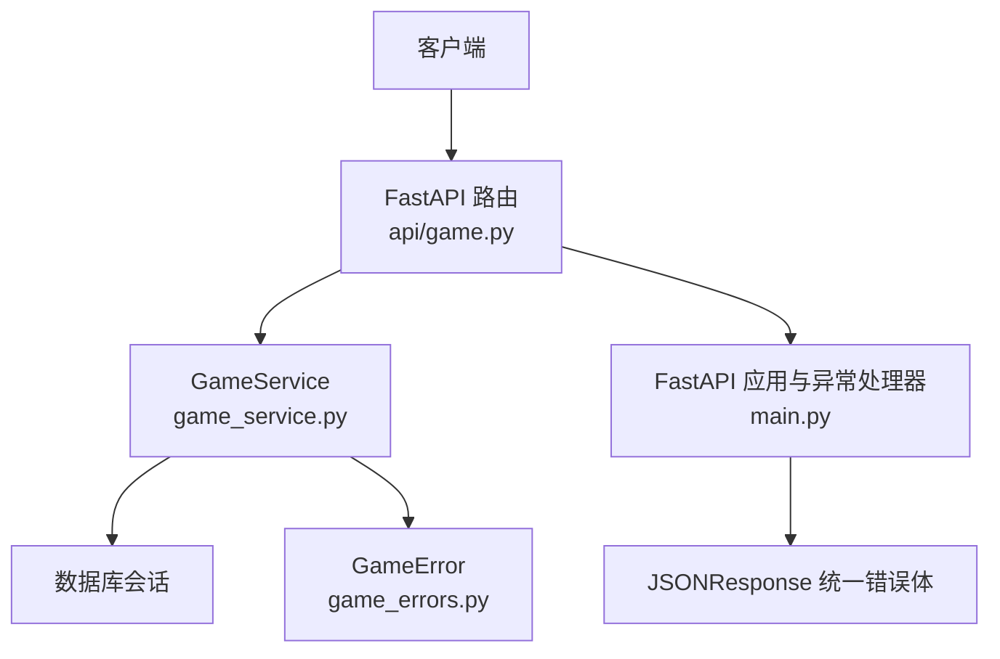
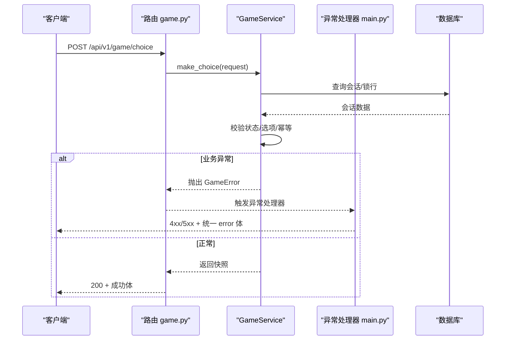
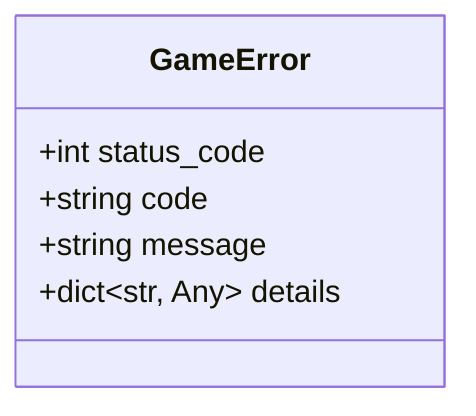
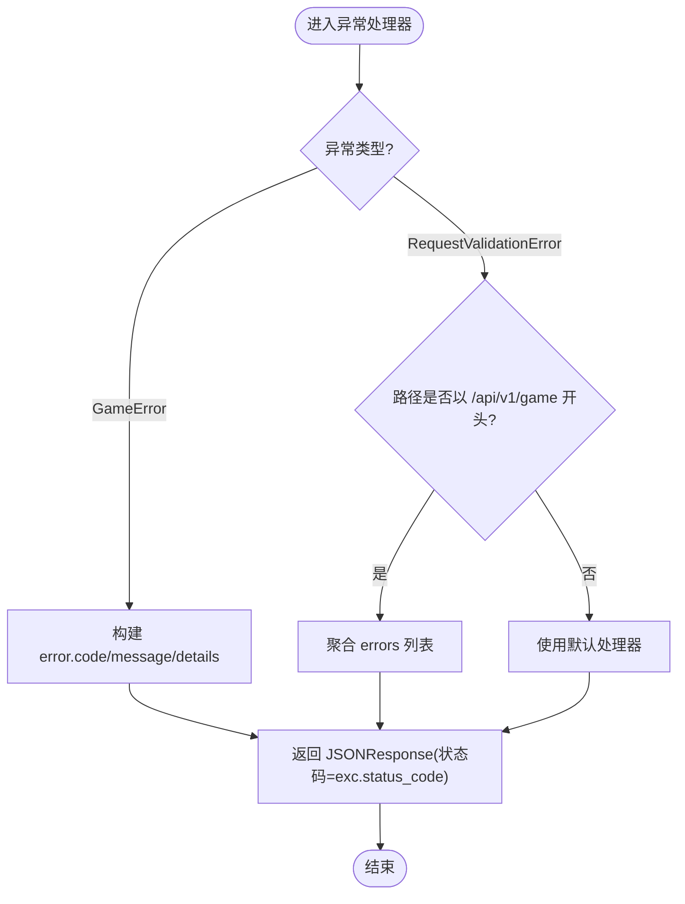
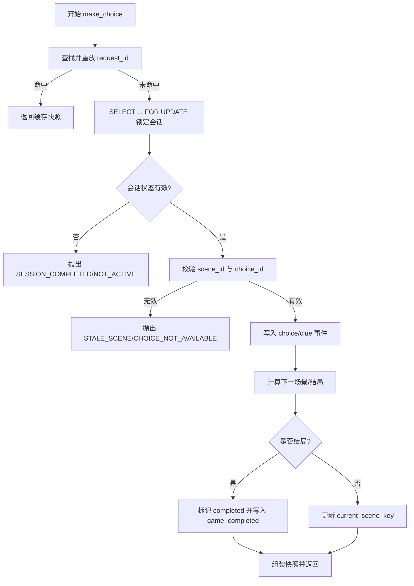
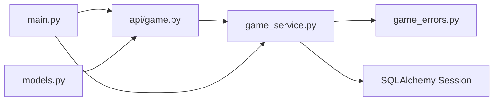

# 错误处理机制

<cite>
**本文引用的文件**   
- [backend/app/game_errors.py](file://backend/app/game_errors.py)
- [backend/app/main.py](file://backend/app/main.py)
- [backend/app/game_service.py](file://backend/app/game_service.py)
- [backend/app/api/game.py](file://backend/app/api/game.py)
- [backend/app/models.py](file://backend/app/models.py)
- [backend/app/auth_service.py](file://backend/app/auth_service.py)
- [backend/app/api/auth.py](file://backend/app/api/auth.py)
- [backend/alembic.ini](file://backend/alembic.ini)
</cite>

## 目录
1. [简介](#简介)
2. [项目结构](#项目结构)
3. [核心组件](#核心组件)
4. [架构总览](#架构总览)
5. [详细组件分析](#详细组件分析)
6. [依赖关系分析](#依赖关系分析)
7. [性能考量](#性能考量)
8. [故障排查指南](#故障排查指南)
9. [结论](#结论)
10. [附录](#附录)

## 简介
本文件系统化梳理后端错误处理机制，覆盖自定义异常类设计、错误码规范化、统一响应格式、异常捕获策略、日志与调试信息输出、HTTP 状态码映射、客户端错误提示与用户友好消息生成、错误监控告警、性能影响分析与故障恢复策略，并给出最佳实践与常见错误场景解决方案。目标是帮助开发者快速理解并扩展统一的错误处理体系，确保 API 行为稳定、可观测、可维护。

## 项目结构
错误处理相关代码主要分布在以下模块：
- 自定义异常定义：backend/app/game_errors.py
- FastAPI 应用与全局异常处理器：backend/app/main.py
- 业务层错误抛出与事务控制：backend/app/game_service.py
- 路由层（无业务错误抛出，仅透传）：backend/app/api/game.py
- 请求模型校验（Pydantic）：backend/app/models.py
- 认证服务中的 HTTP 异常使用：backend/app/auth_service.py、backend/app/api/auth.py
- Alembic 日志配置（辅助排障）：backend/alembic.ini

图表来源
- [backend/app/api/game.py:15-37](file://backend/app/api/game.py#L15-L37)
- [backend/app/game_service.py:31-193](file://backend/app/game_service.py#L31-L193)
- [backend/app/game_errors.py:7-20](file://backend/app/game_errors.py#L7-L20)
- [backend/app/main.py:36-74](file://backend/app/main.py#L36-L74)

章节来源
- [backend/app/game_errors.py:1-20](file://backend/app/game_errors.py#L1-L20)
- [backend/app/main.py:1-111](file://backend/app/main.py#L1-L111)
- [backend/app/game_service.py:1-386](file://backend/app/game_service.py#L1-L386)
- [backend/app/api/game.py:1-37](file://backend/app/api/game.py#L1-L37)
- [backend/app/models.py:1-146](file://backend/app/models.py#L1-L146)
- [backend/app/auth_service.py:1-153](file://backend/app/auth_service.py#L1-L153)
- [backend/app/api/auth.py:1-97](file://backend/app/api/auth.py#L1-L97)
- [backend/alembic.ini:1-36](file://backend/alembic.ini#L1-L36)

## 核心组件
- 自定义异常 GameError：封装 HTTP 状态码、错误码、人类可读消息与可选详情字段，用于业务层统一抛错。
- 全局异常处理器：
  - GameError 处理器：将业务异常转换为统一 JSON 错误体，保持 HTTP 状态码一致。
  - RequestValidationError 处理器：对 /api/v1/game 路径的请求参数校验失败进行统一格式化，返回 422 与结构化 details。
- 业务服务 GameService：在关键路径抛出语义化错误码，如会话不存在、故事未发布、选项不可用、幂等冲突等。
- 认证服务 auth_service：使用 FastAPI 的 HTTPException 处理鉴权失败与权限不足，便于与其他模块区分处理。
- 路由 api/game：仅负责参数绑定与调用服务，不直接抛错，保证错误处理集中在服务与框架层。

章节来源
- [backend/app/game_errors.py:7-20](file://backend/app/game_errors.py#L7-L20)
- [backend/app/main.py:36-74](file://backend/app/main.py#L36-L74)
- [backend/app/game_service.py:63-193](file://backend/app/game_service.py#L63-L193)
- [backend/app/auth_service.py:100-130](file://backend/app/auth_service.py#L100-L130)
- [backend/app/api/game.py:15-37](file://backend/app/api/game.py#L15-L37)

## 架构总览
下图展示一次选择请求的错误处理流程：路由接收请求，服务层抛出 GameError，FastAPI 全局处理器将其转为统一 JSON 错误体返回客户端。

图表来源
- [backend/app/api/game.py:23-28](file://backend/app/api/game.py#L23-L28)
- [backend/app/game_service.py:70-193](file://backend/app/game_service.py#L70-L193)
- [backend/app/main.py:38-49](file://backend/app/main.py#L38-L49)

## 详细组件分析

### 自定义异常类 GameError
- 设计要点：
  - 包含 status_code、code、message、details 四个关键字段，确保 HTTP 语义、机器可读错误码、人类可读消息与调试细节分离。
  - details 支持任意字典，便于携带上下文（如 story_version_id、submitted_scene_id 等）。
- 复杂度与开销：
  - 构造为 O(1)，序列化由上层 jsonable_encoder 处理，避免在服务层做昂贵转换。
- 使用建议：
  - 所有业务错误均应通过 GameError 抛出，禁止在路由层直接拼接 JSON 或混用不同错误格式。

图表来源
- [backend/app/game_errors.py:7-20](file://backend/app/game_errors.py#L7-L20)

章节来源
- [backend/app/game_errors.py:1-20](file://backend/app/game_errors.py#L1-L20)

### 全局异常处理器与统一响应格式
- GameError 处理器：
  - 将 GameError 的 status_code、code、message、details 映射到 JSON 的 error 对象，保持 HTTP 状态码与业务错误码一致。
- 请求校验处理器（RequestValidationError）：
  - 针对 /api/v1/game 路径，将 Pydantic 校验错误聚合为 errors 数组，每个元素包含 path、message、type，便于前端定位问题字段。
  - 非游戏接口保留默认行为，避免破坏其他模块的校验体验。
- 健康检查与健康降级：
  - /api/v1/health 在数据库不可用时返回 503 与 degraded 状态，便于网关与探针识别。

图表来源
- [backend/app/main.py:38-74](file://backend/app/main.py#L38-L74)

章节来源
- [backend/app/main.py:36-74](file://backend/app/main.py#L36-L74)

### 业务层错误抛出与事务控制（GameService）
- 会话与故事校验：
  - 会话不存在：404 SESSION_NOT_FOUND
  - 故事未找到或未发布：404 STORY_NOT_FOUND、409 STORY_NOT_PUBLISHED
  - 故事版本不可用或媒体未就绪：503 STORY_NOT_READY
- 选择处理：
  - 会话已结束/不可继续：409 SESSION_COMPLETED、SESSION_NOT_ACTIVE
  - 提交的场景与当前不一致：409 STALE_SCENE（附带 submitted/current scene id）
  - 选项不属于当前场景：409 CHOICE_NOT_AVAILABLE
  - 幂等冲突与记录损坏：409 IDEMPOTENCY_CONFLICT、500 IDEMPOTENCY_RECORD_CORRUPTED
  - 剧情数据异常：500 STORY_DATA_CORRUPTED
- 事务与回滚：
  - SQLite 下使用 BEGIN IMMEDIATE 显式事务，异常时回滚；PostgreSQL 使用 with session.begin() 自动管理。
  - 选择事件、线索授予、结局标记均写入事件表，保证可重放与审计。

图表来源
- [backend/app/game_service.py:70-193](file://backend/app/game_service.py#L70-L193)

章节来源
- [backend/app/game_service.py:63-193](file://backend/app/game_service.py#L63-L193)

### 认证与授权错误（auth_service 与 api/auth）
- 认证失败：
  - 缺少 Authorization 或格式错误：401 Not authenticated
  - Token 无效或过期：401 Invalid token
- 权限不足：
  - 非管理员访问受保护资源：403 Admin access required
- 注册冲突：
  - 用户名已存在：409 Username already exists（含 Pydantic 校验与数据库唯一约束双重保护）

章节来源
- [backend/app/auth_service.py:100-130](file://backend/app/auth_service.py#L100-L130)
- [backend/app/api/auth.py:64-87](file://backend/app/api/auth.py#L64-L87)

### 请求模型与校验（models.py）
- 使用 Pydantic BaseModel 定义严格契约，启用 extra="forbid" 防止未知字段。
- 关键字段包含长度、正则模式限制，减少非法输入进入服务层。
- 校验失败由 FastAPI 统一处理，并在 /api/v1/game 路径下返回结构化 details。

章节来源
- [backend/app/models.py:8-92](file://backend/app/models.py#L8-L92)

## 依赖关系分析
- 模块耦合：
  - api/game 依赖 game_service，不直接抛错，降低耦合度。
  - game_service 依赖 game_errors 与数据库模型，集中业务错误语义。
  - main.py 作为入口，集中异常处理器与中间件，屏蔽底层差异。
- 外部依赖：
  - FastAPI 异常处理与 JSONResponse。
  - SQLAlchemy 异步会话与事务。
  - Pydantic 请求校验。

图表来源
- [backend/app/api/game.py:15-37](file://backend/app/api/game.py#L15-L37)
- [backend/app/game_service.py:31-193](file://backend/app/game_service.py#L31-L193)
- [backend/app/game_errors.py:7-20](file://backend/app/game_errors.py#L7-L20)
- [backend/app/main.py:36-74](file://backend/app/main.py#L36-L74)
- [backend/app/models.py:8-92](file://backend/app/models.py#L8-L92)

章节来源
- [backend/app/api/game.py:1-37](file://backend/app/api/game.py#L1-L37)
- [backend/app/game_service.py:1-386](file://backend/app/game_service.py#L1-L386)
- [backend/app/game_errors.py:1-20](file://backend/app/game_errors.py#L1-L20)
- [backend/app/main.py:1-111](file://backend/app/main.py#L1-L111)
- [backend/app/models.py:1-146](file://backend/app/models.py#L1-L146)

## 性能考量
- 异常构造开销低：GameError 仅存储必要字段，序列化延迟至响应阶段。
- 事务粒度：
  - SQLite 使用 BEGIN IMMEDIATE 避免写竞争；PostgreSQL 使用 with session.begin() 自动管理。
  - 选择处理中先查重放再落库，减少重复计算与写入。
- 校验前置：
  - Pydantic 校验在路由层完成，尽早拒绝非法请求，降低服务层压力。
- 健康检查：
  - /api/v1/health 快速探测数据库可用性，避免上游流量打满不可用节点。

[本节为通用指导，不直接分析具体文件]

## 故障排查指南
- 常见问题与定位：
  - 会话不存在：检查 session_id 是否正确传递与会话生命周期。
  - 故事未发布/不可用：确认脚本 slug、active_version_id 与媒体准备状态。
  - 选项不可用：核对 scene_id 与 choice_id 是否匹配当前场景。
  - 幂等冲突：检查 request_id 是否被复用且 payload 不一致。
- 日志与调试：
  - Alembic 日志级别与输出位置可在 alembic.ini 调整，便于迁移与初始化问题定位。
  - 建议在服务层对关键路径增加结构化日志（如 request_id、session_id、scene_id），便于追踪。
- 恢复策略：
  - 幂等重试：客户端基于 request_id 重试，服务端返回相同快照。
  - 健康降级：当数据库不可用时，健康端点返回 503，网关应停止转发新请求。
  - 数据修复：若出现 STORY_DATA_CORRUPTED，需检查已发布版本内容与图遍历逻辑一致性。

章节来源
- [backend/alembic.ini:1-36](file://backend/alembic.ini#L1-L36)
- [backend/app/game_service.py:353-368](file://backend/app/game_service.py#L353-L368)

## 结论
本项目采用“自定义异常 + 全局处理器 + 服务层语义化错误码”的统一错误处理体系，实现了清晰的 HTTP 状态码映射、稳定的 JSON 错误体结构与良好的可观测性。通过前置校验、事务控制与幂等设计，提升了系统的健壮性与可恢复性。建议在生产环境补充结构化日志与指标上报，进一步完善监控告警与故障自愈能力。

[本节为总结性内容，不直接分析具体文件]

## 附录

### 错误码规范与示例
- 客户端错误（4xx）：
  - SESSION_NOT_FOUND：会话不存在
  - STORY_NOT_FOUND：故事不存在
  - STORY_NOT_PUBLISHED：故事尚未发布
  - CHOICE_NOT_AVAILABLE：选项不属于当前场景
  - STALE_SCENE：提交的场景不是当前游戏场景
  - IDEMPOTENCY_CONFLICT：request_id 已用于不同的选择请求
  - VALIDATION_ERROR：请求字段、类型或格式不合法
- 服务端错误（5xx）：
  - STORY_NOT_READY：故事没有可用的已发布版本或媒体未就绪
  - STORY_DATA_CORRUPTED：会话绑定的剧情数据异常
  - IDEMPOTENCY_RECORD_CORRUPTED：幂等响应记录异常

章节来源
- [backend/app/game_service.py:63-193](file://backend/app/game_service.py#L63-L193)
- [backend/app/main.py:51-74](file://backend/app/main.py#L51-L74)

### 统一响应格式
- 成功响应：由各路由 response_model 定义（如 GameSnapshot）。
- 错误响应：
  - 结构：{ "error": { "code": "...", "message": "...", "details": {...} } }
  - 状态码：来自 GameError.status_code 或框架默认（如 422 校验错误）。

章节来源
- [backend/app/main.py:38-49](file://backend/app/main.py#L38-L49)
- [backend/app/models.py:72-92](file://backend/app/models.py#L72-L92)

### 最佳实践
- 统一抛错：业务层一律使用 GameError，避免混用 HTTPException 与自定义 JSON。
- 错误码命名：采用大写下划线，语义清晰，避免歧义。
- 详情字段：仅在 details 中携带调试所需的最小集合，避免泄露敏感信息。
- 校验前置：尽量在 Pydantic 层拦截非法输入，减少服务层分支。
- 幂等设计：对关键操作提供 request_id，服务端去重并返回一致结果。
- 健康检查：对外暴露健康端点，配合网关与探针实现快速故障隔离。

[本节为通用指导，不直接分析具体文件]