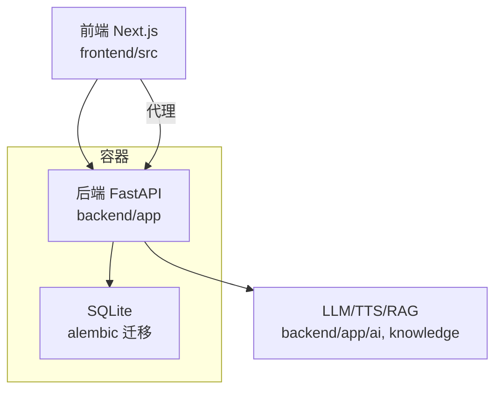
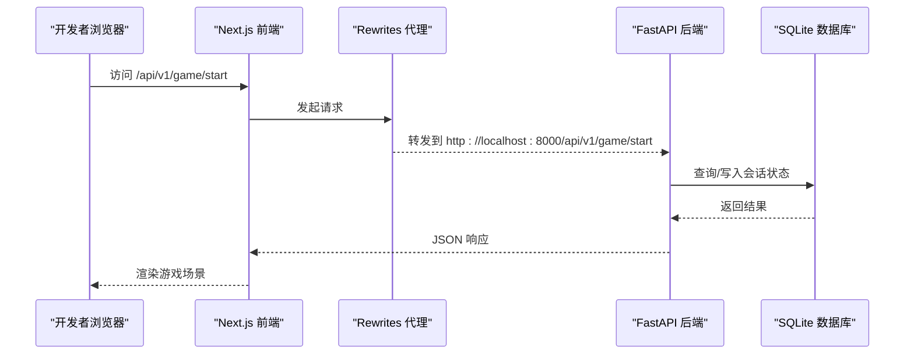
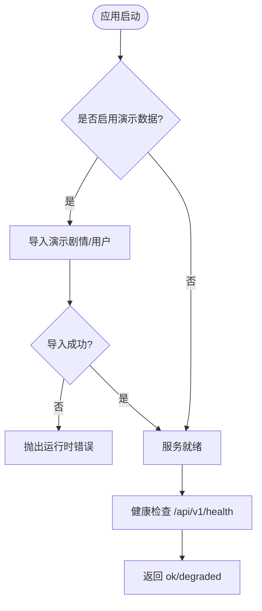
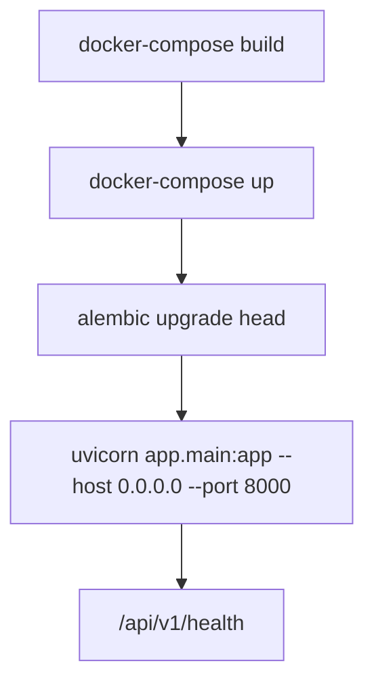
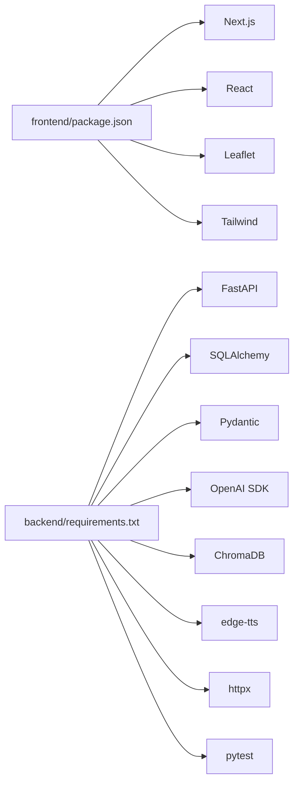

# 开发工作流

<cite>
**本文引用的文件**
- [README.md](file://README.md)
- [GITHUB_GUIDE.md](file://GITHUB_GUIDE.md)
- [TASK_BREAKDOWN.md](file://TASK_BREAKDOWN.md)
- [docker-compose.yml](file://docker-compose.yml)
- [backend/Dockerfile](file://backend/Dockerfile)
- [backend/requirements.txt](file://backend/requirements.txt)
- [backend/app/main.py](file://backend/app/main.py)
- [backend/app/config.py](file://backend/app/config.py)
- [frontend/package.json](file://frontend/package.json)
- [frontend/next.config.ts](file://frontend/next.config.ts)
- [frontend/src/lib/api.ts](file://frontend/src/lib/api.ts)
- [backend/pytest.ini](file://backend/pytest.ini)
</cite>

## 目录
1. [简介](#简介)
2. [项目结构](#项目结构)
3. [核心组件](#核心组件)
4. [架构总览](#架构总览)
5. [详细组件分析](#详细组件分析)
6. [依赖分析](#依赖分析)
7. [性能考虑](#性能考虑)
8. [故障排查指南](#故障排查指南)
9. [结论](#结论)
10. [附录](#附录)

## 简介
本文件为澳秘 Macau Mystery 项目的完整开发工作流程说明，覆盖 Git 分支策略与版本控制规范、代码提交与审查流程、任务管理生命周期、调试与性能分析方法、持续集成与自动化测试执行流程。目标是让不同技术背景的团队成员都能高效协作，保证代码质量与交付节奏。

## 项目结构
- 前端：Next.js 14 + TypeScript + Tailwind CSS + shadcn/ui，提供游戏交互、UGC 创作与管理后台页面。
- 后端：FastAPI + SQLite（aiosqlite）+ Alembic 迁移，提供游戏会话、AI NPC、UGC 生成、认证与管理接口。
- AI 能力：通过 SiliconFlow 接入 LLM，edge-tts 提供语音合成，ChromaDB 用于知识库检索。
- 容器化：Docker 与 docker-compose 支持一键启动后端服务与数据库持久化。



**图示来源**
- [backend/app/main.py:1-111](file://backend/app/main.py#L1-L111)
- [frontend/next.config.ts:1-15](file://frontend/next.config.ts#L1-L15)
- [docker-compose.yml:1-21](file://docker-compose.yml#L1-L21)

**章节来源**
- [README.md:1-59](file://README.md#L1-L59)

## 核心组件
- 后端入口与路由注册：统一创建应用、注册中间件、异常处理、健康检查与路由分组。
- 配置中心：集中读取环境变量，提供默认值与校验，支持多环境切换。
- 前端 API 客户端：封装请求、鉴权头注入、类型定义与模块划分（game/ai/ugc/admin/auth）。
- 容器编排：构建镜像、暴露端口、挂载数据卷、自动执行迁移并启动服务。

**章节来源**
- [backend/app/main.py:1-111](file://backend/app/main.py#L1-L111)
- [backend/app/config.py:1-77](file://backend/app/config.py#L1-L77)
- [frontend/src/lib/api.ts:1-216](file://frontend/src/lib/api.ts#L1-L216)
- [docker-compose.yml:1-21](file://docker-compose.yml#L1-L21)

## 架构总览
系统采用前后端分离架构，前端通过 Next.js 的 rewrites 将 /api/v1/* 转发到本地后端 8000 端口；后端以 FastAPI 提供服务，使用 Alembic 进行数据库迁移，并通过 Docker 容器化运行。



**图示来源**
- [frontend/next.config.ts:1-15](file://frontend/next.config.ts#L1-L15)
- [backend/app/main.py:1-111](file://backend/app/main.py#L1-L111)

## 详细组件分析

### Git 分支策略与版本控制规范
- 主分支：main（或 master，依仓库设置），受保护，禁止直接推送，必须通过 PR 合并。
- 功能分支：按人员与特性命名，如 a-hero-redesign、b-business-plan、c-siliconflow-integration、d-my-scripts-page。
- 发布分支：里程碑时打标签 v0.x，便于追踪版本。
- 热修复分支：紧急修复建议从 main 拉取 hotfix/<issue-id> 分支，完成后 PR 回 main。
- 冲突解决：rebase 优先，必要时 stash 暂存变更，解决冲突后继续。

**章节来源**
- [GITHUB_GUIDE.md:1-214](file://GITHUB_GUIDE.md#L1-L214)
- [TASK_BREAKDOWN.md:202-211](file://TASK_BREAKDOWN.md#L202-L211)

### 代码提交规范与审查流程
- Commit Message 前缀：feat、fix、docs、style、refactor、test 等，保持语义清晰。
- 审查流程：所有变更通过 PR 进入 main，至少 1 人批准；新提交会刷新旧审批。
- 合并策略：PR 通过后由维护者合并并删除分支，保持历史整洁。

**章节来源**
- [GITHUB_GUIDE.md:135-146](file://GITHUB_GUIDE.md#L135-L146)
- [GITHUB_GUIDE.md:39-50](file://GITHUB_GUIDE.md#L39-L50)
- [GITHUB_GUIDE.md:90-107](file://GITHUB_GUIDE.md#L90-L107)

### 开发任务管理流程
- 需求分析：明确用户故事与验收标准，拆分到迭代计划（v0.3-v0.8）。
- 任务分配：按角色分工（A/B/C/D），在 TASK_BREAKDOWN 中跟踪状态与优先级。
- 开发与联调：本地启动前后端，使用 API 文档与健康检查验证连通性。
- 测试与验收：单元测试、端到端用例通过后再提 PR。
- 部署与发布：容器化打包，CI 触发构建与测试，成功后发布至目标环境。

**章节来源**
- [TASK_BREAKDOWN.md:60-98](file://TASK_BREAKDOWN.md#L60-L98)
- [TASK_BREAKDOWN.md:214-251](file://TASK_BREAKDOWN.md#L214-L251)

### 后端服务与异常处理
- 应用生命周期：启动时可选导入演示数据与用户，失败提示需先执行迁移。
- 异常处理：自定义 GameError 与请求校验错误统一返回结构化 error 字段。
- 健康检查：/api/v1/health 返回数据库状态与服务版本。



**图示来源**
- [backend/app/main.py:17-36](file://backend/app/main.py#L17-L36)
- [backend/app/main.py:98-105](file://backend/app/main.py#L98-L105)

**章节来源**
- [backend/app/main.py:1-111](file://backend/app/main.py#L1-L111)

### 前端 API 客户端与协议适配
- 统一请求封装：自动注入 Authorization 头，错误抛错。
- 类型定义：严格定义 GameSnapshot、GameScene、GameChoice 等结构，确保前后端一致。
- 模块划分：gameApi、aiApi、ugcApi、adminApi、authApi 分模块调用。

```mermaid
classDiagram
class GameMedia {
+string video_url
+string poster_url
+string mime_type
+number duration_ms
}
class GameChoice {
+string id
+string text
+preload : { scene_id, media }
}
class GameScene {
+string id
+string type
+chapter : { id, title, location }
+media : GameMedia
+choices : GameChoice[]
}
class GameSnapshot {
+string session_id
+string status
+story : { id, title, version }
+scene : GameScene
+clues : GameClue[]
+progress : { current_chapter, total_chapters }
+awarded_clues? : GameClue[]
+ending? : { id, code }
}
GameScene --> GameMedia : "包含"
GameScene --> GameChoice : "包含"
GameSnapshot --> GameScene : "包含"
```

**图示来源**
- [frontend/src/lib/api.ts:21-78](file://frontend/src/lib/api.ts#L21-L78)

**章节来源**
- [frontend/src/lib/api.ts:1-216](file://frontend/src/lib/api.ts#L1-L216)

### 容器化与本地运行
- Dockerfile：基于 Python 3.11 slim，安装依赖，暴露 8000 端口，启动 uvicorn。
- docker-compose：构建后端镜像，挂载源码与数据卷，自动执行 alembic 迁移并启动服务。



**图示来源**
- [backend/Dockerfile:1-13](file://backend/Dockerfile#L1-L13)
- [docker-compose.yml:1-21](file://docker-compose.yml#L1-L21)

**章节来源**
- [backend/Dockerfile:1-13](file://backend/Dockerfile#L1-L13)
- [docker-compose.yml:1-21](file://docker-compose.yml#L1-L21)

## 依赖分析
- 后端依赖：FastAPI、Uvicorn、SQLAlchemy、Alembic、Pydantic、OpenAI SDK、ChromaDB、edge-tts、httpx、pytest 等。
- 前端依赖：Next.js、React、Leaflet、shadcn/ui、Tailwind、TypeScript、ESLint。
- 配置文件：pytest.ini 指定异步模式与测试路径；next.config.ts 配置 API 代理。



**图示来源**
- [frontend/package.json:1-37](file://frontend/package.json#L1-L37)
- [backend/requirements.txt:1-17](file://backend/requirements.txt#L1-L17)

**章节来源**
- [frontend/package.json:1-37](file://frontend/package.json#L1-L37)
- [backend/requirements.txt:1-17](file://backend/requirements.txt#L1-L17)
- [backend/pytest.ini:1-6](file://backend/pytest.ini#L1-L6)
- [frontend/next.config.ts:1-15](file://frontend/next.config.ts#L1-L15)

## 性能考虑
- 前端优化：按需加载组件、图片与视频懒加载、减少重渲染、使用 React.memo 与 useMemo。
- 后端优化：异步 I/O、连接池、缓存热点数据、分页与限流、避免 N+1 查询。
- 网络优化：CDN 加速静态资源、压缩传输、合理设置 CORS 与缓存头。
- 监控与指标：健康检查、错误率、延迟分布、数据库慢查询日志。

[本节为通用指导，不直接分析具体文件]

## 故障排查指南
- 后端启动失败：检查数据库迁移是否执行，查看健康检查返回状态。
- 请求校验错误：关注 VALIDATION_ERROR 的结构化错误信息，定位字段与类型问题。
- 跨域问题：确认 CORS_ORIGINS 配置包含前端域名或 localhost 端口。
- 前端代理失败：检查 next.config.ts 的 rewrites 是否正确指向后端端口。
- 测试失败：确认 pytest 异步模式与测试路径配置正确。

**章节来源**
- [backend/app/main.py:38-74](file://backend/app/main.py#L38-L74)
- [backend/app/main.py:98-105](file://backend/app/main.py#L98-L105)
- [backend/app/config.py:19-24](file://backend/app/config.py#L19-L24)
- [frontend/next.config.ts:4-11](file://frontend/next.config.ts#L4-L11)
- [backend/pytest.ini:1-6](file://backend/pytest.ini#L1-L6)

## 结论
通过明确的分支策略、严格的提交与审查规范、清晰的职责分工与完善的容器化方案，团队可以高效推进澳秘 Macau Mystery 项目的迭代与交付。配合前端调试工具与后端日志分析，能够快速定位问题并保障质量。持续集成与自动化测试将进一步降低风险，提升交付效率。

[本节为总结，不直接分析具体文件]

## 附录
- 快速开始命令与环境变量配置见 README。
- 每日工作流与冲突处理参考 GITHUB_GUIDE。
- 迭代计划与任务分解参考 TASK_BREAKDOWN。
- 后端依赖与测试配置参考 requirements.txt 与 pytest.ini。
- 前端脚本与代理配置参考 package.json 与 next.config.ts。

**章节来源**
- [README.md:10-34](file://README.md#L10-L34)
- [GITHUB_GUIDE.md:54-131](file://GITHUB_GUIDE.md#L54-L131)
- [TASK_BREAKDOWN.md:214-251](file://TASK_BREAKDOWN.md#L214-L251)
- [backend/requirements.txt:1-17](file://backend/requirements.txt#L1-L17)
- [backend/pytest.ini:1-6](file://backend/pytest.ini#L1-L6)
- [frontend/package.json:1-37](file://frontend/package.json#L1-L37)
- [frontend/next.config.ts:1-15](file://frontend/next.config.ts#L1-L15)