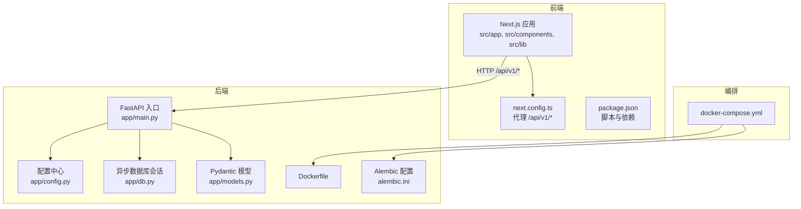
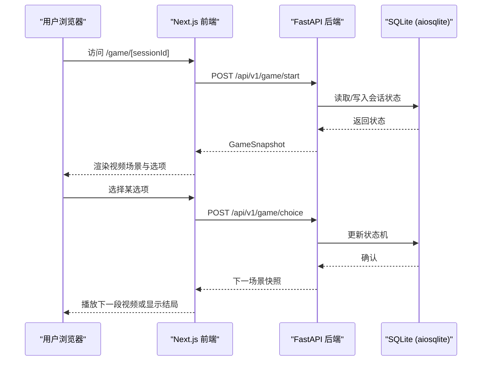
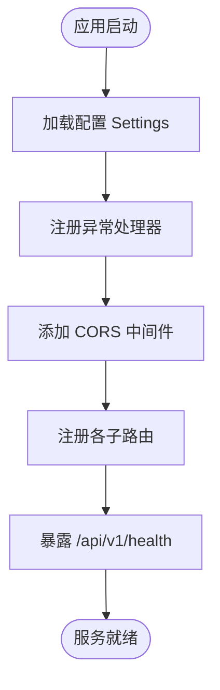
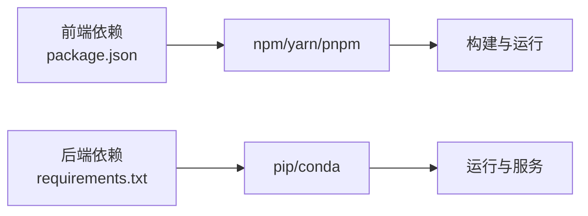

# 开发指南

<cite>
**本文引用的文件**   
- [README.md](file://README.md)
- [GITHUB_GUIDE.md](file://GITHUB_GUIDE.md)
- [TASK_BREAKDOWN.md](file://TASK_BREAKDOWN.md)
- [docker-compose.yml](file://docker-compose.yml)
- [backend/requirements.txt](file://backend/requirements.txt)
- [frontend/package.json](file://frontend/package.json)
- [backend/app/main.py](file://backend/app/main.py)
- [backend/app/config.py](file://backend/app/config.py)
- [backend/app/db.py](file://backend/app/db.py)
- [backend/app/models.py](file://backend/app/models.py)
- [backend/Dockerfile](file://backend/Dockerfile)
- [backend/alembic.ini](file://backend/alembic.ini)
- [frontend/tsconfig.json](file://frontend/tsconfig.json)
- [frontend/next.config.ts](file://frontend/next.config.ts)
- [frontend/.gitignore](file://frontend/.gitignore)
- [frontend/eslint.config.mjs](file://frontend/eslint.config.mjs)
- [backend/pytest.ini](file://backend/pytest.ini)
</cite>

## 目录
1. [简介](#简介)
2. [项目结构](#项目结构)
3. [核心组件](#核心组件)
4. [架构总览](#架构总览)
5. [详细组件分析](#详细组件分析)
6. [依赖分析](#依赖分析)
7. [性能考虑](#性能考虑)
8. [故障排查指南](#故障排查指南)
9. [结论](#结论)
10. [附录](#附录)

## 简介
澳秘 Macau Mystery 是一个 AI 沉浸式剧本杀平台，沿澳门历史城区步行路线，通过与 AI NPC 对话破解跨越中葡两个家族的悬案。技术栈包括：
- 前端：Next.js + Tailwind CSS + shadcn/ui + Leaflet.js
- 后端：FastAPI + SQLite（aiosqlite）+ ChromaDB
- AI：DeepSeek（通过 SiliconFlow）+ edge-tts

快速开始请参考 README 中的前后端启动说明与环境变量配置。

**章节来源**
- [README.md:1-59](file://README.md#L1-L59)

## 项目结构
仓库采用前后端分离的双模块结构，配合 Docker Compose 进行容器化编排。
- 前端 frontend：Next.js 应用，包含页面路由、UI 组件与 API 封装。
- 后端 backend：FastAPI 服务，包含 API 路由、AI 服务、故事引擎、UGC 与管理后台。
- 根级 docker-compose.yml 统一编排后端服务，自动执行数据库迁移并启动 uvicorn。

**图表来源**
- [frontend/next.config.ts:1-15](file://frontend/next.config.ts#L1-L15)
- [backend/app/main.py:1-111](file://backend/app/main.py#L1-L111)
- [backend/app/config.py:1-77](file://backend/app/config.py#L1-L77)
- [backend/app/db.py:1-42](file://backend/app/db.py#L1-L42)
- [backend/app/models.py:1-146](file://backend/app/models.py#L1-L146)
- [backend/Dockerfile:1-13](file://backend/Dockerfile#L1-L13)
- [backend/alembic.ini:1-36](file://backend/alembic.ini#L1-L36)
- [docker-compose.yml:1-21](file://docker-compose.yml#L1-L21)

**章节来源**
- [README.md:35-50](file://README.md#L35-L50)
- [docker-compose.yml:1-21](file://docker-compose.yml#L1-L21)

## 核心组件
- FastAPI 应用工厂与生命周期管理：在应用启动时根据配置决定是否导入演示数据；集中处理业务异常与请求校验错误；注册 CORS 中间件与所有 API 路由；提供健康检查端点。
- 配置系统：从环境变量加载数据库 URL、CORS 源、环境标识、演示开关、令牌 TTL 等，并提供类型安全的 Settings 对象。
- 异步数据库层：基于 SQLAlchemy AsyncEngine 创建引擎与 Session 工厂，针对 SQLite 开启外键约束与忙超时；提供健康检查函数。
- Pydantic 模型：定义游戏协议快照、场景、选择、线索、进度、结局等强类型结构，确保前后端契约一致。
- 前端 API 客户端：统一的 request 封装，自动注入 Authorization 头；按 v1 协议定义 TypeScript 接口与调用方法。
- 构建与运行：前端 Next.js 重写规则将 /api/v1/* 转发至本地后端；后端通过 Dockerfile 与 docker-compose 一键启动并执行迁移。

**章节来源**
- [backend/app/main.py:17-111](file://backend/app/main.py#L17-L111)
- [backend/app/config.py:38-77](file://backend/app/config.py#L38-L77)
- [backend/app/db.py:12-42](file://backend/app/db.py#L12-L42)
- [backend/app/models.py:8-92](file://backend/app/models.py#L8-L92)
- [frontend/src/lib/api.ts:1-216](file://frontend/src/lib/api.ts#L1-L216)
- [frontend/next.config.ts:1-15](file://frontend/next.config.ts#L1-L15)
- [backend/Dockerfile:1-13](file://backend/Dockerfile#L1-L13)
- [docker-compose.yml:1-21](file://docker-compose.yml#L1-L21)

## 架构总览
系统由前端 Next.js 应用与后端 FastAPI 服务组成，前端通过 Next 的 rewrites 将 /api/v1/* 代理到后端 8000 端口。后端通过 Alembic 管理数据库迁移，使用 SQLite（aiosqlite）作为持久化存储，并通过 Pydantic 模型保证接口契约。

**图表来源**
- [frontend/next.config.ts:4-11](file://frontend/next.config.ts#L4-L11)
- [backend/app/main.py:84-96](file://backend/app/main.py#L84-L96)
- [backend/app/models.py:72-92](file://backend/app/models.py#L72-L92)

## 详细组件分析

### 后端应用与路由（FastAPI）
- 应用工厂 create_app：初始化设置、注册 lifespan、异常处理器、CORS 中间件、路由前缀与健康检查。
- 异常处理：自定义 GameError 与 RequestValidationError 的统一 JSON 响应格式，便于前端解析。
- 路由组织：/api/v1/game、/ai、/create、/admin、/auth、/ugc 等子路由分别对应不同功能域。

**图表来源**
- [backend/app/main.py:17-111](file://backend/app/main.py#L17-L111)

**章节来源**
- [backend/app/main.py:17-111](file://backend/app/main.py#L17-L111)

### 配置与环境（Settings）
- 支持的环境变量：DATABASE_URL、CORS_ORIGINS、APP_ENV、BOOTSTRAP_DEMO_STORY、BOOTSTRAP_DEMO_USERS、AUTH_TOKEN_TTL_HOURS、DEMO_* 系列。
- 默认值与安全校验：正整数校验、布尔转换、CORS 源解析。

**章节来源**
- [backend/app/config.py:13-77](file://backend/app/config.py#L13-L77)

### 数据库与迁移（SQLAlchemy + Alembic）
- 引擎与会话：创建异步引擎，针对 SQLite 启用外键与忙超时；SessionLocal 提供异步会话。
- 健康检查：check_database 用于健康端点判断数据库可用性。
- 迁移配置：alembic.ini 指定脚本位置与数据库 URL；docker-compose 命令在启动时执行 alembic upgrade head。

**章节来源**
- [backend/app/db.py:12-42](file://backend/app/db.py#L12-L42)
- [backend/alembic.ini:1-36](file://backend/alembic.ini#L1-L36)
- [docker-compose.yml:17-17](file://docker-compose.yml#L17-L17)

### 数据模型与协议（Pydantic）
- 游戏快照 GameSnapshot：包含 session_id、status、story、scene、clues、progress、awarded_clues、ending。
- 场景与选择：GameScene.type 限定为 video 或 ending；choice.preload 预加载下一场景媒体。
- 其他模型：ChatRequest/Response、TTS、UGC Generate、ScriptMeta/Create/Update 等。

**章节来源**
- [backend/app/models.py:8-92](file://backend/app/models.py#L8-L92)
- [backend/app/models.py:95-146](file://backend/app/models.py#L95-L146)

### 前端 API 客户端与类型
- 统一请求封装：自动附加 token 到 Authorization 头，统一错误抛出。
- 类型定义：严格匹配后端 v1 协议，包括 GameMedia、GameChoice、GameScene、GameClue、GameProgress、GameEnding、GameSnapshot。
- API 分组：gameApi、aiApi、ugcApi、adminApi、authApi，覆盖全部功能域。

**章节来源**
- [frontend/src/lib/api.ts:1-216](file://frontend/src/lib/api.ts#L1-L216)

### 前端构建与代理
- next.config.ts：将 /api/v1/:path* 重写至 http://localhost:8000/api/v1/:path*，解决开发期跨域问题。
- tsconfig.json：启用 strict、ES2017 target、bundler 模块解析、路径别名 @/*。

**章节来源**
- [frontend/next.config.ts:1-15](file://frontend/next.config.ts#L1-L15)
- [frontend/tsconfig.json:1-35](file://frontend/tsconfig.json#L1-L35)

### 容器化与编排
- Dockerfile：基于 python:3.11-slim，安装依赖，暴露 8000 端口，启动 uvicorn。
- docker-compose.yml：挂载源码与数据卷，设置环境变量，启动命令先执行迁移再启动服务。

**章节来源**
- [backend/Dockerfile:1-13](file://backend/Dockerfile#L1-L13)
- [docker-compose.yml:1-21](file://docker-compose.yml#L1-L21)

## 依赖分析
- 后端依赖：FastAPI、uvicorn、SQLAlchemy、aiosqlite、alembic、pydantic、httpx、edge-tts、chromadb、openai、pwdlib[argon2] 等。
- 前端依赖：Next.js、React、Leaflet、shadcn/ui、Tailwind、TypeScript、ESLint 等。
- 版本锁定：requirements.txt 与 package.json 明确依赖版本，便于复现与协作。

**图表来源**
- [frontend/package.json:1-37](file://frontend/package.json#L1-L37)
- [backend/requirements.txt:1-17](file://backend/requirements.txt#L1-L17)

**章节来源**
- [frontend/package.json:1-37](file://frontend/package.json#L1-L37)
- [backend/requirements.txt:1-17](file://backend/requirements.txt#L1-L17)

## 性能考虑
- 数据库连接池与 SQLite 优化：启用 PRAGMA foreign_keys=ON 与 busy_timeout，减少并发冲突。
- 异步 I/O：后端使用 aiosqlite 与 FastAPI 异步特性，提升吞吐。
- 前端代理与缓存：开发期通过 Next rewrites 避免跨域开销；生产部署建议启用 CDN 与静态资源缓存。
- 构建优化：启用 TypeScript isolatedModules 与增量编译；按需引入 UI 组件库。

[本节为通用指导，不直接分析具体文件]

## 故障排查指南
- 后端健康检查：访问 /api/v1/health，若数据库不可用将返回 degraded 状态。
- 常见错误定位：
  - 请求校验失败：查看后端统一 VALIDATION_ERROR 响应体中的 details 字段。
  - 数据库未迁移：启动时报错提示需执行 alembic upgrade head。
  - 前端无法访问后端：检查 next.config.ts 的 rewrites 与本地 8000 端口是否运行。
- 测试与验证：
  - 后端：pytest 异步模式已配置，可在 tests 目录下编写用例。
  - 前端：eslint 规则已集成，运行 lint 检查代码规范。

**章节来源**
- [backend/app/main.py:98-105](file://backend/app/main.py#L98-L105)
- [backend/app/main.py:51-74](file://backend/app/main.py#L51-L74)
- [backend/pytest.ini:1-5](file://backend/pytest.ini#L1-L5)
- [frontend/eslint.config.mjs:1-18](file://frontend/eslint.config.mjs#L1-L18)

## 结论
本指南围绕澳秘 Macau Mystery 项目的开发环境搭建、代码规范、Git 工作流、调试与性能优化、第三方服务集成与依赖管理等方面进行了系统化梳理。通过严格的 Pydantic 契约、统一的异常处理与健康的 CI/CD 实践，团队可高效协作并稳定迭代。

[本节为总结性内容，不直接分析具体文件]

## 附录

### 开发环境搭建
- 后端：
  - 使用 conda 创建 Python 3.11 环境，安装 requirements.txt 依赖。
  - 执行 alembic upgrade head 完成数据库迁移。
  - 使用 uvicorn 启动服务，访问 /api/v1/docs 查看 OpenAPI 文档。
- 前端：
  - 安装依赖后运行 dev 脚本，访问 localhost:3000。
  - 通过 next.config.ts 的 rewrites 代理后端 API。
- 容器化：
  - 使用 docker-compose 一键启动后端服务，自动执行迁移。

**章节来源**
- [README.md:20-33](file://README.md#L20-L33)
- [docker-compose.yml:17-17](file://docker-compose.yml#L17-L17)
- [frontend/next.config.ts:4-11](file://frontend/next.config.ts#L4-L11)

### 代码规范与审查流程
- Git 工作流：
  - 分支命名：<person>-<feature>，如 a-hero-redesign。
  - 提交信息：feat/fix/docs/style/refactor/test 前缀。
  - 合并策略：main 分支受保护，必须通过 PR 审查合并。
- 前端规范：
  - ESLint 规则继承自 eslint-config-next 与 typescript 配置。
  - TypeScript 严格模式与路径别名 @/*。
- 后端规范：
  - Pydantic 模型强制契约；API 返回 snake_case 字段。
  - 禁止中文全角标点；提交前使用 curl 或 Invoke-RestMethod 测试端点。

**章节来源**
- [GITHUB_GUIDE.md:135-146](file://GITHUB_GUIDE.md#L135-L146)
- [GITHUB_GUIDE.md:39-50](file://GITHUB_GUIDE.md#L39-L50)
- [frontend/eslint.config.mjs:1-18](file://frontend/eslint.config.mjs#L1-L18)
- [frontend/tsconfig.json:1-35](file://frontend/tsconfig.json#L1-L35)
- [TASK_BREAKDOWN.md:168-173](file://TASK_BREAKDOWN.md#L168-L173)

### 调试技巧与性能分析
- 后端：
  - 使用 /api/v1/health 检查数据库状态。
  - 日志级别在 alembic.ini 中配置，便于追踪迁移过程。
- 前端：
  - 浏览器开发者工具 Network 面板查看 API 请求与响应。
  - 使用 ESLint 与 TypeScript 编译器输出定位问题。

**章节来源**
- [backend/app/main.py:98-105](file://backend/app/main.py#L98-L105)
- [backend/alembic.ini:15-36](file://backend/alembic.ini#L15-L36)
- [frontend/eslint.config.mjs:1-18](file://frontend/eslint.config.mjs#L1-L18)

### 第三方服务集成与 API 文档
- AI 服务：
  - LLM 客户端与 TTS 服务位于 backend/app/ai，遵循 models.py 定义的 Chat/TTS 协议。
- 知识库：
  - ChromaDB 客户端与 ingest 模块用于 RAG 检索。
- API 文档：
  - FastAPI 自动生成 OpenAPI 文档，访问 /api/v1/docs。

**章节来源**
- [backend/app/models.py:95-109](file://backend/app/models.py#L95-L109)
- [README.md:6-8](file://README.md#L6-L8)

### 依赖管理与最佳实践
- 后端：
  - 固定依赖版本于 requirements.txt，使用 pip/conda 安装。
  - 使用 pytest 与 pytest-asyncio 进行异步测试。
- 前端：
  - 使用 package.json 管理依赖与脚本，ESLint 保障代码质量。
- 版本标签：
  - 里程碑处打 tag 并推送，便于回溯与发布。

**章节来源**
- [backend/requirements.txt:1-17](file://backend/requirements.txt#L1-L17)
- [backend/pytest.ini:1-5](file://backend/pytest.ini#L1-L5)
- [frontend/package.json:1-37](file://frontend/package.json#L1-L37)
- [GITHUB_GUIDE.md:177-186](file://GITHUB_GUIDE.md#L177-L186)

### 常见问题解答与社区贡献
- 常见问题：
  - 数据库未迁移：执行 alembic upgrade head。
  - 前端无法访问后端：检查 next.config.ts 与后端端口。
  - 请求校验失败：查看 VALIDATION_ERROR 的 details。
- 贡献指南：
  - 遵循分支与提交规范，PR 需经审查合并。
  - 新增功能需补充测试与文档。

**章节来源**
- [GITHUB_GUIDE.md:111-131](file://GITHUB_GUIDE.md#L111-L131)
- [GITHUB_GUIDE.md:135-146](file://GITHUB_GUIDE.md#L135-L146)
- [backend/app/main.py:51-74](file://backend/app/main.py#L51-L74)