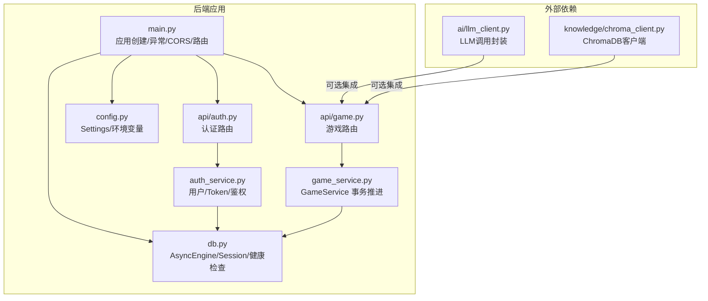
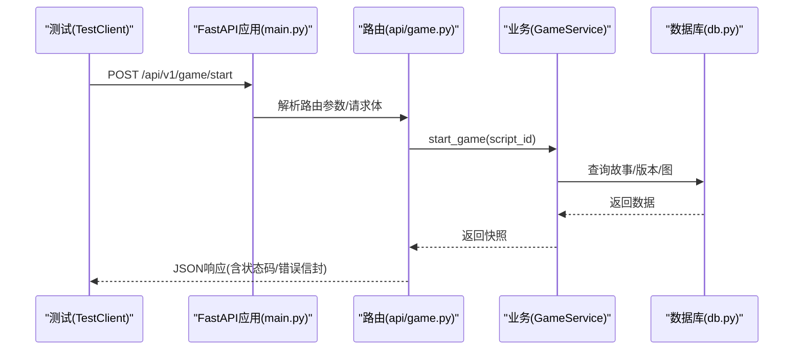
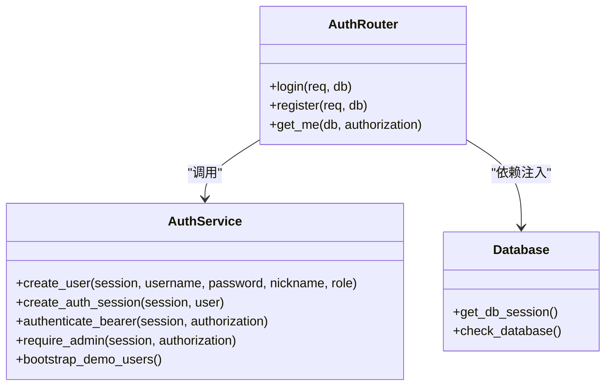
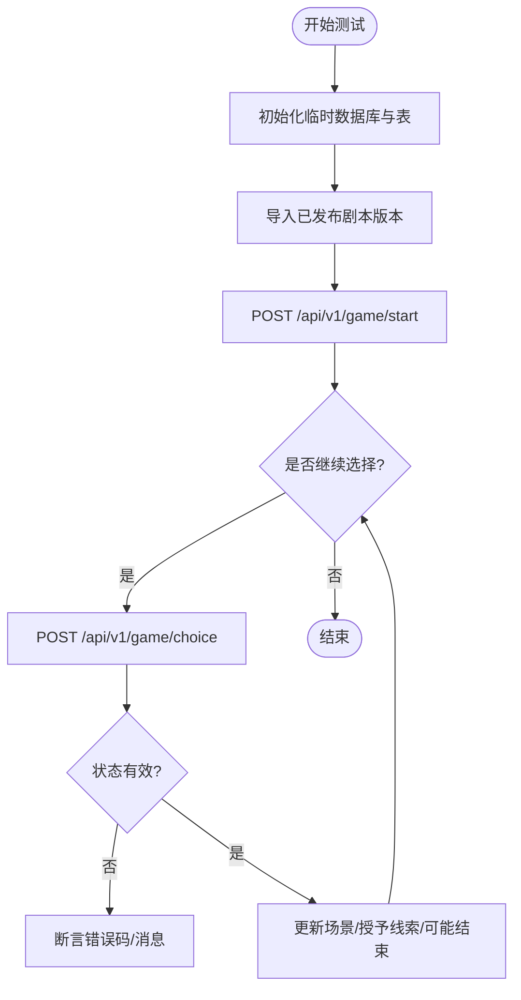
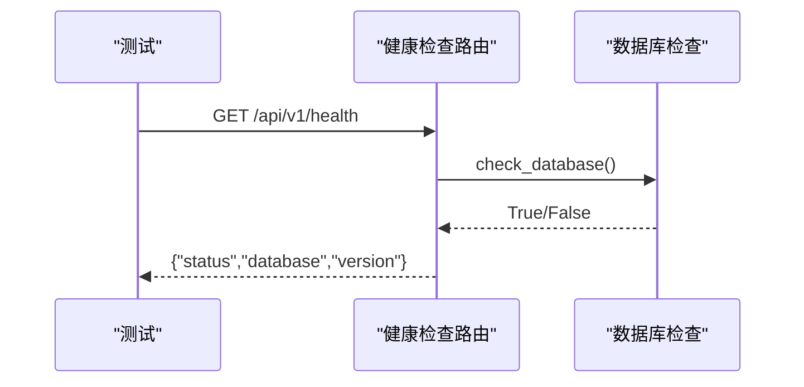
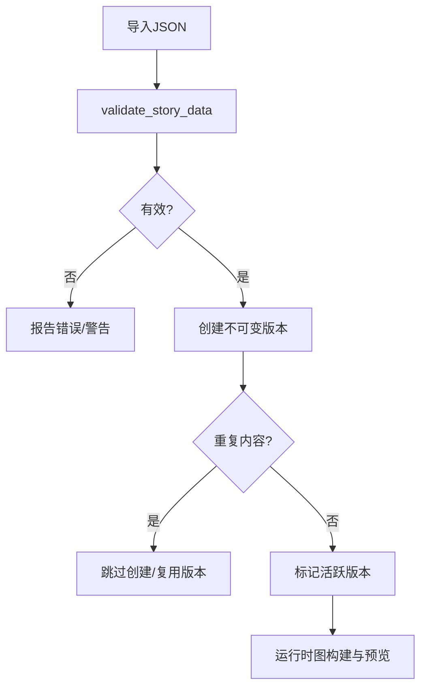
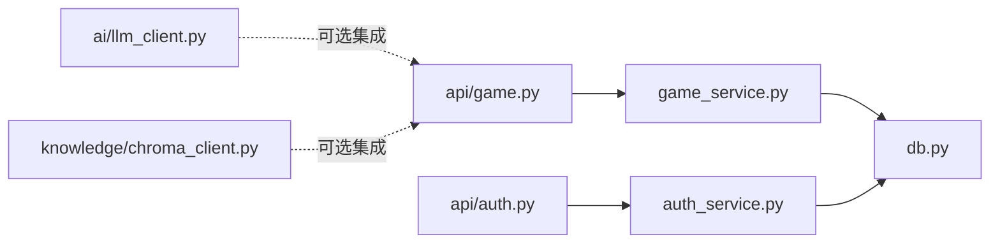

# 测试策略

<cite>
**本文引用的文件**   
- [backend/pytest.ini](file://backend/pytest.ini)
- [backend/app/main.py](file://backend/app/main.py)
- [backend/app/config.py](file://backend/app/config.py)
- [backend/app/db.py](file://backend/app/db.py)
- [backend/app/game_service.py](file://backend/app/game_service.py)
- [backend/app/auth_service.py](file://backend/app/auth_service.py)
- [backend/app/api/auth.py](file://backend/app/api/auth.py)
- [backend/app/api/game.py](file://backend/app/api/game.py)
- [backend/app/ai/llm_client.py](file://backend/app/ai/llm_client.py)
- [backend/app/knowledge/chroma_client.py](file://backend/app/knowledge/chroma_client.py)
- [backend/tests/test_auth_api.py](file://backend/tests/test_auth_api.py)
- [backend/tests/test_game_api.py](file://backend/tests/test_game_api.py)
- [backend/tests/test_health.py](file://backend/tests/test_health.py)
- [backend/tests/test_migrations.py](file://backend/tests/test_migrations.py)
- [backend/tests/test_story_importer.py](file://backend/tests/test_story_importer.py)
- [backend/tests/test_story_runtime.py](file://backend/tests/test_story_runtime.py)
- [backend/requirements.txt](file://backend/requirements.txt)
</cite>

## 目录
1. [简介](#简介)
2. [项目结构](#项目结构)
3. [核心组件](#核心组件)
4. [架构总览](#架构总览)
5. [详细组件分析](#详细组件分析)
6. [依赖关系分析](#依赖关系分析)
7. [性能考量](#性能考量)
8. [故障排查指南](#故障排查指南)
9. [结论](#结论)
10. [附录](#附录)

## 简介
本文件为澳秘 Macau Mystery 项目的完整测试策略文档，覆盖单元测试、集成测试与端到端测试的设计与实现规范。重点包括：
- FastAPI 路由测试、业务逻辑测试与数据库操作测试的编写规范
- API 接口测试、AI 服务集成测试与端到端用户流程测试设计
- 测试数据管理与 Mock 策略（外部服务模拟与环境隔离）
- 测试覆盖率要求与代码质量保证流程
- 自动化测试配置与执行脚本，确保可持续性与可靠性
- 常见测试场景示例与最佳实践

## 项目结构
后端采用 FastAPI + SQLAlchemy 异步驱动，使用 Alembic 管理迁移；测试基于 pytest 与 pytest-asyncio，默认启用自动 async 模式。关键目录与职责：
- app/main.py：应用入口、异常处理、CORS、路由注册与健康检查
- app/config.py：运行时配置（数据库、CORS、演示数据开关等）
- app/db.py：异步引擎与会话工厂、健康检查
- app/game_service.py：游戏状态机与事务性推进（选择、线索、幂等、并发）
- app/auth_service.py：用户、密码哈希、Bearer Token、角色校验
- app/api/*：FastAPI 路由层（auth、game、ugc、admin 等）
- tests/*：现有测试用例（认证、游戏、健康、迁移、剧本导入与运行时）

**图表来源** 
- [backend/app/main.py:17-111](file://backend/app/main.py#L17-L111)
- [backend/app/config.py:38-77](file://backend/app/config.py#L38-L77)
- [backend/app/db.py:12-42](file://backend/app/db.py#L12-L42)
- [backend/app/game_service.py:31-386](file://backend/app/game_service.py#L31-L386)
- [backend/app/auth_service.py:1-153](file://backend/app/auth_service.py#L1-153)
- [backend/app/api/auth.py:1-97](file://backend/app/api/auth.py#L1-97)
- [backend/app/api/game.py:1-37](file://backend/app/api/game.py#L1-37)
- [backend/app/ai/llm_client.py:1-32](file://backend/app/ai/llm_client.py#L1-L32)
- [backend/app/knowledge/chroma_client.py:1-19](file://backend/app/knowledge/chroma_client.py#L1-L19)

**章节来源**
- [backend/app/main.py:17-111](file://backend/app/main.py#L17-L111)
- [backend/app/config.py:38-77](file://backend/app/config.py#L38-L77)
- [backend/app/db.py:12-42](file://backend/app/db.py#L12-L42)
- [backend/app/game_service.py:31-386](file://backend/app/game_service.py#L31-L386)
- [backend/app/auth_service.py:1-153](file://backend/app/auth_service.py#L1-L153)
- [backend/app/api/auth.py:1-97](file://backend/app/api/auth.py#L1-L97)
- [backend/app/api/game.py:1-37](file://backend/app/api/game.py#L1-L37)

## 核心组件
- 应用生命周期与异常处理：统一 GameError 与请求校验错误包装，便于测试断言错误契约
- 配置系统：通过环境变量控制数据库、CORS、演示数据与令牌有效期，测试中通过 monkeypatch 切换
- 数据库层：异步引擎、SQLite PRAGMA 优化、健康检查
- 游戏服务：事务性推进、幂等与并发保护、版本化剧情绑定、线索授予与结局判定
- 认证服务：用户名/密码校验、Bearer Token、角色守卫、演示账户初始化

**章节来源**
- [backend/app/main.py:38-74](file://backend/app/main.py#L38-L74)
- [backend/app/config.py:56-77](file://backend/app/config.py#L56-L77)
- [backend/app/db.py:12-42](file://backend/app/db.py#L12-L42)
- [backend/app/game_service.py:70-193](file://backend/app/game_service.py#L70-L193)
- [backend/app/auth_service.py:59-131](file://backend/app/auth_service.py#L59-L131)

## 架构总览
下图展示从 HTTP 请求到业务处理的调用链，以及测试如何注入依赖与数据库会话。

**图表来源** 
- [backend/app/main.py:84-96](file://backend/app/main.py#L84-L96)
- [backend/app/api/game.py:15-37](file://backend/app/api/game.py#L15-L37)
- [backend/app/game_service.py:35-61](file://backend/app/game_service.py#L35-L61)
- [backend/app/db.py:30-42](file://backend/app/db.py#L30-L42)

## 详细组件分析

### 认证模块测试策略（FastAPI 路由 + 业务逻辑 + 数据库）
- 目标
  - 验证注册、登录、获取当前用户、权限控制、演示数据种子幂等
  - 验证持久化存储（用户、会话、令牌摘要）与过期行为
- 关键点
  - 使用 TestClient 与自定义数据库引擎/会话工厂，避免共享真实数据库
  - 通过 dependency_overrides 替换 get_db_session，保证每个测试独立环境
  - 使用 asyncio.run 在同步测试函数内执行异步数据库操作
- 推荐断言
  - 状态码与错误消息（如重复用户名、无效凭证、过期令牌、角色不足）
  - 存储一致性（用户名规范化、密码哈希、会话记录数量与摘要）

**图表来源** 
- [backend/app/api/auth.py:24-97](file://backend/app/api/auth.py#L24-L97)
- [backend/app/auth_service.py:63-131](file://backend/app/auth_service.py#L63-L131)
- [backend/app/db.py:30-42](file://backend/app/db.py#L30-L42)

**章节来源**
- [backend/tests/test_auth_api.py:26-54](file://backend/tests/test_auth_api.py#L26-L54)
- [backend/tests/test_auth_api.py:57-127](file://backend/tests/test_auth_api.py#L57-L127)
- [backend/tests/test_auth_api.py:130-174](file://backend/tests/test_auth_api.py#L130-L174)
- [backend/tests/test_auth_api.py:176-208](file://backend/tests/test_auth_api.py#L176-L208)
- [backend/app/api/auth.py:64-97](file://backend/app/api/auth.py#L64-L97)
- [backend/app/auth_service.py:59-131](file://backend/app/auth_service.py#L59-L131)

### 游戏模块测试策略（API + 业务逻辑 + 数据库）
- 目标
  - 验证开始游戏、选择推进、合并线索、结局判定、重放与幂等
  - 验证状态恢复、并发冲突、版本锁定、错误契约
- 关键点
  - 使用临时 SQLite 数据库与 Base.metadata.create_all 初始化表
  - 通过 import_story_data 预置已发布版本，确保运行时可用
  - 直接调用 GameService.make_choice 进行并发压力测试
- 推荐断言
  - 状态码与错误码（STALE_SCENE、IDEMPOTENCY_CONFLICT、SESSION_COMPLETED 等）
  - 场景跳转、线索授予、进度与结局字段完整性

**图表来源** 
- [backend/tests/test_game_api.py:37-70](file://backend/tests/test_game_api.py#L37-L70)
- [backend/app/game_service.py:70-193](file://backend/app/game_service.py#L70-L193)
- [backend/app/api/game.py:15-37](file://backend/app/api/game.py#L15-L37)

**章节来源**
- [backend/tests/test_game_api.py:90-127](file://backend/tests/test_game_api.py#L90-L127)
- [backend/tests/test_game_api.py:129-149](file://backend/tests/test_game_api.py#L129-L149)
- [backend/tests/test_game_api.py:151-170](file://backend/tests/test_game_api.py#L151-L170)
- [backend/tests/test_game_api.py:172-184](file://backend/tests/test_game_api.py#L172-L184)
- [backend/tests/test_game_api.py:186-210](file://backend/tests/test_game_api.py#L186-L210)
- [backend/app/game_service.py:70-193](file://backend/app/game_service.py#L70-L193)

### 健康检查与迁移测试
- 健康检查
  - 验证 /api/v1/health 返回数据库连接状态与应用版本
- 迁移
  - 通过 subprocess 调用 alembic upgrade head，并校验表结构与约束

**图表来源** 
- [backend/tests/test_health.py:9-23](file://backend/tests/test_health.py#L9-L23)
- [backend/app/main.py:98-105](file://backend/app/main.py#L98-L105)
- [backend/app/db.py:35-42](file://backend/app/db.py#L35-L42)

**章节来源**
- [backend/tests/test_health.py:9-23](file://backend/tests/test_health.py#L9-L23)
- [backend/tests/test_migrations.py:15-61](file://backend/tests/test_migrations.py#L15-L61)

### 剧本导入与运行时验证
- 导入
  - 验证版本不可变、去重、活跃版本切换
- 运行时
  - 验证校验器规则（占位媒体、缺失目标、循环路由、视频无选项）
  - 验证条件分支与线索合并语义

**图表来源** 
- [backend/tests/test_story_importer.py:23-60](file://backend/tests/test_story_importer.py#L23-L60)
- [backend/tests/test_story_runtime.py:25-83](file://backend/tests/test_story_runtime.py#L25-L83)

**章节来源**
- [backend/tests/test_story_importer.py:23-60](file://backend/tests/test_story_importer.py#L23-L60)
- [backend/tests/test_story_runtime.py:25-83](file://backend/tests/test_story_runtime.py#L25-L83)

### AI 服务集成测试策略
- 目标
  - 验证 LLM 调用封装与 NPC 对话路由
- 策略
  - 使用 httpx 或 openai 的异步客户端进行 Mock（例如替换 base_url 或使用 responses/httpretty）
  - 对 chroma_client 使用内存或临时路径集合，避免污染生产向量库
- 建议
  - 将 LLM/TTS 调用抽离为可注入的服务接口，便于测试时替换为 Stub

**章节来源**
- [backend/app/ai/llm_client.py:12-32](file://backend/app/ai/llm_client.py#L12-L32)
- [backend/app/knowledge/chroma_client.py:7-19](file://backend/app/knowledge/chroma_client.py#L7-L19)

## 依赖关系分析
- 组件耦合
  - 路由层仅依赖服务层与数据库会话，保持低耦合
  - 服务层集中处理事务、并发与幂等，对外暴露稳定接口
- 外部依赖
  - OpenAI/SiliconFlow LLM、ChromaDB、Edge-TTS 等可通过环境变量与 Mock 隔离
- 潜在循环依赖
  - 当前结构未见明显循环；注意在新增模块时避免反向引用

**图表来源** 
- [backend/app/api/game.py:1-37](file://backend/app/api/game.py#L1-L37)
- [backend/app/api/auth.py:1-97](file://backend/app/api/auth.py#L1-L97)
- [backend/app/game_service.py:31-386](file://backend/app/game_service.py#L31-L386)
- [backend/app/auth_service.py:1-153](file://backend/app/auth_service.py#L1-L153)
- [backend/app/db.py:12-42](file://backend/app/db.py#L12-L42)
- [backend/app/ai/llm_client.py:1-32](file://backend/app/ai/llm_client.py#L1-L32)
- [backend/app/knowledge/chroma_client.py:1-19](file://backend/app/knowledge/chroma_client.py#L1-L19)

**章节来源**
- [backend/app/api/game.py:1-37](file://backend/app/api/game.py#L1-L37)
- [backend/app/api/auth.py:1-97](file://backend/app/api/auth.py#L1-L97)
- [backend/app/game_service.py:31-386](file://backend/app/game_service.py#L31-L386)
- [backend/app/auth_service.py:1-153](file://backend/app/auth_service.py#L1-L153)
- [backend/app/db.py:12-42](file://backend/app/db.py#L12-L42)

## 性能考量
- 数据库
  - SQLite 开启 PRAGMA foreign_keys 与 busy_timeout，提升并发稳定性
  - 使用 with_for_update 与 BEGIN IMMEDIATE 保障事务一致性
- 服务层
  - 选择推进过程最小化 I/O，批量写入事件与线索
  - 幂等记录避免重复计算与网络开销
- 测试
  - 使用内存/临时 SQLite，减少磁盘 IO
  - 并行测试时隔离数据库实例与设置缓存

[本节为通用指导，不直接分析具体文件]

## 故障排查指南
- 常见问题
  - 数据库未迁移：启动时报错，需先执行 alembic upgrade head
  - 校验失败：/api/v1/game 路由返回 VALIDATION_ERROR 信封，检查 path/msg/type
  - 并发冲突：STALE_SCENE、IDEMPOTENCY_CONFLICT，检查 request_id 与会话状态
  - 认证失败：401/403，检查 Bearer 令牌与角色
- 调试建议
  - 打印/记录 GameError 的 code 与 details
  - 使用 TestClient 捕获响应体，断言错误契约
  - 在测试中直接调用服务层方法，定位问题层级

**章节来源**
- [backend/app/main.py:38-74](file://backend/app/main.py#L38-L74)
- [backend/app/game_service.py:379-386](file://backend/app/game_service.py#L379-L386)
- [backend/tests/test_game_api.py:172-184](file://backend/tests/test_game_api.py#L172-L184)

## 结论
本测试策略围绕 FastAPI 路由、业务服务与数据库三层展开，结合幂等、并发与版本化剧情特性，构建了稳健的测试体系。通过严格的错误契约、隔离的测试环境与完善的 Mock 策略，确保 API 质量与长期可维护性。建议在持续集成中引入覆盖率阈值与静态检查，进一步提升代码质量。

[本节为总结，不直接分析具体文件]

## 附录

### 测试配置与执行
- pytest 配置
  - 启用自动 async 模式与函数级 fixture 作用域
  - 指定 pythonpath 与 testpaths
- 执行命令
  - 运行全部测试：pytest
  - 指定文件：pytest tests/test_game_api.py
  - 生成覆盖率：pytest --cov=app --cov-report=term-missing

**章节来源**
- [backend/pytest.ini:1-6](file://backend/pytest.ini#L1-L6)

### 测试数据管理与 Mock 策略
- 数据库
  - 使用 tmp_path 创建临时 SQLite 文件，测试后自动清理
  - 通过 Base.metadata.create_all 初始化表结构
- 外部服务
  - LLM：替换 AsyncOpenAI base_url 或 Mock chat.completions.create
  - ChromaDB：使用内存或临时路径集合
- 环境隔离
  - 使用 monkeypatch 修改环境变量与 get_settings 缓存
  - 通过 dependency_overrides 注入测试会话

**章节来源**
- [backend/tests/test_auth_api.py:26-54](file://backend/tests/test_auth_api.py#L26-L54)
- [backend/tests/test_game_api.py:37-70](file://backend/tests/test_game_api.py#L37-L70)
- [backend/app/config.py:56-77](file://backend/app/config.py#L56-L77)
- [backend/app/db.py:12-23](file://backend/app/db.py#L12-L23)

### 覆盖率要求与质量保证流程
- 覆盖率目标
  - 行覆盖率 ≥ 80%，分支覆盖率 ≥ 70%
  - 关键模块（game_service、auth_service、api/*）≥ 90%
- 质量门禁
  - CI 中执行 pytest --cov=app --cov-fail-under=80
  - 结合 mypy/flake8/ruff 进行类型与风格检查
  - 迁移测试必须通过，确保 schema 变更可回滚

[本节为通用指导，不直接分析具体文件]

### 常见测试场景示例与最佳实践
- 认证
  - 注册成功与重复用户名冲突
  - 登录成功与无效凭证
  - 获取当前用户与过期令牌
  - 角色守卫（admin vs user）
  - 演示账户种子幂等
- 游戏
  - 开始游戏与初始场景
  - 选择推进与线索合并
  - 结局判定与重放幂等
  - 状态恢复与并发冲突
  - 版本锁定与错误契约
- 健康与迁移
  - 健康检查返回数据库状态
  - 迁移创建表与约束

**章节来源**
- [backend/tests/test_auth_api.py:57-208](file://backend/tests/test_auth_api.py#L57-L208)
- [backend/tests/test_game_api.py:90-210](file://backend/tests/test_game_api.py#L90-L210)
- [backend/tests/test_health.py:9-23](file://backend/tests/test_health.py#L9-L23)
- [backend/tests/test_migrations.py:15-61](file://backend/tests/test_migrations.py#L15-L61)

### 依赖与工具清单
- 核心依赖
  - fastapi、uvicorn、sqlalchemy、aiosqlite、alembic、pydantic、pwdlib、httpx、pytest、pytest-asyncio
- AI 与知识库
  - openai、chromadb、edge-tts

**章节来源**
- [backend/requirements.txt:1-17](file://backend/requirements.txt#L1-L17)