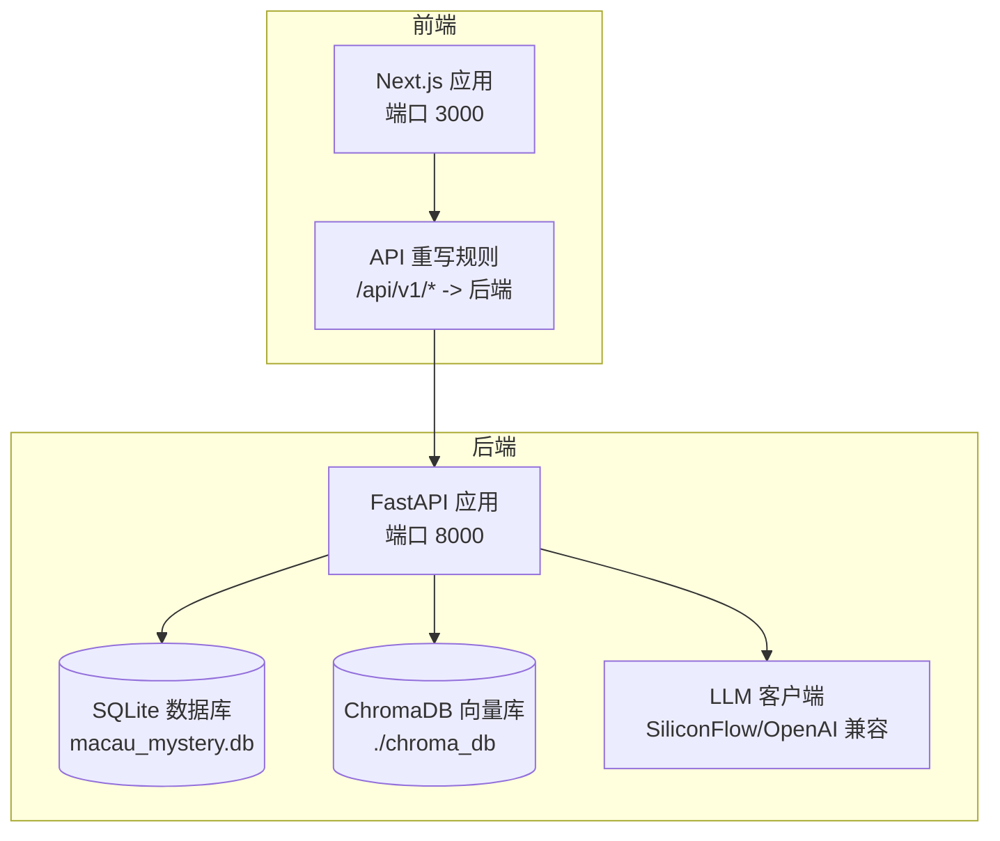
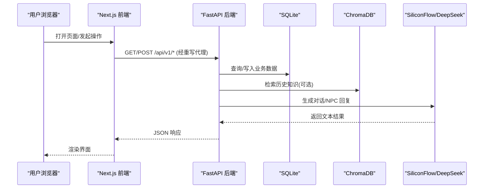
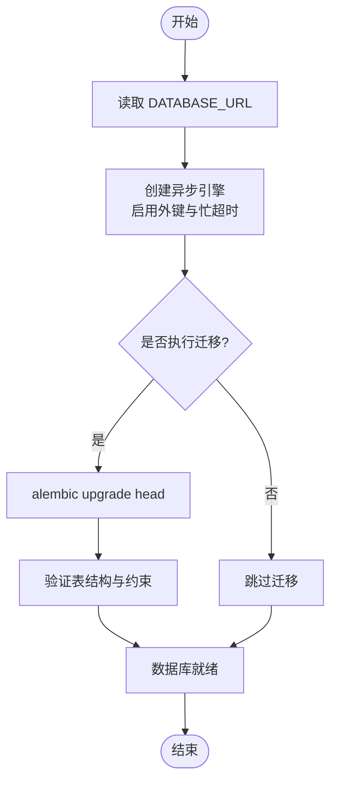
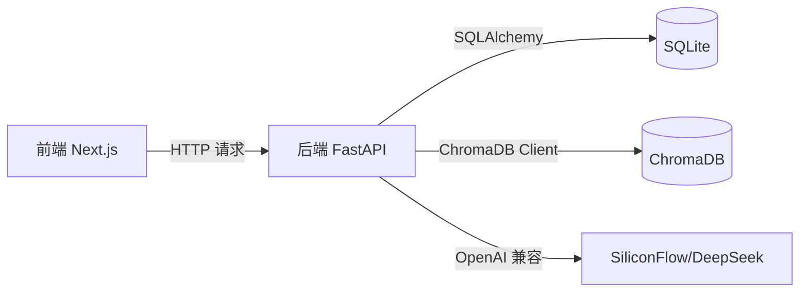

# 环境搭建

<cite>
**本文引用的文件**   
- [README.md](file://README.md)
- [docker-compose.yml](file://docker-compose.yml)
- [backend/Dockerfile](file://backend/Dockerfile)
- [backend/requirements.txt](file://backend/requirements.txt)
- [frontend/package.json](file://frontend/package.json)
- [backend/app/config.py](file://backend/app/config.py)
- [backend/app/db.py](file://backend/app/db.py)
- [backend/app/main.py](file://backend/app/main.py)
- [backend/alembic.ini](file://backend/alembic.ini)
- [backend/alembic/env.py](file://backend/alembic/env.py)
- [backend/alembic/versions/20260803_0001_game_persistence.py](file://backend/alembic/versions/20260803_0001_game_persistence.py)
- [backend/alembic/versions/20260804_0002_auth_persistence.py](file://backend/alembic/versions/20260804_0002_auth_persistence.py)
- [backend/app/knowledge/chroma_client.py](file://backend/app/knowledge/chroma_client.py)
- [backend/app/ai/llm_client.py](file://backend/app/ai/llm_client.py)
- [frontend/next.config.ts](file://frontend/next.config.ts)
</cite>

## 目录
1. [简介](#简介)
2. [项目结构](#项目结构)
3. [核心组件](#核心组件)
4. [架构总览](#架构总览)
5. [详细组件分析](#详细组件分析)
6. [依赖分析](#依赖分析)
7. [性能考虑](#性能考虑)
8. [故障排查指南](#故障排查指南)
9. [结论](#结论)
10. [附录](#附录)

## 简介
本指南面向开发者，提供澳秘 Macau Mystery 项目的完整本地与容器化环境搭建说明。内容涵盖：
- Python（后端）与 Node.js（前端）开发环境的安装与配置、版本要求与依赖管理
- Docker 镜像构建与服务编排、数据持久化配置
- 数据库初始化流程（SQLite 与 ChromaDB）
- 环境变量配置（API 密钥与第三方服务集成）
- 常见问题排查与解决方案

## 项目结构
项目采用前后端分离架构：
- 前端：Next.js 应用，通过重写规则代理到后端 API
- 后端：FastAPI 应用，使用 SQLite 作为关系型数据库，ChromaDB 作为向量知识库，OpenAI 兼容接口调用 DeepSeek（SiliconFlow）
- 容器化：Docker + docker-compose 统一编排后端服务与数据卷

**图示来源** 
- [frontend/next.config.ts:1-15](file://frontend/next.config.ts#L1-L15)
- [backend/app/main.py:1-111](file://backend/app/main.py#L1-L111)
- [backend/app/db.py:1-42](file://backend/app/db.py#L1-L42)
- [backend/app/knowledge/chroma_client.py:1-19](file://backend/app/knowledge/chroma_client.py#L1-L19)
- [backend/app/ai/llm_client.py:1-32](file://backend/app/ai/llm_client.py#L1-L32)

**章节来源**
- [README.md:1-59](file://README.md#L1-L59)

## 核心组件
- 后端运行入口与路由注册：FastAPI 应用创建、中间件、健康检查、路由挂载
- 配置系统：Settings 数据类集中读取环境变量，提供默认值与校验
- 数据库层：异步 SQLAlchemy Engine、Session、SQLite PRAGMA 优化
- 迁移工具：Alembic 异步执行迁移脚本，确保 schema 一致性
- 知识库：ChromaDB 持久化客户端与集合管理
- AI 客户端：OpenAI 兼容的 AsyncOpenAI 客户端，封装对话与 NPC 交互
- 前端代理：Next.js rewrites 将 /api/v1/* 转发至后端

**章节来源**
- [backend/app/main.py:1-111](file://backend/app/main.py#L1-L111)
- [backend/app/config.py:1-77](file://backend/app/config.py#L1-L77)
- [backend/app/db.py:1-42](file://backend/app/db.py#L1-L42)
- [backend/alembic/env.py:1-50](file://backend/alembic/env.py#L1-L50)
- [backend/app/knowledge/chroma_client.py:1-19](file://backend/app/knowledge/chroma_client.py#L1-L19)
- [backend/app/ai/llm_client.py:1-32](file://backend/app/ai/llm_client.py#L1-L32)
- [frontend/next.config.ts:1-15](file://frontend/next.config.ts#L1-L15)

## 架构总览
下图展示从前端请求到后端处理、数据库访问与外部 AI 调用的整体流程。

**图示来源** 
- [frontend/next.config.ts:1-15](file://frontend/next.config.ts#L1-L15)
- [backend/app/main.py:1-111](file://backend/app/main.py#L1-L111)
- [backend/app/db.py:1-42](file://backend/app/db.py#L1-L42)
- [backend/app/knowledge/chroma_client.py:1-19](file://backend/app/knowledge/chroma_client.py#L1-L19)
- [backend/app/ai/llm_client.py:1-32](file://backend/app/ai/llm_client.py#L1-L32)

## 详细组件分析

### Python 后端环境搭建
- 版本要求：Python 3.11（参考 Docker 基础镜像与 README）
- 依赖管理：使用 requirements.txt 锁定版本
- 启动方式：uvicorn 加载 app.main:app，支持热重载

步骤要点：
- 创建并激活 Python 3.11 虚拟环境
- 安装后端依赖
- 设置环境变量（见“环境变量配置”）
- 执行数据库迁移（alembic upgrade head）
- 启动 uvicorn 服务

**章节来源**
- [backend/requirements.txt:1-17](file://backend/requirements.txt#L1-L17)
- [backend/app/main.py:1-111](file://backend/app/main.py#L1-L111)
- [README.md:1-59](file://README.md#L1-L59)

### Node.js 前端环境搭建
- 版本要求：Node.js 建议 >= 18（Next.js 16.x 推荐），npm 包管理器
- 依赖管理：package.json 定义依赖与脚本
- 开发模式：npm run dev，自动代理 /api/v1/* 到后端

步骤要点：
- 进入 frontend 目录
- 安装依赖
- 启动开发服务器
- 访问 http://localhost:3000

**章节来源**
- [frontend/package.json:1-37](file://frontend/package.json#L1-L37)
- [frontend/next.config.ts:1-15](file://frontend/next.config.ts#L1-L15)
- [README.md:1-59](file://README.md#L1-L59)

### Docker 容器化环境搭建
- 镜像构建：backend/Dockerfile 基于 python:3.11-slim，安装依赖并暴露 8000 端口
- 服务编排：docker-compose.yml 定义 backend 服务、端口映射、环境变量注入、数据卷持久化
- 启动命令：先执行 alembic 迁移，再启动 uvicorn

步骤要点：
- 确保已安装 Docker 与 docker-compose
- 在仓库根目录执行 docker-compose up --build
- 首次启动会自动执行迁移并启动后端服务
- 访问 http://localhost:8000/docs 查看 API 文档

数据持久化：
- SQLite 数据文件通过 volume 挂载到 /app/data/macau_mystery.db
- ChromaDB 数据位于 ./chroma_db（进程内持久化路径）

**章节来源**
- [backend/Dockerfile:1-13](file://backend/Dockerfile#L1-L13)
- [docker-compose.yml:1-21](file://docker-compose.yml#L1-L21)

### 数据库初始化流程（SQLite 与 Alembic）
- 引擎与 Session：使用 aiosqlite 异步引擎，开启外键约束与忙超时
- 迁移脚本：Alembic 异步执行，env.py 注入 Settings.database_url
- 初始迁移：包含故事、会话、事件、线索、用户与认证会话等表结构

流程图：

**图示来源** 
- [backend/app/db.py:1-42](file://backend/app/db.py#L1-L42)
- [backend/alembic/env.py:1-50](file://backend/alembic/env.py#L1-L50)
- [backend/alembic/versions/20260803_0001_game_persistence.py:115-128](file://backend/alembic/versions/20260803_0001_game_persistence.py#L115-L128)
- [backend/alembic/versions/20260804_0002_auth_persistence.py:1-40](file://backend/alembic/versions/20260804_0002_auth_persistence.py#L1-L40)

**章节来源**
- [backend/app/db.py:1-42](file://backend/app/db.py#L1-L42)
- [backend/alembic.ini:1-37](file://backend/alembic.ini#L1-L37)
- [backend/alembic/env.py:1-50](file://backend/alembic/env.py#L1-L50)
- [backend/alembic/versions/20260803_0001_game_persistence.py:115-128](file://backend/alembic/versions/20260803_0001_game_persistence.py#L115-L128)
- [backend/alembic/versions/20260804_0002_auth_persistence.py:1-40](file://backend/alembic/versions/20260804_0002_auth_persistence.py#L1-L40)

### ChromaDB 知识库配置
- 客户端：PersistentClient 指向 ./chroma_db
- 集合：get_or_create_collection("macau_history")，用于存储澳门历史知识
- 使用场景：RAG 检索增强生成，结合 LLM 输出更准确的回答

**章节来源**
- [backend/app/knowledge/chroma_client.py:1-19](file://backend/app/knowledge/chroma_client.py#L1-L19)

### AI 客户端与第三方服务集成
- 客户端：AsyncOpenAI，base_url 指向 SiliconFlow 兼容接口
- 模型：默认 deepseek-ai/DeepSeek-V3，可通过环境变量覆盖
- 调用封装：chat_with_llm 与 chat_with_npc 提供系统提示与上下文

**章节来源**
- [backend/app/ai/llm_client.py:1-32](file://backend/app/ai/llm_client.py#L1-L32)

### 环境变量配置说明
关键变量与作用：
- APP_ENV：运行环境（development/production），影响默认行为
- DATABASE_URL：数据库连接字符串（SQLite+aiosqlite）
- CORS_ORIGINS：允许的前端源（逗号分隔）
- BOOTSTRAP_DEMO_STORY / BOOTSTRAP_DEMO_USERS：是否在启动时导入演示数据
- AUTH_TOKEN_TTL_HOURS：认证令牌有效期（小时）
- DEMO_ADMIN_USERNAME / DEMO_ADMIN_PASSWORD / DEMO_GUEST_USERNAME / DEMO_GUEST_PASSWORD：演示账号
- SILICONFLOW_API_KEY：SiliconFlow API 密钥
- SILICONFLOW_BASE_URL：SiliconFlow 兼容 base_url
- LLM_MODEL：使用的模型名称

配置文件位置：
- 后端：backend/.env（由 docker-compose env_file 或进程环境变量注入）
- 前端：无需额外配置，API 代理已在 next.config.ts 中设置

**章节来源**
- [backend/app/config.py:1-77](file://backend/app/config.py#L1-L77)
- [backend/app/ai/llm_client.py:1-32](file://backend/app/ai/llm_client.py#L1-L32)
- [docker-compose.yml:1-21](file://docker-compose.yml#L1-L21)
- [frontend/next.config.ts:1-15](file://frontend/next.config.ts#L1-L15)
- [README.md:1-59](file://README.md#L1-L59)

## 依赖分析
- 后端依赖：FastAPI、uvicorn、SQLAlchemy、aiosqlite、alembic、openai、chromadb、edge-tts、httpx、pytest 等
- 前端依赖：Next.js、React、Leaflet、Tailwind CSS、shadcn/ui 等
- 运行时依赖：Docker、Node.js、Python 3.11

**图示来源** 
- [backend/requirements.txt:1-17](file://backend/requirements.txt#L1-L17)
- [frontend/package.json:1-37](file://frontend/package.json#L1-L37)
- [backend/app/db.py:1-42](file://backend/app/db.py#L1-L42)
- [backend/app/knowledge/chroma_client.py:1-19](file://backend/app/knowledge/chroma_client.py#L1-L19)
- [backend/app/ai/llm_client.py:1-32](file://backend/app/ai/llm_client.py#L1-L32)

**章节来源**
- [backend/requirements.txt:1-17](file://backend/requirements.txt#L1-L17)
- [frontend/package.json:1-37](file://frontend/package.json#L1-L37)

## 性能考虑
- SQLite 并发：启用 PRAGMA foreign_keys=ON 与 busy_timeout=5000，提升并发稳定性
- 异步 I/O：后端使用 aiosqlite 与 AsyncSession，减少阻塞
- 缓存策略：Settings 使用 lru_cache，避免重复解析环境变量
- 前端代理：Next.js rewrites 减少跨域问题，简化开发体验

**章节来源**
- [backend/app/db.py:1-42](file://backend/app/db.py#L1-L42)
- [backend/app/config.py:1-77](file://backend/app/config.py#L1-L77)
- [frontend/next.config.ts:1-15](file://frontend/next.config.ts#L1-L15)

## 故障排查指南
常见问题与解决思路：
- 端口占用：确认 8000（后端）与 3000（前端）未被占用；必要时修改端口映射
- 数据库未迁移：启动时报错提示需执行 alembic upgrade head；确保 docker-compose 命令中包含该步骤
- 环境变量缺失：SILICONFLOW_API_KEY 未设置会导致 LLM 调用失败；检查 .env 文件是否正确注入
- CORS 错误：CORS_ORIGINS 未包含前端地址；更新为 http://localhost:3000
- 健康检查失败：/api/v1/health 返回 degraded，表示数据库不可用；检查 DATABASE_URL 与权限
- ChromaDB 数据丢失：确保 ./chroma_db 目录存在且可写；容器重启后数据应保留

定位方法：
- 查看后端日志：docker-compose logs backend
- 检查数据库状态：curl http://localhost:8000/api/v1/health
- 验证迁移：手动执行 alembic upgrade head 并观察输出

**章节来源**
- [backend/app/main.py:1-111](file://backend/app/main.py#L1-L111)
- [docker-compose.yml:1-21](file://docker-compose.yml#L1-L21)
- [backend/app/db.py:1-42](file://backend/app/db.py#L1-L42)
- [backend/app/ai/llm_client.py:1-32](file://backend/app/ai/llm_client.py#L1-L32)

## 结论
通过本指南，您可以快速完成 Macau Mystery 项目的本地与容器化环境搭建。重点在于正确配置环境变量、执行数据库迁移、以及理解前后端通信与外部服务集成。遇到问题时，优先检查端口、环境变量与健康检查接口，并结合日志进行定位。

## 附录
- 常用命令速查：
  - 前端开发：cd frontend && npm install && npm run dev
  - 后端开发：cd backend && pip install -r requirements.txt && uvicorn app.main:app --reload
  - 容器启动：docker-compose up --build
  - 数据库迁移：alembic upgrade head
- 相关配置文件路径：
  - 后端配置：backend/app/config.py
  - 数据库引擎：backend/app/db.py
  - 迁移配置：backend/alembic.ini、backend/alembic/env.py
  - 前端代理：frontend/next.config.ts
  - 依赖清单：backend/requirements.txt、frontend/package.json