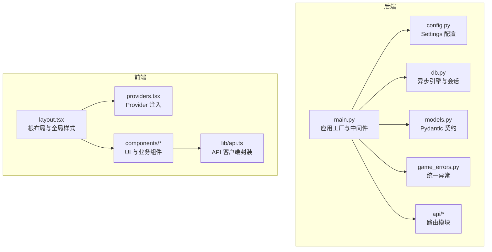
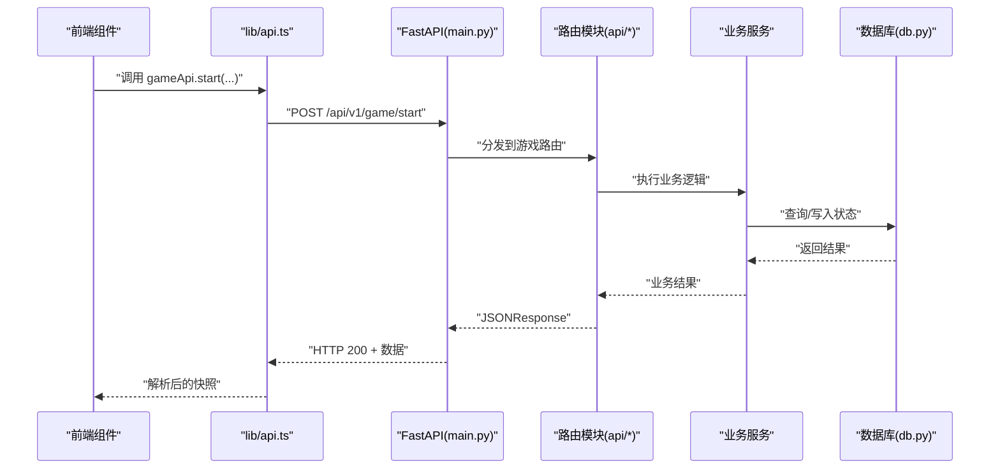
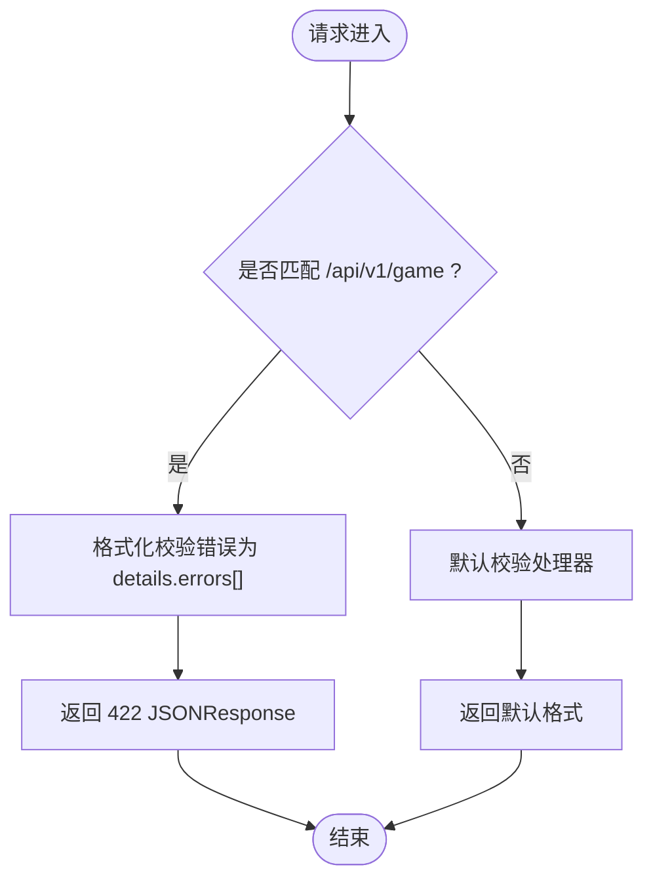
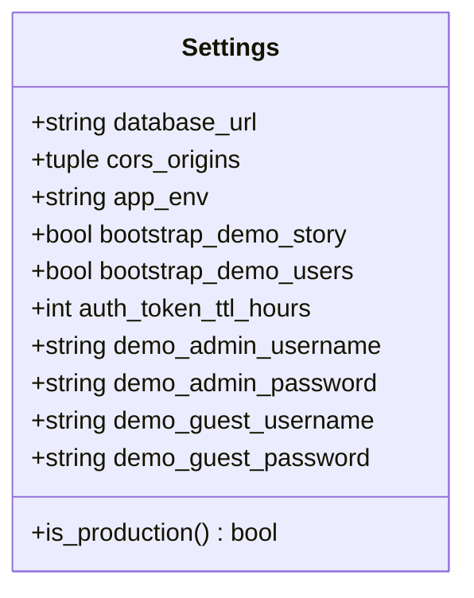
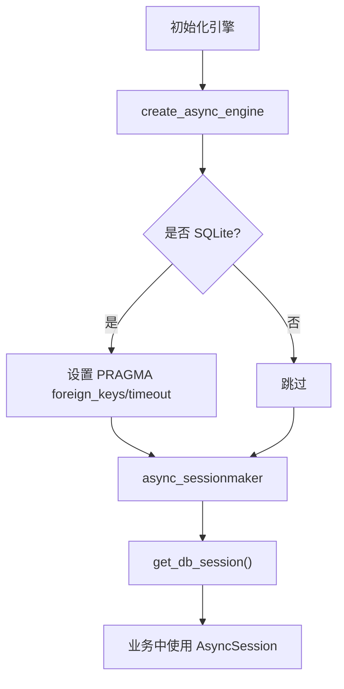
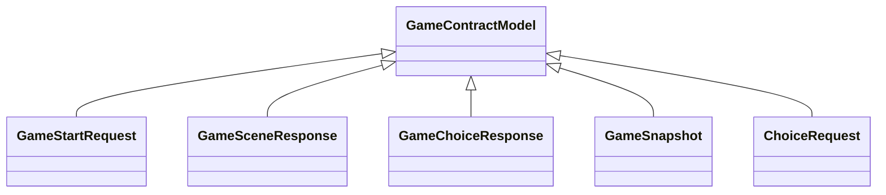
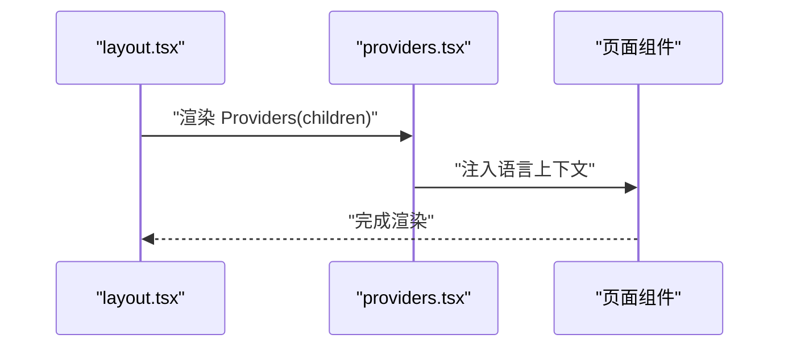
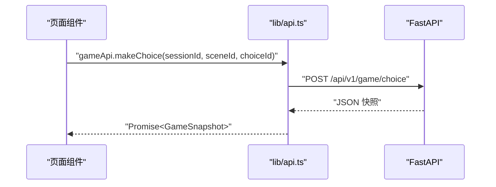
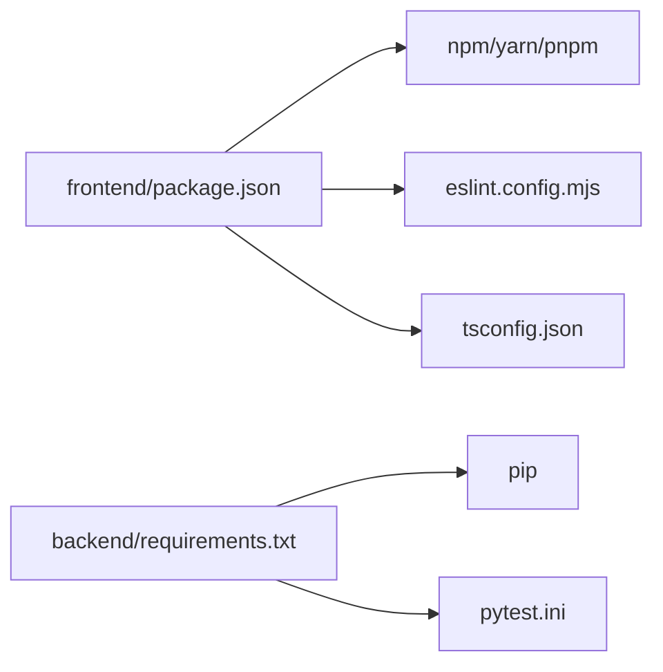

# 编码规范

<cite>
**本文引用的文件**   
- [backend/app/main.py](file://backend/app/main.py)
- [backend/app/config.py](file://backend/app/config.py)
- [backend/app/db.py](file://backend/app/db.py)
- [backend/app/models.py](file://backend/app/models.py)
- [backend/app/game_errors.py](file://backend/app/game_errors.py)
- [backend/requirements.txt](file://backend/requirements.txt)
- [backend/pytest.ini](file://backend/pytest.ini)
- [frontend/package.json](file://frontend/package.json)
- [frontend/eslint.config.mjs](file://frontend/eslint.config.mjs)
- [frontend/tsconfig.json](file://frontend/tsconfig.json)
- [frontend/src/app/layout.tsx](file://frontend/src/app/layout.tsx)
- [frontend/src/components/providers.tsx](file://frontend/src/components/providers.tsx)
- [frontend/src/lib/api.ts](file://frontend/src/lib/api.ts)
</cite>

## 目录
1. [简介](#简介)
2. [项目结构](#项目结构)
3. [核心组件](#核心组件)
4. [架构总览](#架构总览)
5. [详细组件分析](#详细组件分析)
6. [依赖关系分析](#依赖关系分析)
7. [性能考量](#性能考量)
8. [故障排查指南](#故障排查指南)
9. [结论](#结论)
10. [附录](#附录)

## 简介
本编码规范面向澳秘 Macau Mystery 项目的后端（Python FastAPI）与前端（TypeScript/Next.js/React），统一代码风格、错误处理、日志记录、类型契约、质量检查与审查流程，确保一致性与可维护性。规范覆盖：
- 后端：FastAPI 应用组织、Pydantic 模型、异常与校验、数据库会话、配置与环境变量、测试约定。
- 前端：组件设计模式、状态管理、样式组织、API 封装、ESLint/Tailwind/TS 配置。
- 质量保障：ESLint、Prettier（建议）、Python linting（建议）、CI 集成、代码审查清单。

## 项目结构
- 后端采用模块化路由与领域分层：入口应用、配置、数据库、模型、业务服务、API 路由、AI/UGC/Knowledge 等子域。
- 前端基于 Next.js App Router，页面按功能划分在 src/app，通用 UI 组件在 src/components/ui，业务组件在 src/components，工具与 API 客户端在 src/lib。

**图表来源** 
- [backend/app/main.py:17-107](file://backend/app/main.py#L17-L107)
- [backend/app/config.py:38-76](file://backend/app/config.py#L38-L76)
- [backend/app/db.py:12-42](file://backend/app/db.py#L12-L42)
- [backend/app/models.py:8-146](file://backend/app/models.py#L8-L146)
- [backend/app/game_errors.py:7-20](file://backend/app/game_errors.py#L7-L20)
- [frontend/src/app/layout.tsx:37-61](file://frontend/src/app/layout.tsx#L37-L61)
- [frontend/src/components/providers.tsx:5-7](file://frontend/src/components/providers.tsx#L5-L7)
- [frontend/src/lib/api.ts:3-15](file://frontend/src/lib/api.ts#L3-L15)

**章节来源**
- [backend/app/main.py:17-107](file://backend/app/main.py#L17-L107)
- [frontend/src/app/layout.tsx:37-61](file://frontend/src/app/layout.tsx#L37-L61)

## 核心组件
- 后端应用工厂与生命周期：通过 create_app 构建 FastAPI 实例，注册 CORS、异常处理器、路由与健康检查；lifespan 中支持演示数据初始化。
- 配置系统：Settings dataclass 集中管理环境变量，提供布尔、元组、正整数等解析器，并缓存实例。
- 数据库层：异步引擎创建、SQLite PRAGMA 优化、SessionLocal 会话工厂、健康检查 SQL。
- 模型契约：Pydantic BaseModel 定义严格的请求/响应结构，禁止额外字段，使用 Literal、Field 约束。
- 统一异常：GameError 携带 HTTP 状态码、错误码、消息与详情，由全局异常处理器统一序列化。

**章节来源**
- [backend/app/main.py:17-107](file://backend/app/main.py#L17-L107)
- [backend/app/config.py:38-76](file://backend/app/config.py#L38-L76)
- [backend/app/db.py:12-42](file://backend/app/db.py#L12-L42)
- [backend/app/models.py:8-146](file://backend/app/models.py#L8-L146)
- [backend/app/game_errors.py:7-20](file://backend/app/game_errors.py#L7-L20)

## 架构总览
后端以 FastAPI 为中心，通过路由聚合各业务域；前端以 Next.js 为框架，通过统一的 API 客户端访问后端接口。

**图表来源** 
- [frontend/src/lib/api.ts:84-109](file://frontend/src/lib/api.ts#L84-L109)
- [backend/app/main.py:84-96](file://backend/app/main.py#L84-L96)
- [backend/app/db.py:30-42](file://backend/app/db.py#L30-L42)

## 详细组件分析

### 后端：FastAPI 应用与异常处理
- 应用工厂 create_app：集中注册中间件、异常处理器、路由与健康端点。
- 自定义异常 GameError：统一错误体结构 {error:{code,message,details}}。
- 请求校验异常 RequestValidationError：对 /api/v1/game 路径进行格式化输出。
- CORS：允许指定来源与凭据。

**图表来源** 
- [backend/app/main.py:51-74](file://backend/app/main.py#L51-L74)

**章节来源**
- [backend/app/main.py:17-107](file://backend/app/main.py#L17-L107)
- [backend/app/game_errors.py:7-20](file://backend/app/game_errors.py#L7-L20)

### 后端：配置与环境变量
- Settings 数据类：集中读取环境变量并提供便捷属性（如 is_production）。
- 解析器：_as_bool、_cors_origins、_positive_int 保证类型安全与默认值。
- 缓存：get_settings 使用 lru_cache 避免重复解析。

**图表来源** 
- [backend/app/config.py:38-76](file://backend/app/config.py#L38-L76)

**章节来源**
- [backend/app/config.py:1-77](file://backend/app/config.py#L1-L77)

### 后端：数据库会话与连接
- 异步引擎：create_async_engine，启用 pool_pre_ping。
- SQLite 优化：PRAGMA foreign_keys=ON 与 busy_timeout。
- 会话工厂：async_sessionmaker 生成 AsyncSession。
- 健康检查：check_database 执行 SELECT 1。

**图表来源** 
- [backend/app/db.py:12-33](file://backend/app/db.py#L12-L33)

**章节来源**
- [backend/app/db.py:1-42](file://backend/app/db.py#L1-42)

### 后端：Pydantic 模型与 API 契约
- 基类 GameContractModel：extra="forbid" 禁止多余字段。
- 游戏快照与场景：严格类型与枚举，确保前后端一致性。
- 请求参数：使用 Field(min_length, max_length, pattern) 约束。

**图表来源** 
- [backend/app/models.py:8-92](file://backend/app/models.py#L8-L92)

**章节来源**
- [backend/app/models.py:1-146](file://backend/app/models.py#L1-146)

### 前端：根布局与 Provider
- layout.tsx：定义字体变量、元信息、视口、全局样式与基础 DOM 结构。
- providers.tsx：包裹 LanguageProvider，实现国际化上下文。

**图表来源** 
- [frontend/src/app/layout.tsx:37-61](file://frontend/src/app/layout.tsx#L37-L61)
- [frontend/src/components/providers.tsx:5-7](file://frontend/src/components/providers.tsx#L5-L7)

**章节来源**
- [frontend/src/app/layout.tsx:1-62](file://frontend/src/app/layout.tsx#L1-L62)
- [frontend/src/components/providers.tsx:1-8](file://frontend/src/components/providers.tsx#L1-L8)

### 前端：API 客户端封装
- request<T>：统一 fetch 封装，自动附加 Authorization 头，统一错误抛出。
- 模块分组：gameApi、aiApi、ugcApi、adminApi、authApi 分别暴露方法。
- 类型定义：与后端 Pydantic 模型对齐的 TS 接口。

**图表来源** 
- [frontend/src/lib/api.ts:3-15](file://frontend/src/lib/api.ts#L3-L15)
- [frontend/src/lib/api.ts:92-109](file://frontend/src/lib/api.ts#L92-L109)

**章节来源**
- [frontend/src/lib/api.ts:1-216](file://frontend/src/lib/api.ts#L1-L216)

## 依赖关系分析
- 后端依赖：FastAPI、Uvicorn、SQLAlchemy、Alembic、OpenAI、ChromaDB、Edge TTS、Pydantic、httpx、pytest 等。
- 前端依赖：Next.js、React、Tailwind、shadcn、Leaflet、Lucide 图标等。
- 开发脚本：package.json scripts 提供 dev/build/start/lint。

**图表来源** 
- [frontend/package.json:1-37](file://frontend/package.json#L1-L37)
- [backend/requirements.txt:1-17](file://backend/requirements.txt#L1-L17)
- [frontend/eslint.config.mjs:1-19](file://frontend/eslint.config.mjs#L1-L19)
- [frontend/tsconfig.json:1-35](file://frontend/tsconfig.json#L1-L35)
- [backend/pytest.ini:1-6](file://backend/pytest.ini#L1-L6)

**章节来源**
- [frontend/package.json:1-37](file://frontend/package.json#L1-L37)
- [backend/requirements.txt:1-17](file://backend/requirements.txt#L1-L17)
- [frontend/eslint.config.mjs:1-19](file://frontend/eslint.config.mjs#L1-L19)
- [frontend/tsconfig.json:1-35](file://frontend/tsconfig.json#L1-L35)
- [backend/pytest.ini:1-6](file://backend/pytest.ini#L1-L6)

## 性能考量
- 后端
  - 数据库：启用 pool_pre_ping，SQLite 开启外键与超时 PRAGMA，减少锁竞争。
  - 配置：get_settings 使用 lru_cache，避免重复解析环境变量。
  - 中间件：CORS 仅允许必要来源，减少跨域开销。
- 前端
  - 构建：Next.js 增量编译与 isolatedModules 提升构建速度。
  - 网络：统一 request 封装减少重复逻辑，便于后续接入缓存或重试策略。

[本节为通用指导，不直接分析具体文件]

## 故障排查指南
- 后端
  - 数据库未迁移：lifespan 中会抛出 RuntimeError，提示执行 alembic upgrade head。
  - 校验失败：/api/v1/game 路径下返回 422，包含 errors 数组，定位 path/msg/type。
  - 健康检查：/api/v1/health 返回 status/database/version，数据库不可用时返回 degraded。
- 前端
  - API 错误：request 抛错包含 HTTP 状态与文本，需在调用处捕获并提示用户。
  - 鉴权：token 从 localStorage 读取，若缺失则无 Authorization 头。

**章节来源**
- [backend/app/main.py:22-34](file://backend/app/main.py#L22-L34)
- [backend/app/main.py:51-74](file://backend/app/main.py#L51-L74)
- [backend/app/main.py:98-105](file://backend/app/main.py#L98-L105)
- [frontend/src/lib/api.ts:3-15](file://frontend/src/lib/api.ts#L3-L15)

## 结论
本规范明确了后端与前端在结构、命名、错误处理、类型契约、配置与环境、质量检查等方面的统一标准。遵循这些规范有助于降低沟通成本、提高代码可读性与可维护性，并为自动化质量检查与 CI 集成奠定基础。

[本节为总结，不直接分析具体文件]

## 附录

### 后端编码规范
- 文件与模块
  - 入口：app/main.py 负责应用工厂、中间件、异常处理器与路由聚合。
  - 配置：app/config.py 使用 dataclass 与 lru_cache 管理环境变量。
  - 数据库：app/db.py 提供异步引擎与会话工厂。
  - 模型：app/models.py 使用 Pydantic BaseModel 定义契约。
  - 异常：app/game_errors.py 定义统一异常体。
- 命名约定
  - 模块与包：小写蛇形命名；类名帕斯卡命名；函数/变量小写蛇形。
  - 常量：全大写蛇形；环境变量：全大写蛇形。
- 错误处理
  - 业务异常：抛出 GameError，携带 code/message/details。
  - 校验异常：对 /api/v1/game 路径进行格式化，返回 details.errors[]。
- 日志记录
  - 建议使用 Python logging 或 structlog，按模块与级别输出结构化日志。
- 类型与契约
  - 所有请求/响应使用 Pydantic 模型，禁止 extra 字段。
  - 使用 Field 与 Literal 进行强约束。
- 示例与反模式
  - 正确：使用 Pydantic 模型接收请求，返回结构化 JSON。
  - 反模式：直接使用 dict 构造响应，缺少类型与校验。

**章节来源**
- [backend/app/main.py:17-107](file://backend/app/main.py#L17-L107)
- [backend/app/config.py:38-76](file://backend/app/config.py#L38-L76)
- [backend/app/db.py:12-42](file://backend/app/db.py#L12-L42)
- [backend/app/models.py:8-146](file://backend/app/models.py#L8-L146)
- [backend/app/game_errors.py:7-20](file://backend/app/game_errors.py#L7-L20)

### 前端编码规范
- 文件与结构
  - 页面：src/app 下按功能划分；公共 UI 组件在 src/components/ui；业务组件在 src/components。
  - 工具与 API：src/lib 下 api-base.ts、api.ts、utils.ts。
- 命名约定
  - 组件：帕斯卡命名，文件名与组件名一致；Hook 以 use 开头。
  - 常量：全大写蛇形；变量：小写驼峰。
- 组件设计模式
  - 展示型组件只负责渲染；容器组件负责状态与副作用。
  - 使用 Provider 注入全局上下文（如语言）。
- 状态管理
  - 优先使用 React 内置状态与 Context；复杂场景引入状态库前需评估必要性。
- 样式组织
  - 使用 Tailwind CSS 原子类；通过 shadcn/ui 组件保持一致风格。
- 示例与反模式
  - 正确：在 lib/api.ts 中统一封装请求与错误处理。
  - 反模式：在各组件内重复 fetch 逻辑与错误处理。

**章节来源**
- [frontend/src/app/layout.tsx:37-61](file://frontend/src/app/layout.tsx#L37-L61)
- [frontend/src/components/providers.tsx:5-7](file://frontend/src/components/providers.tsx#L5-L7)
- [frontend/src/lib/api.ts:3-15](file://frontend/src/lib/api.ts#L3-L15)

### 代码质量检查与工具配置
- 前端
  - ESLint：基于 eslint-config-next/typescript 与 core-web-vitals，覆盖类型与性能规则。
  - TypeScript：strict=true，isolatedModules=true，jsx=react-jsx。
  - Tailwind：通过 PostCSS 插件集成。
- 后端
  - 建议：安装 ruff/flake8、black、mypy、pytest 等工具，并在 CI 中运行。
  - pytest：启用 asyncio_mode=auto，pythonpath=.，testpaths=tests。

**章节来源**
- [frontend/eslint.config.mjs:1-19](file://frontend/eslint.config.mjs#L1-L19)
- [frontend/tsconfig.json:1-35](file://frontend/tsconfig.json#L1-L35)
- [backend/pytest.ini:1-6](file://backend/pytest.ini#L1-L6)

### 代码审查清单与质量保证流程
- 审查清单
  - 结构与命名：是否符合本规范的文件与命名约定。
  - 类型与契约：后端 Pydantic 模型是否完整；前端 TS 接口是否与后端一致。
  - 错误处理：是否使用统一异常与错误体；前端是否捕获并提示。
  - 配置与安全：环境变量是否正确；敏感信息未硬编码。
  - 测试：新增/修改是否补充单元测试或集成测试。
- 质量保证流程
  - 本地：运行 ESLint、TypeScript 编译、pytest。
  - 提交：触发 CI，执行 lint、类型检查、测试用例。
  - 合并：至少一名 reviewer 批准，确保无阻塞问题。

[本节为通用流程，不直接分析具体文件]