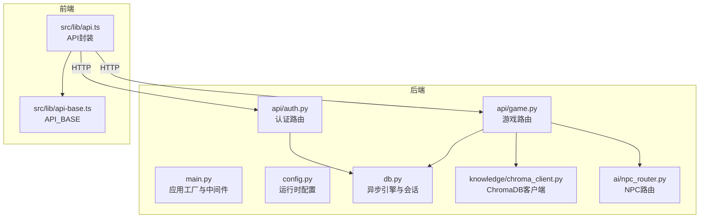
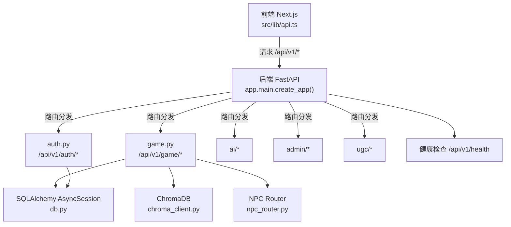
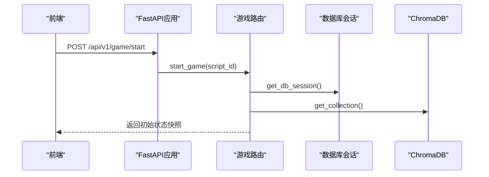
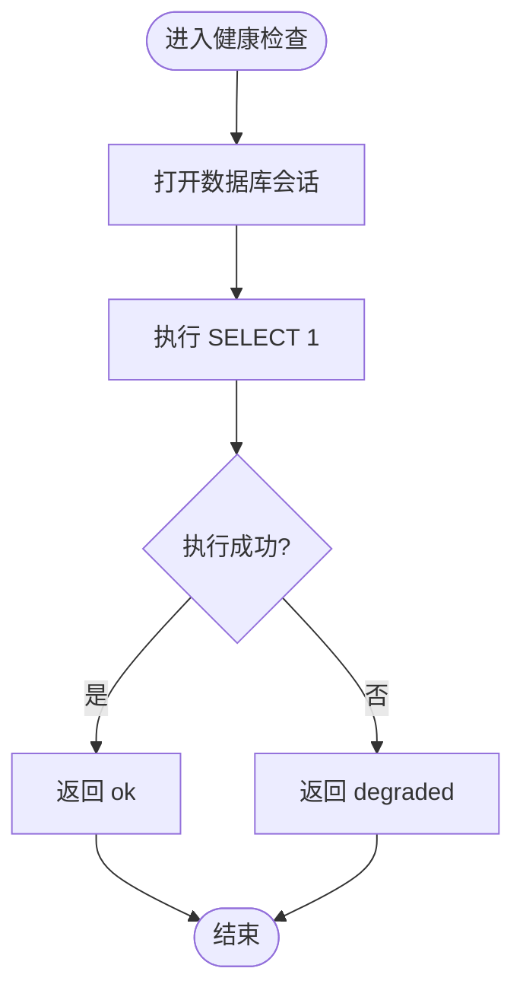
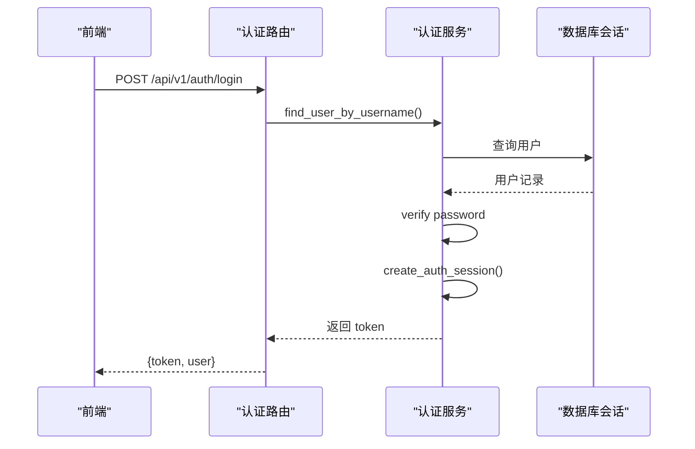
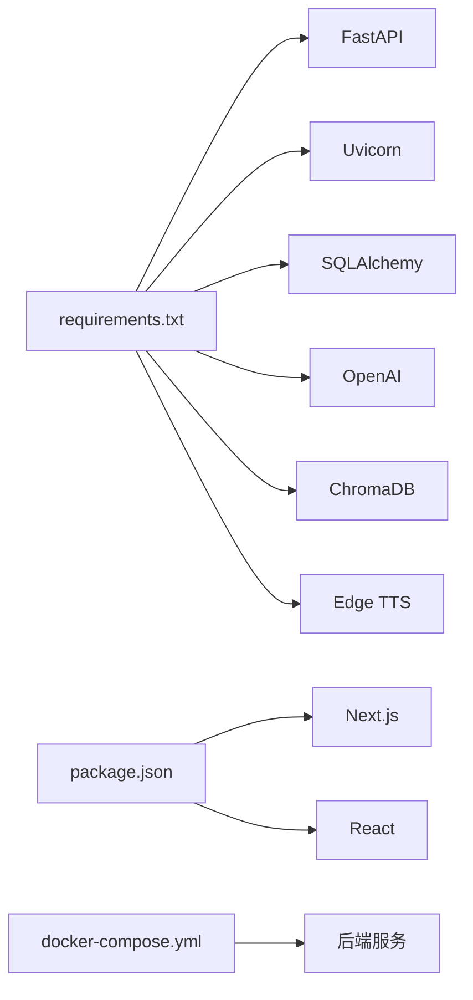

# 调试指南

<cite>
**本文引用的文件**   
- [backend/app/main.py](file://backend/app/main.py)
- [backend/app/config.py](file://backend/app/config.py)
- [backend/app/db.py](file://backend/app/db.py)
- [backend/requirements.txt](file://backend/requirements.txt)
- [frontend/package.json](file://frontend/package.json)
- [backend/app/game_errors.py](file://backend/app/game_errors.py)
- [backend/app/auth_service.py](file://backend/app/auth_service.py)
- [backend/app/knowledge/chroma_client.py](file://backend/app/knowledge/chroma_client.py)
- [frontend/src/lib/api.ts](file://frontend/src/lib/api.ts)
- [docker-compose.yml](file://docker-compose.yml)
- [backend/app/api/game.py](file://backend/app/api/game.py)
- [backend/app/api/auth.py](file://backend/app/api/auth.py)
- [backend/app/ai/npc_router.py](file://backend/app/ai/npc_router.py)
- [frontend/src/lib/api-base.ts](file://frontend/src/lib/api-base.ts)
</cite>

## 目录
1. [简介](#简介)
2. [项目结构](#项目结构)
3. [核心组件](#核心组件)
4. [架构总览](#架构总览)
5. [详细组件分析](#详细组件分析)
6. [依赖关系分析](#依赖关系分析)
7. [性能考虑](#性能考虑)
8. [故障排除指南](#故障排除指南)
9. [结论](#结论)
10. [附录](#附录)

## 简介
本调试指南面向澳秘 Macau Mystery 项目的开发与运维人员，覆盖后端 FastAPI、前端 Next.js、数据库与向量检索、API 接口调试以及常见错误场景的排查方法。文档提供从环境搭建到问题定位的全流程指导，并给出可视化架构图与流程图，帮助读者快速上手与高效排障。

## 项目结构
- 后端（FastAPI）：位于 backend/app，包含路由、服务、模型、数据库、AI 与知识库等模块；启动入口为 main.py，配置集中管理于 config.py，数据库连接与会话在 db.py 中定义。
- 前端（Next.js）：位于 frontend/src，API 调用封装在 lib/api.ts，基础 URL 由 lib/api-base.ts 提供。
- 容器编排：docker-compose.yml 负责后端服务构建、端口映射与环境变量注入。

图表来源 
- [backend/app/main.py:17-111](file://backend/app/main.py#L17-L111)
- [backend/app/config.py:38-77](file://backend/app/config.py#L38-L77)
- [backend/app/db.py:12-42](file://backend/app/db.py#L12-L42)
- [backend/app/api/game.py:12-37](file://backend/app/api/game.py#L12-L37)
- [backend/app/api/auth.py:24-97](file://backend/app/api/auth.py#L24-L97)
- [backend/app/knowledge/chroma_client.py:7-19](file://backend/app/knowledge/chroma_client.py#L7-L19)
- [backend/app/ai/npc_router.py:1-18](file://backend/app/ai/npc_router.py#L1-L18)
- [frontend/src/lib/api.ts:1-216](file://frontend/src/lib/api.ts#L1-L216)
- [frontend/src/lib/api-base.ts:1-2](file://frontend/src/lib/api-base.ts#L1-L2)

章节来源
- [backend/app/main.py:17-111](file://backend/app/main.py#L17-L111)
- [backend/app/config.py:38-77](file://backend/app/config.py#L38-L77)
- [backend/app/db.py:12-42](file://backend/app/db.py#L12-L42)
- [frontend/src/lib/api.ts:1-216](file://frontend/src/lib/api.ts#L1-L216)
- [frontend/src/lib/api-base.ts:1-2](file://frontend/src/lib/api-base.ts#L1-L2)
- [docker-compose.yml:1-21](file://docker-compose.yml#L1-L21)

## 核心组件
- 应用工厂与异常处理：统一创建 FastAPI 实例、注册全局异常处理器、CORS 中间件与健康检查端点。
- 配置系统：集中读取环境变量，提供默认值与校验逻辑。
- 数据库层：异步 SQLAlchemy 引擎与会话管理，SQLite 外键与忙超时设置。
- API 路由：游戏、认证、UGC、AI、管理等路由分组。
- 认证服务：用户名密码校验、令牌生成与鉴权。
- 向量检索：ChromaDB 持久化客户端与集合管理。
- NPC 路由：根据位置选择 NPC 人设与语音。

章节来源
- [backend/app/main.py:17-111](file://backend/app/main.py#L17-L111)
- [backend/app/config.py:38-77](file://backend/app/config.py#L38-L77)
- [backend/app/db.py:12-42](file://backend/app/db.py#L12-L42)
- [backend/app/api/game.py:12-37](file://backend/app/api/game.py#L12-L37)
- [backend/app/api/auth.py:24-97](file://backend/app/api/auth.py#L24-L97)
- [backend/app/auth_service.py:59-153](file://backend/app/auth_service.py#L59-L153)
- [backend/app/knowledge/chroma_client.py:7-19](file://backend/app/knowledge/chroma_client.py#L7-L19)
- [backend/app/ai/npc_router.py:1-18](file://backend/app/ai/npc_router.py#L1-L18)

## 架构总览
下图展示前后端交互、数据库与向量库、AI/NPC 服务的整体架构与数据流向。

图表来源 
- [backend/app/main.py:76-106](file://backend/app/main.py#L76-L106)
- [backend/app/api/game.py:12-37](file://backend/app/api/game.py#L12-L37)
- [backend/app/api/auth.py:24-97](file://backend/app/api/auth.py#L24-L97)
- [backend/app/db.py:26-42](file://backend/app/db.py#L26-L42)
- [backend/app/knowledge/chroma_client.py:7-19](file://backend/app/knowledge/chroma_client.py#L7-L19)
- [backend/app/ai/npc_router.py:1-18](file://backend/app/ai/npc_router.py#L1-L18)
- [frontend/src/lib/api.ts:84-109](file://frontend/src/lib/api.ts#L84-L109)

## 详细组件分析

### 后端 FastAPI 应用调试
- 日志与异常
  - 自定义 GameError 统一业务错误码与消息，便于前端解析与追踪。
  - 请求验证异常针对游戏接口返回结构化错误，利于前端提示。
  - 健康检查端点可快速判断数据库可用性。
- CORS 配置
  - 通过环境变量控制允许的来源，开发时默认包含本地前端地址。
- 生命周期与初始化
  - 启动时可自动导入演示数据（故事与用户），若数据库未迁移会抛出明确错误。

图表来源 
- [backend/app/main.py:38-74](file://backend/app/main.py#L38-L74)
- [backend/app/main.py:98-106](file://backend/app/main.py#L98-L106)
- [backend/app/api/game.py:15-21](file://backend/app/api/game.py#L15-L21)
- [backend/app/db.py:30-42](file://backend/app/db.py#L30-L42)
- [backend/app/knowledge/chroma_client.py:13-19](file://backend/app/knowledge/chroma_client.py#L13-L19)

章节来源
- [backend/app/main.py:17-111](file://backend/app/main.py#L17-L111)
- [backend/app/game_errors.py:7-20](file://backend/app/game_errors.py#L7-L20)
- [backend/app/api/game.py:12-37](file://backend/app/api/game.py#L12-L37)
- [backend/app/db.py:12-42](file://backend/app/db.py#L12-L42)
- [backend/app/knowledge/chroma_client.py:7-19](file://backend/app/knowledge/chroma_client.py#L7-L19)

### 前端 Next.js 应用调试
- React DevTools
  - 使用浏览器扩展查看组件树、状态与 props，定位渲染问题。
- 网络请求调试
  - 浏览器开发者工具 Network 面板查看请求头、响应体与耗时；确认 Authorization Bearer Token 是否正确携带。
  - 前端 API 封装统一附加 token，失败时抛出错误信息，便于捕获与显示。
- 内存泄漏检测
  - Performance 面板录制时间线，关注长时间运行的任务与未释放的事件监听器。
  - Memory 面板进行堆快照对比，查找增长对象与闭包引用。

章节来源
- [frontend/src/lib/api.ts:1-216](file://frontend/src/lib/api.ts#L1-L216)
- [frontend/src/lib/api-base.ts:1-2](file://frontend/src/lib/api-base.ts#L1-L2)
- [frontend/package.json:1-37](file://frontend/package.json#L1-L37)

### 数据库查询优化与排查（SQLAlchemy + SQLite）
- 引擎与会话
  - 使用 async_sessionmaker 创建会话，expire_on_commit=False 避免重复加载。
  - SQLite 开启外键约束与忙超时，提升并发稳定性。
- 健康检查
  - check_database 执行 SELECT 1 判断连通性，供健康端点使用。
- 常见问题
  - 迁移未完成导致启动报错，需先执行 alembic upgrade head。
  - 外键约束失败或唯一冲突，检查模型定义与插入顺序。

图表来源 
- [backend/app/db.py:35-42](file://backend/app/db.py#L35-L42)
- [backend/app/main.py:98-106](file://backend/app/main.py#L98-L106)

章节来源
- [backend/app/db.py:12-42](file://backend/app/db.py#L12-L42)
- [backend/app/main.py:98-106](file://backend/app/main.py#L98-L106)

### 向量检索问题诊断（ChromaDB）
- 客户端与集合
  - 单例模式维护 PersistentClient 与集合，路径固定为 ./chroma_db。
- 常见问题
  - 集合不存在或路径权限问题导致无法写入/读取。
  - 数据未正确入库导致检索结果为空或质量差。
- 建议
  - 检查 chroma_db 目录存在性与权限。
  - 验证入库数据的文本与元数据格式。

章节来源
- [backend/app/knowledge/chroma_client.py:7-19](file://backend/app/knowledge/chroma_client.py#L7-L19)

### API 接口调试（Postman 与 curl）
- 健康检查
  - GET /api/v1/health，用于验证后端与数据库连通性。
- 认证
  - POST /api/v1/auth/login，获取 token；后续请求在 Authorization 头携带 Bearer token。
- 游戏
  - POST /api/v1/game/start，传入 script_id 开始游戏。
  - POST /api/v1/game/choice，提交选择并推进剧情。
  - GET /api/v1/game/state/{session_id}，查询当前状态。
- 常用 curl 示例
  - 健康检查：curl http://localhost:8000/api/v1/health
  - 登录：curl -X POST http://localhost:8000/api/v1/auth/login -H "Content-Type: application/json" -d '{"username":"admin","password":"admin123"}'
  - 开始游戏：curl -X POST http://localhost:8000/api/v1/game/start -H "Content-Type: application/json" -d '{"script_id":"demo"}'
  - 提交选择：curl -X POST http://localhost:8000/api/v1/game/choice -H "Content-Type: application/json" -d '{"session_id":"...","scene_id":"...","choice_id":"...","request_id":"..."}'
  - 查询状态：curl http://localhost:8000/api/v1/game/state/{session_id}

章节来源
- [backend/app/main.py:98-106](file://backend/app/main.py#L98-L106)
- [backend/app/api/auth.py:64-97](file://backend/app/api/auth.py#L64-L97)
- [backend/app/api/game.py:15-37](file://backend/app/api/game.py#L15-L37)
- [frontend/src/lib/api.ts:84-109](file://frontend/src/lib/api.ts#L84-L109)

### 认证流程与权限控制
- 登录与注册
  - 用户名与密码校验规则严格，昵称长度限制。
  - 注册成功后立即创建认证会话并返回 token。
- 鉴权
  - 所有受保护接口需在 Authorization 头携带 Bearer token。
  - require_admin 确保管理员权限。

图表来源 
- [backend/app/api/auth.py:64-87](file://backend/app/api/auth.py#L64-L87)
- [backend/app/auth_service.py:59-97](file://backend/app/auth_service.py#L59-L97)
- [backend/app/auth_service.py:100-131](file://backend/app/auth_service.py#L100-L131)

章节来源
- [backend/app/api/auth.py:24-97](file://backend/app/api/auth.py#L24-L97)
- [backend/app/auth_service.py:59-153](file://backend/app/auth_service.py#L59-L153)

### NPC 与 AI 服务调用
- NPC 路由
  - 根据 location 匹配 NPC 人设与语音，便于 TTS 与对话上下文。
- AI 调用
  - 前端 aiApi.chat 与 aiApi.getTts 分别用于对话与语音合成。
- 调试要点
  - 确认 NPC 映射表与位置一致。
  - 检查外部 AI/TTS 服务可用性与限流策略。

章节来源
- [backend/app/ai/npc_router.py:1-18](file://backend/app/ai/npc_router.py#L1-L18)
- [frontend/src/lib/api.ts:115-126](file://frontend/src/lib/api.ts#L115-L126)

## 依赖关系分析
- 后端依赖
  - FastAPI、Uvicorn、SQLAlchemy、Alembic、OpenAI、ChromaDB、Edge TTS、Pydantic、httpx、pytest 等。
- 前端依赖
  - Next.js、React、Leaflet、Tailwind 等。
- 运行环境
  - docker-compose 启动后端，挂载数据卷与 .env 配置文件。

图表来源 
- [backend/requirements.txt:1-17](file://backend/requirements.txt#L1-L17)
- [frontend/package.json:1-37](file://frontend/package.json#L1-37)
- [docker-compose.yml:1-21](file://docker-compose.yml#L1-L21)

章节来源
- [backend/requirements.txt:1-17](file://backend/requirements.txt#L1-L17)
- [frontend/package.json:1-37](file://frontend/package.json#L1-37)
- [docker-compose.yml:1-21](file://docker-compose.yml#L1-L21)

## 性能考虑
- 后端
  - 使用异步会话减少阻塞；合理设置 SQLite busy_timeout 提升并发稳定性。
  - 对长耗时操作（如 AI 调用、TTS 生成）采用队列或异步任务，避免请求超时。
  - 健康检查与监控端点可用于自动化巡检。
- 前端
  - 合理使用 React DevTools 与 Performance 面板，避免不必要的重渲染。
  - 网络请求去抖与缓存，减少重复请求。
- 数据库与向量库
  - 定期清理过期会话与无用数据，保持 ChromaDB 集合整洁。
  - 对热点查询建立索引或缓存策略。

[本节为通用指导，不直接分析具体文件]

## 故障排除指南
- CORS 问题
  - 检查环境变量 CORS_ORIGINS 是否包含前端地址；确认 allow_credentials 与允许的头部与方法。
- 认证失败
  - 确认 Authorization 头格式为 "Bearer <token>"；检查 token 是否过期或无效。
- 数据库未迁移
  - 启动时报错提示需执行 alembic upgrade head；确保 Docker 命令中包含该步骤。
- AI 服务调用异常
  - 检查外部服务密钥与网络连通性；关注限流与配额。
- 向量检索为空
  - 检查 chroma_db 目录与权限；确认入库数据格式与集合名称。

章节来源
- [backend/app/main.py:76-82](file://backend/app/main.py#L76-L82)
- [backend/app/auth_service.py:100-131](file://backend/app/auth_service.py#L100-L131)
- [backend/app/main.py:22-34](file://backend/app/main.py#L22-L34)
- [backend/app/knowledge/chroma_client.py:7-19](file://backend/app/knowledge/chroma_client.py#L7-L19)

## 结论
本指南围绕后端 FastAPI、前端 Next.js、数据库与向量检索、API 调试与常见错误展开，提供了从环境搭建到问题定位的系统化方法。结合可视化图示与具体文件引用，读者可快速掌握调试技巧与最佳实践，提升开发与运维效率。

## 附录
- 常用环境变量
  - DATABASE_URL：数据库连接字符串（默认 SQLite）。
  - CORS_ORIGINS：允许的跨域来源，逗号分隔。
  - APP_ENV：运行环境（development/production）。
  - BOOTSTRAP_DEMO_STORY、BOOTSTRAP_DEMO_USERS：是否初始化演示数据。
  - AUTH_TOKEN_TTL_HOURS：认证令牌有效期（小时）。
  - DEMO_*：演示账号用户名与密码。
- 启动命令
  - Docker Compose 已包含 alembic 升级与 uvicorn 启动，可直接运行。

章节来源
- [backend/app/config.py:56-77](file://backend/app/config.py#L56-L77)
- [docker-compose.yml:11-17](file://docker-compose.yml#L11-L17)