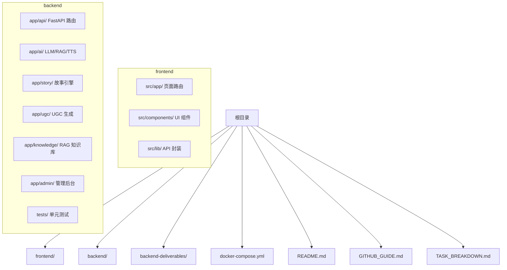
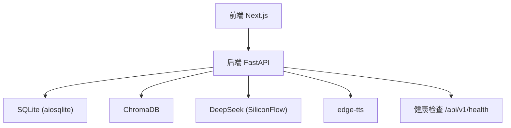
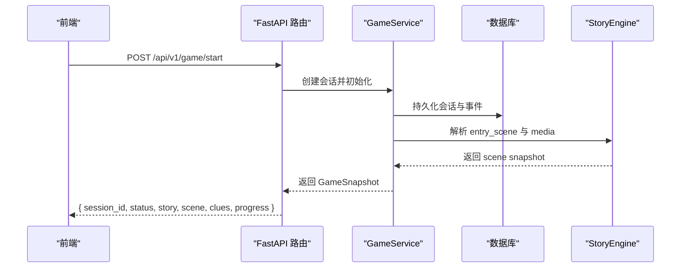
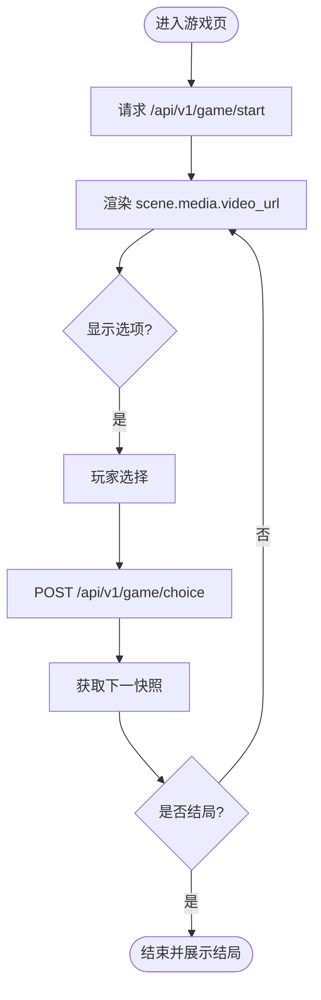
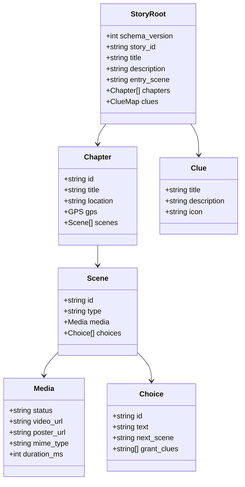
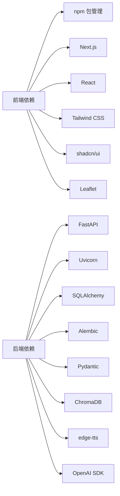

# 贡献指南

<cite>
**本文引用的文件**   
- [README.md](file://README.md)
- [GITHUB_GUIDE.md](file://GITHUB_GUIDE.md)
- [TASK_BREAKDOWN.md](file://TASK_BREAKDOWN.md)
- [docker-compose.yml](file://docker-compose.yml)
- [frontend/package.json](file://frontend/package.json)
- [backend/requirements.txt](file://backend/requirements.txt)
- [backend/pytest.ini](file://backend/pytest.ini)
- [backend/app/config.py](file://backend/app/config.py)
- [backend/tests/test_health.py](file://backend/tests/test_health.py)
- [backend-deliverables/02-剧本&视频转json约定.md](file://backend-deliverables/02-剧本&视频转json约定.md)
- [backend-deliverables/05-minimal-backend-implementation-plan.md](file://backend-deliverables/05-minimal-backend-implementation-plan.md)
</cite>

## 目录
1. [简介](#简介)
2. [项目结构](#项目结构)
3. [核心组件](#核心组件)
4. [架构总览](#架构总览)
5. [详细组件分析](#详细组件分析)
6. [依赖关系分析](#依赖关系分析)
7. [性能与质量考量](#性能与质量考量)
8. [故障排查指南](#故障排查指南)
9. [结论](#结论)
10. [附录：贡献流程与规范](#附录贡献流程与规范)

## 简介
澳秘 Macau Mystery 是一个 AI 沉浸式剧本杀平台，沿澳门历史城区步行路线，通过与 AI NPC 对话破解跨越中葡两个家族的悬案。项目采用前后端分离架构：前端基于 Next.js 14 + Tailwind CSS + shadcn/ui + Leaflet.js；后端基于 FastAPI + SQLite + ChromaDB；AI 能力通过 SiliconFlow（DeepSeek）与 edge-tts 提供。仓库包含完整的前后端代码、测试、Docker 编排以及交付文档，适合团队协作与快速迭代。

本贡献指南面向所有新加入的贡献者，涵盖如何参与开发、分支与 PR 流程、Issue 与 Bug 修复规范、社区协作方式、新功能开发步骤、文档贡献方法，以及常见问题解答。

## 项目结构
仓库采用“前后端分目录”的组织方式，根目录下包含 README、任务分解、GitHub 工作流说明和 Docker Compose 配置；前端位于 frontend，后端位于 backend，交付文档位于 backend-deliverables。

图表来源
- [README.md:35-50](file://README.md#L35-L50)
- [docker-compose.yml:1-21](file://docker-compose.yml#L1-L21)

章节来源
- [README.md:1-59](file://README.md#L1-L59)
- [docker-compose.yml:1-21](file://docker-compose.yml#L1-L21)

## 核心组件
- 前端（Next.js）：页面路由、UI 组件库、API 客户端、国际化、地图与播放器等。
- 后端（FastAPI）：REST API、数据库迁移、故事运行时、AI 集成、UGC 生成、管理接口与健康检查。
- 数据契约：剧本 JSON 结构与校验规则，确保剧情、选项、线索与结局的一致性。
- 工程化：Docker Compose、环境变量、测试框架（pytest）、ESLint、构建脚本。

章节来源
- [frontend/package.json:1-37](file://frontend/package.json#L1-L37)
- [backend/requirements.txt:1-17](file://backend/requirements.txt#L1-L17)
- [backend/pytest.ini:1-6](file://backend/pytest.ini#L1-L6)
- [backend-deliverables/02-剧本&视频转json约定.md:1-452](file://backend-deliverables/02-剧本&视频转json约定.md#L1-L452)

## 架构总览
系统由前端、后端、数据库与外部 AI 服务组成。前端通过 API 客户端调用后端 REST 接口，后端使用 SQLAlchemy 异步访问 SQLite，并通过 ChromaDB 进行知识检索，调用 DeepSeek（SiliconFlow）与 edge-tts 实现对话与语音合成。

图表来源
- [docker-compose.yml:1-21](file://docker-compose.yml#L1-L21)
- [backend/requirements.txt:1-17](file://backend/requirements.txt#L1-L17)
- [backend/app/config.py:1-76](file://backend/app/config.py#L1-L76)

## 详细组件分析

### 后端 API 与服务
- 入口与生命周期：FastAPI 应用启动时加载配置、注册路由、处理 CORS 与错误。
- 游戏 API v1：支持 start、choice、state 等接口，返回统一快照（含场景、媒体、预加载、线索、进度与结局）。
- 故事运行时：严格 Pydantic 模型校验，支持 video/router/ending 三种节点类型，处理线索发放与条件路由。
- 认证与管理：登录/注册、密码加密、管理员 CRUD 与统计接口。
- 健康检查：/api/v1/health 返回状态与数据库连接信息。

图表来源
- [TASK_BREAKDOWN.md:176-198](file://TASK_BREAKDOWN.md#L176-L198)
- [backend-deliverables/05-minimal-backend-implementation-plan.md:1-46](file://backend-deliverables/05-minimal-backend-implementation-plan.md#L1-L46)

章节来源
- [TASK_BREAKDOWN.md:100-174](file://TASK_BREAKDOWN.md#L100-L174)
- [backend-deliverables/05-minimal-backend-implementation-plan.md:1-46](file://backend-deliverables/05-minimal-backend-implementation-plan.md#L1-L46)

### 前端页面与组件
- 页面路由：首页、登录、游戏、地图、线索、创建短剧、结果页、管理后台、我的剧本、社区等。
- 组件：对话框、选项面板、线索卡片、地图查看器、风格选择器、剧本编辑器、视频播放器等。
- API 客户端：适配后端 v1 快照协议，处理视频播放、选项交互、预加载与结局渲染。
- 国际化：三语言字典与上下文，所有用户可见文字走 t("key")。

图表来源
- [TASK_BREAKDOWN.md:176-198](file://TASK_BREAKDOWN.md#L176-L198)
- [frontend/package.json:1-37](file://frontend/package.json#L1-L37)

章节来源
- [TASK_BREAKDOWN.md:10-98](file://TASK_BREAKDOWN.md#L10-L98)
- [frontend/package.json:1-37](file://frontend/package.json#L1-L37)

### 数据契约与校验
- 根对象：schema_version、story_id、title、description、entry_scene、chapters、clues。
- 章节对象：id、title、location、gps、scenes。
- 场景类型：video（可播放节点）、ending（结局节点）、router（不可见条件路由）。
- 媒体对象：status、video_url、poster_url、mime_type、duration_ms。
- 选项对象：id、text、next_scene、grant_clues。
- 线索对象：title、description、icon。
- 条件对象：min_clue_count、all_clues、any_clues、default。

图表来源
- [backend-deliverables/02-剧本&视频转json约定.md:32-275](file://backend-deliverables/02-剧本&视频转json约定.md#L32-L275)

章节来源
- [backend-deliverables/02-剧本&视频转json约定.md:1-452](file://backend-deliverables/02-剧本&视频转json约定.md#L1-L452)

### 配置与环境
- 后端配置：数据库 URL、CORS 来源、运行环境、演示开关、令牌 TTL、演示账号等。
- Docker Compose：后端服务端口映射、环境变量注入、卷挂载与命令执行（迁移+启动）。
- 前端脚本：dev/build/start/lint 等常用命令。

章节来源
- [backend/app/config.py:1-76](file://backend/app/config.py#L1-L76)
- [docker-compose.yml:1-21](file://docker-compose.yml#L1-L21)
- [frontend/package.json:1-37](file://frontend/package.json#L1-L37)

## 依赖关系分析
- 前端依赖：Next.js、React、Tailwind、shadcn/ui、Leaflet、ESLint、TypeScript。
- 后端依赖：FastAPI、Uvicorn、SQLAlchemy、Alembic、Pydantic、httpx、pytest、ChromaDB、edge-tts、OpenAI SDK。
- 运行时：Docker Compose 编排后端服务，本地开发通过 conda 或虚拟环境安装 Python 依赖。

图表来源
- [frontend/package.json:1-37](file://frontend/package.json#L1-L37)
- [backend/requirements.txt:1-17](file://backend/requirements.txt#L1-L17)

章节来源
- [frontend/package.json:1-37](file://frontend/package.json#L1-L37)
- [backend/requirements.txt:1-17](file://backend/requirements.txt#L1-L17)

## 性能与质量考量
- 前端构建与 lint：提交前执行 npm run build 与 eslint，确保无构建错误与代码风格问题。
- 后端测试：使用 pytest 与异步模式，覆盖健康检查、迁移、故事导入与运行时逻辑。
- 幂等与一致性：同一 choice 请求的重复提交应返回第一次响应快照，避免重复推进与重复发线索。
- 资源优化：视频预加载、末帧选项展示、地图标记弹窗与多语言切换体验优化。

章节来源
- [backend/pytest.ini:1-6](file://backend/pytest.ini#L1-L6)
- [backend/tests/test_health.py:1-23](file://backend/tests/test_health.py#L1-L23)
- [TASK_BREAKDOWN.md:176-198](file://TASK_BREAKDOWN.md#L176-L198)

## 故障排查指南
- 健康检查失败：确认数据库连接与环境变量设置，检查 /api/v1/health 返回内容。
- 构建失败：前端检查 ESLint 与 TypeScript 配置，后端检查依赖版本与 alembic 迁移。
- 冲突解决：使用 git rebase 与 stash，必要时回滚到已知好提交。
- 常见错误：字段命名不一致、JSON 契约不匹配、路由未注册、CORS 配置错误。

章节来源
- [backend/tests/test_health.py:1-23](file://backend/tests/test_health.py#L1-L23)
- [backend/app/config.py:1-76](file://backend/app/config.py#L1-L76)
- [GITHUB_GUIDE.md:111-131](file://GITHUB_GUIDE.md#L111-L131)

## 结论
本项目具备清晰的前后端架构、严格的剧本数据契约与完善的工程化配置。贡献者可通过规范的分支与 PR 流程参与开发，遵循代码风格与测试要求，确保代码质量与稳定性。建议新贡献者从 Issue 与文档入手，逐步熟悉模块职责与接口约定，再开展功能开发与优化。

## 附录：贡献流程与规范

### 一、如何参与项目开发
- Fork 仓库：在 GitHub 上 Fork 本仓库到你的账户。
- 克隆本地：git clone 你的 fork 仓库到本地。
- 添加上游：git remote add upstream https://github.com/原仓库.git。
- 同步主分支：git fetch upstream && git rebase upstream/main。
- 创建功能分支：git checkout -b feat/your-feature。
- 提交变更：git add . && git commit -m "feat: 描述变更"。
- 推送分支：git push origin feat/your-feature。
- 创建 Pull Request：在 GitHub 上发起 PR，填写标题与描述，指定 reviewer。

章节来源
- [GITHUB_GUIDE.md:1-108](file://GITHUB_GUIDE.md#L1-L108)

### 二、分支与命名规范
- 主分支：main（受保护，禁止直接推送）。
- 功能分支：<person>-<feature>，如 a-hero-redesign、b-business-plan。
- 合并策略：PR 审查通过后由维护者合并，删除分支保持整洁。

章节来源
- [GITHUB_GUIDE.md:39-108](file://GITHUB_GUIDE.md#L39-L108)

### 三、提交信息与日志规范
- 前缀类型：feat、fix、docs、style、refactor、test。
- 示例：feat: add language switcher component；fix: resolve game API response format mismatch。
- 日志查看：git log --oneline -10；追踪修改：git blame path/to/file。

章节来源
- [GITHUB_GUIDE.md:135-173](file://GITHUB_GUIDE.md#L135-L173)

### 四、Issue 报告格式
- 标题：简洁明确，包含模块与问题类型。
- 复现步骤：列出具体操作步骤与预期行为。
- 环境信息：操作系统、浏览器、Node/Python 版本、依赖版本。
- 截图与日志：附上相关截图与错误日志片段。
- 标签：bug、enhancement、documentation、question。

章节来源
- [GITHUB_GUIDE.md:1-214](file://GITHUB_GUIDE.md#L1-L214)

### 五、功能请求提交流程
- 需求分析：明确目标、影响范围与验收标准。
- 技术方案：设计接口、数据结构与交互流程。
- 实现步骤：拆分任务、编写代码与测试、更新文档。
- 评审与合并：提交 PR，等待审查与反馈，修正后合并。

章节来源
- [TASK_BREAKDOWN.md:100-174](file://TASK_BREAKDOWN.md#L100-L174)

### 六、Bug 修复步骤
- 定位问题：复现 bug，查看日志与网络请求。
- 最小化修复：仅修复必要代码，避免引入新问题。
- 补充测试：增加单元测试与集成测试用例。
- 提交与验证：提交 PR，确保构建与测试通过。

章节来源
- [backend/tests/test_health.py:1-23](file://backend/tests/test_health.py#L1-L23)
- [GITHUB_GUIDE.md:111-131](file://GITHUB_GUIDE.md#L111-L131)

### 七、社区行为准则与沟通方式
- 尊重与包容：友善讨论，避免人身攻击与歧视性言论。
- 有效沟通：使用 Issue 与 PR 评论进行技术讨论，避免私聊争议。
- 代码审查：提供建设性反馈，关注逻辑、性能与可维护性。
- 协作工具：使用 GitHub Issues、Pull Requests、Discussions 与团队聊天群。

章节来源
- [GITHUB_GUIDE.md:1-214](file://GITHUB_GUIDE.md#L1-L214)

### 八、新功能开发指导
- 需求分析：明确业务目标与用户价值。
- 技术方案：设计接口契约、数据模型与交互流程。
- 实现步骤：拆分任务、编写代码与测试、更新文档。
- 验收标准：定义可衡量的完成条件与测试用例。

章节来源
- [TASK_BREAKDOWN.md:100-174](file://TASK_BREAKDOWN.md#L100-L174)
- [backend-deliverables/02-剧本&视频转json约定.md:1-452](file://backend-deliverables/02-剧本&视频转json约定.md#L1-L452)

### 九、文档贡献指南
- 更新项目文档：修改 README、任务分解与工作流说明。
- 更新技术文档：完善接口契约、数据模型与部署说明。
- 提交变更：遵循提交规范，附带变更说明与影响范围。
- 审核与发布：由维护者审核并合并，确保文档一致性。

章节来源
- [README.md:1-59](file://README.md#L1-L59)
- [TASK_BREAKDOWN.md:1-251](file://TASK_BREAKDOWN.md#L1-L251)
- [GITHUB_GUIDE.md:1-214](file://GITHUB_GUIDE.md#L1-L214)

### 十、新贡献者入门指导
- 环境搭建：安装 Node.js 与 Python 3.11，配置虚拟环境。
- 启动项目：前端 npm run dev，后端 uvicorn app.main:app --reload。
- 阅读文档：了解项目结构、接口契约与工作流程。
- 从小任务开始：修复文档错别字、补充翻译键、优化组件样式。

章节来源
- [README.md:10-34](file://README.md#L10-L34)
- [frontend/package.json:1-37](file://frontend/package.json#L1-L37)
- [backend/requirements.txt:1-17](file://backend/requirements.txt#L1-L17)

### 十一、常见问题解答
- Q: 如何设置环境变量？  
  A: 复制 backend/.env.example 为 backend/.env，填入 SiliconFlow API Key 与其他必要配置。
- Q: 如何运行测试？  
  A: 后端使用 pytest，前端使用 npm run lint 与 npm run build。
- Q: 如何处理分支冲突？  
  A: 使用 git rebase 与 stash，必要时回滚到已知好提交。
- Q: 如何部署项目？  
  A: 使用 Docker Compose 编排后端服务，前端部署到 Vercel，后端部署到 Railway 或服务器。

章节来源
- [README.md:30-34](file://README.md#L30-L34)
- [docker-compose.yml:1-21](file://docker-compose.yml#L1-L21)
- [GITHUB_GUIDE.md:177-201](file://GITHUB_GUIDE.md#L177-L201)