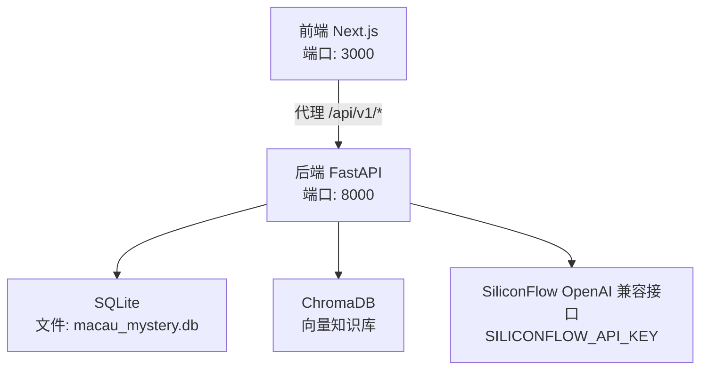
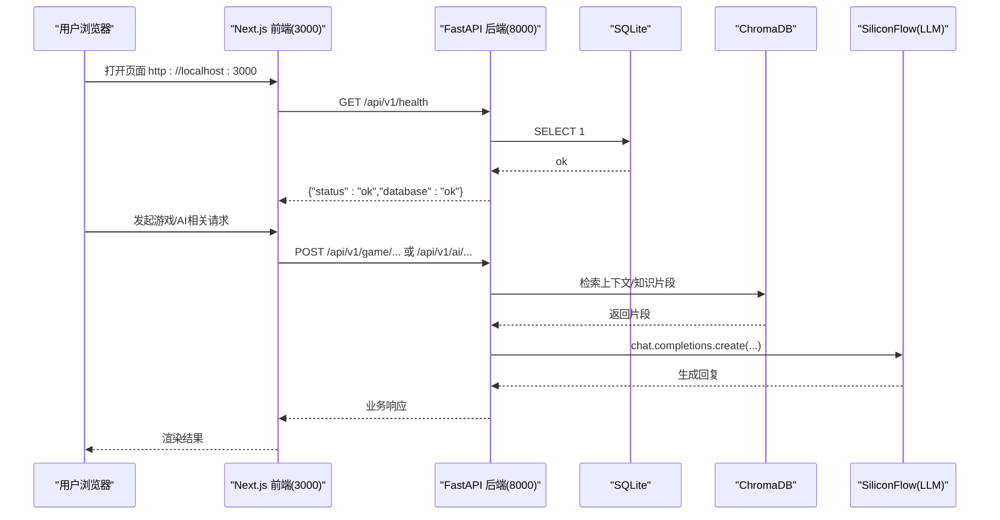
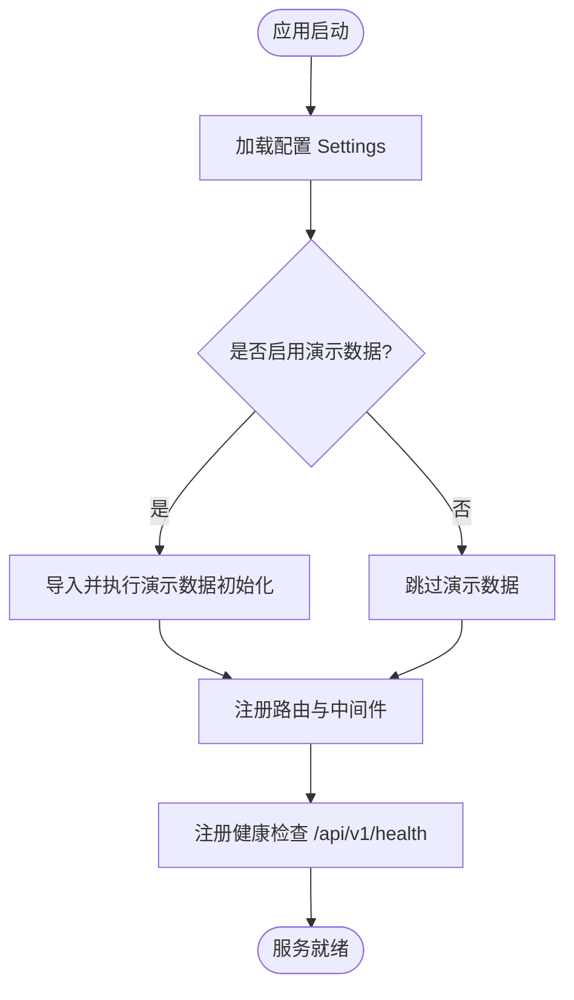
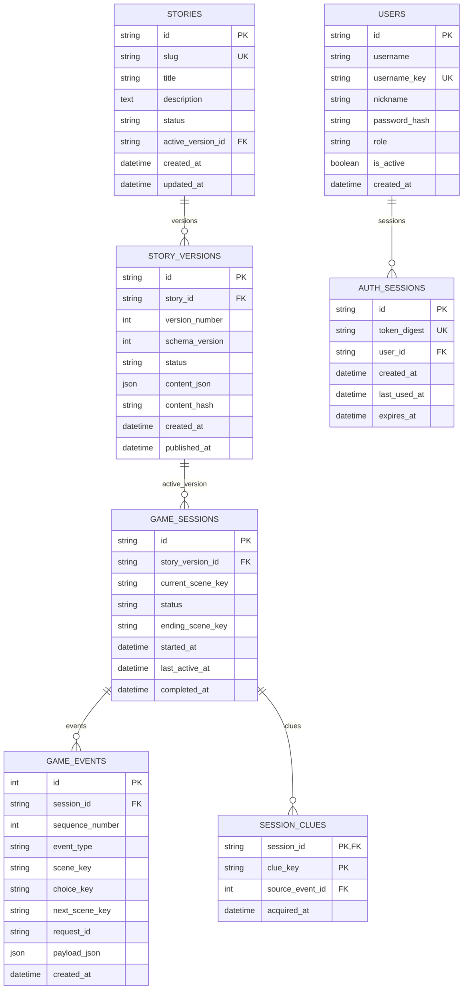
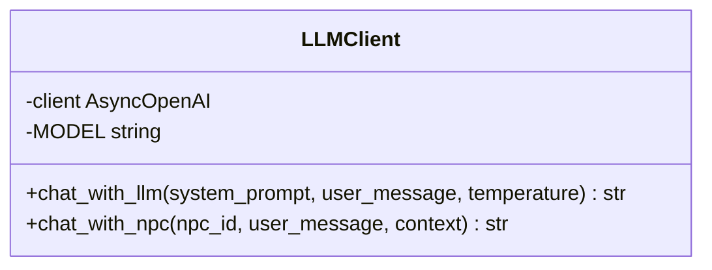
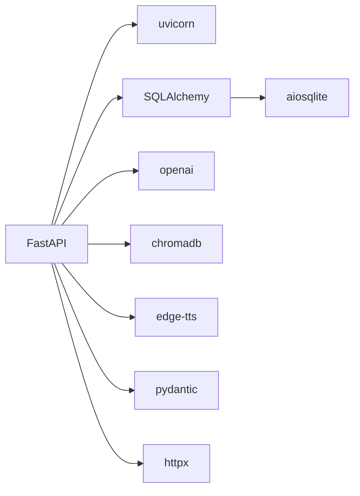

# 快速开始

<cite>
**本文引用的文件**   
- [README.md](file://README.md)
- [backend/requirements.txt](file://backend/requirements.txt)
- [frontend/package.json](file://frontend/package.json)
- [docker-compose.yml](file://docker-compose.yml)
- [backend/app/config.py](file://backend/app/config.py)
- [backend/app/main.py](file://backend/app/main.py)
- [backend/app/db.py](file://backend/app/db.py)
- [backend/app/db_models.py](file://backend/app/db_models.py)
- [backend/alembic.ini](file://backend/alembic.ini)
- [frontend/next.config.ts](file://frontend/next.config.ts)
- [backend/app/ai/llm_client.py](file://backend/app/ai/llm_client.py)
</cite>

## 目录
1. [简介](#简介)
2. [项目结构](#项目结构)
3. [核心组件](#核心组件)
4. [架构总览](#架构总览)
5. [详细组件分析](#详细组件分析)
6. [依赖分析](#依赖分析)
7. [性能考虑](#性能考虑)
8. [故障排除指南](#故障排除指南)
9. [结论](#结论)
10. [附录](#附录)

## 简介
本指南面向首次接触“澳秘 Macau Mystery”项目的开发者，目标是在30分钟内完成本地开发环境搭建并成功运行前后端服务。你将学会：
- 使用 conda 创建 Python 环境并安装后端依赖
- 配置 Node.js 与前端依赖
- 初始化数据库（SQLite）与向量知识库（ChromaDB）
- 配置环境变量（特别是 SiliconFlow API Key）
- 启动前后端服务、访问地址与端口说明
- 常见问题的排查与解决

## 项目结构
本项目采用前后端分离架构：
- 前端：Next.js 14 + Tailwind CSS + shadcn/ui + Leaflet.js
- 后端：FastAPI + SQLite + ChromaDB
- AI：通过 SiliconFlow 调用 DeepSeek（OpenAI 兼容接口），并使用 edge-tts 进行语音合成

**图表来源** 
- [frontend/next.config.ts:4-11](file://frontend/next.config.ts#L4-L11)
- [backend/app/main.py:84-96](file://backend/app/main.py#L84-L96)
- [backend/app/db.py:12-26](file://backend/app/db.py#L12-L26)
- [backend/app/ai/llm_client.py:5-9](file://backend/app/ai/llm_client.py#L5-L9)

**章节来源**
- [README.md:5-34](file://README.md#L5-L34)

## 核心组件
- 后端应用入口与路由注册：FastAPI 应用创建、中间件、异常处理、健康检查与路由挂载
- 配置系统：从环境变量加载数据库、CORS、演示数据开关、认证令牌过期时间等
- 数据库层：异步 SQLAlchemy 引擎、会话管理、SQLite 外键与超时优化
- AI 客户端：基于 OpenAI 兼容接口的 LLM 调用（SiliconFlow）
- 前端代理：Next.js 将 /api/v1/* 请求转发到后端 8000 端口

**章节来源**
- [backend/app/main.py:17-111](file://backend/app/main.py#L17-L111)
- [backend/app/config.py:38-77](file://backend/app/config.py#L38-L77)
- [backend/app/db.py:12-42](file://backend/app/db.py#L12-L42)
- [backend/app/ai/llm_client.py:1-32](file://backend/app/ai/llm_client.py#L1-L32)
- [frontend/next.config.ts:4-11](file://frontend/next.config.ts#L4-L11)

## 架构总览
下图展示了从浏览器到后端、再到数据库与外部 AI 服务的完整调用链路。

**图表来源** 
- [frontend/next.config.ts:4-11](file://frontend/next.config.ts#L4-L11)
- [backend/app/main.py:98-105](file://backend/app/main.py#L98-L105)
- [backend/app/db.py:35-42](file://backend/app/db.py#L35-L42)
- [backend/app/ai/llm_client.py:12-25](file://backend/app/ai/llm_client.py#L12-L25)

## 详细组件分析

### 后端应用与路由
- 应用生命周期：在启动时根据配置决定是否导入并执行演示数据初始化（故事与用户）
- 异常处理：统一 GameError 与请求校验错误格式，便于前端解析
- CORS 中间件：允许前端跨域访问
- 路由挂载：game、ai、ugc、admin、auth、ugc_user 等模块按前缀注册
- 健康检查：/api/v1/health 检测数据库可用性

**图表来源** 
- [backend/app/main.py:17-36](file://backend/app/main.py#L17-L36)
- [backend/app/main.py:76-96](file://backend/app/main.py#L76-L96)
- [backend/app/main.py:98-105](file://backend/app/main.py#L98-L105)

**章节来源**
- [backend/app/main.py:17-111](file://backend/app/main.py#L17-L111)

### 配置系统与环境变量
Settings 数据类集中管理运行时配置，所有值均从环境变量读取并提供默认值：
- database_url：数据库连接串（默认 SQLite）
- cors_origins：允许的跨域来源（默认包含 localhost:3000）
- app_env：应用环境（development/production）
- bootstrap_demo_story / bootstrap_demo_users：是否注入演示数据
- auth_token_ttl_hours：认证令牌有效期（小时）
- demo_*：演示账号用户名与密码

常用环境变量清单（部分关键项）：
- DATABASE_URL：数据库连接串（默认 sqlite+aiosqlite:///./macau_mystery.db）
- APP_ENV：应用环境（默认 development）
- CORS_ORIGINS：逗号分隔的允许来源（默认包含 http://localhost:3000）
- BOOTSTRAP_DEMO_STORY：是否初始化演示剧本（默认非生产环境为真）
- BOOTSTRAP_DEMO_USERS：是否初始化演示用户（默认非生产环境为真）
- AUTH_TOKEN_TTL_HOURS：令牌有效期（小时，默认 168）
- DEMO_ADMIN_USERNAME / DEMO_ADMIN_PASSWORD：演示管理员账号
- DEMO_GUEST_USERNAME / DEMO_GUEST_PASSWORD：演示访客账号

**章节来源**
- [backend/app/config.py:38-77](file://backend/app/config.py#L38-L77)

### 数据库层与模型
- 引擎与会话：使用 SQLAlchemy 异步引擎与 SessionLocal，针对 SQLite 开启外键约束与 busy_timeout
- 健康检查：check_database 用于健康探针
- 数据模型：包括故事、版本、游戏会话、事件、线索、用户与认证会话等实体

**图表来源** 
- [backend/app/db_models.py:24-160](file://backend/app/db_models.py#L24-L160)

**章节来源**
- [backend/app/db.py:12-42](file://backend/app/db.py#L12-L42)
- [backend/app/db_models.py:24-160](file://backend/app/db_models.py#L24-L160)

### AI 客户端（SiliconFlow + OpenAI 兼容）
- 通过 openai.AsyncOpenAI 调用 SiliconFlow 提供的 OpenAI 兼容接口
- 关键环境变量：
  - SILICONFLOW_API_KEY：API 密钥
  - SILICONFLOW_BASE_URL：API 基础地址（默认 https://api.siliconflow.cn/v1）
  - LLM_MODEL：模型名称（默认 deepseek-ai/DeepSeek-V3）
- 提供聊天与 NPC 对话封装方法，失败时返回友好提示

**图表来源** 
- [backend/app/ai/llm_client.py:5-9](file://backend/app/ai/llm_client.py#L5-L9)
- [backend/app/ai/llm_client.py:12-31](file://backend/app/ai/llm_client.py#L12-L31)

**章节来源**
- [backend/app/ai/llm_client.py:1-32](file://backend/app/ai/llm_client.py#L1-L32)

### 前端代理与启动
- Next.js 通过 rewrites 将 /api/v1/* 请求转发至 http://localhost:8000
- 开发脚本：npm run dev
- 构建脚本：npm run build
- 启动脚本：npm start

**章节来源**
- [frontend/package.json:5-10](file://frontend/package.json#L5-L10)
- [frontend/next.config.ts:4-11](file://frontend/next.config.ts#L4-L11)

## 依赖分析
- 后端依赖：FastAPI、uvicorn、SQLAlchemy、aiosqlite、openai、chromadb、edge-tts、pydantic、httpx、pytest 等
- 前端依赖：Next.js、React、Leaflet、shadcn/ui、Tailwind CSS 等

**图表来源** 
- [backend/requirements.txt:1-17](file://backend/requirements.txt#L1-L17)

**章节来源**
- [backend/requirements.txt:1-17](file://backend/requirements.txt#L1-L17)
- [frontend/package.json:11-35](file://frontend/package.json#L11-L35)

## 性能考虑
- SQLite 并发：已启用 PRAGMA foreign_keys=ON 与 busy_timeout=5000，提升并发写入稳定性
- 异步 I/O：后端使用 aiosqlite 与异步会话，减少阻塞
- 缓存策略：Settings 使用 lru_cache 避免重复解析环境变量
- 网络调用：LLM 调用设置 max_tokens 限制输出长度，降低延迟与成本

[本节为通用指导，不直接分析具体文件]

## 故障排除指南
常见问题与解决方案：
- 无法访问 /api/v1/health 或数据库不可用
  - 确认已执行数据库迁移：alembic upgrade head
  - 检查 DATABASE_URL 是否正确指向 SQLite 文件路径
  - 查看健康检查返回状态码是否为 503
- 前端无法调用后端接口
  - 确认 Next.js 正在监听 3000 端口且 rewrites 配置正确
  - 确保后端 uvicorn 监听 8000 端口
  - 检查 CORS_ORIGINS 是否包含前端地址
- LLM 调用失败
  - 检查 SILICONFLOW_API_KEY 是否配置正确
  - 确认 SILICONFLOW_BASE_URL 与 LLM_MODEL 设置无误
  - 查看控制台是否有 LLM Error 日志
- 演示数据未注入
  - 检查 BOOTSTRAP_DEMO_STORY 与 BOOTSTRAP_DEMO_USERS 环境变量
  - 确认应用环境 APP_ENV 不是 production（默认非生产环境会注入）

**章节来源**
- [backend/app/main.py:98-105](file://backend/app/main.py#L98-L105)
- [backend/app/db.py:35-42](file://backend/app/db.py#L35-L42)
- [backend/app/ai/llm_client.py:12-25](file://backend/app/ai/llm_client.py#L12-L25)
- [backend/app/config.py:56-77](file://backend/app/config.py#L56-L77)

## 结论
按照本指南完成环境搭建后，你可以在本地同时运行前端与后端服务，并通过浏览器访问应用。若遇到任何问题，请参考故障排除指南逐步定位。建议在开发过程中保持环境变量与依赖版本的稳定，以便快速复现问题。

[本节为总结性内容，不直接分析具体文件]

## 附录

### 环境准备与安装步骤（建议顺序）
- 安装 conda 与 Node.js（如尚未安装）
- 创建并激活 Python 环境
  - conda create -n macau-mystery python=3.11
  - conda activate macau-mystery
- 安装后端依赖
  - cd backend
  - pip install -r requirements.txt
- 初始化数据库
  - alembic upgrade head
- 配置环境变量
  - 复制 .env.example 为 .env（如存在）
  - 填写 SILICONFLOW_API_KEY 及其他必要变量
- 启动后端服务
  - uvicorn app.main:app --reload
  - 访问 http://localhost:8000/docs 查看 API 文档
- 启动前端服务
  - cd frontend
  - npm install
  - npm run dev
  - 访问 http://localhost:3000

**章节来源**
- [README.md:10-34](file://README.md#L10-L34)
- [backend/alembic.ini:1-5](file://backend/alembic.ini#L1-L5)
- [docker-compose.yml:1-17](file://docker-compose.yml#L1-L17)

### 环境变量参考表
- DATABASE_URL：数据库连接串（默认 sqlite+aiosqlite:///./macau_mystery.db）
- APP_ENV：应用环境（默认 development）
- CORS_ORIGINS：允许的跨域来源（默认包含 http://localhost:3000）
- BOOTSTRAP_DEMO_STORY：是否注入演示剧本（默认非生产环境为真）
- BOOTSTRAP_DEMO_USERS：是否注入演示用户（默认非生产环境为真）
- AUTH_TOKEN_TTL_HOURS：令牌有效期（小时，默认 168）
- DEMO_ADMIN_USERNAME / DEMO_ADMIN_PASSWORD：演示管理员账号
- DEMO_GUEST_USERNAME / DEMO_GUEST_PASSWORD：演示访客账号
- SILICONFLOW_API_KEY：SiliconFlow API 密钥
- SILICONFLOW_BASE_URL：SiliconFlow API 基础地址（默认 https://api.siliconflow.cn/v1）
- LLM_MODEL：LLM 模型名称（默认 deepseek-ai/DeepSeek-V3）

**章节来源**
- [backend/app/config.py:56-77](file://backend/app/config.py#L56-L77)
- [backend/app/ai/llm_client.py:5-9](file://backend/app/ai/llm_client.py#L5-L9)

### Docker Compose 一键启动（可选）
- 在项目根目录执行 docker-compose up
- 后端容器会自动执行 alembic upgrade head 并启动 uvicorn
- 端口映射：8000:8000
- 数据卷：backend_sqlite_data 持久化 SQLite 文件

**章节来源**
- [docker-compose.yml:1-17](file://docker-compose.yml#L1-L17)