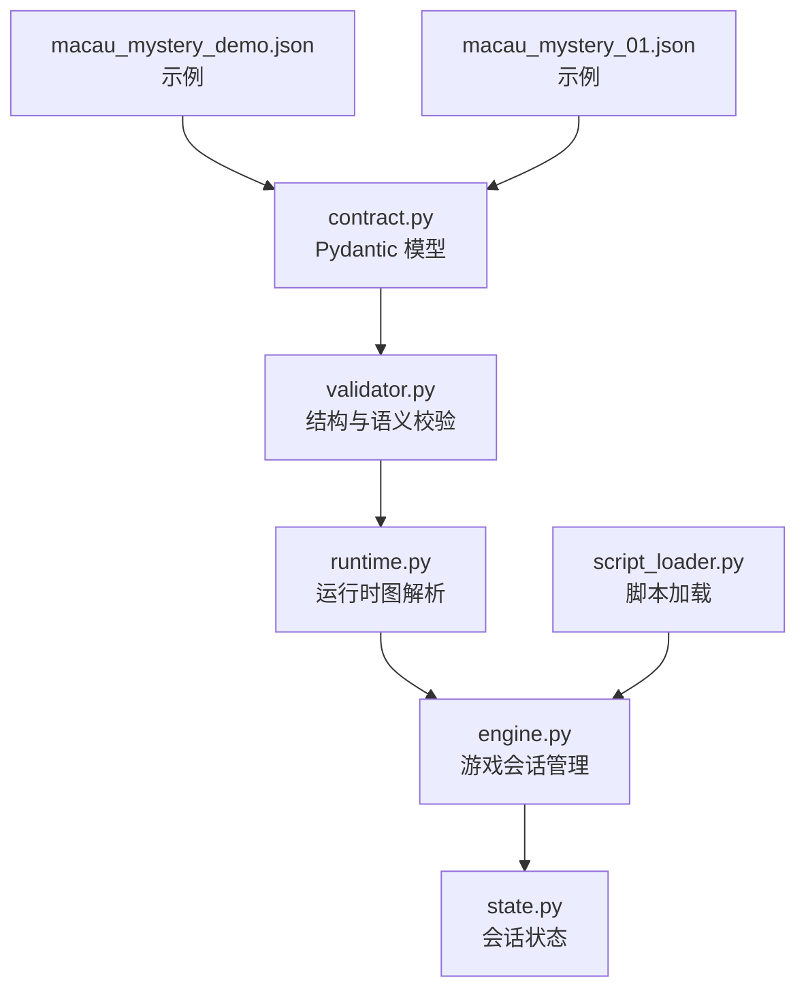
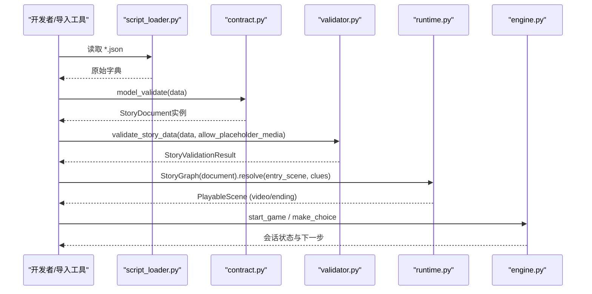
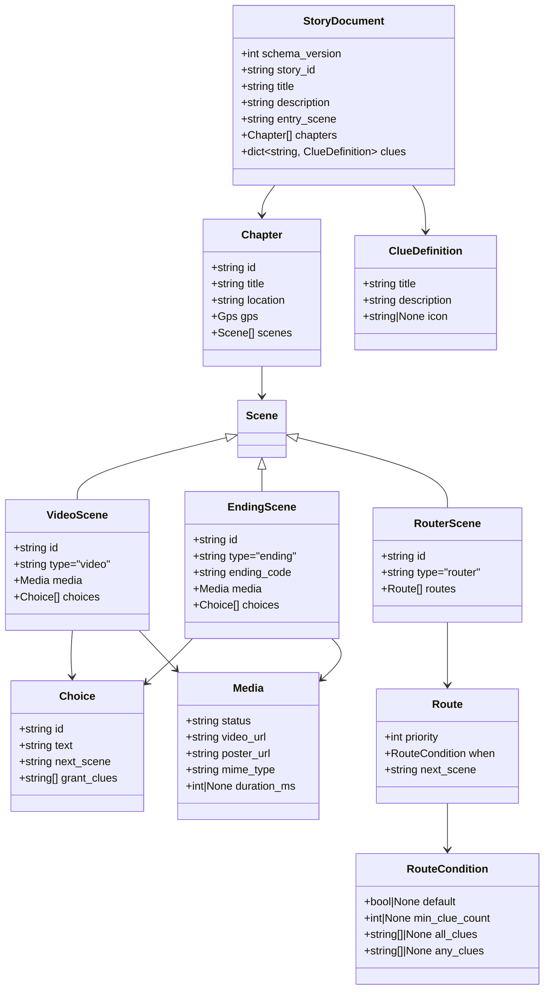
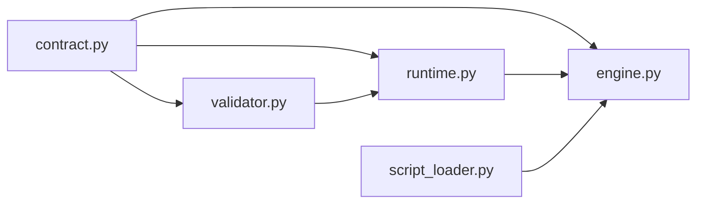

# JSON Schema定义

<cite>
**本文引用的文件**   
- [backend/app/story/contract.py](file://backend/app/story/contract.py)
- [backend/app/story/validator.py](file://backend/app/story/validator.py)
- [backend/app/story/runtime.py](file://backend/app/story/runtime.py)
- [backend/app/story/engine.py](file://backend/app/story/engine.py)
- [backend/app/story/state.py](file://backend/app/story/state.py)
- [backend/app/story/script_loader.py](file://backend/app/story/script_loader.py)
- [backend/app/story/scripts/macau_mystery_demo.json](file://backend/app/story/scripts/macau_mystery_demo.json)
- [backend/app/story/scripts/macau_mystery_01.json](file://backend/app/story/scripts/macau_mystery_01.json)
- [backend-deliverables/02-剧本&视频转json约定.md](file://backend-deliverables/02-剧本&视频转json约定.md)
</cite>

## 目录
1. [引言](#引言)
2. [项目结构](#项目结构)
3. [核心组件](#核心组件)
4. [架构总览](#架构总览)
5. [详细组件分析](#详细组件分析)
6. [依赖关系分析](#依赖关系分析)
7. [性能考量](#性能考量)
8. [故障排查指南](#故障排查指南)
9. [结论](#结论)
10. [附录](#附录)

## 引言
本技术文档围绕澳秘 Macau Mystery 的“剧本JSON Schema”进行系统化说明，覆盖顶层元数据、章节与场景结构、线索对象、条件路由规则以及完整的验证规则。文档以代码契约（Pydantic模型）为核心依据，结合运行时解析器与校验器，给出可操作的Schema规范、错误处理机制与示例路径引用，帮助编剧、前端与后端工程师在统一的数据边界上协作。

## 项目结构
本项目在后端通过 Pydantic 模型严格定义版本1的剧本数据结构，并通过校验器与运行时图解析器保障数据的完整性与可执行性。关键位置如下：
- 契约定义：backend/app/story/contract.py
- 校验逻辑：backend/app/story/validator.py
- 运行时解析：backend/app/story/runtime.py
- 引擎与状态：backend/app/story/engine.py、backend/app/story/state.py
- 脚本加载：backend/app/story/script_loader.py
- 示例剧本：backend/app/story/scripts/*.json
- 契约文档：backend-deliverables/02-剧本&视频转json约定.md

图表来源
- [backend/app/story/contract.py:1-128](file://backend/app/story/contract.py#L1-L128)
- [backend/app/story/validator.py:1-251](file://backend/app/story/validator.py#L1-L251)
- [backend/app/story/runtime.py:1-80](file://backend/app/story/runtime.py#L1-L80)
- [backend/app/story/engine.py:1-37](file://backend/app/story/engine.py#L1-L37)
- [backend/app/story/state.py:1-54](file://backend/app/story/state.py#L1-L54)
- [backend/app/story/script_loader.py:1-31](file://backend/app/story/script_loader.py#L1-L31)
- [backend/app/story/scripts/macau_mystery_demo.json:1-149](file://backend/app/story/scripts/macau_mystery_demo.json#L1-L149)
- [backend/app/story/scripts/macau_mystery_01.json:1-142](file://backend/app/story/scripts/macau_mystery_01.json#L1-L142)

章节来源
- [backend/app/story/contract.py:1-128](file://backend/app/story/contract.py#L1-L128)
- [backend-deliverables/02-剧本&视频转json约定.md:1-452](file://backend-deliverables/02-剧本&视频转json约定.md#L1-L452)

## 核心组件
- 契约模型（StoryDocument、Chapter、Scene、Choice、Route、Media、ClueDefinition等）定义了严格的字段类型、必填项与格式约束。
- 校验器（validate_story_data/validate_story_document）负责结构校验、语义校验（重复ID、缺失目标、可达性、路由循环等）。
- 运行时（StoryGraph）基于已验证的文档构建图，支持选择预览、路由解析与结局判定。
- 引擎（StoryEngine）与状态（GameSession）提供会话级流程控制与持久化接口。
- 脚本加载器（script_loader）用于读取本地脚本文件并做基础检查。

章节来源
- [backend/app/story/contract.py:1-128](file://backend/app/story/contract.py#L1-L128)
- [backend/app/story/validator.py:1-251](file://backend/app/story/validator.py#L1-L251)
- [backend/app/story/runtime.py:1-80](file://backend/app/story/runtime.py#L1-L80)
- [backend/app/story/engine.py:1-37](file://backend/app/story/engine.py#L1-L37)
- [backend/app/story/state.py:1-54](file://backend/app/story/state.py#L1-L54)
- [backend/app/story/script_loader.py:1-31](file://backend/app/story/script_loader.py#L1-L31)

## 架构总览
下图展示了从JSON到运行时的整体流程：加载脚本 → 契约校验 → 构建图 → 解析选择 → 返回可播放节点。

图表来源
- [backend/app/story/script_loader.py:1-31](file://backend/app/story/script_loader.py#L1-L31)
- [backend/app/story/contract.py:1-128](file://backend/app/story/contract.py#L1-L128)
- [backend/app/story/validator.py:1-251](file://backend/app/story/validator.py#L1-L251)
- [backend/app/story/runtime.py:1-80](file://backend/app/story/runtime.py#L1-L80)
- [backend/app/story/engine.py:1-37](file://backend/app/story/engine.py#L1-L37)

## 详细组件分析

### 顶层元数据（StoryDocument）
- schema_version：固定为1，用于版本锁定。
- story_id：故事唯一标识，遵循小写字母开头、仅含小写字母/数字/下划线，长度2-64。
- title：标题，非空字符串。
- description：可选描述。
- entry_scene：入口场景ID，必须存在且指向一个 video 节点。
- chapters：章节数组，至少一项。
- clues：线索定义字典，键为线索ID，值为 ClueDefinition。

字段约束要点
- Identifier 使用正则与长度限制。
- GPS 经纬度范围校验。
- Media 要求HTTP(S)绝对URL，status为placeholder或ready，duration_ms为正整数。
- Choice 的 next_scene 必须指向存在的场景ID；grant_clues 中的每个ID必须在根级 clues 中定义。
- RouterScene 的 routes 必须包含唯一 priority、恰好一条 default 规则且其优先级最大；when 条件合法。

章节来源
- [backend/app/story/contract.py:10-128](file://backend/app/story/contract.py#L10-L128)
- [backend/app/story/validator.py:54-190](file://backend/app/story/validator.py#L54-L190)

### 章节（Chapter）
- id：章节唯一标识。
- title：章节名称。
- location：当前澳门景点名称。
- gps：可选坐标对象 {lat, lng}，用于未来定位功能。
- scenes：本章全部场景（包括不可见 router 节点）。

章节来源
- [backend/app/story/contract.py:106-112](file://backend/app/story/contract.py#L106-L112)
- [backend-deliverables/02-剧本&视频转json约定.md:56-79](file://backend-deliverables/02-剧本&视频转json约定.md#L56-L79)

### 场景类型（Scene）
首版支持三种场景：video、ending、router。

- VideoScene
  - type 固定为 "video"
  - media：媒体对象（status、video_url、poster_url、mime_type、duration_ms）
  - choices：选项列表，至少一个（若该节点可达）
- EndingScene
  - type 固定为 "ending"
  - ending_code：结局代码标识符
  - media：媒体对象
  - choices：必须为空
- RouterScene
  - type 固定为 "router"
  - routes：路由规则列表，至少一项

章节来源
- [backend/app/story/contract.py:76-103](file://backend/app/story/contract.py#L76-L103)
- [backend-deliverables/02-剧本&视频转json约定.md:81-179](file://backend-deliverables/02-剧本&视频转json约定.md#L81-L179)

#### 类图（场景与相关对象）

图表来源
- [backend/app/story/contract.py:10-128](file://backend/app/story/contract.py#L10-L128)

### 选项（Choice）
- id：场景内唯一标识。
- text：玩家可见文案。
- next_scene：下一场景ID，可指向 video 或 router。
- grant_clues：获得的线索ID数组，元素必须是 clues 中定义的ID。

章节来源
- [backend/app/story/contract.py:41-46](file://backend/app/story/contract.py#L41-L46)
- [backend-deliverables/02-剧本&视频转json约定.md:209-228](file://backend-deliverables/02-剧本&视频转json约定.md#L209-L228)

### 路由与条件（RouterScene & RouteCondition）
- routes：按 priority 从小到大匹配命中第一条规则。
- when：
  - default：true 时作为默认规则，且必须唯一且优先级最大。
  - min_clue_count：≥1 的整数，表示已获得线索总数阈值。
  - all_clues：必须全部拥有的线索ID列表（非空、无重复）。
  - any_clues：至少拥有其中之一的线索ID列表（非空、无重复）。
- 组合语义：多个字段同时出现时为“并且”。

章节来源
- [backend/app/story/contract.py:48-74](file://backend/app/story/contract.py#L48-L74)
- [backend-deliverables/02-剧本&视频转json约定.md:251-274](file://backend-deliverables/02-剧本&视频转json约定.md#L251-L274)

### 媒体对象（Media）
- status：placeholder 或 ready。
- video_url/poster_url：HTTP(S)绝对URL。
- mime_type：首版建议 video/mp4。
- duration_ms：正整数，可选。

章节来源
- [backend/app/story/contract.py:25-39](file://backend/app/story/contract.py#L25-L39)
- [backend-deliverables/02-剧本&视频转json约定.md:181-208](file://backend-deliverables/02-剧本&视频转json约定.md#L181-L208)

### 线索对象（ClueDefinition）
- title：线索名称，非空。
- description：线索说明，非空。
- icon：前端图标键，可选，非空字符串。

章节来源
- [backend/app/story/contract.py:114-118](file://backend/app/story/contract.py#L114-L118)
- [backend-deliverables/02-剧本&视频转json约定.md:231-250](file://backend-deliverables/02-剧本&视频转json约定.md#L231-L250)

### 运行时解析（StoryGraph）
- resolve(scene_id, clue_ids)：从指定场景开始，自动解析 router 链，直到得到 video 或 ending 节点。
- preview_choice(scene_id, choice_id, clue_ids)：模拟选择后的下一可播放节点。
- _matches(condition, clue_ids)：条件匹配实现（default、min_clue_count、all_clues、any_clues）。

章节来源
- [backend/app/story/runtime.py:22-80](file://backend/app/story/runtime.py#L22-L80)

### 引擎与状态（StoryEngine & GameSession）
- StoryEngine：加载脚本、创建会话、处理选择、获取状态。
- GameSession：维护当前章节/场景索引、线索集合、选择历史、时间戳等。

章节来源
- [backend/app/story/engine.py:9-37](file://backend/app/story/engine.py#L9-L37)
- [backend/app/story/state.py:7-54](file://backend/app/story/state.py#L7-L54)

### 示例与迁移
- macau_mystery_demo.json：最小演示，包含 video、router、ending 与线索条件。
- macau_mystery_01.json：早期示例，部分字段与新版契约不一致（如缺少 schema_version、entry_scene、type、media），需迁移至新契约。

章节来源
- [backend/app/story/scripts/macau_mystery_demo.json:1-149](file://backend/app/story/scripts/macau_mystery_demo.json#L1-L149)
- [backend/app/story/scripts/macau_mystery_01.json:1-142](file://backend/app/story/scripts/macau_mystery_01.json#L1-L142)
- [backend-deliverables/02-剧本&视频转json约定.md:427-443](file://backend-deliverables/02-剧本&视频转json约定.md#L427-L443)

## 依赖关系分析
- contract.py 被 validator.py、runtime.py、engine.py 等模块引用，作为统一的类型契约。
- validator.py 依赖 contract.py 的模型进行结构化与语义校验。
- runtime.py 依赖 contract.py 的类型，对已验证文档进行图解析。
- engine.py 与 state.py 提供会话级流程控制，依赖 runtime 的结果。
- script_loader.py 提供脚本加载能力，供上层调用。

图表来源
- [backend/app/story/contract.py:1-128](file://backend/app/story/contract.py#L1-L128)
- [backend/app/story/validator.py:1-251](file://backend/app/story/validator.py#L1-L251)
- [backend/app/story/runtime.py:1-80](file://backend/app/story/runtime.py#L1-L80)
- [backend/app/story/engine.py:1-37](file://backend/app/story/engine.py#L1-L37)
- [backend/app/story/script_loader.py:1-31](file://backend/app/story/script_loader.py#L1-L31)

章节来源
- [backend/app/story/contract.py:1-128](file://backend/app/story/contract.py#L1-L128)
- [backend/app/story/validator.py:1-251](file://backend/app/story/validator.py#L1-L251)
- [backend/app/story/runtime.py:1-80](file://backend/app/story/runtime.py#L1-L80)
- [backend/app/story/engine.py:1-37](file://backend/app/story/engine.py#L1-L37)
- [backend/app/story/script_loader.py:1-31](file://backend/app/story/script_loader.py#L1-L31)

## 性能考量
- 校验阶段：
  - 去重检测（章节ID、场景ID、选项ID、路由priority）采用集合存储，O(1)查找。
  - 可达性与反向路径计算使用队列遍历，线性于边数。
- 运行时解析：
  - 路由链解析设置最大跳转次数，防止无限循环。
  - 条件匹配为常数时间与集合操作，复杂度低。
- 媒体资源：
  - 不保存二进制，仅存URL，减少存储压力。
  - placeholder 媒体仅在开发环境允许，发布前需替换为 ready。

[本节为通用指导，无需特定文件引用]

## 故障排查指南
常见错误与处理建议：
- SCHEMA_VALIDATION_ERROR：字段类型或格式不符，检查Identifier、Media URL、GPS范围等。
- DUPLICATE_*：重复ID（章节、场景、选项、路由priority），确保全局或局部唯一。
- UNKNOWN_CLUE_REFERENCE：grant_clues 或 when.all_clues/any_clues 引用了未定义的线索ID。
- MISSING_SCENE_TARGET：next_scene 指向的场景不存在。
- INVALID_ENTRY_SCENE：entry_scene 不是 video 节点。
- VIDEO_WITHOUT_CHOICES：可达 video 节点没有选项。
- NO_REACHABLE_ENDING：入口无法到达任何 ending。
- NO_PATH_TO_ENDING：某些可达场景无法通向结局。
- ROUTER_CYCLE：路由链形成循环。
- PLACEHOLDER_MEDIA_NOT_ALLOWED：发布环境不允许 placeholder 媒体。

章节来源
- [backend/app/story/validator.py:54-190](file://backend/app/story/validator.py#L54-L190)
- [backend/app/story/runtime.py:37-80](file://backend/app/story/runtime.py#L37-L80)
- [backend/tests/test_story_runtime.py:25-83](file://backend/tests/test_story_runtime.py#L25-L83)

## 结论
本Schema以Pydantic契约为核心，配合校验器与运行时解析器，构建了稳定、可扩展且易于验证的剧本数据模型。通过明确的字段约束、条件路由与线索系统，既满足内容创作需求，又保证后端执行的确定性与安全性。建议在导入与发布流程中严格执行校验，避免运行时异常。

[本节为总结，无需特定文件引用]

## 附录

### 完整JSON Schema验证规则清单
- 顶层字段
  - schema_version：固定为1
  - story_id：Identifier（小写开头，仅字母/数字/下划线，长度2-64）
  - title：非空字符串
  - description：可选字符串
  - entry_scene：Identifier，必须存在且指向 video 节点
  - chapters：非空数组
  - clues：对象，键为Identifier，值为 ClueDefinition
- 章节
  - id：Identifier（全局唯一）
  - title/location：非空字符串
  - gps：可选 {lat∈[-90,90], lng∈[-180,180]}
  - scenes：非空数组（包含所有场景）
- 场景
  - video：type="video"，media必填，choices非空（若可达）
  - ending：type="ending"，ending_code必填，media必填，choices必须为空
  - router：type="router"，routes非空，priority唯一，default规则唯一且优先级最大
- 选项
  - id：场景内唯一
  - text：非空字符串
  - next_scene：Identifier（必须存在）
  - grant_clues：Identifier数组（元素必须在clues中定义）
- 路由条件
  - default：true 时单独作为默认规则
  - min_clue_count：≥1 的整数
  - all_clues/any_clues：非空、无重复的Identifier数组
- 媒体
  - status：placeholder或ready
  - video_url/poster_url：HTTP(S)绝对URL
  - mime_type：非空字符串
  - duration_ms：正整数（可选）
- 线索
  - title/description：非空字符串
  - icon：可选非空字符串

章节来源
- [backend/app/story/contract.py:10-128](file://backend/app/story/contract.py#L10-L128)
- [backend-deliverables/02-剧本&视频转json约定.md:32-54](file://backend-deliverables/02-剧本&视频转json约定.md#L32-L54)
- [backend-deliverables/02-剧本&视频转json约定.md:81-179](file://backend-deliverables/02-剧本&视频转json约定.md#L81-L179)
- [backend-deliverables/02-剧本&视频转json约定.md:181-208](file://backend-deliverables/02-剧本&视频转json约定.md#L181-L208)
- [backend-deliverables/02-剧本&视频转json约定.md:209-228](file://backend-deliverables/02-剧本&视频转json约定.md#L209-L228)
- [backend-deliverables/02-剧本&视频转json约定.md:231-250](file://backend-deliverables/02-剧本&视频转json约定.md#L231-L250)
- [backend-deliverables/02-剧本&视频转json约定.md:251-274](file://backend-deliverables/02-剧本&视频转json约定.md#L251-L274)

### 实际JSON示例与错误处理机制
- 示例文件
  - 最小演示：backend/app/story/scripts/macau_mystery_demo.json
  - 早期示例：backend/app/story/scripts/macau_mystery_01.json
- 错误处理机制
  - 校验结果包含 valid、errors、warnings，错误阻止发布，警告允许发布但需提示。
  - 发布前禁止 placeholder 媒体，需全部替换为 ready。
  - 入口必须为 video，且每个可达 video 至少有一个选项。
  - 所有路由最终必须解析为 video 或 ending，且每个可达节点都有通往结局的路径。

章节来源
- [backend/app/story/scripts/macau_mystery_demo.json:1-149](file://backend/app/story/scripts/macau_mystery_demo.json#L1-L149)
- [backend/app/story/scripts/macau_mystery_01.json:1-142](file://backend/app/story/scripts/macau_mystery_01.json#L1-L142)
- [backend-deliverables/02-剧本&视频转json约定.md:391-425](file://backend-deliverables/02-剧本&视频转json约定.md#L391-L425)