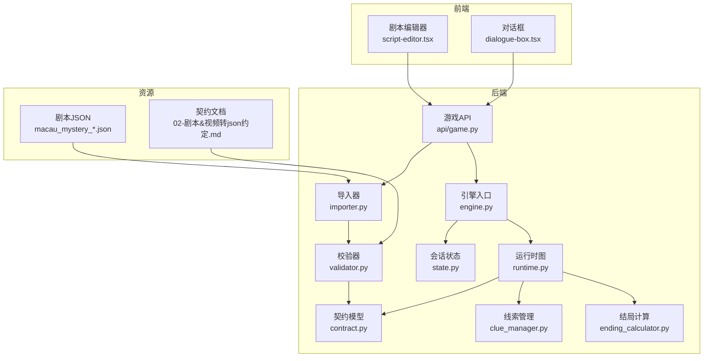
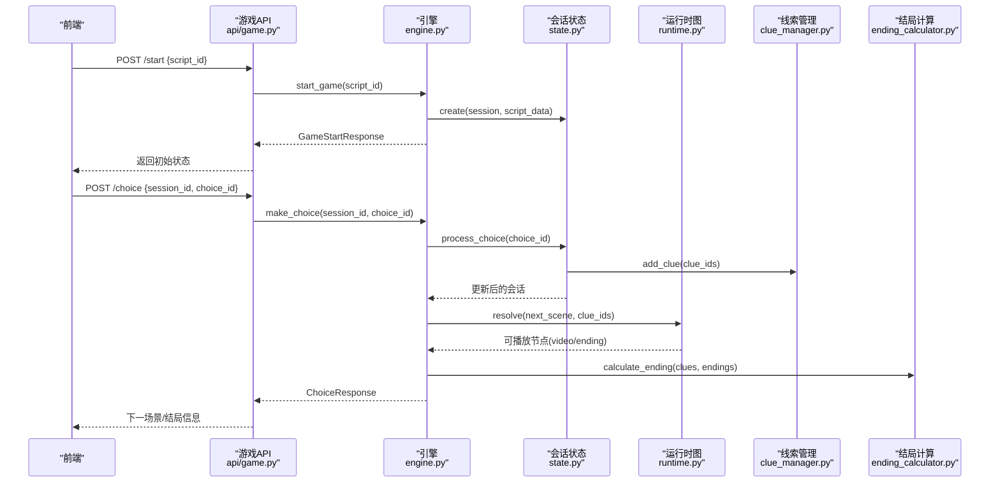
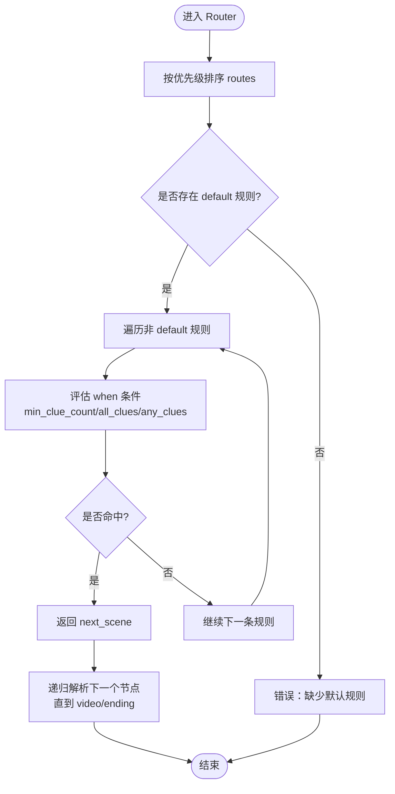
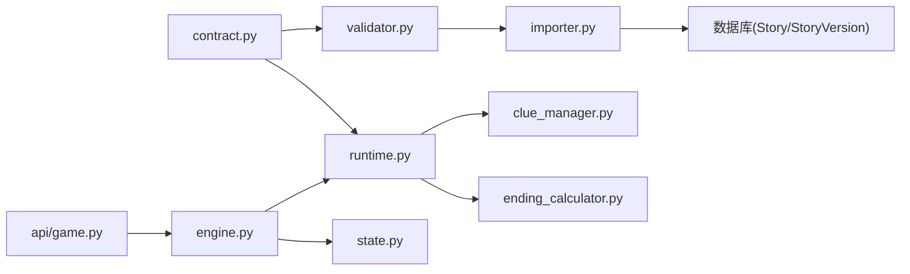

# 创作指南

<cite>
**本文引用的文件**   
- [backend/app/story/scripts/macau_mystery_01.json](file://backend/app/story/scripts/macau_mystery_01.json)
- [backend/app/story/scripts/macau_mystery_demo.json](file://backend/app/story/scripts/macau_mystery_demo.json)
- [backend-deliverables/02-剧本&视频转json约定.md](file://backend-deliverables/02-剧本&视频转json约定.md)
- [backend/app/story/contract.py](file://backend/app/story/contract.py)
- [backend/app/story/runtime.py](file://backend/app/story/runtime.py)
- [backend/app/story/state.py](file://backend/app/story/state.py)
- [backend/app/story/engine.py](file://backend/app/story/engine.py)
- [backend/app/story/validator.py](file://backend/app/story/validator.py)
- [backend/app/story/clue_manager.py](file://backend/app/story/clue_manager.py)
- [backend/app/story/ending_calculator.py](file://backend/app/story/ending_calculator.py)
- [backend/app/story/importer.py](file://backend/app/story/importer.py)
- [backend/app/api/game.py](file://backend/app/api/game.py)
- [frontend/src/components/script-editor.tsx](file://frontend/src/components/script-editor.tsx)
- [frontend/src/components/dialogue-box.tsx](file://frontend/src/components/dialogue-box.tsx)
- [backend/tests/test_story_runtime.py](file://backend/tests/test_story_runtime.py)
- [backend/tests/test_story_importer.py](file://backend/tests/test_story_importer.py)
</cite>

## 目录
1. [引言](#引言)
2. [项目结构](#项目结构)
3. [核心组件](#核心组件)
4. [架构总览](#架构总览)
5. [详细组件分析](#详细组件分析)
6. [依赖关系分析](#依赖关系分析)
7. [性能考虑](#性能考虑)
8. [故障排查指南](#故障排查指南)
9. [结论](#结论)
10. [附录：模板与清单](#附录模板与清单)

## 引言
本指南面向澳秘 Macau Mystery 的剧本创作者，提供标准化的创作流程与最佳实践。内容涵盖故事结构设计（章节划分、场景布局、分支设计）、事件类型选择（video/router/ending）、线索设计与平衡、多结局设计技巧、完整创作模板与示例、质量检查清单以及性能优化建议。读者无需深入代码即可高效产出符合系统约束的高质量剧本。

## 项目结构
本项目采用前后端分离架构：
- 后端负责剧本数据契约校验、运行时图解析、会话状态管理、导入发布与API暴露。
- 前端提供剧本编辑器、对话展示、地图与线索查看等交互界面。
- 剧本以JSON定义，遵循严格的版本化契约；运行时通过“图”模型进行跳转与条件路由。

图表来源 
- [backend/app/api/game.py:1-37](file://backend/app/api/game.py#L1-L37)
- [backend/app/story/importer.py:1-161](file://backend/app/story/importer.py#L1-L161)
- [backend/app/story/validator.py:1-251](file://backend/app/story/validator.py#L1-L251)
- [backend/app/story/contract.py:1-128](file://backend/app/story/contract.py#L1-L128)
- [backend/app/story/engine.py:1-37](file://backend/app/story/engine.py#L1-L37)
- [backend/app/story/runtime.py:1-80](file://backend/app/story/runtime.py#L1-L80)
- [backend/app/story/state.py:1-54](file://backend/app/story/state.py#L1-L54)
- [backend/app/story/clue_manager.py:1-14](file://backend/app/story/clue_manager.py#L1-L14)
- [backend/app/story/ending_calculator.py:1-14](file://backend/app/story/ending_calculator.py#L1-L14)
- [backend-deliverables/02-剧本&视频转json约定.md:1-452](file://backend-deliverables/02-剧本&视频转json约定.md#L1-L452)

章节来源
- [backend/app/api/game.py:1-37](file://backend/app/api/game.py#L1-L37)
- [backend/app/story/importer.py:1-161](file://backend/app/story/importer.py#L1-L161)
- [backend/app/story/validator.py:1-251](file://backend/app/story/validator.py#L1-L251)
- [backend/app/story/contract.py:1-128](file://backend/app/story/contract.py#L1-L128)
- [backend/app/story/engine.py:1-37](file://backend/app/story/engine.py#L1-L37)
- [backend/app/story/runtime.py:1-80](file://backend/app/story/runtime.py#L1-L80)
- [backend/app/story/state.py:1-54](file://backend/app/story/state.py#L1-L54)
- [backend/app/story/clue_manager.py:1-14](file://backend/app/story/clue_manager.py#L1-L14)
- [backend/app/story/ending_calculator.py:1-14](file://backend/app/story/ending_calculator.py#L1-L14)
- [backend-deliverables/02-剧本&视频转json约定.md:1-452](file://backend-deliverables/02-剧本&视频转json约定.md#L1-L452)

## 核心组件
- 契约模型（contract.py）：严格定义 schema_version、story_id、entry_scene、chapters、clues、Scene（video/ending/router）、Choice、RouteCondition 等字段与校验规则。
- 运行时图（runtime.py）：将验证后的文档构建为可遍历的图，支持按线索集合解析 router 并返回可播放节点（video/ending）。
- 会话状态（state.py）：维护 session、当前章节/场景索引、已获线索、选择历史等。
- 引擎（engine.py）：加载脚本、创建会话、处理选择、获取状态。
- 校验器（validator.py）：对 JSON 进行结构与语义校验（重复ID、缺失目标、可达性、无选项 video、router 循环、默认规则唯一性等）。
- 导入器（importer.py）：将 JSON 导入数据库，生成不可变版本，去重内容哈希，支持发布与草稿。
- 线索管理（clue_manager.py）：幂等添加线索、基于条件的结局判定。
- 结局计算（ending_calculator.py）：根据线索数量或 default 规则选择结局。
- 游戏API（api/game.py）：对外暴露 start/choice/state 接口。

章节来源
- [backend/app/story/contract.py:1-128](file://backend/app/story/contract.py#L1-L128)
- [backend/app/story/runtime.py:1-80](file://backend/app/story/runtime.py#L1-L80)
- [backend/app/story/state.py:1-54](file://backend/app/story/state.py#L1-L54)
- [backend/app/story/engine.py:1-37](file://backend/app/story/engine.py#L1-L37)
- [backend/app/story/validator.py:1-251](file://backend/app/story/validator.py#L1-L251)
- [backend/app/story/importer.py:1-161](file://backend/app/story/importer.py#L1-L161)
- [backend/app/story/clue_manager.py:1-14](file://backend/app/story/clue_manager.py#L1-L14)
- [backend/app/story/ending_calculator.py:1-14](file://backend/app/story/ending_calculator.py#L1-L14)
- [backend/app/api/game.py:1-37](file://backend/app/api/game.py#L1-L37)

## 架构总览
下图展示了从前端发起开始游戏到选择推进的关键调用链，以及运行时如何解析 router 与结局。

图表来源 
- [backend/app/api/game.py:1-37](file://backend/app/api/game.py#L1-L37)
- [backend/app/story/engine.py:1-37](file://backend/app/story/engine.py#L1-L37)
- [backend/app/story/state.py:1-54](file://backend/app/story/state.py#L1-L54)
- [backend/app/story/runtime.py:1-80](file://backend/app/story/runtime.py#L1-L80)
- [backend/app/story/clue_manager.py:1-14](file://backend/app/story/clue_manager.py#L1-L14)
- [backend/app/story/ending_calculator.py:1-14](file://backend/app/story/ending_calculator.py#L1-L14)

## 详细组件分析

### 故事结构与章节设计
- 章节（Chapter）包含 id、title、location、gps（可选）、scenes。章节顺序用于展示进度，实际剧情推进由场景跳转决定。
- 场景（Scene）分三类：
  - video：可播放节点，必须包含 media 与 choices。
  - ending：结局节点，choices 必须为空，需有 ending_code。
  - router：不可见条件路由，按 priority 从小到大匹配 when 条件，最终落到 video 或 ending。
- entry_scene 必须是 video 节点，且所有可达 video 节点至少有一个选项。

章节来源
- [backend-deliverables/02-剧本&视频转json约定.md:56-178](file://backend-deliverables/02-剧本&视频转json约定.md#L56-L178)
- [backend/app/story/contract.py:106-128](file://backend/app/story/contract.py#L106-L128)
- [backend/app/story/validator.py:156-189](file://backend/app/story/validator.py#L156-L189)

### 事件类型选择与使用原则
- 何时使用 video：需要呈现叙事、旁白、对话或互动选项的可播放节点。
- 何时使用 router：当需要根据线索集合、计数或组合条件自动跳转到不同结局或分支时，避免在前端做逻辑判断。
- 何时使用 ending：作为故事终点，不再提供选项，仅播放结局媒体。

章节来源
- [backend-deliverables/02-剧本&视频转json约定.md:85-178](file://backend-deliverables/02-剧本&视频转json约定.md#L85-L178)
- [backend/app/story/contract.py:76-103](file://backend/app/story/contract.py#L76-L103)

### 分支设计与跳转规范
- 每个 video 节点的 choices 必须指向存在的 scene.id（包括 router）。
- 跳转路径必须保证从 entry_scene 可达，且每个可达 video 节点都有至少一个选项。
- router 的 routes 必须包含且仅包含一条 default 规则，default 的 priority 必须最大。
- 禁止 router 循环；运行时限制最大跳转次数防止死循环。

章节来源
- [backend/app/story/validator.py:108-189](file://backend/app/story/validator.py#L108-L189)
- [backend/app/story/runtime.py:37-48](file://backend/app/story/runtime.py#L37-L48)

### 线索设计与难度平衡
- 线索在根级 clues 中统一定义，选择后可通过 grant_clues 发放。
- 同一会话内同一线索只发放一次，重复经过不会产生重复记录。
- 推荐分布策略：
  - 每章至少提供 1-2 条关键线索，确保玩家能逐步拼凑真相。
  - 将高价值线索放在关键分支点，引导探索。
  - 控制线索总数与难度梯度，避免过早获得全部关键线索导致分支收敛过快。
- 条件路由可使用 min_clue_count、all_clues、any_clues 组合，形成“且”语义。

章节来源
- [backend-deliverables/02-剧本&视频转json约定.md:231-275](file://backend-deliverables/02-剧本&视频转json约定.md#L231-L275)
- [backend/app/story/runtime.py:64-73](file://backend/app/story/runtime.py#L64-L73)
- [backend/app/story/clue_manager.py:1-14](file://backend/app/story/clue_manager.py#L1-L14)

### 多结局设计技巧
- 使用 router 在接近结尾处汇聚多条分支，依据线索集合与计数选择结局。
- 建议设置多个结局等级（如 good/normal/bad），并通过 min_clue_count 或 all_clues 区分。
- 确保每个可达分支都能到达某个 ending，避免无法结束的路径。

章节来源
- [backend-deliverables/02-剧本&视频转json约定.md:124-178](file://backend-deliverables/02-剧本&视频转json约定.md#L124-L178)
- [backend/app/story/ending_calculator.py:1-14](file://backend/app/story/ending_calculator.py#L1-L14)

### 示例与模板
- 示例一：macau_mystery_01.json 展示了传统对话式章节与线索奖励、过渡跳转的结构。
- 示例二：macau_mystery_demo.json 演示了 video/router/ending 的最小可行结构，含分支汇合与多结局。
- 模板要点：
  - 根对象包含 schema_version、story_id、title、description、entry_scene、chapters、clues。
  - 每个 chapter.scenes 中的 scene 必须声明 type 与 media（video/ending）或 routes（router）。
  - choices 的 next_scene 必须存在，grant_clues 必须在 clues 中定义。

章节来源
- [backend/app/story/scripts/macau_mystery_01.json:1-142](file://backend/app/story/scripts/macau_mystery_01.json#L1-L142)
- [backend/app/story/scripts/macau_mystery_demo.json:1-149](file://backend/app/story/scripts/macau_mystery_demo.json#L1-L149)
- [backend-deliverables/02-剧本&视频转json约定.md:32-55](file://backend-deliverables/02-剧本&视频转json约定.md#L32-L55)

### 运行时流程图（Router 解析）

图表来源 
- [backend/app/story/runtime.py:75-80](file://backend/app/story/runtime.py#L75-L80)
- [backend/app/story/validator.py:108-144](file://backend/app/story/validator.py#L108-L144)

## 依赖关系分析
- 契约模型被运行时与校验器共同依赖，确保数据结构一致性。
- 导入器依赖校验器与契约模型，生成不可变版本并去重。
- 引擎协调会话状态与运行时图，处理选择与状态查询。
- 前端通过 API 与后端交互，不直接解析条件路由。

图表来源 
- [backend/app/story/contract.py:1-128](file://backend/app/story/contract.py#L1-L128)
- [backend/app/story/runtime.py:1-80](file://backend/app/story/runtime.py#L1-L80)
- [backend/app/story/validator.py:1-251](file://backend/app/story/validator.py#L1-L251)
- [backend/app/story/importer.py:1-161](file://backend/app/story/importer.py#L1-L161)
- [backend/app/api/game.py:1-37](file://backend/app/api/game.py#L1-L37)
- [backend/app/story/engine.py:1-37](file://backend/app/story/engine.py#L1-L37)
- [backend/app/story/state.py:1-54](file://backend/app/story/state.py#L1-L54)
- [backend/app/story/clue_manager.py:1-14](file://backend/app/story/clue_manager.py#L1-L14)
- [backend/app/story/ending_calculator.py:1-14](file://backend/app/story/ending_calculator.py#L1-L14)

章节来源
- [backend/app/story/contract.py:1-128](file://backend/app/story/contract.py#L1-L128)
- [backend/app/story/runtime.py:1-80](file://backend/app/story/runtime.py#L1-L80)
- [backend/app/story/validator.py:1-251](file://backend/app/story/validator.py#L1-L251)
- [backend/app/story/importer.py:1-161](file://backend/app/story/importer.py#L1-L161)
- [backend/app/api/game.py:1-37](file://backend/app/api/game.py#L1-L37)
- [backend/app/story/engine.py:1-37](file://backend/app/story/engine.py#L1-L37)
- [backend/app/story/state.py:1-54](file://backend/app/story/state.py#L1-L54)
- [backend/app/story/clue_manager.py:1-14](file://backend/app/story/clue_manager.py#L1-L14)
- [backend/app/story/ending_calculator.py:1-14](file://backend/app/story/ending_calculator.py#L1-L14)

## 性能考虑
- 运行时图解析限制最大 router 跳转次数，防止错误数据导致无限循环。
- 导入阶段对内容进行哈希去重，避免重复存储相同版本。
- 媒体资源仅保存 URL，不存储二进制，减少存储压力。
- 前端预加载下一可播放节点的媒体信息，提升体验流畅度。

章节来源
- [backend/app/story/runtime.py:23-48](file://backend/app/story/runtime.py#L23-L48)
- [backend/app/story/importer.py:52-106](file://backend/app/story/importer.py#L52-L106)
- [backend-deliverables/02-剧本&视频转json约定.md:201-208](file://backend-deliverables/02-剧本&视频转json约定.md#L201-L208)

## 故障排查指南
常见问题与定位方法：
- 未知场景目标：检查 choices.next_scene 或 router.next_scene 是否指向存在的 scene.id。
- 缺少默认规则或默认规则优先级不正确：确保 router 仅有一条 default 规则且 priority 最大。
- 可达 video 节点无选项：为每个可达 video 节点至少提供一个 choices。
- 无法到达结局：确保所有可达节点都存在通向 ending 的路径。
- placeholder 媒体不允许：发布环境需将所有 media.status 改为 ready。
- 线索引用未定义：确保 grant_clues 与条件中的线索 ID 均在根级 clues 中定义。

章节来源
- [backend/app/story/validator.py:145-189](file://backend/app/story/validator.py#L145-L189)
- [backend/app/story/validator.py:108-144](file://backend/app/story/validator.py#L108-L144)
- [backend/app/story/validator.py:156-176](file://backend/app/story/validator.py#L156-L176)
- [backend/app/story/validator.py:174-189](file://backend/app/story/validator.py#L174-L189)
- [backend/app/story/validator.py:78-88](file://backend/app/story/validator.py#L78-L88)
- [backend/app/story/validator.py:99-131](file://backend/app/story/validator.py#L99-L131)

## 结论
通过严格的 JSON 契约、健壮的运行时图解析与完善的校验机制，Macau Mystery 为剧本创作提供了稳定、可扩展的基础设施。创作者应遵循章节与场景设计规范、合理使用 video/router/ending、科学分布线索与难度、精心设计多结局，并利用提供的模板与示例快速迭代。借助质量检查清单与性能优化建议，可显著提升剧本质量与用户体验。

## 附录：模板与清单

### 创作模板（JSON 骨架）
- 根对象：schema_version、story_id、title、description、entry_scene、chapters、clues。
- 章节：id、title、location、gps（可选）、scenes。
- 场景：
  - video：type="video"、media（status/video_url/poster_url/mime_type/duration_ms）、choices（id/text/next_scene/grant_clues）。
  - ending：type="ending"、ending_code、media、choices=[]。
  - router：type="router"、routes（priority/when/next_scene）。
- 线索：标题、描述、图标键。

章节来源
- [backend-deliverables/02-剧本&视频转json约定.md:32-55](file://backend-deliverables/02-剧本&视频转json约定.md#L32-L55)
- [backend-deliverables/02-剧本&视频转json约定.md:85-178](file://backend-deliverables/02-剧本&视频转json约定.md#L85-L178)
- [backend-deliverables/02-剧本&视频转json约定.md:231-275](file://backend-deliverables/02-剧本&视频转json约定.md#L231-L275)

### 质量检查清单
- 标识符规范：小写开头，仅字母数字下划线，长度合理，全局唯一。
- 入口场景：entry_scene 指向 video 节点。
- 可达性与选项：所有可达 video 节点至少有一个选项。
- 路由规则：router 仅一条 default，priority 唯一且 default 最大，条件字段合法。
- 结局可达：每个可达节点存在通向 ending 的路径。
- 线索引用：grant_clues 与条件中的线索 ID 均在 clues 中定义。
- 媒体状态：发布环境 media.status=ready。
- 无循环：router 链无循环。

章节来源
- [backend-deliverables/02-剧本&视频转json约定.md:20-31](file://backend-deliverables/02-剧本&视频转json约定.md#L20-L31)
- [backend-deliverables/02-剧本&视频转json约定.md:172-179](file://backend-deliverables/02-剧本&视频转json约定.md#L172-L179)
- [backend-deliverables/02-剧本&视频转json约定.md:201-208](file://backend-deliverables/02-剧本&视频转json约定.md#L201-L208)
- [backend/app/story/validator.py:145-189](file://backend/app/story/validator.py#L145-L189)

### 示例文件参考
- 传统对话式示例：macau_mystery_01.json
- 最小可行示例（video/router/ending）：macau_mystery_demo.json

章节来源
- [backend/app/story/scripts/macau_mystery_01.json:1-142](file://backend/app/story/scripts/macau_mystery_01.json#L1-L142)
- [backend/app/story/scripts/macau_mystery_demo.json:1-149](file://backend/app/story/scripts/macau_mystery_demo.json#L1-L149)

### 前端编辑与对话展示
- 剧本编辑器：支持章节与场景的增删改，便于快速搭建结构。
- 对话框：打字机效果与头像展示，增强沉浸感。

章节来源
- [frontend/src/components/script-editor.tsx:1-167](file://frontend/src/components/script-editor.tsx#L1-L167)
- [frontend/src/components/dialogue-box.tsx:1-63](file://frontend/src/components/dialogue-box.tsx#L1-L63)

### 测试与验证
- 运行时覆盖：验证 placeholder 媒体拒绝、缺失目标与循环检测、可达 video 无选项、条件合并语义。
- 导入行为：版本不可变、内容去重、发布与草稿状态管理。

章节来源
- [backend/tests/test_story_runtime.py:1-83](file://backend/tests/test_story_runtime.py#L1-L83)
- [backend/tests/test_story_importer.py:1-60](file://backend/tests/test_story_importer.py#L1-L60)