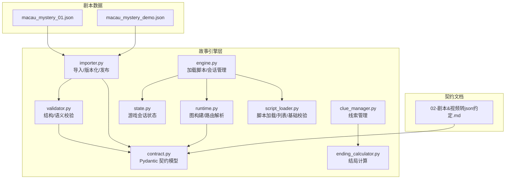
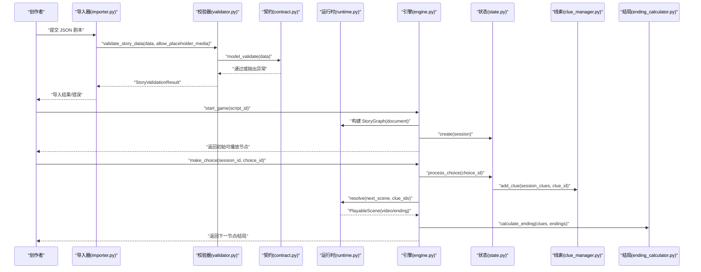
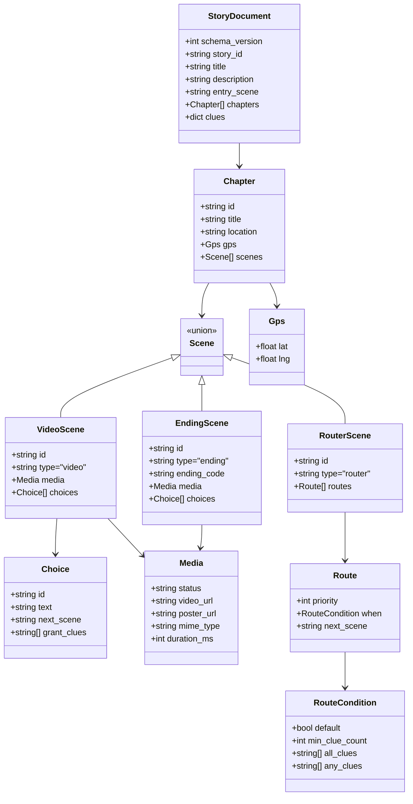
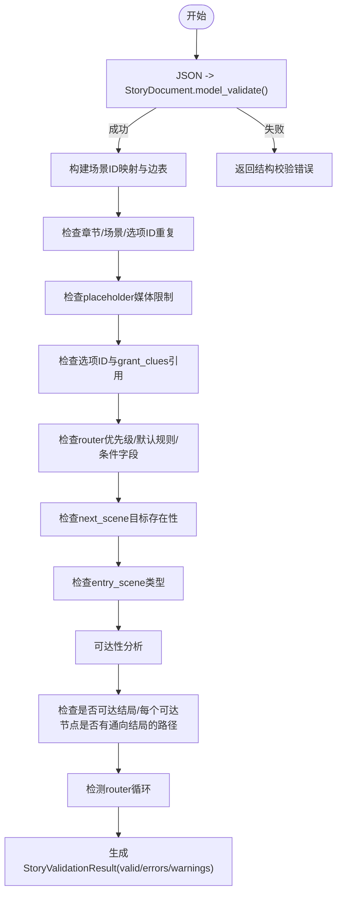
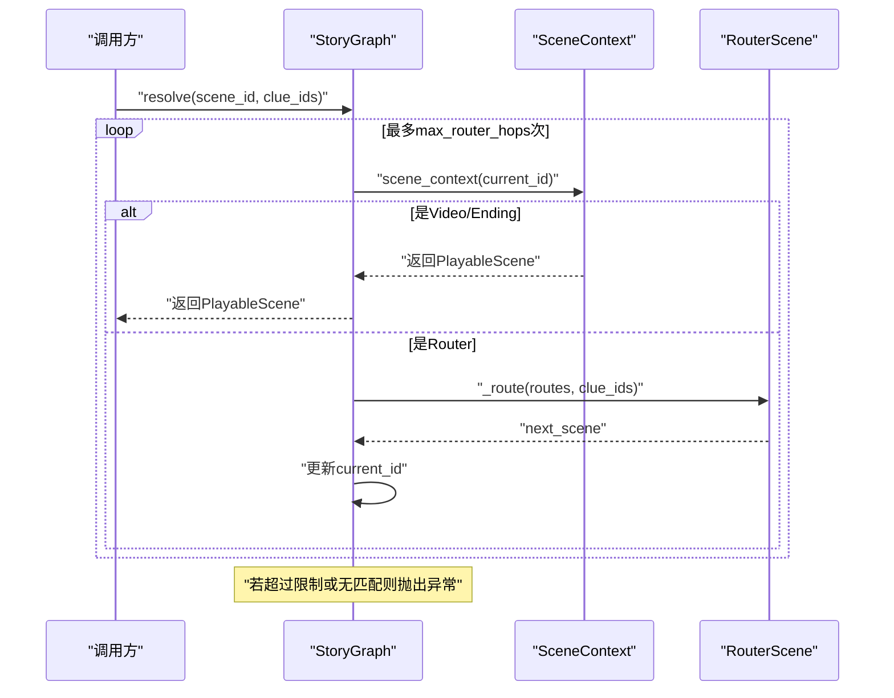
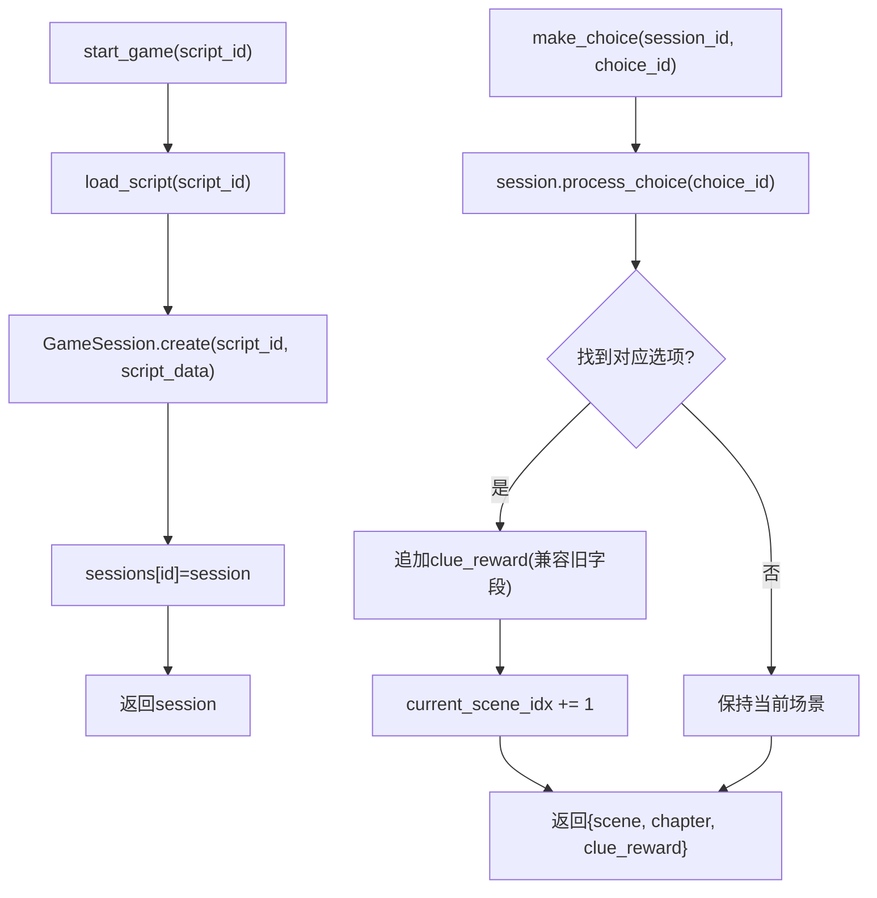
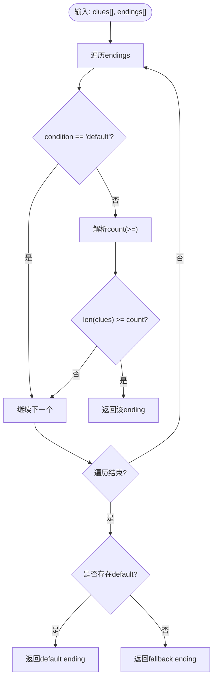
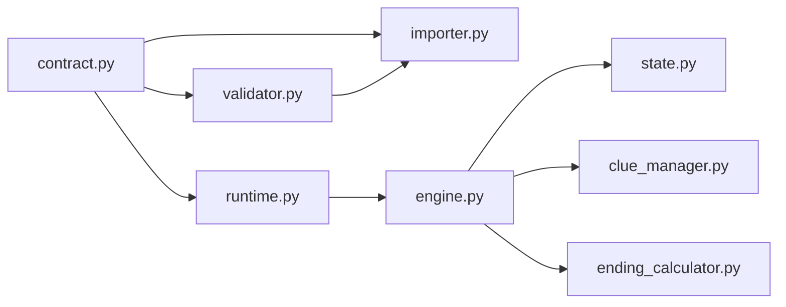

# 剧本格式规范

<cite>
**本文引用的文件**
- [backend/app/story/contract.py](file://backend/app/story/contract.py)
- [backend/app/story/validator.py](file://backend/app/story/validator.py)
- [backend/app/story/runtime.py](file://backend/app/story/runtime.py)
- [backend/app/story/engine.py](file://backend/app/story/engine.py)
- [backend/app/story/state.py](file://backend/app/story/state.py)
- [backend/app/story/clue_manager.py](file://backend/app/story/clue_manager.py)
- [backend/app/story/ending_calculator.py](file://backend/app/story/ending_calculator.py)
- [backend/app/story/importer.py](file://backend/app/story/importer.py)
- [backend/app/story/script_loader.py](file://backend/app/story/script_loader.py)
- [backend/app/story/scripts/macau_mystery_01.json](file://backend/app/story/scripts/macau_mystery_01.json)
- [backend/app/story/scripts/macau_mystery_demo.json](file://backend/app/story/scripts/macau_mystery_demo.json)
- [backend-deliverables/02-剧本&视频转json约定.md](file://backend-deliverables/02-剧本&视频转json约定.md)
</cite>

## 目录
1. [引言](#引言)
2. [项目结构](#项目结构)
3. [核心组件](#核心组件)
4. [架构总览](#架构总览)
5. [详细组件分析](#详细组件分析)
6. [依赖关系分析](#依赖关系分析)
7. [性能考量](#性能考量)
8. [故障排查指南](#故障排查指南)
9. [结论](#结论)
10. [附录](#附录)

## 引言
本技术文档面向澳秘 Macau Mystery 项目的剧本创作者与后端开发者，系统化定义并解释 JSON 格式的“沉浸式短剧剧情”数据契约。内容覆盖：
- 元数据字段、章节组织与场景类型（video、router、ending）
- 场景对象属性：文本、选项设置、条件判断与事件触发机制
- 线索系统的数据结构与多结局计算规则
- 分支逻辑与路由跳转处理
- 完整的 JSON Schema 验证规则、字段约束与数据类型定义
- 创作模板、示例文件与常见错误模式
- 标准化创作指南与工具链支持

## 项目结构
本项目在 backend 的 story 模块中集中实现剧本的契约定义、校验、运行时解析与导入发布流程；scripts 目录存放具体剧本 JSON 文件；deliverables 包含已确认的契约文档。

图表来源
- [backend/app/story/engine.py:1-37](file://backend/app/story/engine.py#L1-L37)
- [backend/app/story/runtime.py:1-80](file://backend/app/story/runtime.py#L1-L80)
- [backend/app/story/validator.py:1-251](file://backend/app/story/validator.py#L1-L251)
- [backend/app/story/contract.py:1-128](file://backend/app/story/contract.py#L1-L128)
- [backend/app/story/state.py:1-54](file://backend/app/story/state.py#L1-L54)
- [backend/app/story/clue_manager.py:1-14](file://backend/app/story/clue_manager.py#L1-L14)
- [backend/app/story/ending_calculator.py:1-14](file://backend/app/story/ending_calculator.py#L1-L14)
- [backend/app/story/importer.py:1-161](file://backend/app/story/importer.py#L1-L161)
- [backend/app/story/script_loader.py:1-31](file://backend/app/story/script_loader.py#L1-L31)
- [backend-deliverables/02-剧本&视频转json约定.md:1-452](file://backend-deliverables/02-剧本&视频转json约定.md#L1-L452)

章节来源
- [backend/app/story/engine.py:1-37](file://backend/app/story/engine.py#L1-L37)
- [backend/app/story/script_loader.py:1-31](file://backend/app/story/script_loader.py#L1-L31)
- [backend-deliverables/02-剧本&视频转json约定.md:1-452](file://backend-deliverables/02-剧本&视频转json约定.md#L1-L452)

## 核心组件
- 契约模型（contract.py）：以 Pydantic 严格模型定义 schema_version、story_id、title、description、entry_scene、chapters、clues、Scene（Video/Ending/Router）、Choice、RouteCondition、Media、Gps 等字段与约束。
- 校验器（validator.py）：对 JSON 进行结构校验与语义校验（重复 ID、未引用线索、入口场景类型、可达性、无结局路径、路由器循环等），返回结构化错误与警告。
- 运行时（runtime.py）：基于 StoryDocument 构建有向图，支持 router 条件解析（min_clue_count、all_clues、any_clues、default），限制最大跳转次数防止死循环。
- 引擎（engine.py）：提供脚本加载、会话创建、选择处理与状态查询。
- 状态（state.py）：维护当前章节/场景索引、线索集合、选择历史与时间戳。
- 线索管理（clue_manager.py）：幂等添加线索、检查结局条件。
- 结局计算（ending_calculator.py）：根据线索数量与 default 规则计算最终结局。
- 导入器（importer.py）：校验、去重、版本化、发布与哈希存储。
- 脚本加载（script_loader.py）：从 scripts 目录加载 JSON 并提供基础校验。

章节来源
- [backend/app/story/contract.py:1-128](file://backend/app/story/contract.py#L1-L128)
- [backend/app/story/validator.py:1-251](file://backend/app/story/validator.py#L1-L251)
- [backend/app/story/runtime.py:1-80](file://backend/app/story/runtime.py#L1-L80)
- [backend/app/story/engine.py:1-37](file://backend/app/story/engine.py#L1-L37)
- [backend/app/story/state.py:1-54](file://backend/app/story/state.py#L1-L54)
- [backend/app/story/clue_manager.py:1-14](file://backend/app/story/clue_manager.py#L1-L14)
- [backend/app/story/ending_calculator.py:1-14](file://backend/app/story/ending_calculator.py#L1-L14)
- [backend/app/story/importer.py:1-161](file://backend/app/story/importer.py#L1-L161)
- [backend/app/story/script_loader.py:1-31](file://backend/app/story/script_loader.py#L1-L31)

## 架构总览
下图展示从导入到运行时的关键交互：导入器负责校验与版本化；运行时负责图构建与路由解析；引擎协调会话与选择处理；状态机维护会话上下文；线索与结局计算辅助分支与终局判定。

图表来源
- [backend/app/story/importer.py:1-161](file://backend/app/story/importer.py#L1-L161)
- [backend/app/story/validator.py:1-251](file://backend/app/story/validator.py#L1-L251)
- [backend/app/story/contract.py:1-128](file://backend/app/story/contract.py#L1-L128)
- [backend/app/story/runtime.py:1-80](file://backend/app/story/runtime.py#L1-L80)
- [backend/app/story/engine.py:1-37](file://backend/app/story/engine.py#L1-L37)
- [backend/app/story/state.py:1-54](file://backend/app/story/state.py#L1-L54)
- [backend/app/story/clue_manager.py:1-14](file://backend/app/story/clue_manager.py#L1-L14)
- [backend/app/story/ending_calculator.py:1-14](file://backend/app/story/ending_calculator.py#L1-L14)

## 详细组件分析

### 契约与数据结构（contract.py）
- 标识符 Identifier：小写字母开头，仅含小写字母、数字与下划线，长度 2-64。
- Gps：经纬度范围校验。
- Media：status 必须为 placeholder 或 ready；video_url/poster_url 必须为绝对 HTTP(S) URL；mime_type 必填；duration_ms 可选且为正整数。
- Choice：id、text、next_scene、grant_clues（数组）。
- RouteCondition：支持 default、min_clue_count、all_clues、any_clues；default 必须单独存在且为 true；非默认条件必须包含受支持字段且数组非空、无重复。
- Scene：Union[VideoScene, EndingScene, RouterScene]，按 type 判别。
- Chapter：id、title、location、gps（可选）、scenes。
- ClueDefinition：title、description、icon（可选）。
- StoryDocument：schema_version=1、story_id、title、description（可选）、entry_scene、chapters、clues。

图表来源
- [backend/app/story/contract.py:1-128](file://backend/app/story/contract.py#L1-L128)

章节来源
- [backend/app/story/contract.py:1-128](file://backend/app/story/contract.py#L1-L128)

### 校验器（validator.py）
- 结构校验：使用 Pydantic 模型验证，捕获 ValidationError 并转换为 ValidationIssue。
- 语义校验：
  - 章节与场景 ID 唯一性
  - placeholder 媒体在发布环境不允许
  - 选项 ID 唯一性与 grant_clues 引用必须在根级 clues 中定义
  - router 优先级唯一性、默认规则唯一且优先级最大、条件字段合法
  - 所有 next_scene 目标必须存在
  - entry_scene 必须是 video 节点
  - 可达性分析与“无结局路径”检测
  - router 循环检测

图表来源
- [backend/app/story/validator.py:1-251](file://backend/app/story/validator.py#L1-L251)

章节来源
- [backend/app/story/validator.py:1-251](file://backend/app/story/validator.py#L1-L251)

### 运行时（runtime.py）
- StoryGraph：将所有章节场景扁平化为按 id 索引的 SceneContext，支持 scene_context、resolve、choice、preview_choice。
- resolve：按 max_router_hops 限制解析 router 链，直到得到 VideoScene 或 EndingScene。
- _matches：条件匹配逻辑（default、min_clue_count、all_clues、any_clues）。
- _route：按 priority 排序后依次匹配，命中即返回 next_scene。

图表来源
- [backend/app/story/runtime.py:1-80](file://backend/app/story/runtime.py#L1-L80)

章节来源
- [backend/app/story/runtime.py:1-80](file://backend/app/story/runtime.py#L1-L80)

### 引擎与状态（engine.py、state.py）
- engine.py：load_script 从 scripts 目录读取 JSON；start_game 创建 GameSession；make_choice 委托 session.process_choice；get_state 返回会话字典。
- state.py：GameSession 维护 script_id、script_data、章节/场景索引、clues、choices_history、started_at；process_choice 记录选择、发放 cluereward（兼容旧字段）、推进场景索引。

图表来源
- [backend/app/story/engine.py:1-37](file://backend/app/story/engine.py#L1-L37)
- [backend/app/story/state.py:1-54](file://backend/app/story/state.py#L1-L54)

章节来源
- [backend/app/story/engine.py:1-37](file://backend/app/story/engine.py#L1-L37)
- [backend/app/story/state.py:1-54](file://backend/app/story/state.py#L1-L54)

### 线索与结局（clue_manager.py、ending_calculator.py）
- clue_manager.add_clue：幂等添加，避免重复。
- clue_manager.check_ending_condition：支持 default 与 >= count 形式。
- ending_calculator.calculate_ending：遍历 endings，优先匹配非 default 条件（>= count），否则回退到 default。

图表来源
- [backend/app/story/clue_manager.py:1-14](file://backend/app/story/clue_manager.py#L1-L14)
- [backend/app/story/ending_calculator.py:1-14](file://backend/app/story/ending_calculator.py#L1-L14)

章节来源
- [backend/app/story/clue_manager.py:1-14](file://backend/app/story/clue_manager.py#L1-L14)
- [backend/app/story/ending_calculator.py:1-14](file://backend/app/story/ending_calculator.py#L1-L14)

### 导入与发布（importer.py）
- import_story_data：先 validate_story_data，再 model_validate，计算 content_hash，写入数据库，处理重复版本与发布状态。
- bootstrap_demo_story：演示用，允许 placeholder 媒体并发布 demo 剧本。

章节来源
- [backend/app/story/importer.py:1-161](file://backend/app/story/importer.py#L1-L161)

### 脚本加载（script_loader.py）
- load_script：从 scripts 目录读取 JSON。
- list_scripts：列出可用脚本元信息。
- validate_script：基础字段校验（script_id、title、chapters）。

章节来源
- [backend/app/story/script_loader.py:1-31](file://backend/app/story/script_loader.py#L1-L31)

## 依赖关系分析
- contract.py 被 validator.py、runtime.py、importer.py 共同依赖，作为统一的数据契约。
- validator.py 依赖 contract.py 进行模型校验，输出结构化结果供 importer.py 使用。
- runtime.py 依赖 contract.py 构建图与解析路由。
- engine.py 依赖 state.py 管理会话，间接依赖 runtime.py（用于高级场景解析时）。
- clue_manager.py 与 ending_calculator.py 为独立工具模块，供引擎或上层服务调用。
- importer.py 串联校验与持久化，确保版本一致性与发布控制。

图表来源
- [backend/app/story/contract.py:1-128](file://backend/app/story/contract.py#L1-L128)
- [backend/app/story/validator.py:1-251](file://backend/app/story/validator.py#L1-L251)
- [backend/app/story/runtime.py:1-80](file://backend/app/story/runtime.py#L1-L80)
- [backend/app/story/engine.py:1-37](file://backend/app/story/engine.py#L1-L37)
- [backend/app/story/state.py:1-54](file://backend/app/story/state.py#L1-L54)
- [backend/app/story/clue_manager.py:1-14](file://backend/app/story/clue_manager.py#L1-L14)
- [backend/app/story/ending_calculator.py:1-14](file://backend/app/story/ending_calculator.py#L1-L14)
- [backend/app/story/importer.py:1-161](file://backend/app/story/importer.py#L1-L161)

## 性能考量
- 运行时路由解析限制最大跳转次数（max_router_hops），防止错误数据导致无限循环。
- 校验阶段一次性构建场景映射与边表，提升可达性与路径分析效率。
- 线索发放幂等，避免重复计算与存储膨胀。
- 媒体资源不入库，仅存 URL，减少数据库压力。
- 导入时使用内容哈希去重，避免重复版本写入。

## 故障排查指南
- 常见错误码与含义：
  - DUPLICATE_CHAPTER_ID / DUPLICATE_SCENE_ID / DUPLICATE_CHOICE_ID：ID 重复
  - PLACEHOLDER_MEDIA_NOT_ALLOWED：发布环境不允许 placeholder 媒体
  - UNKNOWN_CLUE_REFERENCE：grant_clues 或条件中的线索未在 clues 定义
  - DUPLICATE_ROUTE_PRIORITY：router 优先级重复
  - INVALID_DEFAULT_ROUTE / DEFAULT_ROUTE_PRIORITY：默认规则缺失或优先级不正确
  - MISSING_SCENE_TARGET：跳转目标不存在
  - MISSING_ENTRY_SCENE / INVALID_ENTRY_SCENE：入口场景缺失或类型错误
  - VIDEO_WITHOUT_CHOICES：可达 video 节点缺少选项
  - NO_REACHABLE_ENDING：入口无法到达任何结局
  - NO_PATH_TO_ENDING：某可达节点没有通向结局的路径
  - ROUTER_CYCLE：router 链形成循环
- 定位方法：
  - 查看 StoryValidationResult.errors/warnings 中的 path 字段，快速定位 JSON 位置
  - 检查 entry_scene 是否为 video 节点
  - 确保所有 next_scene 指向的场景存在
  - 校验 router 的 default 规则与优先级
  - 保证每个可达 video 至少有一个选项

章节来源
- [backend/app/story/validator.py:1-251](file://backend/app/story/validator.py#L1-L251)

## 结论
本规范以严格的 Pydantic 契约为基础，结合全面的结构/语义校验与安全的运行时解析，为澳秘 Macau Mystery 提供了稳定可扩展的剧本数据模型。通过统一的标识符规范、清晰的场景类型与条件体系、幂等的线索管理与健壮的多结局计算，创作者可以高效地设计分支剧情与多结局体验，同时保障生产环境的稳定性与可维护性。

## 附录

### JSON Schema 与字段约束摘要
- 根对象
  - schema_version：固定为 1
  - story_id：Identifier（小写开头，字母/数字/下划线，2-64）
  - title：非空字符串
  - description：可选字符串
  - entry_scene：Identifier，必须指向 video 节点
  - chapters：非空数组，顺序用于展示进度
  - clues：按线索 ID 索引的对象
- 章节对象
  - id/title/location：非空字符串
  - gps：可选，lat/lng 范围校验
  - scenes：场景数组
- 场景类型
  - video：type="video"，media 必填，choices 必填（可达 video 至少一个选项）
  - ending：type="ending"，ending_code 必填，choices 必须为空
  - router：type="router"，routes 非空，priority 唯一，default 规则唯一且优先级最大
- 媒体对象
  - status：placeholder 或 ready
  - video_url/poster_url：绝对 HTTP(S) URL
  - mime_type：非空
  - duration_ms：正整数（可选）
- 选项对象
  - id/text/next_scene/grant_clues：均必填，grant_clues 为 Identifier 数组
- 条件对象
  - default：true 时单独存在
  - min_clue_count：>=1 的整数
  - all_clues/any_clues：非空、无重复的 Identifier 数组，且必须在 clues 中定义

章节来源
- [backend-deliverables/02-剧本&视频转json约定.md:1-452](file://backend-deliverables/02-剧本&视频转json约定.md#L1-L452)
- [backend/app/story/contract.py:1-128](file://backend/app/story/contract.py#L1-L128)

### 创作模板与示例
- 最小示例：macau_mystery_demo.json（演示分支、汇合、线索与多结局）
- 完整示例：macau_mystery_01.json（包含 narration/dialogue/photo_triggers/transition 等制作资料，首版运行时不强制要求）

章节来源
- [backend/app/story/scripts/macau_mystery_demo.json:1-149](file://backend/app/story/scripts/macau_mystery_demo.json#L1-L149)
- [backend/app/story/scripts/macau_mystery_01.json:1-142](file://backend/app/story/scripts/macau_mystery_01.json#L1-L142)

### 常见错误模式
- 未定义线索引用：grant_clues 或条件中的线索未在根级 clues 定义
- 入口场景类型错误：entry_scene 不是 video
- 可达 video 节点无选项：玩家卡住
- router 默认规则缺失或优先级错误：路由无法正确回退
- 跳转目标不存在：next_scene 指向无效场景
- 无法到达结局：入口无法到达任何 ending，或某些节点无通向结局的路径
- router 循环：路由链形成闭环

章节来源
- [backend/app/story/validator.py:1-251](file://backend/app/story/validator.py#L1-L251)

### 工具链支持建议
- 本地校验：使用 validator.validate_story_data 进行开发期校验，允许 placeholder 媒体
- 发布校验：禁止 placeholder 媒体，严格检查可达性与结局路径
- 版本管理：使用 importer.import_story_data 进行版本化与发布，利用 content_hash 去重
- 运行时调试：通过 engine.get_state 获取会话状态，结合 runtime.preview_choice 预检下一节点

章节来源
- [backend/app/story/validator.py:1-251](file://backend/app/story/validator.py#L1-L251)
- [backend/app/story/importer.py:1-161](file://backend/app/story/importer.py#L1-L161)
- [backend/app/story/engine.py:1-37](file://backend/app/story/engine.py#L1-L37)
- [backend/app/story/runtime.py:1-80](file://backend/app/story/runtime.py#L1-L80)