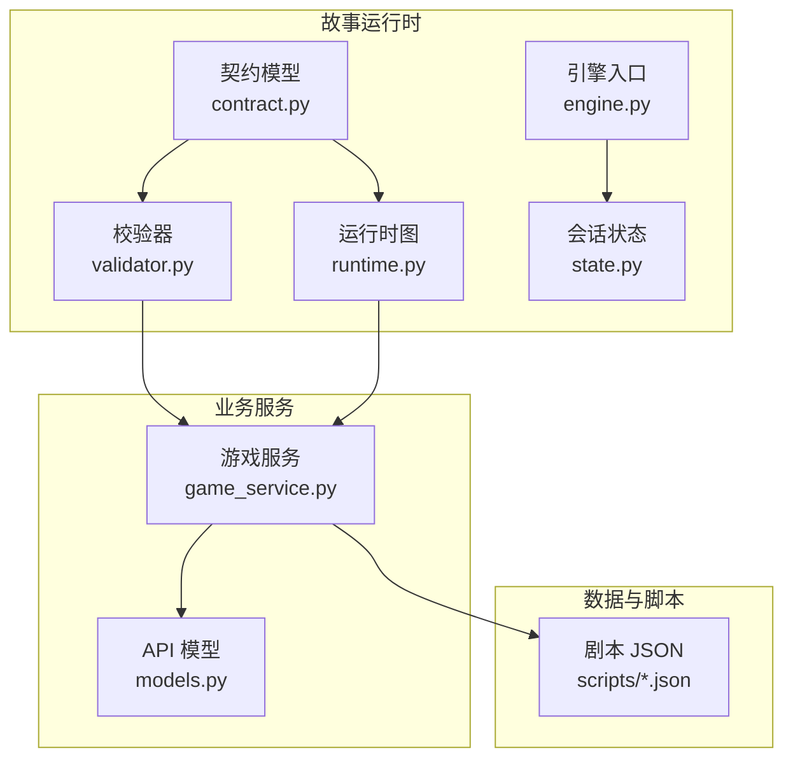
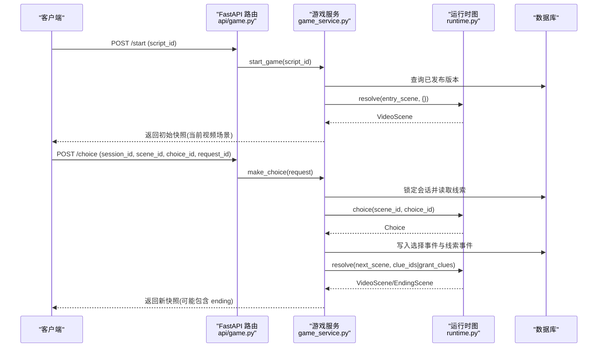
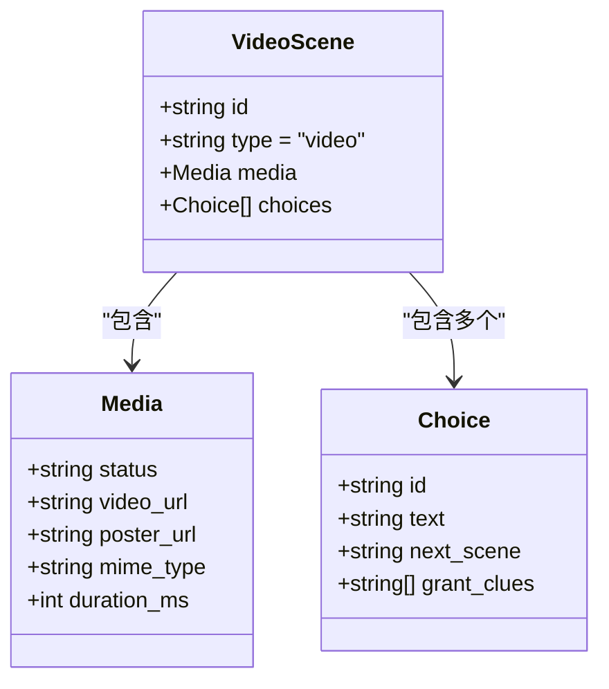
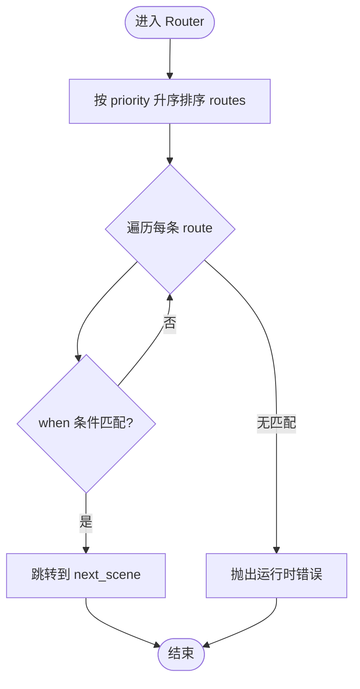
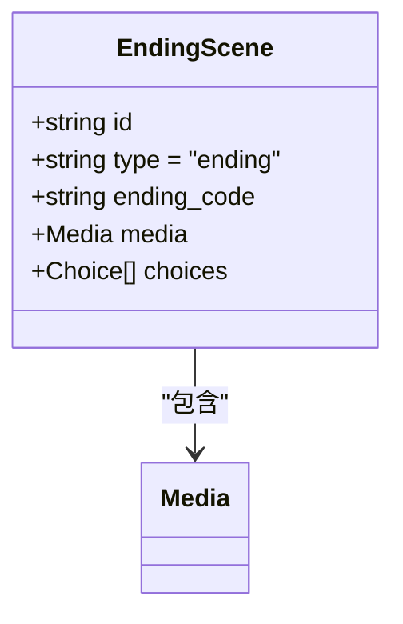
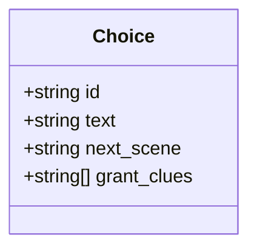
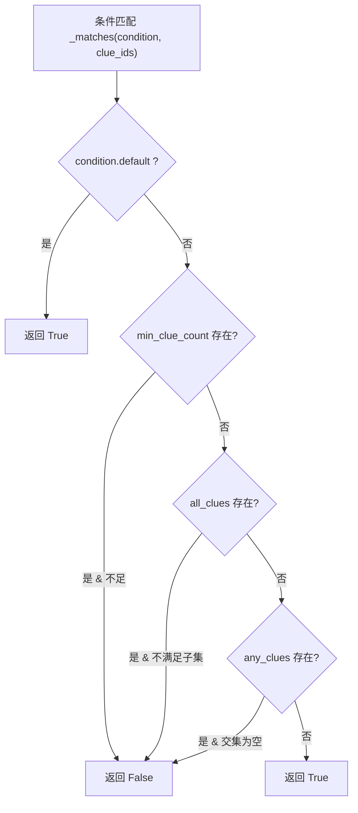
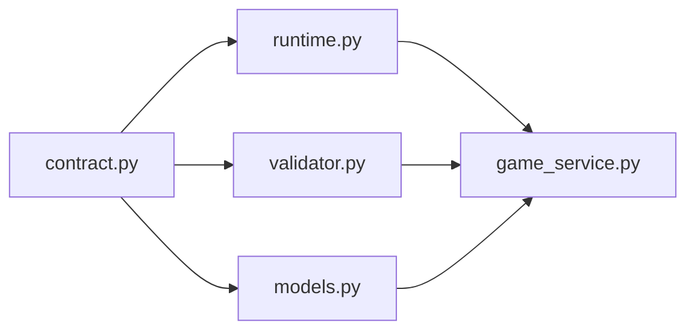

# 场景类型详解

<cite>
**本文引用的文件**   
- [contract.py](file://backend/app/story/contract.py)
- [runtime.py](file://backend/app/story/runtime.py)
- [validator.py](file://backend/app/story/validator.py)
- [engine.py](file://backend/app/story/engine.py)
- [state.py](file://backend/app/story/state.py)
- [clue_manager.py](file://backend/app/story/clue_manager.py)
- [ending_calculator.py](file://backend/app/story/ending_calculator.py)
- [game_service.py](file://backend/app/game_service.py)
- [models.py](file://backend/app/models.py)
- [macau_mystery_demo.json](file://backend/app/story/scripts/macau_mystery_demo.json)
- [macau_mystery_01.json](file://backend/app/story/scripts/macau_mystery_01.json)
</cite>

## 目录
1. [简介](#简介)
2. [项目结构](#项目结构)
3. [核心组件](#核心组件)
4. [架构总览](#架构总览)
5. [详细组件分析](#详细组件分析)
6. [依赖关系分析](#依赖关系分析)
7. [性能考量](#性能考量)
8. [故障排查指南](#故障排查指南)
9. [结论](#结论)
10. [附录：完整示例与最佳实践](#附录完整示例与最佳实践)

## 简介
本技术文档聚焦澳秘 Macau Mystery 的“场景类型”体系，围绕三类核心场景展开：video、router、ending。重点解释：
- video 场景的 media 对象字段：status、video_url、poster_url、mime_type、duration_ms
- router 场景的 routes 数组：priority、when（含 all_clues、any_clues、min_clue_count、default）与 next_scene
- ending 场景的 ending_code 标识与多结局支持
- choices 选择项结构：id、text、next_scene、grant_clues
- 条件判断语法与使用方式
- 提供完整示例与最佳实践，帮助读者快速掌握并正确实现剧情编排

## 项目结构
故事运行时由“契约模型 + 运行时图 + 校验器 + 服务层”组成：
- 契约模型定义场景、媒体、选择、路由等数据结构
- 运行时图负责解析场景跳转、条件匹配、预览下一场景
- 校验器对剧本进行结构与语义检查
- 服务层封装事务性游戏推进、状态快照、线索发放与幂等重放

图表来源
- [contract.py:1-128](file://backend/app/story/contract.py#L1-L128)
- [runtime.py:1-80](file://backend/app/story/runtime.py#L1-L80)
- [validator.py:1-251](file://backend/app/story/validator.py#L1-L251)
- [engine.py:1-37](file://backend/app/story/engine.py#L1-L37)
- [state.py:1-54](file://backend/app/story/state.py#L1-L54)
- [game_service.py:1-386](file://backend/app/game_service.py#L1-L386)
- [models.py:1-146](file://backend/app/models.py#L1-L146)
- [macau_mystery_demo.json:1-149](file://backend/app/story/scripts/macau_mystery_demo.json#L1-L149)
- [macau_mystery_01.json:1-142](file://backend/app/story/scripts/macau_mystery_01.json#L1-L142)

章节来源
- [contract.py:1-128](file://backend/app/story/contract.py#L1-L128)
- [runtime.py:1-80](file://backend/app/story/runtime.py#L1-L80)
- [validator.py:1-251](file://backend/app/story/validator.py#L1-L251)
- [engine.py:1-37](file://backend/app/story/engine.py#L1-L37)
- [state.py:1-54](file://backend/app/story/state.py#L1-L54)
- [game_service.py:1-386](file://backend/app/game_service.py#L1-L386)
- [models.py:1-146](file://backend/app/models.py#L1-L146)
- [macau_mystery_demo.json:1-149](file://backend/app/story/scripts/macau_mystery_demo.json#L1-L149)
- [macau_mystery_01.json:1-142](file://backend/app/story/scripts/macau_mystery_01.json#L1-L142)

## 核心组件
- 契约模型（contract.py）：严格定义 Scene、Media、Choice、RouteCondition、Route、VideoScene、RouterScene、EndingScene、Chapter、StoryDocument 等结构，确保 JSON 剧本的强类型约束与合法性校验。
- 运行时图（runtime.py）：构建场景有向图，支持按线索集合解析可玩场景（resolve）、选择验证（choice）、选择预览（preview_choice），以及路由条件匹配（_matches）。
- 校验器（validator.py）：对剧本进行结构性与语义性校验，包括重复 ID、缺失目标、可达性、默认路由唯一性与优先级、循环检测等。
- 引擎（engine.py）：加载本地脚本、创建会话、处理选择与获取状态（轻量版，用于演示或离线运行）。
- 会话状态（state.py）：维护会话基础信息、当前章节/场景索引、线索与选择历史（旧式简单实现）。
- 线索管理（clue_manager.py）：添加线索与基于条件的结局判定（兼容旧格式 endings）。
- 结局计算（ending_calculator.py）：根据 clues 数量与 condition 字符串计算最终结局。
- 游戏服务（game_service.py）：事务性推进、幂等重放、媒体就绪检查、场景响应组装、线索发放与事件记录。
- API 模型（models.py）：对外暴露的请求/响应结构，如 GameMediaResponse、GameChoiceResponse、GameSceneResponse、GameSnapshot 等。

章节来源
- [contract.py:1-128](file://backend/app/story/contract.py#L1-L128)
- [runtime.py:1-80](file://backend/app/story/runtime.py#L1-L80)
- [validator.py:1-251](file://backend/app/story/validator.py#L1-L251)
- [engine.py:1-37](file://backend/app/story/engine.py#L1-L37)
- [state.py:1-54](file://backend/app/story/state.py#L1-L54)
- [clue_manager.py:1-14](file://backend/app/story/clue_manager.py#L1-L14)
- [ending_calculator.py:1-14](file://backend/app/story/ending_calculator.py#L1-L14)
- [game_service.py:1-386](file://backend/app/game_service.py#L1-L386)
- [models.py:1-146](file://backend/app/models.py#L1-L146)

## 架构总览
下图展示从客户端到后端的核心调用链与数据流，突出场景类型在运行时中的流转。

图表来源
- [api/game.py:1-37](file://backend/app/api/game.py#L1-L37)
- [game_service.py:1-386](file://backend/app/game_service.py#L1-L386)
- [runtime.py:1-80](file://backend/app/story/runtime.py#L1-L80)

## 详细组件分析

### video 场景与 media 对象
- 结构要点
  - type: "video"
  - media: Media 对象，包含 status、video_url、poster_url、mime_type、duration_ms
  - choices: Choice 列表，每个选项包含 id、text、next_scene、grant_clues
- media 字段说明
  - status: 媒体状态，placeholder 表示占位，ready 表示可用；生产环境要求 ready
  - video_url: 视频地址，必须为绝对 HTTP(S) URL
  - poster_url: 封面图地址，必须为绝对 HTTP(S) URL
  - mime_type: MIME 类型，如 video/mp4
  - duration_ms: 时长（毫秒），可选
- 校验规则
  - URL 必须为 http/https 且带 netloc
  - 生产环境不允许 placeholder 媒体
- 运行时行为
  - 选择后 grant_clues 会合并进当前会话的线索集合
  - preview_choice 会预解析 next_scene 及其媒体，便于前端预加载

图表来源
- [contract.py:25-46](file://backend/app/story/contract.py#L25-L46)
- [contract.py:76-81](file://backend/app/story/contract.py#L76-L81)
- [models.py:16-32](file://backend/app/models.py#L16-L32)

章节来源
- [contract.py:25-46](file://backend/app/story/contract.py#L25-L46)
- [contract.py:76-81](file://backend/app/story/contract.py#L76-L81)
- [models.py:16-32](file://backend/app/models.py#L16-L32)
- [game_service.py:283-324](file://backend/app/game_service.py#L283-L324)

### router 场景与 routes 数组
- 结构要点
  - type: "router"
  - routes: Route 列表，至少一条
  - Route 包含 priority、when、next_scene
- when 条件判断
  - default: true 表示兜底规则，必须唯一且优先级最高
  - min_clue_count: 要求当前线索数不少于该值
  - all_clues: 要求全部具备这些线索
  - any_clues: 要求具备其中任意一个或多个线索
- 优先级与匹配
  - 按 priority 升序排序匹配，命中即跳转 next_scene
  - 若没有匹配路由将抛出运行时错误
- 校验规则
  - priority 必须唯一
  - 默认规则必须存在且优先级最大
  - all_clues/any_clues 中引用的线索必须在 clues 中定义

图表来源
- [contract.py:48-74](file://backend/app/story/contract.py#L48-L74)
- [runtime.py:63-79](file://backend/app/story/runtime.py#L63-L79)
- [validator.py:108-143](file://backend/app/story/validator.py#L108-L143)

章节来源
- [contract.py:48-74](file://backend/app/story/contract.py#L48-L74)
- [runtime.py:63-79](file://backend/app/story/runtime.py#L63-L79)
- [validator.py:108-143](file://backend/app/story/validator.py#L108-L143)

### ending 场景与 ending_code
- 结构要点
  - type: "ending"
  - ending_code: 结局代码标识（Identifier）
  - media: 同 video 的 Media 对象
  - choices: 必须为空
- 多结局支持
  - 通过不同 router 分支或条件组合到达不同 ending 场景
  - 也可结合旧式 endings 配置（见 macau_mystery_01.json）按线索数量决定结局文本
- 校验规则
  - choices 必须为空
  - 入口场景不能是 ending

图表来源
- [contract.py:83-95](file://backend/app/story/contract.py#L83-L95)
- [macau_mystery_demo.json:112-137](file://backend/app/story/scripts/macau_mystery_demo.json#L112-L137)

章节来源
- [contract.py:83-95](file://backend/app/story/contract.py#L83-L95)
- [macau_mystery_demo.json:112-137](file://backend/app/story/scripts/macau_mystery_demo.json#L112-L137)

### choices 选择项结构
- 字段说明
  - id: 唯一标识（Identifier）
  - text: 显示文本
  - next_scene: 跳转的目标场景 ID
  - grant_clues: 授予的线索 ID 列表（可为空）
- 运行时行为
  - 选择被记录为事件，grant_clues 去重后加入会话线索集合
  - 预览时可将 grant_clues 合并入线索集以解析下一场景

图表来源
- [contract.py:41-46](file://backend/app/story/contract.py#L41-L46)
- [game_service.py:139-161](file://backend/app/game_service.py#L139-L161)

章节来源
- [contract.py:41-46](file://backend/app/story/contract.py#L41-L46)
- [game_service.py:139-161](file://backend/app/game_service.py#L139-L161)

### 条件判断语法与使用
- all_clues: 要求玩家已收集全部指定线索
- any_clues: 要求玩家已收集至少一个指定线索
- min_clue_count: 要求当前线索总数不少于该值
- default: 兜底规则，必须唯一且优先级最高
- 匹配顺序：按 priority 升序，首个匹配生效

图表来源
- [runtime.py:63-73](file://backend/app/story/runtime.py#L63-L73)

章节来源
- [runtime.py:63-73](file://backend/app/story/runtime.py#L63-L73)

## 依赖关系分析
- contract.py 为所有场景类型的权威定义，被 runtime、validator、service、models 共同依赖
- runtime.py 依赖 contract 提供的类型，提供图解析与条件匹配
- validator.py 依赖 contract，进行结构/语义校验，输出错误与警告
- game_service.py 整合 contract、runtime、validator，完成事务性推进与响应组装
- models.py 定义对外 API 的数据结构，供 FastAPI 路由使用

图表来源
- [contract.py:1-128](file://backend/app/story/contract.py#L1-L128)
- [runtime.py:1-80](file://backend/app/story/runtime.py#L1-L80)
- [validator.py:1-251](file://backend/app/story/validator.py#L1-L251)
- [game_service.py:1-386](file://backend/app/game_service.py#L1-L386)
- [models.py:1-146](file://backend/app/models.py#L1-L146)

章节来源
- [contract.py:1-128](file://backend/app/story/contract.py#L1-L128)
- [runtime.py:1-80](file://backend/app/story/runtime.py#L1-L80)
- [validator.py:1-251](file://backend/app/story/validator.py#L1-L251)
- [game_service.py:1-386](file://backend/app/game_service.py#L1-L386)
- [models.py:1-146](file://backend/app/models.py#L1-L146)

## 性能考量
- 路由解析限制：max_router_hops=32，防止路由器链过长导致栈溢出或死循环
- 预览机制：preview_choice 提前解析下一场景与媒体，减少前端等待时间
- 幂等重放：通过 request_id 避免重复提交导致的副作用，提升并发安全性
- 媒体就绪检查：生产环境强制 media.status="ready"，避免播放失败
- 数据库事务：选择与线索发放在同一事务内，保证一致性

[本节为通用指导，无需特定文件引用]

## 故障排查指南
- 未知场景跳转：运行时抛出 StoryRuntimeError，检查 next_scene 是否存在
- 路由器循环：校验器与运行时均会检测循环，调整路由目标或优先级
- 缺少默认路由：校验器报错，确保仅有一条 default:true 且优先级最大
- 媒体未就绪：生产环境报 503，需将 media.status 改为 ready
- 选择不可用：确认 choice_id 属于当前场景且未被禁用
- 会话状态异常：检查 session_id、scene_id 是否一致，避免过期场景提交

章节来源
- [runtime.py:37-48](file://backend/app/story/runtime.py#L37-L48)
- [validator.py:108-143](file://backend/app/story/validator.py#L108-L143)
- [game_service.py:227-234](file://backend/app/game_service.py#L227-L234)
- [game_service.py:115-122](file://backend/app/game_service.py#L115-L122)

## 结论
Macau Mystery 的场景系统以严格的契约模型为基础，配合运行时图与校验器，实现了可扩展、可验证、可回放的交互式叙事框架。video、router、ending 三类场景各司其职：video 承载媒体与选择，router 依据线索与优先级动态跳转，ending 标记结局并携带结局代码。通过合理的条件设计与最佳实践，可以构建复杂而稳定的多分支剧情体验。

[本节为总结，无需特定文件引用]

## 附录：完整示例与最佳实践

### 示例一：最小化演示（macau_mystery_demo.json）
- 包含 video 分支与汇合、router 条件跳转、两个 ending 场景
- 关键路径：scene_start -> scene_letter 或 scene_direct -> scene_merge -> final_router -> ending_good/bad
- 线索：letter_fragment 用于 all_clues 条件

章节来源
- [macau_mystery_demo.json:1-149](file://backend/app/story/scripts/macau_mystery_demo.json#L1-L149)

### 示例二：旧式对话驱动（macau_mystery_01.json）
- 使用 narration/dialogue/choices 的传统结构，非 v1 契约
- 通过 clues 与 endings 配置，按线索数量决定结局文本
- 适合早期版本或过渡期使用

章节来源
- [macau_mystery_01.json:1-142](file://backend/app/story/scripts/macau_mystery_01.json#L1-L142)

### 最佳实践清单
- 始终为 video 场景提供有效的 media 对象，并确保 production 环境下 status="ready"
- 合理设计 router 的优先级与条件，确保 default 唯一且优先级最高
- 使用 grant_clues 精准控制线索授予，避免重复与冗余
- 利用 preview_choice 进行前端预加载，提升用户体验
- 保持场景 ID 唯一，避免重复与悬空引用
- 通过校验器输出定位问题，优先修复 DUPLICATE_*、MISSING_*、INVALID_* 类错误

[本节为通用指导，无需特定文件引用]