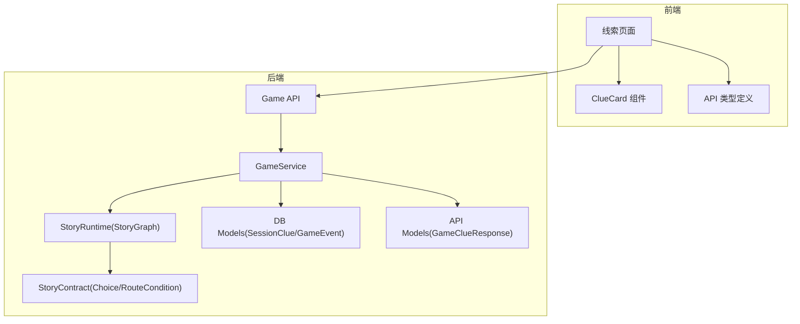
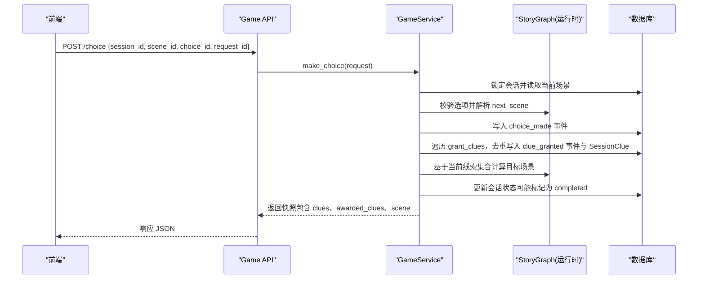
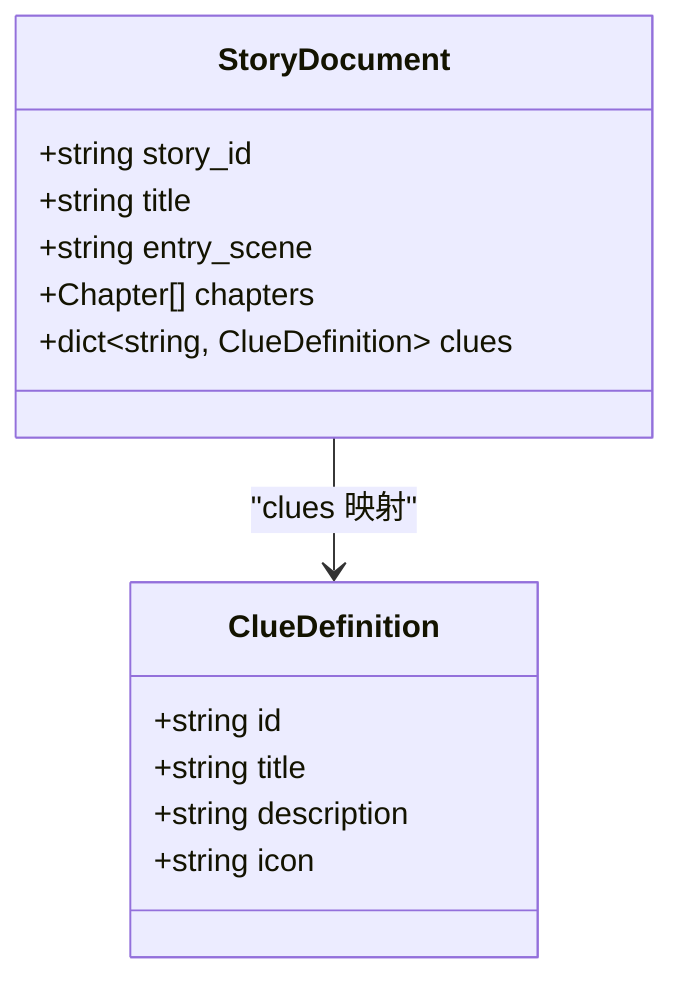
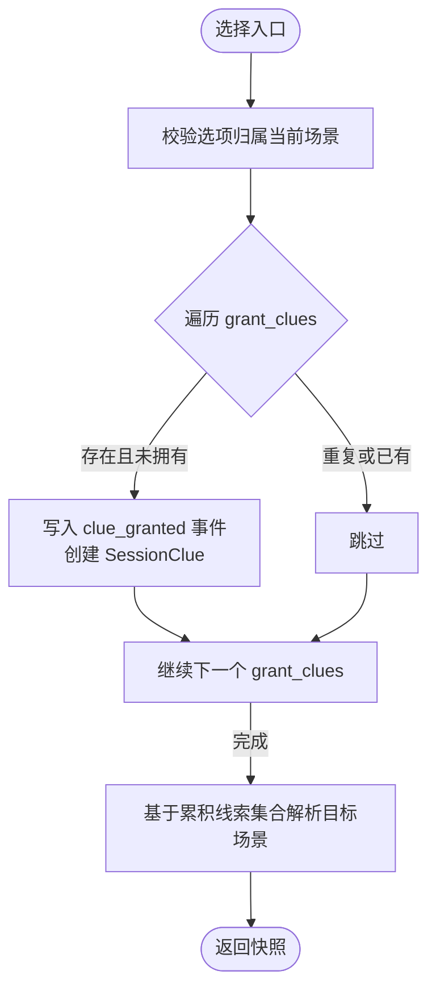
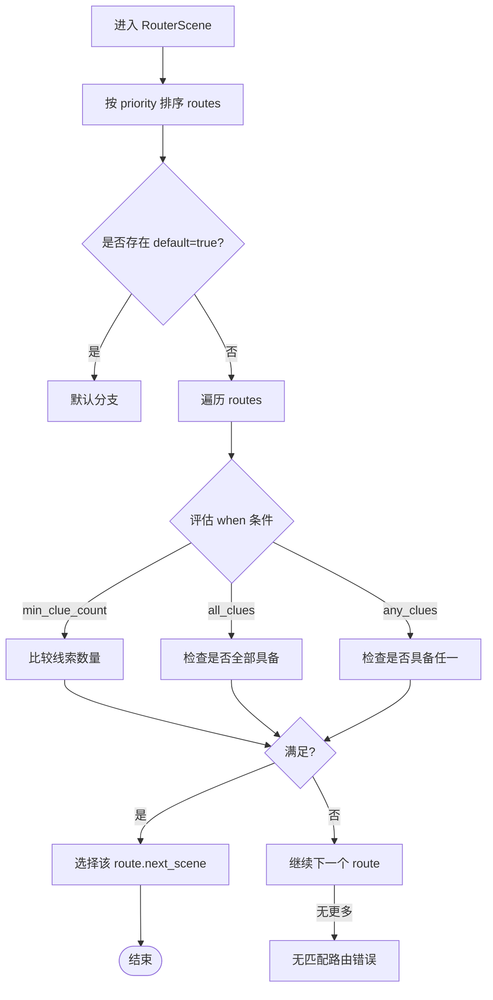
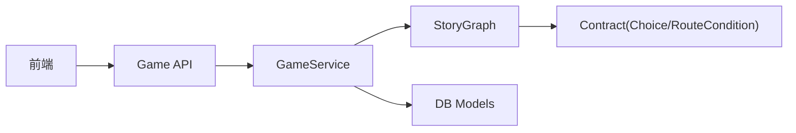

# 线索系统

<cite>
**本文引用的文件**   
- [clue_manager.py](file://backend/app/story/clue_manager.py)
- [contract.py](file://backend/app/story/contract.py)
- [runtime.py](file://backend/app/story/runtime.py)
- [state.py](file://backend/app/story/state.py)
- [engine.py](file://backend/app/story/engine.py)
- [game_service.py](file://backend/app/game_service.py)
- [models.py](file://backend/app/models.py)
- [db_models.py](file://backend/app/db_models.py)
- [macau_mystery_01.json](file://backend/app/story/scripts/macau_mystery_01.json)
- [macau_mystery_demo.json](file://backend/app/story/scripts/macau_mystery_demo.json)
- [clue-card.tsx](file://frontend/src/components/clue-card.tsx)
- [clues/page.tsx](file://frontend/src/app/game/clues/page.tsx)
- [api.ts](file://frontend/src/lib/api.ts)
- [game.py](file://backend/app/api/game.py)
</cite>

## 目录
1. [简介](#简介)
2. [项目结构](#项目结构)
3. [核心组件](#核心组件)
4. [架构总览](#架构总览)
5. [详细组件分析](#详细组件分析)
6. [依赖关系分析](#依赖关系分析)
7. [性能与可扩展性](#性能与可扩展性)
8. [故障排查指南](#故障排查指南)
9. [结论](#结论)
10. [附录：最佳实践与示例](#附录最佳实践与示例)

## 简介
本技术文档聚焦澳秘 Macau Mystery 的“线索系统”，系统性阐述 clus 对象的数据结构、grant_clues 机制、线索与剧情分支的关系、状态管理与持久化存储、查询接口，以及设计最佳实践与使用示例。读者无需深入代码即可理解线索在故事运行时的作用与实现方式。

## 项目结构
- 后端（Python/FastAPI）
  - 剧本契约与运行时：story/contract.py、story/runtime.py
  - 游戏服务与事务：app/game_service.py、app/api/game.py
  - 数据模型与持久化：app/db_models.py、app/models.py
  - 旧版轻量引擎与状态（兼容参考）：story/engine.py、story/state.py、story/clue_manager.py
  - 剧本示例：story/scripts/*.json
- 前端（Next.js/React）
  - 线索卡片组件：components/clue-card.tsx
  - 线索页面展示：app/game/clues/page.tsx
  - API 类型定义：lib/api.ts



**图表来源** 
- [game.py:1-37](file://backend/app/api/game.py#L1-L37)
- [game_service.py:1-386](file://backend/app/game_service.py#L1-L386)
- [runtime.py:1-80](file://backend/app/story/runtime.py#L1-L80)
- [contract.py:1-128](file://backend/app/story/contract.py#L1-L128)
- [db_models.py:93-144](file://backend/app/db_models.py#L93-L144)
- [models.py:54-92](file://backend/app/models.py#L54-L92)
- [clue-card.tsx:1-56](file://frontend/src/components/clue-card.tsx#L1-L56)
- [clues/page.tsx:1-67](file://frontend/src/app/game/clues/page.tsx#L1-L67)
- [api.ts:1-58](file://frontend/src/lib/api.ts#L1-L58)

**章节来源**
- [game.py:1-37](file://backend/app/api/game.py#L1-L37)
- [game_service.py:1-386](file://backend/app/game_service.py#L1-L386)
- [runtime.py:1-80](file://backend/app/story/runtime.py#L1-L80)
- [contract.py:1-128](file://backend/app/story/contract.py#L1-L128)
- [db_models.py:93-144](file://backend/app/db_models.py#L93-L144)
- [models.py:54-92](file://backend/app/models.py#L54-L92)
- [clue-card.tsx:1-56](file://frontend/src/components/clue-card.tsx#L1-L56)
- [clues/page.tsx:1-67](file://frontend/src/app/game/clues/page.tsx#L1-L67)
- [api.ts:1-58](file://frontend/src/lib/api.ts#L1-L58)

## 核心组件
- 线索定义（ClueDefinition）
  - 字段：id（标识符）、title（标题）、description（描述）、icon（图标）
  - 位置：story/contract.py
- 选项与线索授予（Choice.grant_clues）
  - 每个选项可声明一个或多个 grant_clues 标识符，选择后由运行时授予对应线索
  - 位置：story/contract.py
- 路由条件（RouteCondition）
  - 支持 min_clue_count、all_clues、any_clues、default 等条件，用于控制路由器场景跳转
  - 位置：story/contract.py
- 运行时图（StoryGraph）
  - 解析场景、计算下一场景、评估路由条件、预览选项结果（含线索累积）
  - 位置：story/runtime.py
- 会话与线索持久化（SessionClue、GameEvent）
  - SessionClue：记录某会话已获得的线索及获取时间
  - GameEvent：记录 choice_made、clue_granted 等事件，支持幂等与回放
  - 位置：app/db_models.py
- 游戏服务（GameService）
  - 统一处理开始游戏、选择、快照生成；在事务中写入事件与线索并返回客户端所需数据
  - 位置：app/game_service.py
- 前端展示（ClueCard、线索页）
  - 展示已收集/未收集线索，图标与描述来源于服务端返回
  - 位置：frontend/src/components/clue-card.tsx、frontend/src/app/game/clues/page.tsx

**章节来源**
- [contract.py:114-128](file://backend/app/story/contract.py#L114-L128)
- [contract.py:41-68](file://backend/app/story/contract.py#L41-L68)
- [runtime.py:22-80](file://backend/app/story/runtime.py#L22-L80)
- [db_models.py:115-126](file://backend/app/db_models.py#L115-L126)
- [db_models.py:93-113](file://backend/app/db_models.py#L93-L113)
- [game_service.py:139-193](file://backend/app/game_service.py#L139-L193)
- [clue-card.tsx:1-56](file://frontend/src/components/clue-card.tsx#L1-L56)
- [clues/page.tsx:1-67](file://frontend/src/app/game/clues/page.tsx#L1-L67)

## 架构总览
下图展示了从前端发起选择到后端授予线索、更新状态并返回快照的完整流程。



**图表来源** 
- [game.py:23-36](file://backend/app/api/game.py#L23-L36)
- [game_service.py:70-193](file://backend/app/game_service.py#L70-L193)
- [runtime.py:37-80](file://backend/app/story/runtime.py#L37-L80)
- [db_models.py:93-126](file://backend/app/db_models.py#L93-L126)

## 详细组件分析

### 数据结构：ClueDefinition 与 StoryDocument.clues
- ClueDefinition
  - id：唯一标识（Identifier），遵循小写开头+字母数字下划线规则
  - title：显示标题
  - description：详细描述
  - icon：图标字符串（可为空）
- StoryDocument.clues
  - 键为线索 id，值为 ClueDefinition 对象
  - 用于将运行时授予的线索 key 映射到前端展示的元数据



**图表来源** 
- [contract.py:114-128](file://backend/app/story/contract.py#L114-L128)

**章节来源**
- [contract.py:114-128](file://backend/app/story/contract.py#L114-L128)

### 选项与线索授予：Choice.grant_clues
- Choice 字段
  - id：选项标识
  - text：选项文本
  - next_scene：下一场景标识
  - grant_clues：授予的线索标识列表（可为空）
- 运行时行为
  - 选择后，按顺序对 grant_clues 进行去重授予，并记录事件与 SessionClue
  - 预览选项时，会模拟累积线索以计算预加载场景



**图表来源** 
- [contract.py:41-46](file://backend/app/story/contract.py#L41-L46)
- [game_service.py:139-166](file://backend/app/game_service.py#L139-L166)
- [runtime.py:59-62](file://backend/app/story/runtime.py#L59-L62)

**章节来源**
- [contract.py:41-46](file://backend/app/story/contract.py#L41-L46)
- [game_service.py:139-166](file://backend/app/game_service.py#L139-L166)
- [runtime.py:59-62](file://backend/app/story/runtime.py#L59-L62)

### 路由条件与剧情分支：RouteCondition
- 支持的判定条件
  - default：默认兜底分支
  - min_clue_count：要求当前线索数量不少于阈值
  - all_clues：要求同时拥有指定全部线索
  - any_clues：要求至少拥有指定线索之一
- 路由优先级
  - routes 按 priority 排序，匹配第一个满足条件的分支
- 运行时解析
  - StoryGraph._matches 负责条件评估；RouterScene 通过 _route 选择 next_scene



**图表来源** 
- [contract.py:48-68](file://backend/app/story/contract.py#L48-L68)
- [runtime.py:64-79](file://backend/app/story/runtime.py#L64-L79)

**章节来源**
- [contract.py:48-68](file://backend/app/story/contract.py#L48-L68)
- [runtime.py:64-79](file://backend/app/story/runtime.py#L64-L79)

### 状态管理、持久化与查询
- 会话状态
  - GameSession：记录当前场景、状态（active/completed）、结尾场景等
- 事件与幂等
  - GameEvent：记录 choice_made、clue_granted、game_completed 等事件，支持 request_id 幂等
- 线索持久化
  - SessionClue：主键为 (session_id, clue_key)，记录 acquired_at 与 source_event_id
- 查询接口
  - GET /state/{session_id}：返回当前快照，包含 clues 列表与 awarded_clues（本次新增）
  - 前端通过 models.py 定义的 GameClueResponse 渲染线索卡片

```mermaid
erDiagram
GAME_SESSIONS ||--o{ GAME_EVENTS : "1:N"
GAME_SESSIONS ||--o{ SESSION_CLUES : "1:N"
GAME_EVENTS ||--|| SESSION_CLUES : "可选关联(source_event_id)"
GAME_SESSIONS {
string id PK
string story_version_id FK
string current_scene_key
string status
string ending_scene_key
datetime started_at
datetime last_active_at
datetime completed_at
}
GAME_EVENTS {
int id PK
string session_id FK
int sequence_number
string event_type
string scene_key
string choice_key
string next_scene_key
string request_id
json payload_json
datetime created_at
}
SESSION_CLUES {
string session_id FK PK
string clue_key PK
int source_event_id FK
datetime acquired_at
}
```

**图表来源** 
- [db_models.py:74-126](file://backend/app/db_models.py#L74-L126)

**章节来源**
- [db_models.py:74-126](file://backend/app/db_models.py#L74-L126)
- [game_service.py:235-281](file://backend/app/game_service.py#L235-L281)
- [models.py:54-92](file://backend/app/models.py#L54-L92)

### 旧版轻量引擎与状态（兼容参考）
- engine.py/state.py：提供简单的内存态会话与 process_choice 逻辑，其中 clue_reward 字段用于奖励单条线索
- clue_manager.py：提供 add_clue 与 check_ending_condition 工具函数（适用于早期脚本格式）
- 说明：新版采用 contract/runtime/service 体系，上述文件可作为历史参考

**章节来源**
- [engine.py:1-37](file://backend/app/story/engine.py#L1-L37)
- [state.py:1-54](file://backend/app/story/state.py#L1-L54)
- [clue_manager.py:1-14](file://backend/app/story/clue_manager.py#L1-L14)

### 前端线索展示
- ClueCard：根据 collected 状态显示图标、标题、描述与地点标签；未收集时显示锁图标与占位文案
- 线索页：汇总已收集与未收集线索，便于玩家回顾进度

**章节来源**
- [clue-card.tsx:1-56](file://frontend/src/components/clue-card.tsx#L1-L56)
- [clues/page.tsx:1-67](file://frontend/src/app/game/clues/page.tsx#L1-L67)

## 依赖关系分析
- 前端依赖后端 API 返回的 GameSnapshot，其中 clues 与 awarded_clues 驱动 UI 展示
- GameService 依赖 StoryGraph 与数据库模型，确保选择、线索授予与状态更新的原子性
- StoryGraph 依赖 contract 定义的 Choice、RouteCondition 等结构，保证运行时一致性



**图表来源** 
- [game.py:1-37](file://backend/app/api/game.py#L1-L37)
- [game_service.py:1-386](file://backend/app/game_service.py#L1-L386)
- [runtime.py:1-80](file://backend/app/story/runtime.py#L1-L80)
- [contract.py:1-128](file://backend/app/story/contract.py#L1-L128)
- [db_models.py:93-144](file://backend/app/db_models.py#L93-L144)

**章节来源**
- [game.py:1-37](file://backend/app/api/game.py#L1-L37)
- [game_service.py:1-386](file://backend/app/game_service.py#L1-L386)
- [runtime.py:1-80](file://backend/app/story/runtime.py#L1-L80)
- [contract.py:1-128](file://backend/app/story/contract.py#L1-L128)
- [db_models.py:93-144](file://backend/app/db_models.py#L93-L144)

## 性能与可扩展性
- 幂等与回放
  - 通过 request_id 避免重复提交导致重复授予线索；若冲突则返回幂等冲突错误
- 事务与并发
  - 选择处理在事务内执行，PostgreSQL 使用 SELECT FOR UPDATE 锁定会话，SQLite 使用 BEGIN IMMEDIATE
- 媒体就绪检查
  - 生产环境强制 media.status=ready，防止未就绪资源影响体验
- 可扩展点
  - RouteCondition 可扩展新的条件类型（如特定线索组合权重）
  - SessionClue 可附加扩展字段（来源场景、触发选项等）

[本节为通用指导，不直接分析具体文件]

## 故障排查指南
- 常见错误
  - 会话不存在：GET/POST 操作报 404
  - 会话已结束/不可继续：状态非 active 时报 409
  - 场景不匹配：提交的 scene_id 与当前不一致时报 409
  - 选项无效：choice_id 不属于当前场景时报 409
  - 故事数据损坏：运行时解析失败或媒体未就绪时报 500/503
- 定位方法
  - 查看 GameEvent 中的 choice_made/clue_granted 事件与 payload_json
  - 检查 SessionClue 是否重复授予（应去重）
  - 核对 StoryVersion.content_json 与 contract 校验结果

**章节来源**
- [game_service.py:84-193](file://backend/app/game_service.py#L84-L193)
- [game_service.py:227-234](file://backend/app/game_service.py#L227-L234)
- [db_models.py:93-126](file://backend/app/db_models.py#L93-L126)

## 结论
线索系统是连接“玩家选择”与“剧情走向”的关键纽带。通过 contract 严格约束、runtime 精确解析、service 事务保障与 db 持久化，系统在正确性、一致性与可观测性上达到工程级标准。前端以简洁的卡片组件呈现线索状态，提升用户体验。

[本节为总结性内容，不直接分析具体文件]

## 附录：最佳实践与示例

### 线索命名规范
- 使用 Identifier 规范：小写字母开头，仅包含字母、数字与下划线，长度 2-64
- 建议语义化命名，如 letter_fragment、stone_inscription
- 发布后不修改已发布版本的线索 id，需变更则发布新版本

**章节来源**
- [contract.py:10-13](file://backend/app/story/contract.py#L10-L13)

### 分类组织
- 将线索按主题分组（如“信件相关”、“地点刻字”、“人物证词”），便于策划与前端展示
- 在 clues 字典中保持 id 与定义一一对应，避免遗漏

**章节来源**
- [contract.py:114-128](file://backend/app/story/contract.py#L114-L128)

### 用户体验优化
- 未收集线索显示锁图标与提示文案，收集后显示图标、标题、描述与地点标签
- 在关键节点给予即时反馈（awarded_clues），增强成就感

**章节来源**
- [clue-card.tsx:1-56](file://frontend/src/components/clue-card.tsx#L1-L56)
- [models.py:54-92](file://backend/app/models.py#L54-L92)

### 完整使用示例与常见模式
- 示例一：视频场景中选择“检查旧信”，grant_clues 授予 letter_fragment，随后路由条件 all_clues 决定结局
  - 参考：macau_mystery_demo.json 的 scene_start 与 final_router
- 示例二：旧版脚本中使用 clue_reward 授予单条线索，配合 photo_triggers 触发线索
  - 参考：macau_mystery_01.json 的 choices 与 photo_triggers
- 常见模式
  - 多路径汇合：不同选择授予不同线索，最终在 router 处依据线索集合汇聚到同一场景
  - 条件门槛：min_clue_count 设置最低线索数，确保玩家探索充分
  - 分支解锁：all_clues/any_clues 控制剧情解锁，形成差异化体验

**章节来源**
- [macau_mystery_demo.json:1-149](file://backend/app/story/scripts/macau_mystery_demo.json#L1-L149)
- [macau_mystery_01.json:1-142](file://backend/app/story/scripts/macau_mystery_01.json#L1-L142)