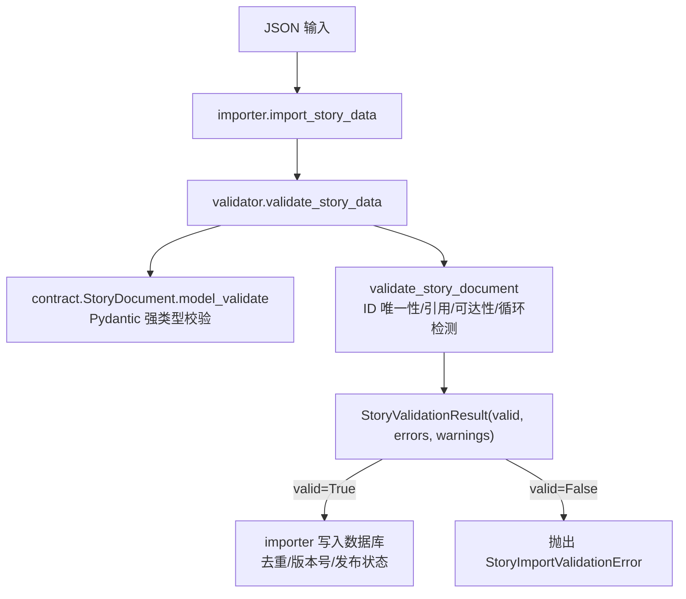
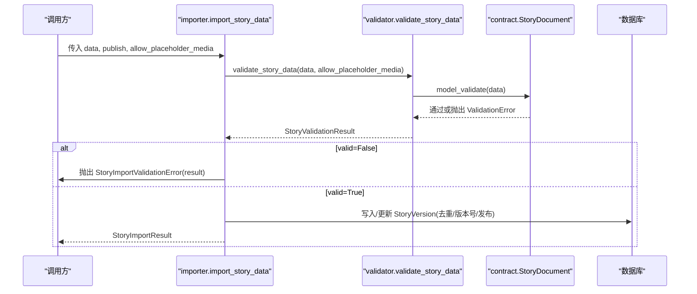
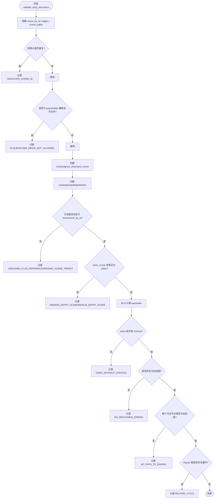
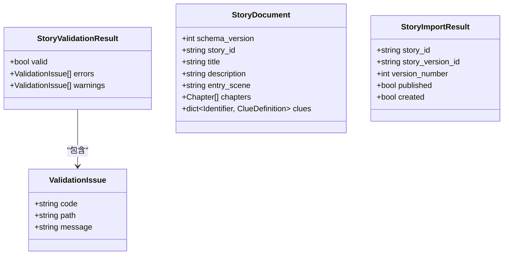
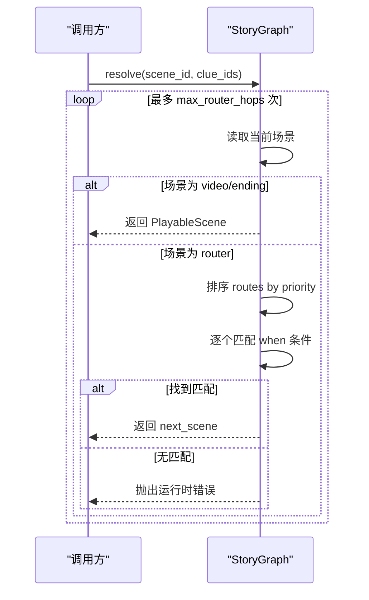
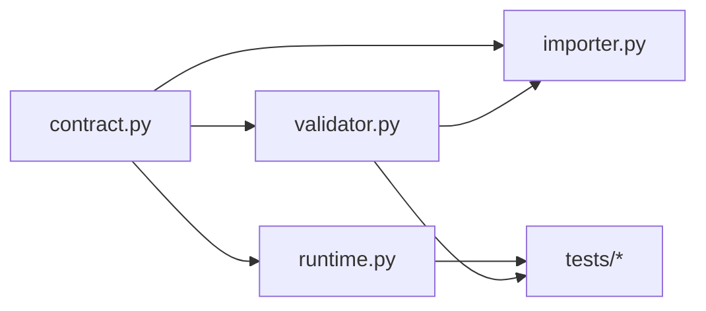

# 验证规则

<cite>
**本文引用的文件**   
- [backend/app/story/validator.py](file://backend/app/story/validator.py)
- [backend/app/story/contract.py](file://backend/app/story/contract.py)
- [backend/app/story/importer.py](file://backend/app/story/importer.py)
- [backend/app/story/runtime.py](file://backend/app/story/runtime.py)
- [backend/app/story/script_loader.py](file://backend/app/story/script_loader.py)
- [backend/tests/test_story_importer.py](file://backend/tests/test_story_importer.py)
- [backend/tests/test_story_runtime.py](file://backend/tests/test_story_runtime.py)
- [backend/app/story/scripts/macau_mystery_demo.json](file://backend/app/story/scripts/macau_mystery_demo.json)
</cite>

## 目录
1. [简介](#简介)
2. [项目结构](#项目结构)
3. [核心组件](#核心组件)
4. [架构总览](#架构总览)
5. [详细组件分析](#详细组件分析)
6. [依赖关系分析](#依赖关系分析)
7. [性能考量](#性能考量)
8. [故障排查指南](#故障排查指南)
9. [结论](#结论)
10. [附录](#附录)

## 简介
本技术文档聚焦澳秘 Macau Mystery 的剧本验证规则，围绕 validator.py 中的验证逻辑展开，系统阐述 JSON 结构校验、字段类型与必填项检查、场景 ID 唯一性、引用完整性、循环依赖检测、媒体 URL 格式、GPS 坐标范围与时长限制、条件语句语法、路由优先级冲突、结局代码唯一性等。同时给出扩展自定义验证规则的方法、错误消息定制策略、完整验证流程、错误处理策略与调试工具使用指南，帮助开发者快速定位问题并安全地扩展验证能力。

## 项目结构
与验证相关的关键模块与文件：
- contract.py：定义严格的 Pydantic 数据模型（Schema），负责基础字段类型、必填项、格式与约束校验。
- validator.py：对已解析的 StoryDocument 进行结构与语义级验证（ID 唯一性、引用完整性、可达性与循环检测等）。
- importer.py：导入入口，调用 validate_story_data 完成校验后持久化版本。
- runtime.py：运行时图解析器，用于在已知合法的前提下进行路由选择与预览。
- script_loader.py：轻量脚本加载与基础校验（非 v1 合同）。
- tests/*：覆盖导入行为与运行时/验证行为的测试用例。
- scripts/*.json：示例剧本，便于理解与复现实验。

图表来源
- [backend/app/story/importer.py:59-135](file://backend/app/story/importer.py#L59-L135)
- [backend/app/story/validator.py:40-190](file://backend/app/story/validator.py#L40-L190)
- [backend/app/story/contract.py:120-128](file://backend/app/story/contract.py#L120-L128)

章节来源
- [backend/app/story/importer.py:1-161](file://backend/app/story/importer.py#L1-L161)
- [backend/app/story/validator.py:1-251](file://backend/app/story/validator.py#L1-L251)
- [backend/app/story/contract.py:1-128](file://backend/app/story/contract.py#L1-L128)

## 核心组件
- 数据契约（contract.py）
  - Identifier：标识符正则与长度约束。
  - Media：视频/海报 URL 必须为绝对 HTTP(S)；mime_type 非空；duration_ms 可选但必须为正数。
  - RouteCondition：default、min_clue_count、all_clues、any_clues 的组合约束与合法性检查。
  - Scene 联合类型：VideoScene、EndingScene、RouterScene，通过 discriminator 区分。
  - StoryDocument：顶层结构，包含 schema_version、story_id、title、entry_scene、chapters、clues 等。
- 验证器（validator.py）
  - validate_story_data：先走 Pydantic 强类型校验，再进入语义验证。
  - validate_story_document：遍历章节与场景，执行 ID 唯一性、引用完整性、可达性、循环检测、入口与结局约束等。
  - 辅助函数：_reachable、_nodes_with_path_to_ending、_router_cycle_issues。
- 导入器（importer.py）
  - import_story_data：调用 validate_story_data，失败抛出自定义异常；成功则计算内容哈希、去重、创建或更新版本。
- 运行时（runtime.py）
  - StoryGraph：基于已验证文档进行路由选择、预览与条件匹配，提供 preview_choice 与 resolve。

章节来源
- [backend/app/story/contract.py:10-128](file://backend/app/story/contract.py#L10-L128)
- [backend/app/story/validator.py:12-190](file://backend/app/story/validator.py#L12-L190)
- [backend/app/story/importer.py:23-135](file://backend/app/story/importer.py#L23-L135)
- [backend/app/story/runtime.py:22-80](file://backend/app/story/runtime.py#L22-L80)

## 架构总览
验证与导入的整体流程如下：

图表来源
- [backend/app/story/importer.py:59-135](file://backend/app/story/importer.py#L59-L135)
- [backend/app/story/validator.py:40-51](file://backend/app/story/validator.py#L40-L51)
- [backend/app/story/contract.py:120-128](file://backend/app/story/contract.py#L120-L128)

## 详细组件分析

### 数据结构与字段校验（contract.py）
- Identifier：限定小写字母开头，仅含字母、数字、下划线，长度 2-64。
- Media：
  - status：枚举 placeholder/ready。
  - video_url/poster_url：必须为绝对 HTTP(S) URL（scheme 为 http/https 且存在 netloc）。
  - mime_type：非空字符串。
  - duration_ms：可选，若存在必须大于 0。
- RouteCondition：
  - default：若为 true，不得与其他条件字段共存。
  - min_clue_count/all_clues/any_clues：至少存在一个非默认条件；all_clues/any_clues 若存在需非空且无重复。
- Scene：
  - VideoScene：必须有 choices 列表。
  - EndingScene：choices 必须为空；ending_code 为 Identifier。
  - RouterScene：routes 列表至少一条。
- StoryDocument：
  - schema_version 固定为 1。
  - chapters 至少一条；clues 为字典。

章节来源
- [backend/app/story/contract.py:10-128](file://backend/app/story/contract.py#L10-L128)

### 结构化与语义验证（validator.py）
- JSON 格式与类型校验：由 Pydantic 的 model_validate 完成，任何不匹配都会转换为 ValidationIssue 列表。
- 字段类型与必填项：由 contract 中 Field 与 Literal 约束保证。
- 场景 ID 唯一性：全局 scene_by_id 记录，重复即报错 DUPLICATE_SCENE_ID。
- 引用完整性：
  - choice.next_scene 与 route.next_scene 必须在 scene_by_id 中存在，否则报 MISSING_SCENE_TARGET。
  - grant_clues 与 route.when.all_clues/any_clues 中的线索 ID 必须在 document.clues 中定义，否则报 UNKNOWN_CLUE_REFERENCE。
- 入口场景约束：
  - entry_scene 必须存在且类型为 video，否则报 MISSING_ENTRY_SCENE 或 INVALID_ENTRY_SCENE。
- 可达性与死端：
  - 从 entry_scene 出发 BFS 计算 reachable。
  - 不可达场景发出 UNREACHABLE_SCENE 警告。
  - 可达的 video 节点若无 choices，报 VIDEO_WITHOUT_CHOICES。
- 结局可达性：
  - 计算可到达的 ending 集合，若为空报 NO_REACHABLE_ENDING。
  - 反向搜索能到达结局的节点，未覆盖的可达节点报 NO_PATH_TO_ENDING。
- 路由优先级与默认规则：
  - routes.priority 必须唯一，否则报 DUPLICATE_ROUTE_PRIORITY。
  - 必须且只能有一条 default 规则，否则报 INVALID_DEFAULT_ROUTE。
  - 默认规则的 priority 必须是最大值，否则报 DEFAULT_ROUTE_PRIORITY。
- 循环依赖检测：
  - 针对 RouterScene 链进行 DFS 检测，发现回路报 ROUTER_CYCLE。
- 占位媒体控制：
  - 当 allow_placeholder_media=False 时，media.status=placeholder 将被拒绝，报 PLACEHOLDER_MEDIA_NOT_ALLOWED。

图表来源
- [backend/app/story/validator.py:54-190](file://backend/app/story/validator.py#L54-L190)

章节来源
- [backend/app/story/validator.py:54-190](file://backend/app/story/validator.py#L54-L190)

### 媒体 URL 格式、GPS 坐标与时长限制
- 媒体 URL：
  - video_url/poster_url 必须为绝对 HTTP(S) URL（scheme 为 http/https 且存在 netloc）。
- GPS 坐标：
  - lat 范围 [-90, 90]，lng 范围 [-180, 180]。
- 时长限制：
  - duration_ms 若存在必须大于 0。

章节来源
- [backend/app/story/contract.py:20-38](file://backend/app/story/contract.py#L20-L38)
- [backend/app/story/contract.py:25-31](file://backend/app/story/contract.py#L25-L31)

### 条件语句语法验证与路由优先级冲突
- 条件语法：
  - default：必须为 true 且独占，不能与其他条件字段共存。
  - min_clue_count：最小线索数量，>=1。
  - all_clues/any_clues：非空且无重复。
- 路由优先级：
  - priority 必须唯一。
  - 默认规则必须存在且唯一，且其 priority 必须为最大值。

章节来源
- [backend/app/story/contract.py:48-67](file://backend/app/story/contract.py#L48-L67)
- [backend/app/story/validator.py:108-143](file://backend/app/story/validator.py#L108-L143)

### 结局代码唯一性与可达性
- 结局代码：
  - ending_code 为 Identifier，遵循统一标识规范。
- 可达性：
  - 入口必须可达至少一个结局，否则报 NO_REACHABLE_ENDING。
  - 所有可达节点必须存在通向结局的路径，否则报 NO_PATH_TO_ENDING。

章节来源
- [backend/app/story/contract.py:83-94](file://backend/app/story/contract.py#L83-L94)
- [backend/app/story/validator.py:174-186](file://backend/app/story/validator.py#L174-L186)

### 完整验证流程与错误处理策略
- 入口：importer.import_story_data 调用 validator.validate_story_data。
- 第一阶段：Pydantic 强类型校验（contract.py），失败返回结构化错误。
- 第二阶段：语义验证（validator.py），收集 errors/warnings。
- 结果处理：
  - valid=False：抛出 StoryImportValidationError，携带 result。
  - valid=True：计算内容哈希，去重与版本管理，写入数据库。

图表来源
- [backend/app/story/validator.py:12-22](file://backend/app/story/validator.py#L12-L22)
- [backend/app/story/contract.py:120-128](file://backend/app/story/contract.py#L120-L128)
- [backend/app/story/importer.py:29-44](file://backend/app/story/importer.py#L29-L44)

章节来源
- [backend/app/story/importer.py:59-135](file://backend/app/story/importer.py#L59-L135)
- [backend/app/story/validator.py:40-190](file://backend/app/story/validator.py#L40-L190)

### 运行时解析与预览（runtime.py）
- StoryGraph：
  - resolve(scene_id, clue_ids)：按优先级排序 routes，依次匹配 when 条件，返回下一个可玩场景（video/ending）。
  - preview_choice(scene_id, choice_id, clue_ids)：根据选择的 next_scene 与 grant_clues 预测最终落点。
  - _matches：支持 default、min_clue_count、all_clues、any_clues 组合语义。
- 保护机制：
  - 防止 router 循环：维护 seen_routers 并抛出运行时错误。
  - 最大跳转次数限制：超过阈值抛出错误。

图表来源
- [backend/app/story/runtime.py:22-80](file://backend/app/story/runtime.py#L22-L80)

章节来源
- [backend/app/story/runtime.py:22-80](file://backend/app/story/runtime.py#L22-L80)

### 示例与测试要点
- 示例剧本 macau_mystery_demo.json：
  - 展示 video/ending/router 三种场景类型、choices/grant_clues、route 条件与优先级、clues 定义。
- 测试用例：
  - test_story_importer.py：验证导入去重、版本号递增、活跃版本切换。
  - test_story_runtime.py：验证开发环境允许 placeholder 媒体、缺失目标与 router 循环检测、video 无 choices 报错、条件组合语义。

章节来源
- [backend/app/story/scripts/macau_mystery_demo.json:1-149](file://backend/app/story/scripts/macau_mystery_demo.json#L1-L149)
- [backend/tests/test_story_importer.py:24-56](file://backend/tests/test_story_importer.py#L24-L56)
- [backend/tests/test_story_runtime.py:25-83](file://backend/tests/test_story_runtime.py#L25-L83)

## 依赖关系分析
- contract.py 被 validator.py、runtime.py、importer.py 共同依赖，作为统一的强类型契约。
- validator.py 依赖 contract.py 的类型信息，进行语义级验证。
- importer.py 依赖 validator.py 的结果，驱动数据库操作。
- runtime.py 依赖 contract.py 的类型，用于运行时的路由与预览。

图表来源
- [backend/app/story/contract.py:1-128](file://backend/app/story/contract.py#L1-L128)
- [backend/app/story/validator.py:1-251](file://backend/app/story/validator.py#L1-L251)
- [backend/app/story/importer.py:1-161](file://backend/app/story/importer.py#L1-L161)
- [backend/app/story/runtime.py:1-80](file://backend/app/story/runtime.py#L1-L80)

章节来源
- [backend/app/story/contract.py:1-128](file://backend/app/story/contract.py#L1-L128)
- [backend/app/story/validator.py:1-251](file://backend/app/story/validator.py#L1-L251)
- [backend/app/story/importer.py:1-161](file://backend/app/story/importer.py#L1-L161)
- [backend/app/story/runtime.py:1-80](file://backend/app/story/runtime.py#L1-L80)

## 性能考量
- 时间复杂度：
  - 可达性计算（BFS）O(V+E)，V 为场景数，E 为边数。
  - 反向可达性（从结局回溯）O(V+E)。
  - Router 循环检测（DFS）O(V+E)。
- 空间复杂度：
  - 存储 scene_by_id、edges、scene_paths 等索引 O(V+E)。
- 优化建议：
  - 大型剧本可考虑分章预校验与增量校验。
  - 缓存 edges 与 reachable 结果，避免重复计算。
  - 对频繁调用的 preview_choice 做局部缓存。

[本节为通用性能讨论，不直接分析具体文件]

## 故障排查指南
- 常见错误码与含义：
  - SCHEMA_VALIDATION_ERROR：Pydantic 强类型校验失败（字段类型/必填/格式）。
  - DUPLICATE_SCENE_ID/DUPLICATE_CHOICE_ID：ID 重复。
  - UNKNOWN_CLUE_REFERENCE：引用的线索未在 clues 中定义。
  - MISSING_SCENE_TARGET：跳转目标不存在。
  - INVALID_ENTRY_SCENE/MISSING_ENTRY_SCENE：入口场景无效或缺失。
  - VIDEO_WITHOUT_CHOICES：可达 video 节点缺少 choices。
  - NO_REACHABLE_ENDING：入口无法到达任何结局。
  - NO_PATH_TO_ENDING：部分可达节点无法到达结局。
  - DUPLICATE_ROUTE_PRIORITY：路由优先级重复。
  - INVALID_DEFAULT_ROUTE：默认规则缺失或不唯一。
  - DEFAULT_ROUTE_PRIORITY：默认规则优先级不是最大值。
  - ROUTER_CYCLE：Router 链形成循环。
  - PLACEHOLDER_MEDIA_NOT_ALLOWED：不允许占位媒体。
- 定位技巧：
  - 查看 ValidationIssue.path 精确定位到 JSON 路径。
  - 结合测试用例构造最小复现数据。
  - 使用 StoryGraph.preview_choice 与 resolve 模拟运行路径。
- 调试工具：
  - importer.import_story_file/bootstrap_demo_story：加载内置示例进行端到端验证。
  - tests/test_story_runtime.py：覆盖关键分支与边界条件。

章节来源
- [backend/app/story/validator.py:40-190](file://backend/app/story/validator.py#L40-L190)
- [backend/tests/test_story_runtime.py:25-83](file://backend/tests/test_story_runtime.py#L25-L83)
- [backend/app/story/importer.py:153-161](file://backend/app/story/importer.py#L153-L161)

## 结论
validator.py 与 contract.py 共同构成了 Macau Mystery 剧本的强类型与语义级双重保障体系。通过严格的字段校验、ID 唯一性、引用完整性、可达性与循环检测、路由优先级与默认规则约束，确保剧本在导入阶段即可暴露潜在问题。结合 importer 的版本管理与 runtime 的解析能力，形成了从“静态校验”到“动态运行”的完整闭环。开发者可基于现有框架扩展自定义规则与错误消息，提升剧本质量与用户体验。

[本节为总结性内容，不直接分析具体文件]

## 附录

### 自定义验证规则的扩展方法
- 在 contract.py 中添加新的 Pydantic 模型或 field_validator/model_validator，实现字段级或模型级的额外约束。
- 在 validator.py 的 validate_story_document 中新增检查逻辑，生成 ValidationIssue 并加入 errors/warnings。
- 在 importer.py 中根据业务需求调整 allow_placeholder_media 等参数，或在异常处理中增加更详细的上下文信息。
- 在 tests 中补充对应断言，确保新规则稳定可用。

章节来源
- [backend/app/story/contract.py:48-67](file://backend/app/story/contract.py#L48-L67)
- [backend/app/story/validator.py:54-190](file://backend/app/story/validator.py#L54-L190)
- [backend/app/story/importer.py:59-135](file://backend/app/story/importer.py#L59-L135)

### 错误消息定制
- 使用 ValidationIssue.message 字段输出中文提示，便于前端展示与用户理解。
- 利用 _path 生成的精确路径，配合错误码与消息，形成一致的响应格式。
- 在 importer 层可将 StoryValidationResult 包装为 StoryImportValidationError，保持上层接口一致性。

章节来源
- [backend/app/story/validator.py:24-37](file://backend/app/story/validator.py#L24-L37)
- [backend/app/story/importer.py:23-27](file://backend/app/story/importer.py#L23-L27)

### 验证流程与调试工具使用指南
- 本地调试：
  - 使用 bootstrap_demo_story 导入示例剧本，观察导入结果与数据库状态。
  - 修改示例数据，触发不同错误码，验证错误路径与消息。
- 单元测试：
  - 参考 test_story_runtime.py 与 test_story_importer.py 编写覆盖用例。
  - 使用 error_codes 辅助函数快速提取错误码集合，断言期望行为。
- 集成测试：
  - 在 API 层调用导入接口，验证请求校验与响应格式。

章节来源
- [backend/app/story/importer.py:153-161](file://backend/app/story/importer.py#L153-L161)
- [backend/tests/test_story_runtime.py:20-83](file://backend/tests/test_story_runtime.py#L20-L83)
- [backend/tests/test_story_importer.py:24-56](file://backend/tests/test_story_importer.py#L24-L56)