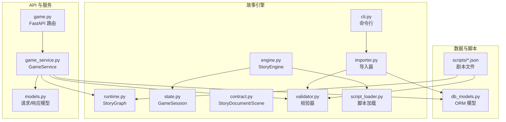
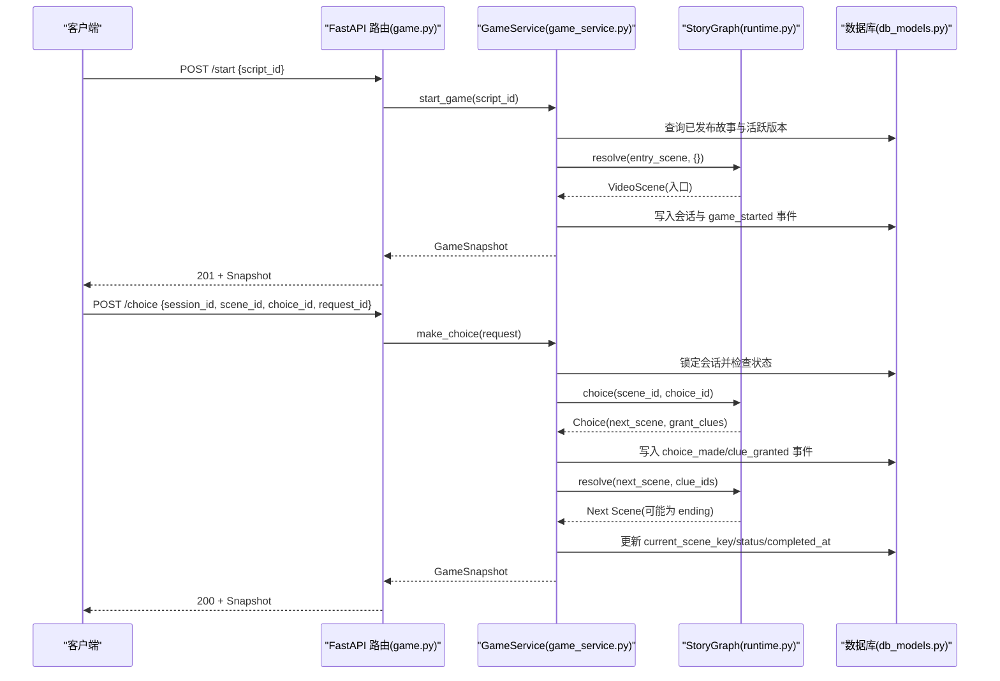
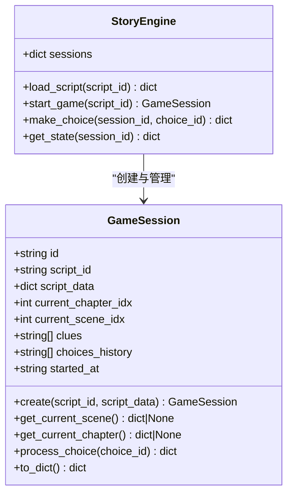
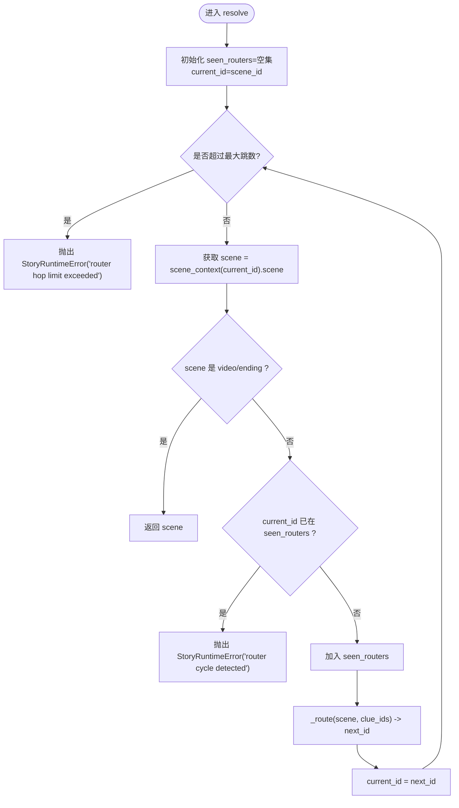
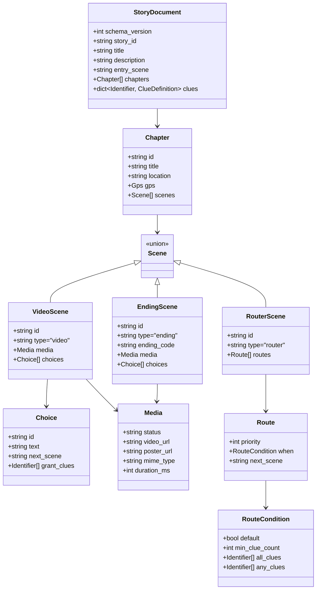
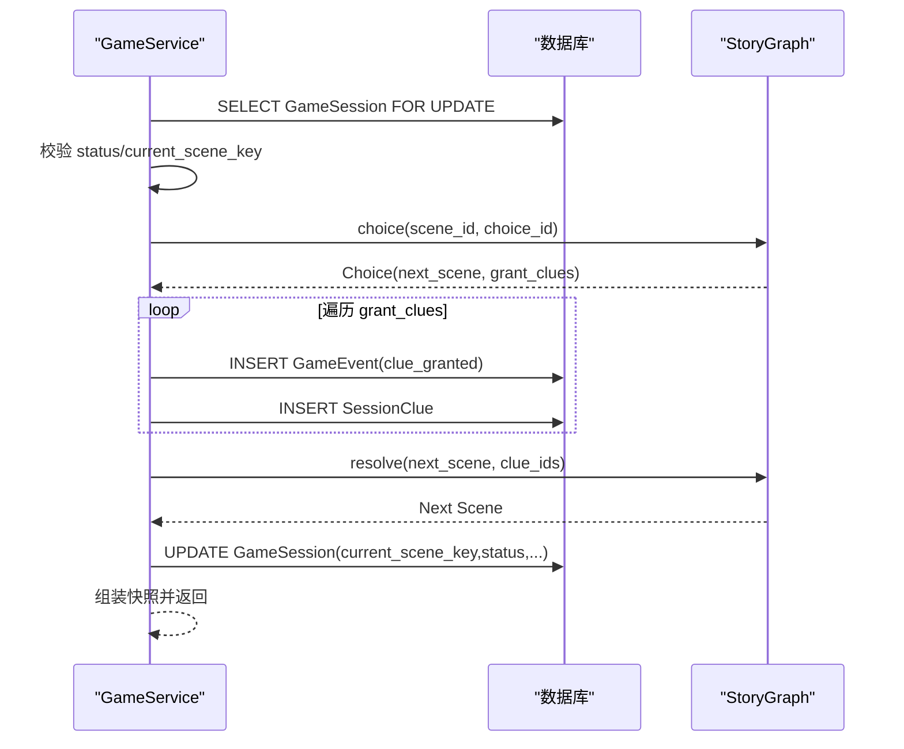
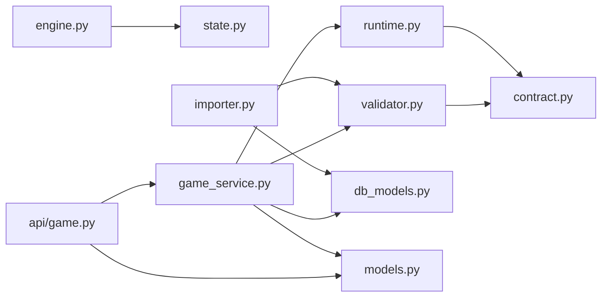

# 引擎核心架构

<cite>
**本文引用的文件**
- [engine.py](file://backend/app/story/engine.py)
- [runtime.py](file://backend/app/story/runtime.py)
- [state.py](file://backend/app/story/state.py)
- [script_loader.py](file://backend/app/story/script_loader.py)
- [contract.py](file://backend/app/story/contract.py)
- [validator.py](file://backend/app/story/validator.py)
- [importer.py](file://backend/app/story/importer.py)
- [cli.py](file://backend/app/story/cli.py)
- [game.py](file://backend/app/api/game.py)
- [game_service.py](file://backend/app/game_service.py)
- [models.py](file://backend/app/models.py)
- [db_models.py](file://backend/app/db_models.py)
- [macau_mystery_demo.json](file://backend/app/story/scripts/macau_mystery_demo.json)
- [test_story_runtime.py](file://backend/tests/test_story_runtime.py)
</cite>

## 目录
1. [简介](#简介)
2. [项目结构](#项目结构)
3. [核心组件](#核心组件)
4. [架构总览](#架构总览)
5. [详细组件分析](#详细组件分析)
6. [依赖关系分析](#依赖关系分析)
7. [性能考量](#性能考量)
8. [故障排查指南](#故障排查指南)
9. [结论](#结论)
10. [附录：API 接口与扩展指南](#附录api-接口与扩展指南)

## 简介
本技术文档聚焦于“故事引擎”的核心架构，围绕 StoryEngine、GameSession、StoryGraph、StoryDocument 等关键组件，系统阐述游戏会话管理、剧本加载机制、状态同步策略与错误处理。文档同时覆盖引擎初始化流程、脚本文件组织结构、完整 API 说明（会话创建、选择处理、状态查询），以及扩展点与自定义场景类型的实现指南，帮助开发者快速掌握并高效使用引擎。

## 项目结构
后端故事引擎位于 backend/app/story 目录下，包含运行时解析、严格契约定义、校验器、导入工具与命令行入口；API 层通过 FastAPI 暴露匿名游戏接口；持久化模型在 db_models.py 中定义；示例脚本位于 scripts 目录。

**图表来源**
- [engine.py:1-37](file://backend/app/story/engine.py#L1-L37)
- [runtime.py:1-80](file://backend/app/story/runtime.py#L1-L80)
- [state.py:1-54](file://backend/app/story/state.py#L1-L54)
- [script_loader.py:1-31](file://backend/app/story/script_loader.py#L1-L31)
- [contract.py:1-128](file://backend/app/story/contract.py#L1-L128)
- [validator.py:1-251](file://backend/app/story/validator.py#L1-L251)
- [importer.py:1-161](file://backend/app/story/importer.py#L1-L161)
- [cli.py:1-58](file://backend/app/story/cli.py#L1-L58)
- [game.py:1-37](file://backend/app/api/game.py#L1-L37)
- [game_service.py:1-386](file://backend/app/game_service.py#L1-L386)
- [models.py:1-146](file://backend/app/models.py#L1-L146)
- [db_models.py:1-160](file://backend/app/db_models.py#L1-L160)

**章节来源**
- [engine.py:1-37](file://backend/app/story/engine.py#L1-L37)
- [runtime.py:1-80](file://backend/app/story/runtime.py#L1-L80)
- [state.py:1-54](file://backend/app/story/state.py#L1-L54)
- [script_loader.py:1-31](file://backend/app/story/script_loader.py#L1-L31)
- [contract.py:1-128](file://backend/app/story/contract.py#L1-L128)
- [validator.py:1-251](file://backend/app/story/validator.py#L1-L251)
- [importer.py:1-161](file://backend/app/story/importer.py#L1-L161)
- [cli.py:1-58](file://backend/app/story/cli.py#L1-L58)
- [game.py:1-37](file://backend/app/api/game.py#L1-L37)
- [game_service.py:1-386](file://backend/app/game_service.py#L1-L386)
- [models.py:1-146](file://backend/app/models.py#L1-L146)
- [db_models.py:1-160](file://backend/app/db_models.py#L1-L160)

## 核心组件
- StoryEngine：轻量级进程内引擎，负责加载本地 JSON 剧本、维护内存中的 GameSession 字典，并提供 start_game、make_choice、get_state 三个基础方法。适合开发调试或极简部署。
- GameSession：基于 dataclass 的会话状态对象，记录当前章节/场景索引、线索集合、选择历史与开始时间，提供 process_choice 推进流程与 to_dict 序列化。
- StoryGraph：版本化 v1 剧本的纯运行时解析器，构建场景图，支持 router 跳转、条件匹配（min_clue_count/all_clues/any_clues）、循环检测与最大跳数限制。
- StoryDocument/Scene：Pydantic 严格契约，定义 schema_version、story_id、entry_scene、chapters、clues 及 scene 类型（video/ending/router）。
- Validator：对剧本进行结构与语义校验，包括唯一性、可达性、默认路由、媒体占位符策略、无结局路径等。
- Importer/CLI：将剧本 JSON 导入数据库，生成版本与哈希，支持发布与占位符策略控制，并提供命令行 validate/import。
- GameService：事务化的游戏推进服务，封装 start_game、make_choice、get_state，结合数据库事件日志与幂等性保证，输出统一快照。
- API 路由：FastAPI 暴露 /start、/choice、/state/{session_id} 三个端点，调用 GameService。

**章节来源**
- [engine.py:1-37](file://backend/app/story/engine.py#L1-L37)
- [state.py:1-54](file://backend/app/story/state.py#L1-L54)
- [runtime.py:1-80](file://backend/app/story/runtime.py#L1-L80)
- [contract.py:1-128](file://backend/app/story/contract.py#L1-L128)
- [validator.py:1-251](file://backend/app/story/validator.py#L1-L251)
- [importer.py:1-161](file://backend/app/story/importer.py#L1-L161)
- [cli.py:1-58](file://backend/app/story/cli.py#L1-L58)
- [game_service.py:1-386](file://backend/app/game_service.py#L1-L386)
- [game.py:1-37](file://backend/app/api/game.py#L1-L37)

## 架构总览
下图展示从 API 到运行时与持久化的整体交互。客户端通过 FastAPI 发起请求，GameService 在事务内完成选择处理、线索授予、状态更新与事件记录，并通过 StoryGraph 解析下一场景。

**图表来源**
- [game.py:1-37](file://backend/app/api/game.py#L1-L37)
- [game_service.py:1-386](file://backend/app/game_service.py#L1-L386)
- [runtime.py:1-80](file://backend/app/story/runtime.py#L1-L80)
- [db_models.py:1-160](file://backend/app/db_models.py#L1-L160)

## 详细组件分析

### StoryEngine 与 GameSession 设计
- StoryEngine 采用进程内字典维护多个 GameSession，提供最小可用 API：load_script、start_game、make_choice、get_state。适用于单机演示或测试。
- GameSession 以 dataclass 表示会话状态，包含 script_data、current_chapter_idx、current_scene_idx、clues、choices_history、started_at。process_choice 根据当前场景 choices 匹配 choice_id，追加线索并推进场景索引。to_dict 用于序列化。

**图表来源**
- [engine.py:1-37](file://backend/app/story/engine.py#L1-L37)
- [state.py:1-54](file://backend/app/story/state.py#L1-L54)

**章节来源**
- [engine.py:1-37](file://backend/app/story/engine.py#L1-L37)
- [state.py:1-54](file://backend/app/story/state.py#L1-L54)

### StoryGraph 运行时与状态机
- StoryGraph 基于 StoryDocument 构建场景上下文映射，支持 resolve(scene_id, clue_ids) 遍历 router 链直至 video/ending 节点，内置循环检测与最大跳数限制。
- choice(scene_id, choice_id) 返回 Choice，preview_choice 可预取 next_scene 及其媒体信息。
- _matches 实现条件匹配：default、min_clue_count、all_clues、any_clues 组合逻辑。

**图表来源**
- [runtime.py:22-80](file://backend/app/story/runtime.py#L22-L80)

**章节来源**
- [runtime.py:1-80](file://backend/app/story/runtime.py#L1-L80)

### 剧本契约与校验
- contract.py 定义严格的 Pydantic 模型：Identifier、Media、Choice、RouteCondition、Route、VideoScene、EndingScene、RouterScene、Chapter、ClueDefinition、StoryDocument。
- validator.py 执行结构与语义校验：重复 ID、缺失目标、默认路由唯一性与优先级、placeholder 媒体策略、可达性与结局存在性、router 循环检测等。

**图表来源**
- [contract.py:1-128](file://backend/app/story/contract.py#L1-L128)

**章节来源**
- [contract.py:1-128](file://backend/app/story/contract.py#L1-L128)
- [validator.py:1-251](file://backend/app/story/validator.py#L1-L251)

### 导入与 CLI
- importer.py 提供 import_story_data/import_story_file/bootstrap_demo_story，将验证后的 StoryDocument 写入数据库，生成版本与内容哈希，支持 publish 标志与 placeholder 策略。
- cli.py 提供 validate/import 子命令，读取配置文件决定是否允许 placeholder 媒体。

**章节来源**
- [importer.py:1-161](file://backend/app/story/importer.py#L1-L161)
- [cli.py:1-58](file://backend/app/story/cli.py#L1-L58)

### 游戏服务与事务化推进
- GameService.start_game：查询已发布故事与活跃版本，构造入口场景，创建会话与 game_started 事件，返回快照。
- GameService.make_choice：事务内锁定会话，校验状态与场景一致性，记录 choice_made 事件，授予线索并记录 clue_granted 事件，resolve 下一场景，若为 ending 则标记 completed，返回快照。
- GameService.get_state：按 session_id 查询会话与版本，组装快照。
- 幂等性：通过 request_id 去重，避免重复提交导致的状态不一致。

**图表来源**
- [game_service.py:70-193](file://backend/app/game_service.py#L70-L193)
- [runtime.py:37-61](file://backend/app/story/runtime.py#L37-L61)

**章节来源**
- [game_service.py:1-386](file://backend/app/game_service.py#L1-L386)

### 示例脚本结构
macau_mystery_demo.json 展示了 v1 剧本的最小结构：schema_version、story_id、title、description、entry_scene、chapters（含 scenes）、clues。场景类型包括 video、router、ending，选项 grant_clues 驱动分支与结局。

**章节来源**
- [macau_mystery_demo.json:1-149](file://backend/app/story/scripts/macau_mystery_demo.json#L1-L149)

## 依赖关系分析
- engine.py 依赖 state.py（GameSession）与本地脚本加载。
- runtime.py 依赖 contract.py（StoryDocument/Scene）。
- validator.py 依赖 contract.py 与 pydantic 校验。
- importer.py 依赖 validator.py、contract.py、db_models.py。
- game_service.py 依赖 runtime.py、validator.py、db_models.py、models.py。
- api/game.py 依赖 models.py 与 game_service.py。

**图表来源**
- [engine.py:1-37](file://backend/app/story/engine.py#L1-L37)
- [runtime.py:1-80](file://backend/app/story/runtime.py#L1-L80)
- [validator.py:1-251](file://backend/app/story/validator.py#L1-L251)
- [importer.py:1-161](file://backend/app/story/importer.py#L1-L161)
- [game_service.py:1-386](file://backend/app/game_service.py#L1-L386)
- [game.py:1-37](file://backend/app/api/game.py#L1-L37)

**章节来源**
- [engine.py:1-37](file://backend/app/story/engine.py#L1-L37)
- [runtime.py:1-80](file://backend/app/story/runtime.py#L1-L80)
- [validator.py:1-251](file://backend/app/story/validator.py#L1-L251)
- [importer.py:1-161](file://backend/app/story/importer.py#L1-L161)
- [game_service.py:1-386](file://backend/app/game_service.py#L1-L386)
- [game.py:1-37](file://backend/app/api/game.py#L1-L37)

## 性能考量
- 运行时解析：StoryGraph.resolve 使用 O(h) 遍历 router 链，h 受 max_router_hops 限制，避免无限循环。
- 数据库事务：make_choice 使用事务与行级锁（with_for_update），确保并发安全；SQLite 下显式 BEGIN IMMEDIATE。
- 幂等性：request_id 去重减少重复计算与写入。
- 预加载：preview_choice 提前计算下一场景媒体，降低前端等待。
- 校验阶段：validate_story_data 在导入时集中发现结构性问题，避免运行时错误。

[本节为通用指导，不直接分析具体文件]

## 故障排查指南
- 常见错误码与含义：
  - SESSION_NOT_FOUND：会话不存在
  - STORY_NOT_FOUND/STORY_NOT_PUBLISHED/STORY_NOT_READY：故事未发布或版本不可用
  - CHOICE_NOT_AVAILABLE：选项不属于当前场景
  - NO_PATH_TO_ENDING：场景无法到达结局
  - ROUTER_CYCLE：router 循环
  - PLACEHOLDER_MEDIA_NOT_ALLOWED：非生产环境不允许占位媒体
- 定位方法：
  - 使用 CLI validate 检查剧本结构与语义
  - 查看 GameService._corrupted_story 抛出的异常详情
  - 检查数据库事件日志（GameEvent）确认选择与线索授予顺序
- 恢复建议：
  - 修正剧本中的缺失目标、重复 ID、默认路由优先级
  - 确保入口场景为 video 且至少有一个选项
  - 在生产环境准备就绪的媒体资源

**章节来源**
- [game_errors.py:1-20](file://backend/app/game_errors.py#L1-L20)
- [validator.py:1-251](file://backend/app/story/validator.py#L1-L251)
- [game_service.py:195-234](file://backend/app/game_service.py#L195-L234)

## 结论
故事引擎通过严格的契约定义、完善的校验体系与事务化的运行时推进，实现了稳定可扩展的沉浸式叙事体验。StoryEngine 提供轻量入口，GameService 保障并发与幂等，StoryGraph 实现灵活的分支与汇合。配合 CLI 与导入工具，开发者可高效迭代剧本并快速上线。

[本节为总结，不直接分析具体文件]

## 附录：API 接口与扩展指南

### API 接口说明
- 启动游戏
  - 端点：POST /start
  - 请求体：{ script_id }
  - 响应：GameSnapshot（包含 session_id、status、story、scene、clues、progress、awarded_clues、ending）
- 做出选择
  - 端点：POST /choice
  - 请求体：{ session_id, scene_id, choice_id, request_id }
  - 响应：GameSnapshot（包含 awarded_clues 新增线索）
- 查询状态
  - 端点：GET /state/{session_id}
  - 响应：GameSnapshot

**章节来源**
- [game.py:1-37](file://backend/app/api/game.py#L1-L37)
- [models.py:12-92](file://backend/app/models.py#L12-L92)

### 引擎初始化与脚本组织
- 初始化流程：
  - 导入阶段：CLI 调用 importer.import_story_file，校验并写入数据库，设置 active_version_id
  - 运行阶段：API 调用 GameService.start_game，查询活跃版本与入口场景，创建会话与事件
- 脚本组织：
  - scripts 目录存放 *.json 剧本文件
  - 每个剧本遵循 v1 契约，包含 chapters、scenes、clues、entry_scene

**章节来源**
- [cli.py:1-58](file://backend/app/story/cli.py#L1-L58)
- [importer.py:138-161](file://backend/app/story/importer.py#L138-L161)
- [macau_mystery_demo.json:1-149](file://backend/app/story/scripts/macau_mystery_demo.json#L1-L149)

### 错误处理策略
- 运行时错误：StoryRuntimeError（未知场景、循环、超出跳数、选项不存在）
- 业务错误：GameError（会话/故事状态、幂等冲突、数据损坏）
- 校验错误：StoryValidationResult.errors/warnings

**章节来源**
- [runtime.py:9-11](file://backend/app/story/runtime.py#L9-L11)
- [game_errors.py:1-20](file://backend/app/game_errors.py#L1-L20)
- [validator.py:18-51](file://backend/app/story/validator.py#L18-L51)

### 扩展点与自定义场景类型
- 扩展场景类型：
  - 在 contract.py 中新增 Scene 子类（如 CustomScene），并在 Union 中注册
  - 在 validator.py 中添加相应校验规则
  - 在 runtime.py 的 resolve/_route 中处理新类型的跳转逻辑
- 扩展条件匹配：
  - 在 RouteCondition 中增加字段，并在 _matches 中实现匹配逻辑
- 扩展事件与持久化：
  - 在 db_models.py 中扩展 GameEvent/SessionClue 字段
  - 在 GameService 中记录新事件类型与线索授予逻辑

**章节来源**
- [contract.py:97-103](file://backend/app/story/contract.py#L97-L103)
- [validator.py:108-144](file://backend/app/story/validator.py#L108-L144)
- [runtime.py:63-80](file://backend/app/story/runtime.py#L63-L80)
- [db_models.py:93-127](file://backend/app/db_models.py#L93-L127)
- [game_service.py:124-193](file://backend/app/game_service.py#L124-L193)

### 最佳实践建议
- 始终使用 CLI validate 校验剧本后再导入
- 在生产环境禁用 placeholder 媒体，确保资源就绪
- 合理设计 router 条件，避免复杂循环与不可达场景
- 使用 request_id 保证幂等性，防止重复提交
- 定期审查 GameEvent 日志，定位异常路径与分支

[本节为通用指导，不直接分析具体文件]