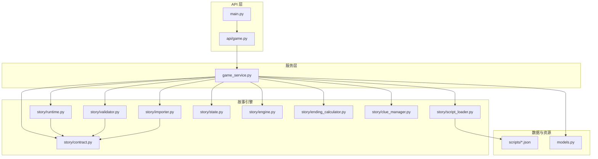
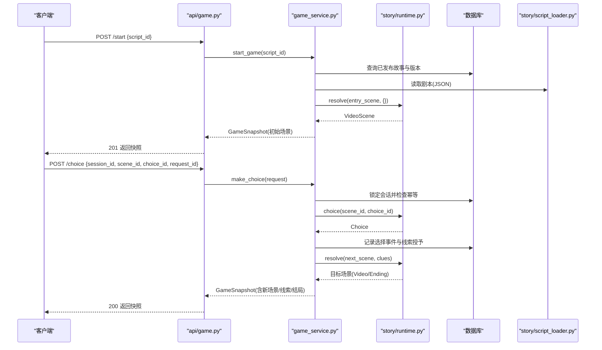
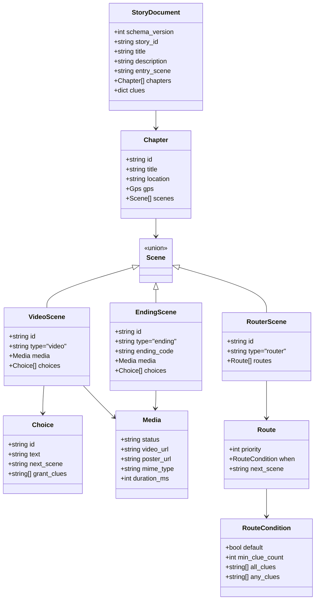
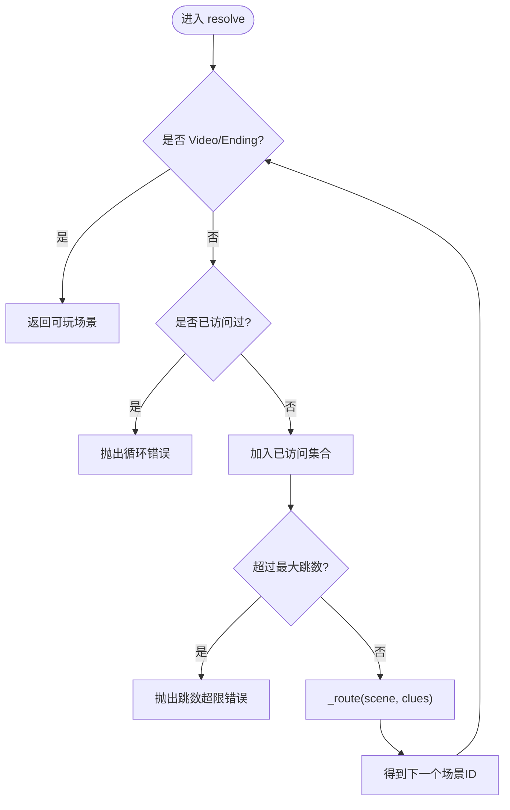
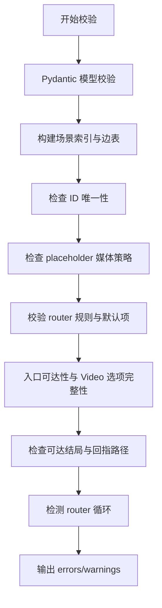
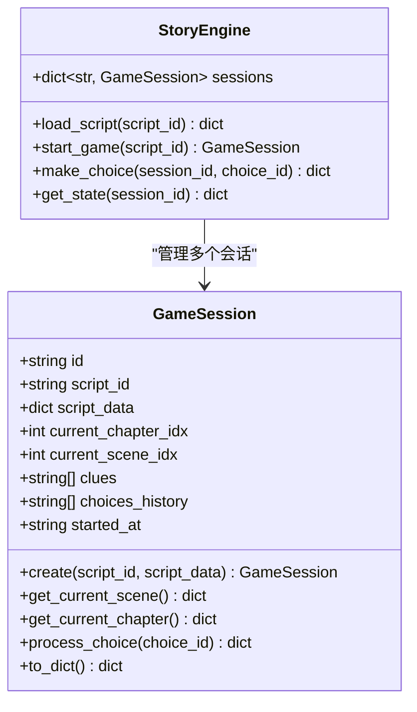
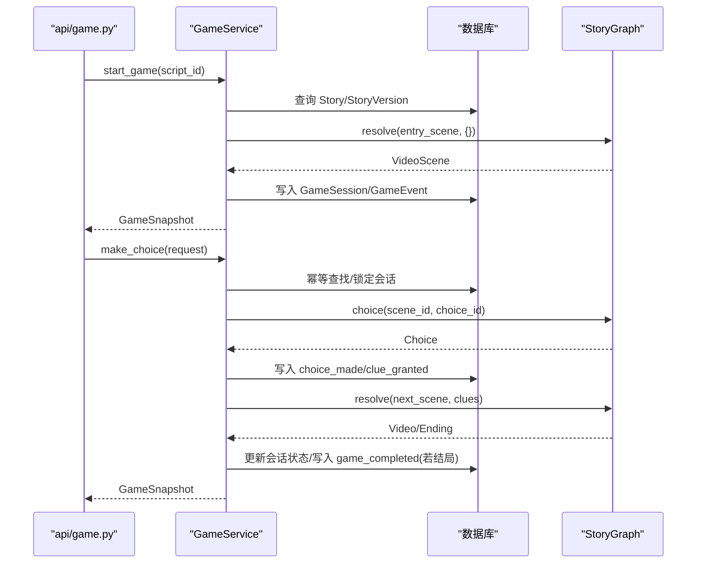
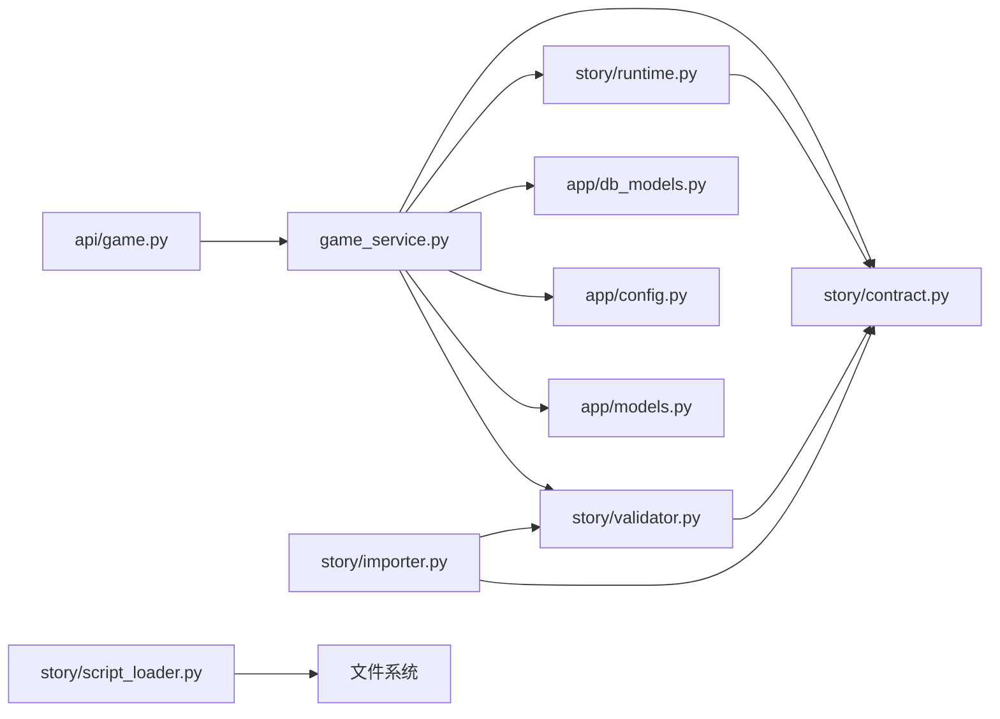

# 故事引擎

<cite>
**本文引用的文件**   
- [engine.py](file://backend/app/story/engine.py)
- [runtime.py](file://backend/app/story/runtime.py)
- [state.py](file://backend/app/story/state.py)
- [contract.py](file://backend/app/story/contract.py)
- [script_loader.py](file://backend/app/story/script_loader.py)
- [validator.py](file://backend/app/story/validator.py)
- [ending_calculator.py](file://backend/app/story/ending_calculator.py)
- [clue_manager.py](file://backend/app/story/clue_manager.py)
- [importer.py](file://backend/app/story/importer.py)
- [macau_mystery_01.json](file://backend/app/story/scripts/macau_mystery_01.json)
- [macau_mystery_demo.json](file://backend/app/story/scripts/macau_mystery_demo.json)
- [game.py](file://backend/app/api/game.py)
- [main.py](file://backend/app/main.py)
- [game_service.py](file://backend/app/game_service.py)
- [models.py](file://backend/app/models.py)
</cite>

## 目录
1. [简介](#简介)
2. [项目结构](#项目结构)
3. [核心组件](#核心组件)
4. [架构总览](#架构总览)
5. [详细组件分析](#详细组件分析)
6. [依赖关系分析](#依赖关系分析)
7. [性能考量](#性能考量)
8. [故障排查指南](#故障排查指南)
9. [结论](#结论)
10. [附录：剧本创作与调试指南](#附录剧本创作与调试指南)

## 简介
本技术文档围绕澳秘 Macau Mystery 的故事引擎，系统性阐述其状态机设计、会话管理、场景解析器、JSON 剧本结构与运行时路由机制。文档面向剧本创作者与游戏开发者，提供从数据契约、校验规则到运行期事件与多结局计算的完整参考，并包含性能优化策略与调试方法。

## 项目结构
故事引擎位于后端模块 story 子包中，配合 API 层与服务层共同实现“加载剧本—创建会话—推进选择—计算结局”的完整流程。关键目录与职责如下：
- story/contract.py：严格的数据契约（Pydantic 模型），定义章节、场景、选项、路由条件等结构
- story/runtime.py：纯运行时图解析器，负责场景跳转、路由匹配与循环检测
- story/validator.py：剧本的结构与语义校验（重复 ID、可达性、默认路由、循环等）
- story/state.py：轻量级会话状态（旧版简单实现）
- story/engine.py：简易引擎入口（旧版）
- story/script_loader.py：脚本加载与基础校验
- story/importer.py：导入发布、版本管理与幂等哈希
- story/ending_calculator.py / clue_manager.py：线索与结局计算工具
- scripts/*.json：示例与正式剧本
- api/game.py：对外游戏接口
- game_service.py：事务化游戏推进服务（主运行时）
- models.py：API 请求/响应模型
- main.py：应用启动、异常处理与路由挂载

**图表来源** 
- [game.py:1-37](file://backend/app/api/game.py#L1-L37)
- [main.py:1-111](file://backend/app/main.py#L1-L111)
- [game_service.py:1-386](file://backend/app/game_service.py#L1-L386)
- [runtime.py:1-80](file://backend/app/story/runtime.py#L1-L80)
- [validator.py:1-251](file://backend/app/story/validator.py#L1-L251)
- [contract.py:1-128](file://backend/app/story/contract.py#L1-L128)
- [importer.py:1-161](file://backend/app/story/importer.py#L1-L161)
- [script_loader.py:1-31](file://backend/app/story/script_loader.py#L1-L31)
- [state.py:1-54](file://backend/app/story/state.py#L1-L54)
- [engine.py:1-37](file://backend/app/story/engine.py#L1-L37)
- [ending_calculator.py:1-14](file://backend/app/story/ending_calculator.py#L1-L14)
- [clue_manager.py:1-14](file://backend/app/story/clue_manager.py#L1-L14)
- [models.py:1-146](file://backend/app/models.py#L1-L146)

**章节来源**
- [game.py:1-37](file://backend/app/api/game.py#L1-L37)
- [main.py:1-111](file://backend/app/main.py#L1-L111)
- [game_service.py:1-386](file://backend/app/game_service.py#L1-L386)

## 核心组件
- 数据契约（contract.py）：以 Pydantic 强类型约束 JSON 结构，确保 schema_version=1、章节/场景/选项/路由条件等字段合法
- 运行时图解析器（runtime.py）：将文档构建为有向图，支持视频/结局/路由器三类场景，按优先级与条件进行路由，内置循环检测与跳数限制
- 校验器（validator.py）：对剧本进行结构与语义校验，包括唯一性、可达性、默认路由、无环、媒体占位符控制等
- 会话与状态（state.py + engine.py）：旧版轻量会话与引擎；新版由 game_service.py 基于数据库的事务化会话管理
- 导入与发布（importer.py）：校验后持久化版本，生成内容哈希，支持草稿/已发布状态切换
- 线索与结局（clue_manager.py + ending_calculator.py）：线索去重发放与基于线索数量的结局判定
- API 与服务（api/game.py + game_service.py + models.py）：对外暴露开始/选择/状态查询接口，内部封装事务、幂等、快照与错误处理

**章节来源**
- [contract.py:1-128](file://backend/app/story/contract.py#L1-L128)
- [runtime.py:1-80](file://backend/app/story/runtime.py#L1-L80)
- [validator.py:1-251](file://backend/app/story/validator.py#L1-L251)
- [state.py:1-54](file://backend/app/story/state.py#L1-L54)
- [engine.py:1-37](file://backend/app/story/engine.py#L1-L37)
- [importer.py:1-161](file://backend/app/story/importer.py#L1-L161)
- [clue_manager.py:1-14](file://backend/app/story/clue_manager.py#L1-L14)
- [ending_calculator.py:1-14](file://backend/app/story/ending_calculator.py#L1-L14)
- [game.py:1-37](file://backend/app/api/game.py#L1-L37)
- [game_service.py:1-386](file://backend/app/game_service.py#L1-L386)
- [models.py:1-146](file://backend/app/models.py#L1-L146)

## 架构总览
系统采用“API 层 → 服务层 → 故事引擎（运行时图）→ 数据契约/校验 → 数据库/文件系统”的分层架构。API 仅暴露最小必要接口，业务逻辑集中在 service 层，故事解析与路由在 runtime 层完成，确保高内聚低耦合。

**图表来源** 
- [game.py:15-36](file://backend/app/api/game.py#L15-L36)
- [game_service.py:35-193](file://backend/app/game_service.py#L35-L193)
- [runtime.py:37-80](file://backend/app/story/runtime.py#L37-L80)
- [script_loader.py:8-14](file://backend/app/story/script_loader.py#L8-L14)

## 详细组件分析

### 数据契约与剧本结构（contract.py）
- 顶层 StoryDocument：schema_version=1、story_id、title、description、entry_scene、chapters、clues
- Chapter：id、title、location、gps、scenes
- Scene 联合类型：VideoScene、EndingScene、RouterScene，通过 type 字段区分
- Choice：id、text、next_scene、grant_clues
- RouteCondition：default/min_clue_count/all_clues/any_clues，含互斥与合法性校验
- Media：status(video_url/poster_url/mime_type/duration_ms)，要求绝对 HTTP(S) URL

**图表来源** 
- [contract.py:10-128](file://backend/app/story/contract.py#L10-L128)

**章节来源**
- [contract.py:1-128](file://backend/app/story/contract.py#L1-L128)

### 运行时图解析器（runtime.py）
- StoryGraph：构建场景索引，维护 chapter_index 映射
- resolve(scene_id, clue_ids)：迭代路由，遇到 Video/Ending 即返回；检测循环与最大跳数
- choice(scene_id, choice_id)：校验当前场景是否为 Video 且选项存在
- preview_choice：预演选择后的目标场景（用于前端预加载）
- _matches：条件匹配（default、min_clue_count、all_clues、any_clues）
- _route：按 priority 排序，首个匹配条件决定 next_scene

**图表来源** 
- [runtime.py:37-80](file://backend/app/story/runtime.py#L37-L80)

**章节来源**
- [runtime.py:1-80](file://backend/app/story/runtime.py#L1-L80)

### 剧本校验器（validator.py）
- 结构校验：通过 Pydantic 验证合同模型，收集所有错误
- 语义校验：
  - 章节/场景/选项 ID 唯一性
  - placeholder 媒体在生产环境禁止
  - router 默认规则必须唯一且 priority 最大
  - 所有跳转目标必须存在
  - 入口场景必须是 Video 且可达
  - 每个可达 Video 至少有一个选项
  - 至少存在一个可达结局
  - 所有节点都能到达某个结局
  - router 链不得形成循环

**图表来源** 
- [validator.py:40-190](file://backend/app/story/validator.py#L40-L190)

**章节来源**
- [validator.py:1-251](file://backend/app/story/validator.py#L1-L251)

### 会话管理与状态（state.py + engine.py）
- GameSession：轻量会话对象，维护章节/场景索引、线索、选择历史与时间戳
- StoryEngine：旧版引擎，提供 load_script/start_game/make_choice/get_state
- 注意：新版主运行时使用 game_service.py 的事务化会话与数据库持久化，state/engine 作为兼容或辅助

**图表来源** 
- [state.py:7-54](file://backend/app/story/state.py#L7-L54)
- [engine.py:9-37](file://backend/app/story/engine.py#L9-L37)

**章节来源**
- [state.py:1-54](file://backend/app/story/state.py#L1-L54)
- [engine.py:1-37](file://backend/app/story/engine.py#L1-L37)

### 导入与发布（importer.py）
- import_story_data：校验 → 模型验证 → 内容哈希 → 版本创建/复用 → 发布状态更新
- bootstrap_demo_story：自动导入演示剧本（允许 placeholder 媒体）

**章节来源**
- [importer.py:1-161](file://backend/app/story/importer.py#L1-L161)

### 线索与结局计算（clue_manager.py + ending_calculator.py）
- add_clue：去重添加线索
- check_ending_condition：支持 default 与 >=N 的条件
- calculate_ending：遍历 endings，优先匹配非 default 条件，否则 fallback

**章节来源**
- [clue_manager.py:1-14](file://backend/app/story/clue_manager.py#L1-L14)
- [ending_calculator.py:1-14](file://backend/app/story/ending_calculator.py#L1-L14)

### API 与服务（api/game.py + game_service.py + models.py）
- API：/start、/choice、/state/{session_id}
- GameService：
  - start_game：获取活跃版本 → 解析入口场景 → 创建会话与事件 → 返回快照
  - make_choice：幂等检查 → 锁会话 → 校验选择 → 授予线索 → 路由下一场景 → 可能标记 completed → 返回快照
  - _snapshot：组装场景、章节、线索、进度、可选 awarded_clues 与 ending
  - 生产环境媒体就绪检查
- models：统一的请求/响应模型，确保前后端契约一致

**图表来源** 
- [game.py:15-36](file://backend/app/api/game.py#L15-L36)
- [game_service.py:35-193](file://backend/app/game_service.py#L35-L193)
- [runtime.py:37-80](file://backend/app/story/runtime.py#L37-L80)
- [models.py:12-92](file://backend/app/models.py#L12-L92)

**章节来源**
- [game.py:1-37](file://backend/app/api/game.py#L1-L37)
- [game_service.py:1-386](file://backend/app/game_service.py#L1-L386)
- [models.py:1-146](file://backend/app/models.py#L1-L146)

## 依赖关系分析
- API 层依赖 models 与 game_service
- game_service 依赖 contract、runtime、validator、db_models、config、models
- runtime 依赖 contract
- validator 依赖 contract
- importer 依赖 contract、validator、db_models
- script_loader 依赖文件系统
- state/engine 为旧版实现，被 service 替代为主运行时

**图表来源** 
- [game.py:1-37](file://backend/app/api/game.py#L1-L37)
- [game_service.py:1-386](file://backend/app/game_service.py#L1-L386)
- [runtime.py:1-80](file://backend/app/story/runtime.py#L1-L80)
- [validator.py:1-251](file://backend/app/story/validator.py#L1-L251)
- [contract.py:1-128](file://backend/app/story/contract.py#L1-L128)
- [importer.py:1-161](file://backend/app/story/importer.py#L1-L161)
- [script_loader.py:1-31](file://backend/app/story/script_loader.py#L1-L31)

**章节来源**
- [game_service.py:1-386](file://backend/app/game_service.py#L1-L386)
- [runtime.py:1-80](file://backend/app/story/runtime.py#L1-L80)
- [validator.py:1-251](file://backend/app/story/validator.py#L1-L251)
- [contract.py:1-128](file://backend/app/story/contract.py#L1-L128)
- [importer.py:1-161](file://backend/app/story/importer.py#L1-L161)
- [script_loader.py:1-31](file://backend/app/story/script_loader.py#L1-L31)

## 性能考量
- 运行时图解析：
  - 场景索引 O(1) 查找，resolve 最多 max_router_hops 次迭代，避免死循环
  - 条件匹配为常数时间与集合操作，复杂度与线索数量线性相关
- 校验阶段：
  - 构建边表与可达性分析 O(V+E)，反向 BFS 检查可到达结局
  - 循环检测使用 DFS 栈，线性复杂度
- 事务与并发：
  - 选择提交使用 with_for_update 行级锁，SQLite 下显式 BEGIN IMMEDIATE
  - 幂等通过 request_id 去重，避免重复处理
- 媒体准备：
  - 生产环境强制 media.status="ready"，减少播放失败重试开销
- 快照构造：
  - 按需组装 response，避免冗余字段传输

[本节为通用性能建议，不直接分析具体文件]

## 故障排查指南
- 常见错误码与含义：
  - SESSION_NOT_FOUND：会话不存在
  - STORY_NOT_FOUND / STORY_NOT_PUBLISHED / STORY_NOT_READY：故事未找到或未发布/未就绪
  - CHOICE_NOT_AVAILABLE：选择的选项不属于当前场景
  - STALE_SCENE：提交的场景不是当前场景
  - SESSION_COMPLETED / SESSION_NOT_ACTIVE：会话已结束或不可继续
  - IDEMPOTENCY_CONFLICT / IDEMPOTENCY_RECORD_CORRUPTED：幂等冲突或记录损坏
  - STORY_DATA_CORRUPTED：已发布剧情数据异常
- 定位步骤：
  - 检查 API 返回的错误详情（path/message/type）
  - 查看数据库中的 GameEvent 序列号与 payload_json
  - 使用 validator 对剧本进行离线校验，确认可达性与默认路由
  - 确认生产环境媒体状态为 ready

**章节来源**
- [game_service.py:195-386](file://backend/app/game_service.py#L195-L386)
- [main.py:38-74](file://backend/app/main.py#L38-L74)

## 结论
Macau Mystery 故事引擎以严格的契约与校验为基础，结合高效的运行时图解析与事务化的会话管理，实现了可扩展、可验证、可回放的多分支沉浸式叙事体验。通过清晰的职责分层与完善的错误处理，既满足创作者的灵活表达需求，也为开发者提供了稳定可靠的运行保障。

[本节为总结性内容，不直接分析具体文件]

## 附录：剧本创作与调试指南

### JSON 剧本结构要点
- 顶层字段：schema_version、story_id、title、description、entry_scene、chapters、clues
- 章节组织：每章包含 id/title/location/gps/scenes
- 场景类型：
  - video：必须有 choices，每个 choice 指定 next_scene 与 grant_clues
  - router：routes 列表，每条 route 含 priority、when、next_scene
  - ending：ending_code、media，choices 必须为空
- 条件判断：
  - default：兜底路由
  - min_clue_count：最少线索数
  - all_clues：必须全部拥有
  - any_clues：至少拥有一条
- 线索定义：clues 字典，包含 id/title/description/icon

**章节来源**
- [contract.py:10-128](file://backend/app/story/contract.py#L10-L128)
- [macau_mystery_demo.json:1-149](file://backend/app/story/scripts/macau_mystery_demo.json#L1-L149)
- [macau_mystery_01.json:1-142](file://backend/app/story/scripts/macau_mystery_01.json#L1-L142)

### 选择分支与路由算法
- 选择分支：
  - 当前场景必须为 video，choice 必须存在
  - 授予线索去重，记录事件
  - 根据 next_scene 与当前线索集进行路由解析
- 路由算法：
  - 按 priority 升序匹配 when 条件
  - 支持 default 兜底，但必须唯一且 priority 最大
  - 检测到循环或超出最大跳数会报错

**章节来源**
- [runtime.py:50-80](file://backend/app/story/runtime.py#L50-L80)
- [validator.py:108-144](file://backend/app/story/validator.py#L108-L144)

### 多结局计算算法
- 基于线索数量条件（>=N）或 default 兜底
- 服务端在 snapshot 中附带 ending 信息（若当前场景为 ending）

**章节来源**
- [ending_calculator.py:1-14](file://backend/app/story/ending_calculator.py#L1-L14)
- [game_service.py:258-281](file://backend/app/game_service.py#L258-L281)

### 运行时场景路由与事件触发
- 事件类型：game_started、choice_made、clue_granted、game_completed
- 事件记录包含 sequence_number、scene_key、choice_key、payload_json
- 幂等：通过 request_id 保证相同请求只执行一次

**章节来源**
- [game_service.py:127-193](file://backend/app/game_service.py#L127-L193)

### 性能优化策略
- 预加载：preview_choice 返回 next 场景媒体，便于前端提前缓存
- 生产媒体就绪检查，避免运行时失败
- 数据库事务与行级锁，保证并发安全
- 校验阶段一次性发现结构性问题，减少运行期错误

**章节来源**
- [game_service.py:227-234](file://backend/app/game_service.py#L227-L234)
- [game_service.py:296-308](file://backend/app/game_service.py#L296-L308)

### 脚本验证规则与调试工具
- 使用 validate_story_data 进行离线校验，关注 errors 与 warnings
- 常见问题：
  - 重复 ID、缺失跳转目标、无效入口场景、缺少可达结局、router 循环
  - placeholder 媒体在生产环境不允许
- 调试建议：
  - 逐步缩小范围，先验证 schema，再检查语义
  - 打印/导出 GameEvent 序列，核对选择与线索授予顺序
  - 使用 demo 剧本对比差异，快速定位问题

**章节来源**
- [validator.py:40-190](file://backend/app/story/validator.py#L40-L190)
- [importer.py:59-135](file://backend/app/story/importer.py#L59-L135)