# 线索系统

<cite>
**本文引用的文件**   
- [clue_manager.py](file://backend/app/story/clue_manager.py)
- [ending_calculator.py](file://backend/app/story/ending_calculator.py)
- [state.py](file://backend/app/story/state.py)
- [engine.py](file://backend/app/story/engine.py)
- [runtime.py](file://backend/app/story/runtime.py)
- [contract.py](file://backend/app/story/contract.py)
- [validator.py](file://backend/app/story/validator.py)
- [importer.py](file://backend/app/story/importer.py)
- [macau_mystery_01.json](file://backend/app/story/scripts/macau_mystery_01.json)
- [macau_mystery_demo.json](file://backend/app/story/scripts/macau_mystery_demo.json)
- [game_service.py](file://backend/app/game_service.py)
- [models.py](file://backend/app/models.py)
- [test_story_runtime.py](file://backend/tests/test_story_runtime.py)
</cite>

## 目录
1. [简介](#简介)
2. [项目结构](#项目结构)
3. [核心组件](#核心组件)
4. [架构总览](#架构总览)
5. [详细组件分析](#详细组件分析)
6. [依赖关系分析](#依赖关系分析)
7. [性能考量](#性能考量)
8. [故障排查指南](#故障排查指南)
9. [结论](#结论)
10. [附录：配置与使用参考](#附录配置与使用参考)

## 简介
本技术文档聚焦于“故事引擎线索系统”的设计与实现，围绕 ClueManager 类（轻量函数式实现）与版本化运行时 StoryGraph 的协同工作，系统性阐述以下主题：
- 线索收集、验证与关联机制
- 数据结构、状态管理与权限控制策略
- 多结局计算算法（条件评估、权重分配与概率计算说明）
- 线索与场景绑定、条件触发与解锁逻辑
- 设计指南、最佳实践与性能优化建议
- 为游戏设计师与开发者提供完整的配置与使用参考

## 项目结构
后端故事子系统位于 backend/app/story 下，包含契约定义、校验器、运行时图解析、导入发布流程以及示例脚本。游戏服务层将运行时与数据库事务结合，提供幂等选择接口与快照输出。

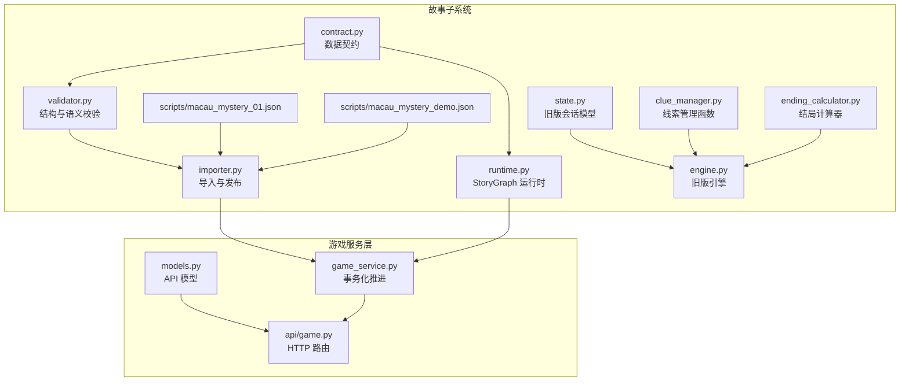

**图表来源** 
- [contract.py:1-128](file://backend/app/story/contract.py#L1-L128)
- [validator.py:1-251](file://backend/app/story/validator.py#L1-L251)
- [runtime.py:1-80](file://backend/app/story/runtime.py#L1-L80)
- [importer.py:1-161](file://backend/app/story/importer.py#L1-L161)
- [state.py:1-54](file://backend/app/story/state.py#L1-L54)
- [engine.py:1-37](file://backend/app/story/engine.py#L1-L37)
- [clue_manager.py:1-14](file://backend/app/story/clue_manager.py#L1-L14)
- [ending_calculator.py:1-14](file://backend/app/story/ending_calculator.py#L1-L14)
- [macau_mystery_01.json:1-142](file://backend/app/story/scripts/macau_mystery_01.json#L1-L142)
- [macau_mystery_demo.json:1-149](file://backend/app/story/scripts/macau_mystery_demo.json#L1-L149)
- [game_service.py:1-386](file://backend/app/game_service.py#L1-L386)
- [models.py:1-146](file://backend/app/models.py#L1-L146)
- [api/game.py:1-37](file://backend/app/api/game.py#L1-L37)

**章节来源**
- [contract.py:1-128](file://backend/app/story/contract.py#L1-L128)
- [validator.py:1-251](file://backend/app/story/validator.py#L1-L251)
- [runtime.py:1-80](file://backend/app/story/runtime.py#L1-L80)
- [importer.py:1-161](file://backend/app/story/importer.py#L1-L161)
- [state.py:1-54](file://backend/app/story/state.py#L1-L54)
- [engine.py:1-37](file://backend/app/story/engine.py#L1-L37)
- [clue_manager.py:1-14](file://backend/app/story/clue_manager.py#L1-L14)
- [ending_calculator.py:1-14](file://backend/app/story/ending_calculator.py#L1-L14)
- [macau_mystery_01.json:1-142](file://backend/app/story/scripts/macau_mystery_01.json#L1-L142)
- [macau_mystery_demo.json:1-149](file://backend/app/story/scripts/macau_mystery_demo.json#L1-L149)
- [game_service.py:1-386](file://backend/app/game_service.py#L1-L386)
- [models.py:1-146](file://backend/app/models.py#L1-L146)
- [api/game.py:1-37](file://backend/app/api/game.py#L1-L37)

## 核心组件
- 数据契约 contract.py：严格定义场景、选项、路由、线索定义与故事文档结构，确保 JSON 剧本可被安全解析与运行。
- 校验器 validator.py：对剧本进行结构与语义校验，包括唯一性、可达性、默认路由、循环检测、媒体占位符策略等。
- 运行时 runtime.py：基于契约构建 StoryGraph，支持按线索集合进行路由解析、选项预览与冲突保护（最大跳转次数）。
- 导入器 importer.py：校验并持久化故事版本，支持草稿/发布状态与内容哈希去重。
- 游戏服务 game_service.py：以事务驱动的选择推进，记录事件、授予线索、生成快照，并提供幂等保障。
- 旧版引擎 engine.py 与 state.py：轻量级会话与选择处理，用于早期原型或兼容路径。
- 线索管理 clue_manager.py：提供简单的线索添加与基础条件检查函数。
- 结局计算 ending_calculator.py：基于线索数量阈值的简单结局选择。

**章节来源**
- [contract.py:1-128](file://backend/app/story/contract.py#L1-L128)
- [validator.py:1-251](file://backend/app/story/validator.py#L1-L251)
- [runtime.py:1-80](file://backend/app/story/runtime.py#L1-L80)
- [importer.py:1-161](file://backend/app/story/importer.py#L1-L161)
- [game_service.py:1-386](file://backend/app/game_service.py#L1-L386)
- [engine.py:1-37](file://backend/app/story/engine.py#L1-L37)
- [state.py:1-54](file://backend/app/story/state.py#L1-L54)
- [clue_manager.py:1-14](file://backend/app/story/clue_manager.py#L1-L14)
- [ending_calculator.py:1-14](file://backend/app/story/ending_calculator.py#L1-L14)

## 架构总览
版本化运行时采用“契约 + 校验 + 图解析 + 事务推进”的分层架构。客户端通过 API 发起开始与选择请求，GameService 在事务中加载已发布的版本，构造 StoryGraph，依据当前会话的线索集合解析下一场景，并在需要时授予新线索、记录事件、返回快照。

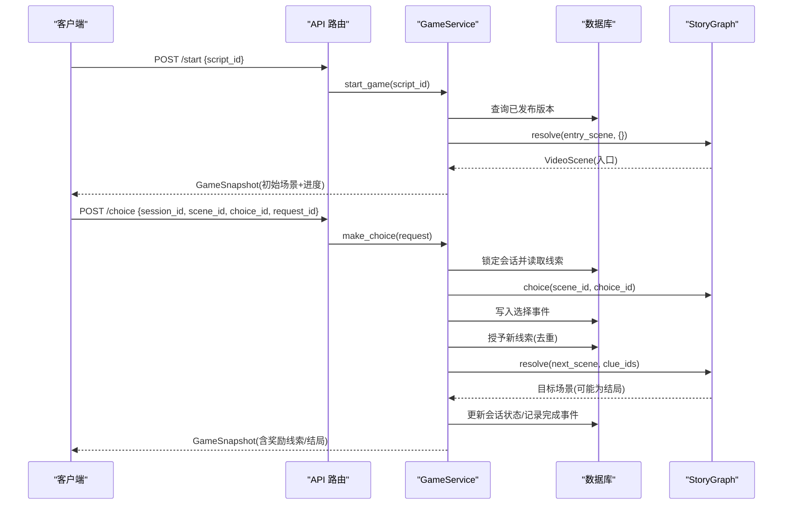

**图表来源** 
- [api/game.py:1-37](file://backend/app/api/game.py#L1-L37)
- [game_service.py:1-386](file://backend/app/game_service.py#L1-L386)
- [runtime.py:1-80](file://backend/app/story/runtime.py#L1-L80)
- [contract.py:1-128](file://backend/app/story/contract.py#L1-L128)

## 详细组件分析

### 数据契约与数据结构
- Identifier：标识符规范，限制长度与字符集，保证稳定引用。
- Media：媒体元信息，要求绝对 HTTP(S) URL，支持占位符与就绪状态。
- Choice：选项包含文本、下一场景与授予的线索列表 grant_clues。
- RouteCondition：路由条件支持 default、min_clue_count、all_clues、any_clues，且具备严格的互斥与合法性校验。
- RouterScene/VideoScene/EndingScene：三类场景，路由器负责分支，视频节点承载交互，结局节点无选项。
- Chapter/StoryDocument：章节与故事文档，包含 entry_scene、chapters 与 clues 字典。

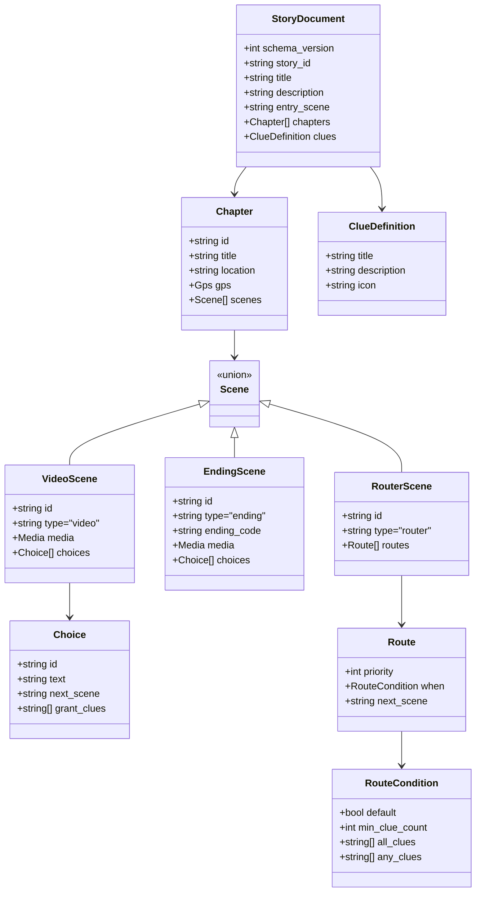

**图表来源** 
- [contract.py:1-128](file://backend/app/story/contract.py#L1-L128)

**章节来源**
- [contract.py:1-128](file://backend/app/story/contract.py#L1-L128)

### 运行时与路由解析（StoryGraph）
- 构建阶段：遍历章节与场景，建立 scene_id -> SceneContext 映射。
- 解析规则：
  - 遇到 VideoScene/EndingScene 直接返回。
  - 遇到 RouterScene，按优先级排序后匹配 when 条件，选择 next_scene。
  - 防止循环与超过最大跳转次数。
- 条件匹配：
  - default 优先。
  - min_clue_count：当前线索集合大小是否满足阈值。
  - all_clues：必须全部拥有。
  - any_clues：至少拥有一条。
- 预览能力：preview_choice 可在不提交的情况下预测下一步场景，便于前端预加载。

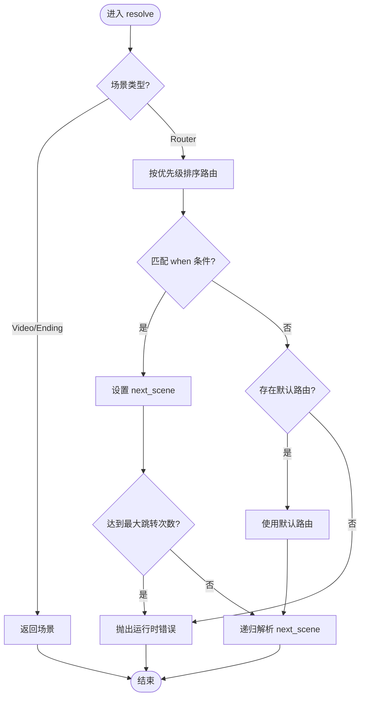

**图表来源** 
- [runtime.py:1-80](file://backend/app/story/runtime.py#L1-L80)

**章节来源**
- [runtime.py:1-80](file://backend/app/story/runtime.py#L1-L80)

### 校验器（结构与语义）
- 唯一性与完整性：章节/场景/选项/路由优先级唯一性检查；缺失目标场景报错。
- 媒体策略：开发环境允许 placeholder，生产环境禁止。
- 可达性与连通性：从入口可达性检查；每个可达 video 节点必须有选项；必须存在可达结局；所有节点需有通向结局的路径。
- 路由器循环检测：深度优先遍历检测 router 链中的环。
- 默认路由约束：仅允许一条默认路由，且其优先级必须最大。

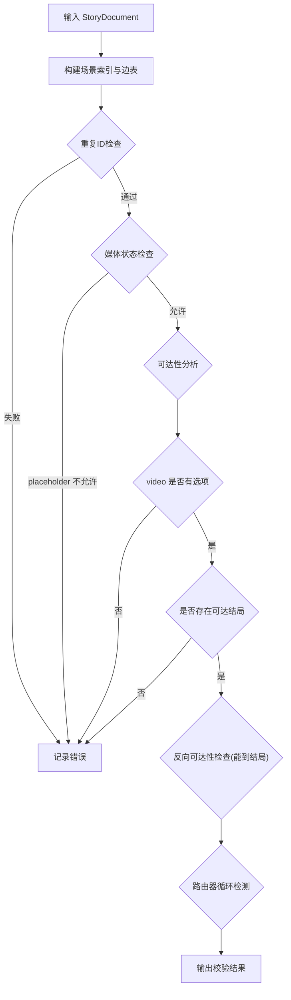

**图表来源** 
- [validator.py:1-251](file://backend/app/story/validator.py#L1-L251)

**章节来源**
- [validator.py:1-251](file://backend/app/story/validator.py#L1-L251)

### 导入与发布流程
- 校验：validate_story_data 先做 Pydantic 校验，再做语义校验。
- 版本化：根据内容哈希判断是否重复版本；支持草稿与发布状态切换；维护 active_version_id。
- 演示脚本：bootstrap_demo_story 自动导入 demo 脚本并发布。

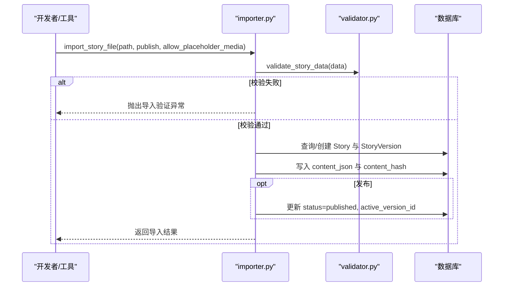

**图表来源** 
- [importer.py:1-161](file://backend/app/story/importer.py#L1-L161)
- [validator.py:1-251](file://backend/app/story/validator.py#L1-L251)

**章节来源**
- [importer.py:1-161](file://backend/app/story/importer.py#L1-L161)

### 游戏服务与事务推进（线索授予与状态机）
- 开始游戏：加载活跃版本，解析入口场景，创建会话并记录事件。
- 选择推进：
  - 幂等：通过 request_id 查找历史响应，避免重复处理。
  - 并发安全：SELECT FOR UPDATE 锁定会话，PostgreSQL 下额外 BEGIN IMMEDIATE。
  - 校验：会话状态、场景一致性、选项有效性。
  - 授予线索：去重写入 SessionClue，记录 clue_granted 事件。
  - 路由解析：基于当前线索集合解析下一场景，若为结局则标记 completed。
  - 快照：组装场景、章节、媒体、线索、进度与可选的奖励线索与结局信息。

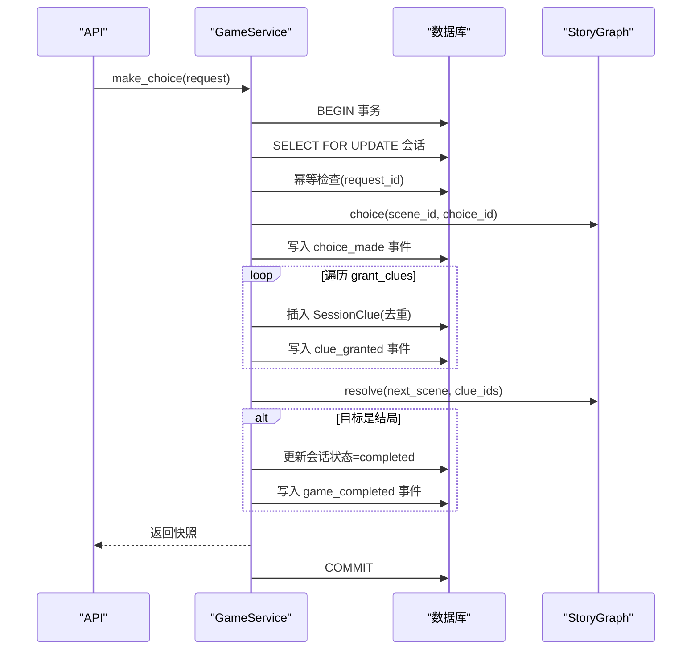

**图表来源** 
- [game_service.py:1-386](file://backend/app/game_service.py#L1-L386)
- [runtime.py:1-80](file://backend/app/story/runtime.py#L1-L80)

**章节来源**
- [game_service.py:1-386](file://backend/app/game_service.py#L1-L386)

### 旧版引擎与状态（兼容路径）
- state.py 的 GameSession：维护章节/场景索引、线索列表与选择历史，process_choice 会追加选择的 clue_reward。
- engine.py 的 StoryEngine：加载本地 JSON 脚本，启动会话，处理选择与状态查询。
- clue_manager.py：add_clue 去重添加；check_ending_condition 支持“>=”阈值。
- ending_calculator.py：calculate_ending 遍历 endings，按 condition 字符串解析阈值，默认兜底。

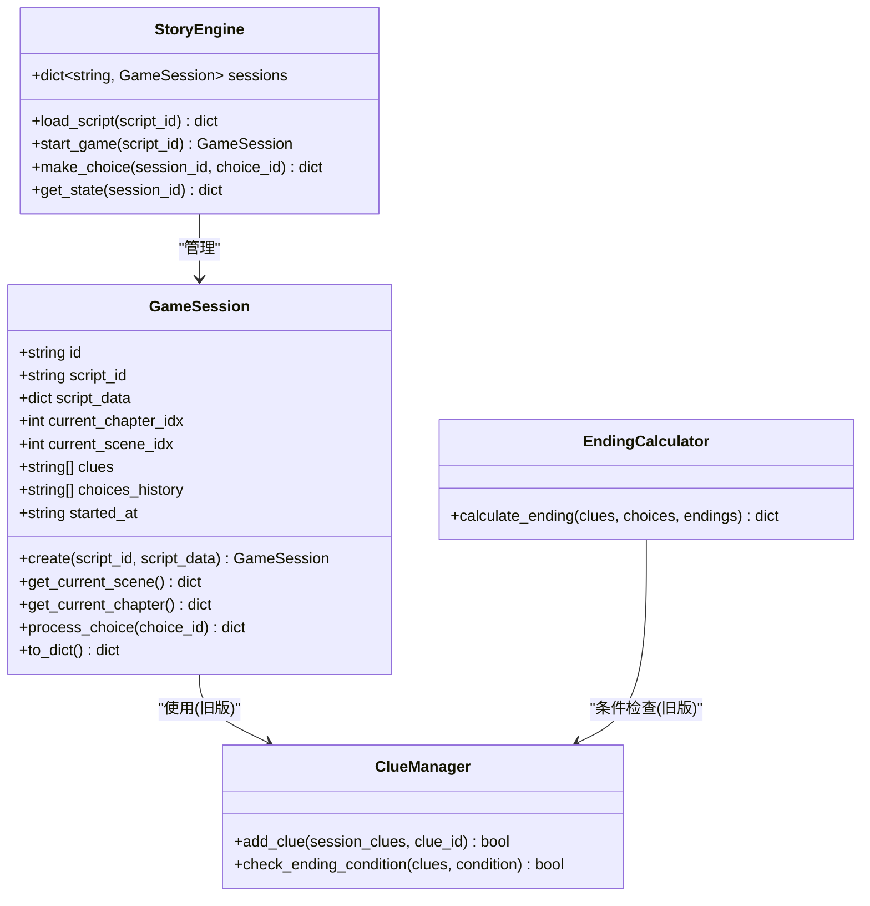

**图表来源** 
- [state.py:1-54](file://backend/app/story/state.py#L1-L54)
- [engine.py:1-37](file://backend/app/story/engine.py#L1-L37)
- [clue_manager.py:1-14](file://backend/app/story/clue_manager.py#L1-L14)
- [ending_calculator.py:1-14](file://backend/app/story/ending_calculator.py#L1-L14)

**章节来源**
- [state.py:1-54](file://backend/app/story/state.py#L1-L54)
- [engine.py:1-37](file://backend/app/story/engine.py#L1-L37)
- [clue_manager.py:1-14](file://backend/app/story/clue_manager.py#L1-L14)
- [ending_calculator.py:1-14](file://backend/app/story/ending_calculator.py#L1-L14)

### 多结局计算算法
- 旧版算法（ending_calculator.py）：
  - 遍历 endings，跳过 default。
  - 解析 condition 中的“>=”阈值，比较 len(clues)。
  - 若未命中任何条件，回退到 default 结局。
- 新版算法（runtime.py + validator.py）：
  - 通过 RouterScene 的 when 条件组合（min_clue_count/all_clues/any_clues/default）决定分支。
  - 校验器确保默认路由唯一且优先级最高，避免歧义。
  - 测试用例覆盖最小线索数、all/any 组合语义。

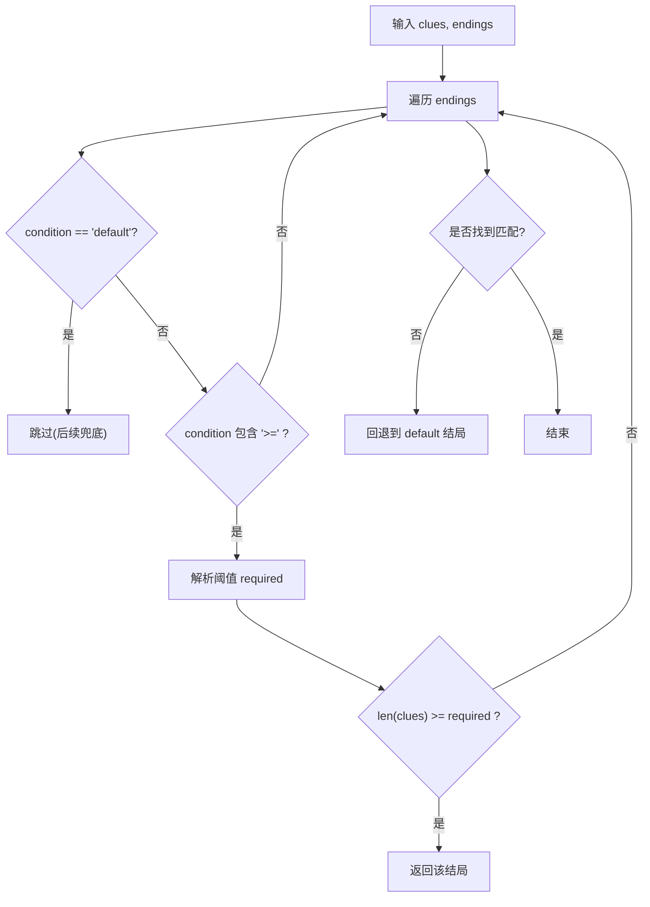

**图表来源** 
- [ending_calculator.py:1-14](file://backend/app/story/ending_calculator.py#L1-L14)
- [runtime.py:1-80](file://backend/app/story/runtime.py#L1-L80)
- [validator.py:1-251](file://backend/app/story/validator.py#L1-L251)
- [test_story_runtime.py:1-83](file://backend/tests/test_story_runtime.py#L1-L83)

**章节来源**
- [ending_calculator.py:1-14](file://backend/app/story/ending_calculator.py#L1-L14)
- [runtime.py:1-80](file://backend/app/story/runtime.py#L1-L80)
- [validator.py:1-251](file://backend/app/story/validator.py#L1-L251)
- [test_story_runtime.py:1-83](file://backend/tests/test_story_runtime.py#L1-L83)

### 线索与场景绑定、条件触发与解锁逻辑
- 绑定关系：
  - Choice.grant_clues：选项授予线索。
  - RouterScene.when.all_clues/any_clues/min_clue_count：路由条件依赖线索集合。
- 触发机制：
  - 玩家选择后，GameService 授予新线索（去重），记录事件。
  - StoryGraph.resolve 基于当前线索集合解析下一场景。
- 解锁逻辑：
  - 校验器确保所有 referenced clues 已在 clues 字典中定义。
  - 路由器默认规则兜底，保证无歧义。

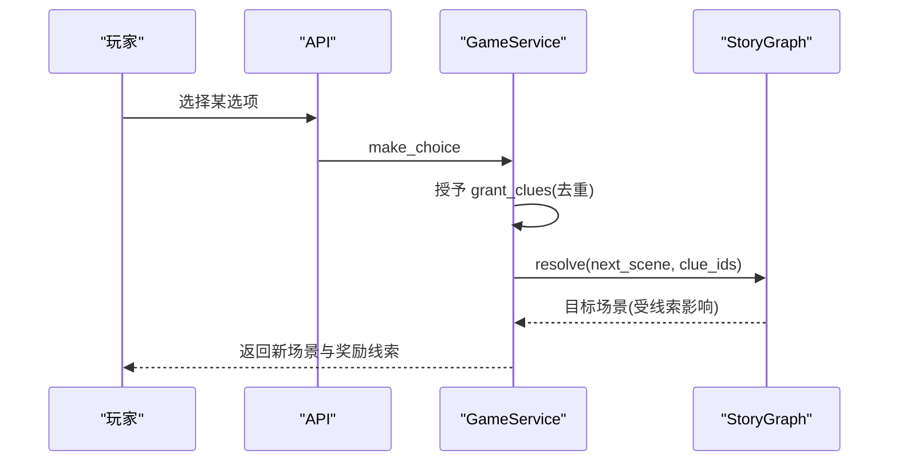

**图表来源** 
- [game_service.py:1-386](file://backend/app/game_service.py#L1-L386)
- [runtime.py:1-80](file://backend/app/story/runtime.py#L1-L80)
- [validator.py:1-251](file://backend/app/story/validator.py#L1-L251)

**章节来源**
- [game_service.py:1-386](file://backend/app/game_service.py#L1-L386)
- [runtime.py:1-80](file://backend/app/story/runtime.py#L1-L80)
- [validator.py:1-251](file://backend/app/story/validator.py#L1-L251)

## 依赖关系分析
- 运行时依赖契约：StoryGraph 完全基于 contract.py 的类型与字段进行解析与校验。
- 校验器依赖契约：validator.py 对 StoryDocument 的结构与语义进行强约束。
- 导入器依赖校验器与契约：确保入库版本合法且可复现。
- 游戏服务依赖运行时与契约：在事务中驱动状态机，产出快照。
- 旧版引擎依赖 state.py 与 clue_manager/ending_calculator：作为兼容路径存在。

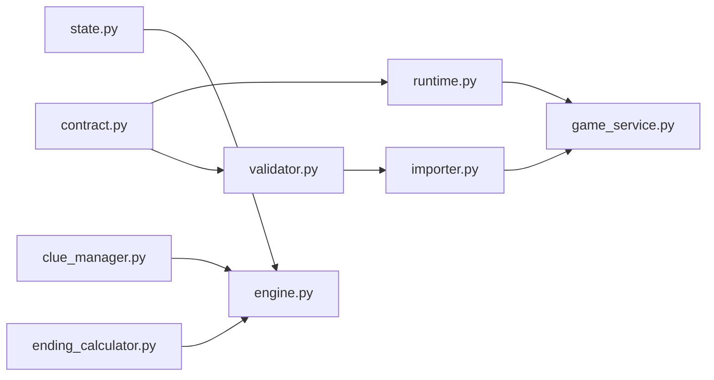

**图表来源** 
- [contract.py:1-128](file://backend/app/story/contract.py#L1-L128)
- [runtime.py:1-80](file://backend/app/story/runtime.py#L1-L80)
- [validator.py:1-251](file://backend/app/story/validator.py#L1-L251)
- [importer.py:1-161](file://backend/app/story/importer.py#L1-L161)
- [game_service.py:1-386](file://backend/app/game_service.py#L1-L386)
- [state.py:1-54](file://backend/app/story/state.py#L1-L54)
- [engine.py:1-37](file://backend/app/story/engine.py#L1-L37)
- [clue_manager.py:1-14](file://backend/app/story/clue_manager.py#L1-L14)
- [ending_calculator.py:1-14](file://backend/app/story/ending_calculator.py#L1-L14)

**章节来源**
- [contract.py:1-128](file://backend/app/story/contract.py#L1-L128)
- [runtime.py:1-80](file://backend/app/story/runtime.py#L1-L80)
- [validator.py:1-251](file://backend/app/story/validator.py#L1-L251)
- [importer.py:1-161](file://backend/app/story/importer.py#L1-L161)
- [game_service.py:1-386](file://backend/app/game_service.py#L1-L386)
- [state.py:1-54](file://backend/app/story/state.py#L1-L54)
- [engine.py:1-37](file://backend/app/story/engine.py#L1-L37)
- [clue_manager.py:1-14](file://backend/app/story/clue_manager.py#L1-L14)
- [ending_calculator.py:1-14](file://backend/app/story/ending_calculator.py#L1-L14)

## 性能考量
- 图构建与解析：
  - StoryGraph 构建为 O(N)（N 为场景数），resolve 每次最多 max_router_hops 次跳转，时间复杂度 O(H)，H 为跳转深度。
  - 路由匹配按优先级排序，单次匹配 O(R log R)，R 为路由条数。
- 数据库事务：
  - 选择推进使用事务与行锁，避免竞态；SQLite 使用 BEGIN IMMEDIATE 提升并发安全性。
  - 幂等检查通过 request_id 快速定位历史响应，减少重复计算。
- 线索授予：
  - 去重逻辑避免重复写入；批量事件写入减少 IO 次数。
- 媒体预加载：
  - preview_choice 支持前端预取媒体资源，降低首帧延迟。
- 校验成本：
  - 导入时执行完整校验，但仅在发布阶段发生；运行时允许 placeholder 媒体以提升开发效率。

[本节为通用指导，不直接分析具体文件]

## 故障排查指南
- 常见错误码与原因：
  - SESSION_NOT_FOUND：会话不存在或已被删除。
  - SESSION_COMPLETED/SESSION_NOT_ACTIVE：会话状态不正确，无法继续。
  - STALE_SCENE：提交的场景与服务器端不一致。
  - CHOICE_NOT_AVAILABLE：选项不属于当前场景。
  - STORY_NOT_FOUND/STORY_NOT_PUBLISHED/STORY_NOT_READY：故事未发布或版本不可用。
  - STORY_DATA_CORRUPTED：已发布版本数据异常（校验失败或解析错误）。
  - IDENTITY_CONFLICT/IDEMPOTENCY_RECORD_CORRUPTED：request_id 冲突或幂等记录损坏。
- 调试建议：
  - 使用 validate_story_data 检查剧本结构与语义。
  - 通过 StoryGraph.preview_choice 验证分支与路由预期。
  - 检查数据库事件序列，确认 clue_granted 与 choice_made 顺序正确。
  - 在生产环境确保媒体状态为 ready，避免 503。

**章节来源**
- [game_service.py:1-386](file://backend/app/game_service.py#L1-L386)
- [validator.py:1-251](file://backend/app/story/validator.py#L1-L251)
- [runtime.py:1-80](file://backend/app/story/runtime.py#L1-L80)

## 结论
本线索系统以严格的契约与校验为基础，结合运行时图解析与事务化的选择推进，实现了高可靠、可扩展的故事驱动玩法。ClueManager 提供轻量级的线索操作与条件检查，而 StoryGraph 与 GameService 共同构成版本化、幂等、可审计的核心流程。通过合理配置路由条件与线索授予，可实现丰富的分支与多结局体验。建议在设计与实现中遵循校验规则、保持路由优先级清晰、充分利用预览能力进行前端优化，并确保生产环境的媒体就绪与幂等保障。

[本节为总结，不直接分析具体文件]

## 附录：配置与使用参考
- 剧本配置要点：
  - 在 Choice 中通过 grant_clues 授予线索，确保对应 ID 在 clues 字典中定义。
  - 在 RouterScene 中使用 when 条件组合（min_clue_count/all_clues/any_clues/default）控制分支。
  - 入口场景必须为 video 节点，且所有可达 video 节点需包含至少一个选项。
  - 确保存在可达结局，且所有节点都有通向结局的路径。
- 使用流程：
  - 调用 /start 初始化会话，获取初始场景与进度。
  - 调用 /choice 提交选择，服务端授予线索并解析下一场景。
  - 通过 /state/{session_id} 查询当前快照，展示线索与进度。
- 最佳实践：
  - 使用 preview_choice 进行前端预加载，提升用户体验。
  - 合理设置路由优先级，默认路由优先级必须最大。
  - 在生产环境禁用 placeholder 媒体，确保媒体资源就绪。
  - 利用幂等 request_id 避免重复提交导致的状态不一致。

**章节来源**
- [contract.py:1-128](file://backend/app/story/contract.py#L1-L128)
- [validator.py:1-251](file://backend/app/story/validator.py#L1-L251)
- [runtime.py:1-80](file://backend/app/story/runtime.py#L1-L80)
- [game_service.py:1-386](file://backend/app/game_service.py#L1-L386)
- [macau_mystery_01.json:1-142](file://backend/app/story/scripts/macau_mystery_01.json#L1-L142)
- [macau_mystery_demo.json:1-149](file://backend/app/story/scripts/macau_mystery_demo.json#L1-L149)
- [test_story_runtime.py:1-83](file://backend/tests/test_story_runtime.py#L1-L83)