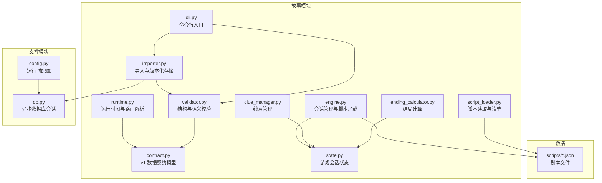
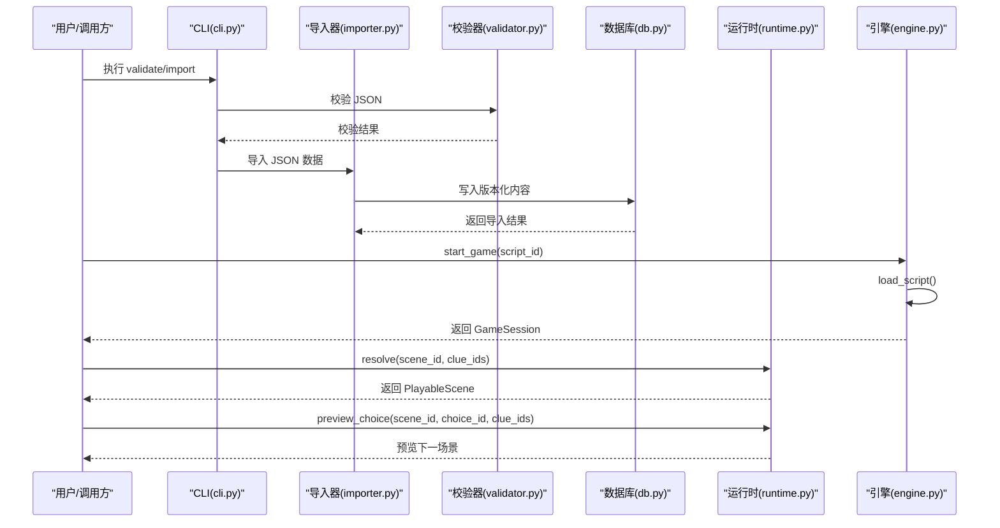
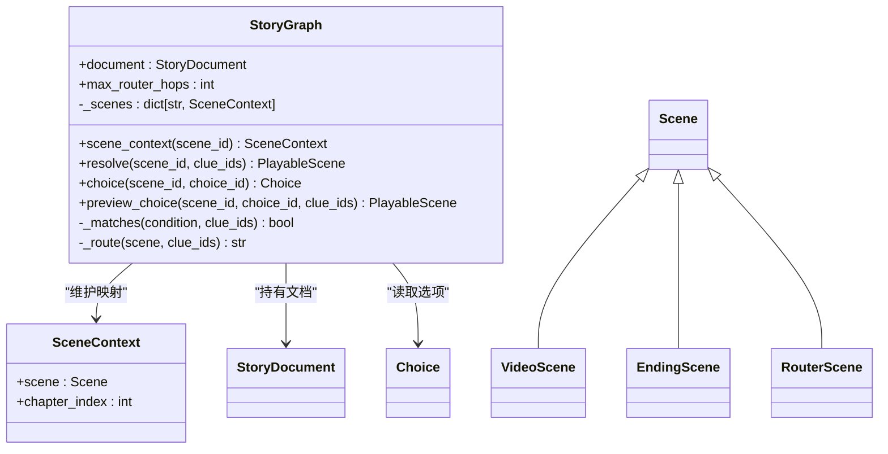
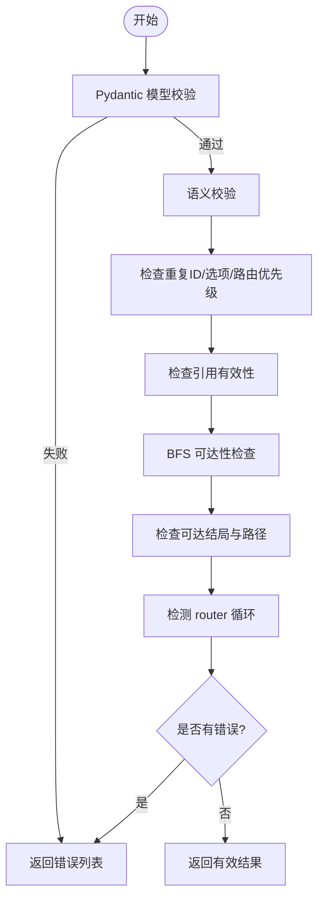
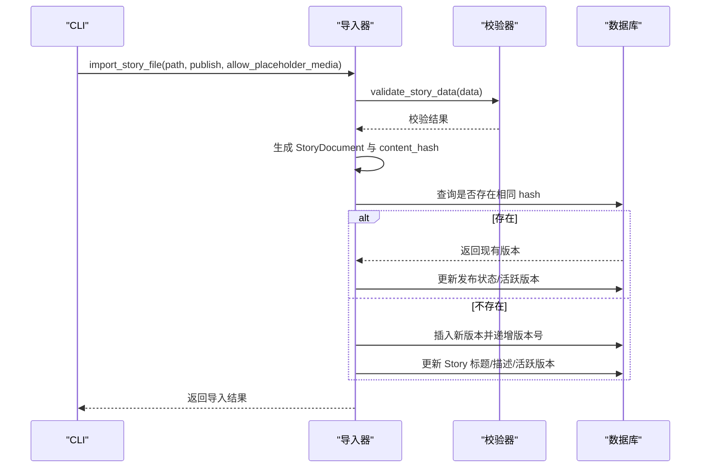
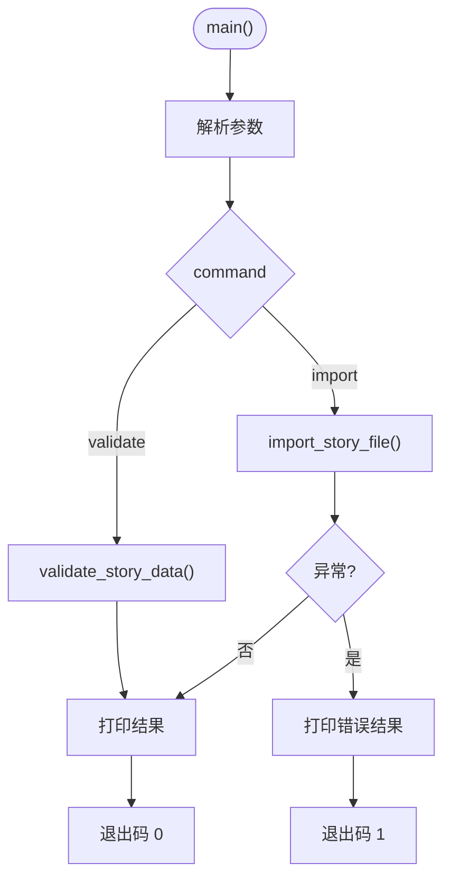
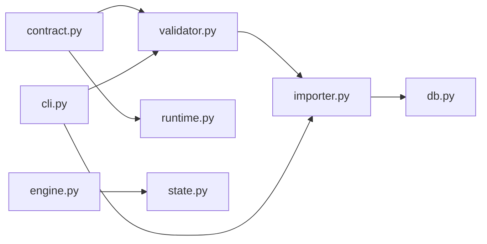

# 运行时系统

<cite>
**本文引用的文件**
- [engine.py](file://backend/app/story/engine.py)
- [runtime.py](file://backend/app/story/runtime.py)
- [importer.py](file://backend/app/story/importer.py)
- [cli.py](file://backend/app/story/cli.py)
- [script_loader.py](file://backend/app/story/script_loader.py)
- [state.py](file://backend/app/story/state.py)
- [contract.py](file://backend/app/story/contract.py)
- [validator.py](file://backend/app/story/validator.py)
- [clue_manager.py](file://backend/app/story/clue_manager.py)
- [ending_calculator.py](file://backend/app/story/ending_calculator.py)
- [config.py](file://backend/app/config.py)
- [db.py](file://backend/app/db.py)
- [macau_mystery_demo.json](file://backend/app/story/scripts/macau_mystery_demo.json)
- [test_story_runtime.py](file://backend/tests/test_story_runtime.py)
- [test_story_importer.py](file://backend/tests/test_story_importer.py)
</cite>

## 目录
1. [简介](#简介)
2. [项目结构](#项目结构)
3. [核心组件](#核心组件)
4. [架构总览](#架构总览)
5. [详细组件分析](#详细组件分析)
6. [依赖关系分析](#依赖关系分析)
7. [性能考量](#性能考量)
8. [故障排查指南](#故障排查指南)
9. [结论](#结论)
10. [附录](#附录)

## 简介
本技术文档面向故事引擎的“运行时系统”，聚焦以下目标：
- 场景解析器的工作原理：JSON 到 Python 对象的转换、严格契约校验与动态执行机制。
- 运行时环境配置、资源加载策略与内存管理。
- CLI 工具命令接口、批量处理与调试模式。
- 导入器的数据处理流程、脚本验证机制与错误恢复策略。
- 运行时性能监控、日志记录与故障诊断方法。
- 为系统管理员和运维人员提供部署配置与运维指南。

本系统采用“严格契约 + 强类型模型”的设计，通过 Pydantic 定义 v1 剧本数据结构，结合图遍历与路由条件匹配实现分支剧情与多结局的动态执行；同时提供导入管线将 JSON 剧本持久化为版本化内容，确保可追溯与幂等发布。

## 项目结构
后端故事模块位于 backend/app/story，包含运行时、校验、导入、CLI、状态管理等子模块；示例剧本位于 scripts 目录；测试覆盖运行时与导入行为。

**图表来源**
- [engine.py:1-37](file://backend/app/story/engine.py#L1-L37)
- [runtime.py:1-80](file://backend/app/story/runtime.py#L1-L80)
- [validator.py:1-251](file://backend/app/story/validator.py#L1-L251)
- [contract.py:1-128](file://backend/app/story/contract.py#L1-L128)
- [importer.py:1-161](file://backend/app/story/importer.py#L1-L161)
- [cli.py:1-58](file://backend/app/story/cli.py#L1-L58)
- [script_loader.py:1-31](file://backend/app/story/script_loader.py#L1-L31)
- [state.py:1-54](file://backend/app/story/state.py#L1-L54)
- [clue_manager.py:1-14](file://backend/app/story/clue_manager.py#L1-L14)
- [ending_calculator.py:1-14](file://backend/app/story/ending_calculator.py#L1-L14)
- [config.py:1-77](file://backend/app/config.py#L1-L77)
- [db.py:1-42](file://backend/app/db.py#L1-L42)
- [macau_mystery_demo.json:1-149](file://backend/app/story/scripts/macau_mystery_demo.json#L1-L149)

**章节来源**
- [engine.py:1-37](file://backend/app/story/engine.py#L1-L37)
- [runtime.py:1-80](file://backend/app/story/runtime.py#L1-L80)
- [validator.py:1-251](file://backend/app/story/validator.py#L1-L251)
- [contract.py:1-128](file://backend/app/story/contract.py#L1-L128)
- [importer.py:1-161](file://backend/app/story/importer.py#L1-L161)
- [cli.py:1-58](file://backend/app/story/cli.py#L1-L58)
- [script_loader.py:1-31](file://backend/app/story/script_loader.py#L1-L31)
- [state.py:1-54](file://backend/app/story/state.py#L1-L54)
- [clue_manager.py:1-14](file://backend/app/story/clue_manager.py#L1-L14)
- [ending_calculator.py:1-14](file://backend/app/story/ending_calculator.py#L1-L14)
- [config.py:1-77](file://backend/app/config.py#L1-L77)
- [db.py:1-42](file://backend/app/db.py#L1-L42)
- [macau_mystery_demo.json:1-149](file://backend/app/story/scripts/macau_mystery_demo.json#L1-L149)

## 核心组件
- 严格契约与模型（contract.py）：定义 StoryDocument、Chapter、Scene（Video/Ending/Router）、Choice、RouteCondition、Media、Gps 等强类型结构，禁止额外字段，确保 JSON 输入的结构安全。
- 校验器（validator.py）：对 JSON 进行 schema 校验与语义校验，包括重复 ID、缺失目标、可达性、默认路由唯一性与优先级、router 循环检测、placeholder 媒体限制等。
- 运行时图（runtime.py）：基于契约模型构建 SceneGraph，支持按线索集合与优先级选择路由，保护最大跳转次数，避免死循环。
- 导入器（importer.py）：将 JSON 转为 StoryDocument，计算内容哈希，去重并创建版本化记录，支持草稿与发布状态切换。
- CLI（cli.py）：提供 validate 与 import 子命令，支持生产/开发环境的 placeholder 媒体策略控制。
- 会话与状态（state.py, engine.py）：维护游戏会话、当前章节/场景索引、线索与选择历史，提供简单状态查询与推进。
- 辅助工具（clue_manager.py, ending_calculator.py）：线索去重添加与基于条件的结局计算。
- 配置与数据库（config.py, db.py）：环境变量驱动的配置、异步引擎与会话工厂、SQLite 外键与超时设置。

**章节来源**
- [contract.py:1-128](file://backend/app/story/contract.py#L1-L128)
- [validator.py:1-251](file://backend/app/story/validator.py#L1-L251)
- [runtime.py:1-80](file://backend/app/story/runtime.py#L1-L80)
- [importer.py:1-161](file://backend/app/story/importer.py#L1-L161)
- [cli.py:1-58](file://backend/app/story/cli.py#L1-L58)
- [state.py:1-54](file://backend/app/story/state.py#L1-L54)
- [engine.py:1-37](file://backend/app/story/engine.py#L1-L37)
- [clue_manager.py:1-14](file://backend/app/story/clue_manager.py#L1-L14)
- [ending_calculator.py:1-14](file://backend/app/story/ending_calculator.py#L1-L14)
- [config.py:1-77](file://backend/app/config.py#L1-L77)
- [db.py:1-42](file://backend/app/db.py#L1-L42)

## 架构总览
运行时系统围绕“JSON 剧本 → 契约模型 → 校验 → 版本化存储 → 运行时图 → 动态路由”的主线展开。CLI 作为入口，调用导入器完成数据入库；运行时通过契约模型构建图，依据玩家选择的线索集合与路由条件决定下一场景或结局。

**图表来源**
- [cli.py:1-58](file://backend/app/story/cli.py#L1-L58)
- [importer.py:1-161](file://backend/app/story/importer.py#L1-L161)
- [validator.py:1-251](file://backend/app/story/validator.py#L1-L251)
- [db.py:1-42](file://backend/app/db.py#L1-L42)
- [runtime.py:1-80](file://backend/app/story/runtime.py#L1-L80)
- [engine.py:1-37](file://backend/app/story/engine.py#L1-L37)

## 详细组件分析

### 场景解析器与运行时图（runtime.py）
- 功能要点：
  - 以 StoryDocument 构建场景映射，维护章节索引与场景上下文。
  - resolve(scene_id, clue_ids) 支持 Video/Ending 直接返回，Router 则根据条件与优先级选择 next_scene，内置最大跳转次数防止环路。
  - choice(scene_id, choice_id) 与 preview_choice(...) 用于获取选项与预览跳转后的场景。
  - _matches(...) 综合 min_clue_count、all_clues、any_clues 与 default 条件进行布尔判定。
- 复杂度与性能：
  - 构建映射 O(N)，resolve 最多 max_router_hops 次迭代，单次匹配 O(R)（R 为路由数），整体 O(H*R)。
  - 使用 frozenset 与 set 提升匹配效率。
- 错误处理：
  - 未知场景、非视频场景选择、无匹配路由、超过跳转上限均抛出 StoryRuntimeError。

**图表来源**
- [runtime.py:1-80](file://backend/app/story/runtime.py#L1-L80)
- [contract.py:1-128](file://backend/app/story/contract.py#L1-L128)

**章节来源**
- [runtime.py:1-80](file://backend/app/story/runtime.py#L1-L80)
- [contract.py:1-128](file://backend/app/story/contract.py#L1-L128)
- [test_story_runtime.py:1-83](file://backend/tests/test_story_runtime.py#L1-L83)

### 校验器与语义检查（validator.py）
- 功能要点：
  - 先进行 Pydantic schema 校验，再执行语义校验：重复 ID、缺失目标、可达性、默认路由唯一性与优先级、router 循环检测、placeholder 媒体限制、video 节点至少一个选项、可达结局存在性等。
  - 输出结构化 ValidationIssue 列表，便于前端展示与自动化处理。
- 算法要点：
  - 可达性 BFS 与反向路径回溯，确保所有可达 video 有选项且能到达结局。
  - router 循环检测使用 DFS 栈标记。
- 错误恢复：
  - 校验失败不中断导入流程，但导入器会抛出 StoryImportValidationError，由 CLI 捕获并输出结果。

**图表来源**
- [validator.py:1-251](file://backend/app/story/validator.py#L1-L251)

**章节来源**
- [validator.py:1-251](file://backend/app/story/validator.py#L1-L251)
- [test_story_runtime.py:1-83](file://backend/tests/test_story_runtime.py#L1-L83)

### 导入器与版本化存储（importer.py）
- 功能要点：
  - 读取 JSON 文件，调用 validator 校验，转换为 StoryDocument 并计算内容哈希。
  - 若相同哈希已存在，则复用版本并更新发布状态；否则创建新版本，递增版本号。
  - 支持 publish 标志控制草稿/发布状态，并更新 Story.active_version_id。
- 幂等与一致性：
  - 基于 content_hash 的去重保证幂等导入。
  - 事务内操作确保一致性。
- 错误恢复：
  - 校验失败抛出 StoryImportValidationError，CLI 捕获并输出结构化结果。

**图表来源**
- [importer.py:1-161](file://backend/app/story/importer.py#L1-L161)
- [validator.py:1-251](file://backend/app/story/validator.py#L1-L251)
- [db.py:1-42](file://backend/app/db.py#L1-L42)

**章节来源**
- [importer.py:1-161](file://backend/app/story/importer.py#L1-L161)
- [test_story_importer.py:1-60](file://backend/tests/test_story_importer.py#L1-L60)

### CLI 工具与命令接口（cli.py）
- 命令：
  - validate path：校验 JSON，输出结构化结果，退出码 0/1。
  - import path [--publish]：导入 JSON，支持发布标志，输出导入结果。
- 调试模式：
  - 通过 Settings.is_production 控制是否允许 placeholder 媒体，开发环境默认允许。
- 错误处理：
  - 捕获 StoryImportValidationError，打印校验结果并返回非零退出码。

**图表来源**
- [cli.py:1-58](file://backend/app/story/cli.py#L1-L58)
- [config.py:1-77](file://backend/app/config.py#L1-L77)

**章节来源**
- [cli.py:1-58](file://backend/app/story/cli.py#L1-L58)
- [config.py:1-77](file://backend/app/config.py#L1-L77)

### 脚本加载与清单（script_loader.py）
- 功能：
  - load_script：从 scripts 目录加载指定 JSON。
  - list_scripts：列出所有脚本元信息（id、title、chapters 数量）。
  - validate_script：基础字段校验（script_id、title、chapters）。
- 适用场景：
  - 快速列举与基础校验，适合开发阶段与前端脚本管理界面。

**章节来源**
- [script_loader.py:1-31](file://backend/app/story/script_loader.py#L1-L31)

### 游戏会话与状态（state.py, engine.py）
- GameSession：维护 session id、script_id、script_data、章节/场景索引、线索与选择历史、开始时间。
- StoryEngine：加载脚本、创建会话、处理选择、查询状态。
- 注意：
  - state.py 的实现较为简单，适用于轻量演示；复杂逻辑建议迁移至 runtime.py 的契约驱动图。

**章节来源**
- [state.py:1-54](file://backend/app/story/state.py#L1-L54)
- [engine.py:1-37](file://backend/app/story/engine.py#L1-L37)

### 线索管理与结局计算（clue_manager.py, ending_calculator.py）
- add_clue：去重添加线索。
- check_ending_condition：基于字符串条件（如 >=N）判断是否满足结局条件。
- calculate_ending：遍历 endings，优先匹配条件，回退到 default。

**章节来源**
- [clue_manager.py:1-14](file://backend/app/story/clue_manager.py#L1-L14)
- [ending_calculator.py:1-14](file://backend/app/story/ending_calculator.py#L1-L14)

### 数据契约与示例剧本（contract.py, macau_mystery_demo.json）
- contract.py：严格定义 v1 数据结构，禁止额外字段，约束 URL、标识符格式、路由条件等。
- macau_mystery_demo.json：最小演示剧本，包含分支、汇合、router 与多结局，用于验证运行时与校验器。

**章节来源**
- [contract.py:1-128](file://backend/app/story/contract.py#L1-L128)
- [macau_mystery_demo.json:1-149](file://backend/app/story/scripts/macau_mystery_demo.json#L1-L149)

## 依赖关系分析
- 模块耦合：
  - runtime.py 依赖 contract.py 的模型，validator.py 同样依赖 contract.py。
  - importer.py 依赖 validator.py 与 db.py。
  - cli.py 依赖 importer.py 与 validator.py。
  - engine.py 与 state.py 构成轻量会话层，可与 runtime.py 解耦。
- 外部依赖：
  - SQLAlchemy 异步引擎与会话工厂。
  - Pydantic 模型校验。
- 潜在循环依赖：
  - 当前模块间单向依赖，未发现循环。

**图表来源**
- [contract.py:1-128](file://backend/app/story/contract.py#L1-L128)
- [validator.py:1-251](file://backend/app/story/validator.py#L1-L251)
- [runtime.py:1-80](file://backend/app/story/runtime.py#L1-L80)
- [importer.py:1-161](file://backend/app/story/importer.py#L1-L161)
- [db.py:1-42](file://backend/app/db.py#L1-L42)
- [cli.py:1-58](file://backend/app/story/cli.py#L1-L58)
- [engine.py:1-37](file://backend/app/story/engine.py#L1-L37)
- [state.py:1-54](file://backend/app/story/state.py#L1-L54)

**章节来源**
- [contract.py:1-128](file://backend/app/story/contract.py#L1-L128)
- [validator.py:1-251](file://backend/app/story/validator.py#L1-L251)
- [runtime.py:1-80](file://backend/app/story/runtime.py#L1-L80)
- [importer.py:1-161](file://backend/app/story/importer.py#L1-L161)
- [db.py:1-42](file://backend/app/db.py#L1-L42)
- [cli.py:1-58](file://backend/app/story/cli.py#L1-L58)
- [engine.py:1-37](file://backend/app/story/engine.py#L1-L37)
- [state.py:1-54](file://backend/app/story/state.py#L1-L54)

## 性能考量
- 运行时图构建：O(N) 构建场景映射，resolve 最多 H 次迭代，每次匹配 O(R)，总体 O(H*R)。
- 校验器：BFS 可达性与反向路径回溯均为线性复杂度，router 循环检测为 DFS O(V+E)。
- 导入器：内容哈希计算 O(K)（K 为文档大小），数据库查询与写入为常数级（单条记录）。
- 内存管理：
  - 会话对象在进程内字典中保存，需关注长生命周期会话的内存占用。
  - 大剧本 JSON 建议在导入后释放原始数据，仅保留必要视图。
- 优化建议：
  - 对热点场景缓存解析结果。
  - 使用连接池与异步 IO 提高并发导入与查询吞吐。
  - 限制 max_router_hops 以避免极端路径导致的 CPU 消耗。

[本节为通用指导，不直接分析具体文件]

## 故障排查指南
- 常见错误与定位：
  - 未知场景/选项：检查 scene_id/choice_id 是否正确，参考 runtime.py 的错误抛出位置。
  - 路由无匹配：检查 when 条件与线索集合，确认 priority 与 default 规则。
  - placeholder 媒体被拒：在非生产环境关闭 allow_placeholder_media。
  - 导入失败：查看 CLI 输出的结构化错误，定位 ValidationIssue 的 code/path/message。
- 调试步骤：
  - 使用 CLI validate 输出完整校验结果。
  - 使用 test_story_runtime.py 中的用例复现问题。
  - 检查数据库版本记录与 active_version_id 是否一致。
- 日志与监控：
  - 建议在导入与运行时关键路径增加结构化日志（事件、耗时、错误码）。
  - 暴露健康检查端点（check_database）用于运维监控。

**章节来源**
- [cli.py:1-58](file://backend/app/story/cli.py#L1-L58)
- [validator.py:1-251](file://backend/app/story/validator.py#L1-L251)
- [runtime.py:1-80](file://backend/app/story/runtime.py#L1-L80)
- [db.py:1-42](file://backend/app/db.py#L1-L42)
- [test_story_runtime.py:1-83](file://backend/tests/test_story_runtime.py#L1-L83)

## 结论
本运行时系统以严格契约与强类型模型为核心，结合校验器与图遍历实现稳定、可验证的剧情执行。导入器提供版本化与幂等发布能力，CLI 提供便捷的开发与运维接口。通过合理的性能优化与完善的错误处理，系统可在生产环境中可靠运行。

[本节为总结，不直接分析具体文件]

## 附录

### 部署配置与环境变量
- 必需环境变量：
  - DATABASE_URL：数据库连接串（默认 SQLite）。
  - APP_ENV：应用环境（development/production）。
  - CORS_ORIGINS：跨域白名单（逗号分隔）。
  - AUTH_TOKEN_TTL_HOURS：认证令牌有效期（小时）。
  - BOOTSTRAP_DEMO_STORY / BOOTSTRAP_DEMO_USERS：是否初始化演示数据。
  - DEMO_ADMIN_USERNAME/PASSWORD、DEMO_GUEST_USERNAME/PASSWORD：演示账户。
- 运行时行为：
  - is_production 影响 placeholder 媒体策略与默认行为。

**章节来源**
- [config.py:1-77](file://backend/app/config.py#L1-L77)
- [db.py:1-42](file://backend/app/db.py#L1-L42)

### 运维指南
- 健康检查：
  - 使用 check_database 验证数据库连通性。
- 导入与发布：
  - 使用 CLI import --publish 发布新版本，确保 content_hash 去重。
- 监控与告警：
  - 监控导入失败率、运行时错误码分布、数据库连接池状态。
- 备份与恢复：
  - 定期备份数据库与脚本文件，确保版本可追溯。

**章节来源**
- [db.py:1-42](file://backend/app/db.py#L1-L42)
- [cli.py:1-58](file://backend/app/story/cli.py#L1-L58)
- [importer.py:1-161](file://backend/app/story/importer.py#L1-L161)