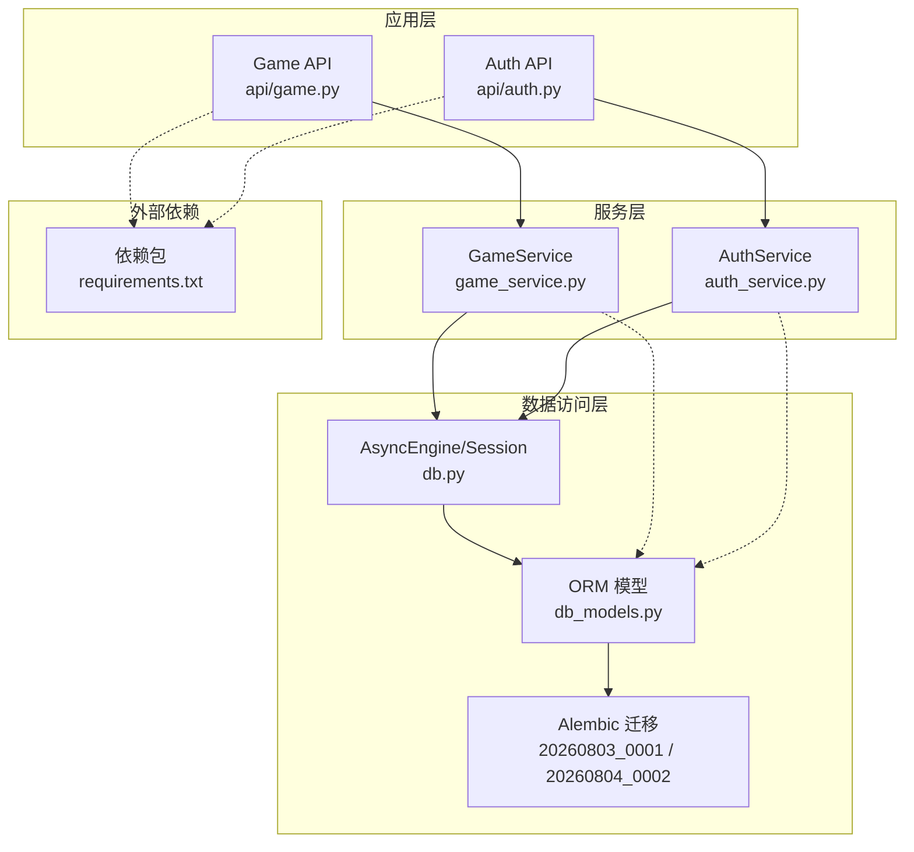
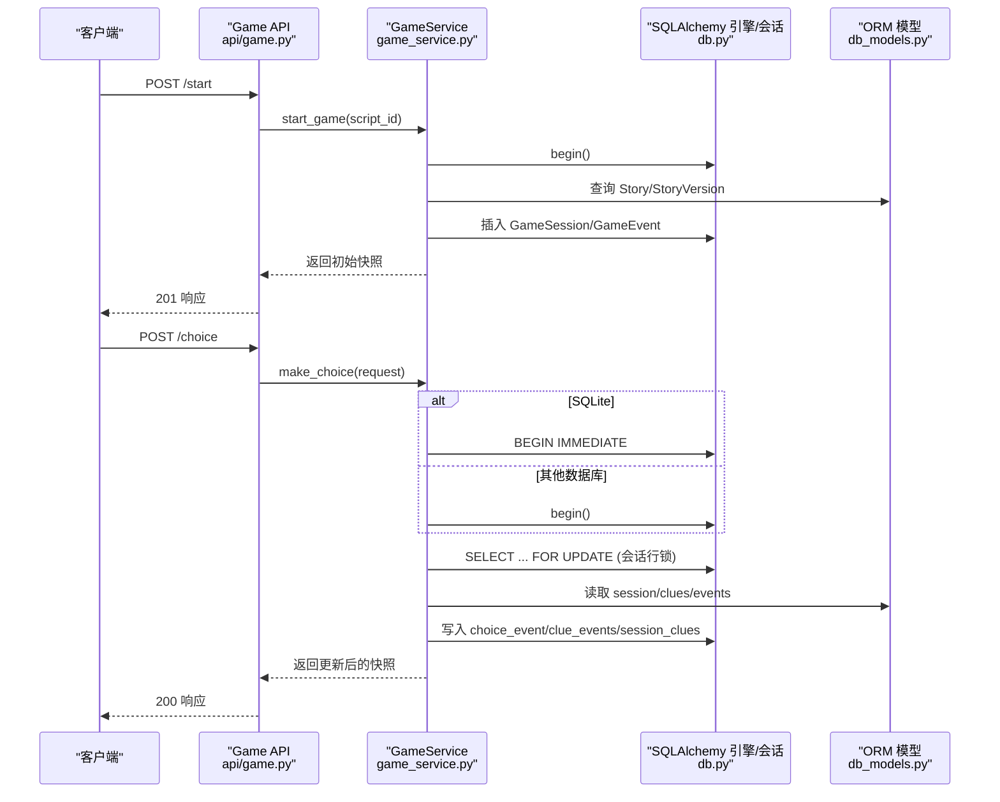
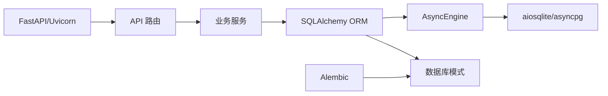
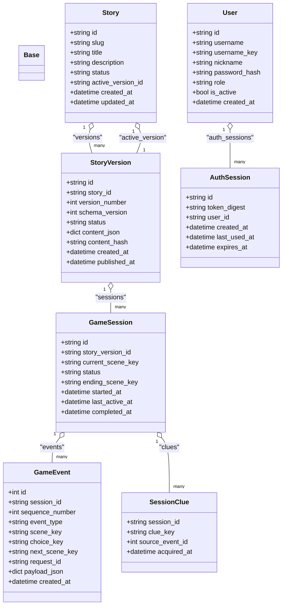
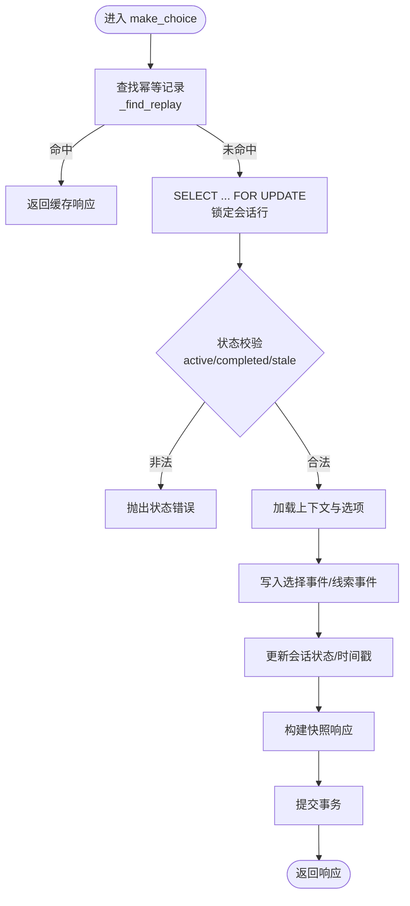

# 性能优化与索引

<cite>
**本文引用的文件**   
- [db.py](file://backend/app/db.py)
- [db_models.py](file://backend/app/db_models.py)
- [config.py](file://backend/app/config.py)
- [20260803_0001_game_persistence.py](file://backend/alembic/versions/20260803_0001_game_persistence.py)
- [20260804_0002_auth_persistence.py](file://backend/alembic/versions/20260804_0002_auth_persistence.py)
- [game_service.py](file://backend/app/game_service.py)
- [auth_service.py](file://backend/app/auth_service.py)
- [api/game.py](file://backend/app/api/game.py)
- [api/auth.py](file://backend/app/api/auth.py)
- [requirements.txt](file://backend/requirements.txt)
- [test_game_api.py](file://backend/tests/test_game_api.py)
- [test_health.py](file://backend/tests/test_health.py)
</cite>

## 目录
1. [简介](#简介)
2. [项目结构](#项目结构)
3. [核心组件](#核心组件)
4. [架构总览](#架构总览)
5. [详细组件分析](#详细组件分析)
6. [依赖关系分析](#依赖关系分析)
7. [性能考量](#性能考量)
8. [故障排查指南](#故障排查指南)
9. [结论](#结论)
10. [附录](#附录)

## 简介
本文件聚焦澳秘 Macau Mystery 后端的数据库性能优化，围绕现有索引策略（主键、唯一约束、外键）、查询性能分析方法、慢查询识别与优化技巧、JSON 字段查询优化、全文搜索支持、缓存策略、连接池配置、事务管理与并发控制、监控工具与容量规划等方面展开。文档以代码为依据，提供可操作的优化建议与可视化图示，帮助读者快速定位瓶颈并落地改进。

## 项目结构
后端采用 FastAPI + SQLAlchemy 异步 ORM + Alembic 迁移的架构，核心数据模型与持久化逻辑集中在 db_models.py 与 alembic 迁移脚本中；数据库引擎与会话管理在 db.py 中实现；游戏流程与认证流程分别由 game_service.py 与 auth_service.py 承载；API 路由位于 api 子模块。

图表来源
- [api/game.py:1-37](file://backend/app/api/game.py#L1-L37)
- [api/auth.py:1-97](file://backend/app/api/auth.py#L1-L97)
- [game_service.py:1-386](file://backend/app/game_service.py#L1-L386)
- [auth_service.py:1-153](file://backend/app/auth_service.py#L1-L153)
- [db.py:1-42](file://backend/app/db.py#L1-L42)
- [db_models.py:1-160](file://backend/app/db_models.py#L1-L160)
- [20260803_0001_game_persistence.py:1-129](file://backend/alembic/versions/20260803_0001_game_persistence.py#L1-L129)
- [20260804_0002_auth_persistence.py:1-55](file://backend/alembic/versions/20260804_0002_auth_persistence.py#L1-L55)
- [requirements.txt:1-17](file://backend/requirements.txt#L1-L17)

章节来源
- [db.py:1-42](file://backend/app/db.py#L1-L42)
- [db_models.py:1-160](file://backend/app/db_models.py#L1-L160)
- [config.py:1-77](file://backend/app/config.py#L1-L77)
- [20260803_0001_game_persistence.py:1-129](file://backend/alembic/versions/20260803_0001_game_persistence.py#L1-L129)
- [20260804_0002_auth_persistence.py:1-55](file://backend/alembic/versions/20260804_0002_auth_persistence.py#L1-L55)
- [game_service.py:1-386](file://backend/app/game_service.py#L1-L386)
- [auth_service.py:1-153](file://backend/app/auth_service.py#L1-L153)
- [api/game.py:1-37](file://backend/app/api/game.py#L1-L37)
- [api/auth.py:1-97](file://backend/app/api/auth.py#L1-L97)
- [requirements.txt:1-17](file://backend/requirements.txt#L1-L17)

## 核心组件
- 数据库引擎与会话：使用 create_async_engine 创建异步引擎，启用 pool_pre_ping 健康检查；SQLite 下通过事件监听开启外键约束与 busy_timeout；会话工厂 expire_on_commit=False 避免提交后对象过期问题。
- 数据模型与约束：定义 stories、story_versions、game_sessions、game_events、session_clues、users、auth_sessions 等表，包含主键、唯一约束、Check 约束与外键关系；部分字段显式建立索引以提升查询性能。
- 游戏服务：封装 start_game、make_choice、get_state 等关键流程，使用 with_for_update 行级锁保证并发安全，并通过 request_id 幂等性避免重复推进。
- 认证服务：用户注册/登录、Bearer Token 校验与权限控制，使用 joinedload 减少 N+1 查询。
- API 路由：FastAPI 路由将请求映射到服务方法，统一依赖注入数据库会话。

章节来源
- [db.py:1-42](file://backend/app/db.py#L1-L42)
- [db_models.py:1-160](file://backend/app/db_models.py#L1-L160)
- [game_service.py:1-386](file://backend/app/game_service.py#L1-L386)
- [auth_service.py:1-153](file://backend/app/auth_service.py#L1-L153)
- [api/game.py:1-37](file://backend/app/api/game.py#L1-L37)
- [api/auth.py:1-97](file://backend/app/api/auth.py#L1-L97)

## 架构总览
下图展示从 API 到数据库的调用链路与关键数据流，包括选择分支的事务边界、幂等回放与并发控制点。

图表来源
- [api/game.py:1-37](file://backend/app/api/game.py#L1-L37)
- [game_service.py:70-193](file://backend/app/game_service.py#L70-L193)
- [db.py:1-42](file://backend/app/db.py#L1-L42)
- [db_models.py:74-112](file://backend/app/db_models.py#L74-L112)

## 详细组件分析

### 索引策略与效果分析
- 主键索引
  - 所有表的主键列均自动建立主键索引，用于 O(1)/O(logN) 级别的主键查找与关联更新。
  - 示例：stories.id、story_versions.id、game_sessions.id、game_events.id、users.id、auth_sessions.id。
- 唯一约束索引
  - stories.slug 唯一且建索引，加速按 slug 查找已发布剧本。
  - story_versions 上存在 (story_id, version_number) 与 (story_id, content_hash) 唯一约束，确保版本唯一性与内容去重。
  - game_events 上存在 (session_id, sequence_number) 与 (session_id, request_id) 唯一约束，保障序列号唯一与幂等回放。
  - users.username_key 唯一且建索引，加速用户名归一化查找。
  - auth_sessions.token_digest 唯一且建索引，加速令牌校验。
- 外键索引
  - game_sessions.story_version_id 显式索引，加速按版本查询会话。
  - game_events.session_id 显式索引，加速会话事件检索。
  - session_clues.session_id 作为复合主键一部分，天然具备高效查找能力。
  - stories.active_version_id 指向 story_versions.id，外键约束确保一致性。
  - auth_sessions.user_id 显式索引，加速按用户查询会话。
- 检查约束
  - status、role 等字段使用 CheckConstraint 限制取值范围，减少无效数据写入带来的后续过滤成本。

优化建议
- 对高频过滤条件增加覆盖索引或复合索引，例如：
  - game_events(session_id, created_at) 用于按会话时间线查询。
  - game_sessions(status, last_active_at) 用于活跃会话统计。
- JSON 字段若需频繁按内部键值过滤，考虑生成虚拟列并索引（视数据库方言而定）。

章节来源
- [db_models.py:24-160](file://backend/app/db_models.py#L24-L160)
- [20260803_0001_game_persistence.py:17-129](file://backend/alembic/versions/20260803_0001_game_persistence.py#L17-L129)
- [20260804_0002_auth_persistence.py:17-55](file://backend/alembic/versions/20260804_0002_auth_persistence.py#L17-L55)

### 查询性能分析与慢查询识别
- 分析方法
  - 使用 EXPLAIN/EXPLAIN ANALYZE 查看执行计划，关注全表扫描、临时表、文件排序、回表次数。
  - 结合数据库慢查询日志（PostgreSQL log_min_duration_statement、MySQL slow_query_log）定位热点 SQL。
  - 在应用层埋点记录关键路径耗时（如 _next_sequence_number、_find_replay、_session_clues）。
- 常见慢查询模式
  - 缺少索引导致的全表扫描与排序。
  - N+1 查询未使用 joinedload/selectinload。
  - JSON 字段函数式过滤无法命中索引。
- 优化技巧
  - 为 where/order by/group by 常用列添加合适索引。
  - 使用 with_for_update 锁定热点行，避免竞态导致的重试与回滚。
  - 拆分大事务，减少锁持有时间。
  - 对只读热点数据引入缓存（见“缓存策略”）。

章节来源
- [game_service.py:339-351](file://backend/app/game_service.py#L339-L351)
- [auth_service.py:100-123](file://backend/app/auth_service.py#L100-L123)

### JSON 字段查询优化
- 现状
  - story_versions.content_json 存储完整剧情文档；game_events.payload_json 存储请求/响应负载。
  - 当前查询主要基于结构化列（id、session_id、status 等），JSON 字段多用于序列化/反序列化。
- 优化方向
  - 若需按 JSON 内嵌键值过滤，建议在数据库层面生成虚拟列并加索引（例如 PostgreSQL jsonb_path_ops、MySQL generated column + index）。
  - 对 payload_json 的查询尽量限定范围（如仅按 session_id + request_id 精确匹配），避免对 JSON 进行复杂解析。
  - 对历史事件归档时，可将大 JSON 下沉至对象存储，保留元数据在表中。

章节来源
- [db_models.py:52-71](file://backend/app/db_models.py#L52-L71)
- [db_models.py:93-112](file://backend/app/db_models.py#L93-L112)

### 全文搜索支持
- 现状
  - 当前未实现全文检索；如需对故事标题、描述或事件类型进行文本搜索，可引入数据库内置全文索引（PostgreSQL tsvector/tsquery、MySQL FULLTEXT）。
- 建议方案
  - 对需要搜索的文本列建立全文索引，配合 FTS 查询提升召回与性能。
  - 对于更复杂的语义搜索需求，可结合向量数据库（项目中已有 chroma_client 相关模块）构建混合检索。

章节来源
- [db_models.py:24-38](file://backend/app/db_models.py#L24-L38)
- [db_models.py:93-107](file://backend/app/db_models.py#L93-L107)

### 缓存策略
- 适用场景
  - 已发布剧本与媒体元数据（只读、变更不频繁）。
  - 热门场景预加载信息（choices.preload）。
- 建议方案
  - 使用 Redis/Memcached 缓存热点数据，设置合理 TTL 与失效策略（版本变更后主动失效）。
  - 对幂等回放结果可短期缓存，降低重复计算压力。
  - 注意缓存一致性与分布式锁，避免脏读。

[本节为概念性内容，不直接分析具体文件]

### 连接池配置与事务管理最佳实践
- 连接池
  - 使用 pool_pre_ping 检测连接有效性，避免使用失效连接。
  - SQLite 下启用 PRAGMA foreign_keys=ON 与 busy_timeout=5000，提升并发写稳定性。
  - 生产环境建议使用 asyncpg（PostgreSQL）以获得更高吞吐。
- 事务
  - 使用 session.begin() 包裹写操作，缩短事务粒度。
  - SQLite 下使用 BEGIN IMMEDIATE 避免写冲突。
  - 对热点行使用 with_for_update 行级锁，防止并发写竞争。
- 会话复用
  - expire_on_commit=False 避免提交后对象过期导致的额外查询。

章节来源
- [db.py:12-27](file://backend/app/db.py#L12-L27)
- [game_service.py:70-92](file://backend/app/game_service.py#L70-L92)
- [requirements.txt:1-17](file://backend/requirements.txt#L1-L17)

### 并发访问控制
- 行级锁
  - make_choice 中对 GameSession 使用 with_for_update，确保同一会话的选择推进串行化。
- 幂等性
  - 通过 game_events.request_id 唯一约束与幂等回放机制，避免重复提交导致的状态不一致。
- 测试验证
  - 并发选择测试验证 SQLite 下最多一次推进，且出现 STALE_SCENE 错误保护。

章节来源
- [game_service.py:84-193](file://backend/app/game_service.py#L84-L193)
- [test_game_api.py:186-209](file://backend/tests/test_game_api.py#L186-L209)

## 依赖关系分析
- 运行时依赖
  - fastapi、uvicorn 提供 Web 框架与 ASGI 服务器。
  - sqlalchemy、aiosqlite、asyncpg 提供异步 ORM 与驱动。
  - alembic 负责数据库迁移。
  - pwdlib[argon2] 用于密码哈希。
- 模块耦合
  - API 层依赖服务层；服务层依赖 ORM 模型与数据库引擎；迁移脚本与模型保持同步。

图表来源
- [requirements.txt:1-17](file://backend/requirements.txt#L1-L17)
- [api/game.py:1-37](file://backend/app/api/game.py#L1-L37)
- [game_service.py:1-386](file://backend/app/game_service.py#L1-L386)
- [db.py:1-42](file://backend/app/db.py#L1-L42)

章节来源
- [requirements.txt:1-17](file://backend/requirements.txt#L1-L17)
- [api/game.py:1-37](file://backend/app/api/game.py#L1-L37)
- [game_service.py:1-386](file://backend/app/game_service.py#L1-L386)
- [db.py:1-42](file://backend/app/db.py#L1-L42)

## 性能考量
- 索引设计
  - 优先为主键、外键、唯一约束与高频过滤列建立索引。
  - 复合索引应遵循最左前缀原则，覆盖 where/order by/group by 常用组合。
- 查询优化
  - 避免 SELECT *，按需选取列；合理使用 joinedload/selectinload 减少 N+1。
  - 对 JSON 字段避免函数式过滤，必要时使用虚拟列+索引。
- 事务与锁
  - 缩小事务范围，减少锁持有时间；热点行使用行级锁。
- 连接池
  - 根据并发量调整 pool_size、max_overflow、pool_recycle 等参数。
  - SQLite 适合开发/小规模；生产推荐 PostgreSQL + asyncpg。
- 缓存
  - 对只读热点数据引入缓存，设置合理 TTL 与失效策略。
- 监控
  - 启用慢查询日志与 APM 指标，持续跟踪 QPS、延迟、错误率与资源使用。

[本节为通用指导，不直接分析具体文件]

## 故障排查指南
- 健康检查
  - 使用 /api/v1/health 检查数据库连通性，测试用例覆盖健康端点。
- 常见问题
  - 连接失败：检查 DATABASE_URL、网络与权限；确认 pool_pre_ping 生效。
  - 死锁/超时：观察事务长度与锁竞争，适当拆分事务或优化索引。
  - 幂等冲突：检查 request_id 是否重复且请求体不一致。
  - 状态异常：核对 session.status 与 scene 一致性，避免 STALE_SCENE。
- 调试手段
  - 打印慢查询与执行计划；在关键路径加入计时与日志。
  - 使用 pytest 复现问题，构造最小可复现场景。

章节来源
- [test_health.py:1-22](file://backend/tests/test_health.py#L1-L22)
- [game_service.py:353-368](file://backend/app/game_service.py#L353-L368)

## 结论
本项目在索引设计与并发控制方面已具备良好基础：主键/唯一/外键索引完善，事务边界清晰，行级锁与幂等性保障了高并发下的正确性。进一步优化方向包括：针对 JSON 字段的查询优化、全文检索能力扩展、缓存策略落地、连接池参数调优与监控体系完善。通过持续的慢查询分析与容量规划，可在保证一致性的前提下显著提升吞吐与延迟表现。

[本节为总结性内容，不直接分析具体文件]

## 附录

### 数据模型类图

图表来源
- [db_models.py:24-160](file://backend/app/db_models.py#L24-L160)

### 选择推进流程图（含幂等与并发控制）

图表来源
- [game_service.py:84-193](file://backend/app/game_service.py#L84-L193)