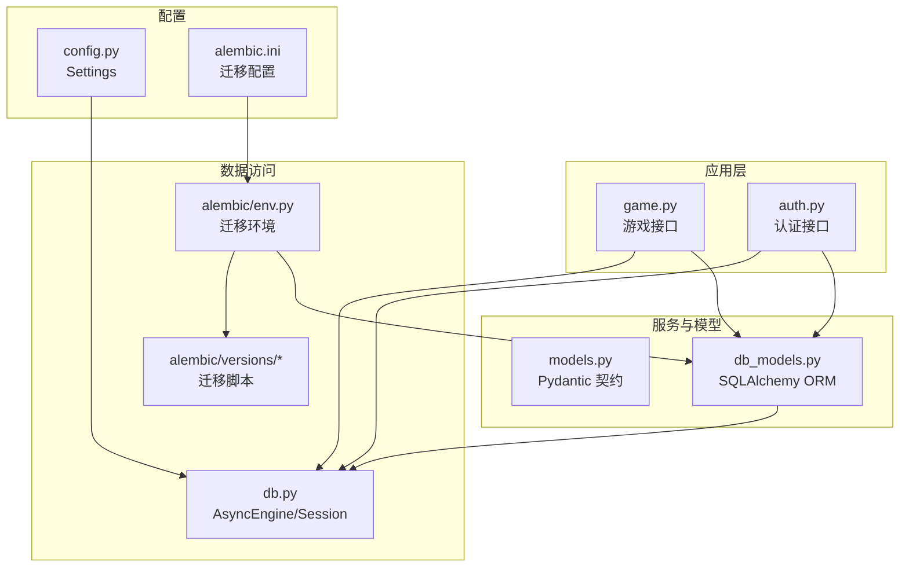
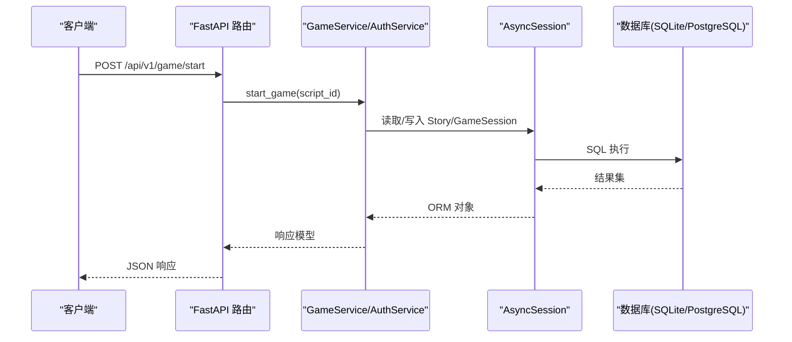
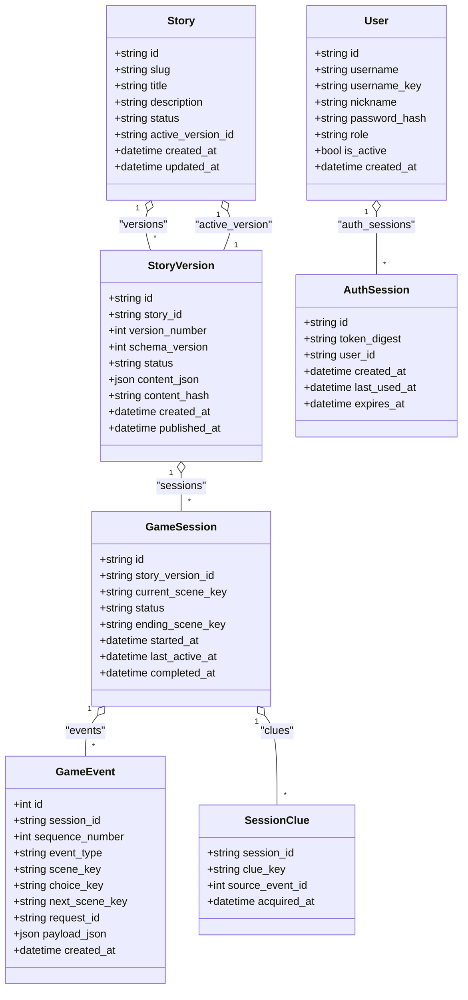
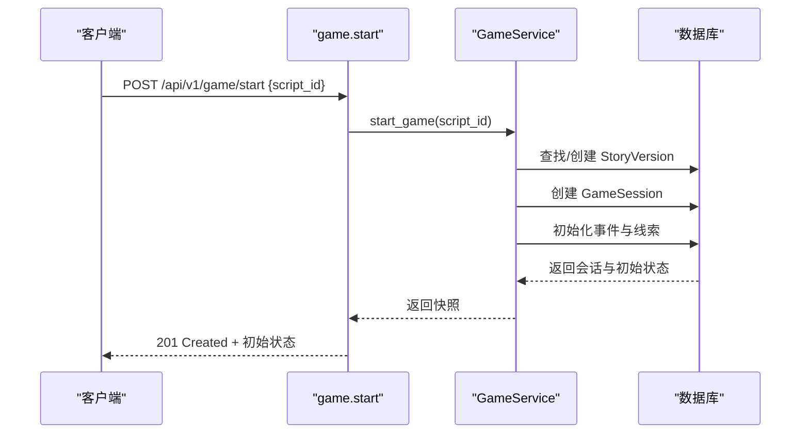
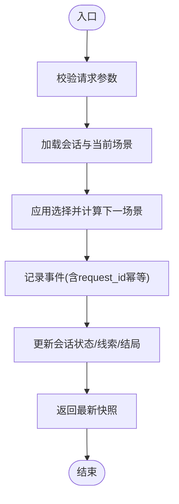
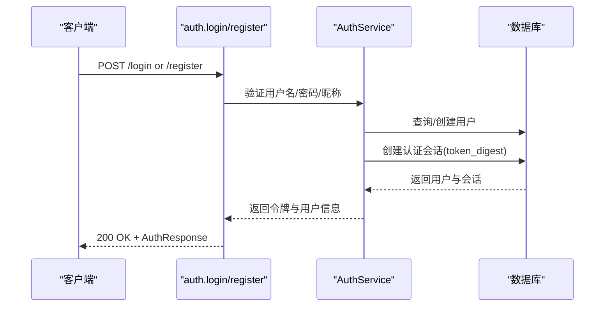
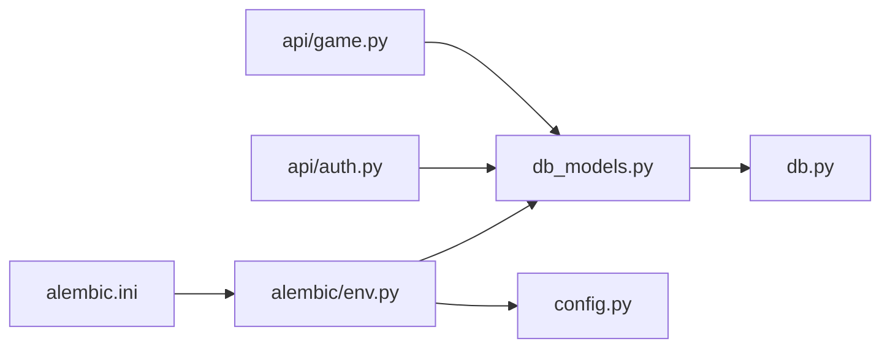

# 数据库设计

<cite>
**本文引用的文件**   
- [backend/app/db_models.py](file://backend/app/db_models.py)
- [backend/app/models.py](file://backend/app/models.py)
- [backend/app/db.py](file://backend/app/db.py)
- [backend/alembic/env.py](file://backend/alembic/env.py)
- [backend/alembic/versions/20260803_0001_game_persistence.py](file://backend/alembic/versions/20260803_0001_game_persistence.py)
- [backend/alembic/versions/20260804_0002_auth_persistence.py](file://backend/alembic/versions/20260804_0002_auth_persistence.py)
- [backend/alembic.ini](file://backend/alembic.ini)
- [backend/app/config.py](file://backend/app/config.py)
- [backend/app/api/game.py](file://backend/app/api/game.py)
- [backend/app/api/auth.py](file://backend/app/api/auth.py)
</cite>

## 目录
1. [简介](#简介)
2. [项目结构](#项目结构)
3. [核心组件](#核心组件)
4. [架构总览](#架构总览)
5. [详细组件分析](#详细组件分析)
6. [依赖关系分析](#依赖关系分析)
7. [性能与优化](#性能与优化)
8. [故障排查指南](#故障排查指南)
9. [结论](#结论)
10. [附录](#附录)

## 简介
本技术文档围绕澳秘 Macau Mystery 的数据库设计展开，覆盖 SQLAlchemy ORM 模型、表结构与关系映射策略，重点解释用户表、故事表、游戏会话表和事件日志表的设计原理。文档还包含主键/外键约束、索引优化、数据完整性保证、Alembic 迁移管理、数据版本控制与备份恢复建议，以及查询优化、性能调优和故障排查方法，为数据库开发者与运维人员提供完整的数据架构指导。

## 项目结构
后端采用 FastAPI + SQLAlchemy 异步引擎 + Alembic 迁移方案。数据库相关代码集中在以下位置：
- ORM 模型定义：backend/app/db_models.py
- Pydantic 请求/响应模型：backend/app/models.py
- 数据库引擎与会话管理：backend/app/db.py
- Alembic 环境与迁移脚本：backend/alembic/env.py、backend/alembic/versions/*
- 配置与环境变量：backend/app/config.py、backend/alembic.ini
- API 层使用数据库会话：backend/app/api/game.py、backend/app/api/auth.py

图表来源
- [backend/app/api/game.py:1-37](file://backend/app/api/game.py#L1-L37)
- [backend/app/api/auth.py:1-97](file://backend/app/api/auth.py#L1-L97)
- [backend/app/db_models.py:1-160](file://backend/app/db_models.py#L1-L160)
- [backend/app/db.py:1-42](file://backend/app/db.py#L1-L42)
- [backend/alembic/env.py:1-51](file://backend/alembic/env.py#L1-L51)
- [backend/alembic/versions/20260803_0001_game_persistence.py:1-129](file://backend/alembic/versions/20260803_0001_game_persistence.py#L1-L129)
- [backend/alembic/versions/20260804_0002_auth_persistence.py:1-55](file://backend/alembic/versions/20260804_0002_auth_persistence.py#L1-L55)
- [backend/app/config.py:1-77](file://backend/app/config.py#L1-L77)
- [backend/alembic.ini:1-37](file://backend/alembic.ini#L1-L37)

章节来源
- [backend/app/db_models.py:1-160](file://backend/app/db_models.py#L1-L160)
- [backend/app/db.py:1-42](file://backend/app/db.py#L1-L42)
- [backend/alembic/env.py:1-51](file://backend/alembic/env.py#L1-L51)
- [backend/alembic/versions/20260803_0001_game_persistence.py:1-129](file://backend/alembic/versions/20260803_0001_game_persistence.py#L1-L129)
- [backend/alembic/versions/20260804_0002_auth_persistence.py:1-55](file://backend/alembic/versions/20260804_0002_auth_persistence.py#L1-L55)
- [backend/app/config.py:1-77](file://backend/app/config.py#L1-L77)
- [backend/alembic.ini:1-37](file://backend/alembic.ini#L1-L37)
- [backend/app/api/game.py:1-37](file://backend/app/api/game.py#L1-L37)
- [backend/app/api/auth.py:1-97](file://backend/app/api/auth.py#L1-L97)

## 核心组件
- SQLAlchemy ORM 模型（db_models.py）：定义 stories、story_versions、game_sessions、game_events、session_clues、users、auth_sessions 等实体及关系映射。
- 数据库连接与会话（db.py）：创建异步引擎、会话工厂、健康检查；针对 SQLite 启用外键与忙超时。
- Alembic 迁移（env.py 与 versions/*）：离线/在线迁移执行，目标元数据绑定到 Base.metadata，支持 SQLite 与 PostgreSQL。
- 配置（config.py、alembic.ini）：数据库 URL、CORS、环境变量注入；迁移默认指向本地 SQLite 文件。
- API 层（api/game.py、api/auth.py）：通过 FastAPI 依赖注入 AsyncSession，调用 GameService 或 AuthService 进行持久化操作。

章节来源
- [backend/app/db_models.py:1-160](file://backend/app/db_models.py#L1-L160)
- [backend/app/db.py:1-42](file://backend/app/db.py#L1-L42)
- [backend/alembic/env.py:1-51](file://backend/alembic/env.py#L1-L51)
- [backend/alembic/versions/20260803_0001_game_persistence.py:1-129](file://backend/alembic/versions/20260803_0001_game_persistence.py#L1-L129)
- [backend/alembic/versions/20260804_0002_auth_persistence.py:1-55](file://backend/alembic/versions/20260804_0002_auth_persistence.py#L1-L55)
- [backend/app/config.py:1-77](file://backend/app/config.py#L1-L77)
- [backend/alembic.ini:1-37](file://backend/alembic.ini#L1-L37)
- [backend/app/api/game.py:1-37](file://backend/app/api/game.py#L1-L37)
- [backend/app/api/auth.py:1-97](file://backend/app/api/auth.py#L1-L97)

## 架构总览
系统采用“API 层 -> 服务层 -> ORM 模型 -> 数据库”的分层架构。FastAPI 路由通过依赖注入获取 AsyncSession，调用业务服务完成数据读写；ORM 模型负责表结构与关系映射；Alembic 负责数据库版本演进。SQLite 在开发环境下默认启用外键约束与忙超时，生产环境可通过 DATABASE_URL 切换至 PostgreSQL。

图表来源
- [backend/app/api/game.py:1-37](file://backend/app/api/game.py#L1-L37)
- [backend/app/db.py:1-42](file://backend/app/db.py#L1-L42)
- [backend/app/db_models.py:1-160](file://backend/app/db_models.py#L1-L160)

## 详细组件分析

### 实体关系与类图

图表来源
- [backend/app/db_models.py:24-160](file://backend/app/db_models.py#L24-L160)

章节来源
- [backend/app/db_models.py:24-160](file://backend/app/db_models.py#L24-L160)

### 表结构与约束详解

#### 故事与版本（stories、story_versions）
- stories：主键 id（UUID），唯一 slug，状态枚举校验（draft/published/retired），active_version_id 指向当前活跃版本（SET NULL）。
- story_versions：主键 id，唯一 (story_id, version_number)，唯一 (story_id, content_hash) 用于去重；status 枚举校验；JSON content 存储剧本内容。
- 关系：Story 与 StoryVersion 一对多；Story.active_version 延迟加载并 post_update。

章节来源
- [backend/app/db_models.py:24-71](file://backend/app/db_models.py#L24-L71)
- [backend/alembic/versions/20260803_0001_game_persistence.py:17-68](file://backend/alembic/versions/20260803_0001_game_persistence.py#L17-L68)

#### 游戏会话（game_sessions）
- 主键 id（UUID），关联 story_version_id（RESTRICT），current_scene_key 记录当前场景，status 枚举（active/completed/abandoned），时间戳字段记录生命周期。
- 索引：对 story_version_id 建立索引以加速按版本查询会话。

章节来源
- [backend/app/db_models.py:74-90](file://backend/app/db_models.py#L74-L90)
- [backend/alembic/versions/20260803_0001_game_persistence.py:70-84](file://backend/alembic/versions/20260803_0001_game_persistence.py#L70-L84)

#### 事件日志（game_events）
- 自增主键 id，关联 session_id（CASCADE），sequence_number 确保事件顺序，event_type 描述事件类型，可选 scene_key/choice_key/next_scene_key/request_id，payload_json 存储扩展数据。
- 唯一约束：(session_id, sequence_number)、(session_id, request_id) 防止重复事件与幂等写入。
- 索引：对 session_id 建立索引以加速按会话查询事件。

章节来源
- [backend/app/db_models.py:93-113](file://backend/app/db_models.py#L93-L113)
- [backend/alembic/versions/20260803_0001_game_persistence.py:85-102](file://backend/alembic/versions/20260803_0001_game_persistence.py#L85-L102)

#### 线索（session_clues）
- 复合主键 (session_id, clue_key)，可选 source_event_id（SET NULL），acquired_at 记录获得时间。
- 关系：与 game_sessions 级联删除，与 game_events 软关联便于溯源。

章节来源
- [backend/app/db_models.py:115-127](file://backend/app/db_models.py#L115-L127)
- [backend/alembic/versions/20260803_0001_game_persistence.py:103-112](file://backend/alembic/versions/20260803_0001_game_persistence.py#L103-L112)

#### 用户与认证会话（users、auth_sessions）
- users：主键 id（UUID），username、username_key（唯一+索引）、nickname、password_hash、role（admin/user 校验）、is_active、created_at。
- auth_sessions：主键 id（UUID），token_digest（唯一+索引），user_id（CASCADE），时间戳 created_at/last_used_at/expires_at。
- 关系：User.auth_sessions 一对多。

章节来源
- [backend/app/db_models.py:128-160](file://backend/app/db_models.py#L128-L160)
- [backend/alembic/versions/20260804_0002_auth_persistence.py:17-46](file://backend/alembic/versions/20260804_0002_auth_persistence.py#L17-L46)

### 数据流与处理逻辑

#### 游戏开始流程（start_game）

图表来源
- [backend/app/api/game.py:15-21](file://backend/app/api/game.py#L15-L21)
- [backend/app/db_models.py:74-90](file://backend/app/db_models.py#L74-L90)

#### 选择分支流程（make_choice）

图表来源
- [backend/app/api/game.py:23-28](file://backend/app/api/game.py#L23-L28)
- [backend/app/db_models.py:93-113](file://backend/app/db_models.py#L93-L113)

#### 登录注册流程（auth）

图表来源
- [backend/app/api/auth.py:64-87](file://backend/app/api/auth.py#L64-L87)
- [backend/app/db_models.py:128-160](file://backend/app/db_models.py#L128-L160)

### 数据模型与复杂度分析
- 主键策略：除 game_events 使用自增整数主键外，其余均使用 UUID（String(36)），有利于分布式生成与避免序列竞争。
- 唯一性与约束：
  - stories.slug 唯一且索引，便于快速定位故事。
  - story_versions 的 (story_id, version_number) 与 (story_id, content_hash) 双重唯一，保障版本有序与内容去重。
  - game_events 的 (session_id, sequence_number) 与 (session_id, request_id) 唯一，保障事件顺序与幂等性。
  - users.username_key 唯一且索引，auth_sessions.token_digest 唯一且索引。
- 外键与级联：
  - stories.active_version_id -> story_versions.id（SET NULL），版本删除不影响故事主体。
  - game_sessions.story_version_id -> story_versions.id（RESTRICT），防止误删活跃版本。
  - game_events.session_id -> game_sessions.id（CASCADE），会话删除清理事件。
  - session_clues.session_id -> game_sessions.id（CASCADE），source_event_id -> game_events.id（SET NULL）。
  - auth_sessions.user_id -> users.id（CASCADE）。
- 索引优化：
  - stories.slug、game_sessions.story_version_id、game_events.session_id、users.username_key、auth_sessions.token_digest/user_id 均有索引，提升常见查询路径性能。
- JSON 字段：
  - story_versions.content_json、game_events.payload_json 存储灵活结构，适合剧本与事件载荷扩展。

章节来源
- [backend/app/db_models.py:24-160](file://backend/app/db_models.py#L24-L160)
- [backend/alembic/versions/20260803_0001_game_persistence.py:17-112](file://backend/alembic/versions/20260803_0001_game_persistence.py#L17-L112)
- [backend/alembic/versions/20260804_0002_auth_persistence.py:17-46](file://backend/alembic/versions/20260804_0002_auth_persistence.py#L17-L46)

### Alembic 迁移管理与数据版本控制
- 环境配置（env.py）：
  - 设置 sqlalchemy.url 为 Settings.database_url，target_metadata 绑定 Base.metadata。
  - 支持离线模式（literal_binds）与在线模式（异步引擎 NullPool）。
- 迁移脚本：
  - 20260803_0001_game_persistence.py：创建故事、版本、会话、事件、线索表，添加约束与索引，处理 SQLite 外键差异。
  - 20260804_0002_auth_persistence.py：创建用户与认证会话表，添加唯一约束与索引。
- alembic.ini：默认 sqlite+aiosqlite:///./macau_mystery.db，可替换为 PostgreSQL 连接串。

章节来源
- [backend/alembic/env.py:1-51](file://backend/alembic/env.py#L1-L51)
- [backend/alembic/versions/20260803_0001_game_persistence.py:1-129](file://backend/alembic/versions/20260803_0001_game_persistence.py#L1-L129)
- [backend/alembic/versions/20260804_0002_auth_persistence.py:1-55](file://backend/alembic/versions/20260804_0002_auth_persistence.py#L1-L55)
- [backend/alembic.ini:1-37](file://backend/alembic.ini#L1-L37)

### 备份与恢复机制建议
- SQLite：
  - 冷备：停止服务后复制 macau_mystery.db 文件。
  - 热备：使用 WAL 模式与 PRAGMA wal_checkpoint 实现低影响备份（需在连接时开启）。
- PostgreSQL：
  - 使用 pg_dump/pg_restore 或云厂商提供的快照/备份计划。
- 恢复流程：
  - 先回滚迁移至目标版本，再导入数据；或在空库上运行迁移后导入。
- 建议：
  - 定期全量备份 + 增量日志备份。
  - 备份文件加密与异地存储。
  - 恢复演练纳入变更流程。

[本节为通用指导，不直接引用具体文件]

## 依赖关系分析
- API 层依赖 db_models 与 db 提供的会话。
- db_models 通过 Base 暴露 metadata，供 Alembic 使用。
- alembic.env 读取 config.Settings.database_url 并构建异步引擎。
- 配置通过环境变量注入，支持不同环境切换数据库。

图表来源
- [backend/app/api/game.py:1-37](file://backend/app/api/game.py#L1-L37)
- [backend/app/api/auth.py:1-97](file://backend/app/api/auth.py#L1-L97)
- [backend/app/db_models.py:1-160](file://backend/app/db_models.py#L1-L160)
- [backend/app/db.py:1-42](file://backend/app/db.py#L1-L42)
- [backend/alembic/env.py:1-51](file://backend/alembic/env.py#L1-L51)
- [backend/alembic.ini:1-37](file://backend/alembic.ini#L1-L37)
- [backend/app/config.py:1-77](file://backend/app/config.py#L1-L77)

章节来源
- [backend/app/api/game.py:1-37](file://backend/app/api/game.py#L1-L37)
- [backend/app/api/auth.py:1-97](file://backend/app/api/auth.py#L1-L97)
- [backend/app/db_models.py:1-160](file://backend/app/db_models.py#L1-L160)
- [backend/app/db.py:1-42](file://backend/app/db.py#L1-L42)
- [backend/alembic/env.py:1-51](file://backend/alembic/env.py#L1-L51)
- [backend/alembic.ini:1-37](file://backend/alembic.ini#L1-L37)
- [backend/app/config.py:1-77](file://backend/app/config.py#L1-L77)

## 性能与优化
- 连接池与健康检查：
  - create_async_engine 使用 pool_pre_ping=True 检测连接有效性。
  - SQLite 连接时启用 PRAGMA foreign_keys=ON 与 busy_timeout=5000，降低并发冲突风险。
- 索引策略：
  - 高频查询列已建索引（slug、story_version_id、session_id、username_key、token_digest、user_id）。
  - 若存在复杂过滤条件，考虑组合索引（如 session_id + event_type）。
- JSON 字段使用：
  - content_json/payload_json 适合扩展，但应避免过大负载；必要时拆分到独立表。
- 事务与幂等：
  - 通过 (session_id, request_id) 唯一约束实现事件幂等写入，避免重复提交。
- 查询优化建议：
  - 使用 selectinload/joinedload 减少 N+1 问题。
  - 分页查询 large result sets，限制返回字段。
  - 对时间范围查询使用 created_at/updated_at 索引。
- 生产环境建议：
  - 切换到 PostgreSQL 以获得更好的并发与功能支持。
  - 调整连接池大小与超时参数，监控慢查询。

章节来源
- [backend/app/db.py:12-23](file://backend/app/db.py#L12-L23)
- [backend/alembic/versions/20260803_0001_game_persistence.py:84-102](file://backend/alembic/versions/20260803_0001_game_persistence.py#L84-L102)
- [backend/alembic/versions/20260804_0002_auth_persistence.py:44-46](file://backend/alembic/versions/20260804_0002_auth_persistence.py#L44-L46)

## 故障排查指南
- 数据库连接失败：
  - 检查 DATABASE_URL 是否正确，SQLite 文件是否存在且可写。
  - 使用 check_database() 进行健康检查。
- 外键约束错误：
  - SQLite 需确保 PRAGMA foreign_keys=ON；确认 ondelete 策略是否符合预期。
- 唯一约束冲突：
  - 注册时 username_key 冲突、事件 request_id 重复等，检查输入校验与幂等逻辑。
- 迁移失败：
  - 确认 alembic.ini 的 sqlalchemy.url 与 env.py 的配置一致；离线/在线模式切换正确。
- 性能问题：
  - 查看慢查询日志，增加必要索引；避免全表扫描与大 JSON 字段。

章节来源
- [backend/app/db.py:35-42](file://backend/app/db.py#L35-L42)
- [backend/app/api/auth.py:78-87](file://backend/app/api/auth.py#L78-L87)
- [backend/alembic/env.py:20-44](file://backend/alembic/env.py#L20-L44)

## 结论
本数据库设计通过清晰的 ORM 模型与严格的约束体系，实现了故事版本化管理、游戏会话与事件追踪、用户认证与会话管理的完整能力。借助 Alembic 的版本控制与幂等写入策略，系统在可扩展性与一致性方面具备良好基础。结合索引优化、连接池配置与备份恢复建议，可为开发与生产环境提供稳定可靠的数据支撑。

[本节为总结性内容，不直接引用具体文件]

## 附录

### API 契约与数据模型（Pydantic）
- models.py 定义了游戏启动、选择、进度、线索、结局等响应模型，以及聊天、TTS、UGC 生成等请求/响应模型，作为 API 层的输入输出契约。

章节来源
- [backend/app/models.py:1-146](file://backend/app/models.py#L1-L146)