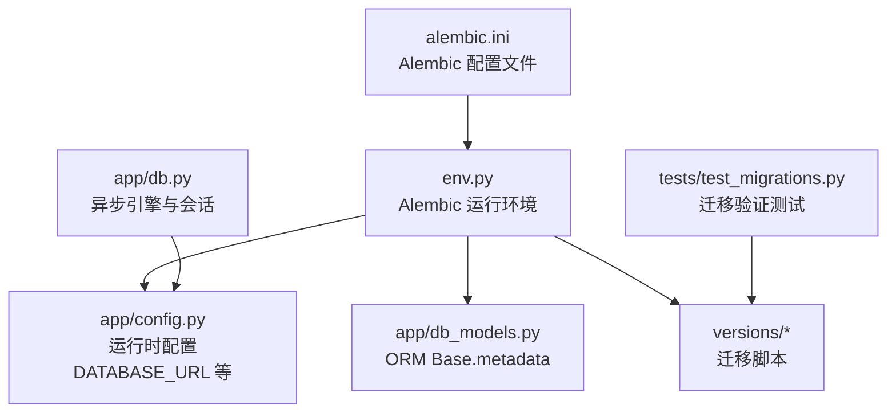
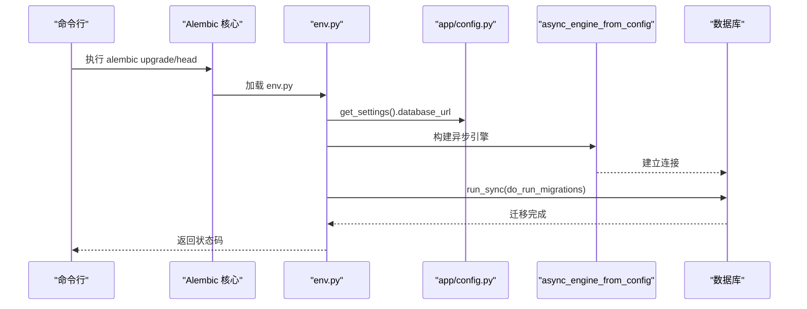
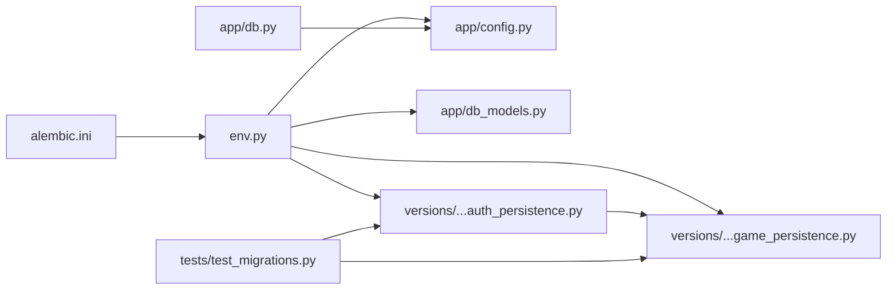

# 数据库迁移管理

<cite>
**本文引用的文件**   
- [backend/alembic.ini](file://backend/alembic.ini)
- [backend/alembic/env.py](file://backend/alembic/env.py)
- [backend/alembic/script.py.mako](file://backend/alembic/script.py.mako)
- [backend/alembic/versions/20260803_0001_game_persistence.py](file://backend/alembic/versions/20260803_0001_game_persistence.py)
- [backend/alembic/versions/20260804_0002_auth_persistence.py](file://backend/alembic/versions/20260804_0002_auth_persistence.py)
- [backend/app/config.py](file://backend/app/config.py)
- [backend/app/db_models.py](file://backend/app/db_models.py)
- [backend/app/db.py](file://backend/app/db.py)
- [backend/tests/test_migrations.py](file://backend/tests/test_migrations.py)
</cite>

## 目录
1. [简介](#简介)
2. [项目结构](#项目结构)
3. [核心组件](#核心组件)
4. [架构总览](#架构总览)
5. [详细组件分析](#详细组件分析)
6. [依赖关系分析](#依赖关系分析)
7. [性能考虑](#性能考虑)
8. [故障排查指南](#故障排查指南)
9. [结论](#结论)
10. [附录](#附录)

## 简介
本文件面向澳秘 Macau Mystery 后端的 Alembic 数据库迁移管理，系统性说明配置与环境设置、迁移脚本结构与实现、现有迁移（游戏持久化与用户认证）的具体操作，以及新增迁移、数据变更处理、回滚策略、生产部署注意事项、备份恢复流程与常见问题解决方案。文档力求在技术细节与可读性之间取得平衡，帮助开发者快速上手并安全地演进数据库结构。

## 项目结构
后端使用 Alembic 进行版本化的数据库迁移，迁移脚本位于 backend/alembic/versions，环境配置由 alembic.ini 与 env.py 共同驱动，运行时数据库连接通过 app/config.py 与 app/db.py 提供。ORM 模型定义在 app/db_models.py，测试覆盖迁移结果在 tests/test_migrations.py。

图表来源
- [backend/alembic.ini:1-37](file://backend/alembic.ini#L1-L37)
- [backend/alembic/env.py:1-51](file://backend/alembic/env.py#L1-L51)
- [backend/app/config.py:1-77](file://backend/app/config.py#L1-L77)
- [backend/app/db_models.py:1-160](file://backend/app/db_models.py#L1-L160)
- [backend/tests/test_migrations.py:1-61](file://backend/tests/test_migrations.py#L1-L61)

章节来源
- [backend/alembic.ini:1-37](file://backend/alembic.ini#L1-L37)
- [backend/alembic/env.py:1-51](file://backend/alembic/env.py#L1-L51)
- [backend/app/config.py:1-77](file://backend/app/config.py#L1-L77)
- [backend/app/db_models.py:1-160](file://backend/app/db_models.py#L1-L160)
- [backend/tests/test_migrations.py:1-61](file://backend/tests/test_migrations.py#L1-L61)

## 核心组件
- Alembic 配置与日志：alembic.ini 指定脚本位置、SQLAlchemy URL、日志级别与处理器。
- Alembic 运行环境：env.py 读取配置、注入目标元数据、支持离线与在线模式，并使用异步引擎执行迁移。
- 迁移模板：script.py.mako 生成 upgrade/downgrade 骨架。
- 迁移脚本：versions 下的具体迁移文件，分别负责游戏持久化与用户认证表结构的创建与维护。
- 运行时配置：config.py 提供 database_url 等环境变量解析，默认 SQLite 路径。
- ORM 模型：db_models.py 定义 Base 与所有表模型，供 Alembic 对比差异。
- 数据库连接：db.py 创建异步引擎、启用 SQLite 外键约束与忙超时，并提供健康检查。
- 迁移测试：test_migrations.py 通过子进程调用 alembic upgrade head 并校验表结构。

章节来源
- [backend/alembic.ini:1-37](file://backend/alembic.ini#L1-L37)
- [backend/alembic/env.py:1-51](file://backend/alembic/env.py#L1-L51)
- [backend/alembic/script.py.mako:1-23](file://backend/alembic/script.py.mako#L1-L23)
- [backend/app/config.py:1-77](file://backend/app/config.py#L1-L77)
- [backend/app/db_models.py:1-160](file://backend/app/db_models.py#L1-L160)
- [backend/app/db.py:1-42](file://backend/app/db.py#L1-L42)
- [backend/tests/test_migrations.py:1-61](file://backend/tests/test_migrations.py#L1-L61)

## 架构总览
Alembic 在执行迁移时，优先从 alembic.ini 读取基础配置，再由 env.py 动态覆盖 sqlalchemy.url 为运行时配置的 DATABASE_URL。env.py 将 app.db_models.Base.metadata 作为目标元数据，用于自动检测差异或执行手动编写的迁移脚本。在线模式下使用异步引擎执行迁移，确保与应用的异步 I/O 风格一致。

图表来源
- [backend/alembic/env.py:1-51](file://backend/alembic/env.py#L1-L51)
- [backend/app/config.py:1-77](file://backend/app/config.py#L1-L77)

章节来源
- [backend/alembic/env.py:1-51](file://backend/alembic/env.py#L1-L51)
- [backend/app/config.py:1-77](file://backend/app/config.py#L1-L77)

## 详细组件分析

### Alembic 配置与环境设置
- alembic.ini
  - script_location 指向 alembic 目录。
  - sqlalchemy.url 默认 sqlite+aiosqlite:///./macau_mystery.db。
  - 日志级别与处理器已配置，便于调试迁移过程。
- env.py
  - 通过 context.config 获取配置，并用 get_settings().database_url 覆盖 URL。
  - target_metadata 绑定到 Base.metadata，使 Alembic 能感知 ORM 模型。
  - 提供 run_migrations_offline 与 run_migrations_online 两种模式；在线模式使用 async_engine_from_config 和 NullPool，避免连接池竞争。
  - do_run_migrations 使用 begin_transaction 包裹迁移执行，保证一致性。
- script.py.mako
  - 生成 revision、down_revision、upgrade/downgrade 函数骨架，便于编写迁移。

章节来源
- [backend/alembic.ini:1-37](file://backend/alembic.ini#L1-L37)
- [backend/alembic/env.py:1-51](file://backend/alembic/env.py#L1-L51)
- [backend/alembic/script.py.mako:1-23](file://backend/alembic/script.py.mako#L1-L23)

### 迁移脚本：游戏持久化（20260803_0001_game_persistence.py）
该迁移创建以下核心表与约束：
- stories：故事主表，包含 slug、title、description、status、active_version_id、时间戳，含状态枚举约束与 slug 唯一索引。
- story_versions：故事版本表，包含 version_number、schema_version、status、content_json、content_hash、时间戳，含唯一约束（story_id, version_number）与（story_id, content_hash）。
- game_sessions：游戏会话表，关联 story_versions，记录当前场景、状态、结束场景、开始/活跃/完成时间。
- game_events：事件流水表，按 session_id 与 sequence_number 唯一，支持 request_id 去重，存储事件类型、场景/选择/下一场景、payload JSON。
- session_clues：会话线索表，复合主键（session_id, clue_key），可追溯来源事件。

特殊处理：
- SQLite 下通过 batch_alter_table 添加 stories.active_version_id -> story_versions.id 的外键，其他方言直接创建外键。

回滚：
- downgrade 顺序删除表与索引，SQLite 下先 drop 外键再删表。

章节来源
- [backend/alembic/versions/20260803_0001_game_persistence.py:1-129](file://backend/alembic/versions/20260803_0001_game_persistence.py#L1-L129)

### 迁移脚本：用户认证（20260804_0002_auth_persistence.py）
该迁移创建以下表与约束：
- users：用户表，包含 username、username_key（唯一）、nickname、password_hash、role（admin/user）、is_active、时间戳。
- auth_sessions：认证会话表，token_digest 唯一，关联 users，记录创建/最后使用/过期时间。

回滚：
- 依次删除索引与表。

章节来源
- [backend/alembic/versions/20260804_0002_auth_persistence.py:1-55](file://backend/alembic/versions/20260804_0002_auth_persistence.py#L1-L55)

### ORM 模型与迁移一致性
- db_models.py 定义了 Base 及 Story、StoryVersion、GameSession、GameEvent、SessionClue、User、AuthSession 等模型，字段、约束与索引与迁移脚本保持一致，确保 Alembic 能正确识别差异。
- Base.metadata 被 env.py 用作目标元数据，是迁移与模型同步的关键。

章节来源
- [backend/app/db_models.py:1-160](file://backend/app/db_models.py#L1-L160)
- [backend/alembic/env.py:1-51](file://backend/alembic/env.py#L1-L51)

### 数据库连接与健康检查
- db.py 创建异步引擎，针对 SQLite 启用 PRAGMA foreign_keys=ON 与 busy_timeout，提升并发稳定性。
- SessionLocal 提供 AsyncSession 工厂，get_db_session 为 FastAPI 等框架提供依赖注入。
- check_database 用于健康检查，确保数据库可达。

章节来源
- [backend/app/db.py:1-42](file://backend/app/db.py#L1-L42)

### 迁移测试
- test_migrations.py 通过 subprocess 调用 alembic upgrade head，并在临时数据库中验证表集合、外键与唯一约束是否符合预期，确保迁移脚本的正确性与幂等性。

章节来源
- [backend/tests/test_migrations.py:1-61](file://backend/tests/test_migrations.py#L1-L61)

## 依赖关系分析
- alembic.ini 提供基础配置，env.py 动态覆盖 URL，并绑定 ORM 元数据。
- versions 中的迁移脚本相互依赖：auth_persistence 的 down_revision 指向 game_persistence。
- config.py 决定运行时数据库 URL，db.py 基于 URL 创建引擎。
- 测试依赖 alembic 命令与 SQLAlchemy 的 inspect 能力。

图表来源
- [backend/alembic.ini:1-37](file://backend/alembic.ini#L1-L37)
- [backend/alembic/env.py:1-51](file://backend/alembic/env.py#L1-L51)
- [backend/app/config.py:1-77](file://backend/app/config.py#L1-L77)
- [backend/app/db_models.py:1-160](file://backend/app/db_models.py#L1-L160)
- [backend/alembic/versions/20260803_0001_game_persistence.py:1-129](file://backend/alembic/versions/20260803_0001_game_persistence.py#L1-L129)
- [backend/alembic/versions/20260804_0002_auth_persistence.py:1-55](file://backend/alembic/versions/20260804_0002_auth_persistence.py#L1-L55)
- [backend/tests/test_migrations.py:1-61](file://backend/tests/test_migrations.py#L1-L61)

章节来源
- [backend/alembic/env.py:1-51](file://backend/alembic/env.py#L1-L51)
- [backend/alembic/versions/20260803_0001_game_persistence.py:1-129](file://backend/alembic/versions/20260803_0001_game_persistence.py#L1-L129)
- [backend/alembic/versions/20260804_0002_auth_persistence.py:1-55](file://backend/alembic/versions/20260804_0002_auth_persistence.py#L1-L55)

## 性能考虑
- 使用异步引擎与 NullPool，避免连接池争用，适合高并发短事务场景。
- SQLite 开启外键与忙超时，降低锁冲突风险。
- 合理设计索引（如 ix_stories_slug、ix_game_sessions_story_version_id、ix_game_events_session_id、ix_users_username_key、ix_auth_sessions_token_digest、ix_auth_sessions_user_id）以提升查询性能。
- JSON 字段存储复杂内容时注意序列化开销，必要时对热点字段加索引或冗余列。

[本节为通用指导，不直接分析具体文件]

## 故障排查指南
- 迁移失败常见原因
  - DATABASE_URL 未正确设置或不可达：检查环境变量与网络连通性。
  - SQLite 外键未生效：确认 db.py 中 PRAGMA foreign_keys=ON 已启用。
  - 迁移版本不一致：使用 alembic current 查看当前版本，确保与期望一致。
- 回滚与修复
  - 使用 alembic downgrade <target> 回滚到指定版本，谨慎操作并确保有备份。
  - 若迁移脚本存在错误，修正脚本后重新执行 upgrade。
- 验证与测试
  - 运行 tests/test_migrations.py 验证表结构与约束是否满足预期。
  - 使用 alembic history 与 alembic heads 检查迁移链完整性。

章节来源
- [backend/app/db.py:1-42](file://backend/app/db.py#L1-L42)
- [backend/tests/test_migrations.py:1-61](file://backend/tests/test_migrations.py#L1-L61)

## 结论
本项目采用 Alembic 进行数据库版本化管理，结合异步 SQLAlchemy 与清晰的迁移脚本，实现了游戏持久化与用户认证的稳定演进。通过 env.py 的动态配置、ORM 模型的集中管理与完善的测试覆盖，确保了迁移的可重复性与安全性。建议在生产环境中严格遵循备份与回滚策略，持续完善迁移脚本与监控告警。

[本节为总结，不直接分析具体文件]

## 附录

### 如何创建新的迁移脚本
- 生成迁移脚本
  - 在项目根目录执行：python -m alembic revision --autogenerate -m "描述"
  - 或使用自定义模板：python -m alembic revision -m "描述"
- 编辑升级与降级逻辑
  - 在 upgrade() 中定义表结构变更、索引与约束。
  - 在 downgrade() 中定义反向操作，确保可回滚。
- 本地验证
  - 使用临时数据库执行 alembic upgrade head，并通过测试或 inspect 工具验证结构。
- 提交与部署
  - 提交迁移脚本，确保 CI 中运行迁移测试。

章节来源
- [backend/alembic/script.py.mako:1-23](file://backend/alembic/script.py.mako#L1-L23)
- [backend/tests/test_migrations.py:1-61](file://backend/tests/test_migrations.py#L1-L61)

### 数据变更与回滚策略
- 增量变更原则
  - 每次迁移只完成单一职责，保持脚本简洁。
  - 对大表变更分步执行，避免长时间锁表。
- 回滚策略
  - 始终编写 downgrade()，确保可逆。
  - 生产环境变更前先备份数据库，回滚前验证目标版本可用。
- 数据迁移
  - 对于需要数据转换的场景，先在 upgrade() 中写入新列/新表，再逐步迁移数据，最后切换引用并清理旧字段。

章节来源
- [backend/alembic/versions/20260803_0001_game_persistence.py:1-129](file://backend/alembic/versions/20260803_0001_game_persistence.py#L1-L129)
- [backend/alembic/versions/20260804_0002_auth_persistence.py:1-55](file://backend/alembic/versions/20260804_0002_auth_persistence.py#L1-L55)

### 生产环境部署注意事项
- 环境变量
  - 设置 DATABASE_URL 指向生产数据库（PostgreSQL/MySQL 等）。
  - 调整 CORS_ORIGINS、AUTH_TOKEN_TTL_HOURS 等参数。
- 迁移执行
  - 在应用启动前执行 alembic upgrade head，确保数据库结构最新。
  - 使用幂等迁移与重试机制，避免部分成功导致的中间态。
- 备份与恢复
  - 定期全量备份，迁移前增量快照。
  - 恢复流程需验证完整性与一致性。

章节来源
- [backend/app/config.py:1-77](file://backend/app/config.py#L1-L77)
- [backend/alembic.ini:1-37](file://backend/alembic.ini#L1-L37)

### 最佳实践与常见问题
- 最佳实践
  - 使用 alembic.current 与 alembic.history 跟踪版本。
  - 对关键表建立合适索引，避免 N+1 查询。
  - 迁移脚本与 ORM 模型保持同步，减少 autogenerate 的差异。
- 常见问题
  - SQLite 外键问题：确保 PRAGMA foreign_keys=ON。
  - 并发写锁：增大 busy_timeout 或切换到更健壮的数据库。
  - 迁移冲突：合并分支前先 rebase 并解决依赖。

章节来源
- [backend/app/db.py:1-42](file://backend/app/db.py#L1-L42)
- [backend/tests/test_migrations.py:1-61](file://backend/tests/test_migrations.py#L1-L61)