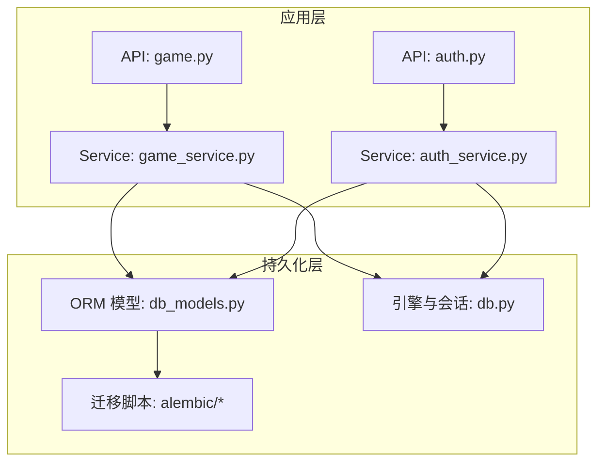
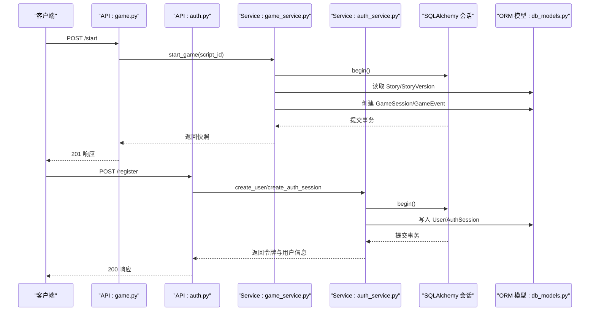
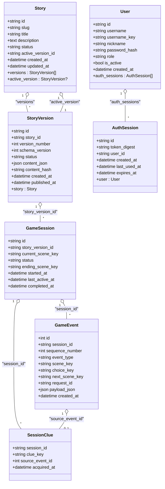
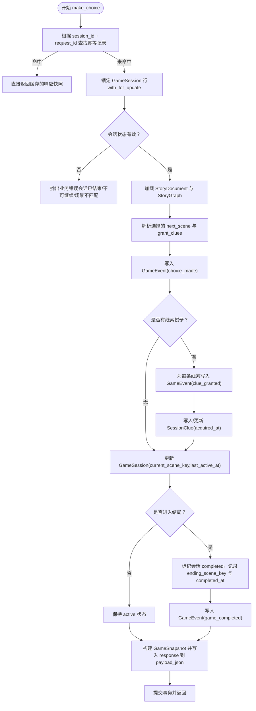
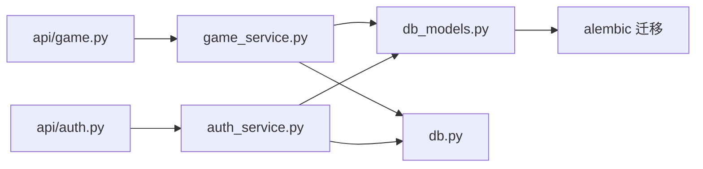

# 数据模型设计

<cite>
**本文引用的文件**   
- [backend/app/db_models.py](file://backend/app/db_models.py)
- [backend/app/models.py](file://backend/app/models.py)
- [backend/app/db.py](file://backend/app/db.py)
- [backend/alembic/versions/20260803_0001_game_persistence.py](file://backend/alembic/versions/20260803_0001_game_persistence.py)
- [backend/alembic/versions/20260804_0002_auth_persistence.py](file://backend/alembic/versions/20260804_0002_auth_persistence.py)
- [backend/app/game_service.py](file://backend/app/game_service.py)
- [backend/app/auth_service.py](file://backend/app/auth_service.py)
- [backend/app/api/game.py](file://backend/app/api/game.py)
- [backend/app/api/auth.py](file://backend/app/api/auth.py)
</cite>

## 目录
1. [简介](#简介)
2. [项目结构](#项目结构)
3. [核心组件](#核心组件)
4. [架构总览](#架构总览)
5. [详细组件分析](#详细组件分析)
6. [依赖关系分析](#依赖关系分析)
7. [性能考虑](#性能考虑)
8. [故障排查指南](#故障排查指南)
9. [结论](#结论)
10. [附录](#附录)

## 简介
本技术文档围绕澳秘 Macau Mystery 后端的数据模型进行系统化说明，重点覆盖 SQLAlchemy ORM 模型定义与使用：Story、StoryVersion、GameSession、GameEvent、SessionClue、User、AuthSession。文档将逐一解释字段类型、约束与默认值、主键策略（UUID）、外键关系与级联删除规则、CheckConstraint 校验、UniqueConstraint 唯一性约束以及索引优化策略；并提供模型关系图、数据流说明与 ORM 使用指南，帮助开发者快速理解并正确使用这些模型。

## 项目结构
后端采用 FastAPI + SQLAlchemy 异步 ORM 的架构，数据库迁移由 Alembic 管理。核心数据模型集中在 db_models.py，服务层在 game_service.py 与 auth_service.py 中通过 AsyncSession 操作模型，API 路由在 api/game.py 与 api/auth.py 中暴露接口。

图表来源
- [backend/app/api/game.py:1-37](file://backend/app/api/game.py#L1-L37)
- [backend/app/api/auth.py:1-97](file://backend/app/api/auth.py#L1-L97)
- [backend/app/game_service.py:1-386](file://backend/app/game_service.py#L1-L386)
- [backend/app/auth_service.py:1-153](file://backend/app/auth_service.py#L1-L153)
- [backend/app/db_models.py:1-160](file://backend/app/db_models.py#L1-L160)
- [backend/app/db.py:1-42](file://backend/app/db.py#L1-L42)
- [backend/alembic/versions/20260803_0001_game_persistence.py:1-129](file://backend/alembic/versions/20260803_0001_game_persistence.py#L1-L129)
- [backend/alembic/versions/20260804_0002_auth_persistence.py:1-55](file://backend/alembic/versions/20260804_0002_auth_persistence.py#L1-L55)

章节来源
- [backend/app/db_models.py:1-160](file://backend/app/db_models.py#L1-L160)
- [backend/app/db.py:1-42](file://backend/app/db.py#L1-L42)
- [backend/alembic/versions/20260803_0001_game_persistence.py:1-129](file://backend/alembic/versions/20260803_0001_game_persistence.py#L1-L129)
- [backend/alembic/versions/20260804_0002_auth_persistence.py:1-55](file://backend/alembic/versions/20260804_0002_auth_persistence.py#L1-L55)

## 核心组件
本节对每个 ORM 实体进行详细说明，包括字段类型、约束、默认值、主键策略、外键关系与级联行为、检查约束与唯一性约束、索引等。

### Story 与 StoryVersion
- Story
  - 主键 id：String(36)，默认 new_uuid() 生成 UUID v4
  - slug：String(64)，非空，唯一，带索引 ix_stories_slug
  - title：String(255)，非空
  - description：Text，可空
  - status：String(16)，默认 "draft"，受 CheckConstraint 限制为 ("draft", "published", "retired")
  - active_version_id：String(36)，可空，外键指向 story_versions.id，ondelete="SET NULL"
  - created_at / updated_at：DateTime(timezone=True)，默认 utc_now()，updated_at 支持 onupdate
  - 关系：
    - versions：一对多到 StoryVersion（back_populates="story"）
    - active_version：一对一到 StoryVersion（post_update=True）
  - 表级约束：ck_stories_status

- StoryVersion
  - 主键 id：String(36)，默认 new_uuid()
  - story_id：String(36)，非空，外键 stories.id，ondelete="RESTRICT"
  - version_number：Integer，非空
  - schema_version：Integer，非空
  - status：String(16)，默认 "draft"，受 CheckConstraint 限制为 ("draft", "published", "retired")
  - content_json：JSON，非空
  - content_hash：String(64)，非空
  - created_at / published_at：DateTime(timezone=True)，created_at 默认 utc_now()
  - 关系：story：多对一到 Story（back_populates="versions"）
  - 表级约束：
    - uq_story_versions_story_version：唯一 (story_id, version_number)
    - uq_story_versions_story_hash：唯一 (story_id, content_hash)
    - ck_story_versions_status

章节来源
- [backend/app/db_models.py:24-71](file://backend/app/db_models.py#L24-L71)
- [backend/alembic/versions/20260803_0001_game_persistence.py:17-68](file://backend/alembic/versions/20260803_0001_game_persistence.py#L17-L68)

### GameSession、GameEvent、SessionClue
- GameSession
  - 主键 id：String(36)，默认 new_uuid()
  - story_version_id：String(36)，非空，外键 story_versions.id，ondelete="RESTRICT"，索引 ix_game_sessions_story_version_id
  - current_scene_key：String(64)，非空
  - status：String(16)，默认 "active"，受 CheckConstraint 限制为 ("active", "completed", "abandoned")
  - ending_scene_key：String(64)，可空
  - started_at / last_active_at / completed_at：DateTime(timezone=True)，started_at 与 last_active_at 默认 utc_now()
  - 表级约束：ck_game_sessions_status

- GameEvent
  - 主键 id：自增 Integer
  - session_id：String(36)，非空，外键 game_sessions.id，ondelete="CASCADE"，索引 ix_game_events_session_id
  - sequence_number：Integer，非空
  - event_type：String(32)，非空
  - scene_key / choice_key / next_scene_key：String(64)，可空
  - request_id：String(36)，可空
  - payload_json：JSON，可空
  - created_at：DateTime(timezone=True)，默认 utc_now()
  - 表级约束：
    - uq_game_events_session_sequence：唯一 (session_id, sequence_number)
    - uq_game_events_session_request：唯一 (session_id, request_id)

- SessionClue
  - 复合主键 (session_id, clue_key)
  - session_id：String(36)，非空，外键 game_sessions.id，ondelete="CASCADE"
  - clue_key：String(64)，非空
  - source_event_id：Integer，可空，外键 game_events.id，ondelete="SET NULL"
  - acquired_at：DateTime(timezone=True)，默认 utc_now()

章节来源
- [backend/app/db_models.py:74-126](file://backend/app/db_models.py#L74-L126)
- [backend/alembic/versions/20260803_0001_game_persistence.py:70-112](file://backend/alembic/versions/20260803_0001_game_persistence.py#L70-L112)

### User 与 AuthSession
- User
  - 主键 id：String(36)，默认 new_uuid()
  - username：String(32)，非空
  - username_key：String(32)，非空，唯一，索引 ix_users_username_key
  - nickname：String(64)，非空
  - password_hash：String(255)，非空
  - role：String(16)，默认 "user"，受 CheckConstraint 限制为 ("admin", "user")
  - is_active：Boolean，默认 True
  - created_at：DateTime(timezone=True)，默认 utc_now()
  - 关系：auth_sessions：一对多到 AuthSession（back_populates="user"）
  - 表级约束：ck_users_role

- AuthSession
  - 主键 id：String(36)，默认 new_uuid()
  - token_digest：String(64)，非空，唯一，索引 ix_auth_sessions_token_digest
  - user_id：String(36)，非空，外键 users.id，ondelete="CASCADE"，索引 ix_auth_sessions_user_id
  - created_at / last_used_at / expires_at：DateTime(timezone=True)，默认 utc_now()
  - 关系：user：多对一到 User（back_populates="auth_sessions"）

章节来源
- [backend/app/db_models.py:128-160](file://backend/app/db_models.py#L128-L160)
- [backend/alembic/versions/20260804_0002_auth_persistence.py:17-46](file://backend/alembic/versions/20260804_0002_auth_persistence.py#L17-L46)

## 架构总览
下图展示从 API 到 ORM 模型的调用链与数据流向，体现游戏流程与认证流程如何读写数据库。

图表来源
- [backend/app/api/game.py:15-21](file://backend/app/api/game.py#L15-L21)
- [backend/app/api/auth.py:75-87](file://backend/app/api/auth.py#L75-L87)
- [backend/app/game_service.py:35-61](file://backend/app/game_service.py#L35-L61)
- [backend/app/auth_service.py:83-97](file://backend/app/auth_service.py#L83-L97)
- [backend/app/db_models.py:24-160](file://backend/app/db_models.py#L24-L160)

## 详细组件分析

### 主键策略与时间戳
- 主键策略
  - 所有字符串主键均使用 String(36) 存储 UUID v4，默认值由 new_uuid() 生成，保证分布式环境下的唯一性与无冲突。
  - GameEvent 使用自增整数主键，便于顺序扫描与事件回放。
- 时间戳
  - created_at、updated_at、last_active_at、expires_at 等字段统一使用 DateTime(timezone=True) 并以 UTC 时区记录，避免时区问题。
  - 默认值函数 utc_now() 确保插入与更新时自动填充当前 UTC 时间。

章节来源
- [backend/app/db_models.py:12-18](file://backend/app/db_models.py#L12-L18)
- [backend/app/db_models.py:24-160](file://backend/app/db_models.py#L24-L160)

### 外键关系与级联删除
- Story.active_version_id → StoryVersion.id：ondelete="SET NULL"，当版本被删除时，故事的活动版本置空，保持故事记录存在。
- StoryVersion.story_id → Stories.id：ondelete="RESTRICT"，禁止删除仍被版本引用的故事，保障数据完整性。
- GameSession.story_version_id → StoryVersion.id：ondelete="RESTRICT"，防止删除正在被会话引用的版本。
- GameEvent.session_id → GameSession.id：ondelete="CASCADE"，会话删除时级联删除其全部事件，清理冗余数据。
- SessionClue.session_id → GameSession.id：ondelete="CASCADE"，会话删除时级联删除线索记录。
- SessionClue.source_event_id → GameEvent.id：ondelete="SET NULL"，事件删除时线索保留但溯源事件置空。
- AuthSession.user_id → Users.id：ondelete="CASCADE"，用户删除时级联删除其认证会话。

章节来源
- [backend/app/db_models.py:24-160](file://backend/app/db_models.py#L24-L160)
- [backend/alembic/versions/20260803_0001_game_persistence.py:45-68](file://backend/alembic/versions/20260803_0001_game_persistence.py#L45-L68)
- [backend/alembic/versions/20260804_0002_auth_persistence.py:41-46](file://backend/alembic/versions/20260804_0002_auth_persistence.py#L41-L46)

### 检查约束与唯一性约束
- CheckConstraint
  - stories.status ∈ {"draft","published","retired"}
  - story_versions.status ∈ {"draft","published","retired"}
  - game_sessions.status ∈ {"active","completed","abandoned"}
  - users.role ∈ {"admin","user"}
- UniqueConstraint
  - story_versions: (story_id, version_number)、(story_id, content_hash)
  - game_events: (session_id, sequence_number)、(session_id, request_id)
  - users.username_key
  - auth_sessions.token_digest

章节来源
- [backend/app/db_models.py:47-71](file://backend/app/db_models.py#L47-L71)
- [backend/app/db_models.py:88-112](file://backend/app/db_models.py#L88-L112)
- [backend/app/db_models.py:142-144](file://backend/app/db_models.py#L142-L144)
- [backend/alembic/versions/20260803_0001_game_persistence.py:28-48](file://backend/alembic/versions/20260803_0001_game_persistence.py#L28-L48)
- [backend/alembic/versions/20260803_0001_game_persistence.py:99-101](file://backend/alembic/versions/20260803_0001_game_persistence.py#L99-L101)
- [backend/alembic/versions/20260804_0002_auth_persistence.py:28-31](file://backend/alembic/versions/20260804_0002_auth_persistence.py#L28-L31)
- [backend/alembic/versions/20260804_0002_auth_persistence.py:43-44](file://backend/alembic/versions/20260804_0002_auth_persistence.py#L43-L44)

### 索引优化策略
- stories.slug：ix_stories_slug，加速按 slug 查找已发布剧本。
- game_sessions.story_version_id：ix_game_sessions_story_version_id，加速按版本查询会话。
- game_events.session_id：ix_game_events_session_id，加速会话事件回放与统计。
- users.username_key：ix_users_username_key，加速用户名登录与去重。
- auth_sessions.token_digest：ix_auth_sessions_token_digest，加速令牌鉴权。
- auth_sessions.user_id：ix_auth_sessions_user_id，加速用户会话查询。

章节来源
- [backend/alembic/versions/20260803_0001_game_persistence.py:32](file://backend/alembic/versions/20260803_0001_game_persistence.py#L32)
- [backend/alembic/versions/20260803_0001_game_persistence.py:84](file://backend/alembic/versions/20260803_0001_game_persistence.py#L84)
- [backend/alembic/versions/20260803_0001_game_persistence.py:102](file://backend/alembic/versions/20260803_0001_game_persistence.py#L102)
- [backend/alembic/versions/20260804_0002_auth_persistence.py:32](file://backend/alembic/versions/20260804_0002_auth_persistence.py#L32)
- [backend/alembic/versions/20260804_0002_auth_persistence.py:45-46](file://backend/alembic/versions/20260804_0002_auth_persistence.py#L45-L46)

### 模型关系图

图表来源
- [backend/app/db_models.py:24-160](file://backend/app/db_models.py#L24-L160)

### 数据流说明（选择分支与线索发放）
选择分支流程体现了幂等性、并发控制与状态一致性：

图表来源
- [backend/app/game_service.py:84-193](file://backend/app/game_service.py#L84-L193)

章节来源
- [backend/app/game_service.py:84-193](file://backend/app/game_service.py#L84-L193)

### ORM 使用指南（最佳实践）
- 会话与事务
  - 使用 async_sessionmaker 创建的 SessionLocal 提供 AsyncSession，配合 with self.session.begin() 或显式 commit/rollback 保证事务一致性。
  - SQLite 下使用 BEGIN IMMEDIATE 提升并发写安全性。
- 查询与锁
  - 并发安全：使用 with_for_update() 锁定 GameSession 行，避免竞态条件。
  - 幂等性：通过 GameEvent.request_id 唯一约束实现重复请求的去重与结果复用。
- 关系访问
  - 通过 relationship 的 back_populates 双向导航，如 Story.versions、StoryVersion.story、User.auth_sessions。
  - 注意 post_update=True 用于 active_version 的一对一延迟更新。
- 时间与时区
  - 所有时间字段使用 UTC，避免本地时区差异导致的问题。
- JSON 字段
  - content_json、payload_json 使用 JSON 类型，适合存储结构化剧情与事件载荷。

章节来源
- [backend/app/db.py:12-32](file://backend/app/db.py#L12-L32)
- [backend/app/game_service.py:35-61](file://backend/app/game_service.py#L35-L61)
- [backend/app/game_service.py:84-193](file://backend/app/game_service.py#L84-L193)

## 依赖关系分析
- 模块耦合
  - API 层仅依赖服务层与模型层，服务层通过 AsyncSession 操作模型，降低耦合度。
  - 迁移脚本与模型定义保持一致，确保数据库结构与 ORM 映射同步。
- 外部依赖
  - SQLAlchemy 异步引擎与会话管理，SQLite 特殊配置（PRAGMA foreign_keys=ON、busy_timeout）。
  - Pydantic 用于 API 请求/响应模型校验（models.py），与 ORM 模型解耦。

图表来源
- [backend/app/api/game.py:1-37](file://backend/app/api/game.py#L1-L37)
- [backend/app/api/auth.py:1-97](file://backend/app/api/auth.py#L1-L97)
- [backend/app/game_service.py:1-386](file://backend/app/game_service.py#L1-L386)
- [backend/app/auth_service.py:1-153](file://backend/app/auth_service.py#L1-L153)
- [backend/app/db_models.py:1-160](file://backend/app/db_models.py#L1-L160)
- [backend/app/db.py:1-42](file://backend/app/db.py#L1-L42)

章节来源
- [backend/app/db.py:12-23](file://backend/app/db.py#L12-L23)
- [backend/app/models.py:1-146](file://backend/app/models.py#L1-L146)

## 性能考虑
- 索引设计
  - 针对高频查询字段建立索引：slug、story_version_id、session_id、username_key、token_digest、user_id。
- 事务粒度
  - 选择分支流程在一个事务内完成，减少锁持有时间与死锁风险。
- 并发控制
  - SQLite 使用 BEGIN IMMEDIATE 提升写并发；PostgreSQL 使用行级锁 with_for_update()。
- JSON 负载
  - payload_json 存储完整请求与响应，便于审计与回放，但需注意大小增长对 I/O 的影响。
- 时间戳与排序
  - acquired_at 与 sequence_number 用于有序回放与线索获取，建议结合索引优化查询。

[本节为通用指导，不直接分析具体文件]

## 故障排查指南
- 常见错误与定位
  - 会话不存在：get_state 或 make_choice 时若找不到 GameSession，返回 404。
  - 会话已完成或不可继续：状态检查失败返回 409。
  - 场景不匹配：提交的 scene_id 与当前不一致，返回 409 并附带当前 scene_id。
  - 选项无效：choice_id 不属于当前场景，返回 409。
  - 幂等冲突：request_id 已用于不同请求，返回 409。
  - 故事数据损坏：版本内容校验失败或运行时解析异常，返回 500。
- 排查步骤
  - 检查 GameEvent 的 payload_json 中的请求与响应，确认幂等记录是否存在且一致。
  - 核对 GameSession.status 与 current_scene_key，确认状态机流转正确。
  - 查看 SessionClue 的 acquired_at 与 source_event_id，确认线索发放逻辑。
  - 验证 UniqueConstraint 与 CheckConstraint 是否触发（例如重复 request_id、非法 status）。

章节来源
- [backend/app/game_service.py:63-193](file://backend/app/game_service.py#L63-L193)
- [backend/app/game_service.py:353-385](file://backend/app/game_service.py#L353-L385)

## 结论
本项目的数据模型以 SQLAlchemy ORM 为核心，通过严格的约束与索引设计保障了数据完整性与查询性能。Story/StoryVersion 的版本化管理、GameSession/GameEvent/SessionClue 的事件驱动流程、User/AuthSession 的认证机制共同构成了一个稳定可扩展的后端基础。开发者在使用时应遵循事务边界、幂等性与并发控制的最佳实践，充分利用关系映射与索引优化，确保系统在高并发与复杂剧情逻辑下的可靠性。

[本节为总结性内容，不直接分析具体文件]

## 附录
- API 契约模型（Pydantic）
  - models.py 定义了 GameStartRequest、ChoiceRequest、GameSnapshot 等，与 ORM 模型解耦，便于前后端交互与校验。
- 数据库引擎与会话
  - db.py 提供 create_database_engine 与 get_db_session，适配 SQLite 的特殊配置。

章节来源
- [backend/app/models.py:1-146](file://backend/app/models.py#L1-L146)
- [backend/app/db.py:12-32](file://backend/app/db.py#L12-L32)