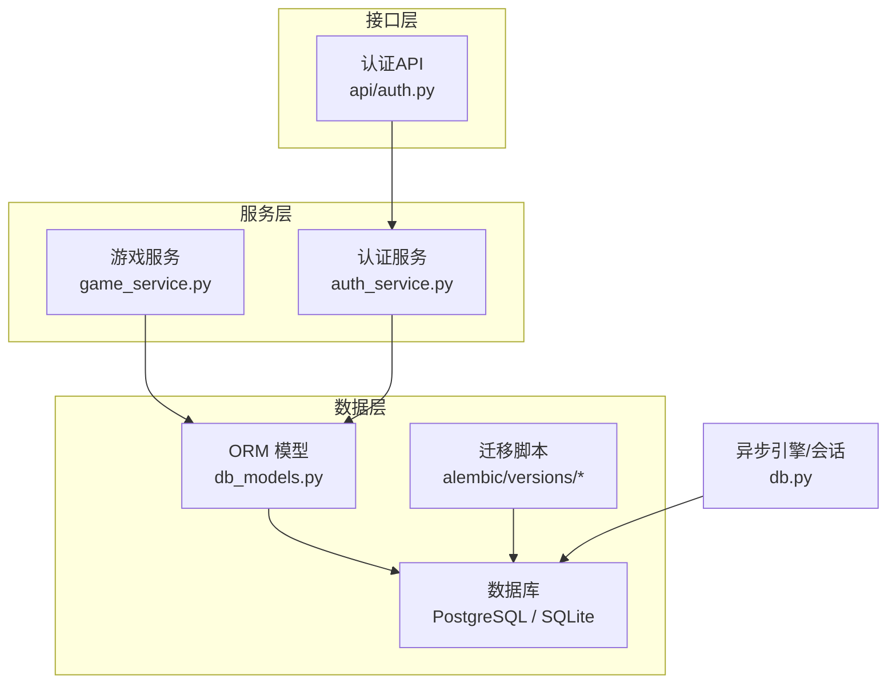
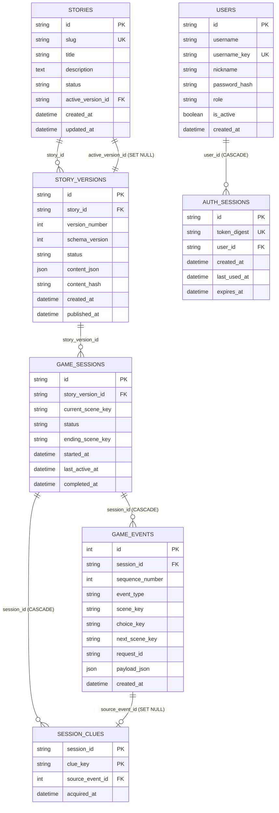
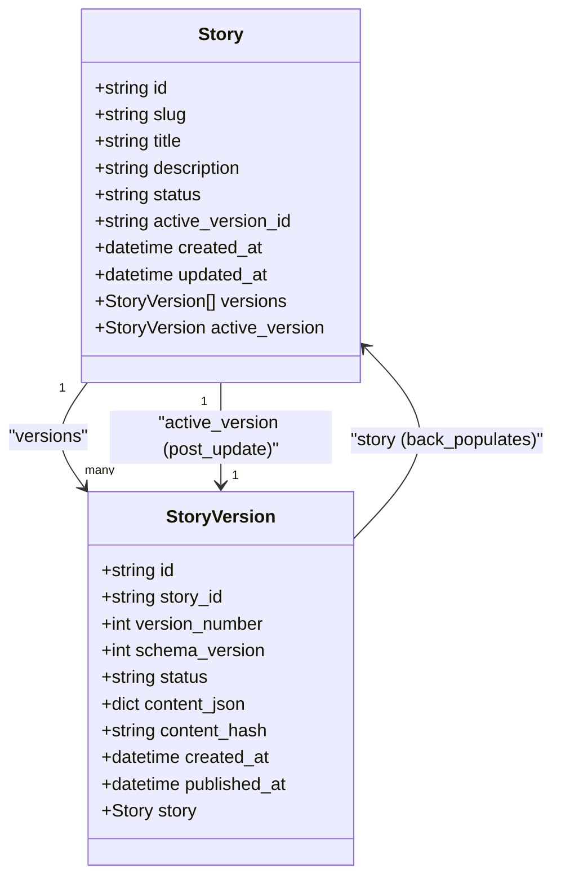
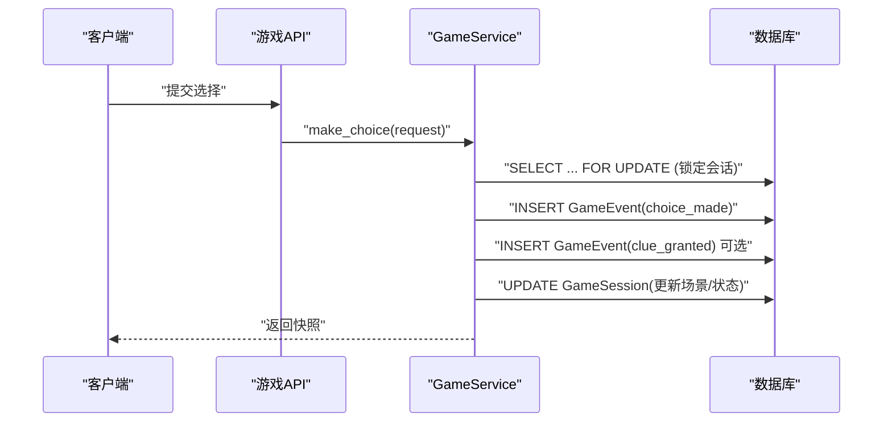
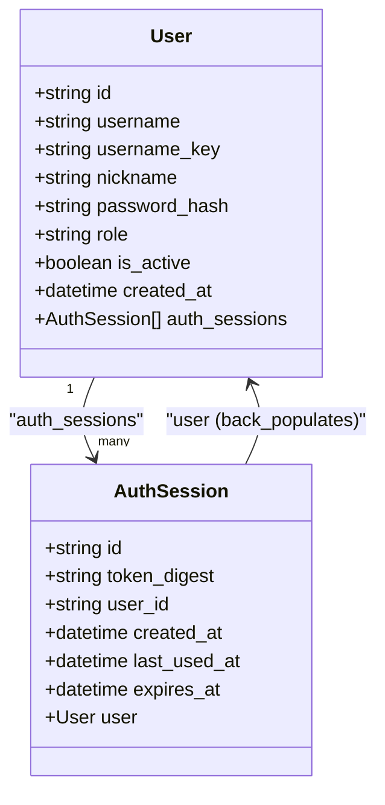
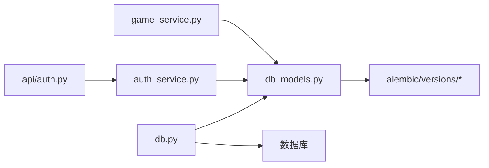

# 表关系与映射

<cite>
**本文引用的文件**   
- [db_models.py](file://backend/app/db_models.py)
- [db.py](file://backend/app/db.py)
- [20260803_0001_game_persistence.py](file://backend/alembic/versions/20260803_0001_game_persistence.py)
- [20260804_0002_auth_persistence.py](file://backend/alembic/versions/20260804_0002_auth_persistence.py)
- [game_service.py](file://backend/app/game_service.py)
- [auth.py](file://backend/app/api/auth.py)
- [auth_service.py](file://backend/app/auth_service.py)
</cite>

## 目录
1. [简介](#简介)
2. [项目结构](#项目结构)
3. [核心组件](#核心组件)
4. [架构总览](#架构总览)
5. [详细组件分析](#详细组件分析)
6. [依赖分析](#依赖分析)
7. [性能考虑](#性能考虑)
8. [故障排查指南](#故障排查指南)
9. [结论](#结论)
10. [附录](#附录)

## 简介
本文件面向澳秘 Macau Mystery 后端数据库的表关系与映射，重点说明：
- Story 与 StoryVersion 的一对多关系、active_version 自引用
- GameSession 与 GameEvent 的关联及级联删除策略
- User 与 AuthSession 的认证会话关系
- SQLAlchemy relationship、back_populates、foreign_keys 的配置要点
- RESTRICT、CASCADE、SET NULL 的业务含义与设计考量
- 查询优化建议、N+1 问题解决方案与性能调优技巧
- 常见查询模式与最佳实践示例（以路径引用代替代码片段）

## 项目结构
本项目使用 SQLAlchemy ORM + Alembic 迁移管理数据库。核心模型定义在 db_models.py，迁移脚本位于 alembic/versions，异步引擎与 Session 工厂在 db.py，业务逻辑通过 game_service.py 和 auth_service.py 调用模型。

图表来源
- [db_models.py:24-159](file://backend/app/db_models.py#L24-L159)
- [db.py:12-27](file://backend/app/db.py#L12-L27)
- [20260803_0001_game_persistence.py:17-112](file://backend/alembic/versions/20260803_0001_game_persistence.py#L17-L112)
- [20260804_0002_auth_persistence.py:17-46](file://backend/alembic/versions/20260804_0002_auth_persistence.py#L17-L46)

章节来源
- [db_models.py:24-159](file://backend/app/db_models.py#L24-L159)
- [db.py:12-27](file://backend/app/db.py#L12-L27)

## 核心组件
- 故事与版本：Story、StoryVersion、active_version_id 自引用
- 游戏会话与事件：GameSession、GameEvent、SessionClue
- 用户与认证会话：User、AuthSession

章节来源
- [db_models.py:24-159](file://backend/app/db_models.py#L24-L159)

## 架构总览
下图展示实体间的主要关系与外键约束，以及级联行为。

图表来源
- [db_models.py:24-159](file://backend/app/db_models.py#L24-L159)
- [20260803_0001_game_persistence.py:17-112](file://backend/alembic/versions/20260803_0001_game_persistence.py#L17-L112)
- [20260804_0002_auth_persistence.py:17-46](file://backend/alembic/versions/20260804_0002_auth_persistence.py#L17-L46)

## 详细组件分析

### Story 与 StoryVersion 的关系
- 一对多：一个 Story 拥有多个 StoryVersion；StoryVersion 通过 story_id 引用 Story。
- active_version 自引用：Story.active_version_id 指向某个 StoryVersion.id，用于标记“当前活跃版本”。该字段允许为 NULL，并在被引用版本删除时执行 SET NULL。
- SQLAlchemy 配置要点：
  - Story.versions 使用 back_populates="story" 与 StoryVersion.story 双向绑定。
  - Story.active_version 使用 foreign_keys=[active_version_id] 指定自引用外键，并使用 post_update=True 避免插入顺序冲突。
  - StoryVersion.story 使用 back_populates="versions" 与 Story.versions 双向绑定。

图表来源
- [db_models.py:24-65](file://backend/app/db_models.py#L24-L65)

章节来源
- [db_models.py:24-65](file://backend/app/db_models.py#L24-L65)
- [20260803_0001_game_persistence.py:17-68](file://backend/alembic/versions/20260803_0001_game_persistence.py#L17-L68)

### GameSession 与 GameEvent 的关联
- GameSession 记录一次游戏会话的状态与进度；GameEvent 记录会话中的事件序列（如开始、选择、获得线索、完成等）。
- 外键与索引：
  - GameEvent.session_id 引用 GameSession.id，并建立索引 ix_game_events_session_id。
  - GameSession.story_version_id 引用 StoryVersion.id，并建立索引 ix_game_sessions_story_version_id。
- 级联删除：
  - GameEvent.session_id ondelete=CASCADE：删除会话时自动删除其所有事件。
  - SessionClue.source_event_id ondelete=SET NULL：删除事件时线索保留但失去来源事件。
  - GameSession.story_version_id ondelete=RESTRICT：防止误删已关联的版本。

图表来源
- [game_service.py:70-193](file://backend/app/game_service.py#L70-L193)
- [20260803_0001_game_persistence.py:70-112](file://backend/alembic/versions/20260803_0001_game_persistence.py#L70-L112)

章节来源
- [db_models.py:74-126](file://backend/app/db_models.py#L74-L126)
- [game_service.py:70-193](file://backend/app/game_service.py#L70-L193)
- [20260803_0001_game_persistence.py:70-112](file://backend/alembic/versions/20260803_0001_game_persistence.py#L70-L112)

### User 与 AuthSession 的认证关系
- User 存储用户基本信息与角色；AuthSession 存储令牌摘要与有效期，支持多会话并发。
- 外键与索引：
  - AuthSession.user_id 引用 Users.id，ondelete=CASCADE，删除用户时清理其所有会话。
  - AuthSession.token_digest 唯一索引，便于快速校验令牌。
- SQLAlchemy 配置要点：
  - User.auth_sessions 使用 back_populates="user" 与 AuthSession.user 双向绑定。
  - AuthSession.user 使用 back_populates="auth_sessions" 与 User.auth_sessions 双向绑定。

图表来源
- [db_models.py:128-159](file://backend/app/db_models.py#L128-L159)

章节来源
- [db_models.py:128-159](file://backend/app/db_models.py#L128-L159)
- [auth_service.py:83-97](file://backend/app/auth_service.py#L83-L97)
- [auth.py:64-87](file://backend/app/api/auth.py#L64-L87)

### 级联删除行为的业务含义与设计考量
- RESTRICT：阻止删除受保护的主记录（如 StoryVersion），保证历史数据不被破坏。
- CASCADE：删除主记录时级联删除从属数据（如删除会话时删除事件），简化清理逻辑。
- SET NULL：删除被引用记录时将外键置空（如 active_version_id 或 source_event_id），保持主记录存在且可继续运行。

章节来源
- [db_models.py:32-34](file://backend/app/db_models.py#L32-L34)
- [db_models.py:56](file://backend/app/db_models.py#L56)
- [db_models.py:97-98](file://backend/app/db_models.py#L97-L98)
- [db_models.py:122-124](file://backend/app/db_models.py#L122-L124)
- [db_models.py:152-154](file://backend/app/db_models.py#L152-L154)

## 依赖分析
- 模型到数据库：db_models.py 定义表结构与关系，Alembic 迁移确保 DDL 一致性。
- 引擎与会话：db.py 创建异步引擎与 SessionLocal，SQLite 下启用 PRAGMA foreign_keys=ON 与 busy_timeout。
- 业务调用：game_service.py 与 auth_service.py 通过 AsyncSession 操作模型，遵循事务边界。

图表来源
- [db_models.py:24-159](file://backend/app/db_models.py#L24-L159)
- [db.py:12-27](file://backend/app/db.py#L12-L27)
- [20260803_0001_game_persistence.py:17-112](file://backend/alembic/versions/20260803_0001_game_persistence.py#L17-L112)
- [20260804_0002_auth_persistence.py:17-46](file://backend/alembic/versions/20260804_0002_auth_persistence.py#L17-L46)

章节来源
- [db.py:12-27](file://backend/app/db.py#L12-L27)
- [game_service.py:1-100](file://backend/app/game_service.py#L1-L100)
- [auth_service.py:51-102](file://backend/app/auth_service.py#L51-L102)

## 性能考虑
- N+1 问题与解决方案
  - 读取 Story 及其 versions：使用 joinedload 或 selectinload 一次性加载，避免循环查询。
  - 读取 GameSession 与其 events：对高频查询使用 selectinload("events")，或在聚合查询中直接 JOIN。
  - 读取 User 与其 auth_sessions：按需加载，避免批量拉取大量会话。
- 查询优化建议
  - 使用 with_for_update() 进行行级锁（见 make_choice 流程），避免并发写冲突。
  - 利用已有索引：ix_game_events_session_id、ix_game_sessions_story_version_id、ix_users_username_key、ix_auth_sessions_user_id、ix_auth_sessions_token_digest。
  - 限制返回字段：仅选择必要列，减少网络与序列化开销。
  - 分页与排序：对事件列表按 sequence_number 分页，避免全量扫描。
- 事务与批处理
  - 使用 session.begin() 包裹多步写入，保证一致性。
  - SQLite 下显式 BEGIN IMMEDIATE，提升并发写入稳定性。
- 连接池与超时
  - 启用 pool_pre_ping 检测连接健康。
  - SQLite 设置 PRAGMA busy_timeout=5000，降低锁等待失败概率。

章节来源
- [game_service.py:70-193](file://backend/app/game_service.py#L70-L193)
- [db.py:12-27](file://backend/app/db.py#L12-L27)
- [20260803_0001_game_persistence.py:84](file://backend/alembic/versions/20260803_0001_game_persistence.py#L84)
- [20260804_0002_auth_persistence.py:45-46](file://backend/alembic/versions/20260804_0002_auth_persistence.py#L45-L46)

## 故障排查指南
- 外键约束错误
  - RESTRICT 导致无法删除 StoryVersion：检查是否存在 GameSession 引用该版本。
  - CASCADE 删除会话后事件丢失：确认业务是否仍需要事件回放能力。
  - SET NULL 导致线索来源为空：检查 SourceEvent 是否已被删除。
- 并发问题
  - 选择冲突：确保使用 with_for_update() 锁定会话，重复请求走重放逻辑。
  - SQLite 锁等待：检查 busy_timeout 与事务边界是否正确。
- 认证失败
  - 令牌无效或过期：校验 token_digest 与 expires_at。
  - 用户被禁用：检查 is_active 标志。
- 常见问题定位
  - 查看迁移脚本确认 DDL 是否与模型一致。
  - 使用 check_database() 验证连接可用性。

章节来源
- [db_models.py:32-34](file://backend/app/db_models.py#L32-L34)
- [db_models.py:97-98](file://backend/app/db_models.py#L97-L98)
- [db_models.py:122-124](file://backend/app/db_models.py#L122-L124)
- [db_models.py:152-154](file://backend/app/db_models.py#L152-L154)
- [db.py:35-42](file://backend/app/db.py#L35-L42)
- [game_service.py:70-193](file://backend/app/game_service.py#L70-L193)
- [auth_service.py:100-102](file://backend/app/auth_service.py#L100-L102)

## 结论
本项目的表关系设计清晰、约束严谨，通过 RESTRICT/CASCADE/SET NULL 的组合满足业务一致性与可恢复性需求。SQLAlchemy 的 relationship 与 back_populates 提供了直观的双向导航，配合 Alembic 迁移确保 DDL 与模型同步。在生产环境中，应重点关注 N+1 查询、并发锁与索引利用，以获得稳定高效的性能表现。

## 附录

### 常见查询模式与最佳实践（路径引用）
- 获取活跃故事与版本
  - 参考：[game_service.py:195-208](file://backend/app/game_service.py#L195-L208)
- 根据会话获取故事上下文
  - 参考：[game_service.py:210-215](file://backend/app/game_service.py#L210-L215)
- 获取会话线索并按时间排序
  - 参考：[game_service.py:339-345](file://backend/app/game_service.py#L339-L345)
- 计算下一个事件序号
  - 参考：[game_service.py:347-351](file://backend/app/game_service.py#L347-L351)
- 注册与登录流程
  - 参考：[auth.py:64-87](file://backend/app/api/auth.py#L64-L87)
  - 参考：[auth_service.py:83-97](file://backend/app/auth_service.py#L83-L97)
- 基于 Bearer 令牌鉴权
  - 参考：[auth_service.py:100-102](file://backend/app/auth_service.py#L100-L102)

### 迁移与 DDL 对照
- 游戏相关表与约束
  - 参考：[20260803_0001_game_persistence.py:17-112](file://backend/alembic/versions/20260803_0001_game_persistence.py#L17-L112)
- 认证相关表与约束
  - 参考：[20260804_0002_auth_persistence.py:17-46](file://backend/alembic/versions/20260804_0002_auth_persistence.py#L17-L46)