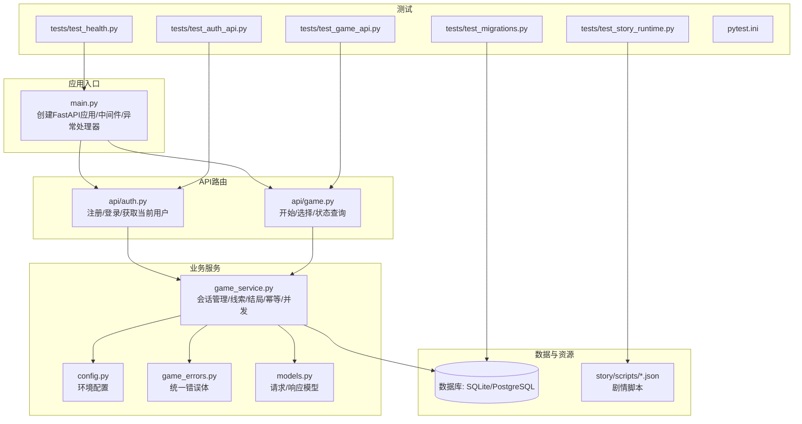
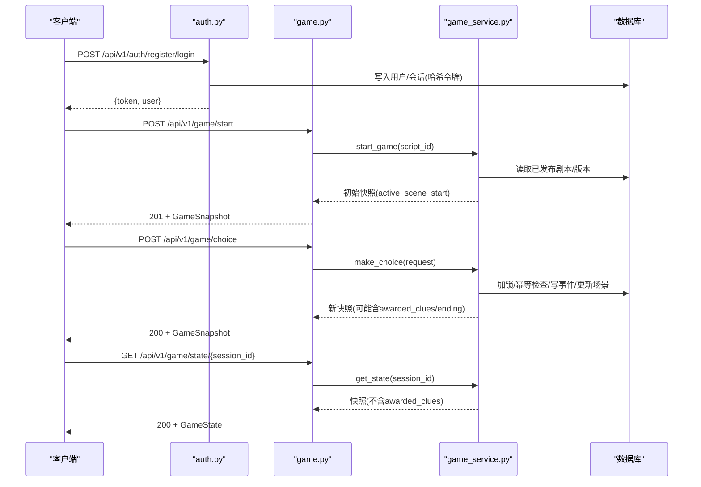
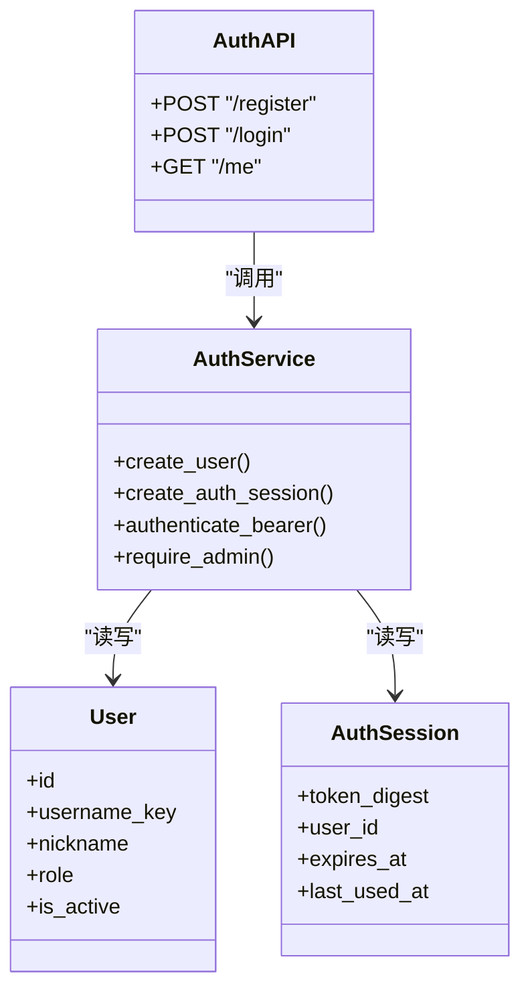
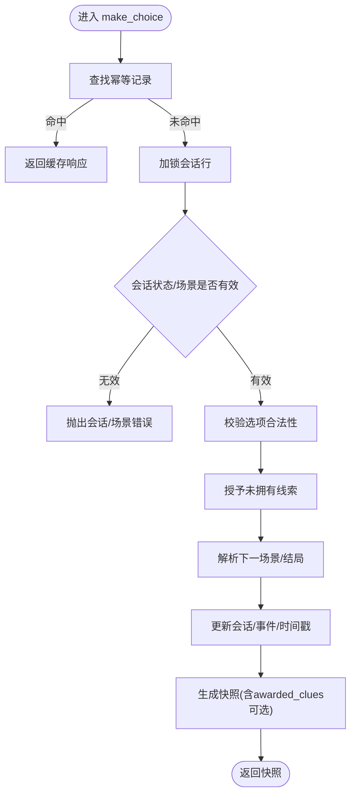
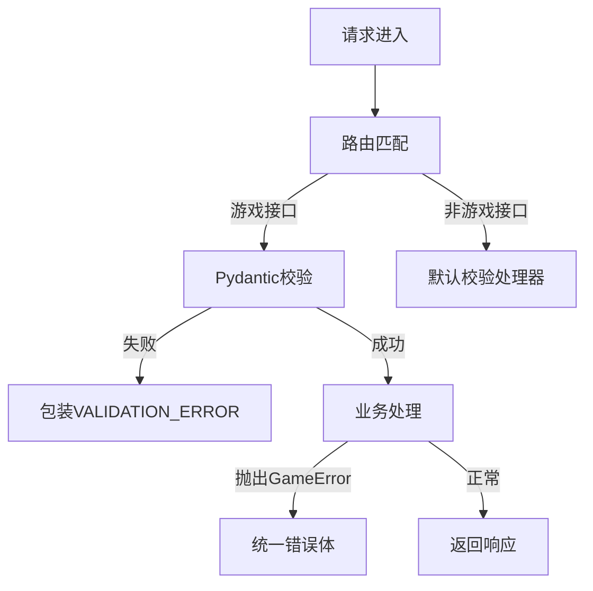
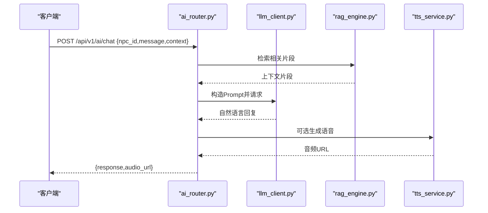
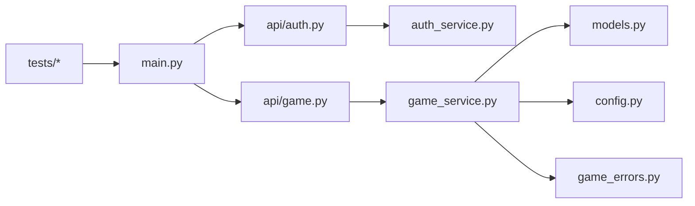

# API接口测试

<cite>
**本文引用的文件**   
- [backend/app/main.py](file://backend/app/main.py)
- [backend/app/api/auth.py](file://backend/app/api/auth.py)
- [backend/app/api/game.py](file://backend/app/api/game.py)
- [backend/app/game_service.py](file://backend/app/game_service.py)
- [backend/app/models.py](file://backend/app/models.py)
- [backend/app/game_errors.py](file://backend/app/game_errors.py)
- [backend/app/config.py](file://backend/app/config.py)
- [backend/tests/test_auth_api.py](file://backend/tests/test_auth_api.py)
- [backend/tests/test_game_api.py](file://backend/tests/test_game_api.py)
- [backend/tests/test_health.py](file://backend/tests/test_health.py)
- [backend/tests/test_story_runtime.py](file://backend/tests/test_story_runtime.py)
- [backend/tests/test_migrations.py](file://backend/tests/test_migrations.py)
- [backend/pytest.ini](file://backend/pytest.ini)
- [backend/app/story/scripts/macau_mystery_demo.json](file://backend/app/story/scripts/macau_mystery_demo.json)
</cite>

## 目录
1. [简介](#简介)
2. [项目结构](#项目结构)
3. [核心组件](#核心组件)
4. [架构总览](#架构总览)
5. [详细组件分析](#详细组件分析)
6. [依赖关系分析](#依赖关系分析)
7. [性能与负载测试](#性能与负载测试)
8. [故障排查指南](#故障排查指南)
9. [结论](#结论)
10. [附录：API契约与测试用例清单](#附录api契约与测试用例清单)

## 简介
本文件面向澳秘 Macau Mystery 项目的后端 API 测试，聚焦于 RESTful 接口测试策略、JWT（基于令牌）认证与权限控制验证、错误处理一致性、游戏状态管理与线索收集、结局计算、并发幂等性保障，以及性能监控与负载测试实践。文档同时提供用户注册登录、剧本加载、NPC对话与知识库检索的端到端测试实现思路，并给出测试数据工厂、Mock服务与自动化流水线配置建议。

## 项目结构
后端采用 FastAPI 框架，按功能划分路由模块，统一异常封装与校验响应格式；游戏运行时通过 SQLAlchemy 异步会话持久化会话、事件与线索；测试使用 pytest + TestClient 进行集成测试，覆盖认证、游戏流程、健康检查、迁移与故事运行时校验。

**图表来源** 
- [backend/app/main.py:1-111](file://backend/app/main.py#L1-L111)
- [backend/app/api/auth.py:1-97](file://backend/app/api/auth.py#L1-L97)
- [backend/app/api/game.py:1-37](file://backend/app/api/game.py#L1-L37)
- [backend/app/game_service.py:1-386](file://backend/app/game_service.py#L1-L386)
- [backend/app/models.py:1-146](file://backend/app/models.py#L1-L146)
- [backend/app/game_errors.py:1-20](file://backend/app/game_errors.py#L1-L20)
- [backend/app/config.py:1-77](file://backend/app/config.py#L1-L77)
- [backend/tests/test_auth_api.py:1-208](file://backend/tests/test_auth_api.py#L1-L208)
- [backend/tests/test_game_api.py:1-210](file://backend/tests/test_game_api.py#L1-L210)
- [backend/tests/test_health.py:1-23](file://backend/tests/test_health.py#L1-L23)
- [backend/tests/test_story_runtime.py:1-83](file://backend/tests/test_story_runtime.py#L1-L83)
- [backend/tests/test_migrations.py:1-61](file://backend/tests/test_migrations.py#L1-L61)
- [backend/pytest.ini:1-6](file://backend/pytest.ini#L1-L6)
- [backend/app/story/scripts/macau_mystery_demo.json:1-149](file://backend/app/story/scripts/macau_mystery_demo.json#L1-L149)

**章节来源**
- [backend/app/main.py:1-111](file://backend/app/main.py#L1-L111)
- [backend/app/api/auth.py:1-97](file://backend/app/api/auth.py#L1-L97)
- [backend/app/api/game.py:1-37](file://backend/app/api/game.py#L1-L37)
- [backend/app/game_service.py:1-386](file://backend/app/game_service.py#L1-L386)
- [backend/app/models.py:1-146](file://backend/app/models.py#L1-L146)
- [backend/app/game_errors.py:1-20](file://backend/app/game_errors.py#L1-L20)
- [backend/app/config.py:1-77](file://backend/app/config.py#L1-L77)
- [backend/tests/test_auth_api.py:1-208](file://backend/tests/test_auth_api.py#L1-L208)
- [backend/tests/test_game_api.py:1-210](file://backend/tests/test_game_api.py#L1-L210)
- [backend/tests/test_health.py:1-23](file://backend/tests/test_health.py#L1-L23)
- [backend/tests/test_story_runtime.py:1-83](file://backend/tests/test_story_runtime.py#L1-L83)
- [backend/tests/test_migrations.py:1-61](file://backend/tests/test_migrations.py#L1-L61)
- [backend/pytest.ini:1-6](file://backend/pytest.ini#L1-L6)
- [backend/app/story/scripts/macau_mystery_demo.json:1-149](file://backend/app/story/scripts/macau_mystery_demo.json#L1-L149)

## 核心组件
- 应用启动与异常处理：统一 GameError 与请求校验错误包装为稳定错误体，CORS 中间件启用跨域。
- 认证API：用户名/密码注册与登录，Bearer 令牌鉴权与会话持久化，角色守卫（admin/user）。
- 游戏API：匿名会话式玩法，start/choice/state 三接口驱动剧情推进、线索收集与结局判定。
- 游戏服务：事务内状态机推进、并发锁、幂等重放、版本锁定、媒体就绪检查、快照生成。
- 模型与契约：Pydantic 强类型校验，严格禁止额外字段，确保前后端契约一致。
- 测试套件：覆盖认证、游戏流程、健康检查、迁移与故事运行时校验。

**章节来源**
- [backend/app/main.py:1-111](file://backend/app/main.py#L1-L111)
- [backend/app/api/auth.py:1-97](file://backend/app/api/auth.py#L1-L97)
- [backend/app/api/game.py:1-37](file://backend/app/api/game.py#L1-L37)
- [backend/app/game_service.py:1-386](file://backend/app/game_service.py#L1-L386)
- [backend/app/models.py:1-146](file://backend/app/models.py#L1-L146)
- [backend/app/game_errors.py:1-20](file://backend/app/game_errors.py#L1-L20)
- [backend/tests/test_auth_api.py:1-208](file://backend/tests/test_auth_api.py#L1-L208)
- [backend/tests/test_game_api.py:1-210](file://backend/tests/test_game_api.py#L1-L210)
- [backend/tests/test_health.py:1-23](file://backend/tests/test_health.py#L1-L23)

## 架构总览
下图展示从客户端到数据库的关键调用链，包括认证鉴权与游戏状态流转。

**图表来源** 
- [backend/app/api/auth.py:1-97](file://backend/app/api/auth.py#L1-L97)
- [backend/app/api/game.py:1-37](file://backend/app/api/game.py#L1-L37)
- [backend/app/game_service.py:1-386](file://backend/app/game_service.py#L1-L386)

## 详细组件分析

### 认证与权限（JWT/Bearer）
- 注册/登录：校验用户名/密码规则，返回包含 token 与用户信息的响应；重复用户名返回冲突。
- 鉴权：Authorization: Bearer <token> 解析，校验过期与活跃状态，支持重启后凭持久化恢复。
- 权限：管理员接口 require_admin，普通用户受限访问特定路径。

**图表来源** 
- [backend/app/api/auth.py:1-97](file://backend/app/api/auth.py#L1-L97)
- [backend/app/auth_service.py:1-153](file://backend/app/auth_service.py#L1-L153)

**章节来源**
- [backend/app/api/auth.py:1-97](file://backend/app/api/auth.py#L1-L97)
- [backend/app/auth_service.py:1-153](file://backend/app/auth_service.py#L1-L153)
- [backend/tests/test_auth_api.py:1-208](file://backend/tests/test_auth_api.py#L1-L208)

### 游戏API与状态机
- 开始游戏：校验剧本ID与发布状态，创建会话与首个事件，返回初始场景与选项预载。
- 做出选择：事务内并发安全（SELECT FOR UPDATE）、幂等重放（request_id）、线索授予、下一场景解析、结局判定。
- 查询状态：仅返回当前场景与线索集合，不暴露 awarded_clues。

**图表来源** 
- [backend/app/game_service.py:70-193](file://backend/app/game_service.py#L70-L193)

**章节来源**
- [backend/app/api/game.py:1-37](file://backend/app/api/game.py#L1-L37)
- [backend/app/game_service.py:1-386](file://backend/app/game_service.py#L1-L386)
- [backend/app/models.py:1-146](file://backend/app/models.py#L1-L146)
- [backend/tests/test_game_api.py:1-210](file://backend/tests/test_game_api.py#L1-L210)

### 错误处理与校验
- 统一错误体：GameError 携带 code/message/details，主应用拦截器将转换为稳定 JSON 结构。
- 请求校验：Pydantic 校验失败时，非游戏接口走默认处理，游戏接口返回 VALIDATION_ERROR 包裹。
- 常见错误码：SESSION_NOT_FOUND、STORY_NOT_FOUND、CHOICE_NOT_AVAILABLE、STALE_SCENE、IDEMPOTENCY_CONFLICT、SESSION_COMPLETED 等。

**图表来源** 
- [backend/app/main.py:38-74](file://backend/app/main.py#L38-L74)
- [backend/app/game_errors.py:1-20](file://backend/app/game_errors.py#L1-L20)

**章节来源**
- [backend/app/main.py:1-111](file://backend/app/main.py#L1-L111)
- [backend/app/game_errors.py:1-20](file://backend/app/game_errors.py#L1-L20)
- [backend/tests/test_game_api.py:1-210](file://backend/tests/test_game_api.py#L1-L210)

### NPC对话与知识库检索（AI）
- 聊天接口：ChatRequest(npc_id, message, context) -> ChatResponse(response, audio_url)。
- TTS接口：文本转语音，返回音频URL。
- 知识库：Chroma 向量检索引擎，结合 RAG 增强回答质量。
- 提示词模板：prompt_templates 用于结构化输出与风格控制。

**图表来源** 
- [backend/app/models.py:95-109](file://backend/app/models.py#L95-L109)
- [backend/app/ai/npc_router.py](file://backend/app/ai/npc_router.py)
- [backend/app/ai/llm_client.py](file://backend/app/ai/llm_client.py)
- [backend/app/ai/rag_engine.py](file://backend/app/ai/rag_engine.py)
- [backend/app/ai/tts_service.py](file://backend/app/ai/tts_service.py)
- [backend/app/ai/prompt_templates.py](file://backend/app/ai/prompt_templates.py)

**章节来源**
- [backend/app/models.py:95-109](file://backend/app/models.py#L95-L109)
- [backend/app/ai/npc_router.py](file://backend/app/ai/npc_router.py)
- [backend/app/ai/llm_client.py](file://backend/app/ai/llm_client.py)
- [backend/app/ai/rag_engine.py](file://backend/app/ai/rag_engine.py)
- [backend/app/ai/tts_service.py](file://backend/app/ai/tts_service.py)
- [backend/app/ai/prompt_templates.py](file://backend/app/ai/prompt_templates.py)

### 测试数据工厂与Mock服务
- 数据库夹具：每个测试构建临时SQLite引擎与会话工厂，注入依赖覆盖，避免外部依赖。
- 剧本导入：通过 import_story_data 将 demo.json 作为已发布版本导入，保证测试数据稳定。
- Mock服务：对AI/TTS可替换为内存实现或HTTP Mock，隔离外部服务不确定性。
- 种子数据：bootstrap_demo_users 支持开发环境一键初始化演示账号。

**章节来源**
- [backend/tests/test_auth_api.py:1-208](file://backend/tests/test_auth_api.py#L1-L208)
- [backend/tests/test_game_api.py:1-210](file://backend/tests/test_game_api.py#L1-L210)
- [backend/app/auth_service.py:133-153](file://backend/app/auth_service.py#L133-L153)
- [backend/app/story/scripts/macau_mystery_demo.json:1-149](file://backend/app/story/scripts/macau_mystery_demo.json#L1-L149)

### 自动化测试流水线配置
- pytest 配置：自动异步模式、函数级fixture作用域、pythonpath指向根目录，testpaths=tests。
- 健康检查测试：验证数据库连通性与版本信息。
- 迁移测试：执行 alembic upgrade head 并校验表结构与约束。

**章节来源**
- [backend/pytest.ini:1-6](file://backend/pytest.ini#L1-L6)
- [backend/tests/test_health.py:1-23](file://backend/tests/test_health.py#L1-L23)
- [backend/tests/test_migrations.py:1-61](file://backend/tests/test_migrations.py#L1-L61)

## 依赖关系分析
- 路由层依赖服务层：auth.py 与 game.py 分别依赖 auth_service.py 与 game_service.py。
- 服务层依赖数据模型与配置：game_service.py 使用 models.py 中的 Pydantic 模型与 config.py 的环境变量。
- 异常与校验：game_errors.py 定义统一错误类，main.py 全局捕获并格式化。
- 测试依赖：TestClient 直接挂载 create_app，覆盖数据库会话以运行集成测试。

**图表来源** 
- [backend/app/api/auth.py:1-97](file://backend/app/api/auth.py#L1-L97)
- [backend/app/api/game.py:1-37](file://backend/app/api/game.py#L1-L37)
- [backend/app/game_service.py:1-386](file://backend/app/game_service.py#L1-L386)
- [backend/app/models.py:1-146](file://backend/app/models.py#L1-L146)
- [backend/app/config.py:1-77](file://backend/app/config.py#L1-L77)
- [backend/app/game_errors.py:1-20](file://backend/app/game_errors.py#L1-L20)
- [backend/app/main.py:1-111](file://backend/app/main.py#L1-L111)
- [backend/tests/test_auth_api.py:1-208](file://backend/tests/test_auth_api.py#L1-L208)
- [backend/tests/test_game_api.py:1-210](file://backend/tests/test_game_api.py#L1-L210)

**章节来源**
- [backend/app/main.py:1-111](file://backend/app/main.py#L1-L111)
- [backend/app/api/auth.py:1-97](file://backend/app/api/auth.py#L1-L97)
- [backend/app/api/game.py:1-37](file://backend/app/api/game.py#L1-L37)
- [backend/app/game_service.py:1-386](file://backend/app/game_service.py#L1-L386)
- [backend/app/models.py:1-146](file://backend/app/models.py#L1-L146)
- [backend/app/config.py:1-77](file://backend/app/config.py#L1-L77)
- [backend/app/game_errors.py:1-20](file://backend/app/game_errors.py#L1-L20)
- [backend/tests/test_auth_api.py:1-208](file://backend/tests/test_auth_api.py#L1-L208)
- [backend/tests/test_game_api.py:1-210](file://backend/tests/test_game_api.py#L1-L210)

## 性能与负载测试
- 并发选择：SQLite 下显式 BEGIN IMMEDIATE 与 SELECT FOR UPDATE 保证同一会话最多一次推进；PostgreSQL 下 by transaction 与行锁同样生效。
- 幂等重放：request_id 唯一键约束避免重复提交导致的状态不一致。
- 负载测试建议：
  - 使用 locust/k6 模拟多用户并发发起 choice 请求，观察 STALE_SCENE/IDEMPOTENCY_CONFLICT 比例与延迟分布。
  - 压测 start_game 与 state 查询，评估数据库连接池与I/O瓶颈。
  - 对AI接口增加超时与重试策略，统计成功率与P95/P99延迟。
- 监控指标：
  - 接口QPS、错误率、平均/分位延迟、数据库慢查询、连接池占用。
  - 业务指标：会话创建速率、选择成功率、线索授予率、结局达成分布。

[本节为通用指导，无需代码引用]

## 故障排查指南
- 健康检查失败：确认数据库连接与环境变量，检查迁移是否执行。
- 认证失败：检查 Authorization 头格式、令牌是否过期、用户是否激活。
- 游戏错误：
  - SESSION_NOT_FOUND：检查 session_id 是否正确。
  - STORY_NOT_FOUND/NOT_READY：确认剧本已发布且媒体就绪。
  - CHOICE_NOT_AVAILABLE：检查 choice_id 是否属于当前场景。
  - STALE_SCENE：客户端需先拉取最新 state，再提交选择。
  - IDEMPOTENCY_CONFLICT：request_id 被用于不同请求，需更换。
  - SESSION_COMPLETED：已结束会话不可继续。
- 校验错误：核对 Pydantic 模型字段与格式，关注 VALIDATION_ERROR 的 details。

**章节来源**
- [backend/tests/test_health.py:1-23](file://backend/tests/test_health.py#L1-L23)
- [backend/tests/test_auth_api.py:1-208](file://backend/tests/test_auth_api.py#L1-L208)
- [backend/tests/test_game_api.py:1-210](file://backend/tests/test_game_api.py#L1-L210)
- [backend/app/main.py:38-74](file://backend/app/main.py#L38-L74)
- [backend/app/game_service.py:195-234](file://backend/app/game_service.py#L195-L234)

## 结论
本项目通过严格的 Pydantic 契约、统一的错误体与事务化的状态机，提供了健壮的 RESTful API 与稳定的游戏运行时。测试套件覆盖了认证、游戏流程、健康检查、迁移与运行时校验，能够保障在并发与幂等场景下的正确性。建议在CI中集成负载测试与监控采集，持续优化性能与稳定性。

[本节为总结，无需代码引用]

## 附录：API契约与测试用例清单

### RESTful 接口契约
- 认证
  - POST /api/v1/auth/register
    - 请求体：{username, password, nickname}
    - 响应：{token, user}
    - 错误：409 Username already exists
  - POST /api/v1/auth/login
    - 请求体：{username, password}
    - 响应：{token, user}
    - 错误：401 Invalid credentials
  - GET /api/v1/auth/me
    - 头部：Authorization: Bearer <token>
    - 响应：{id, username, nickname, role}
    - 错误：401 Not authenticated/Invalid token

- 游戏
  - POST /api/v1/game/start
    - 请求体：{script_id}
    - 响应：GameSnapshot
    - 错误：404 STORY_NOT_FOUND, 503 STORY_NOT_READY
  - POST /api/v1/game/choice
    - 请求体：{session_id, scene_id, choice_id, request_id}
    - 响应：GameSnapshot（可能含 awarded_clues/ending）
    - 错误：409 STALE_SCENE/IDEMPOTENCY_CONFLICT/CHOICE_NOT_AVAILABLE/SESSION_COMPLETED
  - GET /api/v1/game/state/{session_id}
    - 响应：GameState（不含 awarded_clues）
    - 错误：404 SESSION_NOT_FOUND

- 健康
  - GET /api/v1/health
    - 响应：{status, database, version}

- AI（NPC对话与TTS）
  - POST /api/v1/ai/chat
    - 请求体：{npc_id, message, context}
    - 响应：{response, audio_url?}
  - POST /api/v1/ai/tts
    - 请求体：{text}
    - 响应：{audio_url, text}

**章节来源**
- [backend/app/api/auth.py:1-97](file://backend/app/api/auth.py#L1-L97)
- [backend/app/api/game.py:1-37](file://backend/app/api/game.py#L1-L37)
- [backend/app/models.py:1-146](file://backend/app/models.py#L1-L146)
- [backend/app/main.py:98-105](file://backend/app/main.py#L98-L105)

### 关键测试用例（示例路径）
- 用户注册登录与权限控制
  - 注册成功、重复用户名冲突、登录失败与成功、/me 鉴权、重启后令牌恢复、管理员与普通用户权限差异、令牌过期处理、最小密码长度校验、演示账户幂等初始化。
  - 参考：[backend/tests/test_auth_api.py:1-208](file://backend/tests/test_auth_api.py#L1-L208)

- 游戏流程与状态管理
  - 开始游戏、选择分支、线索授予、汇合场景、结局判定、幂等重放、状态恢复、版本锁定、并发选择冲突、错误契约一致性。
  - 参考：[backend/tests/test_game_api.py:1-210](file://backend/tests/test_game_api.py#L1-L210)

- 健康检查与迁移
  - 健康端点返回数据库状态与版本；迁移创建必要表与约束。
  - 参考：[backend/tests/test_health.py:1-23](file://backend/tests/test_health.py#L1-L23), [backend/tests/test_migrations.py:1-61](file://backend/tests/test_migrations.py#L1-L61)

- 故事运行时校验
  - 演示剧本有效性、占位媒体限制、缺失目标与循环检测、无选项视频报错、条件分支与线索合并语义。
  - 参考：[backend/tests/test_story_runtime.py:1-83](file://backend/tests/test_story_runtime.py#L1-L83)

### 测试数据工厂与Mock
- 数据库夹具：临时SQLite引擎与会话工厂，覆盖 get_db_session。
- 剧本导入：import_story_data 将 macau_mystery_demo.json 作为已发布版本。
- AI/TTS Mock：替换 llm_client/rag_engine/tts_service 为内存实现，保证测试稳定性。
- 演示种子：bootstrap_demo_users 初始化 admin/guest 账号。

**章节来源**
- [backend/tests/test_game_api.py:1-210](file://backend/tests/test_game_api.py#L1-L210)
- [backend/app/story/scripts/macau_mystery_demo.json:1-149](file://backend/app/story/scripts/macau_mystery_demo.json#L1-L149)
- [backend/app/auth_service.py:133-153](file://backend/app/auth_service.py#L133-L153)

### 自动化流水线建议
- CI步骤：安装依赖、执行 alembic upgrade head、运行 pytest、生成覆盖率报告。
- 并行测试：按模块拆分测试集，缩短反馈时间。
- 性能回归：定期运行 locust/k6 基准，对比历史数据。

**章节来源**
- [backend/pytest.ini:1-6](file://backend/pytest.ini#L1-L6)
- [backend/tests/test_migrations.py:1-61](file://backend/tests/test_migrations.py#L1-L61)