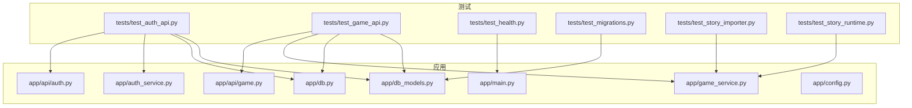
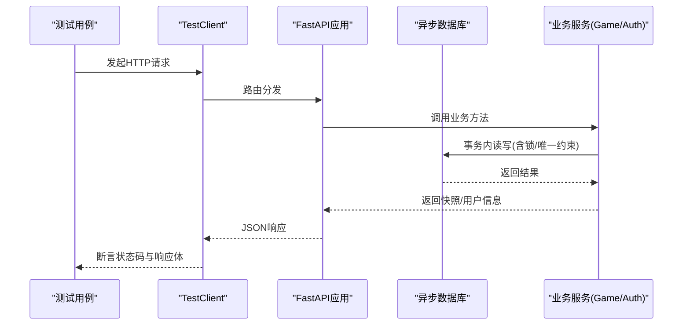
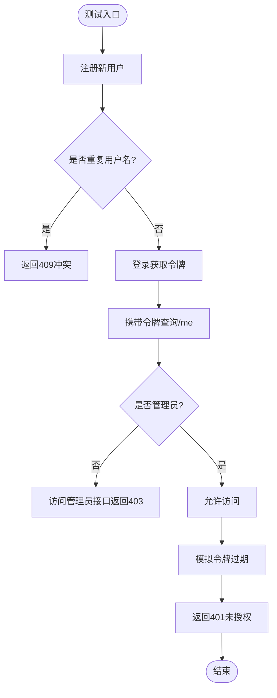
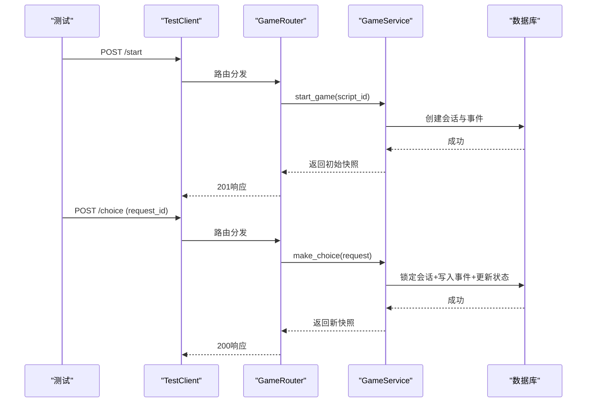
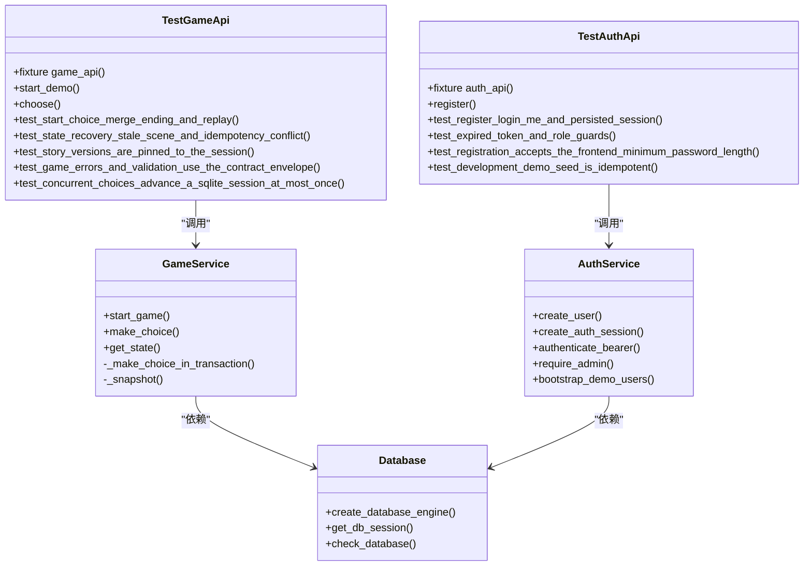

# 单元测试

<cite>
**本文引用的文件**   
- [pytest.ini](file://backend/pytest.ini)
- [test_auth_api.py](file://backend/tests/test_auth_api.py)
- [test_game_api.py](file://backend/tests/test_game_api.py)
- [test_health.py](file://backend/tests/test_health.py)
- [test_migrations.py](file://backend/tests/test_migrations.py)
- [test_story_importer.py](file://backend/tests/test_story_importer.py)
- [test_story_runtime.py](file://backend/tests/test_story_runtime.py)
- [main.py](file://backend/app/main.py)
- [config.py](file://backend/app/config.py)
- [db.py](file://backend/app/db.py)
- [db_models.py](file://backend/app/db_models.py)
- [game_service.py](file://backend/app/game_service.py)
- [auth_service.py](file://backend/app/auth_service.py)
- [api/auth.py](file://backend/app/api/auth.py)
- [api/game.py](file://backend/app/api/game.py)
</cite>

## 目录
1. [简介](#简介)
2. [项目结构](#项目结构)
3. [核心组件](#核心组件)
4. [架构总览](#架构总览)
5. [详细组件分析](#详细组件分析)
6. [依赖关系分析](#依赖关系分析)
7. [性能与并发测试要点](#性能与并发测试要点)
8. [故障排查指南](#故障排查指南)
9. [结论](#结论)
10. [附录：覆盖率与最佳实践](#附录覆盖率与最佳实践)

## 简介
本文件面向澳秘 Macau Mystery 项目的后端测试，系统性阐述如何使用 Pytest 对 FastAPI 路由、SQLAlchemy 模型、业务服务（游戏流程与认证）、以及第三方服务集成进行高质量单元测试与集成测试。文档覆盖以下主题：
- Pytest 配置与异步模式
- 测试夹具（fixture）设计、依赖注入与 Mock 策略
- 业务逻辑测试、数据库操作测试、AI 服务测试的编写方法
- 测试数据管理、幂等性与并发场景覆盖
- 错误场景与异常路径验证
- 覆盖率收集与分析、性能优化技巧与最佳实践

## 项目结构
后端测试位于 backend/tests 目录，围绕 FastAPI 应用、数据库、故事运行时与认证模块展开。关键配置文件为 pytest.ini，定义了异步模式、测试路径与 Python 路径。

**图表来源** 
- [pytest.ini:1-6](file://backend/pytest.ini#L1-L6)
- [test_auth_api.py:1-208](file://backend/tests/test_auth_api.py#L1-L208)
- [test_game_api.py:1-210](file://backend/tests/test_game_api.py#L1-L210)
- [test_health.py:1-23](file://backend/tests/test_health.py#L1-L23)
- [test_migrations.py:1-61](file://backend/tests/test_migrations.py#L1-L61)
- [test_story_importer.py:1-60](file://backend/tests/test_story_importer.py#L1-L60)
- [test_story_runtime.py:1-83](file://backend/tests/test_story_runtime.py#L1-L83)
- [main.py:1-111](file://backend/app/main.py#L1-L111)
- [api/auth.py:1-97](file://backend/app/api/auth.py#L1-L97)
- [api/game.py:1-37](file://backend/app/api/game.py#L1-L37)
- [game_service.py:1-386](file://backend/app/game_service.py#L1-L386)
- [auth_service.py:1-153](file://backend/app/auth_service.py#L1-L153)
- [db.py:1-42](file://backend/app/db.py#L1-L42)
- [db_models.py:1-160](file://backend/app/db_models.py#L1-L160)
- [config.py:1-77](file://backend/app/config.py#L1-L77)

**章节来源**
- [pytest.ini:1-6](file://backend/pytest.ini#L1-L6)

## 核心组件
- 应用入口与异常处理：FastAPI 应用创建、全局异常处理器、健康检查端点
- 配置系统：环境变量驱动的 Settings，支持缓存清理与环境切换
- 数据库层：异步引擎、会话工厂、SQLite 外键与超时配置
- 业务服务：游戏流程（开始、选择、状态查询）、认证（注册、登录、令牌校验）
- API 路由：FastAPI Router 定义接口契约与响应模型

这些组件在测试中被通过 TestClient、依赖注入覆盖、临时数据库与脚本导入等方式进行端到端与单元级验证。

**章节来源**
- [main.py:17-111](file://backend/app/main.py#L17-L111)
- [config.py:38-77](file://backend/app/config.py#L38-L77)
- [db.py:12-42](file://backend/app/db.py#L12-L42)
- [game_service.py:31-386](file://backend/app/game_service.py#L31-L386)
- [auth_service.py:1-153](file://backend/app/auth_service.py#L1-L153)
- [api/auth.py:24-97](file://backend/app/api/auth.py#L24-L97)
- [api/game.py:12-37](file://backend/app/api/game.py#L12-L37)

## 架构总览
下图展示了测试如何驱动应用、数据库与服务交互的整体流程。

**图表来源** 
- [api/game.py:15-37](file://backend/app/api/game.py#L15-L37)
- [api/auth.py:64-97](file://backend/app/api/auth.py#L64-L97)
- [game_service.py:70-193](file://backend/app/game_service.py#L70-L193)
- [auth_service.py:63-124](file://backend/app/auth_service.py#L63-L124)
- [db.py:30-42](file://backend/app/db.py#L30-L42)

## 详细组件分析

### 认证 API 测试（注册、登录、权限、幂等）
- 使用 TestClient 与自定义 AuthHarness fixture 提供隔离的 SQLite 数据库与会话工厂
- 通过 monkeypatch 禁用演示数据初始化，确保测试可重复
- 覆盖用户名冲突、密码长度校验、角色鉴权、过期令牌、重启后恢复等场景
- 直接访问数据库表验证持久化行为（用户哈希、会话记录）

**图表来源** 
- [test_auth_api.py:57-127](file://backend/tests/test_auth_api.py#L57-L127)
- [api/auth.py:64-97](file://backend/app/api/auth.py#L64-L97)
- [auth_service.py:63-124](file://backend/app/auth_service.py#L63-L124)

**章节来源**
- [test_auth_api.py:1-208](file://backend/tests/test_auth_api.py#L1-L208)
- [api/auth.py:24-97](file://backend/app/api/auth.py#L24-L97)
- [auth_service.py:1-153](file://backend/app/auth_service.py#L1-L153)

### 游戏 API 测试（开始、选择、状态、幂等、并发）
- 使用 ApiHarness fixture 准备临时数据库并导入演示剧本
- 覆盖完整流程：开始→选择→合并线索→结局→重放
- 验证幂等性（相同 request_id 返回相同结果）与冲突检测（STALE_SCENE、IDEMPOTENCY_CONFLICT）
- 并发提交同一会话的选择，确保最多一次推进（SQLite BEGIN IMMEDIATE + 唯一约束）

**图表来源** 
- [test_game_api.py:72-127](file://backend/tests/test_game_api.py#L72-L127)
- [api/game.py:15-37](file://backend/app/api/game.py#L15-L37)
- [game_service.py:70-193](file://backend/app/game_service.py#L70-L193)

**章节来源**
- [test_game_api.py:1-210](file://backend/tests/test_game_api.py#L1-L210)
- [api/game.py:12-37](file://backend/app/api/game.py#L12-L37)
- [game_service.py:31-386](file://backend/app/game_service.py#L31-L386)

### 健康检查测试
- 快速验证应用启动与数据库连通性
- 通过环境变量控制演示数据初始化，避免干扰

**章节来源**
- [test_health.py:1-23](file://backend/tests/test_health.py#L1-L23)
- [main.py:98-106](file://backend/app/main.py#L98-L106)

### 迁移测试
- 使用 subprocess 执行 alembic upgrade head，并在临时数据库中验证表结构与约束
- 验证外键关系、唯一约束（如 session_id+request_id、username_key）

**章节来源**
- [test_migrations.py:1-61](file://backend/tests/test_migrations.py#L1-L61)

### 故事导入器测试（版本化与去重）
- 验证 import_story_data 的幂等与版本递增行为
- 确认内容哈希去重、活跃版本更新、历史版本保留

**章节来源**
- [test_story_importer.py:1-60](file://backend/tests/test_story_importer.py#L1-L60)

### 故事运行时与校验测试
- 使用 StoryDocument、StoryGraph、validate_story_data 验证剧情数据结构与路由规则
- 覆盖占位媒体限制、缺失目标、循环路由、视频无选项等错误场景
- 验证条件分支（最小线索数、all_clues/any_clues）与最终结局选择

**章节来源**
- [test_story_runtime.py:1-83](file://backend/tests/test_story_runtime.py#L1-L83)

## 依赖关系分析
- 测试夹具通过 monkeypatch 与 dependency_overrides 替换 get_db_session，实现数据库解耦
- GameService 与 auth_service 依赖 SQLAlchemy 异步会话，测试中通过临时引擎与会话工厂注入
- 配置系统通过 lru_cache 缓存 Settings，测试中需显式清理缓存以生效新环境变量

**图表来源** 
- [test_auth_api.py:1-208](file://backend/tests/test_auth_api.py#L1-L208)
- [test_game_api.py:1-210](file://backend/tests/test_game_api.py#L1-L210)
- [game_service.py:31-386](file://backend/app/game_service.py#L31-L386)
- [auth_service.py:1-153](file://backend/app/auth_service.py#L1-L153)
- [db.py:12-42](file://backend/app/db.py#L12-L42)

**章节来源**
- [test_auth_api.py:1-208](file://backend/tests/test_auth_api.py#L1-L208)
- [test_game_api.py:1-210](file://backend/tests/test_game_api.py#L1-L210)
- [game_service.py:31-386](file://backend/app/game_service.py#L31-L386)
- [auth_service.py:1-153](file://backend/app/auth_service.py#L1-L153)
- [db.py:12-42](file://backend/app/db.py#L12-L42)

## 性能与并发测试要点
- SQLite 并发：使用 BEGIN IMMEDIATE 与 with_for_update 保证会话级独占写；通过唯一约束防止重复推进
- 幂等性：基于 request_id 的幂等记录与冲突检测，避免重复提交导致状态不一致
- 数据库连接池：启用 pool_pre_ping 与 SQLite PRAGMA 外键与超时设置，提升稳定性
- 测试隔离：每个测试使用 tmp_path 下的独立数据库文件，避免相互污染

**章节来源**
- [game_service.py:70-193](file://backend/app/game_service.py#L70-L193)
- [db.py:12-23](file://backend/app/db.py#L12-L23)
- [test_game_api.py:186-210](file://backend/tests/test_game_api.py#L186-L210)

## 故障排查指南
- 数据库未迁移：应用启动时若 bootstrap 失败会提示先执行 alembic upgrade head
- 验证错误：/api/v1/game 下统一返回 VALIDATION_ERROR 结构，便于前端解析
- 故事数据损坏：当已发布版本内容不合法或媒体未就绪，抛出 STORY_NOT_READY 或 STORY_DATA_CORRUPTED
- 会话状态异常：SESSION_COMPLETED、SESSION_NOT_ACTIVE、STALE_SCENE 等错误码用于客户端重试与回退

**章节来源**
- [main.py:21-34](file://backend/app/main.py#L21-L34)
- [main.py:51-74](file://backend/app/main.py#L51-L74)
- [game_service.py:195-234](file://backend/app/game_service.py#L195-L234)

## 结论
本项目采用清晰的分层架构与严格的测试策略，结合 Pytest 的异步支持与依赖注入机制，实现了从 API 到数据库、从业务逻辑到运行时校验的全链路覆盖。通过临时数据库、环境变量控制与幂等/并发保护，确保了测试的可重复性与健壮性。建议持续扩展 AI 服务与第三方集成的 Mock 测试，进一步提升整体质量与交付效率。

## 附录：覆盖率与最佳实践
- 覆盖率收集
  - 使用 pytest-cov 生成覆盖率报告，推荐按模块与函数粒度统计
  - 将 tests 目录纳入覆盖率采集，排除无关代码（如迁移脚本）
- 最佳实践
  - 使用 fixture 封装数据库准备与依赖注入，保持测试简洁
  - 针对外部依赖（AI、TTS、RAG）使用 unittest.mock 或 httpx.MockTransport 进行隔离
  - 优先断言业务语义（状态码、错误码、关键字段），而非具体实现细节
  - 对异步代码使用 @pytest.mark.asyncio 与 async fixtures，避免阻塞事件循环
  - 对并发场景使用 asyncio.gather 构造竞争条件，验证一致性

[本节为通用指导，不直接分析具体文件]