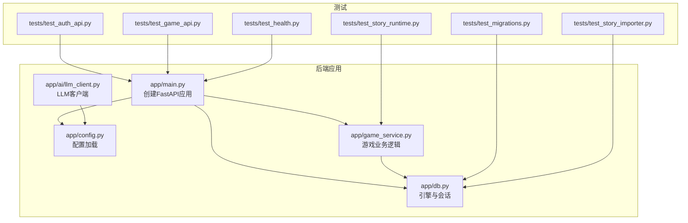
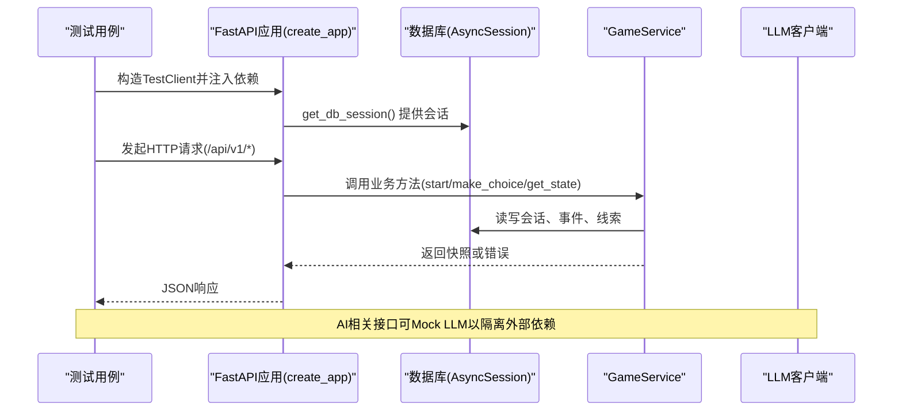
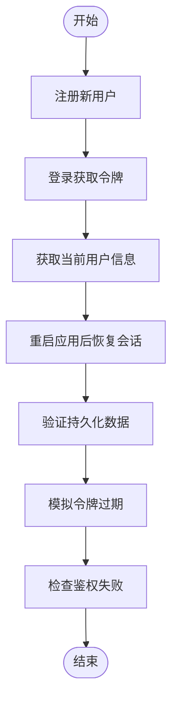
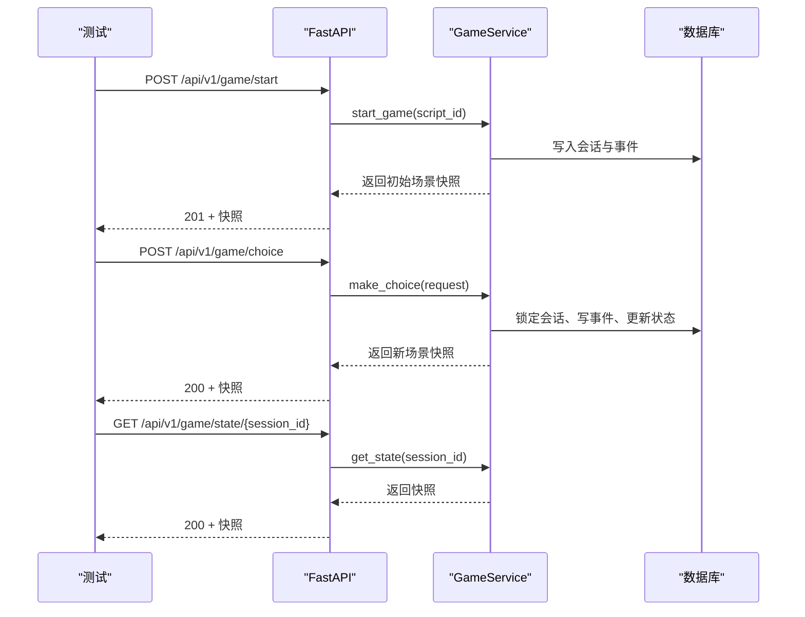
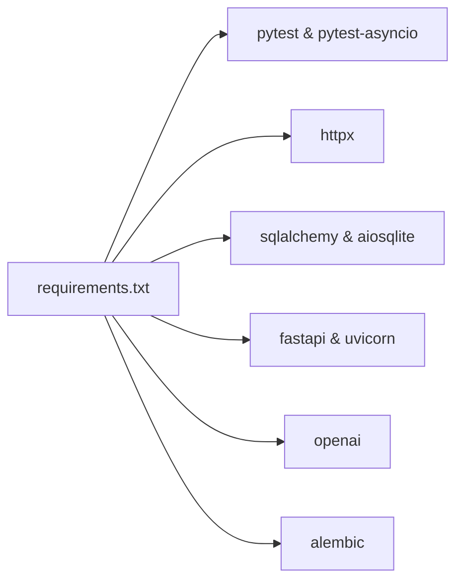

# 测试指南

<cite>
**本文引用的文件**   
- [backend/pytest.ini](file://backend/pytest.ini)
- [backend/requirements.txt](file://backend/requirements.txt)
- [backend/app/main.py](file://backend/app/main.py)
- [backend/app/config.py](file://backend/app/config.py)
- [backend/app/db.py](file://backend/app/db.py)
- [backend/app/game_service.py](file://backend/app/game_service.py)
- [backend/app/ai/llm_client.py](file://backend/app/ai/llm_client.py)
- [backend/tests/test_auth_api.py](file://backend/tests/test_auth_api.py)
- [backend/tests/test_game_api.py](file://backend/tests/test_game_api.py)
- [backend/tests/test_health.py](file://backend/tests/test_health.py)
- [backend/tests/test_migrations.py](file://backend/tests/test_migrations.py)
- [backend/tests/test_story_importer.py](file://backend/tests/test_story_importer.py)
- [backend/tests/test_story_runtime.py](file://backend/tests/test_story_runtime.py)
- [docker-compose.yml](file://docker-compose.yml)
</cite>

## 目录
1. [简介](#简介)
2. [项目结构](#项目结构)
3. [核心组件](#核心组件)
4. [架构总览](#架构总览)
5. [详细组件分析](#详细组件分析)
6. [依赖关系分析](#依赖关系分析)
7. [性能考虑](#性能考虑)
8. [故障排查指南](#故障排查指南)
9. [结论](#结论)
10. [附录](#附录)

## 简介
本指南面向澳秘 Macau Mystery 项目的测试实践，覆盖单元测试、集成测试与端到端测试的策略与实现。重点包括：
- Pytest 框架使用与异步支持
- API 接口测试、数据库测试与 AI 服务测试最佳实践
- Mock 对象模拟与环境配置
- 测试数据管理、持续集成流程
- 覆盖率分析与性能测试方法
- 常见问题的故障排查技巧

## 项目结构
后端采用 FastAPI + SQLAlchemy（异步）+ Alembic 迁移，测试集中在 backend/tests 目录，使用 pytest 与 pytest-asyncio 运行异步用例。应用通过 create_app 构建实例，依赖注入数据库会话，并通过中间件处理 CORS 与统一错误响应。

**图表来源** 
- [backend/app/main.py:17-107](file://backend/app/main.py#L17-L107)
- [backend/app/config.py:38-77](file://backend/app/config.py#L38-L77)
- [backend/app/db.py:12-42](file://backend/app/db.py#L12-L42)
- [backend/app/game_service.py:31-120](file://backend/app/game_service.py#L31-L120)
- [backend/app/ai/llm_client.py:1-32](file://backend/app/ai/llm_client.py#L1-L32)

**章节来源**
- [backend/app/main.py:17-107](file://backend/app/main.py#L17-L107)
- [backend/app/config.py:38-77](file://backend/app/config.py#L38-L77)
- [backend/app/db.py:12-42](file://backend/app/db.py#L12-L42)

## 核心组件
- 应用入口与路由注册：create_app 组装路由、异常处理器、CORS 与健康检查端点。
- 配置系统：Settings 从环境变量读取数据库、CORS、启动参数等，并缓存。
- 数据库层：异步引擎、会话工厂、SQLite 外键与忙超时设置。
- 游戏服务：事务性选择推进、幂等性、并发控制、状态快照生成。
- AI 客户端：OpenAI 兼容的异步调用封装。

**章节来源**
- [backend/app/main.py:17-107](file://backend/app/main.py#L17-L107)
- [backend/app/config.py:38-77](file://backend/app/config.py#L38-L77)
- [backend/app/db.py:12-42](file://backend/app/db.py#L12-L42)
- [backend/app/game_service.py:31-120](file://backend/app/game_service.py#L31-L120)
- [backend/app/ai/llm_client.py:1-32](file://backend/app/ai/llm_client.py#L1-L32)

## 架构总览
下图展示测试如何与后端应用交互，以及关键依赖关系。

**图表来源** 
- [backend/app/main.py:84-107](file://backend/app/main.py#L84-L107)
- [backend/app/db.py:30-42](file://backend/app/db.py#L30-L42)
- [backend/app/game_service.py:35-120](file://backend/app/game_service.py#L35-L120)
- [backend/app/ai/llm_client.py:12-32](file://backend/app/ai/llm_client.py#L12-L32)

## 详细组件分析

### 测试环境与Pytest配置
- 异步模式：启用 asyncio_mode=auto 与 fixture 作用域。
- Python路径：将 backend 根目录加入 pythonpath，便于导入 app 模块。
- 测试路径：tests 目录。

**章节来源**
- [backend/pytest.ini:1-6](file://backend/pytest.ini#L1-L6)

### 健康检查测试
- 验证 /api/v1/health 在数据库可用时返回正常状态码与版本信息。
- 通过 monkeypatch 禁用演示数据初始化，避免副作用。

**章节来源**
- [backend/tests/test_health.py:9-23](file://backend/tests/test_health.py#L9-L23)
- [backend/app/main.py:98-107](file://backend/app/main.py#L98-L107)

### 认证与授权测试（集成测试）
- 注册、登录、权限校验、会话持久化、令牌过期与角色守卫。
- 使用临时 SQLite 数据库与自定义 session_factory 注入到应用依赖中。
- 验证密码哈希存储、用户名规范化、重复注册冲突、管理员与普通用户权限差异。

**图表来源** 
- [backend/tests/test_auth_api.py:26-55](file://backend/tests/test_auth_api.py#L26-L55)
- [backend/tests/test_auth_api.py:66-127](file://backend/tests/test_auth_api.py#L66-L127)
- [backend/tests/test_auth_api.py:130-174](file://backend/tests/test_auth_api.py#L130-L174)

**章节来源**
- [backend/tests/test_auth_api.py:26-55](file://backend/tests/test_auth_api.py#L26-L55)
- [backend/tests/test_auth_api.py:66-127](file://backend/tests/test_auth_api.py#L66-L127)
- [backend/tests/test_auth_api.py:130-174](file://backend/tests/test_auth_api.py#L130-L174)

### 游戏API端到端测试
- 覆盖故事启动、选择推进、结局判定、重放与幂等性、并发冲突、状态恢复。
- 使用临时数据库与演示剧本数据，注入会话工厂到应用依赖。
- 验证错误契约（VALIDATION_ERROR、STORY_NOT_FOUND、SESSION_NOT_FOUND、STALE_SCENE、IDEMPOTENCY_CONFLICT）。

**图表来源** 
- [backend/tests/test_game_api.py:37-70](file://backend/tests/test_game_api.py#L37-L70)
- [backend/tests/test_game_api.py:90-127](file://backend/tests/test_game_api.py#L90-L127)
- [backend/tests/test_game_api.py:129-149](file://backend/tests/test_game_api.py#L129-L149)
- [backend/app/game_service.py:35-120](file://backend/app/game_service.py#L35-L120)

**章节来源**
- [backend/tests/test_game_api.py:37-70](file://backend/tests/test_game_api.py#L37-L70)
- [backend/tests/test_game_api.py:90-127](file://backend/tests/test_game_api.py#L90-L127)
- [backend/tests/test_game_api.py:129-149](file://backend/tests/test_game_api.py#L129-L149)
- [backend/app/game_service.py:35-120](file://backend/app/game_service.py#L35-L120)

### 故事导入与版本控制测试
- 验证导入创建不可变版本、内容去重、活跃版本切换。
- 使用异步会话与临时数据库，确保幂等导入与版本序列正确。

**章节来源**
- [backend/tests/test_story_importer.py:23-60](file://backend/tests/test_story_importer.py#L23-L60)

### 故事运行时与校验测试
- 校验文档合法性、占位媒体限制、缺失目标与循环路由检测。
- 验证条件分支合并与最小条件语义（all/any/clue计数）。

**章节来源**
- [backend/tests/test_story_runtime.py:25-83](file://backend/tests/test_story_runtime.py#L25-L83)

### 迁移测试
- 执行 alembic upgrade head 并在 SQLite 中检查表结构与约束。
- 验证外键关系与唯一约束。

**章节来源**
- [backend/tests/test_migrations.py:15-61](file://backend/tests/test_migrations.py#L15-L61)

### AI服务测试策略（Mock）
- 使用 httpx 或 unittest.mock 对 AsyncOpenAI 进行替换，避免真实网络调用。
- 固定温度、最大 token 数与模型名称，确保输出稳定。
- 针对 NPC 对话与提示模板，构造上下文与期望响应断言。

**章节来源**
- [backend/app/ai/llm_client.py:1-32](file://backend/app/ai/llm_client.py#L1-L32)

## 依赖关系分析
- 测试依赖：pytest、pytest-asyncio、httpx、SQLAlchemy 异步驱动。
- 应用依赖：FastAPI、Uvicorn、Alembic、OpenAI SDK、ChromaDB、Edge TTS、Pydantic、pwdlib。

**图表来源** 
- [backend/requirements.txt:1-17](file://backend/requirements.txt#L1-L17)

**章节来源**
- [backend/requirements.txt:1-17](file://backend/requirements.txt#L1-L17)

## 性能考虑
- 数据库连接池与 SQLite 优化：启用 PRAGMA foreign_keys 与 busy_timeout，减少锁竞争。
- 并发选择推进：使用 with_for_update 与事务边界保证一致性；SQLite 下显式 BEGIN IMMEDIATE。
- 幂等性与重放：基于 request_id 与事件记录避免重复推进。
- 建议：在高并发场景下评估 PostgreSQL 替代方案，增加索引与查询优化。

**章节来源**
- [backend/app/db.py:12-23](file://backend/app/db.py#L12-L23)
- [backend/app/game_service.py:70-83](file://backend/app/game_service.py#L70-L83)
- [backend/app/game_service.py:89-113](file://backend/app/game_service.py#L89-L113)
- [backend/app/game_service.py:353-369](file://backend/app/game_service.py#L353-L369)

## 故障排查指南
- 数据库未迁移：启动时报错需先执行 alembic upgrade head。
- 健康检查降级：数据库不可用时返回 503 与 degraded 状态。
- 校验错误：/api/v1/game 路径下的 422 错误包含结构化 details。
- 并发冲突：STALE_SCENE、IDEMPOTENCY_CONFLICT 表示并发或幂等性问题。
- 故事数据损坏：STORY_DATA_CORRUPTED 表明已发布版本内容异常。

**章节来源**
- [backend/app/main.py:32-34](file://backend/app/main.py#L32-L34)
- [backend/app/main.py:98-107](file://backend/app/main.py#L98-L107)
- [backend/app/main.py:51-74](file://backend/app/main.py#L51-L74)
- [backend/app/game_service.py:100-113](file://backend/app/game_service.py#L100-L113)
- [backend/app/game_service.py:379-385](file://backend/app/game_service.py#L379-L385)

## 结论
本项目测试体系覆盖了健康检查、认证授权、游戏API、故事导入与运行时、数据库迁移等关键路径。通过临时数据库、依赖注入与 Mock 策略，实现了高内聚、低耦合的可维护测试。建议在 CI 中引入覆盖率与性能基准，进一步提升质量保障能力。

## 附录

### 测试环境配置
- Docker Compose：设置 DATABASE_URL、APP_ENV，自动执行迁移并启动 Uvicorn。
- 环境变量：BOOTSTRAP_DEMO_STORY、BOOTSTRAP_DEMO_USERS、AUTH_TOKEN_TTL_HOURS、DEMO_* 等。

**章节来源**
- [docker-compose.yml:1-21](file://docker-compose.yml#L1-L21)
- [backend/app/config.py:56-77](file://backend/app/config.py#L56-L77)

### 测试数据管理
- 演示剧本：位于 app/story/scripts/macau_mystery_demo.json，用于导入与运行时校验。
- 临时数据库：每个测试使用 tmp_path 下的独立 SQLite 文件，避免污染。

**章节来源**
- [backend/tests/test_game_api.py:23-28](file://backend/tests/test_game_api.py#L23-L28)
- [backend/tests/test_story_importer.py:16-21](file://backend/tests/test_story_importer.py#L16-L21)

### 持续集成流程建议
- 安装依赖：pip install -r requirements.txt
- 运行测试：pytest -v --tb=short
- 覆盖率：pytest --cov=app --cov-report=html
- 迁移验证：在容器内执行 alembic upgrade head 并检查健康端点

[无章节来源，因为本节为通用指导]

### 覆盖率与性能测试方法
- 覆盖率：使用 pytest-cov 生成 HTML 报告，关注核心模块（game_service、auth_service、story 模块）。
- 性能：使用 locust 或 k6 对 /api/v1/game 与 /api/v1/auth 进行压测，监控数据库锁与响应时间。
- 基准：对 StoryGraph 解析与选择推进进行微基准测试，评估并发与内存占用。

[无章节来源，因为本节为通用指导]