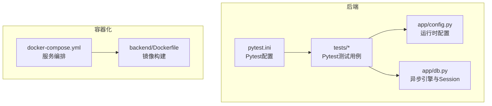
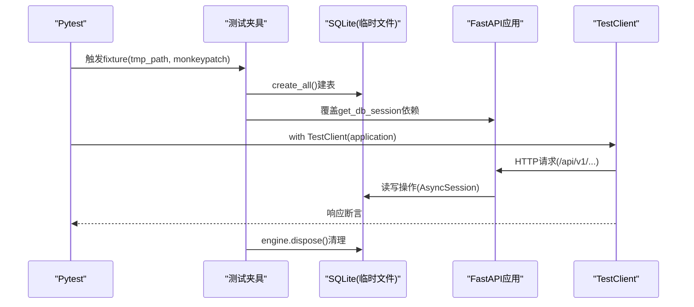
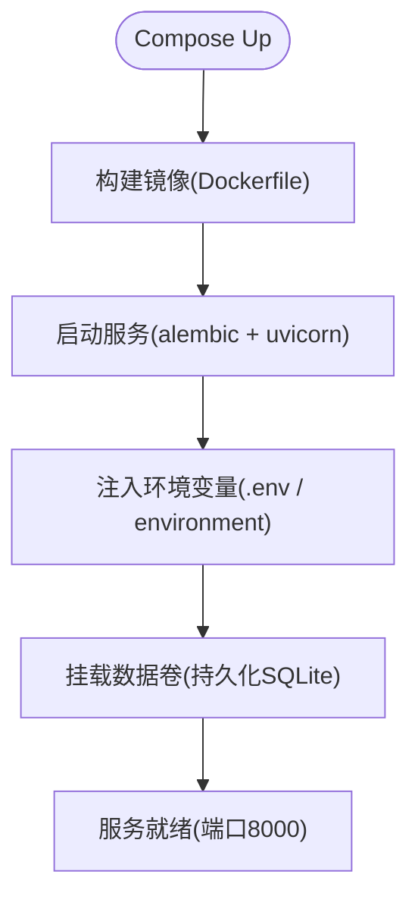
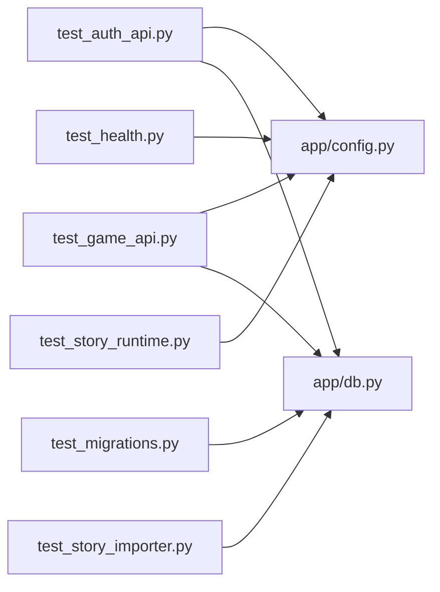

# 测试配置与环境

<cite>
**本文引用的文件**   
- [backend/pytest.ini](file://backend/pytest.ini)
- [backend/Dockerfile](file://backend/Dockerfile)
- [docker-compose.yml](file://docker-compose.yml)
- [backend/app/config.py](file://backend/app/config.py)
- [backend/app/db.py](file://backend/app/db.py)
- [backend/tests/test_auth_api.py](file://backend/tests/test_auth_api.py)
- [backend/tests/test_game_api.py](file://backend/tests/test_game_api.py)
- [backend/tests/test_health.py](file://backend/tests/test_health.py)
- [backend/tests/test_migrations.py](file://backend/tests/test_migrations.py)
- [backend/tests/test_story_importer.py](file://backend/tests/test_story_importer.py)
- [backend/tests/test_story_runtime.py](file://backend/tests/test_story_runtime.py)
- [backend/requirements.txt](file://backend/requirements.txt)
</cite>

## 目录
1. [简介](#简介)
2. [项目结构](#项目结构)
3. [核心组件](#核心组件)
4. [架构总览](#架构总览)
5. [详细组件分析](#详细组件分析)
6. [依赖关系分析](#依赖关系分析)
7. [性能考虑](#性能考虑)
8. [故障排查指南](#故障排查指南)
9. [结论](#结论)
10. [附录](#附录)

## 简介
本文件面向澳秘 Macau Mystery 项目的测试配置与环境管理，系统性说明 Pytest 配置、测试夹具与依赖注入、环境变量与配置隔离、SQLite 内存/临时数据库策略、Docker 容器化测试执行与服务编排、覆盖率与报告生成思路，以及持续集成环境搭建建议。文档同时提供并行测试执行、结果收集、日志记录与调试技巧，帮助读者快速搭建稳定可靠的测试环境。

## 项目结构
后端测试位于 backend/tests 目录，使用 pytest + pytest-asyncio 运行异步测试；应用配置通过 app/config.py 集中管理，数据库连接与引擎在 app/db.py 中创建并暴露依赖注入点；Docker 构建与编排由 backend/Dockerfile 与 docker-compose.yml 定义。

**图示来源** 
- [backend/app/config.py:1-77](file://backend/app/config.py#L1-L77)
- [backend/app/db.py:1-42](file://backend/app/db.py#L1-L42)
- [backend/pytest.ini:1-6](file://backend/pytest.ini#L1-L6)
- [backend/Dockerfile:1-13](file://backend/Dockerfile#L1-L13)
- [docker-compose.yml:1-21](file://docker-compose.yml#L1-L21)

**章节来源**
- [backend/pytest.ini:1-6](file://backend/pytest.ini#L1-L6)
- [backend/Dockerfile:1-13](file://backend/Dockerfile#L1-L13)
- [docker-compose.yml:1-21](file://docker-compose.yml#L1-L21)
- [backend/app/config.py:1-77](file://backend/app/config.py#L1-L77)
- [backend/app/db.py:1-42](file://backend/app/db.py#L1-L42)

## 核心组件
- Pytest 配置：启用自动 async 模式、设置默认 fixture 作用域、指定 Python 路径与测试目录。
- 配置中心：Settings dataclass 从环境变量加载数据库 URL、CORS、启动引导开关、认证 TTL、演示账号等，并提供 is_production 判断。
- 数据库层：基于 SQLAlchemy 异步引擎，针对 SQLite 开启外键约束与忙超时；暴露 get_db_session 供 FastAPI 依赖注入替换。
- 测试夹具：每个测试模块通过 tmp_path 创建独立 SQLite 文件，构造 Engine/Session，并在 TestClient 中覆盖依赖注入，确保测试间完全隔离。
- Docker 与编排：镜像以 python:3.11-slim 为基础，安装依赖并启动 uvicorn；compose 挂载源码卷、持久化 SQLite 数据卷，并通过环境变量注入 DATABASE_URL 与 APP_ENV。

**章节来源**
- [backend/pytest.ini:1-6](file://backend/pytest.ini#L1-L6)
- [backend/app/config.py:1-77](file://backend/app/config.py#L1-L77)
- [backend/app/db.py:1-42](file://backend/app/db.py#L1-L42)
- [backend/tests/test_auth_api.py:1-208](file://backend/tests/test_auth_api.py#L1-L208)
- [backend/tests/test_game_api.py:1-210](file://backend/tests/test_game_api.py#L1-L210)
- [backend/Dockerfile:1-13](file://backend/Dockerfile#L1-L13)
- [docker-compose.yml:1-21](file://docker-compose.yml#L1-L21)

## 架构总览
下图展示测试执行时的关键交互：Pytest 启动 -> 夹具创建临时 SQLite -> 初始化表结构 -> 注入自定义 Session -> 启动 TestClient -> 调用 API -> 验证状态与存储。

**图示来源** 
- [backend/tests/test_auth_api.py:26-54](file://backend/tests/test_auth_api.py#L26-L54)
- [backend/tests/test_game_api.py:37-69](file://backend/tests/test_game_api.py#L37-L69)
- [backend/app/db.py:12-33](file://backend/app/db.py#L12-L33)

## 详细组件分析

### Pytest 配置与异步支持
- 启用 asyncio_mode=auto，无需在每个测试函数上显式标记 @pytest.mark.asyncio（但部分测试仍使用装饰器）。
- 设置 asyncio_default_fixture_loop_scope=function，保证每个函数级 fixture 拥有独立的异步事件循环。
- pythonpath=. 允许直接导入 app.* 模块。
- testpaths=tests 限定测试扫描目录。

**章节来源**
- [backend/pytest.ini:1-6](file://backend/pytest.ini#L1-L6)

### 测试夹具与依赖注入
- 通用模式：为每个测试创建独立的 SQLite 文件（tmp_path），构造 AsyncEngine 与 async_sessionmaker，先建表再注入到应用。
- 依赖覆盖：通过 application.dependency_overrides[get_db_session] 将业务代码的数据库会话指向测试专用 session_factory，避免影响真实数据库。
- 清理：测试结束后调用 engine.dispose() 释放连接，必要时清除 get_settings 缓存以重置环境变量生效。

示例参考：
- 认证接口夹具：[backend/tests/test_auth_api.py:26-54](file://backend/tests/test_auth_api.py#L26-L54)
- 游戏接口夹具：[backend/tests/test_game_api.py:37-69](file://backend/tests/test_game_api.py#L37-L69)

**章节来源**
- [backend/tests/test_auth_api.py:26-54](file://backend/tests/test_auth_api.py#L26-L54)
- [backend/tests/test_game_api.py:37-69](file://backend/tests/test_game_api.py#L37-L69)
- [backend/app/db.py:30-33](file://backend/app/db.py#L30-L33)

### 环境变量与配置隔离
- Settings 从环境变量读取：DATABASE_URL、CORS_ORIGINS、APP_ENV、BOOTSTRAP_DEMO_STORY、BOOTSTRAP_DEMO_USERS、AUTH_TOKEN_TTL_HOURS、DEMO_* 系列。
- 测试中通过 monkeypatch.setenv 修改环境变量，并调用 get_settings.cache_clear() 使新配置生效。
- 健康检查与迁移测试均关闭演示数据引导，确保最小化依赖。

示例参考：
- 配置加载与布尔/整数解析：[backend/app/config.py:13-36](file://backend/app/config.py#L13-L36)
- 健康测试中的环境变量切换：[backend/tests/test_health.py:9-23](file://backend/tests/test_health.py#L9-L23)

**章节来源**
- [backend/app/config.py:1-77](file://backend/app/config.py#L1-L77)
- [backend/tests/test_health.py:9-23](file://backend/tests/test_health.py#L9-L23)

### 测试数据库策略（SQLite）
- 引擎创建：create_database_engine 根据 database_url 创建异步引擎，并对 SQLite 设置 PRAGMA foreign_keys=ON 与 busy_timeout=5000，提升并发稳定性。
- 会话工厂：async_sessionmaker(engine, expire_on_commit=False) 用于测试内多次访问同一会话。
- 建表：Base.metadata.create_all 在测试前一次性创建所有模型表。
- 迁移测试：通过 subprocess 调用 alembic upgrade head，并使用 inspect 校验表结构与约束。

示例参考：
- 引擎与会话：[backend/app/db.py:12-27](file://backend/app/db.py#L12-L27)
- 迁移测试脚本：[backend/tests/test_migrations.py:15-61](file://backend/tests/test_migrations.py#L15-L61)

**章节来源**
- [backend/app/db.py:12-27](file://backend/app/db.py#L12-L27)
- [backend/tests/test_migrations.py:15-61](file://backend/tests/test_migrations.py#L15-L61)

### 测试用例分类与行为
- 认证接口测试：注册、登录、权限控制、令牌过期、演示用户种子幂等性。
- 游戏接口测试：开始游戏、选择分支、结局合并、重放、状态恢复、版本锁定、错误契约、并发选择冲突处理。
- 故事导入与运行时：版本不可变、内容去重、校验规则（缺失目标、路由环、无选择的视频）、条件分支语义。

示例参考：
- 认证测试：[backend/tests/test_auth_api.py:66-208](file://backend/tests/test_auth_api.py#L66-L208)
- 游戏测试：[backend/tests/test_game_api.py:90-210](file://backend/tests/test_game_api.py#L90-L210)
- 导入测试：[backend/tests/test_story_importer.py:23-60](file://backend/tests/test_story_importer.py#L23-L60)
- 运行时测试：[backend/tests/test_story_runtime.py:25-83](file://backend/tests/test_story_runtime.py#L25-L83)

**章节来源**
- [backend/tests/test_auth_api.py:66-208](file://backend/tests/test_auth_api.py#L66-L208)
- [backend/tests/test_game_api.py:90-210](file://backend/tests/test_game_api.py#L90-L210)
- [backend/tests/test_story_importer.py:23-60](file://backend/tests/test_story_importer.py#L23-L60)
- [backend/tests/test_story_runtime.py:25-83](file://backend/tests/test_story_runtime.py#L25-L83)

### Docker 容器中的测试执行与镜像构建
- 镜像基础：python:3.11-slim，复制 requirements.txt 并安装依赖，复制源码，暴露 8000 端口，启动 uvicorn。
- 开发/测试常用命令：
  - 构建镜像：docker build -t macau-mystery-backend ./backend
  - 运行容器：docker run --rm -p 8000:8000 -e DATABASE_URL=sqlite+aiosqlite:///app/data/macau_mystery.db -e APP_ENV=development macau-mystery-backend
- 在容器内执行测试：
  - docker run --rm -v $(pwd)/backend:/app -w /app python:3.11-slim bash -c "pip install -r requirements.txt && pytest tests/"

注意：容器内测试需确保 alembic 已升级或测试夹具已建表；若需要外部依赖（如向量库、TTS），应在镜像中安装或在测试中 mock。

**章节来源**
- [backend/Dockerfile:1-13](file://backend/Dockerfile#L1-L13)

### 服务编排与测试环境
- compose 定义 backend 服务，构建上下文为 ./backend，映射 8000 端口，挂载源码卷与 SQLite 数据卷。
- 环境变量：DATABASE_URL 指向容器内持久化路径，APP_ENV=development；可选 .env 文件注入其他配置。
- 启动命令：先执行 alembic upgrade head，再启动 uvicorn 并启用重载。

**图示来源** 
- [docker-compose.yml:1-21](file://docker-compose.yml#L1-L21)
- [backend/Dockerfile:1-13](file://backend/Dockerfile#L1-L13)

**章节来源**
- [docker-compose.yml:1-21](file://docker-compose.yml#L1-L21)

### 覆盖率配置、报告生成与 CI 搭建
- 覆盖率工具：建议使用 coverage 或 pytest-cov。可通过命令行参数生成 HTML/XML 报告，便于归档与上传。
- 典型命令：
  - 本地运行并生成报告：pytest tests/ --cov=app --cov-report=html --cov-report=xml
  - 过滤模块：--cov-fail-under=80 设置阈值
- CI 建议（GitHub Actions 示例思路）：
  - 步骤：设置 Python、安装依赖、构建镜像（可选）、运行测试、生成覆盖率报告、上传产物、失败告警。
  - 缓存 pip 与构建缓存以提升速度。
  - 并行执行：按模块拆分 jobs 或使用 pytest-xdist 并行。

注：仓库未包含 .coveragerc 或 CI 配置文件，以上为通用实践建议。

**章节来源**
- [backend/requirements.txt:15-17](file://backend/requirements.txt#L15-L17)

### 测试隔离、并行执行与结果收集
- 隔离：每个测试夹具使用 tmp_path 创建独立 SQLite 文件，避免跨用例污染；必要时重启应用实例并重新注入依赖。
- 并行：可安装 pytest-xdist 并使用 -n auto 并行执行；注意共享资源（如 Alembic 迁移、外部服务）需在并行下安全。
- 结果收集：pytest 原生输出 junit XML（--junitxml=report.xml），便于 CI 聚合；HTML 报告可用于本地分析。

**章节来源**
- [backend/tests/test_auth_api.py:26-54](file://backend/tests/test_auth_api.py#L26-L54)
- [backend/tests/test_game_api.py:37-69](file://backend/tests/test_game_api.py#L37-L69)

### 测试日志记录、调试技巧与故障排查
- 日志级别：可在测试中设置 logging 级别，或使用 pytest -s 打印 stdout/stderr。
- 常见调试：
  - 查看数据库状态：在夹具中导出 session_factory 后直接查询表结构或数据。
  - 确认依赖覆盖：断言 application.dependency_overrides 是否生效。
  - 环境变量生效：确保 get_settings.cache_clear() 被调用。
- 常见问题：
  - SQLite 并发写入冲突：合理设置 busy_timeout，避免在同一进程内并发写同一文件；必要时使用不同文件或内存数据库。
  - 迁移失败：检查 DATABASE_URL 是否正确指向临时文件，并确保 alembic 命令在正确工作目录执行。

**章节来源**
- [backend/app/db.py:14-22](file://backend/app/db.py#L14-L22)
- [backend/tests/test_migrations.py:15-61](file://backend/tests/test_migrations.py#L15-L61)

## 依赖关系分析
测试模块依赖应用配置与数据库层，并通过依赖注入解耦。以下为关键依赖图：

**图示来源** 
- [backend/tests/test_auth_api.py:1-208](file://backend/tests/test_auth_api.py#L1-L208)
- [backend/tests/test_game_api.py:1-210](file://backend/tests/test_game_api.py#L1-L210)
- [backend/tests/test_health.py:1-23](file://backend/tests/test_health.py#L1-L23)
- [backend/tests/test_migrations.py:1-61](file://backend/tests/test_migrations.py#L1-L61)
- [backend/tests/test_story_importer.py:1-60](file://backend/tests/test_story_importer.py#L1-L60)
- [backend/tests/test_story_runtime.py:1-83](file://backend/tests/test_story_runtime.py#L1-L83)
- [backend/app/config.py:1-77](file://backend/app/config.py#L1-L77)
- [backend/app/db.py:1-42](file://backend/app/db.py#L1-L42)

**章节来源**
- [backend/tests/test_auth_api.py:1-208](file://backend/tests/test_auth_api.py#L1-L208)
- [backend/tests/test_game_api.py:1-210](file://backend/tests/test_game_api.py#L1-L210)
- [backend/app/config.py:1-77](file://backend/app/config.py#L1-L77)
- [backend/app/db.py:1-42](file://backend/app/db.py#L1-L42)

## 性能考虑
- SQLite 并发：busy_timeout 与 PRAGMA foreign_keys=ON 已在引擎层设置；高并发场景建议减少写竞争，或使用内存数据库（sqlite+aiosqlite:///:memory:）加速读多写少的测试。
- 测试启动开销：避免重复创建引擎与建表，尽量复用 fixture 生命周期；对大型数据集采用按需插入。
- 并行执行：使用 pytest-xdist 时，确保每个 worker 有独立数据库文件，避免锁冲突。

[本节为通用指导，不直接分析具体文件]

## 故障排查指南
- 健康检查失败：检查 DATABASE_URL 是否有效，确认 alembic 已迁移；查看 /api/v1/health 返回体。
- 认证异常：确认密码哈希、用户名唯一性、令牌过期时间；检查演示用户种子是否幂等。
- 游戏状态异常：核对 scene_id、choice_id、request_id 一致性；关注 STALE_SCENE 与 IDEMPOTENCY_CONFLICT 错误码。
- 迁移问题：确认 alembic 命令工作目录与 DATABASE_URL；使用 inspect 检查表名与约束是否符合预期。

**章节来源**
- [backend/tests/test_health.py:9-23](file://backend/tests/test_health.py#L9-L23)
- [backend/tests/test_auth_api.py:130-208](file://backend/tests/test_auth_api.py#L130-L208)
- [backend/tests/test_game_api.py:129-210](file://backend/tests/test_game_api.py#L129-L210)
- [backend/tests/test_migrations.py:31-61](file://backend/tests/test_migrations.py#L31-L61)

## 结论
本项目测试体系围绕 Pytest 与 SQLAlchemy 异步生态构建，通过临时 SQLite 与依赖注入实现强隔离与高可控性；Docker 与 Compose 提供一致的本地与 CI 环境。建议在现有基础上引入覆盖率统计与并行执行，完善报告归档与失败告警，进一步提升质量与效率。

[本节为总结性内容，不直接分析具体文件]

## 附录
- 常用命令速查：
  - 运行测试：pytest tests/
  - 带覆盖率：pytest tests/ --cov=app --cov-report=html --cov-report=xml
  - 并行执行：pytest tests/ -n auto
  - 容器内测试：docker run --rm -v $(pwd)/backend:/app -w /app python:3.11-slim bash -c "pip install -r requirements.txt && pytest tests/"
- 环境变量清单（节选）：
  - DATABASE_URL：数据库连接串（测试中指向临时 SQLite）
  - APP_ENV：应用环境（development/production）
  - BOOTSTRAP_DEMO_STORY/BOOTSTRAP_DEMO_USERS：是否导入演示数据
  - AUTH_TOKEN_TTL_HOURS：令牌有效期
  - DEMO_ADMIN_USERNAME/DEMO_ADMIN_PASSWORD/DEMO_GUEST_USERNAME/DEMO_GUEST_PASSWORD：演示账号

[本节为补充信息，不直接分析具体文件]