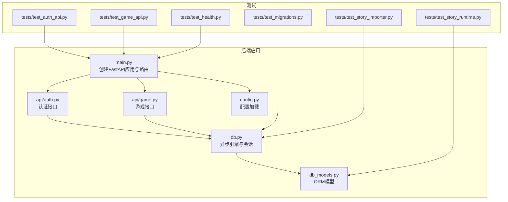
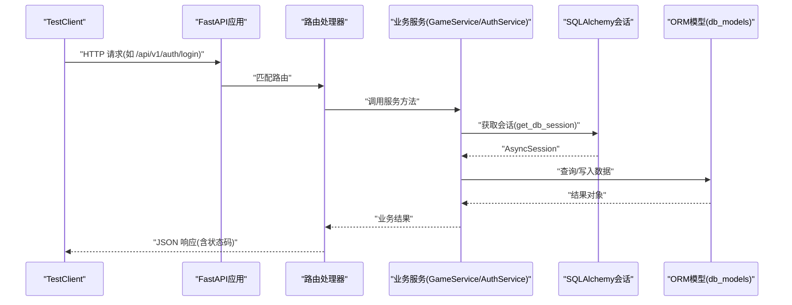
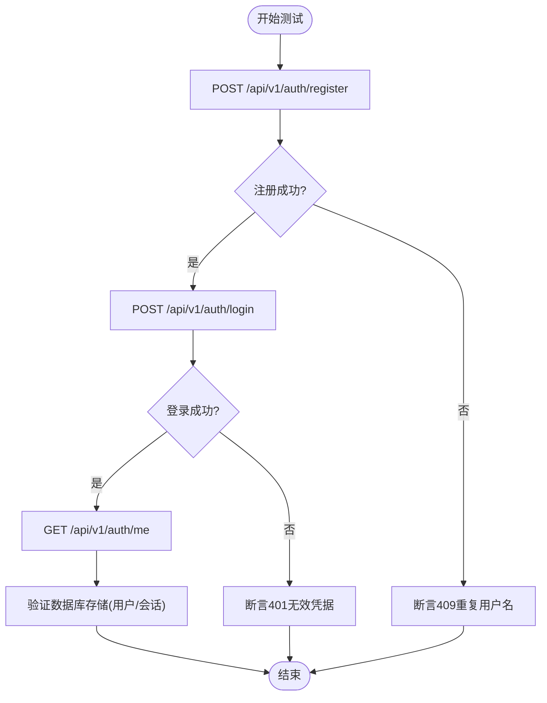
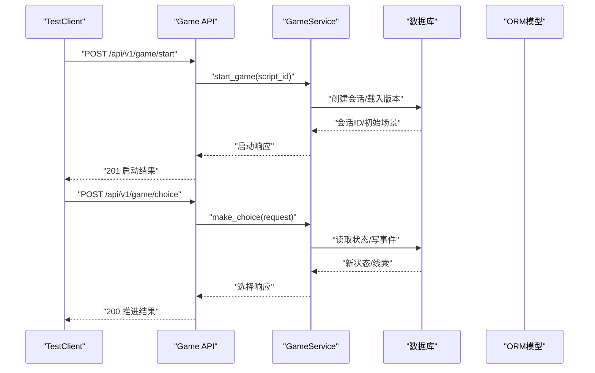
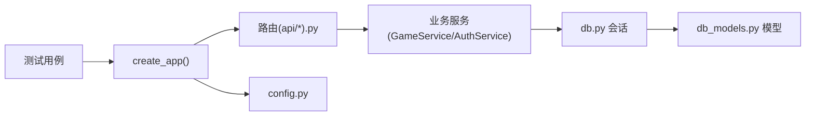

# 集成测试

<cite>
**本文引用的文件**   
- [backend/app/main.py](file://backend/app/main.py)
- [backend/app/db.py](file://backend/app/db.py)
- [backend/app/config.py](file://backend/app/config.py)
- [backend/app/api/auth.py](file://backend/app/api/auth.py)
- [backend/app/api/game.py](file://backend/app/api/game.py)
- [backend/app/db_models.py](file://backend/app/db_models.py)
- [backend/tests/test_auth_api.py](file://backend/tests/test_auth_api.py)
- [backend/tests/test_game_api.py](file://backend/tests/test_game_api.py)
- [backend/tests/test_health.py](file://backend/tests/test_health.py)
- [backend/tests/test_migrations.py](file://backend/tests/test_migrations.py)
- [backend/tests/test_story_importer.py](file://backend/tests/test_story_importer.py)
- [backend/tests/test_story_runtime.py](file://backend/tests/test_story_runtime.py)
- [backend/pytest.ini](file://backend/pytest.ini)
- [docker-compose.yml](file://docker-compose.yml)
</cite>

## 目录
1. [简介](#简介)
2. [项目结构](#项目结构)
3. [核心组件](#核心组件)
4. [架构总览](#架构总览)
5. [详细组件分析](#详细组件分析)
6. [依赖关系分析](#依赖关系分析)
7. [性能考虑](#性能考虑)
8. [故障排查指南](#故障排查指南)
9. [结论](#结论)
10. [附录](#附录)

## 简介
本指南面向澳秘 Macau Mystery 项目的集成测试，覆盖 API 接口完整性、数据库事务处理与外部服务集成的端到端验证。重点说明如何使用 FastAPI 的 TestClient 进行请求与响应断言、状态码校验；如何模拟数据库连接、文件系统与第三方 API；以及并发、隔离与基准测试方法。文档同时给出认证流程、游戏会话管理与 UGC 内容处理的集成测试示例与最佳实践。

## 项目结构
后端采用 FastAPI + SQLAlchemy 异步模式，使用 SQLite（开发/测试）或 PostgreSQL（生产）。测试集中在 backend/tests 下，按功能域组织：认证、游戏、健康检查、迁移、故事导入与运行时校验。应用入口通过 create_app 构建，路由注册在 main.py 中，数据库引擎与会话由 db.py 提供，配置由 config.py 管理。

**图表来源** 
- [backend/app/main.py:17-107](file://backend/app/main.py#L17-L107)
- [backend/app/api/auth.py:1-97](file://backend/app/api/auth.py#L1-L97)
- [backend/app/api/game.py:1-37](file://backend/app/api/game.py#L1-L37)
- [backend/app/db.py:1-42](file://backend/app/db.py#L1-L42)
- [backend/app/db_models.py:1-160](file://backend/app/db_models.py#L1-L160)
- [backend/app/config.py:1-77](file://backend/app/config.py#L1-L77)
- [backend/tests/test_auth_api.py:1-208](file://backend/tests/test_auth_api.py#L1-L208)
- [backend/tests/test_game_api.py:1-210](file://backend/tests/test_game_api.py#L1-L210)
- [backend/tests/test_health.py:1-23](file://backend/tests/test_health.py#L1-L23)
- [backend/tests/test_migrations.py:1-61](file://backend/tests/test_migrations.py#L1-L61)
- [backend/tests/test_story_importer.py:1-60](file://backend/tests/test_story_importer.py#L1-L60)
- [backend/tests/test_story_runtime.py:1-83](file://backend/tests/test_story_runtime.py#L1-L83)

**章节来源**
- [backend/app/main.py:17-107](file://backend/app/main.py#L17-L107)
- [backend/app/db.py:1-42](file://backend/app/db.py#L1-L42)
- [backend/app/config.py:1-77](file://backend/app/config.py#L1-L77)
- [backend/tests/test_health.py:1-23](file://backend/tests/test_health.py#L1-L23)

## 核心组件
- 应用生命周期与异常处理：create_app 定义 lifespan，注入演示数据初始化，统一 GameError 与请求校验错误格式。
- 数据库层：create_database_engine 创建异步引擎，SQLite 下启用外键与 busy_timeout；get_db_session 提供会话；check_database 用于健康检查。
- 配置：Settings 从环境变量加载，支持 CORS、Token TTL、演示数据开关等。
- 认证 API：注册、登录、获取当前用户，基于用户名/密码与令牌会话持久化。
- 游戏 API：开始游戏、选择推进、查询状态，基于版本化剧本与事件日志。

**章节来源**
- [backend/app/main.py:17-107](file://backend/app/main.py#L17-L107)
- [backend/app/db.py:1-42](file://backend/app/db.py#L1-L42)
- [backend/app/config.py:1-77](file://backend/app/config.py#L1-L77)
- [backend/app/api/auth.py:1-97](file://backend/app/api/auth.py#L1-L97)
- [backend/app/api/game.py:1-37](file://backend/app/api/game.py#L1-L37)

## 架构总览
下图展示集成测试中典型调用链：TestClient 发起 HTTP 请求，FastAPI 路由分发到业务逻辑，依赖注入数据库会话，读写 ORM 模型并返回结构化响应。

**图表来源** 
- [backend/app/main.py:17-107](file://backend/app/main.py#L17-L107)
- [backend/app/api/auth.py:1-97](file://backend/app/api/auth.py#L1-L97)
- [backend/app/api/game.py:1-37](file://backend/app/api/game.py#L1-L37)
- [backend/app/db.py:1-42](file://backend/app/db.py#L1-L42)
- [backend/app/db_models.py:1-160](file://backend/app/db_models.py#L1-L160)

## 详细组件分析

### 认证接口集成测试
- 目标：验证注册、登录、权限控制、令牌过期、演示数据种子幂等性。
- 关键点：
  - 使用 TestClient 构造应用实例，并通过 dependency_overrides 注入测试数据库会话。
  - 断言状态码与响应体结构（用户信息、令牌、错误代码）。
  - 模拟重启应用后仍可使用同一会话工厂恢复鉴权。
  - 直接操作数据库验证哈希存储、唯一约束与会话记录。

**图表来源** 
- [backend/tests/test_auth_api.py:1-208](file://backend/tests/test_auth_api.py#L1-L208)
- [backend/app/api/auth.py:1-97](file://backend/app/api/auth.py#L1-L97)

**章节来源**
- [backend/tests/test_auth_api.py:1-208](file://backend/tests/test_auth_api.py#L1-L208)
- [backend/app/api/auth.py:1-97](file://backend/app/api/auth.py#L1-L97)

### 游戏接口集成测试
- 目标：验证开始游戏、选择推进、合并线索、结局判定、重放、状态恢复、并发冲突与幂等性。
- 关键点：
  - 使用临时 SQLite 数据库，预置演示剧本数据。
  - 断言场景切换、线索授予、状态码与错误信封（error.code）。
  - 并发提交选择时，确保每个会话最多推进一次，冲突返回 STALE_SCENE 或 IDEMPOTENCY_CONFLICT。
  - 版本化剧本发布后，旧会话仍绑定原版本。

**图表来源** 
- [backend/tests/test_game_api.py:1-210](file://backend/tests/test_game_api.py#L1-L210)
- [backend/app/api/game.py:1-37](file://backend/app/api/game.py#L1-L37)
- [backend/app/db_models.py:1-160](file://backend/app/db_models.py#L1-L160)

**章节来源**
- [backend/tests/test_game_api.py:1-210](file://backend/tests/test_game_api.py#L1-L210)
- [backend/app/api/game.py:1-37](file://backend/app/api/game.py#L1-L37)

### 健康检查与数据库连通性
- 目标：验证健康端点返回数据库状态与应用版本。
- 关键点：
  - 禁用演示数据初始化，避免干扰。
  - 断言 status=ok 且 database=ok。

**章节来源**
- [backend/tests/test_health.py:1-23](file://backend/tests/test_health.py#L1-L23)
- [backend/app/main.py:98-106](file://backend/app/main.py#L98-L106)

### 迁移与数据库结构验证
- 目标：确保 Alembic 迁移能正确创建表、外键与唯一约束。
- 关键点：
  - 通过 subprocess 执行 alembic upgrade head。
  - 使用 inspect 检查表名集合与约束。

**章节来源**
- [backend/tests/test_migrations.py:1-61](file://backend/tests/test_migrations.py#L1-L61)

### 故事导入与版本化
- 目标：验证 import_story_data 的幂等性与版本递增。
- 关键点：
  - 相同内容重复导入不新增版本。
  - 修改内容后发布新版本，活跃版本指向最新。

**章节来源**
- [backend/tests/test_story_importer.py:1-60](file://backend/tests/test_story_importer.py#L1-L60)

### 故事运行时与校验
- 目标：验证 StoryDocument 校验规则、图遍历与分支条件。
- 关键点：
  - 开发环境允许占位媒体，生产拒绝。
  - 缺失目标、循环路由、无选择的视频场景均被报告。
  - 条件组合（最小线索数、all_clues、any_clues）语义正确。

**章节来源**
- [backend/tests/test_story_runtime.py:1-83](file://backend/tests/test_story_runtime.py#L1-L83)

## 依赖关系分析
- 测试对应用的依赖：
  - TestClient 依赖 create_app 构建的应用实例。
  - 依赖 get_db_session 注入会话，测试通过 dependency_overrides 替换为内存/临时数据库。
- 模块耦合：
  - API 层依赖 Service 与 DB 层，Service 依赖 ORM 模型。
  - 配置集中管理，影响应用行为（CORS、演示数据、Token TTL）。

**图表来源** 
- [backend/app/main.py:17-107](file://backend/app/main.py#L17-L107)
- [backend/app/api/auth.py:1-97](file://backend/app/api/auth.py#L1-L97)
- [backend/app/api/game.py:1-37](file://backend/app/api/game.py#L1-L37)
- [backend/app/db.py:1-42](file://backend/app/db.py#L1-L42)
- [backend/app/db_models.py:1-160](file://backend/app/db_models.py#L1-L160)
- [backend/app/config.py:1-77](file://backend/app/config.py#L1-L77)

**章节来源**
- [backend/app/main.py:17-107](file://backend/app/main.py#L17-L107)
- [backend/app/db.py:1-42](file://backend/app/db.py#L1-L42)
- [backend/app/config.py:1-77](file://backend/app/config.py#L1-L77)

## 性能考虑
- 数据库连接池：SQLite 下启用 PRAGMA foreign_keys=ON 与 busy_timeout=5000，提升并发稳定性。
- 会话复用：测试中使用 expire_on_commit=False 减少额外刷新开销。
- 并发测试：使用 asyncio.gather 模拟并发选择，确保幂等与冲突检测。
- 建议：
  - 对热点路径（如 make_choice）增加基准测试，测量 P95/P99 延迟。
  - 使用独立数据库文件或内存数据库隔离测试，避免锁竞争。
  - 限制并发度，避免 SQLite 在高并发下的性能退化。

[本节为通用指导，无需特定文件引用]

## 故障排查指南
- 常见错误与定位：
  - 401 未授权：检查令牌是否过期或无效，确认 AuthSession 存在且未过期。
  - 409 冲突：重复用户名、会话已完成、并发选择冲突（STALE_SCENE/IDEMPOTENCY_CONFLICT）。
  - 422 校验失败：检查请求体字段类型与格式，关注 VALIDATION_ERROR 的 details。
  - 503 降级：数据库不可用，检查 check_database 与健康端点。
- 调试技巧：
  - 打印 response.text 与 response.json() 的结构。
  - 直接查询数据库验证状态（User、AuthSession、GameSession、GameEvent）。
  - 使用 pytest 的 -v 与 --tb=short 快速定位堆栈。

**章节来源**
- [backend/app/main.py:38-74](file://backend/app/main.py#L38-L74)
- [backend/tests/test_auth_api.py:1-208](file://backend/tests/test_auth_api.py#L1-L208)
- [backend/tests/test_game_api.py:1-210](file://backend/tests/test_game_api.py#L1-L210)

## 结论
本指南系统阐述了 Macau Mystery 后端集成测试的方法与实践，涵盖认证、游戏会话、故事导入与运行时校验。通过 TestClient 与依赖注入，测试可稳定模拟真实运行环境，验证 API 完整性、事务一致性与并发安全性。建议结合基准测试与监控，持续优化性能与可靠性。

[本节为总结，无需特定文件引用]

## 附录
- 测试环境搭建
  - 安装依赖：pip install -r requirements.txt
  - 运行测试：cd backend && pytest -v
  - 配置文件：pytest.ini 设置异步模式与路径
- Docker 运行
  - docker-compose up --build 启动后端，端口 8000
  - 环境变量 DATABASE_URL、APP_ENV 等
- 数据准备策略
  - 使用临时 SQLite 文件隔离测试
  - 预置演示剧本与用户（按需关闭演示数据）
- 外部服务模拟
  - 使用 httpx 或 unittest.mock 模拟第三方 API
  - 文件系统：使用 tmp_path 生成临时目录与文件

**章节来源**
- [backend/pytest.ini:1-6](file://backend/pytest.ini#L1-L6)
- [docker-compose.yml:1-21](file://docker-compose.yml#L1-L21)
- [backend/requirements.txt:1-17](file://backend/requirements.txt#L1-L17)