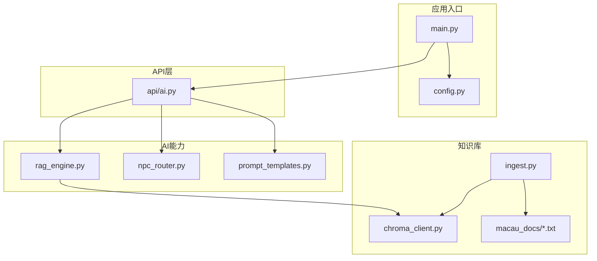
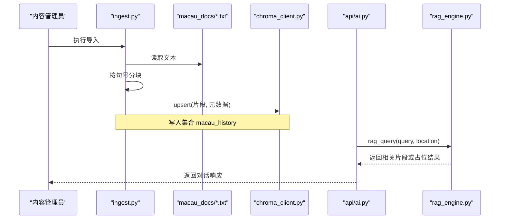
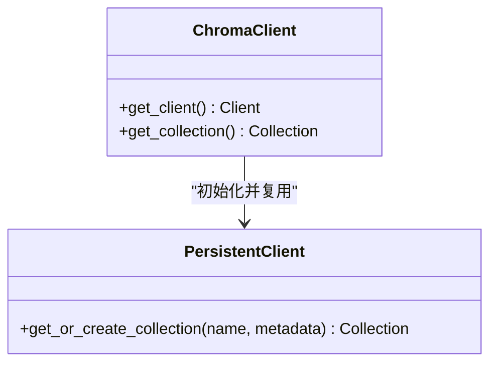
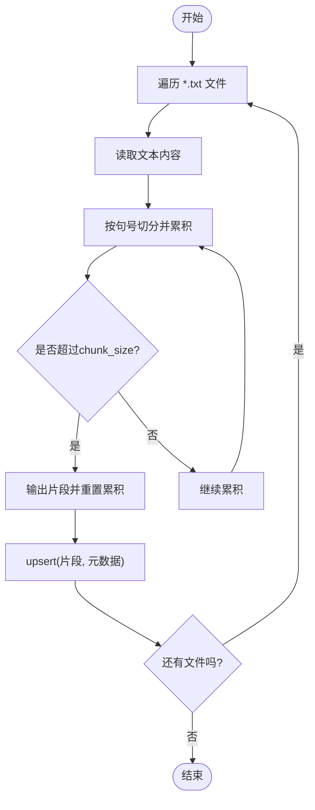
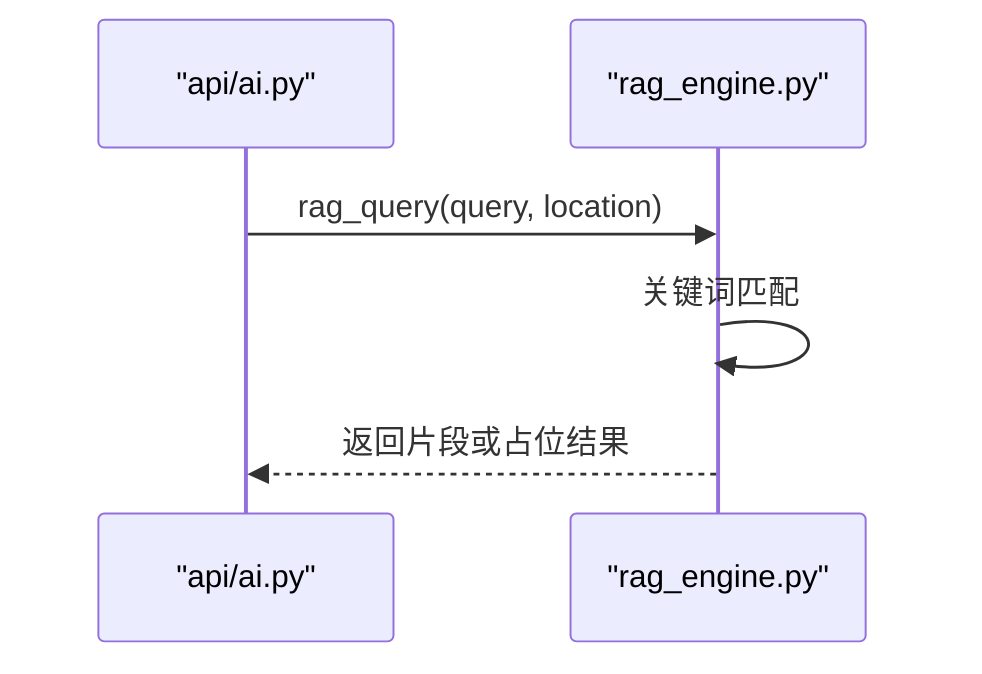
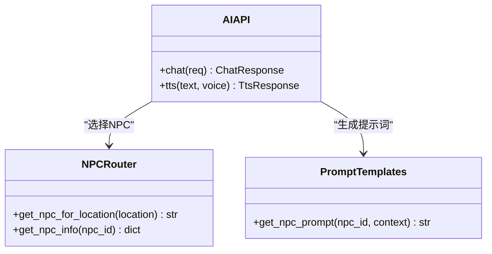
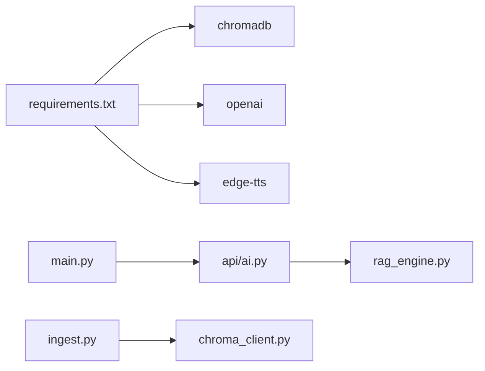

# 知识库系统

<cite>
**本文引用的文件**   
- [backend/app/knowledge/chroma_client.py](file://backend/app/knowledge/chroma_client.py)
- [backend/app/knowledge/ingest.py](file://backend/app/knowledge/ingest.py)
- [backend/app/ai/rag_engine.py](file://backend/app/ai/rag_engine.py)
- [backend/app/api/ai.py](file://backend/app/api/ai.py)
- [backend/app/config.py](file://backend/app/config.py)
- [backend/app/main.py](file://backend/app/main.py)
- [backend/app/ai/npc_router.py](file://backend/app/ai/npc_router.py)
- [backend/app/ai/prompt_templates.py](file://backend/app/ai/prompt_templates.py)
- [backend/app/knowledge/macau_docs/a_ma_temple.txt](file://backend/app/knowledge/macau_docs/a_ma_temple.txt)
- [backend/app/knowledge/macau_docs/dom_pedro_theatre.txt](file://backend/app/knowledge/macau_docs/dom_pedro_theatre.txt)
- [backend/app/knowledge/macau_docs/lilau_square.txt](file://backend/app/knowledge/macau_docs/lilau_square.txt)
- [backend/app/knowledge/macau_docs/senado_square.txt](file://backend/app/knowledge/macau_docs/senado_square.txt)
- [backend/app/knowledge/macau_docs/ruins_of_st_paul.txt](file://backend/app/knowledge/macau_docs/ruins_of_st_paul.txt)
- [backend/requirements.txt](file://backend/requirements.txt)
</cite>

## 目录
1. [简介](#简介)
2. [项目结构](#项目结构)
3. [核心组件](#核心组件)
4. [架构总览](#架构总览)
5. [详细组件分析](#详细组件分析)
6. [依赖关系分析](#依赖关系分析)
7. [性能考量](#性能考量)
8. [故障排除指南](#故障排除指南)
9. [结论](#结论)
10. [附录](#附录)

## 简介
本技术文档面向内容管理员与AI开发者，系统性阐述澳秘 Macau Mystery 知识库系统的实现方案与最佳实践。重点覆盖：
- ChromaDB 向量数据库的集成方式、集合管理与持久化策略
- 文档导入流程、预处理管道与中文分块策略
- 元数据管理机制、查询优化技术与相似度计算说明
- 澳门历史文档的组织结构与分类体系
- 检索效果优化、知识库维护与性能调优建议
- 常见问题排查方法

## 项目结构
后端采用 FastAPI 构建，知识库模块位于 backend/app/knowledge，包含 ChromaDB 客户端封装与文档导入脚本；AI 能力集中在 backend/app/ai，提供 RAG 引擎、NPC 路由与提示词模板；API 层在 backend/app/api 暴露对话与TTS接口；应用入口与配置分别在 main.py 与 config.py。

**图表来源** 
- [backend/app/main.py:17-111](file://backend/app/main.py#L17-L111)
- [backend/app/config.py:38-77](file://backend/app/config.py#L38-L77)
- [backend/app/knowledge/chroma_client.py:1-19](file://backend/app/knowledge/chroma_client.py#L1-L19)
- [backend/app/knowledge/ingest.py:1-36](file://backend/app/knowledge/ingest.py#L1-L36)
- [backend/app/ai/rag_engine.py:1-13](file://backend/app/ai/rag_engine.py#L1-L13)
- [backend/app/api/ai.py:1-29](file://backend/app/api/ai.py#L1-L29)
- [backend/app/ai/npc_router.py:1-18](file://backend/app/ai/npc_router.py#L1-L18)
- [backend/app/ai/prompt_templates.py:1-37](file://backend/app/ai/prompt_templates.py#L1-L37)

**章节来源**
- [backend/app/main.py:17-111](file://backend/app/main.py#L17-L111)
- [backend/app/config.py:38-77](file://backend/app/config.py#L38-L77)

## 核心组件
- ChromaDB 客户端封装：提供单例化的客户端与集合访问，默认持久化到本地路径，集合名为“macau_history”，并附带描述性元数据。
- 文档导入器：扫描本地文本目录，按句号切分为固定大小的片段，逐条写入集合，附带来源文件名与片段序号等元数据。
- RAG 引擎（当前为Mock）：根据查询与位置进行关键词匹配返回结果，预留接入ChromaDB的扩展点。
- AI API：对外暴露聊天与TTS接口，当前使用NPC Mock响应，后续可接入LLM与TTS服务。
- NPC路由与提示词：定义不同地点对应的NPC人设与语音音色，并提供格式化后的系统提示词模板。

**章节来源**
- [backend/app/knowledge/chroma_client.py:1-19](file://backend/app/knowledge/chroma_client.py#L1-L19)
- [backend/app/knowledge/ingest.py:1-36](file://backend/app/knowledge/ingest.py#L1-L36)
- [backend/app/ai/rag_engine.py:1-13](file://backend/app/ai/rag_engine.py#L1-L13)
- [backend/app/api/ai.py:1-29](file://backend/app/api/ai.py#L1-L29)
- [backend/app/ai/npc_router.py:1-18](file://backend/app/ai/npc_router.py#L1-L18)
- [backend/app/ai/prompt_templates.py:1-37](file://backend/app/ai/prompt_templates.py#L1-L37)

## 架构总览
整体数据流如下：
- 离线导入：读取 macau_docs 下的文本文件，按句子边界切分，生成片段并写入 ChromaDB 集合，附带元数据。
- 在线检索：AI API 接收用户消息，调用 RAG 引擎进行语义检索（当前为Mock），结合NPC提示词生成回复。
- 持久化：ChromaDB 使用本地持久化存储，确保重启后集合与数据不丢失。

**图表来源** 
- [backend/app/knowledge/ingest.py:17-32](file://backend/app/knowledge/ingest.py#L17-L32)
- [backend/app/knowledge/chroma_client.py:7-18](file://backend/app/knowledge/chroma_client.py#L7-L18)
- [backend/app/api/ai.py:15-21](file://backend/app/api/ai.py#L15-L21)
- [backend/app/ai/rag_engine.py:3-12](file://backend/app/ai/rag_engine.py#L3-L12)

## 详细组件分析

### ChromaDB 客户端封装
- 职责：管理全局客户端与集合实例，避免重复创建连接；提供 get_collection() 获取或创建集合。
- 关键点：
  - 使用 PersistentClient 指定本地路径，保证数据持久化。
  - 集合名称固定为“macau_history”，附带描述性元数据便于识别。
- 复杂度与性能：
  - 首次调用时建立连接与集合，后续复用，降低开销。
  - 无显式索引参数设置，依赖默认索引策略。

**图表来源** 
- [backend/app/knowledge/chroma_client.py:7-18](file://backend/app/knowledge/chroma_client.py#L7-L18)

**章节来源**
- [backend/app/knowledge/chroma_client.py:1-19](file://backend/app/knowledge/chroma_client.py#L1-L19)

### 文档导入与分块策略
- 职责：遍历 macau_docs 目录，读取每个 .txt 文件，按句号切分为片段，写入集合。
- 分块算法：
  - 以“。”为句子边界，累积拼接直到超过 chunk_size（默认500字符）。
  - 达到阈值后输出一个片段，继续下一个累积。
- 元数据：
  - source：原始文件名，用于溯源与过滤。
  - chunk：片段序号，便于定位与去重。
- 复杂度：
  - 时间复杂度 O(N)，N 为所有文件的字符总数。
  - 空间复杂度 O(M)，M 为最大片段长度。

**图表来源** 
- [backend/app/knowledge/ingest.py:6-15](file://backend/app/knowledge/ingest.py#L6-L15)
- [backend/app/knowledge/ingest.py:17-32](file://backend/app/knowledge/ingest.py#L17-L32)

**章节来源**
- [backend/app/knowledge/ingest.py:1-36](file://backend/app/knowledge/ingest.py#L1-L36)

### RAG 引擎（当前Mock）
- 职责：根据查询与位置返回相关历史知识片段。
- 现状：基于关键词匹配的字典查找，未接入ChromaDB。
- 扩展点：预留函数签名 rag_query(query, location)，可在后续替换为向量检索。

**图表来源** 
- [backend/app/api/ai.py:15-21](file://backend/app/api/ai.py#L15-L21)
- [backend/app/ai/rag_engine.py:3-12](file://backend/app/ai/rag_engine.py#L3-L12)

**章节来源**
- [backend/app/ai/rag_engine.py:1-13](file://backend/app/ai/rag_engine.py#L1-L13)

### AI API 与 NPC 路由
- 职责：对外暴露 /chat 与 /tts 接口；根据 npc_id 选择NPC人设与语音音色。
- NPC映射：通过 npc_router.py 将地点映射到NPC ID，再结合 prompt_templates.py 生成系统提示词。
- 当前行为：/chat 返回NPC Mock文本；/tts 返回空音频URL，待接入 edge-tts。

**图表来源** 
- [backend/app/api/ai.py:15-28](file://backend/app/api/ai.py#L15-L28)
- [backend/app/ai/npc_router.py:10-17](file://backend/app/ai/npc_router.py#L10-L17)
- [backend/app/ai/prompt_templates.py:32-36](file://backend/app/ai/prompt_templates.py#L32-L36)

**章节来源**
- [backend/app/api/ai.py:1-29](file://backend/app/api/ai.py#L1-L29)
- [backend/app/ai/npc_router.py:1-18](file://backend/app/ai/npc_router.py#L1-L18)
- [backend/app/ai/prompt_templates.py:1-37](file://backend/app/ai/prompt_templates.py#L1-L37)

### 澳门历史文档组织与分类
- 文档目录：backend/app/knowledge/macau_docs，包含多个 .txt 文件，分别对应妈阁庙、亚婆井前地、郑家大屋、岗顶剧院、议事亭前地、大三巴牌坊等地点。
- 分类体系：以地点为单位组织，每个文件代表一个地点的历史介绍，便于按源文件进行元数据过滤与溯源。
- 示例文件：
  - a_ma_temple.txt：妈阁庙历史与“Macau”词源
  - dom_pedro_theatre.txt：岗顶剧院背景
  - lilau_square.txt：亚婆井前地与民谣
  - senado_square.txt：议事亭前地与标志性景观
  - ruins_of_st_paul.txt：大三巴牌坊建筑历史

**章节来源**
- [backend/app/knowledge/macau_docs/a_ma_temple.txt:1-7](file://backend/app/knowledge/macau_docs/a_ma_temple.txt#L1-L7)
- [backend/app/knowledge/macau_docs/dom_pedro_theatre.txt:1-1](file://backend/app/knowledge/macau_docs/dom_pedro_theatre.txt#L1-L1)
- [backend/app/knowledge/macau_docs/lilau_square.txt:1-3](file://backend/app/knowledge/macau_docs/lilau_square.txt#L1-L3)
- [backend/app/knowledge/macau_docs/senado_square.txt:1-1](file://backend/app/knowledge/macau_docs/senado_square.txt#L1-L1)
- [backend/app/knowledge/macau_docs/ruins_of_st_paul.txt:1-1](file://backend/app/knowledge/macau_docs/ruins_of_st_paul.txt#L1-L1)

## 依赖关系分析
- 外部依赖：
  - chromadb==0.5.11：向量数据库客户端库
  - openai==1.51.0：LLM客户端（预留）
  - edge-tts==6.1.12：语音合成（预留）
- 内部依赖：
  - main.py 注册路由与中间件，引入 api/ai、knowledge、ai 等模块
  - ingest.py 依赖 chroma_client.py 获取集合
  - rag_engine.py 预留对接 ChromaDB 的扩展点

**图表来源** 
- [backend/requirements.txt:1-17](file://backend/requirements.txt#L1-L17)
- [backend/app/main.py:84-96](file://backend/app/main.py#L84-L96)
- [backend/app/knowledge/ingest.py:17-32](file://backend/app/knowledge/ingest.py#L17-L32)
- [backend/app/knowledge/chroma_client.py:7-18](file://backend/app/knowledge/chroma_client.py#L7-L18)

**章节来源**
- [backend/requirements.txt:1-17](file://backend/requirements.txt#L1-L17)
- [backend/app/main.py:84-96](file://backend/app/main.py#L84-L96)

## 性能考量
- 导入阶段：
  - 分块大小影响检索粒度与上下文完整性，建议根据平均段落长度调整 chunk_size。
  - 批量 upsert 可减少网络往返，但当前实现逐条写入，可在数据量大时改为批量操作。
- 检索阶段：
  - 当前Mock为O(1)字典查找，实际接入ChromaDB后需考虑向量维度、索引类型（如HNSW）与查询参数（top_k、where过滤）。
  - 建议在查询中利用元数据过滤（source、chunk）提升精确度。
- 持久化与并发：
  - PersistentClient 本地存储适合开发环境，生产环境建议使用分布式或云托管向量库。
  - 高并发场景下注意集合锁与写入冲突，必要时引入队列与重试机制。

[本节为通用指导，无需特定文件引用]

## 故障排除指南
- 导入失败：
  - 检查 macau_docs 目录是否存在且包含 .txt 文件。
  - 确认编码为 UTF-8，避免读取异常。
  - 查看集合计数与日志输出，确认 upsert 成功。
- 检索为空：
  - 当前 rag_engine.py 为Mock，需替换为真实向量检索逻辑。
  - 若已接入ChromaDB，检查查询语句与元数据过滤条件是否正确。
- 服务启动问题：
  - 确保依赖安装完整，特别是 chromadb、openai、edge-tts。
  - 检查端口占用与CORS配置。

**章节来源**
- [backend/app/knowledge/ingest.py:20-32](file://backend/app/knowledge/ingest.py#L20-L32)
- [backend/app/ai/rag_engine.py:3-12](file://backend/app/ai/rag_engine.py#L3-L12)
- [backend/app/api/ai.py:15-28](file://backend/app/api/ai.py#L15-L28)

## 结论
本知识库系统以 ChromaDB 为核心，结合简洁的导入管道与可扩展的 RAG 架构，为澳门历史内容的语义检索奠定基础。当前阶段已完成数据导入与Mock检索，下一步应聚焦于：
- 实现真实的向量嵌入与相似度检索
- 优化分块策略与元数据设计
- 引入查询缓存与批处理以提升性能
- 完善监控与错误恢复机制

[本节为总结性内容，无需特定文件引用]

## 附录
- 知识库维护建议：
  - 定期更新 macau_docs 内容，保持历史信息的准确性与时效性。
  - 对新增文档执行导入脚本，验证集合计数与检索结果。
  - 根据用户反馈调整分块大小与查询参数。
- 性能调优建议：
  - 在生产环境启用向量索引优化（如 HNSW 参数调参）。
  - 使用异步导入与查询，提升吞吐。
  - 对热点查询结果进行缓存，减少重复计算。
- 故障排除清单：
  - 检查依赖版本兼容性
  - 验证文件编码与路径权限
  - 查看日志中的 upsert 与查询错误信息

[本节为补充性内容，无需特定文件引用]