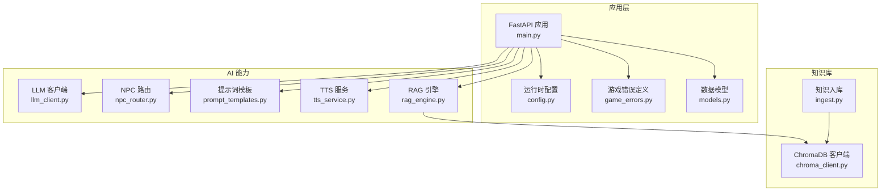
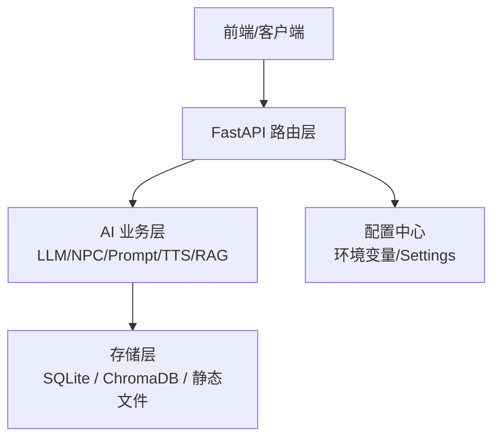
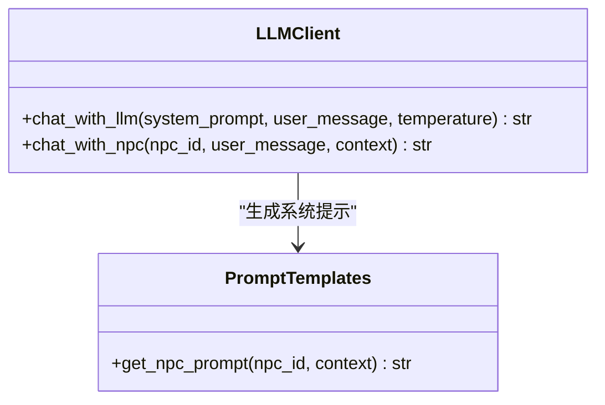
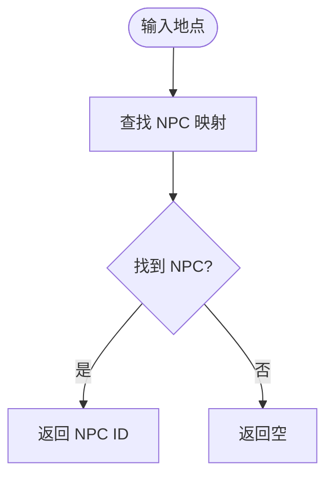
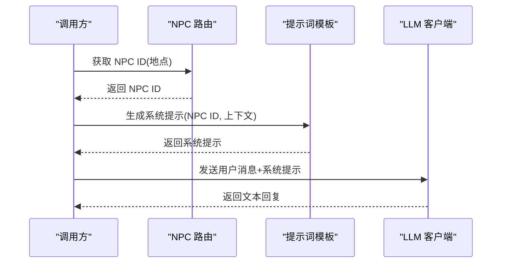
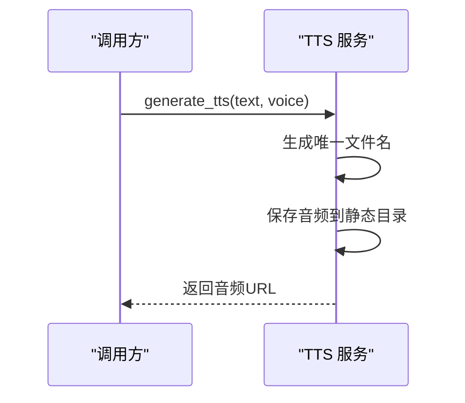
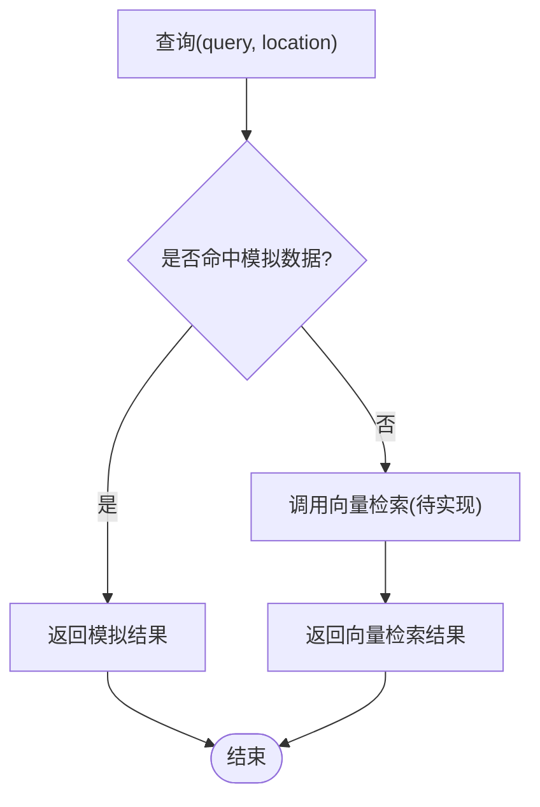
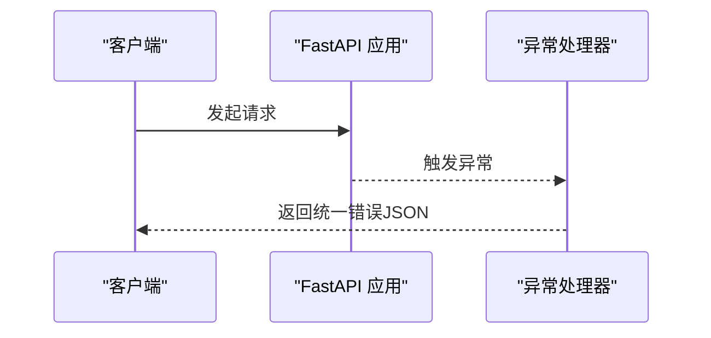
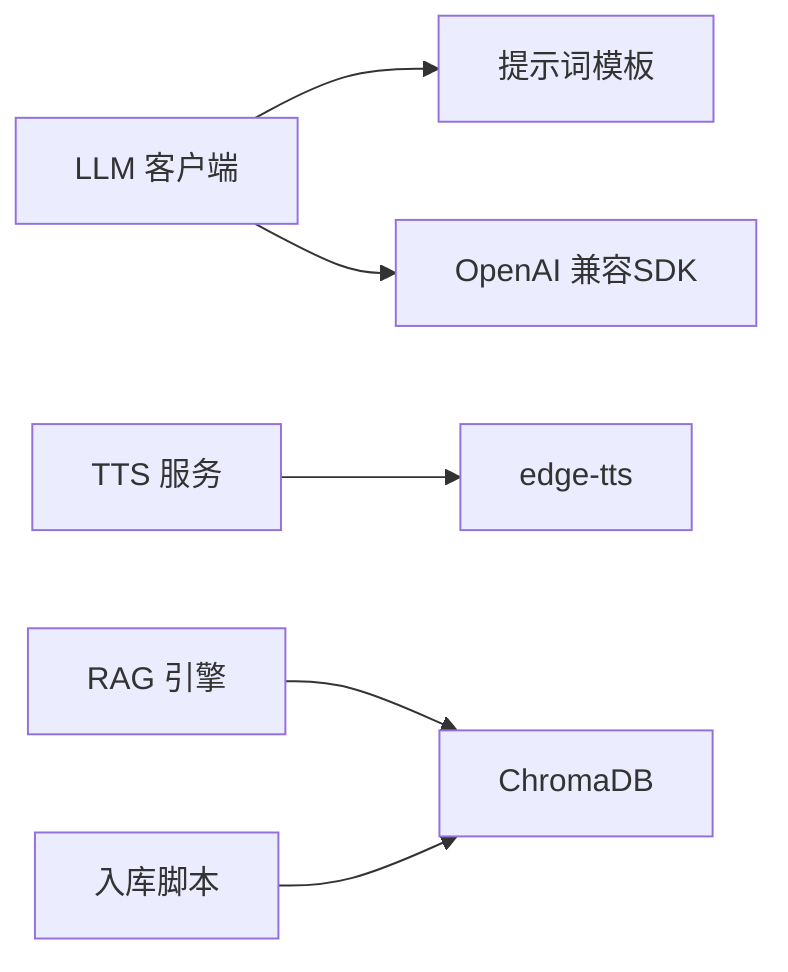

# AI服务架构

<cite>
**本文引用的文件**   
- [llm_client.py](file://backend/app/ai/llm_client.py)
- [npc_router.py](file://backend/app/ai/npc_router.py)
- [prompt_templates.py](file://backend/app/ai/prompt_templates.py)
- [tts_service.py](file://backend/app/ai/tts_service.py)
- [rag_engine.py](file://backend/app/ai/rag_engine.py)
- [chroma_client.py](file://backend/app/knowledge/chroma_client.py)
- [ingest.py](file://backend/app/knowledge/ingest.py)
- [config.py](file://backend/app/config.py)
- [main.py](file://backend/app/main.py)
- [game_errors.py](file://backend/app/game_errors.py)
- [models.py](file://backend/app/models.py)
</cite>

## 目录
1. [简介](#简介)
2. [项目结构](#项目结构)
3. [核心组件](#核心组件)
4. [架构总览](#架构总览)
5. [详细组件分析](#详细组件分析)
6. [依赖关系分析](#依赖关系分析)
7. [性能考虑](#性能考虑)
8. [故障排查指南](#故障排查指南)
9. [结论](#结论)
10. [附录](#附录)

## 简介
本文件为澳秘 Macau Mystery AI 服务系统的架构文档，聚焦以下方面：
- LLM 客户端封装与多模型支持
- NPC 路由机制与角色人设
- 提示词工程框架与上下文注入
- TTS 语音合成服务集成
- RAG 知识库与向量检索（ChromaDB）
- 错误处理、重试策略与监控日志
- 流式响应、缓存与负载均衡扩展建议
- 面向开发者的系统集成指南与最佳实践

## 项目结构
后端采用 FastAPI 应用，AI 能力集中在 backend/app/ai 模块，知识库在 backend/app/knowledge。应用入口通过 main.py 创建并挂载路由，统一异常处理与 CORS 配置由 config.py 提供。

图表来源
- [main.py:17-106](file://backend/app/main.py#L17-L106)
- [config.py:38-77](file://backend/app/config.py#L38-L77)
- [llm_client.py:1-32](file://backend/app/ai/llm_client.py#L1-L32)
- [npc_router.py:1-18](file://backend/app/ai/npc_router.py#L1-L18)
- [prompt_templates.py:1-37](file://backend/app/ai/prompt_templates.py#L1-L37)
- [tts_service.py:1-25](file://backend/app/ai/tts_service.py#L1-L25)
- [rag_engine.py:1-13](file://backend/app/ai/rag_engine.py#L1-L13)
- [chroma_client.py:1-19](file://backend/app/knowledge/chroma_client.py#L1-L19)
- [ingest.py:1-36](file://backend/app/knowledge/ingest.py#L1-L36)

章节来源
- [main.py:17-106](file://backend/app/main.py#L17-L106)
- [config.py:38-77](file://backend/app/config.py#L38-L77)

## 核心组件
- LLM 客户端：基于 OpenAI 兼容接口调用 DeepSeek（经 SiliconFlow），封装异步聊天与 NPC 对话方法，支持温度与最大 token 控制。
- NPC 路由：根据地点映射到具体 NPC ID，并提供 NPC 信息查询。
- 提示词模板：按 NPC 类型生成系统提示，动态注入场景与线索上下文。
- TTS 服务：使用 edge-tts 将文本转为音频，按 NPC 选择音色，输出静态音频路径。
- RAG 引擎：当前为模拟实现，预留接入 ChromaDB 的接口；知识库入库脚本负责分块与持久化。
- 配置与异常：集中管理环境变量、CORS、健康检查与统一错误格式。

章节来源
- [llm_client.py:1-32](file://backend/app/ai/llm_client.py#L1-L32)
- [npc_router.py:1-18](file://backend/app/ai/npc_router.py#L1-L18)
- [prompt_templates.py:1-37](file://backend/app/ai/prompt_templates.py#L1-L37)
- [tts_service.py:1-25](file://backend/app/ai/tts_service.py#L1-L25)
- [rag_engine.py:1-13](file://backend/app/ai/rag_engine.py#L1-L13)
- [chroma_client.py:1-19](file://backend/app/knowledge/chroma_client.py#L1-L19)
- [ingest.py:1-36](file://backend/app/knowledge/ingest.py#L1-L36)
- [config.py:38-77](file://backend/app/config.py#L38-L77)
- [game_errors.py:1-20](file://backend/app/game_errors.py#L1-L20)

## 架构总览
整体分层设计如下：
- 表现层：FastAPI 路由（游戏、AI、UGC、管理、认证等）
- 业务层：AI 能力（LLM、NPC、提示词、TTS、RAG）、故事引擎、UGC 生成器
- 数据层：SQLite（Alembic 迁移）、ChromaDB（向量库）、静态资源（音频）
- 横切关注点：配置、异常、CORS、健康检查、日志与监控（可扩展）

图表来源
- [main.py:17-106](file://backend/app/main.py#L17-L106)
- [config.py:38-77](file://backend/app/config.py#L38-L77)

## 详细组件分析

### LLM 客户端封装
- 功能要点
  - 使用 AsyncOpenAI 客户端，通过环境变量配置 API Key 与 Base URL，默认指向 SiliconFlow 的 DeepSeek 模型。
  - chat_with_llm 封装消息构造、参数设置与返回内容提取。
  - chat_with_npc 结合提示词模板生成系统提示，再调用通用聊天方法。
- 错误处理
  - 捕获异常并返回友好错误字符串，便于上层统一处理。
- 扩展点
  - 可替换 base_url/model 以支持多模型；可增加重试与超时控制。

图表来源
- [llm_client.py:12-31](file://backend/app/ai/llm_client.py#L12-L31)
- [prompt_templates.py:32-36](file://backend/app/ai/prompt_templates.py#L32-L36)

章节来源
- [llm_client.py:1-32](file://backend/app/ai/llm_client.py#L1-L32)
- [prompt_templates.py:1-37](file://backend/app/ai/prompt_templates.py#L1-L37)

### NPC 路由机制
- 功能要点
  - 维护 NPC 人设与位置映射，提供按地点获取 NPC ID 的方法。
  - 提供 NPC 信息查询，用于后续 TTS 音色选择与提示词注入。
- 设计原则
  - 简单字典映射，易于扩展新 NPC。

图表来源
- [npc_router.py:10-14](file://backend/app/ai/npc_router.py#L10-L14)

章节来源
- [npc_router.py:1-18](file://backend/app/ai/npc_router.py#L1-L18)

### 提示词工程框架
- 功能要点
  - 为每个 NPC 预设系统提示模板，包含说话风格、场景与线索占位符。
  - get_npc_prompt 根据 npc_id 与上下文动态填充 location 与 clues。
- 设计原则
  - 模板与逻辑分离，便于 A/B 测试与本地化。

图表来源
- [npc_router.py:10-17](file://backend/app/ai/npc_router.py#L10-L17)
- [prompt_templates.py:32-36](file://backend/app/ai/prompt_templates.py#L32-L36)
- [llm_client.py:28-31](file://backend/app/ai/llm_client.py#L28-L31)

章节来源
- [prompt_templates.py:1-37](file://backend/app/ai/prompt_templates.py#L1-L37)

### TTS 语音合成服务
- 功能要点
  - 使用 edge-tts 将文本转换为 MP3 音频，保存到静态目录。
  - 根据 NPC 选择对应音色，返回可访问的音频 URL。
- 设计原则
  - 文件名随机化避免冲突，目录自动创建。

图表来源
- [tts_service.py:14-24](file://backend/app/ai/tts_service.py#L14-L24)

章节来源
- [tts_service.py:1-25](file://backend/app/ai/tts_service.py#L1-L25)

### RAG 知识库与向量检索
- 当前实现
  - rag_query 为模拟实现，按关键词匹配返回历史知识片段。
  - 预留接入 ChromaDB 的接口，便于后续替换为真实向量检索。
- 知识库入库
  - ingest_documents 读取 macau_docs/*.txt，按句号分块，写入 ChromaDB 集合。
  - chroma_client 提供单例化的 PersistentClient 与集合获取。

图表来源
- [rag_engine.py:3-12](file://backend/app/ai/rag_engine.py#L3-L12)
- [chroma_client.py:7-18](file://backend/app/knowledge/chroma_client.py#L7-L18)
- [ingest.py:6-32](file://backend/app/knowledge/ingest.py#L6-L32)

章节来源
- [rag_engine.py:1-13](file://backend/app/ai/rag_engine.py#L1-L13)
- [chroma_client.py:1-19](file://backend/app/knowledge/chroma_client.py#L1-L19)
- [ingest.py:1-36](file://backend/app/knowledge/ingest.py#L1-L36)

### 应用入口与统一异常
- 应用启动
  - create_app 初始化 Settings、注册异常处理器、添加 CORS、挂载各路由与健康检查。
- 异常处理
  - GameError 统一业务错误格式；请求校验错误针对游戏 API 返回结构化详情。

图表来源
- [main.py:38-74](file://backend/app/main.py#L38-L74)
- [game_errors.py:7-20](file://backend/app/game_errors.py#L7-L20)

章节来源
- [main.py:17-106](file://backend/app/main.py#L17-L106)
- [game_errors.py:1-20](file://backend/app/game_errors.py#L1-L20)

## 依赖关系分析
- 模块耦合
  - LLM 客户端依赖提示词模板与 OpenAI 兼容 SDK。
  - NPC 路由独立，仅维护映射表。
  - TTS 服务依赖 edge-tts 与文件系统。
  - RAG 引擎当前弱依赖 ChromaDB 客户端（预留）。
- 外部依赖
  - OpenAI 兼容接口（SiliconFlow）
  - edge-tts
  - ChromaDB（向量库）
  - SQLite（数据库）

图表来源
- [llm_client.py:1-10](file://backend/app/ai/llm_client.py#L1-L10)
- [tts_service.py:1-10](file://backend/app/ai/tts_service.py#L1-L10)
- [rag_engine.py:1-5](file://backend/app/ai/rag_engine.py#L1-L5)
- [chroma_client.py:1-11](file://backend/app/knowledge/chroma_client.py#L1-L11)
- [ingest.py:18-32](file://backend/app/knowledge/ingest.py#L18-L32)

章节来源
- [llm_client.py:1-32](file://backend/app/ai/llm_client.py#L1-L32)
- [tts_service.py:1-25](file://backend/app/ai/tts_service.py#L1-L25)
- [rag_engine.py:1-13](file://backend/app/ai/rag_engine.py#L1-L13)
- [chroma_client.py:1-19](file://backend/app/knowledge/chroma_client.py#L1-L19)
- [ingest.py:1-36](file://backend/app/knowledge/ingest.py#L1-L36)

## 性能考虑
- 流式响应
  - 当前 LLM 调用为一次性返回；建议改为流式读取 tokens，降低首字延迟。
- 缓存策略
  - 对相同 prompt+context 的结果进行短期缓存（LRU），减少重复调用。
  - 对 TTS 音频按文本指纹缓存，避免重复生成。
- 负载均衡
  - 多模型或多端点时，引入负载均衡器或轮询策略，提升可用性。
- I/O 优化
  - TTS 写入静态目录建议使用异步任务队列，避免阻塞请求线程。
  - ChromaDB 连接复用与批量 upsert，减少磁盘 IO。

[本节为通用指导，不直接分析具体文件]

## 故障排查指南
- LLM 调用失败
  - 检查环境变量 SILICONFLOW_API_KEY 与 SILICONFLOW_BASE_URL 是否正确。
  - 查看异常打印日志，确认网络与鉴权状态。
- TTS 生成失败
  - 确认静态目录存在且可写。
  - 检查 edge-tts 安装与网络连通性。
- 知识库入库问题
  - 确认 macau_docs 目录存在且包含 .txt 文件。
  - 检查 ChromaDB 持久化路径权限。
- 健康检查
  - 访问 /api/v1/health，若数据库不可用将返回降级状态。

章节来源
- [llm_client.py:23-25](file://backend/app/ai/llm_client.py#L23-L25)
- [tts_service.py:14-20](file://backend/app/ai/tts_service.py#L14-L20)
- [ingest.py:20-32](file://backend/app/knowledge/ingest.py#L20-L32)
- [main.py:98-105](file://backend/app/main.py#L98-L105)

## 结论
本架构以模块化方式组织 AI 能力，清晰分离 LLM 客户端、NPC 路由、提示词工程、TTS 与 RAG 组件。当前实现简洁可用，具备扩展至多模型、流式响应、向量检索与缓存/负载均衡的基础。建议在后续迭代中完善错误重试、监控日志与性能优化，以提升稳定性与用户体验。

[本节为总结，不直接分析具体文件]

## 附录
- 数据模型参考
  - ChatRequest/ChatResponse/TtsResponse 等定义位于 models.py，供 API 层使用。
- 配置项
  - Settings 提供数据库、CORS、环境标志等配置，可通过环境变量覆盖。

章节来源
- [models.py:95-109](file://backend/app/models.py#L95-L109)
- [config.py:38-77](file://backend/app/config.py#L38-L77)