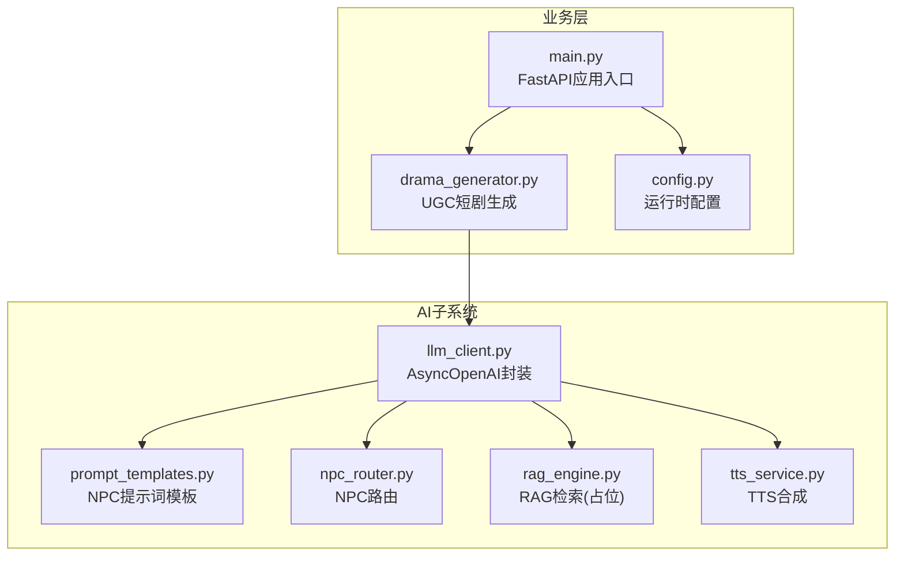
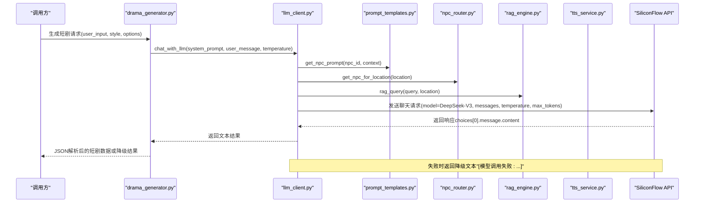
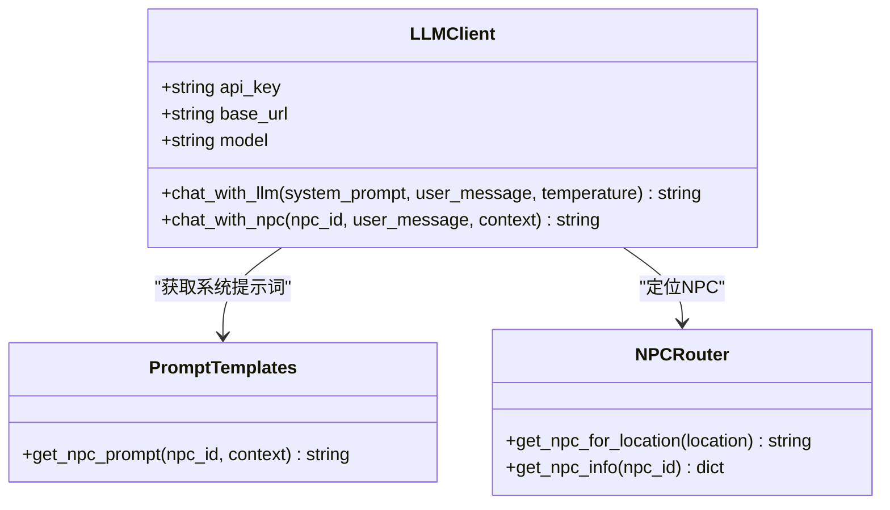
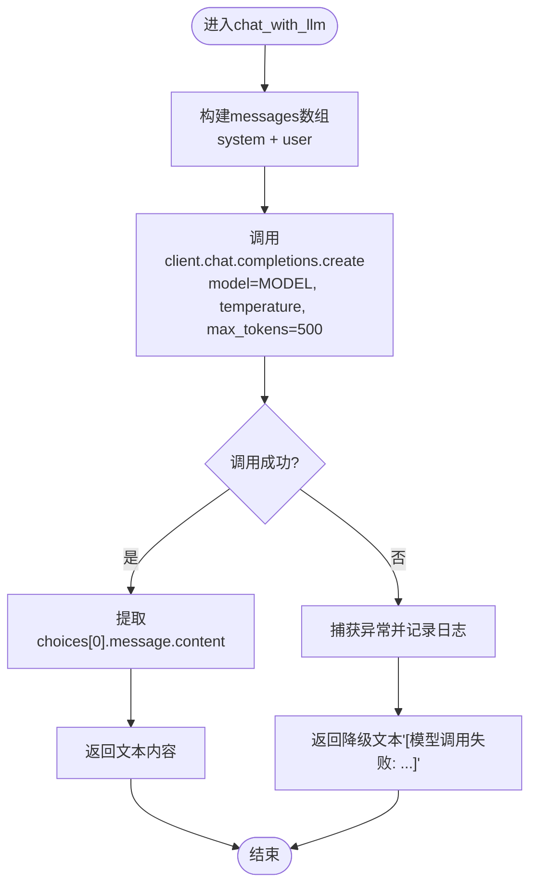
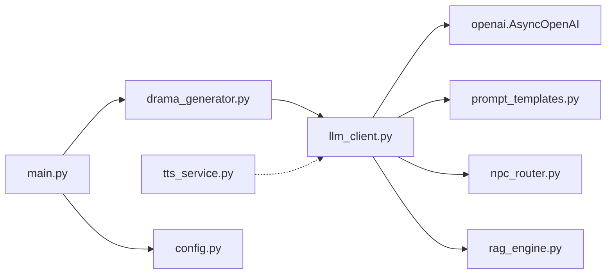

# LLM集成层

<cite>
**本文引用的文件**
- [llm_client.py](file://backend/app/ai/llm_client.py)
- [prompt_templates.py](file://backend/app/ai/prompt_templates.py)
- [npc_router.py](file://backend/app/ai/npc_router.py)
- [rag_engine.py](file://backend/app/ai/rag_engine.py)
- [tts_service.py](file://backend/app/ai/tts_service.py)
- [drama_generator.py](file://backend/app/ugc/drama_generator.py)
- [main.py](file://backend/app/main.py)
- [config.py](file://backend/app/config.py)
</cite>

## 目录
1. [简介](#简介)
2. [项目结构](#项目结构)
3. [核心组件](#核心组件)
4. [架构总览](#架构总览)
5. [详细组件分析](#详细组件分析)
6. [依赖关系分析](#依赖关系分析)
7. [性能考虑](#性能考虑)
8. [故障排查指南](#故障排查指南)
9. [结论](#结论)
10. [附录](#附录)

## 简介
本技术文档聚焦澳秘 Macau Mystery 后端的LLM集成层，围绕以下目标展开：
- AsyncOpenAI客户端封装与SiliconFlow API集成
- DeepSeek模型配置与多模型支持架构
- 异步聊天接口实现、消息格式处理、温度参数控制与最大令牌限制
- 错误处理机制、重试策略与降级方案
- 环境变量配置、API密钥管理与扩展点
- 性能优化技巧、连接池配置与超时设置
- 完整使用模式与代码示例路径，帮助开发者理解与扩展LLM能力

## 项目结构
LLM相关代码集中在 backend/app/ai 目录下，并与UGC生成模块协作。整体组织方式以“功能域”划分：
- ai/llm_client.py：封装AsyncOpenAI客户端、调用DeepSeek（通过SiliconFlow）的通用聊天接口
- ai/prompt_templates.py：NPC系统提示词模板管理
- ai/npc_router.py：根据位置路由到对应NPC人设
- ai/rag_engine.py：RAG检索增强（当前为Mock实现，预留ChromaDB接入）
- ai/tts_service.py：文本转语音服务（edge-tts），与NPC音色绑定
- ugc/drama_generator.py：UGC短剧生成器，复用LLM聊天接口
- app/main.py：FastAPI应用入口，挂载各路由（含AI路由）
- app/config.py：运行时配置（数据库、CORS等；LLM相关变量在llm_client中读取）

图表来源
- [llm_client.py:1-32](file://backend/app/ai/llm_client.py#L1-L32)
- [prompt_templates.py:1-37](file://backend/app/ai/prompt_templates.py#L1-L37)
- [npc_router.py:1-18](file://backend/app/ai/npc_router.py#L1-L18)
- [rag_engine.py:1-13](file://backend/app/ai/rag_engine.py#L1-L13)
- [tts_service.py:1-25](file://backend/app/ai/tts_service.py#L1-L25)
- [drama_generator.py:1-21](file://backend/app/ugc/drama_generator.py#L1-L21)
- [main.py:1-111](file://backend/app/main.py#L1-L111)
- [config.py:1-77](file://backend/app/config.py#L1-L77)

章节来源
- [llm_client.py:1-32](file://backend/app/ai/llm_client.py#L1-L32)
- [prompt_templates.py:1-37](file://backend/app/ai/prompt_templates.py#L1-L37)
- [npc_router.py:1-18](file://backend/app/ai/npc_router.py#L1-L18)
- [rag_engine.py:1-13](file://backend/app/ai/rag_engine.py#L1-L13)
- [tts_service.py:1-25](file://backend/app/ai/tts_service.py#L1-L25)
- [drama_generator.py:1-21](file://backend/app/ugc/drama_generator.py#L1-L21)
- [main.py:1-111](file://backend/app/main.py#L1-L111)
- [config.py:1-77](file://backend/app/config.py#L1-L77)

## 核心组件
- AsyncOpenAI客户端封装：通过环境变量注入API Key与Base URL，统一对接SiliconFlow提供的OpenAI兼容接口，默认模型为DeepSeek-V3。
- NPC提示词模板：按NPC ID选择系统提示词，并动态注入场景位置与线索信息。
- NPC路由：根据地理位置映射到NPC ID，便于后续TTS音色与对话风格匹配。
- RAG引擎：当前为Mock实现，预留接入向量数据库（如ChromaDB）。
- TTS服务：基于edge-tts将文本转为音频，按NPC选择不同音色。
- UGC短剧生成：复用LLM聊天接口，结合模板生成结构化JSON内容。

章节来源
- [llm_client.py:1-32](file://backend/app/ai/llm_client.py#L1-L32)
- [prompt_templates.py:1-37](file://backend/app/ai/prompt_templates.py#L1-L37)
- [npc_router.py:1-18](file://backend/app/ai/npc_router.py#L1-L18)
- [rag_engine.py:1-13](file://backend/app/ai/rag_engine.py#L1-L13)
- [tts_service.py:1-25](file://backend/app/ai/tts_service.py#L1-L25)
- [drama_generator.py:1-21](file://backend/app/ugc/drama_generator.py#L1-L21)

## 架构总览
下图展示从业务调用到LLM服务的端到端流程，包括NPC路由、提示词组装、RAG检索、TTS合成以及UGC生成。

图表来源
- [drama_generator.py:1-21](file://backend/app/ugc/drama_generator.py#L1-L21)
- [llm_client.py:1-32](file://backend/app/ai/llm_client.py#L1-L32)
- [prompt_templates.py:1-37](file://backend/app/ai/prompt_templates.py#L1-L37)
- [npc_router.py:1-18](file://backend/app/ai/npc_router.py#L1-L18)
- [rag_engine.py:1-13](file://backend/app/ai/rag_engine.py#L1-L13)
- [tts_service.py:1-25](file://backend/app/ai/tts_service.py#L1-L25)

## 详细组件分析

### AsyncOpenAI客户端封装与SiliconFlow集成
- 客户端初始化：通过环境变量SILICONFLOW_API_KEY与SILICONFLOW_BASE_URL注入，默认base_url指向SiliconFlow的OpenAI兼容端点。
- 模型配置：MODEL由LLM_MODEL环境变量决定，默认deepseek-ai/DeepSeek-V3。
- 异步聊天接口：chat_with_llm接受system_prompt、user_message与temperature，构造messages数组，设置max_tokens=500，调用client.chat.completions.create并返回content。
- NPC对话封装：chat_with_npc根据npc_id与context组装系统提示词，再调用chat_with_llm。

图表来源
- [llm_client.py:1-32](file://backend/app/ai/llm_client.py#L1-L32)
- [prompt_templates.py:1-37](file://backend/app/ai/prompt_templates.py#L1-L37)
- [npc_router.py:1-18](file://backend/app/ai/npc_router.py#L1-L18)

章节来源
- [llm_client.py:1-32](file://backend/app/ai/llm_client.py#L1-L32)
- [prompt_templates.py:1-37](file://backend/app/ai/prompt_templates.py#L1-L37)
- [npc_router.py:1-18](file://backend/app/ai/npc_router.py#L1-L18)

### 消息格式处理与参数控制
- 消息格式：messages包含两条消息，一条system用于设定角色与规则，一条user为用户输入。
- 温度参数：temperature默认0.7，可通过调用方传入，影响输出随机性。
- 最大令牌限制：max_tokens固定为500，控制响应长度。
- 返回值：优先返回choices[0].message.content，若为空则返回空字符串。

图表来源
- [llm_client.py:12-25](file://backend/app/ai/llm_client.py#L12-L25)

章节来源
- [llm_client.py:12-25](file://backend/app/ai/llm_client.py#L12-L25)

### NPC提示词模板与上下文注入
- 模板字典：按NPC ID定义系统提示词，包含说话特点、场景位置与线索占位符。
- 上下文注入：get_npc_prompt根据context中的location与clues填充模板，确保对话贴合当前剧情。
- 默认回退：未匹配的npc_id将使用通用友好NPC提示词。

章节来源
- [prompt_templates.py:1-37](file://backend/app/ai/prompt_templates.py#L1-L37)

### RAG检索增强（占位实现）
- 当前实现：基于关键词匹配返回历史知识片段，作为未来接入ChromaDB的过渡。
- 扩展点：可替换为向量检索，提升召回质量与语义匹配能力。

章节来源
- [rag_engine.py:1-13](file://backend/app/ai/rag_engine.py#L1-L13)

### TTS服务与NPC音色绑定
- 音色映射：VOICE_OPTIONS将NPC ID映射到具体语音合成音色。
- 生成流程：generate_tts将文本保存为MP3文件，返回静态资源路径。
- 默认音色：未匹配时使用默认中文女声。

章节来源
- [tts_service.py:1-25](file://backend/app/ai/tts_service.py#L1-L25)

### UGC短剧生成器
- 模板驱动：根据style选择模板，组合user_input、era、acts等信息生成prompt。
- 自定义要求：支持options.custom_prompt追加额外约束。
- 容错处理：JSON解析失败时返回降级结构，保证上层可用性。

章节来源
- [drama_generator.py:1-21](file://backend/app/ugc/drama_generator.py#L1-L21)

## 依赖关系分析
- llm_client依赖openai.AsyncOpenAI，通过环境变量注入API Key与Base URL。
- npc_router与prompt_templates被llm_client在NPC对话流程中调用。
- rag_engine当前为Mock，预留扩展点。
- tts_service独立于LLM，提供音频合成能力。
- drama_generator复用llm_client进行UGC内容生成。
- main.py负责挂载路由与应用生命周期管理。
- config.py提供运行时配置（数据库、CORS等），LLM相关变量在llm_client中直接读取。

图表来源
- [llm_client.py:1-32](file://backend/app/ai/llm_client.py#L1-L32)
- [prompt_templates.py:1-37](file://backend/app/ai/prompt_templates.py#L1-L37)
- [npc_router.py:1-18](file://backend/app/ai/npc_router.py#L1-L18)
- [rag_engine.py:1-13](file://backend/app/ai/rag_engine.py#L1-L13)
- [tts_service.py:1-25](file://backend/app/ai/tts_service.py#L1-L25)
- [drama_generator.py:1-21](file://backend/app/ugc/drama_generator.py#L1-L21)
- [main.py:1-111](file://backend/app/main.py#L1-L111)
- [config.py:1-77](file://backend/app/config.py#L1-L77)

章节来源
- [llm_client.py:1-32](file://backend/app/ai/llm_client.py#L1-L32)
- [drama_generator.py:1-21](file://backend/app/ugc/drama_generator.py#L1-L21)
- [main.py:1-111](file://backend/app/main.py#L1-L111)
- [config.py:1-77](file://backend/app/config.py#L1-L77)

## 性能考虑
- 连接池与超时：当前未显式配置AsyncOpenAI的连接池与超时参数。建议在生产环境设置合理的timeout与连接池大小，避免高并发下的资源耗尽。
- 令牌限制：max_tokens固定为500，可根据业务需求动态调整，平衡响应长度与成本。
- 温度控制：temperature影响输出多样性，建议在UGC生成时适当提高（如0.8），在NPC对话时保持适中（如0.7）。
- 缓存策略：对频繁查询的NPC提示词与RAG结果引入内存缓存（如lru_cache），减少重复计算与网络开销。
- 异步并发：确保所有I/O操作均为异步，避免阻塞事件循环。

[本节为通用指导，不直接分析具体文件]

## 故障排查指南
- 常见错误：
  - 模型调用失败：llm_client捕获异常并返回降级文本，检查SILICONFLOW_API_KEY与SILICONFLOW_BASE_URL是否正确。
  - JSON解析失败：drama_generator在解析LLM返回的JSON失败时返回降级结构，检查提示词是否强制返回JSON。
  - 数据库不可用：main.py健康检查返回degraded状态，确认数据库迁移与连接配置。
- 调试建议：
  - 增加日志级别，记录请求参数与响应内容（注意脱敏）。
  - 对RAG与TTS添加单元测试，验证Mock与真实实现的兼容性。
  - 使用压测工具模拟高并发，观察连接池与超时行为。

章节来源
- [llm_client.py:23-25](file://backend/app/ai/llm_client.py#L23-L25)
- [drama_generator.py:16-21](file://backend/app/ugc/drama_generator.py#L16-L21)
- [main.py:98-105](file://backend/app/main.py#L98-L105)

## 结论
本LLM集成层以AsyncOpenAI客户端为核心，通过环境变量灵活配置SiliconFlow API与DeepSeek模型，结合NPC提示词模板、RAG检索与TTS服务，构建了可扩展的对话与内容生成能力。当前实现简洁实用，具备明确的扩展点（如RAG接入ChromaDB、连接池与超时配置），适合快速迭代与生产部署。建议在生产环境中完善错误处理、重试策略与性能监控，以提升稳定性与用户体验。

[本节为总结性内容，不直接分析具体文件]

## 附录
- 环境变量清单：
  - SILICONFLOW_API_KEY：SiliconFlow API密钥
  - SILICONFLOW_BASE_URL：SiliconFlow OpenAI兼容端点
  - LLM_MODEL：模型名称，默认deepseek-ai/DeepSeek-V3
- 使用模式示例路径：
  - NPC对话：参考npc_router与prompt_templates的组合使用
  - UGC生成：参考drama_generator的模板驱动与容错处理
  - TTS合成：参考tts_service的音色映射与文件生成

[本节为补充说明，不直接分析具体文件]