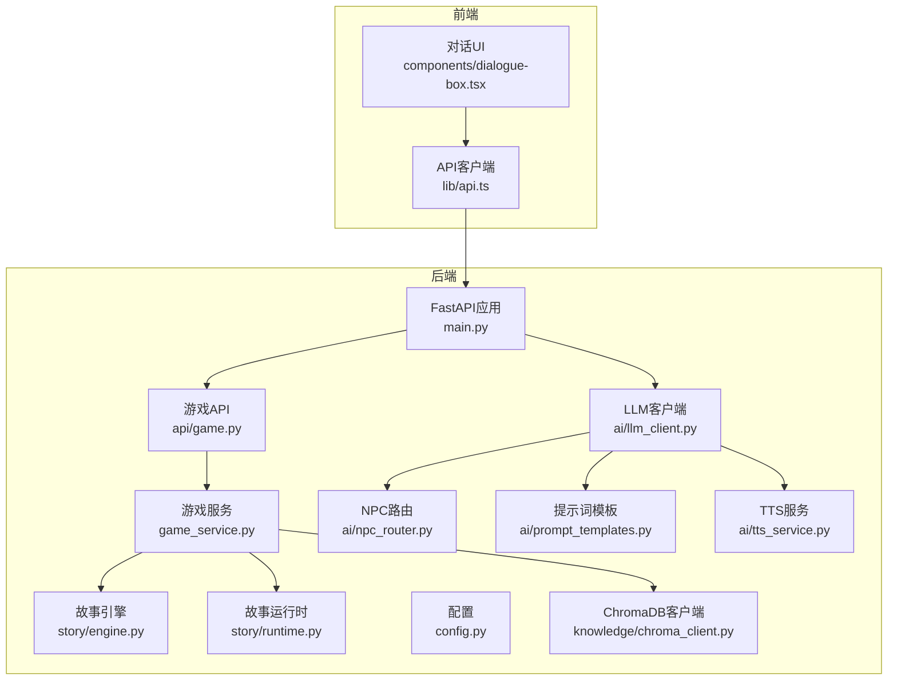
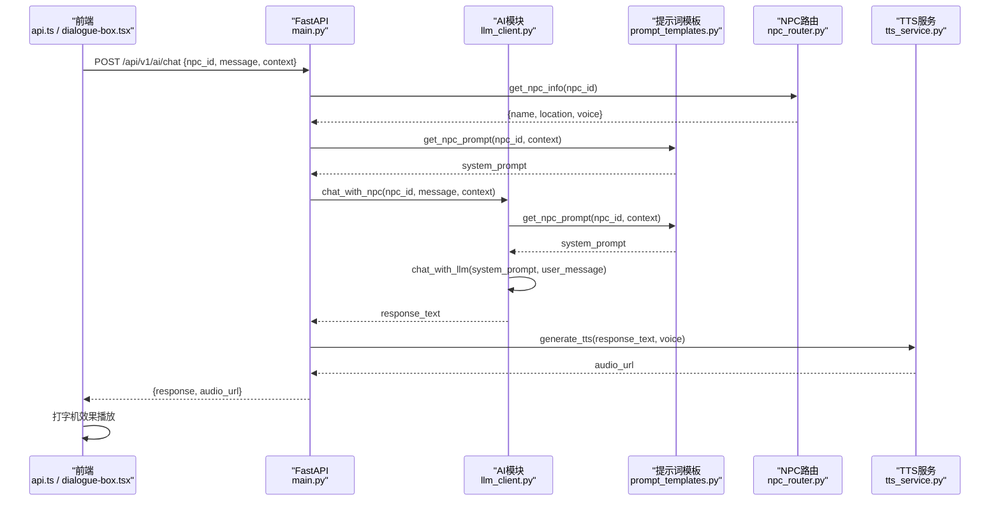
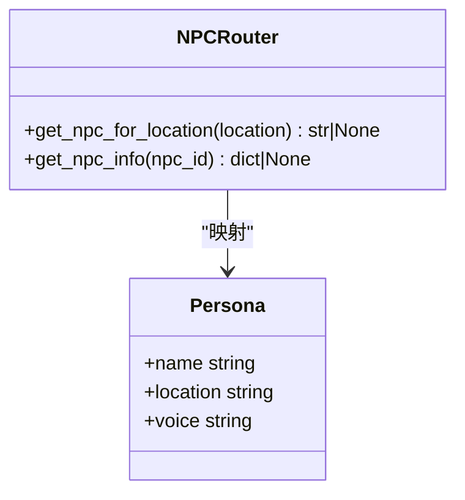
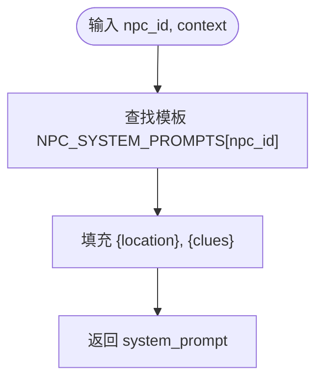
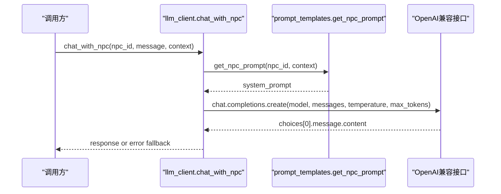
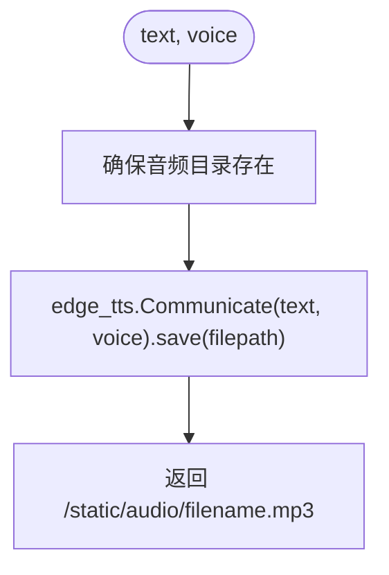
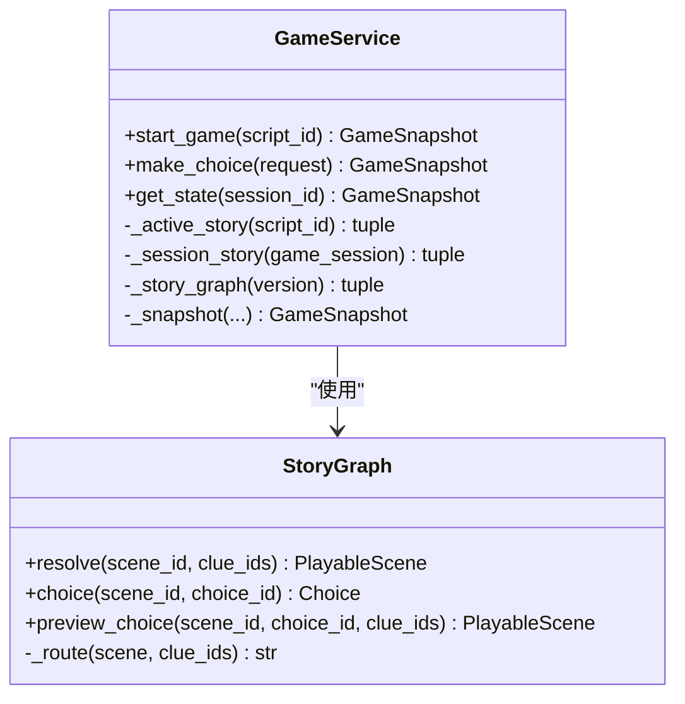
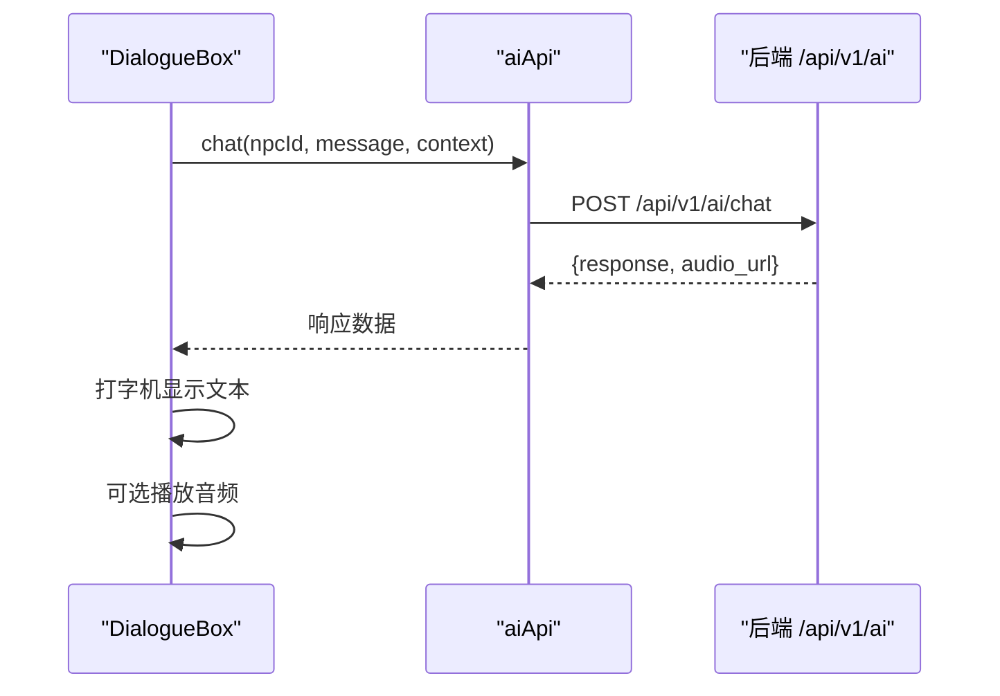
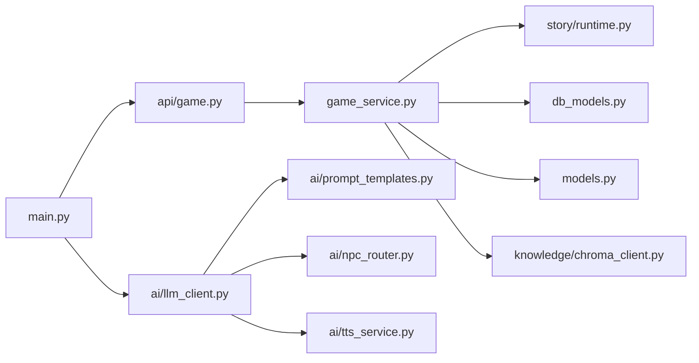

# NPC智能系统

<cite>
**本文引用的文件**   
- [main.py](file://backend/app/main.py)
- [npc_router.py](file://backend/app/ai/npc_router.py)
- [prompt_templates.py](file://backend/app/ai/prompt_templates.py)
- [llm_client.py](file://backend/app/ai/llm_client.py)
- [tts_service.py](file://backend/app/ai/tts_service.py)
- [config.py](file://backend/app/config.py)
- [game.py](file://backend/app/api/game.py)
- [game_service.py](file://backend/app/game_service.py)
- [models.py](file://backend/app/models.py)
- [engine.py](file://backend/app/story/engine.py)
- [runtime.py](file://backend/app/story/runtime.py)
- [state.py](file://backend/app/story/state.py)
- [chroma_client.py](file://backend/app/knowledge/chroma_client.py)
- [api.ts](file://frontend/src/lib/api.ts)
- [dialogue-box.tsx](file://frontend/src/components/dialogue-box.tsx)
</cite>

## 目录
1. [简介](#简介)
2. [项目结构](#项目结构)
3. [核心组件](#核心组件)
4. [架构总览](#架构总览)
5. [详细组件分析](#详细组件分析)
6. [依赖关系分析](#依赖关系分析)
7. [性能考量](#性能考量)
8. [故障排查指南](#故障排查指南)
9. [结论](#结论)
10. [附录](#附录)

## 简介
本文件为“澳秘 Macau Mystery NPC智能系统”的完整架构文档，聚焦以下目标：
- NPC路由机制：根据场景位置自动匹配NPC身份与语音。
- 角色定义系统与提示词模板框架：以模板驱动的性格、方言与行为模式配置。
- NPC上下文管理、对话状态维护与个性化回复生成：结合游戏线索与RAG知识库增强回答质量。
- 方言支持与TTS：按NPC分配不同语音，支持粤语等地方口音。
- LLM交互流程与提示词工程最佳实践：标准化调用、温度控制与错误回退。
- NPC注册机制、动态加载与热更新：可扩展的NPC清单与运行时注入。
- 开发指南、调试工具与性能监控：面向开发与运维的可观测性与稳定性保障。

## 项目结构
后端采用FastAPI模块化组织，AI能力集中在app/ai下，故事引擎在app/story，数据库与模型在app/db_models与app/models，前端通过Next.js与TypeScript API客户端对接。

图表来源 
- [main.py:17-111](file://backend/app/main.py#L17-L111)
- [game.py:12-37](file://backend/app/api/game.py#L12-L37)
- [game_service.py:31-386](file://backend/app/game_service.py#L31-L386)
- [engine.py:9-37](file://backend/app/story/engine.py#L9-L37)
- [runtime.py:22-80](file://backend/app/story/runtime.py#L22-L80)
- [llm_client.py:1-32](file://backend/app/ai/llm_client.py#L1-L32)
- [npc_router.py:1-18](file://backend/app/ai/npc_router.py#L1-L18)
- [prompt_templates.py:1-37](file://backend/app/ai/prompt_templates.py#L1-L37)
- [tts_service.py:1-25](file://backend/app/ai/tts_service.py#L1-L25)
- [config.py:38-77](file://backend/app/config.py#L38-L77)
- [chroma_client.py:1-19](file://backend/app/knowledge/chroma_client.py#L1-L19)
- [api.ts:115-126](file://frontend/src/lib/api.ts#L115-L126)
- [dialogue-box.tsx:1-62](file://frontend/src/components/dialogue-box.tsx#L1-L62)

章节来源
- [main.py:17-111](file://backend/app/main.py#L17-L111)
- [game.py:12-37](file://backend/app/api/game.py#L12-L37)

## 核心组件
- NPC路由与角色映射：基于位置到NPC ID的映射，提供名称、地点与语音选择。
- 提示词模板：为每个NPC定义性格、方言、说话风格与上下文占位符（当前场景、已收集线索）。
- LLM客户端：封装异步OpenAI兼容接口，统一temperature、max_tokens与错误处理。
- TTS服务：按NPC语音配置生成音频并返回静态路径。
- 游戏服务与运行时：版本化剧情图、选择分支、线索授予与会话快照；保证幂等与事务一致性。
- 配置中心：集中读取环境变量，提供CORS、数据库URL、演示数据开关等。
- 知识库客户端：ChromaDB持久化集合，用于历史知识检索（可扩展至RAG）。

章节来源
- [npc_router.py:1-18](file://backend/app/ai/npc_router.py#L1-L18)
- [prompt_templates.py:1-37](file://backend/app/ai/prompt_templates.py#L1-L37)
- [llm_client.py:1-32](file://backend/app/ai/llm_client.py#L1-L32)
- [tts_service.py:1-25](file://backend/app/ai/tts_service.py#L1-L25)
- [game_service.py:31-386](file://backend/app/game_service.py#L31-L386)
- [runtime.py:22-80](file://backend/app/story/runtime.py#L22-L80)
- [config.py:38-77](file://backend/app/config.py#L38-L77)
- [chroma_client.py:1-19](file://backend/app/knowledge/chroma_client.py#L1-L19)

## 架构总览
整体交互链路从前端发起聊天请求，后端通过NPC路由定位角色，组装提示词模板，调用LLM生成文本，再经TTS生成语音，最终返回给前端进行打字机效果展示。

图表来源 
- [main.py:84-96](file://backend/app/main.py#L84-L96)
- [npc_router.py:10-18](file://backend/app/ai/npc_router.py#L10-L18)
- [prompt_templates.py:32-37](file://backend/app/ai/prompt_templates.py#L32-L37)
- [llm_client.py:28-32](file://backend/app/ai/llm_client.py#L28-L32)
- [tts_service.py:14-25](file://backend/app/ai/tts_service.py#L14-L25)
- [api.ts:115-126](file://frontend/src/lib/api.ts#L115-L126)
- [dialogue-box.tsx:15-33](file://frontend/src/components/dialogue-box.tsx#L15-L33)

## 详细组件分析

### NPC路由与角色定义
- 位置到NPC ID映射：通过NPC_PERSONAS字典维护，包含名称、地点与语音ID。
- 查询接口：get_npc_for_location(location)与get_npc_info(npc_id)。
- 扩展性：新增NPC只需在NPC_PERSONAS中添加条目，无需改动核心逻辑。

图表来源 
- [npc_router.py:2-18](file://backend/app/ai/npc_router.py#L2-L18)

章节来源
- [npc_router.py:1-18](file://backend/app/ai/npc_router.py#L1-L18)

### 提示词模板框架
- 模板内容：为每个NPC定义背景、说话特点、当前场景与玩家线索占位符。
- 渲染函数：get_npc_prompt(npc_id, context)将context中的location与clues填充进模板。
- 最佳实践：保持模板简洁明确，限制输出长度，避免歧义指令。

图表来源 
- [prompt_templates.py:3-37](file://backend/app/ai/prompt_templates.py#L3-L37)

章节来源
- [prompt_templates.py:1-37](file://backend/app/ai/prompt_templates.py#L1-L37)

### LLM客户端与NPC对话
- 客户端初始化：使用AsyncOpenAI，支持环境变量覆盖API Key与Base URL。
- 对话方法：chat_with_llm(system_prompt, user_message, temperature)统一参数与异常处理。
- NPC封装：chat_with_npc(npc_id, user_message, context)自动组装system_prompt并调用LLM。

图表来源 
- [llm_client.py:12-32](file://backend/app/ai/llm_client.py#L12-L32)
- [prompt_templates.py:32-37](file://backend/app/ai/prompt_templates.py#L32-L37)

章节来源
- [llm_client.py:1-32](file://backend/app/ai/llm_client.py#L1-L32)

### TTS服务与方言语音
- 语音映射：VOICE_OPTIONS将NPC ID映射到具体语音（如粤语、普通话）。
- 生成流程：generate_tts(text, voice)保存MP3到static/audio并返回URL。
- 获取语音：get_voice_for_npc(npc_id)默认回退到通用语音。

图表来源 
- [tts_service.py:14-25](file://backend/app/ai/tts_service.py#L14-L25)

章节来源
- [tts_service.py:1-25](file://backend/app/ai/tts_service.py#L1-L25)

### 游戏服务与运行时（上下文与状态）
- 会话启动：start_game(script_id)校验并发布的故事版本，构建初始场景快照。
- 选择处理：make_choice(request)在事务中锁定会话、验证选项、授予线索、推进场景或结束。
- 状态快照：_snapshot聚合当前场景、线索、进度与结局信息。
- 运行时图：StoryGraph解析场景、路由与条件匹配，防止循环与越界。

图表来源 
- [game_service.py:31-386](file://backend/app/game_service.py#L31-L386)
- [runtime.py:22-80](file://backend/app/story/runtime.py#L22-L80)

章节来源
- [game_service.py:31-386](file://backend/app/game_service.py#L31-L386)
- [runtime.py:22-80](file://backend/app/story/runtime.py#L22-L80)

### 前端对话与TTS集成
- API客户端：aiApi.chat与aiApi.getTts封装HTTP请求。
- 对话UI：DialogueBox实现打字机效果与可选音频播放按钮。

图表来源 
- [api.ts:115-126](file://frontend/src/lib/api.ts#L115-L126)
- [dialogue-box.tsx:15-33](file://frontend/src/components/dialogue-box.tsx#L15-L33)

章节来源
- [api.ts:115-126](file://frontend/src/lib/api.ts#L115-L126)
- [dialogue-box.tsx:1-62](file://frontend/src/components/dialogue-box.tsx#L1-L62)

### RAG知识库（扩展点）
- ChromaDB客户端：单例持久化集合macau_history，用于存储与检索澳门历史知识。
- 集成建议：在提示词模板中注入检索到的相关片段，提升回答准确性与本地化。

章节来源
- [chroma_client.py:1-19](file://backend/app/knowledge/chroma_client.py#L1-L19)

## 依赖关系分析
- 模块耦合：
  - main.py负责路由挂载与全局中间件，低耦合地引入各子模块。
  - game_service强依赖story/runtime与数据库模型，保证事务与幂等。
  - llm_client依赖prompt_templates与npc_router，形成“路由→模板→LLM”的单向流。
  - tts_service独立于LLM，仅依赖文件系统与edge-tts。
- 外部依赖：
  - OpenAI兼容接口（SiliconFlow）、ChromaDB、SQLAlchemy异步会话。
- 潜在循环依赖：
  - 通过延迟导入（如llm_client内部from app.ai.prompt_templates import）避免循环。

图表来源 
- [main.py:84-96](file://backend/app/main.py#L84-L96)
- [game_service.py:31-386](file://backend/app/game_service.py#L31-L386)
- [llm_client.py:1-32](file://backend/app/ai/llm_client.py#L1-L32)

章节来源
- [main.py:84-96](file://backend/app/main.py#L84-L96)
- [game_service.py:31-386](file://backend/app/game_service.py#L31-L386)
- [llm_client.py:1-32](file://backend/app/ai/llm_client.py#L1-L32)

## 性能考量
- LLM调用优化：
  - 合理设置temperature与max_tokens，避免过长响应。
  - 缓存常用提示词与结果（可按npc_id+context哈希）。
- TTS优化：
  - 复用已生成的音频文件，避免重复生成。
  - 考虑CDN加速静态音频资源。
- 数据库与事务：
  - 使用with_for_update与BEGIN IMMEDIATE减少并发冲突。
  - 幂等记录避免重复处理相同request_id。
- 可观测性：
  - 健康检查端点与健康探针。
  - 日志记录关键步骤（LLM调用、TTS生成、选择处理）。

## 故障排查指南
- 常见错误与定位：
  - 会话不存在：检查session_id与数据库状态。
  - 故事未发布或未就绪：确认Story与StoryVersion状态。
  - 选项不可用：核对scene_id与choice_id是否匹配。
  - 路由器循环或越界：检查剧本路由条件与最大跳转次数。
  - LLM调用失败：检查API Key、Base URL与网络连通性。
  - TTS生成失败：检查音频目录权限与edge-tts可用性。
- 调试建议：
  - 启用详细日志，记录request_id与payload/response。
  - 使用健康检查端点验证数据库与依赖服务。
  - 对提示词模板进行单元测试，验证占位符填充。

章节来源
- [game_service.py:379-386](file://backend/app/game_service.py#L379-L386)
- [llm_client.py:23-25](file://backend/app/ai/llm_client.py#L23-L25)
- [main.py:98-105](file://backend/app/main.py#L98-L105)

## 结论
本系统以“NPC路由→提示词模板→LLM→TTS”为核心链路，结合版本化故事运行时与事务一致性，实现了高可用、可扩展且易于调试的NPC智能交互。通过RAG知识库与提示词工程，可进一步提升回答质量与本地化表现。建议在后续迭代中完善API路由暴露、增加监控指标与A/B测试能力，持续优化用户体验与系统性能。

## 附录
- 环境变量与配置：
  - APP_ENV、DATABASE_URL、CORS_ORIGINS、AUTH_TOKEN_TTL_HOURS、DEMO_*等。
  - SILICONFLOW_API_KEY、SILICONFLOW_BASE_URL、LLM_MODEL。
- 扩展指南：
  - 新增NPC：在NPC_PERSONAS与VOICE_OPTIONS中添加条目，并在prompt_templates中补充模板。
  - 新增RAG片段：向ChromaDB集合插入历史文档，并在提示词中引用检索结果。
  - 新增API：在main.py中挂载新路由，遵循现有错误处理与鉴权规范。