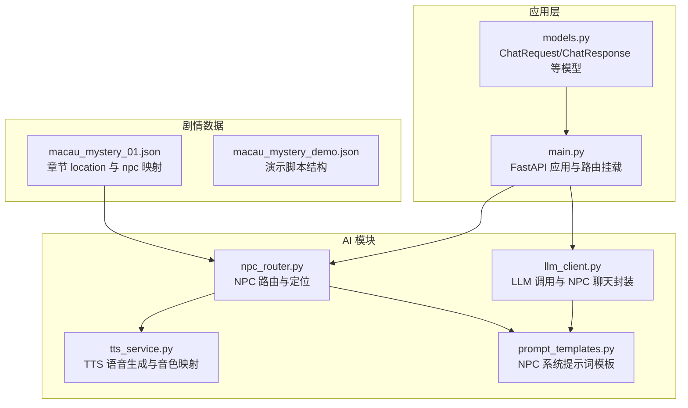
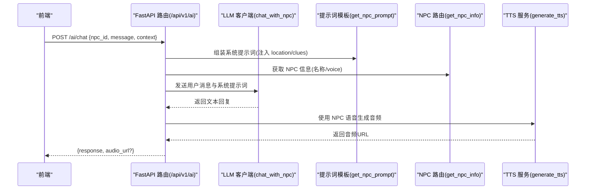
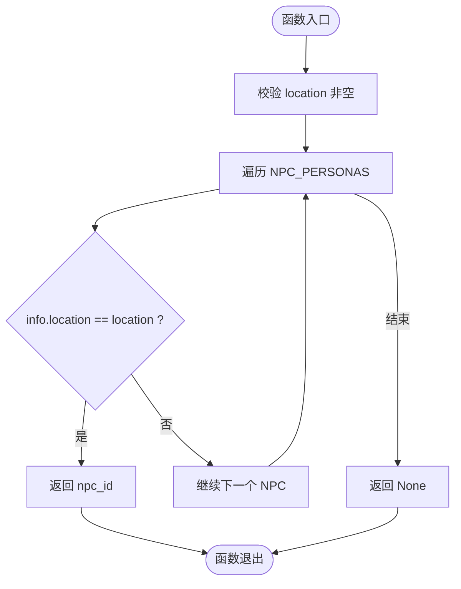
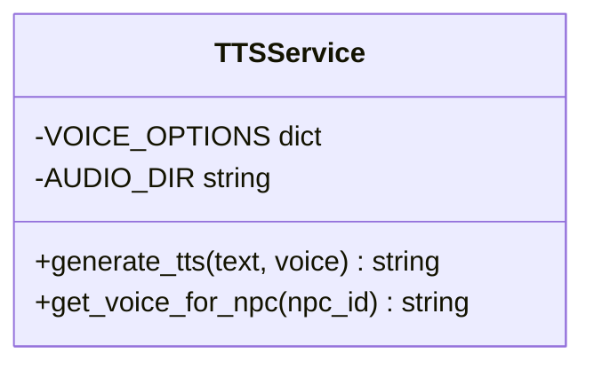
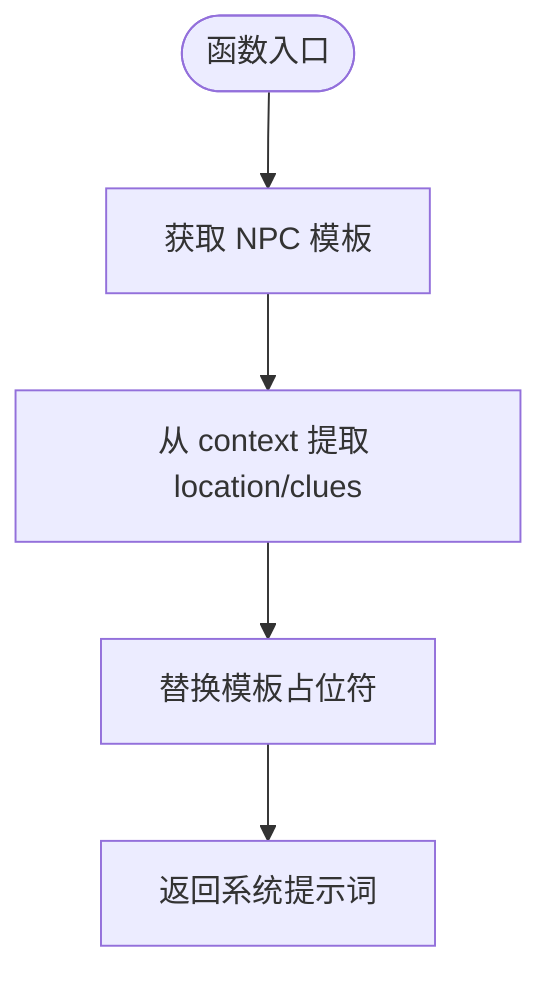
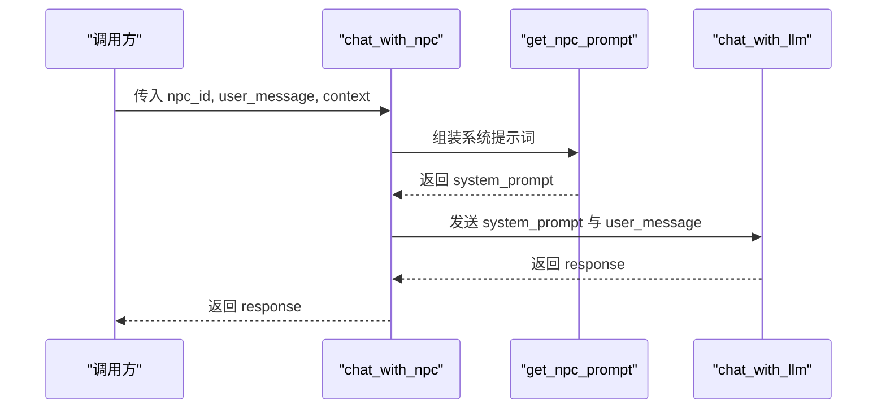
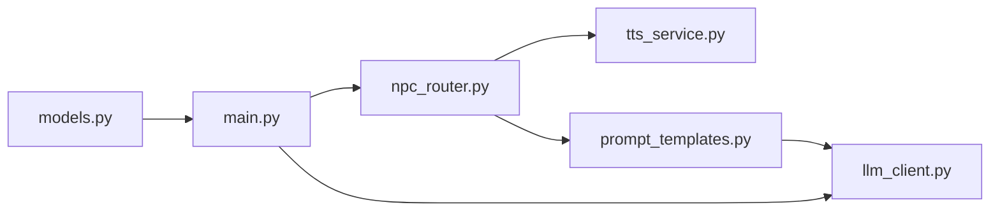

# NPC路由机制

<cite>
**本文引用的文件**   
- [npc_router.py](file://backend/app/ai/npc_router.py)
- [tts_service.py](file://backend/app/ai/tts_service.py)
- [prompt_templates.py](file://backend/app/ai/prompt_templates.py)
- [llm_client.py](file://backend/app/ai/llm_client.py)
- [main.py](file://backend/app/main.py)
- [models.py](file://backend/app/models.py)
- [macau_mystery_01.json](file://backend/app/story/scripts/macau_mystery_01.json)
- [macau_mystery_demo.json](file://backend/app/story/scripts/macau_mystery_demo.json)
</cite>

## 目录
1. [简介](#简介)
2. [项目结构](#项目结构)
3. [核心组件](#核心组件)
4. [架构总览](#架构总览)
5. [详细组件分析](#详细组件分析)
6. [依赖关系分析](#依赖关系分析)
7. [性能考虑](#性能考虑)
8. [故障排查指南](#故障排查指南)
9. [结论](#结论)
10. [附录](#附录)

## 简介
本技术文档聚焦于澳秘 Macau Mystery 的 NPC 路由机制，系统性阐述基于地理位置的 NPC 匹配算法、NPC 身份与语音配置管理、以及 NPC 动态加载与扩展流程。重点解析 NPC_PERSONAS 配置结构、位置映射关系、get_npc_for_location 函数的实现原理与返回值格式，并给出添加新 NPC 角色和自定义路由规则的最佳实践与示例路径。同时涵盖 NPC 对话链路中的提示词模板、TTS 语音生成与缓存策略，以及错误处理与性能优化建议。

## 项目结构
围绕 NPC 路由的核心代码位于后端 AI 模块中，主要包括：
- NPC 路由与定位：npc_router.py
- TTS 语音服务：tts_service.py
- NPC 系统提示词模板：prompt_templates.py
- LLM 客户端（含 NPC 聊天封装）：llm_client.py
- API 挂载与路由前缀：main.py
- 模型定义（聊天请求/响应等）：models.py
- 剧本数据（章节 location 与 npc 字段）：macau_mystery_01.json、macau_mystery_demo.json

图表来源 
- [npc_router.py:1-18](file://backend/app/ai/npc_router.py#L1-L18)
- [tts_service.py:1-25](file://backend/app/ai/tts_service.py#L1-L25)
- [prompt_templates.py:1-37](file://backend/app/ai/prompt_templates.py#L1-L37)
- [llm_client.py:12-28](file://backend/app/ai/llm_client.py#L12-L28)
- [main.py:84-96](file://backend/app/main.py#L84-L96)
- [models.py:95-108](file://backend/app/models.py#L95-L108)
- [macau_mystery_01.json:1-33](file://backend/app/story/scripts/macau_mystery_01.json#L1-L33)

章节来源
- [npc_router.py:1-18](file://backend/app/ai/npc_router.py#L1-L18)
- [tts_service.py:1-25](file://backend/app/ai/tts_service.py#L1-L25)
- [prompt_templates.py:1-37](file://backend/app/ai/prompt_templates.py#L1-L37)
- [llm_client.py:12-28](file://backend/app/ai/llm_client.py#L12-L28)
- [main.py:84-96](file://backend/app/main.py#L84-L96)
- [models.py:95-108](file://backend/app/models.py#L95-L108)
- [macau_mystery_01.json:1-33](file://backend/app/story/scripts/macau_mystery_01.json#L1-L33)

## 核心组件
- NPC 路由与定位（npc_router.py）
  - NPC_PERSONAS：集中维护 NPC 标识、名称、location 与 voice 配置。
  - get_npc_for_location(location)：根据 location 精确匹配返回 npc_id；未匹配返回 None。
  - get_npc_info(npc_id)：按 npc_id 获取完整信息字典。
- TTS 语音服务（tts_service.py）
  - VOICE_OPTIONS：npc_id 到语音模型的映射。
  - generate_tts(text, voice)：异步生成音频并返回静态资源路径。
  - get_voice_for_npc(npc_id)：默认回退到通用语音。
- 提示词模板（prompt_templates.py）
  - NPC_SYSTEM_PROMPTS：每个 NPC 的系统提示词模板，支持 {location} 与 {clues} 占位符注入。
  - get_npc_prompt(npc_id, context)：组装最终系统提示词。
- LLM 客户端（llm_client.py）
  - chat_with_llm(system_prompt, user_message, temperature)：通用 LLM 调用。
  - chat_with_npc(npc_id, user_message, context)：结合 NPC 提示词与上下文进行对话。
- 模型定义（models.py）
  - ChatRequest/ChatResponse：NPC 聊天接口输入输出模型。
- 剧本数据（macau_mystery_*.json）
  - chapters[].location：章节地理标签，用于 NPC 匹配。
  - chapters[].npc：章节绑定的 npc_id，驱动 NPC 选择。

章节来源
- [npc_router.py:1-18](file://backend/app/ai/npc_router.py#L1-L18)
- [tts_service.py:1-25](file://backend/app/ai/tts_service.py#L1-L25)
- [prompt_templates.py:1-37](file://backend/app/ai/prompt_templates.py#L1-L37)
- [llm_client.py:12-28](file://backend/app/ai/llm_client.py#L12-L28)
- [models.py:95-108](file://backend/app/models.py#L95-L108)
- [macau_mystery_01.json:1-33](file://backend/app/story/scripts/macau_mystery_01.json#L1-L33)

## 架构总览
下图展示了从前端发起 NPC 聊天到后端路由、提示词装配、LLM 调用与 TTS 生成的完整流程。

图表来源 
- [main.py:84-96](file://backend/app/main.py#L84-L96)
- [models.py:95-108](file://backend/app/models.py#L95-L108)
- [prompt_templates.py:32-37](file://backend/app/ai/prompt_templates.py#L32-L37)
- [npc_router.py:10-17](file://backend/app/ai/npc_router.py#L10-L17)
- [llm_client.py:28](file://backend/app/ai/llm_client.py#L28)
- [tts_service.py:14-24](file://backend/app/ai/tts_service.py#L14-L24)

## 详细组件分析

### NPC 路由与定位（npc_router.py）
- NPC_PERSONAS 数据结构
  - 键：npc_id（唯一标识）
  - 值：包含 name、location、voice 三个字段
  - 作用：统一维护 NPC 的身份信息与语音配置
- get_npc_for_location(location)
  - 参数：location（字符串，来自章节 location）
  - 逻辑：遍历 NPC_PERSONAS，精确匹配 location
  - 返回：匹配的 npc_id；未匹配返回 None
  - 复杂度：O(N)，N 为 NPC 数量
- get_npc_info(npc_id)
  - 参数：npc_id
  - 返回：对应 NPC 的配置字典或 None

图表来源 
- [npc_router.py:10-14](file://backend/app/ai/npc_router.py#L10-L14)

章节来源
- [npc_router.py:1-18](file://backend/app/ai/npc_router.py#L1-L18)

### TTS 语音服务（tts_service.py）
- VOICE_OPTIONS：npc_id 到语音模型的映射，确保不同 NPC 拥有独特音色
- generate_tts(text, voice)
  - 异步生成 MP3 音频文件，保存到 static/audio 目录
  - 返回静态资源 URL（/static/audio/{filename}.mp3）
- get_voice_for_npc(npc_id)
  - 若未找到映射，回退到默认语音

图表来源 
- [tts_service.py:1-25](file://backend/app/ai/tts_service.py#L1-L25)

章节来源
- [tts_service.py:1-25](file://backend/app/ai/tts_service.py#L1-L25)

### 提示词模板（prompt_templates.py）
- NPC_SYSTEM_PROMPTS：每个 NPC 的系统提示词模板，包含说话风格、场景与线索注入点
- get_npc_prompt(npc_id, context)
  - 从 context 提取 location 与 clues 列表
  - 格式化模板并返回最终系统提示词

图表来源 
- [prompt_templates.py:32-37](file://backend/app/ai/prompt_templates.py#L32-L37)

章节来源
- [prompt_templates.py:1-37](file://backend/app/ai/prompt_templates.py#L1-L37)

### LLM 客户端（llm_client.py）
- chat_with_llm(system_prompt, user_message, temperature)
  - 通用 LLM 调用接口，支持温度参数控制随机性
- chat_with_npc(npc_id, user_message, context)
  - 内部调用 get_npc_prompt 组装系统提示词
  - 将用户消息与系统提示词发送给 LLM
  - 返回文本回复

图表来源 
- [llm_client.py:12-28](file://backend/app/ai/llm_client.py#L12-L28)
- [prompt_templates.py:32-37](file://backend/app/ai/prompt_templates.py#L32-L37)

章节来源
- [llm_client.py:12-28](file://backend/app/ai/llm_client.py#L12-L28)

### 模型定义（models.py）
- ChatRequest：包含 npc_id、message、context
- ChatResponse：包含 response 与可选 audio_url
- 这些模型用于 FastAPI 路由的参数校验与响应序列化

章节来源
- [models.py:95-108](file://backend/app/models.py#L95-L108)

### 剧本数据与 NPC 绑定（macau_mystery_*.json）
- macau_mystery_01.json
  - chapters[].location：章节地理标签（如“妈阁庙”）
  - chapters[].npc：章节绑定的 npc_id（如“mage_temple_keeper”）
- macau_mystery_demo.json
  - 演示脚本结构，验证章节与场景组织方式

章节来源
- [macau_mystery_01.json:1-33](file://backend/app/story/scripts/macau_mystery_01.json#L1-L33)
- [macau_mystery_demo.json:1-44](file://backend/app/story/scripts/macau_mystery_demo.json#L1-L44)

## 依赖关系分析
- NPC 路由与 TTS 的耦合
  - npc_router.py 提供 npc_id 与 voice 配置
  - tts_service.py 通过 VOICE_OPTIONS 将 npc_id 映射到具体语音模型
- 提示词模板与 LLM 客户端
  - prompt_templates.py 生成系统提示词
  - llm_client.py 调用 LLM 并返回文本
- API 挂载
  - main.py 将 ai_router 挂载到 /api/v1/ai 前缀
  - models.py 定义 ChatRequest/ChatResponse 用于接口契约

图表来源 
- [npc_router.py:1-18](file://backend/app/ai/npc_router.py#L1-L18)
- [tts_service.py:1-25](file://backend/app/ai/tts_service.py#L1-L25)
- [prompt_templates.py:1-37](file://backend/app/ai/prompt_templates.py#L1-L37)
- [llm_client.py:12-28](file://backend/app/ai/llm_client.py#L12-L28)
- [main.py:84-96](file://backend/app/main.py#L84-L96)
- [models.py:95-108](file://backend/app/models.py#L95-L108)

章节来源
- [npc_router.py:1-18](file://backend/app/ai/npc_router.py#L1-L18)
- [tts_service.py:1-25](file://backend/app/ai/tts_service.py#L1-L25)
- [prompt_templates.py:1-37](file://backend/app/ai/prompt_templates.py#L1-L37)
- [llm_client.py:12-28](file://backend/app/ai/llm_client.py#L12-L28)
- [main.py:84-96](file://backend/app/main.py#L84-L96)
- [models.py:95-108](file://backend/app/models.py#L95-L108)

## 性能考虑
- NPC 路由匹配
  - 当前实现为线性扫描 O(N)，适合 NPC 数量较少的场景
  - 优化建议：构建 location→npc_id 的哈希索引，将匹配复杂度降至 O(1)
- TTS 生成
  - 每次生成都会写入磁盘，存在 I/O 开销
  - 优化建议：对相同 text+voice 组合进行缓存（内存或 Redis），避免重复生成
- 提示词组装
  - 模板格式化开销较小，可考虑缓存常见上下文组合
- LLM 调用
  - 网络延迟与 token 长度影响响应时间
  - 优化建议：限制上下文长度、批量请求、超时与重试策略

[本节为通用指导，不直接分析具体文件]

## 故障排查指南
- NPC 未匹配
  - 现象：get_npc_for_location 返回 None
  - 排查：检查章节 location 是否与 NPC_PERSONAS 中的 location 完全一致
- 语音缺失或回退
  - 现象：TTS 使用默认语音而非预期 NPC 语音
  - 排查：确认 VOICE_OPTIONS 是否包含对应 npc_id
- 提示词未生效
  - 现象：NPC 回答不符合人设
  - 排查：检查 NPC_SYSTEM_PROMPTS 模板是否正确，context 是否注入 location 与 clues
- API 校验失败
  - 现象：422 错误，字段类型或格式不合法
  - 排查：参考 models.py 中的 ChatRequest/ChatResponse 定义，确保请求体符合规范

章节来源
- [npc_router.py:10-14](file://backend/app/ai/npc_router.py#L10-L14)
- [tts_service.py:23-24](file://backend/app/ai/tts_service.py#L23-L24)
- [prompt_templates.py:32-37](file://backend/app/ai/prompt_templates.py#L32-L37)
- [models.py:95-108](file://backend/app/models.py#L95-L108)

## 结论
NPC 路由机制以简洁的数据驱动方式实现了基于地理位置的 NPC 匹配与语音配置管理。通过 NPC_PERSONAS、提示词模板与 TTS 服务的协同，系统能够动态生成符合角色设定的对话与语音。建议在 NPC 规模增长时引入哈希索引与缓存机制以提升性能，并通过严格的模型校验与错误处理保障稳定性。

[本节为总结性内容，不直接分析具体文件]

## 附录

### 添加新 NPC 角色的步骤
- 在 NPC_PERSONAS 中添加新条目（npc_id、name、location、voice）
- 在 VOICE_OPTIONS 中映射 npc_id 到语音模型
- 在 NPC_SYSTEM_PROMPTS 中编写系统提示词模板
- 在剧本数据中设置章节 location 与 npc 字段
- 确保 get_npc_for_location 能正确匹配新 location

章节来源
- [npc_router.py:2-8](file://backend/app/ai/npc_router.py#L2-L8)
- [tts_service.py:4-10](file://backend/app/ai/tts_service.py#L4-L10)
- [prompt_templates.py:3-29](file://backend/app/ai/prompt_templates.py#L3-L29)
- [macau_mystery_01.json:6-14](file://backend/app/story/scripts/macau_mystery_01.json#L6-L14)

### 自定义路由规则示例
- 修改 get_npc_for_location 的实现，支持模糊匹配或优先级规则
- 增加 location 别名映射表，提升兼容性
- 引入缓存层存储已匹配结果，减少重复计算

章节来源
- [npc_router.py:10-14](file://backend/app/ai/npc_router.py#L10-L14)