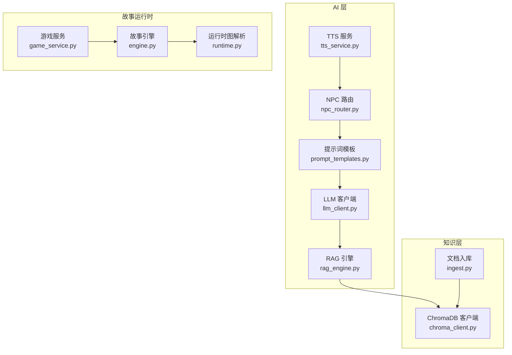
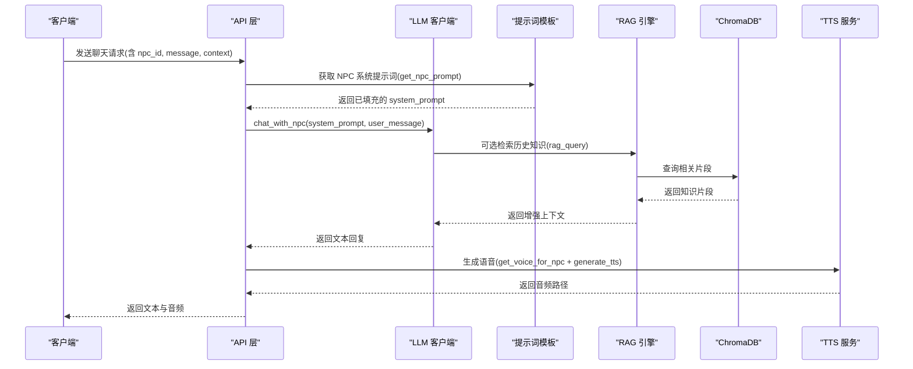
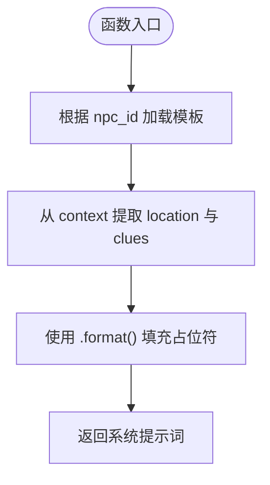
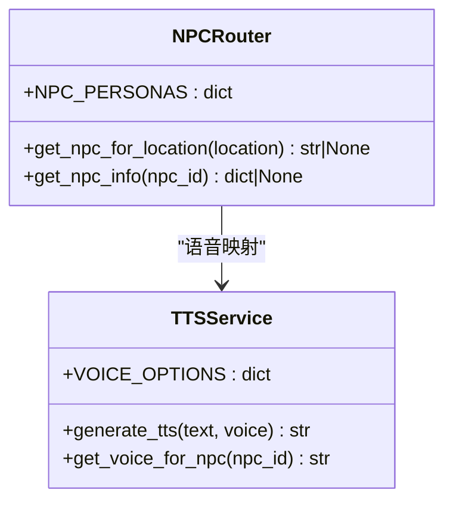
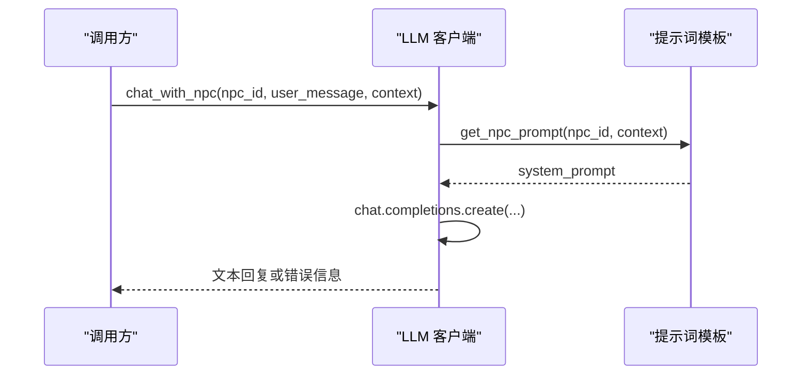
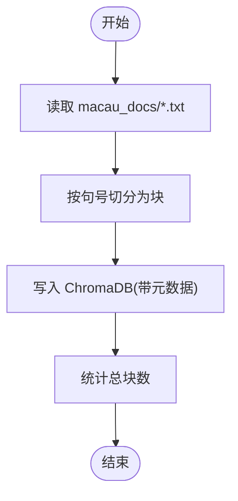
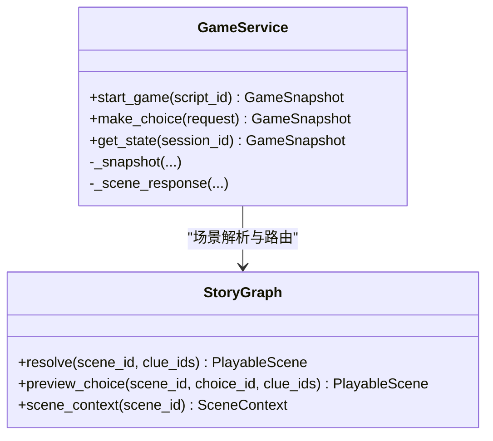
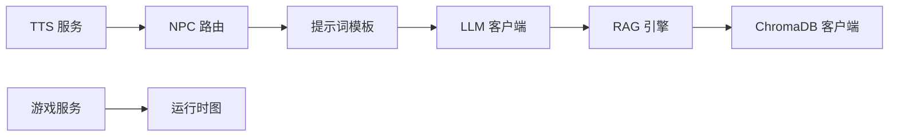

# 提示词模板系统

<cite>
**本文引用的文件**
- [prompt_templates.py](file://backend/app/ai/prompt_templates.py)
- [npc_router.py](file://backend/app/ai/npc_router.py)
- [llm_client.py](file://backend/app/ai/llm_client.py)
- [rag_engine.py](file://backend/app/ai/rag_engine.py)
- [chroma_client.py](file://backend/app/knowledge/chroma_client.py)
- [ingest.py](file://backend/app/knowledge/ingest.py)
- [tts_service.py](file://backend/app/ai/tts_service.py)
- [models.py](file://backend/app/models.py)
- [game_service.py](file://backend/app/game_service.py)
- [engine.py](file://backend/app/story/engine.py)
- [runtime.py](file://backend/app/story/runtime.py)
</cite>

## 目录
1. [简介](#简介)
2. [项目结构](#项目结构)
3. [核心组件](#核心组件)
4. [架构总览](#架构总览)
5. [详细组件分析](#详细组件分析)
6. [依赖关系分析](#依赖关系分析)
7. [性能考量](#性能考量)
8. [故障排查指南](#故障排查指南)
9. [结论](#结论)
10. [附录：模板开发指南与测试方法](#附录模板开发指南与测试方法)

## 简介
本技术文档围绕“澳秘 Macau Mystery”的提示词模板系统，系统性阐述其设计架构、模板结构与变量替换机制，覆盖 NPC 特定提示词、地点背景信息、角色性格设定与对话上下文管理。同时说明版本管理、动态更新与热重载支持策略，提供提示词工程最佳实践、质量评估方法与性能优化技巧，并给出完整的模板开发指南、调试工具与测试方法，帮助开发者快速创建新模板、自定义变量与条件逻辑。

## 项目结构
后端采用模块化组织，提示词模板系统位于 AI 层，并与知识检索（RAG）、语音合成（TTS）以及游戏运行时（Story Engine）紧密集成。关键模块如下：
- 提示词模板与 NPC 路由：定义 NPC 人设与模板变量，按地点选择对应 NPC
- LLM 客户端：封装大模型调用，统一 system/user 消息格式
- RAG 引擎：基于位置与查询进行历史知识检索（当前为 Mock，后续接入 ChromaDB）
- 知识库入库：将本地文本切块并写入向量库
- TTS 服务：根据 NPC 生成语音
- 游戏服务与运行时：维护会话状态、线索收集与剧情推进，为提示词注入上下文

**图表来源**
- [prompt_templates.py:1-37](file://backend/app/ai/prompt_templates.py#L1-L37)
- [npc_router.py:1-18](file://backend/app/ai/npc_router.py#L1-L18)
- [llm_client.py:1-32](file://backend/app/ai/llm_client.py#L1-L32)
- [rag_engine.py:1-13](file://backend/app/ai/rag_engine.py#L1-L13)
- [chroma_client.py:1-19](file://backend/app/knowledge/chroma_client.py#L1-L19)
- [ingest.py:1-36](file://backend/app/knowledge/ingest.py#L1-L36)
- [tts_service.py:1-25](file://backend/app/ai/tts_service.py#L1-L25)
- [engine.py:1-37](file://backend/app/story/engine.py#L1-L37)
- [runtime.py:1-80](file://backend/app/story/runtime.py#L1-L80)

**章节来源**
- [prompt_templates.py:1-37](file://backend/app/ai/prompt_templates.py#L1-L37)
- [npc_router.py:1-18](file://backend/app/ai/npc_router.py#L1-L18)
- [llm_client.py:1-32](file://backend/app/ai/llm_client.py#L1-L32)
- [rag_engine.py:1-13](file://backend/app/ai/rag_engine.py#L1-L13)
- [chroma_client.py:1-19](file://backend/app/knowledge/chroma_client.py#L1-L19)
- [ingest.py:1-36](file://backend/app/knowledge/ingest.py#L1-L36)
- [tts_service.py:1-25](file://backend/app/ai/tts_service.py#L1-L25)
- [engine.py:1-37](file://backend/app/story/engine.py#L1-L37)
- [runtime.py:1-80](file://backend/app/story/runtime.py#L1-L80)

## 核心组件
- 提示词模板与变量替换
  - 以字典形式集中管理 NPC 系统提示词，使用占位符 {location} 与 {clues} 注入上下文
  - 提供 get_npc_prompt(npc_id, context) 完成模板加载与变量填充
- NPC 路由与语音映射
  - NPC_PERSONAS 维护 npc_id 到名称、地点与语音的映射
  - get_npc_for_location(location) 按地点返回 NPC 标识；get_voice_for_npc(npc_id) 由 TTS 服务提供语音选择
- LLM 客户端
  - 封装 AsyncOpenAI 调用，统一 system_prompt 与 user_message 格式
  - chat_with_npc(npc_id, user_message, context) 组合模板与 LLM 调用
- RAG 引擎与知识库
  - rag_query(query, location) 当前为 Mock，未来通过 chroma_client.get_collection() 接入向量检索
  - ingest_documents() 将 macau_docs/*.txt 切块后 upsert 至 ChromaDB
- 游戏服务与运行时
  - GameService 维护会话、线索与场景流转，为提示词注入 clues 列表
  - StoryGraph 负责场景解析与路由，确保上下文一致性

**章节来源**
- [prompt_templates.py:1-37](file://backend/app/ai/prompt_templates.py#L1-L37)
- [npc_router.py:1-18](file://backend/app/ai/npc_router.py#L1-L18)
- [llm_client.py:1-32](file://backend/app/ai/llm_client.py#L1-L32)
- [rag_engine.py:1-13](file://backend/app/ai/rag_engine.py#L1-L13)
- [chroma_client.py:1-19](file://backend/app/knowledge/chroma_client.py#L1-L19)
- [ingest.py:1-36](file://backend/app/knowledge/ingest.py#L1-L36)
- [game_service.py:1-386](file://backend/app/game_service.py#L1-L386)
- [runtime.py:1-80](file://backend/app/story/runtime.py#L1-L80)

## 架构总览
下图展示从用户输入到 NPC 回复的完整流程，包括提示词组装、LLM 调用、RAG 增强与 TTS 输出。

**图表来源**
- [llm_client.py:1-32](file://backend/app/ai/llm_client.py#L1-L32)
- [prompt_templates.py:1-37](file://backend/app/ai/prompt_templates.py#L1-L37)
- [rag_engine.py:1-13](file://backend/app/ai/rag_engine.py#L1-L13)
- [chroma_client.py:1-19](file://backend/app/knowledge/chroma_client.py#L1-L19)
- [tts_service.py:1-25](file://backend/app/ai/tts_service.py#L1-L25)

## 详细组件分析

### 提示词模板与变量替换
- 模板结构
  - NPC_SYSTEM_PROMPTS 字典键为 npc_id，值为包含 {location} 与 {clues} 的系统提示词
  - 每个模板限定语言与长度，保证输出风格一致
- 变量替换机制
  - get_npc_prompt(npc_id, context) 从 context 提取 location 与 clues，并以字符串格式化注入模板
  - 若 npc_id 不存在，回退到通用友好提示词
- 扩展建议
  - 引入版本字段与哈希校验，便于热重载与灰度发布
  - 增加条件分支（如按玩家进度切换语气或难度）

**图表来源**
- [prompt_templates.py:1-37](file://backend/app/ai/prompt_templates.py#L1-L37)

**章节来源**
- [prompt_templates.py:1-37](file://backend/app/ai/prompt_templates.py#L1-L37)

### NPC 路由与语音映射
- NPC 定位
  - NPC_PERSONAS 维护 npc_id 到名称、地点与语音的映射
  - get_npc_for_location(location) 按地点匹配返回 npc_id
- 语音选择
  - VOICE_OPTIONS 在 TTS 服务中定义 npc_id 到 voice 的映射
  - get_voice_for_npc(npc_id) 返回默认或指定语音

**图表来源**
- [npc_router.py:1-18](file://backend/app/ai/npc_router.py#L1-L18)
- [tts_service.py:1-25](file://backend/app/ai/tts_service.py#L1-L25)

**章节来源**
- [npc_router.py:1-18](file://backend/app/ai/npc_router.py#L1-L18)
- [tts_service.py:1-25](file://backend/app/ai/tts_service.py#L1-L25)

### LLM 客户端与 NPC 对话
- 调用流程
  - chat_with_llm(system_prompt, user_message, temperature) 封装异步调用
  - chat_with_npc(npc_id, user_message, context) 先组装 system_prompt，再调用 LLM
- 错误处理
  - 捕获异常并返回友好错误信息，便于前端降级显示

**图表来源**
- [llm_client.py:1-32](file://backend/app/ai/llm_client.py#L1-L32)
- [prompt_templates.py:1-37](file://backend/app/ai/prompt_templates.py#L1-L37)

**章节来源**
- [llm_client.py:1-32](file://backend/app/ai/llm_client.py#L1-L32)

### RAG 引擎与知识库入库
- 检索增强
  - rag_query(query, location) 当前为 Mock，按关键词匹配返回历史知识
  - 未来接入 ChromaDB 实现语义检索
- 文档入库
  - split_into_chunks(text, chunk_size) 按句号切分，控制块大小
  - ingest_documents() 遍历 macau_docs/*.txt，upsert 至 ChromaDB

**图表来源**
- [rag_engine.py:1-13](file://backend/app/ai/rag_engine.py#L1-L13)
- [chroma_client.py:1-19](file://backend/app/knowledge/chroma_client.py#L1-L19)
- [ingest.py:1-36](file://backend/app/knowledge/ingest.py#L1-L36)

**章节来源**
- [rag_engine.py:1-13](file://backend/app/ai/rag_engine.py#L1-L13)
- [chroma_client.py:1-19](file://backend/app/knowledge/chroma_client.py#L1-L19)
- [ingest.py:1-36](file://backend/app/knowledge/ingest.py#L1-L36)

### 游戏服务与运行时对提示词的上下文注入
- 上下文来源
  - GameService 维护会话中的 clues 列表，作为提示词变量注入
  - StoryGraph 确保场景与章节一致性，避免上下文错乱
- 数据流
  - 启动游戏时确定初始场景，选择时推进场景并授予线索
  - 快照中包含当前场景、线索与进度，供提示词模板使用

**图表来源**
- [game_service.py:1-386](file://backend/app/game_service.py#L1-L386)
- [runtime.py:1-80](file://backend/app/story/runtime.py#L1-L80)

**章节来源**
- [game_service.py:1-386](file://backend/app/game_service.py#L1-L386)
- [runtime.py:1-80](file://backend/app/story/runtime.py#L1-L80)

## 依赖关系分析
- 模块耦合
  - 提示词模板与 LLM 客户端强耦合（system_prompt 组装）
  - NPC 路由与 TTS 服务通过 npc_id 解耦
  - RAG 引擎与 ChromaDB 客户端通过接口抽象，便于替换实现
- 外部依赖
  - OpenAI 兼容接口（SiliconFlow）
  - edge-tts 用于语音合成
  - ChromaDB 用于向量检索

**图表来源**
- [prompt_templates.py:1-37](file://backend/app/ai/prompt_templates.py#L1-L37)
- [llm_client.py:1-32](file://backend/app/ai/llm_client.py#L1-L32)
- [rag_engine.py:1-13](file://backend/app/ai/rag_engine.py#L1-L13)
- [chroma_client.py:1-19](file://backend/app/knowledge/chroma_client.py#L1-L19)
- [tts_service.py:1-25](file://backend/app/ai/tts_service.py#L1-L25)
- [game_service.py:1-386](file://backend/app/game_service.py#L1-L386)
- [runtime.py:1-80](file://backend/app/story/runtime.py#L1-L80)

**章节来源**
- [prompt_templates.py:1-37](file://backend/app/ai/prompt_templates.py#L1-L37)
- [llm_client.py:1-32](file://backend/app/ai/llm_client.py#L1-L32)
- [rag_engine.py:1-13](file://backend/app/ai/rag_engine.py#L1-L13)
- [chroma_client.py:1-19](file://backend/app/knowledge/chroma_client.py#L1-L19)
- [tts_service.py:1-25](file://backend/app/ai/tts_service.py#L1-L25)
- [game_service.py:1-386](file://backend/app/game_service.py#L1-L386)
- [runtime.py:1-80](file://backend/app/story/runtime.py#L1-L80)

## 性能考量
- 模板加载
  - 将 NPC_SYSTEM_PROMPTS 缓存于进程内存，避免重复构建
  - 引入版本哈希，变更时仅重建受影响模板
- LLM 调用
  - 合理设置 temperature 与 max_tokens，减少无效输出
  - 失败重试与超时控制，提升稳定性
- RAG 检索
  - 优先使用缓存结果，降低向量库压力
  - 切块大小与重叠策略影响召回精度与速度
- TTS 生成
  - 并发限制与队列化，避免瞬时峰值阻塞
  - 音频文件命名去重与清理策略

[本节为通用指导，不直接分析具体文件]

## 故障排查指南
- LLM 调用失败
  - 检查环境变量（SILICONFLOW_API_KEY、SILICONFLOW_BASE_URL、LLM_MODEL）
  - 查看日志中的错误信息，确认网络与鉴权
- 模板变量缺失
  - 确认 context 是否包含 location 与 clues
  - 检查 npc_id 是否在 NPC_PERSONAS 中
- RAG 无结果
  - 验证 macau_docs/*.txt 是否存在且编码正确
  - 检查 ChromaDB 集合是否成功 upsert
- TTS 生成失败
  - 确认 edge-tts 可用性与语音名称正确
  - 检查静态目录权限与写入路径

**章节来源**
- [llm_client.py:1-32](file://backend/app/ai/llm_client.py#L1-L32)
- [prompt_templates.py:1-37](file://backend/app/ai/prompt_templates.py#L1-L37)
- [rag_engine.py:1-13](file://backend/app/ai/rag_engine.py#L1-L13)
- [chroma_client.py:1-19](file://backend/app/knowledge/chroma_client.py#L1-L19)
- [ingest.py:1-36](file://backend/app/knowledge/ingest.py#L1-L36)
- [tts_service.py:1-25](file://backend/app/ai/tts_service.py#L1-L25)

## 结论
提示词模板系统以简洁的字典结构与变量替换机制为核心，结合 NPC 路由、LLM 客户端、RAG 增强与 TTS 输出，形成完整的 NPC 对话流水线。通过游戏服务与运行时提供的上下文，实现个性化与情境化的回复。建议在现有基础上引入版本管理与热重载，完善 RAG 检索与性能优化，以提升系统的可维护性与用户体验。

[本节为总结性内容，不直接分析具体文件]

## 附录：模板开发指南与测试方法

### 创建新的提示词模板
- 步骤
  - 在 NPC_SYSTEM_PROMPTS 中添加新 npc_id 与模板文本
  - 在 NPC_PERSONAS 中补充名称、地点与语音映射
  - 如需新语音，在 VOICE_OPTIONS 中配置
- 变量
  - 使用 {location} 与 {clues} 注入上下文
  - 可扩展更多变量（如 {player_level}、{time_of_day}）

**章节来源**
- [prompt_templates.py:1-37](file://backend/app/ai/prompt_templates.py#L1-L37)
- [npc_router.py:1-18](file://backend/app/ai/npc_router.py#L1-L18)
- [tts_service.py:1-25](file://backend/app/ai/tts_service.py#L1-L25)

### 条件逻辑与个性化策略
- 基于线索数量或类型调整语气与内容
- 根据玩家进度切换模板版本（v1/v2）
- 使用 StoryGraph 的条件路由决定不同场景下的提示词策略

**章节来源**
- [runtime.py:1-80](file://backend/app/story/runtime.py#L1-L80)
- [game_service.py:1-386](file://backend/app/game_service.py#L1-L386)

### 调试工具与测试方法
- 单元测试
  - 覆盖 get_npc_prompt 的变量替换与回退逻辑
  - 验证 NPC 路由与语音映射的正确性
- 集成测试
  - 模拟 chat_with_npc 全流程，检查 LLM 响应与 TTS 输出
  - 验证 RAG 检索结果与 ChromaDB 数据一致性
- 性能测试
  - 压测 LLM 调用与 TTS 生成，监控延迟与错误率

**章节来源**
- [llm_client.py:1-32](file://backend/app/ai/llm_client.py#L1-L32)
- [rag_engine.py:1-13](file://backend/app/ai/rag_engine.py#L1-L13)
- [chroma_client.py:1-19](file://backend/app/knowledge/chroma_client.py#L1-L19)
- [tts_service.py:1-25](file://backend/app/ai/tts_service.py#L1-L25)

### 版本管理与热重载支持
- 版本字段
  - 在模板字典中增加 version 与 hash 字段
  - 通过环境变量或配置中心动态切换版本
- 热重载
  - 监听模板文件变更，重新加载受影响的模板
  - 灰度发布与 A/B 测试支持

[本节为概念性指导，不直接分析具体文件]

### 质量评估方法
- 一致性
  - 检查输出语言、长度与风格是否符合模板约束
- 相关性
  - 评估 RAG 检索结果与用户问题的相关性
- 多样性
  - 避免重复回答，提升对话趣味性
- 安全性
  - 过滤敏感内容与不当表述

[本节为通用指导，不直接分析具体文件]