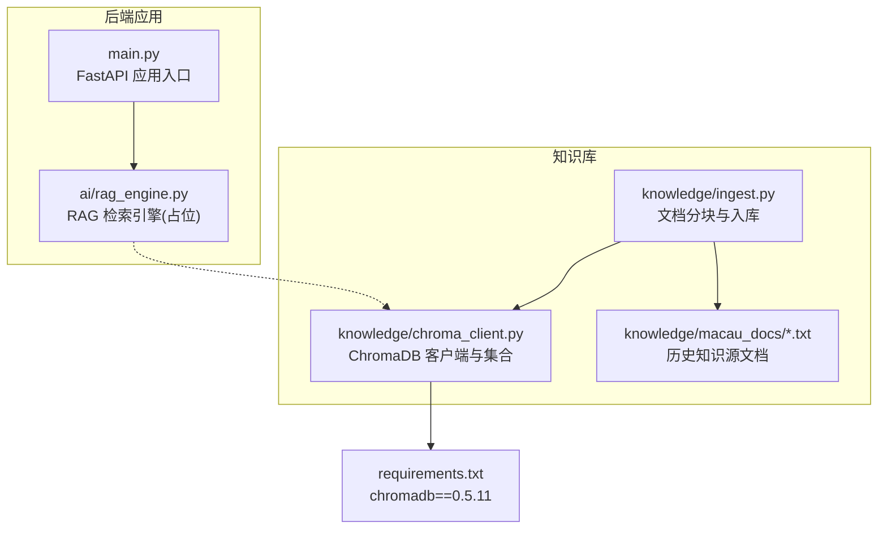
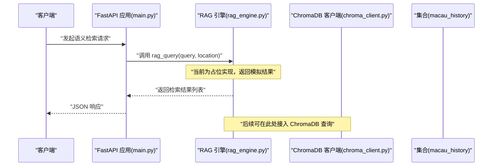
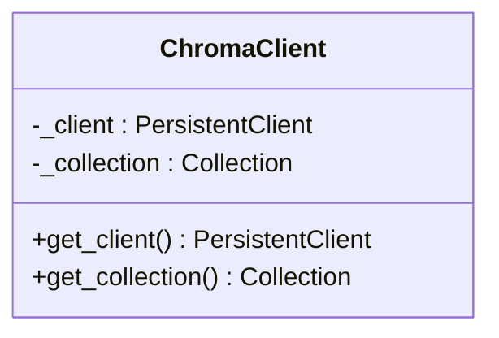
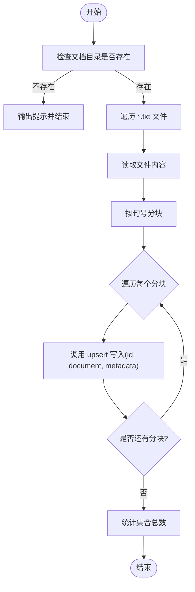
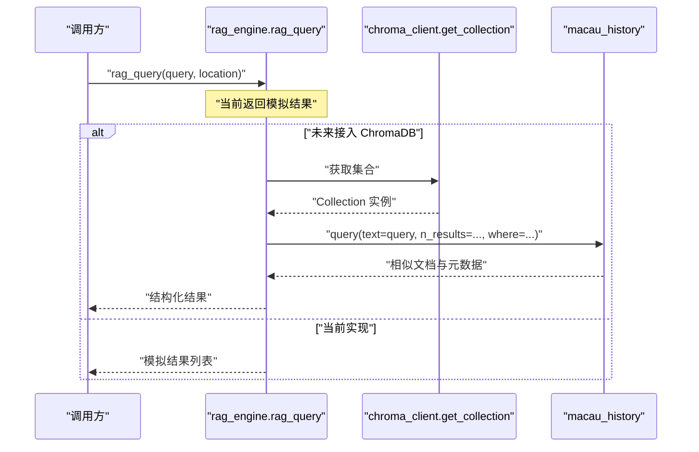
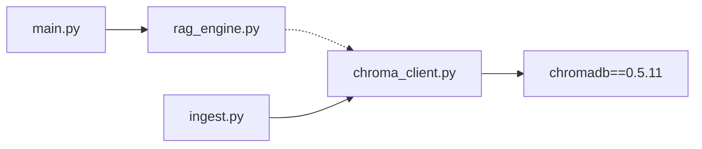

# ChromaDB数据库集成

<cite>
**本文引用的文件**   
- [backend/app/knowledge/chroma_client.py](file://backend/app/knowledge/chroma_client.py)
- [backend/app/knowledge/ingest.py](file://backend/app/knowledge/ingest.py)
- [backend/app/ai/rag_engine.py](file://backend/app/ai/rag_engine.py)
- [backend/app/main.py](file://backend/app/main.py)
- [backend/requirements.txt](file://backend/requirements.txt)
</cite>

## 目录
1. [简介](#简介)
2. [项目结构](#项目结构)
3. [核心组件](#核心组件)
4. [架构总览](#架构总览)
5. [详细组件分析](#详细组件分析)
6. [依赖关系分析](#依赖关系分析)
7. [性能与优化](#性能与优化)
8. [故障排查指南](#故障排查指南)
9. [结论](#结论)
10. [附录：API使用示例](#附录api使用示例)

## 简介
本文件为“澳秘 Macau Mystery”项目的 ChromaDB 向量数据库集成提供全面架构文档。当前代码库已实现 ChromaDB 的本地持久化客户端与集合管理，以及基于文本分块的文档入库流程；RAG 检索引擎仍为占位实现，预留了接入 ChromaDB 的位置。本文围绕连接配置、集合管理、数据操作接口、嵌入生成与存储检索机制、相似度搜索与过滤、分页、批量操作、事务与错误恢复、索引优化、内存管理与性能调优进行系统化说明，并给出 FastAPI 集成模式与异步最佳实践建议。

## 项目结构
ChromaDB 相关能力集中在 knowledge 子模块中，包含客户端封装与文档入库脚本；AI 层通过 RAG 引擎对外暴露检索能力（当前为模拟实现）。FastAPI 应用入口负责路由注册与全局异常处理。

图表来源
- [backend/app/main.py:17-111](file://backend/app/main.py#L17-L111)
- [backend/app/ai/rag_engine.py:1-13](file://backend/app/ai/rag_engine.py#L1-L13)
- [backend/app/knowledge/chroma_client.py:1-19](file://backend/app/knowledge/chroma_client.py#L1-L19)
- [backend/app/knowledge/ingest.py:1-36](file://backend/app/knowledge/ingest.py#L1-L36)
- [backend/requirements.txt:9](file://backend/requirements.txt#L9)

章节来源
- [backend/app/main.py:17-111](file://backend/app/main.py#L17-L111)
- [backend/app/ai/rag_engine.py:1-13](file://backend/app/ai/rag_engine.py#L1-L13)
- [backend/app/knowledge/chroma_client.py:1-19](file://backend/app/knowledge/chroma_client.py#L1-L19)
- [backend/app/knowledge/ingest.py:1-36](file://backend/app/knowledge/ingest.py#L1-L36)
- [backend/requirements.txt:9](file://backend/requirements.txt#L9)

## 核心组件
- ChromaDB 客户端与集合管理：提供进程内单例化的 PersistentClient 与集合获取方法，自动创建名为 macau_history 的集合，附带描述性元数据。
- 文档入库：读取本地 txt 文档，按中文句号切分为固定长度片段，逐条 upsert 到集合，附带来源文件名与片段序号等元数据。
- RAG 检索引擎：当前为占位实现，返回硬编码结果；预留接入 ChromaDB 的扩展点。

章节来源
- [backend/app/knowledge/chroma_client.py:1-19](file://backend/app/knowledge/chroma_client.py#L1-L19)
- [backend/app/knowledge/ingest.py:1-36](file://backend/app/knowledge/ingest.py#L1-L36)
- [backend/app/ai/rag_engine.py:1-13](file://backend/app/ai/rag_engine.py#L1-L13)

## 架构总览
下图展示从 FastAPI 到 RAG 引擎再到 ChromaDB 的知识检索链路。当前 RAG 未实际调用 ChromaDB，但结构上已预留扩展位置。

图表来源
- [backend/app/main.py:17-111](file://backend/app/main.py#L17-L111)
- [backend/app/ai/rag_engine.py:1-13](file://backend/app/ai/rag_engine.py#L1-L13)
- [backend/app/knowledge/chroma_client.py:1-19](file://backend/app/knowledge/chroma_client.py#L1-L19)

## 详细组件分析

### ChromaDB 客户端与集合管理
- 设计要点
  - 使用进程级全局变量缓存 client 与 collection，避免重复初始化开销。
  - 通过 PersistentClient(path="./chroma_db") 启用本地持久化存储。
  - 使用 get_or_create_collection 确保集合存在并附带描述性 metadata。
- 复杂度与性能
  - 首次调用会建立磁盘持久化路径与集合，后续调用直接返回缓存对象，时间复杂度近似 O(1)。
- 错误处理
  - 若 chroma_db 目录不可写或权限不足，将抛出底层 IO 异常；建议在启动时校验路径可写性。
- 扩展建议
  - 增加连接参数（如认证、超时）与重试策略。
  - 为集合添加 embedding_function、n_results 默认值等配置项。

图表来源
- [backend/app/knowledge/chroma_client.py:1-19](file://backend/app/knowledge/chroma_client.py#L1-L19)

章节来源
- [backend/app/knowledge/chroma_client.py:1-19](file://backend/app/knowledge/chroma_client.py#L1-L19)

### 文档入库与分块
- 设计要点
  - 以中文句号“。”作为句子边界进行分块，控制每块最大长度（默认 500 字符）。
  - 对每个 txt 文件逐句拼接，超过阈值则截断为新块，保证语义完整性。
  - 使用 collection.upsert 批量写入，每条记录包含 id、document、metadata（source、chunk）。
- 复杂度与性能
  - 分块线性扫描文本，时间复杂度 O(n)，n 为字符数；upsert 为批量写入，I/O 成本与块数量成正比。
- 错误处理
  - 若 docs 目录不存在，直接打印提示并退出；文件读写异常需捕获并跳过坏文件。
- 扩展建议
  - 支持更细粒度分块策略（重叠窗口、段落感知）。
  - 引入向量化函数（embedding function）与并行写入以提升吞吐。

图表来源
- [backend/app/knowledge/ingest.py:1-36](file://backend/app/knowledge/ingest.py#L1-L36)

章节来源
- [backend/app/knowledge/ingest.py:1-36](file://backend/app/knowledge/ingest.py#L1-L36)

### RAG 检索引擎（当前占位）
- 现状
  - 提供异步函数 rag_query(query, location)，返回硬编码的历史知识片段。
  - 注释明确 TODO 接入 ChromaDB，便于后续替换为向量检索。
- 扩展方向
  - 将 query 与 location 组合为检索词，调用 ChromaDB 的 query 接口进行相似度搜索。
  - 支持过滤条件（如 source、chunk）与分页（limit、offset）。
  - 结合 LLM 进行答案生成与引用溯源。

图表来源
- [backend/app/ai/rag_engine.py:1-13](file://backend/app/ai/rag_engine.py#L1-L13)
- [backend/app/knowledge/chroma_client.py:1-19](file://backend/app/knowledge/chroma_client.py#L1-L19)

章节来源
- [backend/app/ai/rag_engine.py:1-13](file://backend/app/ai/rag_engine.py#L1-L13)

## 依赖关系分析
- 外部依赖
  - chromadb==0.5.11：提供向量数据库客户端与集合操作能力。
- 内部依赖
  - main.py 注册路由与中间件，不直接依赖 ChromaDB。
  - rag_engine.py 预留 ChromaDB 接入点。
  - ingest.py 依赖 chroma_client.py 提供的集合访问。

图表来源
- [backend/app/main.py:17-111](file://backend/app/main.py#L17-L111)
- [backend/app/ai/rag_engine.py:1-13](file://backend/app/ai/rag_engine.py#L1-L13)
- [backend/app/knowledge/chroma_client.py:1-19](file://backend/app/knowledge/chroma_client.py#L1-L19)
- [backend/app/knowledge/ingest.py:1-36](file://backend/app/knowledge/ingest.py#L1-L36)
- [backend/requirements.txt:9](file://backend/requirements.txt#L9)

章节来源
- [backend/requirements.txt:9](file://backend/requirements.txt#L9)
- [backend/app/main.py:17-111](file://backend/app/main.py#L17-L111)
- [backend/app/ai/rag_engine.py:1-13](file://backend/app/ai/rag_engine.py#L1-L13)
- [backend/app/knowledge/chroma_client.py:1-19](file://backend/app/knowledge/chroma_client.py#L1-L19)
- [backend/app/knowledge/ingest.py:1-36](file://backend/app/knowledge/ingest.py#L1-L36)

## 性能与优化
- 连接与集合缓存
  - 当前已使用全局缓存减少重复初始化开销；在生产环境建议增加健康检查与优雅关闭。
- 分块策略
  - 当前按句号分块，简单有效；建议引入重叠窗口与段落感知以减少语义割裂。
- 批量写入
  - 使用 upsert 批量写入可减少 I/O 次数；在高吞吐场景下可考虑并发写入与批大小调优。
- 索引与内存
  - ChromaDB 本地持久化适合中小规模数据；大规模数据建议评估分布式部署或外部向量服务。
  - 调整 embedding 维度与模型选择以平衡精度与内存占用。
- 查询优化
  - 设置合理的 n_results 与过滤条件，减少不必要的数据传输。
  - 对高频查询字段（如 source）建立过滤索引以提升检索速度。
- 监控与可观测性
  - 记录入库与查询耗时、失败率与集合大小变化，便于容量规划与问题定位。

[本节为通用指导，不直接分析具体文件]

## 故障排查指南
- 常见问题
  - 文档目录不存在：入库脚本会打印提示并退出，确认 macau_docs 目录与文件存在。
  - 持久化路径不可写：检查 chroma_db 目录权限与磁盘空间。
  - 集合冲突：get_or_create_collection 会复用已有集合，如需重建请删除旧集合或更换名称。
- 调试建议
  - 在 ingest 过程中打印每个文件的分块数量与 upsert 结果。
  - 在 RAG 接入后，记录查询语句、过滤条件与返回结果数量。
- 错误恢复
  - 对文件 IO 与 upsert 操作增加 try/except 捕获，记录失败条目并继续处理其他文件。
  - 对网络或外部服务异常实施重试与退避策略。

章节来源
- [backend/app/knowledge/ingest.py:17-36](file://backend/app/knowledge/ingest.py#L17-L36)
- [backend/app/knowledge/chroma_client.py:7-18](file://backend/app/knowledge/chroma_client.py#L7-L18)

## 结论
当前项目已具备 ChromaDB 的基础集成能力：本地持久化客户端、集合管理与文档入库流程完备；RAG 检索引擎预留了扩展点，便于后续接入向量检索。建议优先完善分块策略、批量写入与查询过滤，再逐步引入嵌入模型与相似度搜索，最终形成完整的 RAG 闭环。

[本节为总结性内容，不直接分析具体文件]

## 附录：API使用示例
以下示例面向未来接入 ChromaDB 后的典型用法，便于开发者快速上手。注意：当前 RAG 为占位实现，实际行为以代码为准。

- 文档插入（入库）
  - 执行入库脚本，自动读取 macau_docs/*.txt，分块后 upsert 到 macau_history 集合。
  - 参考路径：[backend/app/knowledge/ingest.py:17-36](file://backend/app/knowledge/ingest.py#L17-L36)
- 语义搜索（检索）
  - 调用 rag_query(query, location) 获取相关历史知识片段。
  - 参考路径：[backend/app/ai/rag_engine.py:3-12](file://backend/app/ai/rag_engine.py#L3-L12)
- 元数据管理
  - 入库时为每条记录附加 source、chunk 等元数据，便于后续过滤与溯源。
  - 参考路径：[backend/app/knowledge/ingest.py:28-31](file://backend/app/knowledge/ingest.py#L28-L31)
- 集合管理
  - 使用 get_or_create_collection 确保集合存在并附带描述信息。
  - 参考路径：[backend/app/knowledge/chroma_client.py:13-18](file://backend/app/knowledge/chroma_client.py#L13-L18)
- FastAPI 集成与异步
  - 应用入口注册路由与中间件，保持异步风格；可在路由中调用 rag_query 并返回 JSON 响应。
  - 参考路径：[backend/app/main.py:17-111](file://backend/app/main.py#L17-L111)

章节来源
- [backend/app/knowledge/ingest.py:17-36](file://backend/app/knowledge/ingest.py#L17-L36)
- [backend/app/ai/rag_engine.py:3-12](file://backend/app/ai/rag_engine.py#L3-L12)
- [backend/app/knowledge/chroma_client.py:13-18](file://backend/app/knowledge/chroma_client.py#L13-L18)
- [backend/app/main.py:17-111](file://backend/app/main.py#L17-L111)