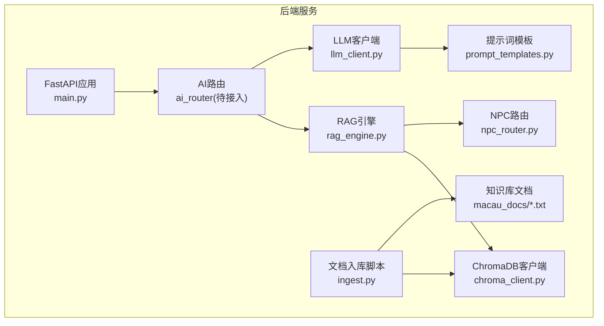
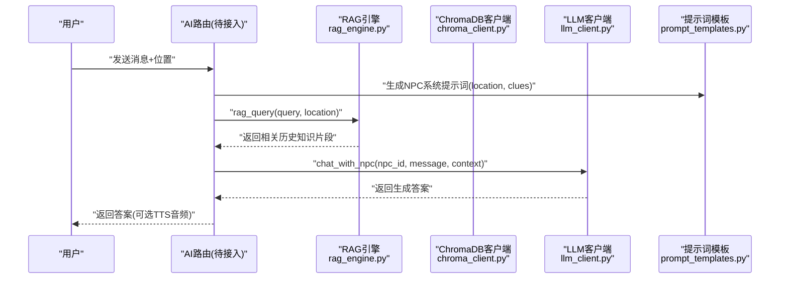
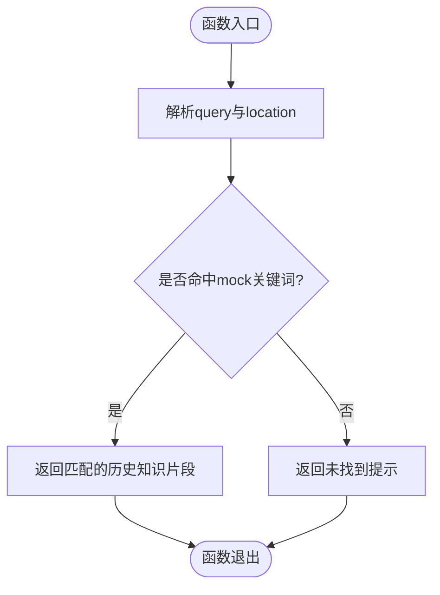
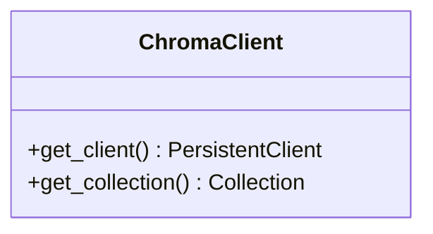
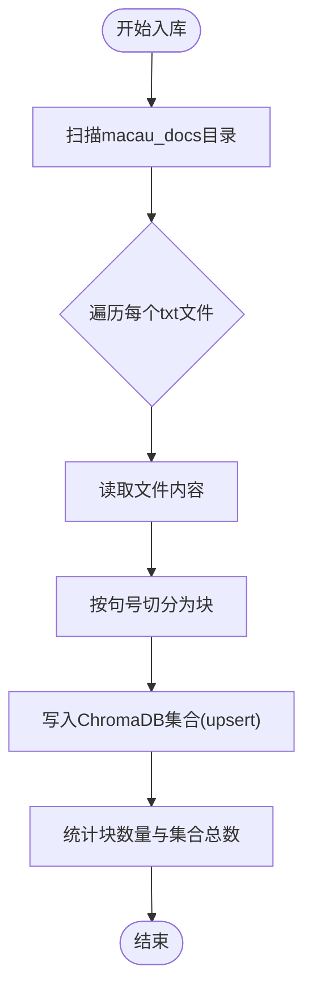
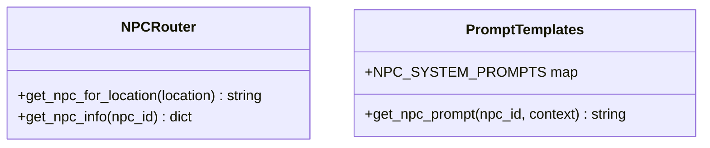
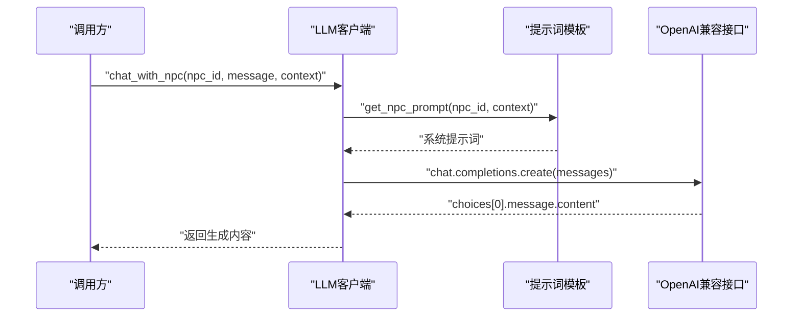
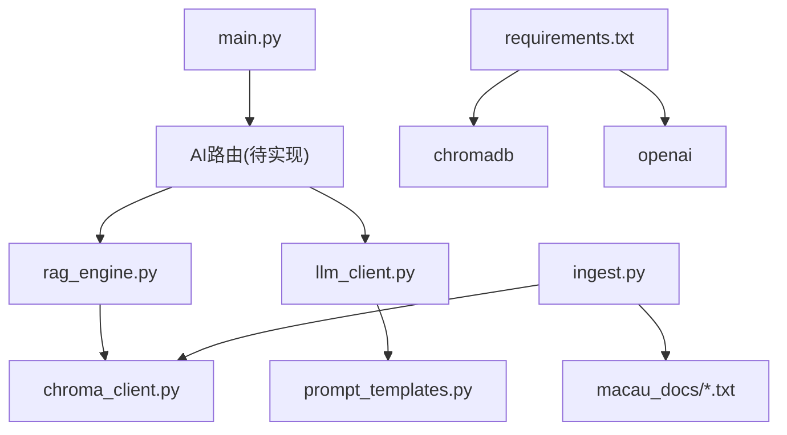

# RAG引擎核心

<cite>
**本文引用的文件**
- [rag_engine.py](file://backend/app/ai/rag_engine.py)
- [chroma_client.py](file://backend/app/knowledge/chroma_client.py)
- [ingest.py](file://backend/app/knowledge/ingest.py)
- [npc_router.py](file://backend/app/ai/npc_router.py)
- [prompt_templates.py](file://backend/app/ai/prompt_templates.py)
- [llm_client.py](file://backend/app/ai/llm_client.py)
- [main.py](file://backend/app/main.py)
- [requirements.txt](file://backend/requirements.txt)
- [README.md](file://README.md)
</cite>

## 目录
1. [简介](#简介)
2. [项目结构](#项目结构)
3. [核心组件](#核心组件)
4. [架构总览](#架构总览)
5. [详细组件分析](#详细组件分析)
6. [依赖关系分析](#依赖关系分析)
7. [性能考量](#性能考量)
8. [故障排查指南](#故障排查指南)
9. [结论](#结论)
10. [附录](#附录)

## 简介
本技术文档围绕“澳秘 Macau Mystery”的RAG（检索增强生成）引擎核心展开，系统阐述查询处理、向量检索与结果融合机制。当前实现采用模拟数据快速验证流程，并预留ChromaDB集成接口；同时结合位置感知的NPC路由与提示词模板，支持基于游戏场景的智能问答。文档还涵盖查询优化策略、相似度计算与排序逻辑的设计建议、性能监控与缓存策略，以及扩展开发指南和具体使用模式，帮助开发者理解并集成RAG功能。

## 项目结构
后端以FastAPI为服务框架，AI能力集中在app/ai目录，RAG知识库位于app/knowledge目录。RAG相关代码包括：
- rag_query：当前为模拟实现的检索函数，按关键词匹配返回历史知识片段
- chroma_client：ChromaDB客户端封装，提供持久化客户端与集合获取
- ingest：文档切分与入库脚本，将macau_docs下的文本按句切块后写入ChromaDB集合
- npc_router与prompt_templates：位置到NPC人设的映射与提示词模板，用于构建上下文
- llm_client：调用DeepSeek模型的异步聊天接口
- main：应用入口，挂载各模块路由与健康检查

**图表来源**
- [main.py:17-111](file://backend/app/main.py#L17-L111)
- [rag_engine.py:1-13](file://backend/app/ai/rag_engine.py#L1-L13)
- [chroma_client.py:1-19](file://backend/app/knowledge/chroma_client.py#L1-L19)
- [ingest.py:1-36](file://backend/app/knowledge/ingest.py#L1-L36)
- [npc_router.py:1-18](file://backend/app/ai/npc_router.py#L1-L18)
- [prompt_templates.py:1-37](file://backend/app/ai/prompt_templates.py#L1-L37)
- [llm_client.py:1-32](file://backend/app/ai/llm_client.py#L1-L32)

**章节来源**
- [main.py:17-111](file://backend/app/main.py#L17-L111)
- [README.md:1-59](file://README.md#L1-L59)

## 核心组件
- 检索增强生成（RAG）引擎：当前通过rag_query进行模拟检索，未来将替换为ChromaDB向量检索
- 向量数据库客户端：chroma_client提供单例化的PersistentClient与集合管理
- 文档入库：ingest将本地txt按句号切分为块，写入ChromaDB集合，附带元数据（来源文件名与块序号）
- NPC路由与提示词：npc_router根据位置选择NPC，prompt_templates生成系统提示词，包含location与clues上下文
- LLM客户端：llm_client封装OpenAI兼容接口，调用DeepSeek模型完成对话生成

**章节来源**
- [rag_engine.py:1-13](file://backend/app/ai/rag_engine.py#L1-L13)
- [chroma_client.py:1-19](file://backend/app/knowledge/chroma_client.py#L1-L19)
- [ingest.py:1-36](file://backend/app/knowledge/ingest.py#L1-L36)
- [npc_router.py:1-18](file://backend/app/ai/npc_router.py#L1-L18)
- [prompt_templates.py:1-37](file://backend/app/ai/prompt_templates.py#L1-L37)
- [llm_client.py:1-32](file://backend/app/ai/llm_client.py#L1-L32)

## 架构总览
RAG工作流概览：
- 用户输入消息与当前位置信息进入AI路由
- AI路由构造NPC系统提示词（含location与clues），调用LLM客户端
- 在生成前或生成过程中，RAG引擎对查询进行检索（当前为模拟匹配，未来为向量检索）
- 检索结果作为上下文注入提示词，提升回答的相关性与准确性
- LLM返回最终答案，可进一步由TTS服务转换为语音（本项目已预留edge-tts依赖）

**图表来源**
- [rag_engine.py:1-13](file://backend/app/ai/rag_engine.py#L1-L13)
- [chroma_client.py:1-19](file://backend/app/knowledge/chroma_client.py#L1-L19)
- [prompt_templates.py:1-37](file://backend/app/ai/prompt_templates.py#L1-L37)
- [llm_client.py:1-32](file://backend/app/ai/llm_client.py#L1-L32)

## 详细组件分析

### RAG引擎（rag_engine.py）
- 当前实现：rag_query接收query与location，基于内置mock字典进行关键词匹配，返回相关历史知识片段；若无匹配则返回默认提示
- 设计要点：
  - 简单高效，便于快速验证流程
  - 可扩展为向量检索：替换mock为ChromaDB查询，按相似度排序并融合结果
- 未来集成点：
  - 与chroma_client对接，执行embedding与相似性搜索
  - 引入重排器（如交叉编码器）提升相关性
  - 增加缓存层（Redis/Memcached）存储高频查询结果

**图表来源**
- [rag_engine.py:1-13](file://backend/app/ai/rag_engine.py#L1-L13)

**章节来源**
- [rag_engine.py:1-13](file://backend/app/ai/rag_engine.py#L1-L13)

### ChromaDB客户端（chroma_client.py）
- 提供单例化的PersistentClient与集合get_or_create_collection
- 集合名称固定为macau_history，元数据描述知识库用途
- 后续可在RAG引擎中调用该集合执行upsert与query操作

**图表来源**
- [chroma_client.py:1-19](file://backend/app/knowledge/chroma_client.py#L1-L19)

**章节来源**
- [chroma_client.py:1-19](file://backend/app/knowledge/chroma_client.py#L1-L19)

### 文档入库（ingest.py）
- 读取macau_docs目录下所有txt文件
- 按句号切分为块（chunk_size=500），避免过长影响检索质量
- 为每个块生成唯一ID（文件名_块序号），并写入元数据（source与chunk）
- 输出统计信息（块数量与集合总数）

**图表来源**
- [ingest.py:1-36](file://backend/app/knowledge/ingest.py#L1-L36)

**章节来源**
- [ingest.py:1-36](file://backend/app/knowledge/ingest.py#L1-L36)

### NPC路由与提示词（npc_router.py, prompt_templates.py）
- npc_router根据location匹配NPC ID，返回对应人设信息（名称、位置、语音）
- prompt_templates定义各NPC的系统提示词模板，包含location与clues占位符
- get_npc_prompt将上下文填充至模板，形成完整的系统提示词

**图表来源**
- [npc_router.py:1-18](file://backend/app/ai/npc_router.py#L1-L18)
- [prompt_templates.py:1-37](file://backend/app/ai/prompt_templates.py#L1-L37)

**章节来源**
- [npc_router.py:1-18](file://backend/app/ai/npc_router.py#L1-L18)
- [prompt_templates.py:1-37](file://backend/app/ai/prompt_templates.py#L1-L37)

### LLM客户端（llm_client.py）
- 封装AsyncOpenAI客户端，配置base_url与model
- chat_with_llm支持system与user消息，返回生成内容
- chat_with_npc辅助函数，结合prompt_templates生成系统提示词并调用LLM

**图表来源**
- [llm_client.py:1-32](file://backend/app/ai/llm_client.py#L1-L32)
- [prompt_templates.py:1-37](file://backend/app/ai/prompt_templates.py#L1-L37)

**章节来源**
- [llm_client.py:1-32](file://backend/app/ai/llm_client.py#L1-L32)

## 依赖关系分析
- FastAPI应用入口main.py挂载AI路由（ai_router），当前未实现具体路由，但预留了/api/v1/ai前缀
- RAG引擎依赖chroma_client进行向量库访问，依赖npc_router与prompt_templates构建上下文
- ingest脚本依赖chroma_client写入集合，读取本地macau_docs文本
- requirements.txt声明chromadb与openai等关键依赖

**图表来源**
- [main.py:17-111](file://backend/app/main.py#L17-L111)
- [rag_engine.py:1-13](file://backend/app/ai/rag_engine.py#L1-L13)
- [chroma_client.py:1-19](file://backend/app/knowledge/chroma_client.py#L1-L19)
- [ingest.py:1-36](file://backend/app/knowledge/ingest.py#L1-L36)
- [requirements.txt:1-17](file://backend/requirements.txt#L1-L17)

**章节来源**
- [main.py:17-111](file://backend/app/main.py#L17-L111)
- [requirements.txt:1-17](file://backend/requirements.txt#L1-L17)

## 性能考量
- 查询优化策略
  - 预索引：对常用地点与关键词建立倒排索引，加速mock匹配阶段
  - 向量检索：引入Embedding模型（如text-embedding-ada-002或中文专用模型），将查询与文档块向量化，使用余弦相似度或内积排序
  - 重排器：对Top-K结果使用交叉编码器进行精细重排，提升相关性
- 缓存策略
  - 查询级缓存：对高频query-location组合缓存结果（TTL可配置）
  - 结果级缓存：对热门NPC对话结果缓存，减少LLM调用频率
- 并发与限流
  - 使用异步IO处理并发请求，限制LLM调用速率以避免配额超限
  - 对ChromaDB查询设置超时与重试机制
- 监控指标
  - 记录查询耗时、召回率、命中率、LLM调用次数与失败率
  - 使用APM工具（如Prometheus+Grafana）可视化关键指标

[本节为通用指导，不直接分析具体文件]

## 故障排查指南
- ChromaDB连接问题
  - 检查persistent client路径是否存在且可写
  - 确认集合名称一致，避免重复创建导致冲突
- 文档入库失败
  - 确保macau_docs目录存在且包含txt文件
  - 检查编码格式（UTF-8）与切分逻辑是否正确
- LLM调用异常
  - 验证环境变量SILICONFLOW_API_KEY与BASE_URL配置正确
  - 捕获并打印异常信息，定位网络或模型错误
- 查询无结果
  - 检查mock关键词覆盖范围，必要时扩展匹配规则
  - 切换至向量检索后，确认embedding模型与查询语义一致性

**章节来源**
- [chroma_client.py:1-19](file://backend/app/knowledge/chroma_client.py#L1-L19)
- [ingest.py:1-36](file://backend/app/knowledge/ingest.py#L1-L36)
- [llm_client.py:1-32](file://backend/app/ai/llm_client.py#L1-L32)

## 结论
当前RAG引擎以模拟数据快速验证检索与生成流程，预留ChromaDB集成接口，具备扩展为完整向量检索系统的条件。结合位置感知的NPC路由与提示词模板，可实现基于场景的智能问答。建议在后续迭代中完善向量检索、重排与缓存机制，并加强性能监控与故障排查能力，以提升系统稳定性与用户体验。

[本节为总结性内容，不直接分析具体文件]

## 附录
- 使用模式示例
  - 调用rag_query(query="妈阁庙", location="妈阁庙")获取历史知识片段
  - 通过npc_router.get_npc_for_location("妈阁庙")获取NPC ID
  - 使用prompt_templates.get_npc_prompt(npc_id, {"location": "妈阁庙", "clues": ["线索A"]})生成系统提示词
  - 调用llm_client.chat_with_npc(npc_id, user_message, context)获得最终回答
- 扩展开发指南
  - 在rag_engine.py中替换mock逻辑为ChromaDB查询，实现embedding与相似度计算
  - 在ingest.py中增加更多文档源与切分策略，优化检索粒度
  - 在main.py中实现AI路由，整合RAG与LLM调用流程

[本节为补充说明，不直接分析具体文件]