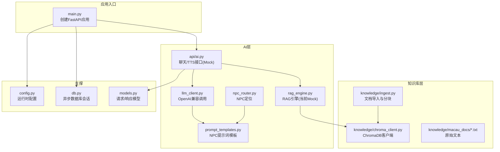
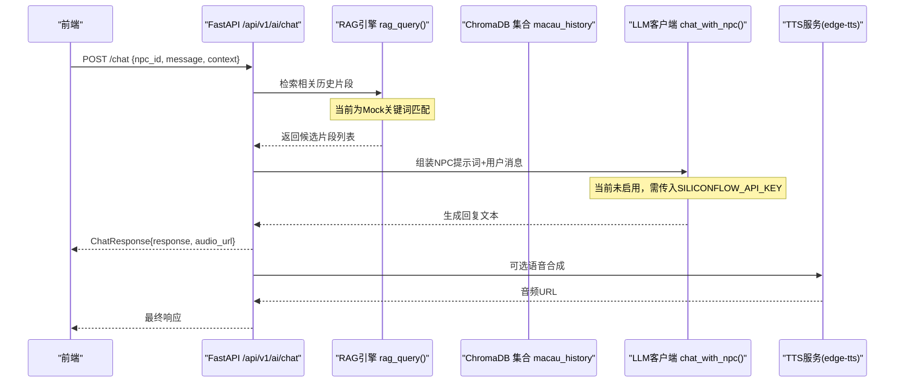
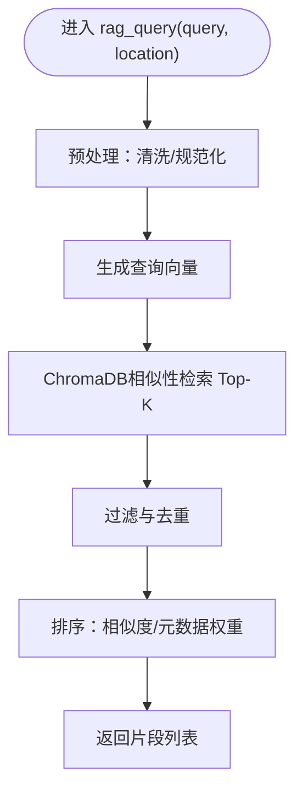
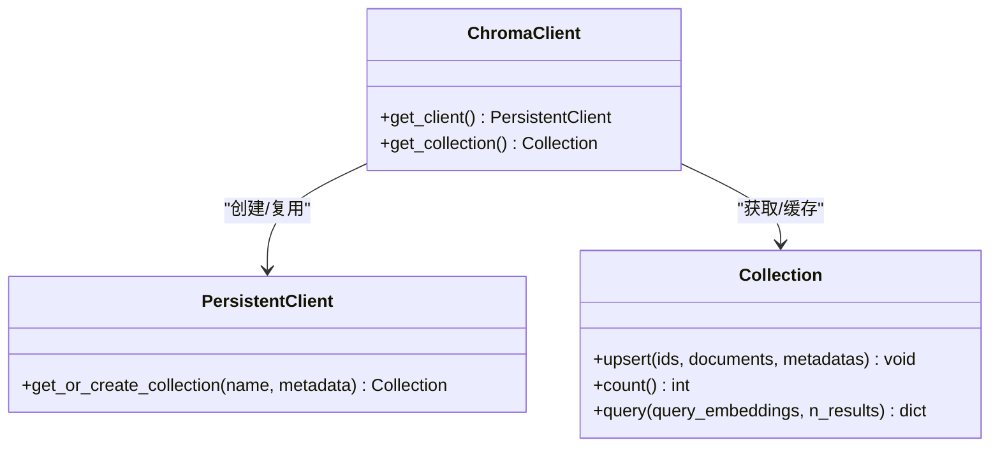
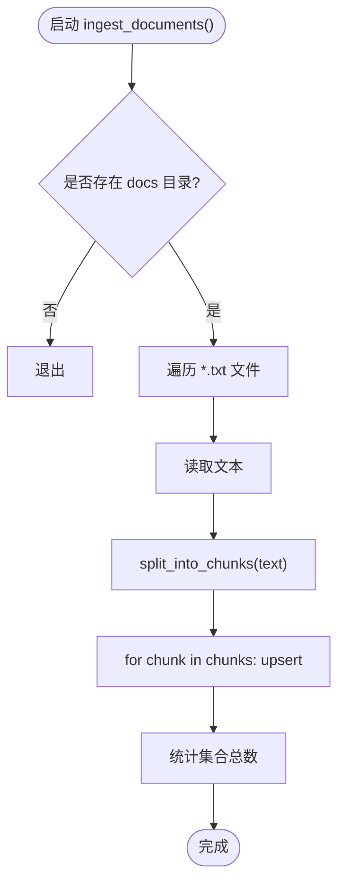
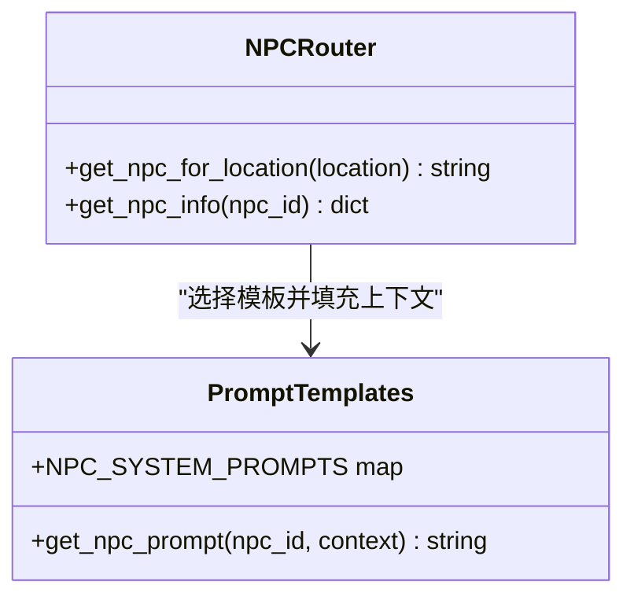
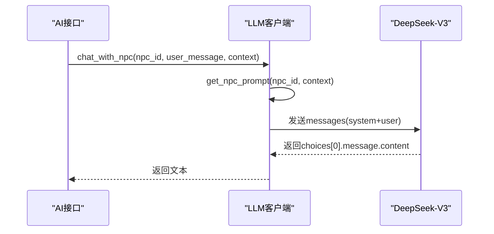
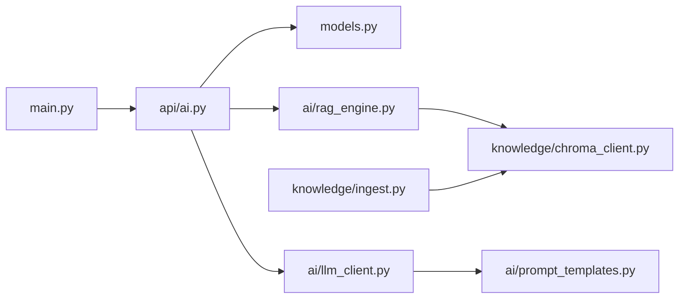

# RAG知识库

<cite>
**本文引用的文件**   
- [backend/app/main.py](file://backend/app/main.py)
- [backend/app/ai/rag_engine.py](file://backend/app/ai/rag_engine.py)
- [backend/app/knowledge/chroma_client.py](file://backend/app/knowledge/chroma_client.py)
- [backend/app/knowledge/ingest.py](file://backend/app/knowledge/ingest.py)
- [backend/app/ai/npc_router.py](file://backend/app/ai/npc_router.py)
- [backend/app/ai/prompt_templates.py](file://backend/app/ai/prompt_templates.py)
- [backend/app/ai/llm_client.py](file://backend/app/ai/llm_client.py)
- [backend/app/api/ai.py](file://backend/app/api/ai.py)
- [backend/app/models.py](file://backend/app/models.py)
- [backend/app/config.py](file://backend/app/config.py)
- [backend/app/db.py](file://backend/app/db.py)
- [backend/requirements.txt](file://backend/requirements.txt)
- [backend/app/knowledge/macau_docs/a_ma_temple.txt](file://backend/app/knowledge/macau_docs/a_ma_temple.txt)
</cite>

## 目录
1. [简介](#简介)
2. [项目结构](#项目结构)
3. [核心组件](#核心组件)
4. [架构总览](#架构总览)
5. [详细组件分析](#详细组件分析)
6. [依赖关系分析](#依赖关系分析)
7. [性能考量](#性能考量)
8. [故障排查指南](#故障排查指南)
9. [结论](#结论)
10. [附录](#附录)

## 简介
本文件为“澳秘 Macau Mystery”RAG知识库的完整架构文档。内容涵盖：
- 检索增强生成（RAG）原理在本项目中的落地方式
- ChromaDB向量数据库集成与语义搜索实现现状
- 文档索引策略、分块算法与嵌入向量生成流程
- 查询优化、相似度计算与结果排序机制
- 知识图谱构建、实体关系提取与上下文理解方案建议
- 文档导入管道、增量更新与版本管理
- 知识库维护指南、性能调优与扩展开发方案

当前代码库已具备ChromaDB客户端与文档导入脚本，但RAG引擎仍为Mock实现，尚未接入向量检索与LLM对话。本文在忠实于现有代码的基础上，给出可落地的演进路线与最佳实践。

## 项目结构
后端采用FastAPI模块化组织，RAG相关能力集中在ai与knowledge两个子模块：
- ai：RAG引擎、NPC路由、提示词模板、LLM客户端、TTS服务（占位）
- knowledge：ChromaDB客户端、文档导入与分块逻辑
- api：对外暴露AI聊天接口（当前为Mock），后续将串联RAG与LLM
- 配置与数据库：统一配置、异步数据库会话与健康检查

**图表来源** 
- [backend/app/main.py:17-111](file://backend/app/main.py#L17-L111)
- [backend/app/ai/rag_engine.py:1-13](file://backend/app/ai/rag_engine.py#L1-L13)
- [backend/app/knowledge/chroma_client.py:1-19](file://backend/app/knowledge/chroma_client.py#L1-L19)
- [backend/app/knowledge/ingest.py:1-36](file://backend/app/knowledge/ingest.py#L1-L36)
- [backend/app/ai/npc_router.py:1-18](file://backend/app/ai/npc_router.py#L1-L18)
- [backend/app/ai/prompt_templates.py:1-37](file://backend/app/ai/prompt_templates.py#L1-L37)
- [backend/app/ai/llm_client.py:1-32](file://backend/app/ai/llm_client.py#L1-L32)
- [backend/app/api/ai.py:1-29](file://backend/app/api/ai.py#L1-L29)
- [backend/app/config.py:1-77](file://backend/app/config.py#L1-L77)
- [backend/app/db.py:1-42](file://backend/app/db.py#L1-L42)
- [backend/app/models.py:1-146](file://backend/app/models.py#L1-L146)

**章节来源**
- [backend/app/main.py:17-111](file://backend/app/main.py#L17-L111)
- [backend/app/ai/rag_engine.py:1-13](file://backend/app/ai/rag_engine.py#L1-L13)
- [backend/app/knowledge/chroma_client.py:1-19](file://backend/app/knowledge/chroma_client.py#L1-L19)
- [backend/app/knowledge/ingest.py:1-36](file://backend/app/knowledge/ingest.py#L1-L36)
- [backend/app/ai/npc_router.py:1-18](file://backend/app/ai/npc_router.py#L1-L18)
- [backend/app/ai/prompt_templates.py:1-37](file://backend/app/ai/prompt_templates.py#L1-L37)
- [backend/app/ai/llm_client.py:1-32](file://backend/app/ai/llm_client.py#L1-L32)
- [backend/app/api/ai.py:1-29](file://backend/app/api/ai.py#L1-L29)
- [backend/app/config.py:1-77](file://backend/app/config.py#L1-L77)
- [backend/app/db.py:1-42](file://backend/app/db.py#L1-L42)
- [backend/app/models.py:1-146](file://backend/app/models.py#L1-L146)

## 核心组件
- FastAPI应用与路由挂载：统一创建应用、注册CORS、异常处理与路由分组
- AI聊天接口：当前返回Mock数据，预留接入LLM与RAG
- RAG引擎：当前为关键词匹配Mock，待替换为ChromaDB语义检索
- ChromaDB客户端：单例持久化客户端与集合获取
- 文档导入：按句号切分中文文本，批量upsert到ChromaDB集合
- NPC路由与提示词：根据地点选择NPC人设并组装系统提示词
- LLM客户端：基于OpenAI兼容接口的异步调用封装
- 配置与数据库：环境变量驱动的配置对象与异步数据库会话

**章节来源**
- [backend/app/main.py:17-111](file://backend/app/main.py#L17-L111)
- [backend/app/api/ai.py:1-29](file://backend/app/api/ai.py#L1-L29)
- [backend/app/ai/rag_engine.py:1-13](file://backend/app/ai/rag_engine.py#L1-L13)
- [backend/app/knowledge/chroma_client.py:1-19](file://backend/app/knowledge/chroma_client.py#L1-L19)
- [backend/app/knowledge/ingest.py:1-36](file://backend/app/knowledge/ingest.py#L1-L36)
- [backend/app/ai/npc_router.py:1-18](file://backend/app/ai/npc_router.py#L1-L18)
- [backend/app/ai/prompt_templates.py:1-37](file://backend/app/ai/prompt_templates.py#L1-L37)
- [backend/app/ai/llm_client.py:1-32](file://backend/app/ai/llm_client.py#L1-L32)
- [backend/app/config.py:1-77](file://backend/app/config.py#L1-L77)
- [backend/app/db.py:1-42](file://backend/app/db.py#L1-L42)

## 架构总览
下图展示从前端到后端的整体交互路径，以及RAG与向量库的集成点。当前AI接口为Mock，RAG引擎未接入ChromaDB，LLM调用也未启用。

**图表来源** 
- [backend/app/api/ai.py:15-21](file://backend/app/api/ai.py#L15-L21)
- [backend/app/ai/rag_engine.py:3-12](file://backend/app/ai/rag_engine.py#L3-L12)
- [backend/app/knowledge/chroma_client.py:7-18](file://backend/app/knowledge/chroma_client.py#L7-L18)
- [backend/app/ai/llm_client.py:12-31](file://backend/app/ai/llm_client.py#L12-L31)
- [backend/app/ai/prompt_templates.py:32-37](file://backend/app/ai/prompt_templates.py#L32-L37)

## 详细组件分析

### RAG引擎（检索增强生成）
- 当前实现：基于关键词匹配的Mock，对query与location进行简单包含判断
- 目标实现：使用ChromaDB进行语义检索，结合嵌入模型生成查询向量，召回Top-K片段，再交给LLM生成回答
- 关键改进点：
  - 引入嵌入模型（如本地或云端Embedding API）
  - 查询预处理（清洗、分词、去停用词）
  - 相似度检索（余弦相似度）与重排（可选交叉编码器）
  - 结果过滤与去重，控制返回片段数量与长度

**图表来源** 
- [backend/app/ai/rag_engine.py:3-12](file://backend/app/ai/rag_engine.py#L3-L12)

**章节来源**
- [backend/app/ai/rag_engine.py:1-13](file://backend/app/ai/rag_engine.py#L1-L13)

### ChromaDB客户端
- 职责：提供单例持久化客户端与集合访问
- 集合名：macau_history，附带描述元数据
- 使用方式：通过get_collection()获取集合实例，供导入与检索使用

**图表来源** 
- [backend/app/knowledge/chroma_client.py:7-18](file://backend/app/knowledge/chroma_client.py#L7-L18)

**章节来源**
- [backend/app/knowledge/chroma_client.py:1-19](file://backend/app/knowledge/chroma_client.py#L1-L19)

### 文档导入与分块
- 分块策略：按中文句号“。”切分，累积至chunk_size阈值后输出一个片段
- 导入流程：遍历macau_docs下的所有.txt文件，读取文本→分块→逐块upsert到ChromaDB集合
- 元数据：source（文件名）、chunk（片段序号），便于溯源与分页

**图表来源** 
- [backend/app/knowledge/ingest.py:6-32](file://backend/app/knowledge/ingest.py#L6-L32)

**章节来源**
- [backend/app/knowledge/ingest.py:1-36](file://backend/app/knowledge/ingest.py#L1-L36)
- [backend/app/knowledge/macau_docs/a_ma_temple.txt:1-7](file://backend/app/knowledge/macau_docs/a_ma_temple.txt#L1-L7)

### NPC路由与提示词模板
- NPC路由：根据location映射到具体NPC ID，用于选择对应人设
- 提示词模板：为每个NPC定义系统提示词，支持注入location与clues等上下文变量
- 用途：在LLM对话时，作为system prompt的一部分，确保角色一致性与场景感

**图表来源** 
- [backend/app/ai/npc_router.py:10-17](file://backend/app/ai/npc_router.py#L10-L17)
- [backend/app/ai/prompt_templates.py:32-37](file://backend/app/ai/prompt_templates.py#L32-L37)

**章节来源**
- [backend/app/ai/npc_router.py:1-18](file://backend/app/ai/npc_router.py#L1-L18)
- [backend/app/ai/prompt_templates.py:1-37](file://backend/app/ai/prompt_templates.py#L1-L37)

### LLM客户端
- 功能：封装OpenAI兼容接口的异步聊天调用，支持temperature与max_tokens参数
- 错误处理：捕获异常并返回友好错误信息
- 待完善：与RAG引擎联动，将检索到的片段作为上下文注入system prompt

**图表来源** 
- [backend/app/ai/llm_client.py:12-31](file://backend/app/ai/llm_client.py#L12-L31)
- [backend/app/ai/prompt_templates.py:32-37](file://backend/app/ai/prompt_templates.py#L32-L37)

**章节来源**
- [backend/app/ai/llm_client.py:1-32](file://backend/app/ai/llm_client.py#L1-L32)

### AI接口（当前Mock）
- 路由：/api/v1/ai/chat 与 /api/v1/ai/tts
- 行为：返回预设NPC台词与空音频URL，预留接入LLM与TTS
- 下一步：接入RAG引擎与LLM客户端，形成端到端对话链路

**章节来源**
- [backend/app/api/ai.py:1-29](file://backend/app/api/ai.py#L1-L29)
- [backend/app/models.py:95-108](file://backend/app/models.py#L95-L108)

## 依赖关系分析
- 外部依赖：chromadb、openai、edge-tts等通过requirements.txt声明
- 内部耦合：
  - main.py聚合路由与中间件
  - api/ai.py依赖models.py的请求/响应模型
  - rag_engine.py待依赖chroma_client.py与llm_client.py
  - ingest.py依赖chroma_client.py进行写入
  - npc_router.py与prompt_templates.py共同决定NPC对话风格

**图表来源** 
- [backend/app/main.py:84-96](file://backend/app/main.py#L84-L96)
- [backend/app/api/ai.py:1-29](file://backend/app/api/ai.py#L1-L29)
- [backend/app/ai/rag_engine.py:1-13](file://backend/app/ai/rag_engine.py#L1-L13)
- [backend/app/knowledge/chroma_client.py:1-19](file://backend/app/knowledge/chroma_client.py#L1-L19)
- [backend/app/ai/llm_client.py:1-32](file://backend/app/ai/llm_client.py#L1-L32)
- [backend/app/ai/prompt_templates.py:1-37](file://backend/app/ai/prompt_templates.py#L1-L37)
- [backend/app/knowledge/ingest.py:1-36](file://backend/app/knowledge/ingest.py#L1-L36)

**章节来源**
- [backend/requirements.txt:1-17](file://backend/requirements.txt#L1-L17)

## 性能考量
- 向量检索
  - 合理设置Top-K与相似度阈值，避免过多无关片段影响生成质量
  - 对查询进行归一化与去噪，提升嵌入质量
  - 考虑使用混合检索（关键词+向量）提升召回率
- 分块策略
  - 当前按句号切分适合短文本；长文档建议引入段落/标题边界与重叠窗口
  - 控制chunk_size与重叠比例，平衡上下文完整性与检索精度
- LLM调用
  - 设置合适的temperature与max_tokens，控制输出长度与创造性
  - 增加重试与超时机制，提高鲁棒性
- ChromaDB
  - 使用持久化客户端减少冷启动开销
  - 定期重建索引与清理过期数据，保持集合健康

[本节为通用指导，不直接分析具体文件]

## 故障排查指南
- 健康检查失败
  - 现象：/api/v1/health返回degraded
  - 原因：数据库不可用或未迁移
  - 处理：执行alembic升级并确保DATABASE_URL正确
- 导入失败
  - 现象：ingest_documents无输出或报错
  - 原因：docs目录不存在或权限问题
  - 处理：确认DOCS_DIR路径与文件编码UTF-8
- 向量库连接异常
  - 现象：ChromaDB初始化失败
  - 原因：路径./chroma_db不可写或磁盘空间不足
  - 处理：检查目录权限与存储空间
- LLM调用失败
  - 现象：返回“模型调用失败”
  - 原因：缺少SILICONFLOW_API_KEY或网络异常
  - 处理：配置环境变量并检查网络连通性

**章节来源**
- [backend/app/main.py:98-105](file://backend/app/main.py#L98-L105)
- [backend/app/db.py:35-42](file://backend/app/db.py#L35-L42)
- [backend/app/knowledge/ingest.py:17-32](file://backend/app/knowledge/ingest.py#L17-L32)
- [backend/app/knowledge/chroma_client.py:7-18](file://backend/app/knowledge/chroma_client.py#L7-L18)
- [backend/app/ai/llm_client.py:12-25](file://backend/app/ai/llm_client.py#L12-L25)

## 结论
本项目已搭建起RAG知识库的基础骨架：FastAPI应用、ChromaDB客户端与文档导入脚本。当前RAG引擎与AI接口仍为Mock状态，尚未实现语义检索与LLM对话闭环。建议在以下方面优先推进：
- 实现rag_query以对接ChromaDB，完成查询向量化与相似度检索
- 打通AI接口与LLM客户端，注入RAG上下文生成高质量回答
- 优化分块策略与元数据设计，提升检索准确性与可追溯性
- 建立增量更新与版本管理机制，保障知识库持续演进

[本节为总结性内容，不直接分析具体文件]

## 附录

### 知识图谱构建与实体关系提取（建议）
- 实体抽取：从doc中识别地名、人物、时间、事件等实体
- 关系抽取：构建“地点-历史-人物”三元组，形成结构化知识
- 存储与可视化：将图谱存入图数据库或JSON，并在前端可视化展示
- 与RAG融合：将图谱摘要作为额外上下文注入LLM，增强推理能力

[本节为概念性内容，不直接分析具体文件]

### 文档导入管道与版本管理（建议）
- 增量更新：基于source与chunk字段进行幂等upsert，避免重复
- 版本管理：为每次导入生成版本号，支持回滚与对比
- 校验机制：导入前校验文本编码与格式，失败则跳过并记录日志

[本节为概念性内容，不直接分析具体文件]

### 查询优化与结果排序（建议）
- 查询预处理：去除噪声、标准化标点与大小写
- 相似度计算：默认余弦相似度，必要时引入重排模型
- 排序策略：综合相似度、元数据权重（如source重要性）与时间衰减

[本节为概念性内容，不直接分析具体文件]