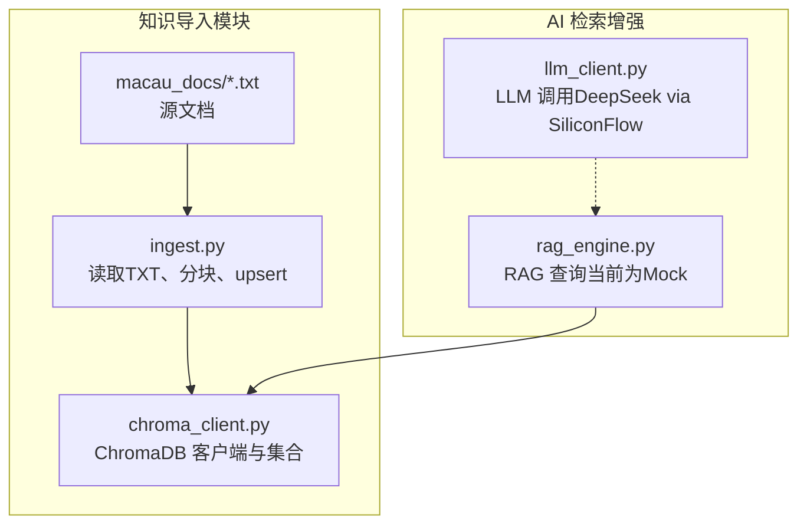
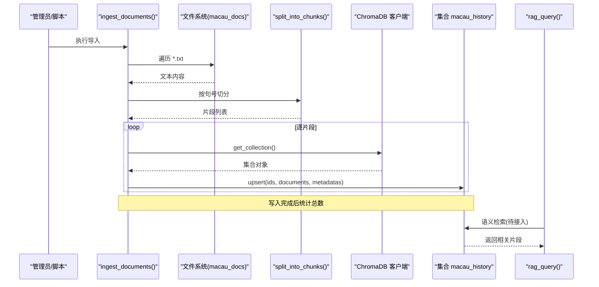
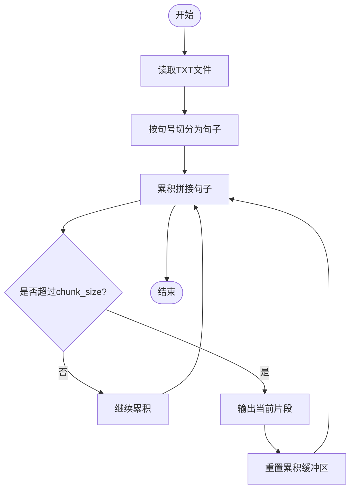
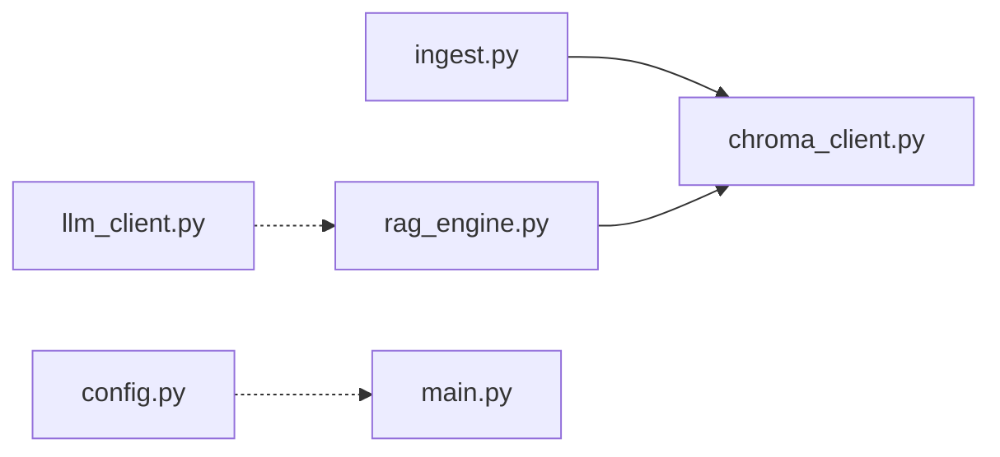

# 文档导入管道

<cite>
**本文引用的文件**   
- [ingest.py](file://backend/app/knowledge/ingest.py)
- [chroma_client.py](file://backend/app/knowledge/chroma_client.py)
- [rag_engine.py](file://backend/app/ai/rag_engine.py)
- [llm_client.py](file://backend/app/ai/llm_client.py)
- [config.py](file://backend/app/config.py)
- [main.py](file://backend/app/main.py)
- [game_errors.py](file://backend/app/game_errors.py)
- [db_models.py](file://backend/app/db_models.py)
- [requirements.txt](file://backend/requirements.txt)
- [a_ma_temple.txt](file://backend/app/knowledge/macau_docs/a_ma_temple.txt)
</cite>

## 目录
1. [简介](#简介)
2. [项目结构](#项目结构)
3. [核心组件](#核心组件)
4. [架构总览](#架构总览)
5. [详细组件分析](#详细组件分析)
6. [依赖关系分析](#依赖关系分析)
7. [性能考量](#性能考量)
8. [故障排查指南](#故障排查指南)
9. [结论](#结论)
10. [附录](#附录)

## 简介
本技术文档围绕“澳秘 Macau Mystery”的文档导入管道，系统性阐述从本地文本到向量知识库（ChromaDB）的完整处理链路。内容覆盖：
- 文档预处理流程：文本清洗、格式转换与分块策略
- 嵌入向量生成：模型选择、参数配置与批量处理
- 增量更新机制、版本控制与冲突解决
- 元数据管理、标签系统与分类机制
- 错误处理、重试逻辑与日志记录
- 澳门历史文档的特殊规则：多语言支持与特殊字符处理
- 与 ChromaDB 的数据同步机制与一致性保证
- 性能优化建议与大规模数据处理方案

## 项目结构
与文档导入相关的关键代码位于 backend/app/knowledge 目录下，包含：
- ingest.py：负责读取 .txt 文档、中文分句切块、写入 ChromaDB
- chroma_client.py：封装 ChromaDB 客户端与集合获取
- macau_docs/*.txt：示例澳门历史文档（如妈阁庙等）

图表来源
- [ingest.py:1-36](file://backend/app/knowledge/ingest.py#L1-L36)
- [chroma_client.py:1-19](file://backend/app/knowledge/chroma_client.py#L1-L19)
- [rag_engine.py:1-13](file://backend/app/ai/rag_engine.py#L1-L13)
- [llm_client.py:1-32](file://backend/app/ai/llm_client.py#L1-L32)

章节来源
- [ingest.py:1-36](file://backend/app/knowledge/ingest.py#L1-L36)
- [chroma_client.py:1-19](file://backend/app/knowledge/chroma_client.py#L1-L19)

## 核心组件
- 文档读取与分块
  - 按句号“。”进行句子级切分，累计长度不超过 chunk_size（默认 500），形成多个片段
  - 每个片段保留原始来源文件名与片段序号作为元数据
- ChromaDB 客户端
  - 使用 PersistentClient 持久化至 ./chroma_db
  - 集合名称固定为 macau_history，附带描述性 metadata
- RAG 引擎（当前为 Mock）
  - 提供 rag_query(query, location) 返回匹配的历史知识片段
  - 后续将接入 ChromaDB 实现语义检索
- LLM 客户端
  - 通过 OpenAI 兼容接口调用 DeepSeek（SiliconFlow）
  - 支持 temperature、max_tokens 等参数

章节来源
- [ingest.py:6-32](file://backend/app/knowledge/ingest.py#L6-L32)
- [chroma_client.py:7-18](file://backend/app/knowledge/chroma_client.py#L7-L18)
- [rag_engine.py:3-12](file://backend/app/ai/rag_engine.py#L3-L12)
- [llm_client.py:5-25](file://backend/app/ai/llm_client.py#L5-L25)

## 架构总览
下图展示从本地文档到向量库再到检索增强的整体流程。

图表来源
- [ingest.py:17-32](file://backend/app/knowledge/ingest.py#L17-L32)
- [chroma_client.py:13-18](file://backend/app/knowledge/chroma_client.py#L13-L18)
- [rag_engine.py:3-12](file://backend/app/ai/rag_engine.py#L3-L12)

## 详细组件分析

### 文档预处理与分块策略
- 文本清洗
  - 当前实现直接读取 UTF-8 文本，未做额外清洗；建议在入库前统一去除多余空白、不可见字符与乱码
- 分块算法
  - 以“。”为边界进行句子拼接，当累计长度超过 chunk_size 时截断为新片段
  - 优点：保持中文语义完整性；缺点：对长段落可能产生较大片段
- 元数据设计
  - source：来源文件名（便于溯源）
  - chunk：片段序号（便于定位与去重）
- 可扩展点
  - 增加标题、摘要、作者、发布时间等字段
  - 引入段落级或语义级分块（如基于标点+语义分割器）

图表来源
- [ingest.py:6-15](file://backend/app/knowledge/ingest.py#L6-L15)

章节来源
- [ingest.py:6-32](file://backend/app/knowledge/ingest.py#L6-L32)

### 嵌入向量生成与批量处理
- 现状
  - 当前 ingester 仅写入 documents 与 metadatas，未显式调用 embedding 函数；ChromaDB 在 upsert 时若未指定 embedding 函数，将依赖其内置默认策略
- 模型选择
  - 建议使用支持中文的多语言嵌入模型（如 bge-m3、text-embedding-ada-002 等）
- 参数配置
  - batch_size：根据内存与网络情况设置（建议 32~128）
  - normalize：开启归一化提升相似度质量
  - timeout/retry：针对外部 API 的超时与重试策略
- 批量处理
  - 将同一文件的多个片段合并为批次 upsert，减少往返开销
  - 失败重试：指数退避 + 最大重试次数

章节来源
- [ingest.py:28-32](file://backend/app/knowledge/ingest.py#L28-L32)
- [chroma_client.py:13-18](file://backend/app/knowledge/chroma_client.py#L13-L18)

### 增量更新机制、版本控制与冲突解决
- 增量更新
  - 基于 ids 幂等 upsert：相同 id 的片段会被覆盖，避免重复插入
  - 建议引入 content_hash（片段内容哈希）用于变更检测，仅更新差异片段
- 版本控制
  - 可为每批导入生成 run_id，并在元数据中记录；支持回滚与对比
- 冲突解决
  - 当同一片段被多次导入时，采用“最新覆盖”策略；如需保留历史，可引入 versioned_ids

章节来源
- [ingest.py:28-32](file://backend/app/knowledge/ingest.py#L28-L32)

### 元数据管理、标签系统与分类机制
- 现有元数据
  - source：来源文件
  - chunk：片段序号
- 扩展建议
  - 标签：地点（如“妈阁庙”）、时代（如“明代”）、主题（如“文化遗产”）
  - 分类：按景点、历史时期、语种（中文/葡文/英文）
  - 质量：人工审核标记、可信度评分

章节来源
- [ingest.py:28-32](file://backend/app/knowledge/ingest.py#L28-L32)

### 错误处理、重试逻辑与日志记录
- 当前行为
  - 打印日志（print），无结构化日志；异常捕获有限
- 改进建议
  - 使用 Python logging 模块，分级输出（INFO/WARN/ERROR）
  - 对 IO、网络、向量库操作添加 try/except 与重试
  - 失败片段隔离并记录失败原因，支持后续重试

章节来源
- [ingest.py:20-32](file://backend/app/knowledge/ingest.py#L20-L32)

### 澳门历史文档的特殊规则
- 多语言支持
  - 文档含中文、葡文音译（如“Macau”）；确保编码为 UTF-8，分块不破坏跨语言语义
- 特殊字符处理
  - 保留引号、数字、专有名词；必要时对非 ASCII 字符进行规范化（NFC/NFKC）
- 地名与实体识别
  - 可在元数据中注入实体标签（如“妈阁庙”“联合国教科文组织”）

章节来源
- [a_ma_temple.txt:1-7](file://backend/app/knowledge/macau_docs/a_ma_temple.txt#L1-L7)

### 与 ChromaDB 的数据同步与一致性
- 客户端与集合
  - 使用 PersistentClient 持久化至 ./chroma_db
  - 集合名 macau_history，附带描述性 metadata
- 一致性保障
  - 事务性 upsert：单个批次内原子写入
  - 幂等 id：相同 id 覆盖更新，避免重复
  - 校验：导入后 count() 核对数量

章节来源
- [chroma_client.py:7-18](file://backend/app/knowledge/chroma_client.py#L7-L18)
- [ingest.py:28-32](file://backend/app/knowledge/ingest.py#L28-L32)

## 依赖关系分析
- 运行时依赖
  - fastapi、uvicorn、sqlalchemy、openai、chromadb 等
- 模块耦合
  - ingest 依赖 chroma_client；rag_engine 预留对接 ChromaDB
  - llm_client 独立，供 AI 能力扩展

图表来源
- [ingest.py:1-36](file://backend/app/knowledge/ingest.py#L1-L36)
- [chroma_client.py:1-19](file://backend/app/knowledge/chroma_client.py#L1-L19)
- [rag_engine.py:1-13](file://backend/app/ai/rag_engine.py#L1-L13)
- [llm_client.py:1-32](file://backend/app/ai/llm_client.py#L1-L32)
- [config.py:1-77](file://backend/app/config.py#L1-L77)
- [main.py:1-111](file://backend/app/main.py#L1-L111)

章节来源
- [requirements.txt:1-16](file://backend/requirements.txt#L1-L16)

## 性能考量
- 分块策略
  - 调整 chunk_size 平衡检索精度与召回范围（建议 300~800）
- 批量写入
  - 合并同文件片段为批次 upsert，降低网络与序列化开销
- 索引与查询
  - 合理设置 top_k、score_threshold；对热点查询启用缓存
- 资源限制
  - 控制并发写入线程数，避免内存峰值过高
- 监控与度量
  - 记录导入耗时、失败率、平均片段大小、集合总量

[本节为通用指导，无需特定文件引用]

## 故障排查指南
- 常见问题
  - 文档目录不存在：检查 DOCS_DIR 路径与权限
  - 编码问题：确认 UTF-8 编码，避免 BOM 头
  - ChromaDB 连接失败：检查 ./chroma_db 目录权限与磁盘空间
  - 重复条目：检查 ids 唯一性，必要时引入 content_hash
- 诊断步骤
  - 查看 print 日志输出，逐步定位失败阶段
  - 验证集合 count() 与预期一致
  - 抽样检索验证相关性

章节来源
- [ingest.py:20-32](file://backend/app/knowledge/ingest.py#L20-L32)
- [chroma_client.py:7-18](file://backend/app/knowledge/chroma_client.py#L7-L18)

## 结论
当前导入管道实现了基础的“读取-分块-写入”流程，具备可扩展性。下一步重点包括：
- 完善嵌入模型与批量处理
- 引入结构化日志与健壮的重试机制
- 增强元数据与标签体系，支撑精细化检索
- 建立增量更新与版本控制，保障数据一致性
- 结合 RAG 与 LLM 构建完整的问答与推理能力

[本节为总结性内容，无需特定文件引用]

## 附录
- 环境变量与配置
  - APP_ENV、DATABASE_URL、AUTH_TOKEN_TTL_HOURS 等由 config.py 管理
- 数据库模型
  - db_models.py 定义了故事、会话、事件等持久化结构，可用于未来与导入管道的关联
- 错误模型
  - game_errors.py 定义统一的业务错误结构，便于前端解析

章节来源
- [config.py:38-77](file://backend/app/config.py#L38-L77)
- [db_models.py:24-160](file://backend/app/db_models.py#L24-L160)
- [game_errors.py:7-20](file://backend/app/game_errors.py#L7-L20)