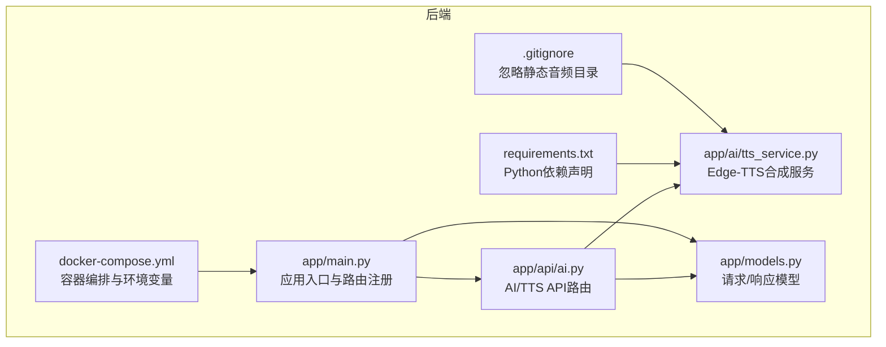
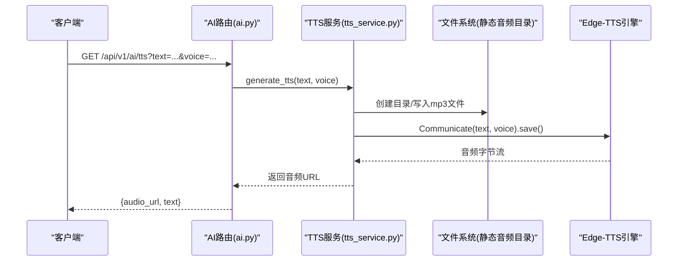
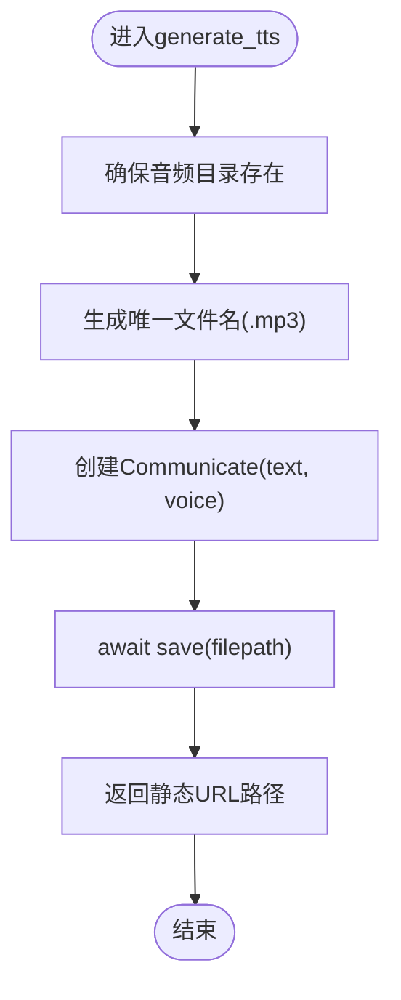
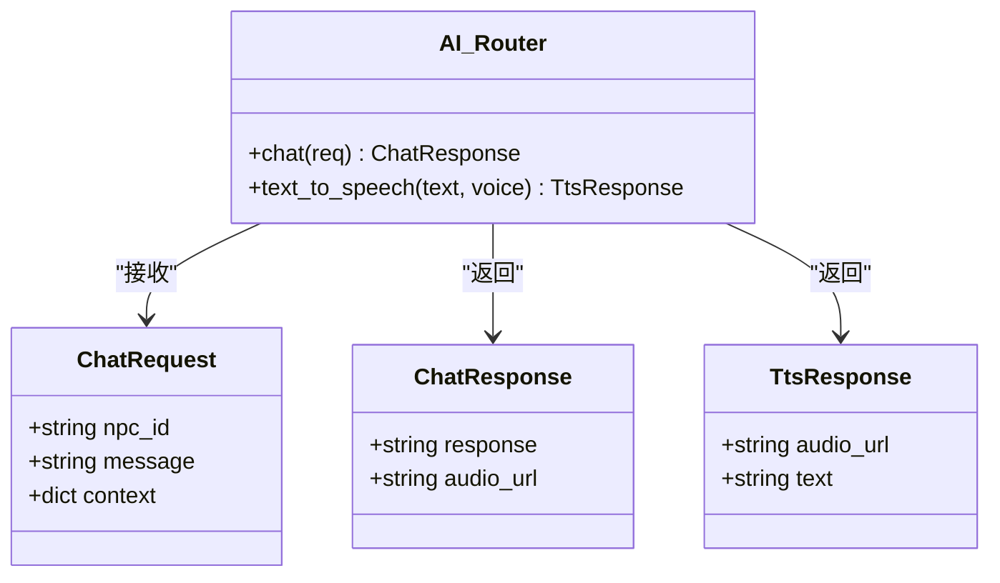
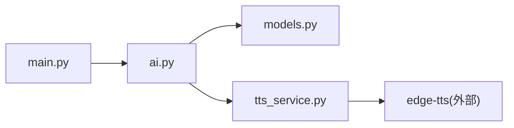

# TTS语音服务

<cite>
**本文引用的文件**   
- [tts_service.py](file://backend/app/ai/tts_service.py)
- [ai.py](file://backend/app/api/ai.py)
- [models.py](file://backend/app/models.py)
- [main.py](file://backend/app/main.py)
- [requirements.txt](file://backend/requirements.txt)
- [docker-compose.yml](file://docker-compose.yml)
- [.gitignore](file://.gitignore)
</cite>

## 目录
1. [简介](#简介)
2. [项目结构](#项目结构)
3. [核心组件](#核心组件)
4. [架构总览](#架构总览)
5. [详细组件分析](#详细组件分析)
6. [依赖关系分析](#依赖关系分析)
7. [性能与成本优化](#性能与成本优化)
8. [故障排除指南](#故障排除指南)
9. [结论](#结论)
10. [附录：API接口文档与使用示例](#附录api接口文档与使用示例)

## 简介
本技术文档围绕“澳秘 Macau Mystery”项目的TTS语音服务展开，重点说明Edge-TTS集成、文本转语音流程、音频格式与存储、配置与音质参数、方言语音支持、缓存与流式传输优化、错误处理与降级策略，以及质量评估、性能监控与成本控制。同时提供完整的API接口说明、使用示例和常见问题排查方法，帮助开发者快速接入并稳定运行TTS能力。

## 项目结构
后端采用FastAPI框架，TTS相关代码集中在AI模块中，通过API路由对外暴露接口；模型定义位于统一的数据模型文件中；应用入口负责注册路由、中间件与异常处理；依赖管理由requirements.txt声明；容器编排由docker-compose.yml完成。

图表来源
- [main.py:17-107](file://backend/app/main.py#L17-L107)
- [ai.py:1-29](file://backend/app/api/ai.py#L1-L29)
- [tts_service.py:1-25](file://backend/app/ai/tts_service.py#L1-L25)
- [models.py:95-109](file://backend/app/models.py#L95-L109)
- [requirements.txt:10](file://backend/requirements.txt#L10)
- [docker-compose.yml:1-21](file://docker-compose.yml#L1-L21)
- [.gitignore:29](file://.gitignore#L29)

章节来源
- [main.py:17-107](file://backend/app/main.py#L17-L107)
- [ai.py:1-29](file://backend/app/api/ai.py#L1-L29)
- [tts_service.py:1-25](file://backend/app/ai/tts_service.py#L1-L25)
- [models.py:95-109](file://backend/app/models.py#L95-L109)
- [requirements.txt:10](file://backend/requirements.txt#L10)
- [docker-compose.yml:1-21](file://docker-compose.yml#L1-L21)
- [.gitignore:29](file://.gitignore#L29)

## 核心组件
- Edge-TTS服务（tts_service.py）
  - 提供异步文本转语音生成函数，基于edge-tts库将文本合成为MP3音频文件，落盘至静态资源目录，返回可访问的URL路径。
  - 维护NPC到语音角色的映射，便于不同角色使用不同音色。
- AI API路由（ai.py）
  - 暴露聊天与TTS接口。当前TTS接口为占位实现，预留接入Edge-TTS的位置。
- 数据模型（models.py）
  - 定义ChatRequest、ChatResponse、TtsResponse等Pydantic模型，用于请求校验与响应序列化。
- 应用入口（main.py）
  - 注册各子路由、CORS中间件、全局异常处理器与健康检查端点。
- 依赖与环境（requirements.txt、docker-compose.yml、.gitignore）
  - 声明edge-tts依赖；容器化部署时暴露端口、挂载数据卷；忽略生成的音频文件以避免污染仓库。

章节来源
- [tts_service.py:1-25](file://backend/app/ai/tts_service.py#L1-L25)
- [ai.py:1-29](file://backend/app/api/ai.py#L1-L29)
- [models.py:95-109](file://backend/app/models.py#L95-L109)
- [main.py:17-107](file://backend/app/main.py#L17-L107)
- [requirements.txt:10](file://backend/requirements.txt#L10)
- [docker-compose.yml:1-21](file://docker-compose.yml#L1-L21)
- [.gitignore:29](file://.gitignore#L29)

## 架构总览
TTS调用链路从前端发起HTTP请求到后端AI路由，再由路由调用TTS服务进行音频合成，最终返回音频文件的静态访问地址。后续可扩展为流式传输或缓存命中路径以提升性能。

图表来源
- [ai.py:24-29](file://backend/app/api/ai.py#L24-L29)
- [tts_service.py:14-20](file://backend/app/ai/tts_service.py#L14-L20)

章节来源
- [ai.py:24-29](file://backend/app/api/ai.py#L24-L29)
- [tts_service.py:14-20](file://backend/app/ai/tts_service.py#L14-L20)

## 详细组件分析

### Edge-TTS服务（tts_service.py）
- 功能要点
  - 异步生成MP3音频文件，文件名包含随机标识避免冲突。
  - 自动确保静态音频目录存在。
  - 返回相对URL路径供静态资源服务访问。
  - NPC音色映射表，便于按角色选择合适语音。
- 数据结构与复杂度
  - VOICE_OPTIONS为字典映射，查找时间复杂度O(1)。
  - 文件I/O为阻塞型操作，但通过asyncio事件循环并发执行多个请求时可提升吞吐。
- 依赖链
  - edge_tts.Communicate用于合成音频。
  - os.makedirs用于目录初始化。
  - uuid生成唯一文件名。
- 优化建议
  - 引入内存/磁盘缓存（如Redis或本地文件哈希），对相同文本+音色组合直接返回已有音频URL。
  - 增加并发限制与队列，防止瞬时高并发导致磁盘IO瓶颈。
  - 可选流式输出（边合成边推送），减少首包延迟。

图表来源
- [tts_service.py:14-20](file://backend/app/ai/tts_service.py#L14-L20)

章节来源
- [tts_service.py:1-25](file://backend/app/ai/tts_service.py#L1-L25)

### AI API路由（ai.py）
- 功能要点
  - 提供聊天与TTS两个接口。TTS接口当前为Mock实现，预留接入Edge-TTS的代码位置。
  - 响应模型遵循TtsResponse，包含audio_url与text字段。
- 扩展点
  - 在GET /api/v1/ai/tts中替换Mock逻辑为调用tts_service.generate_tts。
  - 可增加参数校验、限流、鉴权与审计日志。

图表来源
- [models.py:95-109](file://backend/app/models.py#L95-L109)
- [ai.py:15-29](file://backend/app/api/ai.py#L15-L29)

章节来源
- [ai.py:1-29](file://backend/app/api/ai.py#L1-L29)
- [models.py:95-109](file://backend/app/models.py#L95-L109)

### 数据模型（models.py）
- 关键模型
  - ChatRequest/ChatResponse：用于AI对话交互。
  - TtsResponse：用于TTS结果返回，包含音频URL与原始文本。
- 作用
  - 统一前后端数据结构，便于类型校验与序列化。

章节来源
- [models.py:95-109](file://backend/app/models.py#L95-L109)

### 应用入口（main.py）
- 功能要点
  - 注册各子路由（包括AI路由）。
  - 配置CORS中间件，允许跨域访问。
  - 自定义异常处理器，统一错误响应格式。
  - 健康检查端点用于服务可用性探测。
- 与TTS的关系
  - 通过include_router将AI路由挂载到/api/v1/ai前缀下，使TTS接口对外可用。

章节来源
- [main.py:17-107](file://backend/app/main.py#L17-L107)

### 依赖与环境（requirements.txt、docker-compose.yml、.gitignore）
- requirements.txt
  - 声明edge-tts版本，确保运行时可用。
- docker-compose.yml
  - 启动后端服务，暴露端口8000，设置数据库与运行环境。
  - 可通过环境变量注入TTS相关配置（如默认音色、超时、重试次数等）。
- .gitignore
  - 忽略backend/app/static/audio目录，避免将生成的音频文件提交到仓库。

章节来源
- [requirements.txt:10](file://backend/requirements.txt#L10)
- [docker-compose.yml:1-21](file://docker-compose.yml#L1-L21)
- [.gitignore:29](file://.gitignore#L29)

## 依赖关系分析
- 外部依赖
  - edge-tts：文本转语音核心库，提供异步合成能力。
- 内部依赖
  - ai.py依赖models.py中的TtsResponse。
  - tts_service.py被ai.py调用（待接入）。
  - main.py聚合所有路由，包括AI路由。

图表来源
- [main.py:84-96](file://backend/app/main.py#L84-L96)
- [ai.py:1-29](file://backend/app/api/ai.py#L1-L29)
- [tts_service.py:1-25](file://backend/app/ai/tts_service.py#L1-L25)
- [requirements.txt:10](file://backend/requirements.txt#L10)

章节来源
- [main.py:84-96](file://backend/app/main.py#L84-L96)
- [ai.py:1-29](file://backend/app/api/ai.py#L1-L29)
- [tts_service.py:1-25](file://backend/app/ai/tts_service.py#L1-L25)
- [requirements.txt:10](file://backend/requirements.txt#L10)

## 性能与成本优化
- 缓存策略
  - 文本+音色作为键，缓存已生成的音频URL，避免重复合成。
  - 可使用Redis或本地文件哈希表，结合过期策略控制空间占用。
- 流式传输
  - 使用edge-tts的流式接口，边合成边推送，降低首包延迟。
  - 前端使用MediaSource或Web Audio API逐步播放。
- 并发与限流
  - 引入任务队列（如Celery/RQ）或异步任务池，限制并发数，保护磁盘与网络。
  - 针对高频文本做去重与合并。
- 音质与成本
  - 根据场景选择不同Neural音色，平衡音质与成本。
  - 控制音频时长（截断长文本、分段合成），减少带宽与存储开销。
- 监控与度量
  - 记录每次合成的耗时、大小、失败率与缓存命中率。
  - 通过Prometheus/Grafana可视化指标，设置告警阈值。

[本节为通用指导，不直接分析具体文件]

## 故障排除指南
- 常见问题
  - 静态音频目录不存在：确保服务启动后能自动创建目录，或手动创建并赋予写权限。
  - 磁盘空间不足：定期清理历史音频文件或迁移到对象存储（如OSS/S3）。
  - 网络问题导致edge-tts失败：增加重试与退避策略，必要时降级为默认音色或返回空音频。
  - CORS跨域错误：检查main.py中CORS配置是否包含前端域名。
- 诊断步骤
  - 查看后端日志，定位合成失败原因（网络、权限、参数错误）。
  - 验证请求参数是否符合TtsResponse模型要求。
  - 检查容器卷挂载是否正确，确保音频目录持久化。
- 降级方案
  - 当edge-tts不可用时，返回占位音频或提示用户稍后再试。
  - 启用本地缓存优先，未命中再尝试远程合成。

章节来源
- [main.py:76-82](file://backend/app/main.py#L76-L82)
- [ai.py:24-29](file://backend/app/api/ai.py#L24-L29)
- [tts_service.py:14-20](file://backend/app/ai/tts_service.py#L14-L20)
- [.gitignore:29](file://.gitignore#L29)

## 结论
本项目已具备TTS基础能力，通过Edge-TTS实现文本到语音的转换，并以MP3形式存储在静态目录。当前API路由为占位实现，需接入tts_service以完成端到端流程。建议尽快引入缓存、流式传输、监控与降级机制，以提升用户体验与系统稳定性。

[本节为总结性内容，不直接分析具体文件]

## 附录：API接口文档与使用示例

### 接口概览
- 基础信息
  - 协议：HTTP/HTTPS
  - 内容类型：application/json
  - 认证：按需（当前未启用）
- 路由前缀
  - /api/v1/ai

### TTS接口
- 端点
  - GET /api/v1/ai/tts
- 查询参数
  - text: string，必填，要合成的文本
  - voice: string，可选，默认zh-CN-XiaoxiaoNeural，支持多种Neural音色
- 响应体
  - audio_url: string，音频文件的静态访问路径
  - text: string，原始输入文本
- 状态码
  - 200：成功
  - 422：请求参数校验失败
  - 500：服务器内部错误（如edge-tts调用失败）

章节来源
- [ai.py:24-29](file://backend/app/api/ai.py#L24-L29)
- [models.py:106-109](file://backend/app/models.py#L106-L109)

### 使用示例
- cURL
  - curl "http://localhost:8000/api/v1/ai/tts?text=你好澳门&voice=zh-CN-XiaoxiaoNeural"
- JavaScript Fetch
  - fetch("/api/v1/ai/tts?text=" + encodeURIComponent("你好澳门"))
    .then(res => res.json())
    .then(data => console.log(data.audio_url));
- Python Requests
  - requests.get("http://localhost:8000/api/v1/ai/tts", params={"text": "你好澳门", "voice": "zh-CN-XiaoxiaoNeural"})

[本节为接口说明与示例，不直接分析具体文件]