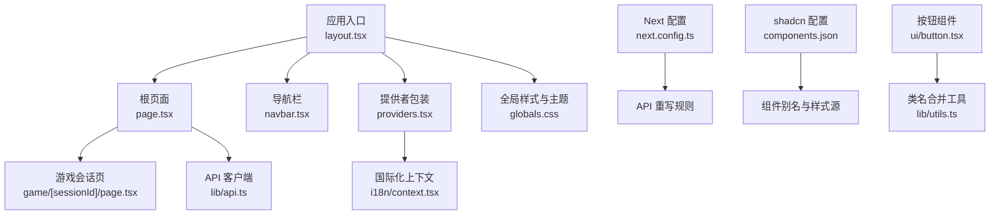
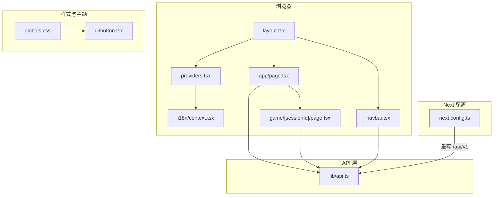
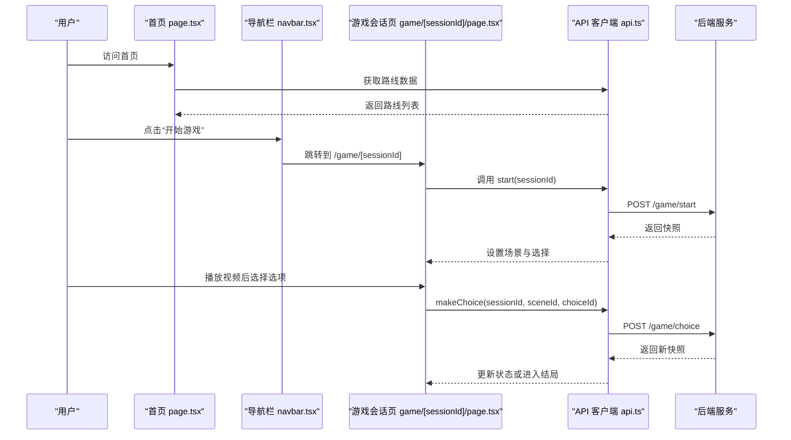
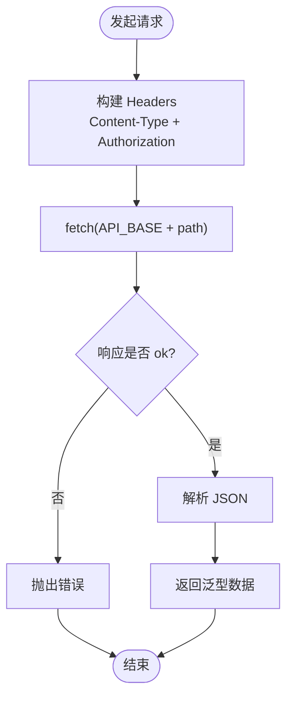
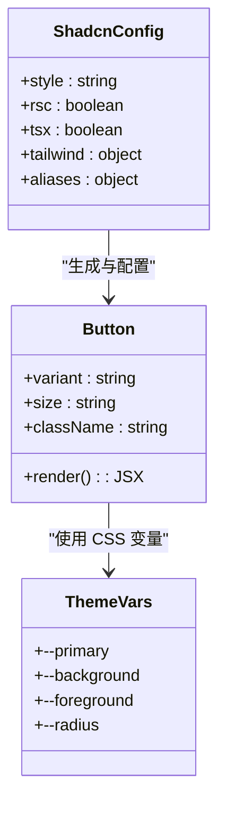
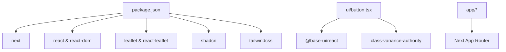

# 前端架构

<cite>
**本文引用的文件**   
- [package.json](file://frontend/package.json)
- [next.config.ts](file://frontend/next.config.ts)
- [components.json](file://frontend/components.json)
- [src/app/layout.tsx](file://frontend/src/app/layout.tsx)
- [src/app/page.tsx](file://frontend/src/app/page.tsx)
- [src/app/game/[sessionId]/page.tsx](file://frontend/src/app/game/[sessionId]/page.tsx)
- [src/components/providers.tsx](file://frontend/src/components/providers.tsx)
- [src/components/navbar.tsx](file://frontend/src/components/navbar.tsx)
- [src/lib/api.ts](file://frontend/src/lib/api.ts)
- [src/lib/i18n/context.tsx](file://frontend/src/lib/i18n/context.tsx)
- [src/lib/i18n/translations.ts](file://frontend/src/lib/i18n/translations.ts)
- [src/components/language-switcher.tsx](file://frontend/src/components/language-switcher.tsx)
- [src/app/globals.css](file://frontend/src/app/globals.css)
- [src/components/ui/button.tsx](file://frontend/src/components/ui/button.tsx)
</cite>

## 目录
1. [简介](#简介)
2. [项目结构](#项目结构)
3. [核心组件](#核心组件)
4. [架构总览](#架构总览)
5. [详细组件分析](#详细组件分析)
6. [依赖关系分析](#依赖关系分析)
7. [性能考量](#性能考量)
8. [故障排查指南](#故障排查指南)
9. [结论](#结论)
10. [附录](#附录)

## 简介
本文件为澳秘 Macau Mystery 前端应用的完整架构文档，基于 Next.js 16 + React 19 与 App Router，结合 shadcn/ui、Tailwind CSS 与自定义主题，构建沉浸式互动剧本游戏体验。文档覆盖路由系统、组件层次、状态管理策略、API 集成层、UI 组件库设计、响应式布局、国际化支持、主题定制、前后端通信模式、错误处理机制、性能优化策略与代码组织规范，并提供组件复用模式、自定义 Hook 设计与第三方服务集成方案，帮助前端开发者快速理解并高效扩展。

## 项目结构
前端采用 Next.js App Router 的目录结构，页面按功能域划分（如 game、create、admin、community），通用 UI 组件集中在 components/ui，业务组件位于 components，公共逻辑与工具在 lib 下。全局样式与主题通过 globals.css 集中管理，Next 配置用于 API 代理重写，shadcn/ui 通过 components.json 定义别名与样式来源。



图表来源
- [src/app/layout.tsx:1-62](file://frontend/src/app/layout.tsx#L1-L62)
- [src/app/page.tsx:1-453](file://frontend/src/app/page.tsx#L1-L453)
- [src/components/providers.tsx:1-8](file://frontend/src/components/providers.tsx#L1-L8)
- [src/lib/i18n/context.tsx:1-56](file://frontend/src/lib/i18n/context.tsx#L1-L56)
- [src/app/game/[sessionId]/page.tsx:1-194](file://frontend/src/app/game/[sessionId]/page.tsx#L1-L194)
- [src/lib/api.ts:1-216](file://frontend/src/lib/api.ts#L1-L216)
- [src/app/globals.css:1-331](file://frontend/src/app/globals.css#L1-L331)
- [next.config.ts:1-15](file://frontend/next.config.ts#L1-L15)
- [components.json:1-26](file://frontend/components.json#L1-L26)
- [src/components/ui/button.tsx:1-59](file://frontend/src/components/ui/button.tsx#L1-L59)

章节来源
- [package.json:1-37](file://frontend/package.json#L1-L37)
- [next.config.ts:1-15](file://frontend/next.config.ts#L1-L15)
- [components.json:1-26](file://frontend/components.json#L1-L26)
- [src/app/layout.tsx:1-62](file://frontend/src/app/layout.tsx#L1-L62)

## 核心组件
- 根布局与元数据：定义字体变量、视口、站点标题与描述，挂载 Providers、MouseFollower、Navbar 与 Footer，统一语言与主题环境。
- 首页：包含 Hero 区域、特性展示、路线时间线、登录引导；使用 i18n 文本与 adminApi 获取路线数据，具备动画与视觉装饰。
- 游戏会话页：加载并渲染场景视频、章节信息、线索数量与进度；根据选择推进剧情，处理结束分支与错误重试。
- 导航栏：响应式导航、移动端抽屉菜单、用户状态显示与退出、语言切换器集成。
- 提供者：包裹 LanguageProvider，确保全应用可访问国际化能力。
- API 客户端：封装请求、鉴权头注入、错误抛出；提供 Game/AI/UGC/Admin/Auth 等模块接口类型与方法。
- 国际化：Context 提供 locale、setLocale、t 方法，持久化到 localStorage，支持 en/zh-CN/zh-TW。
- 主题与样式：globals.css 定义明暗主题色板、动画关键帧、图案背景、玻璃态与光标跟随效果；shadcn/ui 通过 Tailwind 变量驱动。

章节来源
- [src/app/layout.tsx:1-62](file://frontend/src/app/layout.tsx#L1-L62)
- [src/app/page.tsx:1-453](file://frontend/src/app/page.tsx#L1-L453)
- [src/app/game/[sessionId]/page.tsx:1-194](file://frontend/src/app/game/[sessionId]/page.tsx#L1-L194)
- [src/components/navbar.tsx:1-186](file://frontend/src/components/navbar.tsx#L1-L186)
- [src/components/providers.tsx:1-8](file://frontend/src/components/providers.tsx#L1-L8)
- [src/lib/api.ts:1-216](file://frontend/src/lib/api.ts#L1-L216)
- [src/lib/i18n/context.tsx:1-56](file://frontend/src/lib/i18n/context.tsx#L1-L56)
- [src/lib/i18n/translations.ts:1-464](file://frontend/src/lib/i18n/translations.ts#L1-L464)
- [src/app/globals.css:1-331](file://frontend/src/app/globals.css#L1-L331)

## 架构总览
应用以 Next.js App Router 为核心，页面组件通过 Context 共享国际化状态，API 层统一封装请求与鉴权，UI 层由 shadcn/ui 与 Tailwind 变量驱动主题。Next 配置将 /api/v1 路径重写至后端服务，实现前后端解耦。



图表来源
- [src/app/layout.tsx:1-62](file://frontend/src/app/layout.tsx#L1-L62)
- [src/components/providers.tsx:1-8](file://frontend/src/components/providers.tsx#L1-L8)
- [src/lib/i18n/context.tsx:1-56](file://frontend/src/lib/i18n/context.tsx#L1-L56)
- [src/components/navbar.tsx:1-186](file://frontend/src/components/navbar.tsx#L1-L186)
- [src/app/page.tsx:1-453](file://frontend/src/app/page.tsx#L1-L453)
- [src/app/game/[sessionId]/page.tsx:1-194](file://frontend/src/app/game/[sessionId]/page.tsx#L1-L194)
- [src/lib/api.ts:1-216](file://frontend/src/lib/api.ts#L1-L216)
- [next.config.ts:1-15](file://frontend/next.config.ts#L1-L15)
- [src/app/globals.css:1-331](file://frontend/src/app/globals.css#L1-L331)
- [src/components/ui/button.tsx:1-59](file://frontend/src/components/ui/button.tsx#L1-L59)

## 详细组件分析

### 路由系统与页面流
- App Router 路由：根布局 layout.tsx 提供全局上下文与框架；首页 page.tsx 作为入口；游戏会话页 game/[sessionId]/page.tsx 动态路由承载单局流程。
- 页面职责：首页负责品牌展示与功能入口；游戏页负责场景渲染、选择交互与结局处理；导航栏提供跨页面跳转与用户状态控制。



图表来源
- [src/app/page.tsx:1-453](file://frontend/src/app/page.tsx#L1-L453)
- [src/components/navbar.tsx:1-186](file://frontend/src/components/navbar.tsx#L1-L186)
- [src/app/game/[sessionId]/page.tsx:1-194](file://frontend/src/app/game/[sessionId]/page.tsx#L1-L194)
- [src/lib/api.ts:1-216](file://frontend/src/lib/api.ts#L1-L216)

章节来源
- [src/app/layout.tsx:1-62](file://frontend/src/app/layout.tsx#L1-L62)
- [src/app/page.tsx:1-453](file://frontend/src/app/page.tsx#L1-L453)
- [src/app/game/[sessionId]/page.tsx:1-194](file://frontend/src/app/game/[sessionId]/page.tsx#L1-L194)

### 状态管理与国际化
- 国际化 Context：LanguageProvider 维护 locale 与 t 函数，持久化到 localStorage，支持回退到英文键值；useTranslation Hook 暴露给任意组件。
- 语言切换器：LanguageSwitcher 提供下拉选择，点击后更新 locale 并关闭菜单。
- 页面内状态：首页与游戏页使用 useState/useEffect 管理加载、错误、快照与交互状态；无全局状态库，保持轻量。

```mermaid
classDiagram
class LanguageProvider {
+locale : string
+setLocale(locale) : void
+t(key) : string
}
class useTranslation {
+returns : { locale, setLocale, t }
}
class LanguageSwitcher {
+render() : JSX
}
LanguageProvider <.. useTranslation : "提供上下文"
LanguageSwitcher --> useTranslation : "读取与更新"
```

图表来源
- [src/lib/i18n/context.tsx:1-56](file://frontend/src/lib/i18n/context.tsx#L1-L56)
- [src/lib/i18n/translations.ts:1-464](file://frontend/src/lib/i18n/translations.ts#L1-L464)
- [src/components/language-switcher.tsx:1-59](file://frontend/src/components/language-switcher.tsx#L1-L59)

章节来源
- [src/lib/i18n/context.tsx:1-56](file://frontend/src/lib/i18n/context.tsx#L1-L56)
- [src/lib/i18n/translations.ts:1-464](file://frontend/src/lib/i18n/translations.ts#L1-L464)
- [src/components/language-switcher.tsx:1-59](file://frontend/src/components/language-switcher.tsx#L1-L59)

### API 集成层与通信模式
- 请求封装：request<T> 统一处理 headers、Authorization 注入、错误抛出与 JSON 解析。
- 模块划分：gameApi、aiApi、ugcApi、adminApi、authApi 分别对应不同业务域，方法签名清晰，类型约束严格。
- 鉴权策略：从 localStorage 读取 token 并附加到 Authorization 头；登录成功后需持久化 token 与用户信息。
- 错误处理：非 ok 响应直接抛错，页面层捕获并提示重试。



图表来源
- [src/lib/api.ts:1-216](file://frontend/src/lib/api.ts#L1-L216)

章节来源
- [src/lib/api.ts:1-216](file://frontend/src/lib/api.ts#L1-L216)

### UI 组件库与主题定制
- shadcn/ui：通过 components.json 配置样式来源与别名，组件基于 @base-ui/react 与 class-variance-authority 实现变体与尺寸。
- 主题系统：globals.css 定义明暗主题变量（颜色、圆角、字体），Tailwind 通过 @theme 映射变量，支持 dark 模式切换。
- 动画与装饰：关键帧动画（浮动、渐变、闪烁）与 Azulejo 图案背景增强文化感；鼠标跟随与玻璃态提升沉浸体验。
- 按钮组件：Button 使用 cva 定义 variant/size 变体，结合 cn 合并类名，保证一致性与可组合性。



图表来源
- [src/components/ui/button.tsx:1-59](file://frontend/src/components/ui/button.tsx#L1-L59)
- [src/app/globals.css:1-331](file://frontend/src/app/globals.css#L1-L331)
- [components.json:1-26](file://frontend/components.json#L1-L26)

章节来源
- [src/components/ui/button.tsx:1-59](file://frontend/src/components/ui/button.tsx#L1-L59)
- [src/app/globals.css:1-331](file://frontend/src/app/globals.css#L1-L331)
- [components.json:1-26](file://frontend/components.json#L1-L26)

### 响应式布局与交互
- 响应式：Tailwind 断点与网格布局适配移动端与桌面端；导航栏在移动端使用 Sheet 抽屉。
- 交互：Hero 区域鼠标移动触发视差效果；按钮 shimmer 动画与卡片 hover 提升反馈；语言切换器点击外部关闭。
- 无障碍：aria-hidden 与语义化标签提升可访问性；焦点与键盘导航遵循基础 UI 组件约定。

章节来源
- [src/app/page.tsx:1-453](file://frontend/src/app/page.tsx#L1-L453)
- [src/components/navbar.tsx:1-186](file://frontend/src/components/navbar.tsx#L1-L186)
- [src/components/language-switcher.tsx:1-59](file://frontend/src/components/language-switcher.tsx#L1-L59)

### 前后端通信与代理
- 代理重写：next.config.ts 将 /api/v1/* 重写至本地后端端口，便于开发联调。
- 基地址：API 客户端通过 API_BASE 拼接路径，统一前缀管理。
- 安全建议：生产环境应使用环境变量与 HTTPS，避免硬编码地址与敏感信息。

章节来源
- [next.config.ts:1-15](file://frontend/next.config.ts#L1-L15)
- [src/lib/api.ts:1-216](file://frontend/src/lib/api.ts#L1-L216)

## 依赖关系分析
- 运行时依赖：Next 16、React 19、Leaflet、react-leaflet、lucide-react、shadcn、Tailwind 与 Base UI。
- 开发依赖：TypeScript、ESLint、Tailwind PostCSS、@types/*。
- 组件依赖：ui/button 依赖 @base-ui/react 与 class-variance-authority；全局样式依赖 Tailwind 与 shadcn 样式。
- 路由依赖：App Router 页面与动态路由参数 useParams。



图表来源
- [package.json:1-37](file://frontend/package.json#L1-L37)
- [src/components/ui/button.tsx:1-59](file://frontend/src/components/ui/button.tsx#L1-L59)

章节来源
- [package.json:1-37](file://frontend/package.json#L1-L37)

## 性能考量
- 首屏优化：首页 Hero 与 SVG 剪影减少图片资源；动画使用 CSS 关键帧与 will-change 提升渲染效率。
- 网络优化：API 请求统一封装，避免重复逻辑；错误快速失败与重试提示改善用户体验。
- 渲染优化：页面级状态最小化，按需加载；视频播放器自动播放与结束事件控制交互时机。
- 主题与样式：Tailwind 变量与 shadcn 组件减少样式体积；dark 模式切换无需重新加载。

[本节为通用指导，不直接分析具体文件]

## 故障排查指南
- API 错误：检查 next.config.ts 的 rewrite 是否正确指向后端；确认 localStorage 中的 token 存在且有效；查看 request 抛出的错误消息。
- 国际化缺失：确认 translations.ts 中是否存在对应 key；LanguageProvider 初始化时是否正确恢复 locale。
- 样式问题：检查 globals.css 的 CSS 变量是否被 Tailwind 正确映射；shadcn 配置是否与当前样式源一致。
- 路由问题：验证 App Router 页面路径与动态参数 sessionId 是否正确传递；导航链接是否匹配预期。

章节来源
- [src/lib/api.ts:1-216](file://frontend/src/lib/api.ts#L1-L216)
- [src/lib/i18n/context.tsx:1-56](file://frontend/src/lib/i18n/context.tsx#L1-L56)
- [src/app/globals.css:1-331](file://frontend/src/app/globals.css#L1-L331)
- [next.config.ts:1-15](file://frontend/next.config.ts#L1-L15)

## 结论
本架构以 Next.js App Router 为中心，结合 shadcn/ui 与 Tailwind 主题系统，构建了可扩展、易维护的前端体系。国际化与 API 层分离清晰，页面职责明确，交互与动画增强沉浸体验。建议在后续迭代中引入更完善的状态管理（如 Zustand/Redux Toolkit）、错误边界与性能监控，进一步提升稳定性与可观测性。

[本节为总结，不直接分析具体文件]

## 附录
- 最佳实践
  - 组件拆分：按功能域与复用粒度拆分子组件，保持单一职责。
  - 类型优先：API 与组件接口使用 TypeScript 严格类型，减少运行时错误。
  - 错误边界：对异步操作与渲染异常进行捕获与降级。
  - 可访问性：遵循 WAI-ARIA 规范，确保键盘与屏幕阅读器友好。
  - 性能监控：接入前端埋点与性能指标采集，持续优化首屏与交互延迟。

[本节为通用指导，不直接分析具体文件]