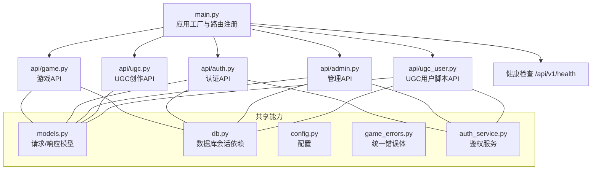
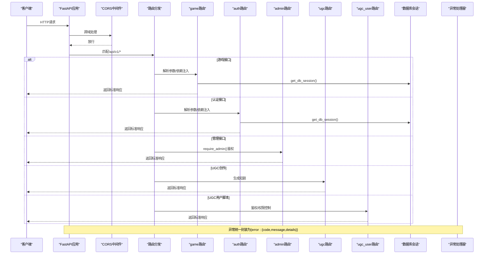
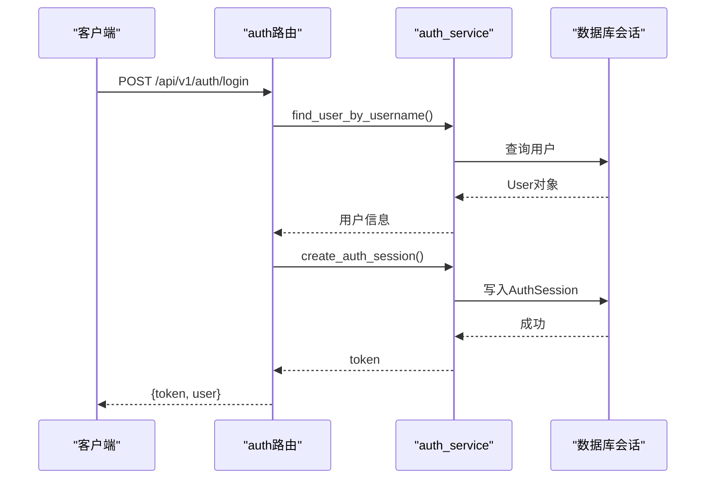
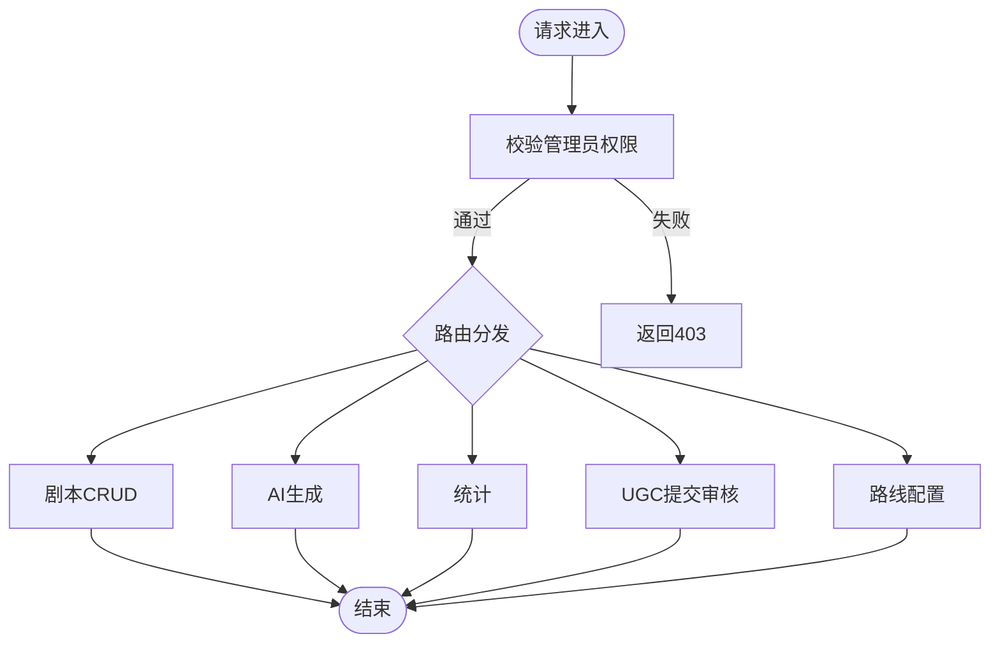
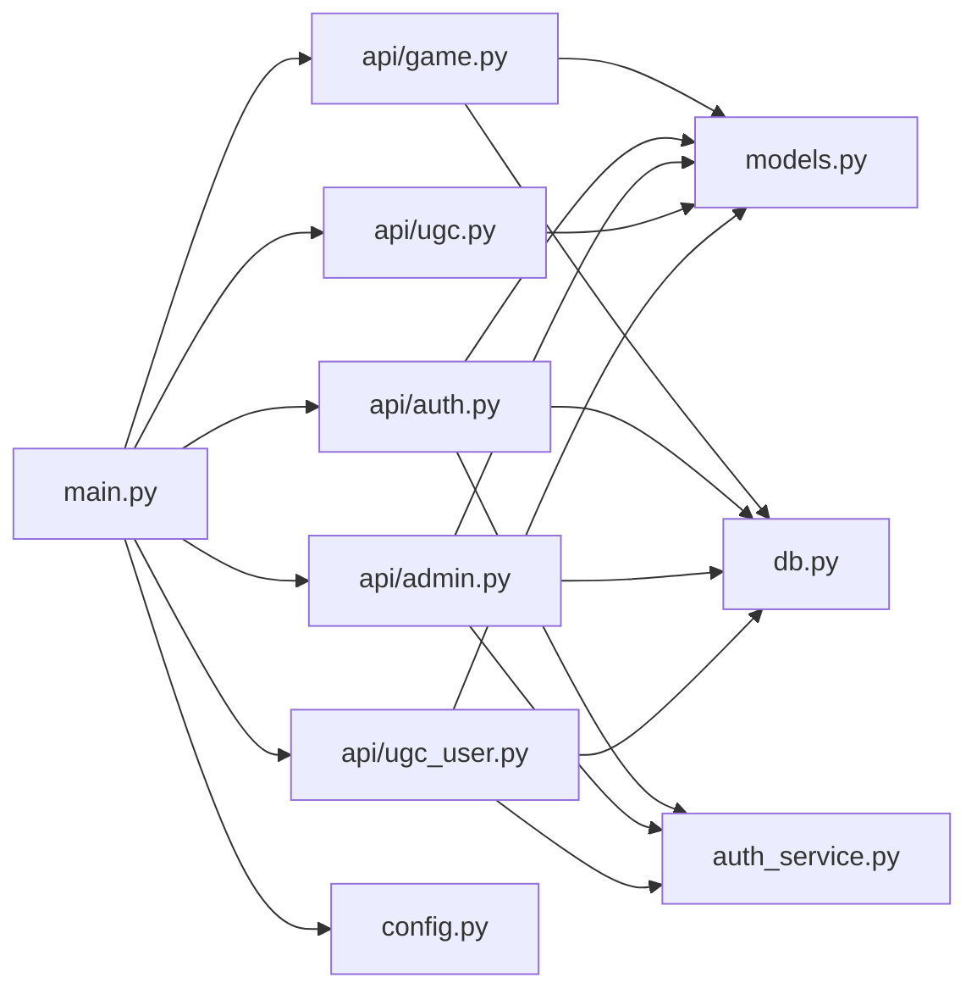

# API路由组织

<cite>
**本文引用的文件**   
- [backend/app/main.py](file://backend/app/main.py)
- [backend/app/api/game.py](file://backend/app/api/game.py)
- [backend/app/api/auth.py](file://backend/app/api/auth.py)
- [backend/app/api/admin.py](file://backend/app/api/admin.py)
- [backend/app/api/ugc.py](file://backend/app/api/ugc.py)
- [backend/app/api/ugc_user.py](file://backend/app/api/ugc_user.py)
- [backend/app/models.py](file://backend/app/models.py)
- [backend/app/config.py](file://backend/app/config.py)
- [backend/app/db.py](file://backend/app/db.py)
- [backend/app/game_errors.py](file://backend/app/game_errors.py)
- [backend/app/auth_service.py](file://backend/app/auth_service.py)
</cite>

## 目录
1. [简介](#简介)
2. [项目结构](#项目结构)
3. [核心组件](#核心组件)
4. [架构总览](#架构总览)
5. [详细组件分析](#详细组件分析)
6. [依赖关系分析](#依赖关系分析)
7. [性能与扩展性](#性能与扩展性)
8. [故障排查指南](#故障排查指南)
9. [结论](#结论)
10. [附录：新增API模块与版本兼容实践](#附录新增api模块与版本兼容实践)

## 简介
本文件面向澳秘 Macau Mystery 的后端FastAPI应用，系统化梳理API路由的组织方式、URL前缀设计、标签分组策略，以及请求参数验证、响应格式标准化和错误处理统一化机制。文档覆盖以下业务模块的路由划分原则：
- 游戏API：/api/v1/game
- 认证API：/api/v1/auth
- 管理API：/api/v1/admin
- UGC创作API：/api/v1/create（UGC生成）与 /api/v1/ugc（UGC用户脚本管理）

同时说明路由装饰器使用、依赖注入在路由中的应用、中间件链式调用，并提供创建新API模块、实现RESTful接口和设计版本兼容API的实践示例路径。

## 项目结构
后端采用模块化路由设计，每个业务域一个router文件，通过主应用集中注册并设置统一的URL前缀与OpenAPI标签。关键文件职责如下：
- main.py：应用工厂、全局异常处理器、CORS中间件、路由注册与健康检查
- api/*：各业务域路由定义（game、auth、admin、ugc、ugc_user）
- models.py：Pydantic模型，统一请求/响应结构与校验规则
- config.py：运行时配置（数据库、CORS、演示数据开关等）
- db.py：异步数据库引擎与会话依赖
- game_errors.py：游戏领域错误类型与统一错误体
- auth_service.py：鉴权、令牌、角色校验等通用服务



**图表来源** 
- [backend/app/main.py:17-107](file://backend/app/main.py#L17-L107)
- [backend/app/api/game.py:12-36](file://backend/app/api/game.py#L12-L36)
- [backend/app/api/auth.py:24-96](file://backend/app/api/auth.py#L24-L96)
- [backend/app/api/admin.py:12-218](file://backend/app/api/admin.py#L12-L218)
- [backend/app/api/ugc.py:5-34](file://backend/app/api/ugc.py#L5-L34)
- [backend/app/api/ugc_user.py:12-95](file://backend/app/api/ugc_user.py#L12-L95)

**章节来源**
- [backend/app/main.py:17-107](file://backend/app/main.py#L17-L107)
- [backend/app/config.py:38-76](file://backend/app/config.py#L38-L76)

## 核心组件
- 应用工厂与生命周期：create_app构建FastAPI实例，挂载异常处理器、CORS中间件，注册各业务路由与健康检查。
- 路由模块：每个业务域独立router，通过include_router统一挂载到/api/v1/{domain}前缀，并设置OpenAPI tags。
- 依赖注入：数据库会话通过get_db_session提供；鉴权通过Header或依赖函数完成。
- 模型与校验：Pydantic模型集中定义，确保请求/响应一致性与强校验。
- 错误处理：GameError与RequestValidationError统一封装为{error:{code,message,details}}结构。

**章节来源**
- [backend/app/main.py:17-107](file://backend/app/main.py#L17-L107)
- [backend/app/models.py:8-146](file://backend/app/models.py#L8-L146)
- [backend/app/game_errors.py:7-20](file://backend/app/game_errors.py#L7-L20)
- [backend/app/db.py:30-42](file://backend/app/db.py#L30-L42)

## 架构总览
下图展示从客户端请求到业务处理的完整链路，包括中间件、异常处理、依赖注入与路由分发。



**图表来源** 
- [backend/app/main.py:76-107](file://backend/app/main.py#L76-L107)
- [backend/app/api/game.py:15-36](file://backend/app/api/game.py#L15-L36)
- [backend/app/api/auth.py:64-96](file://backend/app/api/auth.py#L64-L96)
- [backend/app/api/admin.py:66-122](file://backend/app/api/admin.py#L66-L122)
- [backend/app/api/ugc.py:8-34](file://backend/app/api/ugc.py#L8-L34)
- [backend/app/api/ugc_user.py:37-95](file://backend/app/api/ugc_user.py#L37-L95)

## 详细组件分析

### 游戏API（/api/v1/game）
- 路由划分原则：围绕“匿名玩家”的沉浸式故事运行时，提供开始、选择、状态查询等核心玩法接口。
- URL设计：/start、/choice、/state/{session_id}，语义清晰且符合REST风格。
- 参数验证：使用Pydantic模型GameStartRequest、ChoiceRequest进行字段长度、正则、必填校验。
- 依赖注入：通过Depends(get_db_session)获取AsyncSession，避免手动管理连接。
- 响应标准化：response_model指定返回结构，response_model_exclude_none减少冗余字段。
- 错误处理：GameError被统一捕获，返回{error:{code,message,details}}。

```mermaid
classDiagram
class GameRouter {
+POST "/start"
+POST "/choice"
+GET "/state/{session_id}"
}
class Models {
+GameStartRequest
+ChoiceRequest
+GameSnapshot
}
class DB {
+get_db_session() AsyncSession
}
GameRouter --> Models : "使用"
GameRouter --> DB : "依赖注入"
```

**图表来源** 
- [backend/app/api/game.py:12-36](file://backend/app/api/game.py#L12-L36)
- [backend/app/models.py:12-92](file://backend/app/models.py#L12-L92)
- [backend/app/db.py:30-33](file://backend/app/db.py#L30-L33)

**章节来源**
- [backend/app/api/game.py:12-36](file://backend/app/api/game.py#L12-L36)
- [backend/app/models.py:12-92](file://backend/app/models.py#L12-L92)

### 认证API（/api/v1/auth）
- 路由划分原则：提供登录、注册、当前用户信息获取，支持Bearer Token鉴权。
- URL设计：/login、/register、/me，简洁直观。
- 参数验证：LoginRequest与RegisterRequest通过field_validator进行用户名、密码、昵称校验。
- 依赖注入：DbSession = Annotated[AsyncSession, Depends(get_db_session)]简化依赖声明。
- 鉴权流程：authenticate_bearer解析Authorization头，校验Token有效性及用户状态。
- 响应标准化：AuthResponse与UserResponse统一返回结构。



**图表来源** 
- [backend/app/api/auth.py:64-87](file://backend/app/api/auth.py#L64-L87)
- [backend/app/auth_service.py:59-97](file://backend/app/auth_service.py#L59-L97)
- [backend/app/db.py:30-33](file://backend/app/db.py#L30-L33)

**章节来源**
- [backend/app/api/auth.py:24-96](file://backend/app/api/auth.py#L24-L96)
- [backend/app/auth_service.py:100-130](file://backend/app/auth_service.py#L100-L130)

### 管理API（/api/v1/admin）
- 路由划分原则：剧本CRUD、AI生成、统计、UGC提交审核、路线配置等管理功能。
- URL设计：/scripts、/scripts/{id}、/scripts/ai-generate、/stats、/submissions、/route。
- 鉴权控制：require_admin强制管理员角色，未授权返回403。
- 依赖注入：DbSession用于数据库操作；authorization通过Header传入。
- 响应标准化：各接口返回明确的数据结构，便于前端消费。



**图表来源** 
- [backend/app/api/admin.py:66-218](file://backend/app/api/admin.py#L66-L218)
- [backend/app/auth_service.py:126-130](file://backend/app/auth_service.py#L126-L130)

**章节来源**
- [backend/app/api/admin.py:12-218](file://backend/app/api/admin.py#L12-L218)

### UGC创作API（/api/v1/create）
- 路由划分原则：面向UGC创作者的AI短剧生成与重新生成接口。
- URL设计：/generate、/regenerate/{script_id}。
- 参数验证：GenerateRequest包含input、style、options等字段。
- 响应标准化：GenerateResponse统一返回script_id、title、chapters、style、era。
- 扩展点：当前为Mock实现，预留接入DeepSeek等LLM的扩展位置。

**章节来源**
- [backend/app/api/ugc.py:5-34](file://backend/app/api/ugc.py#L5-L34)
- [backend/app/models.py:111-123](file://backend/app/models.py#L111-L123)

### UGC用户脚本API（/api/v1/ugc）
- 路由划分原则：用户个人脚本管理、公开/私有发布、提交官方审核、公开列表。
- URL设计：/my-scripts、/publish/{script_id}、/submit/{script_id}、/public。
- 鉴权控制：authenticate_bearer校验用户身份，防止越权访问。
- 依赖注入：DbSession用于数据库操作；authorization通过Header传入。
- 响应标准化：各接口返回明确的数据结构，便于前端消费。

**章节来源**
- [backend/app/api/ugc_user.py:12-95](file://backend/app/api/ugc_user.py#L12-L95)
- [backend/app/auth_service.py:100-130](file://backend/app/auth_service.py#L100-L130)

## 依赖关系分析
- 路由层依赖：所有路由均依赖db.get_db_session提供数据库会话。
- 鉴权依赖：auth、admin、ugc_user路由依赖auth_service进行用户认证与角色校验。
- 模型依赖：所有路由使用models.py中的Pydantic模型进行参数校验与响应序列化。
- 配置依赖：main.py通过config.get_settings获取运行时配置，如CORS、演示数据开关等。



**图表来源** 
- [backend/app/main.py:84-96](file://backend/app/main.py#L84-L96)
- [backend/app/api/game.py:7-9](file://backend/app/api/game.py#L7-L9)
- [backend/app/api/auth.py:11-21](file://backend/app/api/auth.py#L11-L21)
- [backend/app/api/admin.py:9-10](file://backend/app/api/admin.py#L9-L10)
- [backend/app/api/ugc.py:3](file://backend/app/api/ugc.py#L3)
- [backend/app/api/ugc_user.py:9-10](file://backend/app/api/ugc_user.py#L9-L10)

**章节来源**
- [backend/app/main.py:84-96](file://backend/app/main.py#L84-L96)
- [backend/app/models.py:8-146](file://backend/app/models.py#L8-L146)
- [backend/app/db.py:30-42](file://backend/app/db.py#L30-L42)
- [backend/app/auth_service.py:100-130](file://backend/app/auth_service.py#L100-L130)
- [backend/app/config.py:56-76](file://backend/app/config.py#L56-L76)

## 性能与扩展性
- 中间件优化：CORS中间件仅在必要时启用，避免不必要的开销。
- 数据库会话：使用异步会话池，提高并发处理能力。
- 模型校验：Pydantic模型在路由入口处进行校验，减少无效请求进入业务逻辑。
- 错误处理：统一异常处理器减少重复代码，提升可维护性。
- 扩展建议：
  - 引入缓存层（如Redis）存储热点数据（如剧本元数据、用户会话）。
  - 增加限流中间件保护敏感接口（如登录、AI生成）。
  - 使用异步任务队列处理耗时操作（如AI生成、视频转码）。

[本节为通用指导，不直接分析具体文件]

## 故障排查指南
- 数据库连接问题：检查DATABASE_URL配置与alembic迁移是否执行。
- 鉴权失败：确认Authorization头格式为"Bearer <token>"，token未过期且用户激活。
- 参数校验错误：查看RequestValidationError返回的details字段，定位具体字段问题。
- 游戏错误：GameError会返回统一的{error:{code,message,details}}结构，便于前端处理。

**章节来源**
- [backend/app/main.py:38-74](file://backend/app/main.py#L38-L74)
- [backend/app/game_errors.py:7-20](file://backend/app/game_errors.py#L7-L20)
- [backend/app/auth_service.py:100-130](file://backend/app/auth_service.py#L100-L130)

## 结论
本项目通过模块化路由设计、统一的参数校验与错误处理、清晰的URL前缀与标签分组，实现了高内聚、低耦合的API架构。各业务域路由职责明确，依赖注入与中间件机制保障了系统的可扩展性与可维护性。遵循本文档的设计原则与实践，可以快速扩展新的API模块并保持整体一致性。

[本节为总结，不直接分析具体文件]

## 附录：新增API模块与版本兼容实践

### 如何创建新的API模块
1. 在app/api目录下新建模块文件（如new_module.py），定义APIRouter。
2. 使用Pydantic模型定义请求/响应结构，确保参数校验与响应标准化。
3. 在main.py中导入新路由并通过include_router注册，设置prefix与tags。
4. 如需鉴权，集成auth_service中的authenticate_bearer或require_admin。

**章节来源**
- [backend/app/api/game.py:12-36](file://backend/app/api/game.py#L12-L36)
- [backend/app/main.py:84-96](file://backend/app/main.py#L84-L96)

### 如何实现RESTful接口
- 使用HTTP动词表达资源操作：GET（读取）、POST（创建）、PUT（更新）、DELETE（删除）。
- URL设计遵循资源命名规范：/api/v1/{resource}/{id}。
- 响应结构统一：使用response_model指定返回结构，避免冗余字段。

**章节来源**
- [backend/app/api/admin.py:71-122](file://backend/app/api/admin.py#L71-L122)
- [backend/app/api/ugc_user.py:37-95](file://backend/app/api/ugc_user.py#L37-L95)

### 如何设计版本兼容的API
- 使用URL前缀区分版本：/api/v1、/api/v2等。
- 保持向后兼容：新增字段时默认值设为None或空字符串，避免破坏现有客户端。
- 废弃接口标记：通过OpenAPI tags或文档说明废弃接口，逐步迁移。

**章节来源**
- [backend/app/main.py:91-96](file://backend/app/main.py#L91-L96)
- [backend/app/models.py:8-146](file://backend/app/models.py#L8-L146)